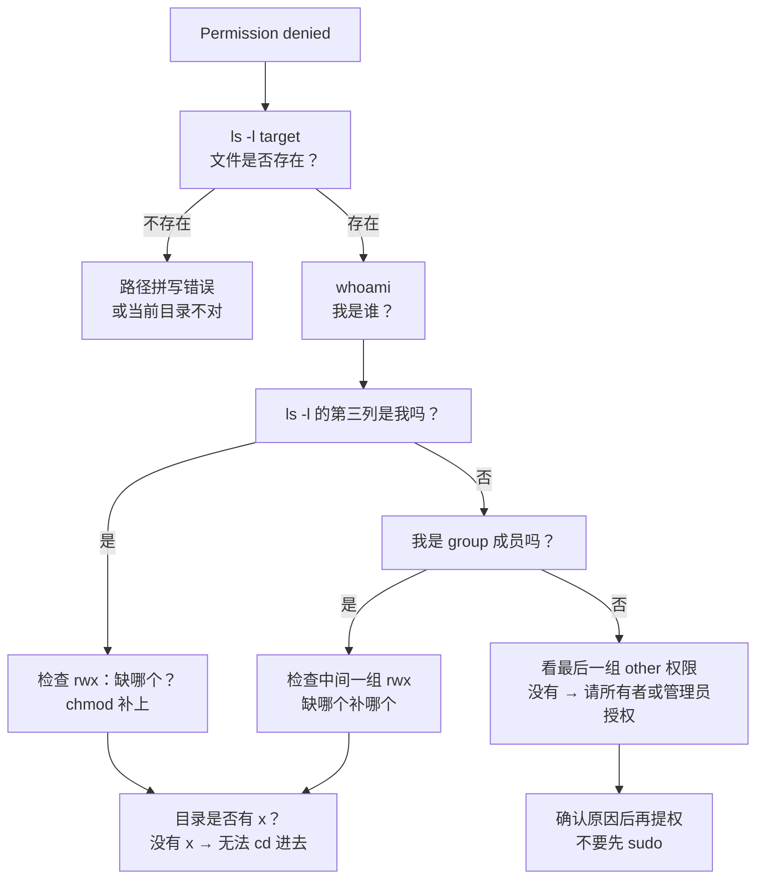

# $\rm Chapter \, 4$ 权限与用户管理

> 在[文件系统与路径](03-文件系统路径与权限.md)中，你已经能创建、读取、移动和删除文件——你知道文件在哪里，以及怎样用路径找到它。但迟早会遇到这样的情况：同一个文件，别人能读你却读不了；或者文件明明就在那里，程序却提示 `Permission denied`。本章回答：系统凭什么允许或拒绝一次访问。你会学到 Unix 与 Windows 各自的权限模型、怎样查看和修改权限、以及"管理员"这把钥匙什么时候才真的需要。学完后，你能按证据独立排查权限问题，而不是一遇到拒绝就求助管理员权限；这是后面 SSH、系统服务和部署章节的基础。

> **开始前自检**：本章假设你已经会：□ 用 cd、ls 在目录间移动并查看内容（第 2、3 章）；
> □ 会查看文件内容；
> □ 理解路径如何定位文件与目录。

## $\rm \S \, 4.1$ 权限：系统凭什么允许或拒绝

你已经能在终端中创建、读取和删除文件。但迟早会遇到：

```text
Permission denied
Access is denied
```

**权限**（permission）回答两个问题：**谁**可以对这个文件做**什么**。

### $\rm \S \, 4.1.1$ Unix/Linux 权限模型

每个文件有三组权限，分别对应三类身份：

```text
-rwxr-xr--  1 alice  staff  4096 Mar 10 14:30 script.sh
 ↑  ↑  ↑
 |  |  其他用户（others）→ r--
 |  所属组（group）    → r-x
 所有者（owner）       → rwx
```

第一个字符表示类型（`-` 普通文件，`d` 目录，`l` 符号链接），接下来每三个字符一组。

每组三个字符的含义：

| 字符 | 含义 |
|---|---|
| `r` | **读**（read）：查看文件内容，列出目录内容 |
| `w` | **写**（write）：修改文件内容，在目录中创建/删除文件 |
| `x` | **执行**（execute）：运行文件（对普通文件），进入目录（对目录） |

如果某个权限被 `-` 替代，表示该身份没有这项权限。

> **对目录来说，`x` 权限特别容易误解**。即使你对一个目录有 `r` 权限（可以列出内容），没有 `x` 权限你也无法 `cd` 进去，也无法访问其中的文件——即使你知道文件名且对该文件有全部权限。可以把目录的 `x` 理解为"允许穿过这道门"。

### $\rm \S \, 4.1.2$ 数字表示法

你经常在教程中看到类似 `chmod 755` 这样的写法。它是把每组三个权限编码为一个 0-7 的数字：

```text
r = 4
w = 2
x = 1

7 = rwx = 4+2+1
6 = rw- = 4+2
5 = r-x = 4+1
4 = r-- = 4
0 = --- = 0
```

`755` 展开就是：

```text
7   = rwx
5   = r-x
5  = r-x
```

常见组合：

| 数字 | 含义 | 典型用途 |
|---|---|---|
| `755` | 所有者全权限，其他人读+执行 | 可执行程序、目录 |
| `644` | 所有者读写，其他人只读 | 普通数据文件 |
| `700` | 仅所有者全权限 | SSH 私钥、个人脚本 |
| `600` | 仅所有者读写 | 敏感配置文件 |

### $\rm \S \, 4.1.3$ 修改权限

```bash
# 符号模式（推荐初学使用——意图更明确）
chmod u+x script.sh     # 给 owner 加执行权限
chmod g-w data.txt      # 去掉 group 的写权限
chmod o-rwx secret.key  # 去掉 others 的全部权限

# 数字模式
chmod 755 script.sh
chmod 600 ~/.ssh/id_rsa
```

修改所有者（通常需要管理员权限）：

```bash
chown alice:staff file.txt
```

### $\rm \S \, 4.1.4$ Windows 权限模型

Windows 使用更细粒度的 ACL（Access Control List）系统，但日常开发中最常见的情况类似：

- 程序试图写入 `C:\Program Files\` 或系统目录时被拒绝（需要管理员权限）。
- 文件被另一个程序锁定打开时，其他程序无法写入。

PowerShell 中查看文件权限用：

```powershell
Get-Acl file.txt | Format-List
```

**Windows 和 Linux 权限模型不可直接互相翻译**。不要试图用 Linux 的 `rwx` 思维去理解 Windows ACL。在跨平台开发中，关键是理解"操作被拒绝"的大类原因（权限不足 / 文件被占用 / 路径不存在），并在各自系统中用相应的工具收集证据。

### $\rm \S \, 4.1.5$ 排查"Permission denied"的标准流程

这是你从 OJ 进入开发后，第一个真正独立的排障模式。遇到拒绝访问时，不要立即尝试管理员权限，而是按顺序收集证据：



> **记一个实用命令**：`stat` 比 `ls -l` 输出更详细（inode、块数、最后访问时间），`namei -l /path/to/file` 逐级解析路径中每一层目录的权限。排查深层目录权限问题时这两个命令可以省你很多时间。

1. **确认文件/目录是否存在**：`ls -l target` 或 `Test-Path target`
2. **确认当前身份**：
   ```bash
   whoami       # Bash
   ```
   ```powershell
   whoami       # PowerShell 同样可用
   ```
3. **查看文件权限和所有者**：
   ```bash
   ls -l target       # Bash — 输出前三列是权限、硬链接数、所有者、组
   stat target        # 更详细：inode、块数、时间戳
   ```
   ```powershell
   Get-Acl target | Format-List   # PowerShell
   ```
4. **判断问题类别**：
   - 自己是所有者但有 `r--` 而没有 `w` → 去掉写保护或加写权限
   - 自己不是所有者、other 没有权限 → 需要所有者或管理员授权
   - 目录没有 `x` 权限 → 即使文件有权限也无法访问
   - 父目录没有相应权限 → 即使子文件有权限也会被拦住
   - 逐级排查深层路径：`namei -l /a/b/c/d/file` 一眼看到哪一层断了
5. **只有在确认了原因之后**，再决定是否需要提权、修改权限或更改路径。

---

## $\rm \S \, 4.2$ 管理员与 root：一把需要理由的钥匙

### $\rm \S \, 4.2.1$ 它们是什么

- **Windows 管理员**（Administrator）：完整控制系统的账户。即使用户是管理员，Windows 默认也不以管理员权限运行程序——这是 UAC（用户账户控制）机制。
- **Linux root**：用户 ID 为 0 的超级用户，可以绕过几乎所有权限检查。

### $\rm \S \, 4.2.2$ 什么时候确实需要提权

- 安装系统级软件（如编译器、驱动、系统服务）；
- 修改 `C:\Program Files\`、`/etc/`、`/usr/`、`/opt/` 等系统目录；
- 绑定小于 1024 的端口（Linux 传统限制）；
- 修改系统配置、启用服务。

### $\rm \S \, 4.2.3$ 什么时候绝对不要用提权来解决

- 文件在你自己目录下却提示权限不足 → 检查文件当前的权限和所有者，可能是复制时带过来的限制；
- Git 操作提示权限问题 → 通常是 SSH key 权限太松或仓库文件所有者不对；
- `npm install` / `pip install` 提示权限 → 用项目级安装而非全局安装，或使用虚拟环境；
- 程序提示"端口被占用" → 找到占用者，而不是用 root 强绑定。

> **经验规则**：如果你说不清为什么需要管理员权限，就不要用。先用普通用户排查。能用普通用户解决的问题，永远不要用管理员解决——管理员权限会掩盖权限配置错误，并让一个拼写错误可能具有删除系统文件的破坏力。

---

## $\rm \S \, 4.3$ 常见错误及其证据

### $\rm \S \, 4.3.1$ "Permission denied"

排查流程见[4.1 节](#415-排查permission-denied的标准流程)。补充一个常见变种：目录的 `x` 权限缺失。即使你对 `/home/alice/data/file.txt` 有读写权限，如果 `/home/alice/data` 目录没有 `x` 权限，你连目录都进不去。

### $\rm \S \, 4.3.2$ "文件被另一个程序占用"（Windows 特有）

症状：尝试写入或删除一个文件，提示"文件正在使用中"。

证据收集：

```powershell
# 查看哪些进程正在使用某个文件（需要管理员权限）
# 如果没有管理员权限，先判断是不是自己打开了它（编辑器、终端等）
```

有时候最常见的"占用者"是你自己——你在编辑器中打开着这个文件，或者在另一个终端窗口中运行着使用该文件的程序。

---

## $\rm \S \, 4.4$ 动手实践

在一个新建的安全目录中完成。所有操作不会影响系统和其他项目。

### 实践一：权限（参考 [4.1 节](#411-unixlinux-权限模型)至 [4.1 节](#413-修改权限)理解模型即可）

1. 创建一个文件 `secret.txt`，写入内容。
2. 运行 `ls -l secret.txt` 记录初始权限。
3. 用 `chmod 600 secret.txt` 改为仅所有者可读写。
4. 用 `chmod 000 secret.txt` 去掉所有权限，尝试 `cat secret.txt`，观察错误信息。
5. 用 `chmod 644 secret.txt` 恢复，确认可以正常读取。
6. 创建一个子目录并去掉其 `x` 权限，尝试 `cd` 进去——观察即使有 `r` 权限也无法进入。

---

## $\rm \S \, 4.5$ 总结

本章回答了"谁可以对文件做什么"：

- **Unix/Linux 用三类身份 × 三种权限描述访问控制**：所有者（owner）、所属组（group）、其他用户（others）各有 `r`（读）、`w`（写）、`x`（执行/进入）。数字表示法（755、644、600、700）把三组权限编码成三位数字，`chmod` 修改权限，`chown` 修改所有者。
- **目录的 `x` 权限决定能否"穿门"**——即使文件本身权限齐全，父目录没有 `x` 也进不去。这是最常见的误判点。
- **Windows 的权限模型是 ACL**，与 Linux 的 `rwx` 不可直接互相翻译；跨平台排查先判断"权限不足 / 文件被占用 / 路径不存在"三个大类。
- **"Permission denied" 的排查有固定顺序**：确认文件存在 → 确认当前身份 → 查看权限与所有者 → 逐级检查父目录 → 确认原因后再决定是否提权。
- **管理员/root 是最后手段，不是第一反应**。自己目录下的权限问题、端口被占用、依赖安装失败，几乎都不需要提权；先解释清楚"为什么需要"，再使用它。

---

## $\rm \S \, 4.6$ 关键概念回顾

1. 文件权限 `-rwxr-xr--` 中，所有者、组和其他用户的权限分别是什么？

2. 数字权限 755 和 600 分别对应什么字符权限？各自典型用途是什么？

3. 为什么对目录没有 `x` 权限就无法 `cd` 进去，即使你有 `r` 权限且知道里面文件的名字？

4. 你是文件所有者却遇到 Permission denied，第一步应该检查什么？

5. 什么时候才应该使用管理员/root 提权？什么时候绝对不应该？

## $\rm \S \, 4.7$ 应用与辨析

6. 对一个目录你只有 `r` 没有 `x`，能列出它的内容吗？能读取里面的文件吗？

7. 一个脚本被 `chmod 755` 后，其他用户可以修改它吗？

8. 遇到 "Permission denied" 时，应该按什么顺序收集证据？

## $\rm \S \, 4.8$ 本章自测答案

> 先闭卷作答本章"关键概念回顾"与"应用与辨析"，再核对以下答案。

### 自测答案 · 关键概念回顾
1. 所有者 rwx（读写执行）、所属组 r-x（读+执行）、其他用户 r--（只读）。
2. 755 = rwxr-xr-x，用于可执行程序和目录；600 = rw-------，仅所有者读写，用于 SSH 私钥等敏感文件。
3. 目录的 `x` 权限决定能否"穿过这道门"——进入目录、访问其中任何文件都需要它；`r` 只允许列出内容。
4. 用 `ls -l` 看权限位缺什么（用 `chmod` 补上），并逐级检查父目录的 `x` 权限——问题常常出在目录而不是文件本身。
5. 安装系统级软件、修改系统目录、绑定小于 1024 的端口等系统级操作才需要提权；自己目录下的权限问题、端口被占用、依赖安装失败都不用，先用普通用户排查。

### 自测答案 · 应用与辨析
6. 能列出内容（`ls` 可以看到名字），但不能 `cd` 进入，也无法访问其中任何文件——目录的 `x` 是"进门"权限。
7. 不能——other 只有 r-x（读+执行），没有 `w`；只有所有者能修改文件内容。
8. 确认文件/目录存在（`ls -l`）→ 确认当前身份（`whoami`）→ 查看权限和所有者（`ls -l`/`stat`/`Get-Acl`）→ 判断缺哪个权限、逐级检查父目录的 `x` → 确认原因后再决定是否提权。

---

有了文件操作和访问控制这两块基础，你已经可以放心地创建和组织自己的项目了。下一章[编辑器、IDE与调试器](05-编辑器IDE与调试器.md)将回答一个你很可能已经在想的问题：写代码当然不只靠 `cd`、`ls` 和 `chmod`。你需要一个能高亮语法、自动补全、帮你重构和断点调试的强大工具——编辑器和 IDE 到底有什么区别？调试器又是怎样让你"暂停"一个正在运行的程序？

> 你现在能：读懂 ls -l / stat 输出里的所有者和权限位，解释 rwx 对文件与目录的区别，并依据证据排查 Permission denied
