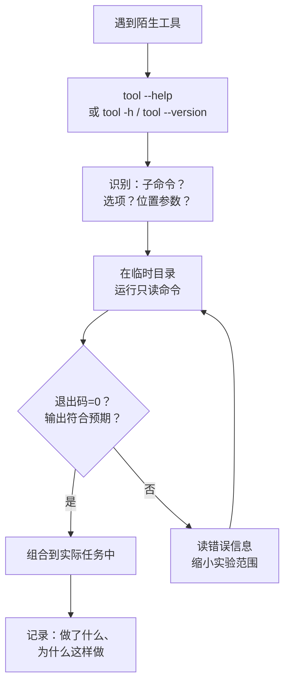

# $\rm Chapter \,  6$ 开发者命令行工具箱

> 从[计算机程序与开发全景](../01-基础观念/01-计算机程序与开发全景.md)到[文本、编码、压缩包与常见数据格式](05-文本编码压缩包与数据格式.md)的几章给了你理论框架。这一章把理论落地为一组日常工具，按任务类型组织：选择工具→阅读帮助→组合工具→验证结果。

## $\rm \S \, 6.1$ 按任务类型找工具

你已经会了 `cd`、`ls`、`pwd`、`cat`、`echo`。现在的问题是：当你需要做一件"我确定有工具能做但不知道叫什么"的事时，该怎么办？

本章按**任务类型**组织工具，而不是按字母表罗列。你不用背所有命令——知道每个任务类别下存在一个工具就够了。所有工具均解释 Windows PowerShell 和 Linux/Bash 中的对应方式。直接在你的终端中跑最小示例，用 `--help` 探索更多选项，然后回到贯穿项目用这些工具解决实际问题。

---

## $\rm \S \, 6.2$ 文件与文本

### $\rm \S \, 6.2.1$ "这个文件太大了，我不想全部打开"

**分页查看**——一次看一屏，按空格翻页，按 `q` 退出。

```bash
# Bash
less huge_papers.json    # 空格翻页，/搜索，q退出
```

```powershell
# PowerShell
Get-Content huge_papers.json | Out-Host -Paging
# 或者
more huge_papers.json
```

`less` 比你想象的强大：按 `/` 后输入关键词可以搜索，按 `n` 跳到下一个匹配，按 `g` 跳到文件开头，按 `G` 跳到文件末尾。

### $\rm \S \, 6.2.2$ "我只想看文件的前几行或后几行"

```bash
# Bash
head -n 10 papers.csv      # 前 10 行
tail -n 10 papers.csv      # 最后 10 行
tail -f server.log         # 实时追踪文件末尾的新增内容（-f = follow）
```

```powershell
# PowerShell
Get-Content papers.csv -Head 10
Get-Content papers.csv -Tail 10
Get-Content server.log -Tail 10 -Wait    # 类似 tail -f
```

`tail -f` 是观察日志的标配——你启动一个服务后，在一个终端窗口中 `tail -f` 日志文件，另一个窗口中发送请求，就能实时看到服务记录了什么。

### $\rm \S \, 6.2.3$ "这个目录下哪个文件里写了 `connectTimeout`？"

**搜索文件内容**：

```bash
# Bash — grep 和 ripgrep
grep -r "connectTimeout" src/        # -r = 递归搜索目录
grep -rn "connectTimeout" src/       # -n = 显示行号
grep -rn --include="*.cpp" "TODO" src/

# rg 更快，默认递归、忽略 .git 和二进制文件
rg "connectTimeout" src/
rg -l "connectTimeout" src/          # 只列出文件名
```

```powershell
# PowerShell
Select-String -Path "src\*.cpp" -Pattern "connectTimeout"
Select-String -Path "src\*" -Pattern "connectTimeout" -Recurse
```

> **竞赛生迁移提示**：`grep` 的搜索相当于对目录树做一次遍历，在访问的每个文件中检查模式是否出现。`rg`（ripgrep）做了大量工程优化——并行搜索、智能跳过 `.git` 和二进制文件，在大项目中可能快 10 倍以上。

### $\rm \S \, 6.2.4$ "这两个文件到底哪里不一样？"

**比较文件差异**：

```bash
# Bash
diff old_version.cpp new_version.cpp
diff -u old_version.cpp new_version.cpp    # unified 格式（更易读）
```

```powershell
# PowerShell
Compare-Object (Get-Content old.cpp) (Get-Content new.cpp)
```

VS Code 和其他编辑器的内置 diff 视图（选中两个文件 → 右键 → "Compare Selected"）通常是最直观的选择。命令行的优势在于写进脚本和 CI。

### $\rm \S \, 6.2.5$ "给我提取 JSON 里的某个字段"

```bash
# Bash — jq（一个专门的 JSON 处理器）
cat papers.json | jq '.title'                    # 提取 title 字段
cat papers.json | jq '.[] | {title, year}'        # 提取多个字段
cat papers.json | jq '.[] | select(.year > 2020)'  # 筛选 2020 年后的论文
```

```powershell
# PowerShell — 原生对象管道
$papers = Get-Content papers.json | ConvertFrom-Json
$papers | Select-Object title, year
$papers | Where-Object { $_.year -gt 2020 }
```

`jq` 有自己的查询语言（类似一种精简的函数式表达），官网有交互式教程。从 `jq '.fieldname'` 开始，逐步学习过滤和变换。

### $\rm \S \, 6.2.6$ 压缩与校验（速查）

打包、压缩与校验在[文本、编码、压缩包与常见数据格式](05-文本编码压缩包与数据格式.md)中已经详细讲过（`tar` 打包、`gzip` 压缩、`.tar.gz` 是两层操作的组合、哈希校验文件完整性），这里只给最小命令集合：

```bash
# 创建
tar -czvf archive.tar.gz folder/
zip -r archive.zip folder/

# 查看（不解压）
tar -tzvf archive.tar.gz
unzip -l archive.zip

# 解压
tar -xzvf archive.tar.gz
unzip archive.zip

# 校验
sha256sum downloaded_file.tar.gz
```

```powershell
# 校验
Get-FileHash downloaded_file.tar.gz
```

### $\rm \S \, 6.2.7$ find + xargs：对所有匹配的文件执行操作

`find` 找到文件，但每次找到后手动处理就失去了自动化的意义。`-exec` 和 `xargs` 让 find 的结果自动流入下一个命令。

```bash
# 删除所有 .tmp 文件
find . -name '*.tmp' -delete

# 对所有 .cpp 文件运行 clang-format（-exec 方式）
find src/ -name '*.cpp' -exec clang-format -i {} \;
# {} = 当前文件的路径，\; = 命令结束

# 对所有 .cpp 文件运行 clang-format（xargs 方式，更快——一次传多个文件）
find src/ -name '*.cpp' -print0 | xargs -0 clang-format -i
# -print0 和 -0 用 null 字符分隔文件名，避免空格/换行截断

# 统计项目中所有 .cpp 文件的总行数
find . -name '*.cpp' -print0 | xargs -0 wc -l | tail -1

# 只找最近 7 天内修改过的文件
find . -name '*.md' -mtime -7

# 找大于 10MB 的文件
find . -size +10M
```

`-exec` 和 `xargs` 的区别：`-exec` 对每个文件分别执行一次命令；`xargs` 把尽可能多的文件名拼在一次命令中执行。文件数量少差异不大，文件多时 `xargs` 显著更快。

### $\rm \S \, 6.2.8$ diff：精确描述两个版本的差异

`diff` 比较两个文件（或两个目录），输出它们之间的差异。Git 的每次 `git diff` 底层调用的就是它。OJ 用户习惯于"输出一样还是不一样"的二元判断——diff 告诉你**哪里**不一样：

```bash
# 比较两个文件
diff old.cpp new.cpp
# 输出格式：
# 5c5          ← 第 5 行被改(changed)
# <     return 0;      ← old.cpp 的第 5 行
# ---
# >     return 1;      ← new.cpp 的第 5 行

# 更可读的统一格式（Git 默认格式）
diff -u old.cpp new.cpp
# @@ -5,1 +5,1 @@   ← 位置标记：旧文件第 5 行起 1 行，新文件第 5 行起 1 行
# -    return 0;     ← 删掉的行
# +    return 1;     ← 加上的行

# 比较两个目录
diff -r dir1/ dir2/

# 忽略空白差异
diff -w file1 file2
```

`patch` 是 diff 的逆操作——把 diff 的输出应用到文件上：

```bash
diff -u old.cpp new.cpp > fix.patch   # 生成补丁
patch old.cpp < fix.patch              # 把补丁应用到 old.cpp
# old.cpp 现在和 new.cpp 一样了
```

在 Git 之前，开源社区用 `diff` + `patch` + 邮件列表协作——Linux 内核至今仍然大量使用这个工作流。

### $\rm \S \, 6.2.9$ 现代 Shell 工具：更快、更美、更聪明的替代

`find`、`cat`、`cd`、`Ctrl+R` 这些经典工具可靠地工作了几十年。现代出现了一批替代品，保留原用法，但更快、更好看、默认行为更聪明。不是必装，但用熟之后很难回去：

- **fd**：`find` 的替代。更快、默认遵守 `.gitignore`（不会一头扎进 `node_modules`）、输出带颜色。`fd connectTimeout` 直接搜当前目录（不用写 `.` 和 `-name`），`fd -e cpp` 按扩展名过滤，`fd --type f` 只找文件。
- **bat**：`cat` 的替代。带语法高亮、行号，还能在代码左侧显示 Git 的增删标记。`bat main.cpp` 代替 `cat main.cpp`，`bat --list-themes` 看可选主题。
- **fzf**：交互式模糊查找器——输入文件名的一部分，候选项实时收窄。单独运行 `fzf` 浏览当前目录的文件；它还能接管 `Ctrl+R`（比 §2.11 的原版历史搜索更好用）；`code $(fzf)` 在 VS Code 中打开选中的文件；`git diff --name-only | fzf | xargs git add` 从改动文件里挑出要暂存的部分（Git 第 17 章才正式学，这里先感受组合的威力）。
- **zoxide**：更聪明的 `cd`——记住你最常去的目录。`z proj` 直接跳到 `/home/alice/projects`，哪怕你只输入了 "proj" 三个字符；`zi` 交互式选择目标。安装时它会把 `cd` 绑定为 `z`，之后用法不变。

> **经验规则**：你不需要把这些全部替换——从 `fd` 和 `fzf` 开始，用熟了再加下一个。它们与原版工具并存，随时可以退回。安装：Windows 用 `winget install sharkdp.fd junegunn.fzf sharkdp.bat ajeetdsouza.zoxide`，macOS 用 `brew install fd fzf bat zoxide`，Debian/Ubuntu 用 `sudo apt install fd-find fzf bat zoxide`（Ubuntu 上 fd 的命令名是 `fdfind`）。

---

## $\rm \S \, 6.3$ 网络与 API

### $\rm \S \, 6.3.1$ "这个 API 返回什么？它是不是挂了？"

**`curl`** 是命令行中最通用的 HTTP 客户端——它发送请求并显示响应。

```bash
# GET 请求，显示响应体
curl https://api.github.com/repos/torvalds/linux

# 显示响应头（-i = include headers）
curl -i https://api.github.com

# 只显示响应头（-I = HEAD 请求，只取头部）
curl -I https://example.com

# 带参数的 GET 请求
curl "https://api.example.com/search?q=transformer&limit=10"

# POST JSON 数据
curl -X POST https://api.example.com/papers \
  -H "Content-Type: application/json" \
  -d '{"title":"My Paper","year":2024}'

# 下载文件，保留远程文件名（-O）
curl -O https://example.com/data.tar.gz

# 静默模式（-s = silent），常和管道配合
curl -s https://api.example.com/data | jq '.results'
```

在 PowerShell 中，`curl` 默认是 `Invoke-WebRequest` 的别名——参数不同。安装 Git for Windows 后，Git Bash 中有原版 `curl`。也可以用：

```powershell
Invoke-RestMethod https://api.github.com/repos/torvalds/linux
```

### $\rm \S \, 6.3.2$ "网页加载时到底发了哪些请求？"

`curl` 给你的是"一个请求、一个响应"的视角。但现代网页加载时会发出几十到上百个请求（HTML → CSS → JS → 图片 → API 数据）。

打开浏览器的 **开发者工具**（F12），切换到 **Network（网络）** 标签页，刷新页面。你会看到：
- 每个请求的 URL、方法（GET/POST）、状态码（200/404/500）；
- 请求和响应头；
- 响应体内容；
- 请求的耗时瀑布——DNS 解析→连接→TLS→等待→下载。

这不是"前端开发者才需要的工具"。当你的后端 API 返回了数据但前端显示异常时，Network 面板能直接告诉你：请求发出去了吗？返回了什么？哪个环节耗时最长？

### $\rm \S \, 6.3.3$ "为什么连不上？DNS 有问题还是服务挂了？"

从[计算机程序与开发全景](../01-基础观念/01-计算机程序与开发全景.md)中你就知道：IP 地址大致标识主机，端口帮助操作系统把收到的数据交给正确进程。排查连通性时按网络层从低到高：

```bash
# 1. DNS 解析——域名对应的 IP 是什么？
nslookup api.example.com        # 两个平台通用

# 2. 网络层面能不能到达目标主机？
ping api.example.com            # ICMP 探测。注意：有些服务器禁用 ping 但服务正常

# 3. 特定端口是否开放？
# Bash
nc -zv api.example.com 443      # netcat — 测试 TCP 连接
# PowerShell
Test-NetConnection api.example.com -Port 443
```

> **经验规则**：`ping` 不通不代表服务挂了（防火墙可能屏蔽 ICMP）；`ping` 通了不代表服务正常（端口可能没开）。`ping` 只能回答"IP 层是否可达"，不能替代对具体端口的连接测试。

---

## $\rm \S \, 6.4$ 进程、端口与磁盘

### $\rm \S \, 6.4.1$ "谁在用 8080 端口？"

这是开发中最常见的问题之一——你启动服务时报"端口已被占用"：

```bash
# Bash — 查找监听 8080 端口的进程
lsof -i :8080                    # 列出占用该端口的进程
ss -tlnp | grep 8080             # 更轻量的替代

# 拿到 PID 后查看进程详情
ps -p [PID] -o pid,user,comm,args
```

```powershell
# PowerShell
Get-NetTCPConnection -LocalPort 8080 -ErrorAction SilentlyContinue |
    Select-Object LocalAddress, LocalPort, State, OwningProcess
# OwningProcess 就是 PID
Get-Process -Id [PID]
```

[计算机程序与开发全景](../01-基础观念/01-计算机程序与开发全景.md)中讲过：看到端口冲突不要随机杀进程。先确认占用者是谁、是否应该继续运行，再决定停止它或换端口。

### $\rm \S \, 6.4.2$ "这个进程在干什么？吃了多少资源？"

```bash
# Bash
ps aux | grep python              # 查找包含 "python" 的进程
top                               # 实时资源监控，按 q 退出
htop                              # top 的增强版（需额外安装）
```

```powershell
Get-Process python               # 查看 Python 进程
Get-Process | Sort-Object CPU -Descending | Select-Object -First 10  # CPU 前十
```

`top`/`htop` 的输出中需要关注的列：
- **PID**：进程 ID。
- **%CPU**：CPU 使用率。单核满载是 100%（多核可以超过 100%）。
- **%MEM**：物理内存使用率。
- **VSZ/RSS**：虚拟内存/常驻内存（RSS 更接近"这个进程实际吃了多少 RAM"）。

### $\rm \S \, 6.4.3$ "磁盘怎么满了？哪个目录最大？"

```bash
# Bash
df -h                            # 各分区的使用情况（-h = human readable）
du -sh folder/                   # 某个目录的总大小
du -sh * | sort -hr              # 当前目录下各项按大小降序排列
```

```powershell
Get-PSDrive -PSProvider FileSystem               # 类似 df
Get-ChildItem folder -Recurse | Measure-Object -Property Length -Sum  # 类似 du
```

> **常见陷阱**：`df` 显示磁盘还有空间，但创建文件时报"No space left on device"——这可能是 **inode 耗尽**（Linux）。每个文件系统有最大文件数量限制，大量小文件（如 node_modules 的几十万个小文件）可能耗尽 inode 而磁盘空间仍有余量。`df -i` 查看 inode 使用情况。

### $\rm \S \, 6.4.4$ "我究竟运行的是哪个版本？它装在哪里？"

```bash
# Bash
which python                     # 可执行文件路径
python --version                 # 版本号
python -c "import sys; print(sys.executable)"  # Python 自身的完整路径（最可靠）
```

```powershell
Get-Command python | Select-Object Source    # 可执行文件路径
python --version
```

排查"安装了但找不到"或"版本不对"时，**同时记录版本号和可执行文件路径**。PATH 的搜索机制来自[终端、Shell与命令行](02-终端Shell与命令行.md)——Shell 按目录顺序查找，找到第一个匹配的可执行文件就停止；版本冲突的完整解决会在下一章[软件、运行时、SDK与包管理器](07-软件运行时SDK与包管理器.md)展开。

---

## $\rm \S \, 6.5$ 学会任何陌生工具的标准流程

你会在职业生涯中遇到几十上百个工具——不可能全部预先学完。面对陌生工具时有一套固定的探索流程：



**第一步：确认身份**

```bash
tool --help           # 大多数 CLI 接受（或 -h, -?）
tool --version        # 确认版本
which tool            # 确认可执行文件路径（Bash）
Get-Command tool      # 同上（PowerShell）
```

**第二步：读懂帮助信息**

帮助输出的结构通常是：

```text
用法：tool [全局选项] <子命令> [子命令选项] [参数...]

子命令：
  build    构建项目
  test     运行测试
  run      运行程序

选项：
  -o, --output FILE   输出到 FILE
  -v, --verbose       详细输出
  -q, --quiet         静默模式
```

先找到你要的子命令，再看它的选项。不要试图读完全部帮助——那跟背字典学语言一样低效。

**第三步：只读实验**

```bash
# 在临时目录中操作
mkdir /tmp/tool-test && cd /tmp/tool-test
tool --dry-run ...     # 如果支持 dry-run（模拟运行）
tool list ...          # 只读子命令通常最安全
tool --help subcommand # 子命令的帮助
```

**第四步：验证结果，而不是假设成功**

还记得[计算机程序与开发全景](../01-基础观念/01-计算机程序与开发全景.md)中的退出码吗——程序结束时返回给操作系统的一个整数，`0` 表示成功，非 0 表示某种失败。每次运行工具后，检查：
- 退出码是否为 0；
- 输出是否符合预期；
- 文件是否被创建/修改，内容和权限是否正确。

**第五步：记录**

当你终于搞清楚一个错误时，把完整错误信息、原因和解决方法记下来。半年后你会感谢现在的自己——同样的错误会再次出现，而你已经不记得当初是怎么解决的了。

---

## $\rm \S \, 6.6$ 论文资料管理器：工具箱实战

回到贯穿项目。假设 `paper-manager/` 目录下有数据文件和源码：

```bash
# 找出所有包含 "Attention" 的 JSON 文件
rg "Attention" --type json

# 查看 papers.json 的结构（前 30 行）
head -n 30 papers.json

# 提取所有论文的标题和年份，按年份排序
jq '.[] | {title, year}' papers.json | jq -s 'sort_by(.year)'

# 检查后端服务是否在运行
ss -tlnp | grep 8000
# 或
Get-NetTCPConnection -LocalPort 8000

# 查看日志中最近的错误
tail -n 50 server.log | rg -i error
```

这些命令不要求全部手打——知道它们存在，需要时查回来即可。

---

## $\rm \S \, 6.7$ 动手实践

### 实践一：在项目中搜索

在你的论文管理器项目目录（或任何一个包含多个文件的目录）中：

1. 用 `grep`/`rg`/`Select-String` 找出所有包含 `#include` 的 `.cpp` 或 `.h` 文件。
2. 统计每个文件中 `#include` 出现了多少次。
3. 找出包含 `TODO` 或 `FIXME` 注释的行。

### 实践二：curl 调用公开 API

选择一个不需要认证的公开 API：

```bash
# 查询 GitHub 上某个仓库的信息
curl -s https://api.github.com/repos/torvalds/linux | jq '.stargazers_count, .description'
```

1. 先用 `curl` 查看原始 JSON 响应。
2. 用 `jq`（Bash）或 PowerShell 对象管道提取三个字段。
3. 添加 `-i` 参数查看响应头，找到 `Content-Type` 和状态码。

### 实践三：端口和进程

1. 启动一个简单的 HTTP 服务（Python 一行即可）：

   ```bash
   python -m http.server 9999
   ```

2. 在另一个终端中，用本节学到的工具确认 9999 端口已被占用，并找到对应进程。
3. 用 `Ctrl+C` 停止服务后再次检查端口——确认它已经被释放。

### 实践四：探索陌生工具

选择下面列表中一个你从未用过的工具，仅凭 `--help` 完成一次只读操作：

- `wc` — 统计文件的行数、单词数和字节数
- `sort` — 对文本排序
- `uniq` — 去重或统计重复行
- `cut` — 按分隔符切分每行
- `find` — 按名称、类型、时间等搜索文件（仅用只读选项 `-name`、`-type`）

---

## $\rm \S \, 6.8$ Shell 脚本：让命令序列可复用

前面所有的命令都是你一条条手动输入的。当你需要反复执行同一组命令时（每次改完代码→编译→运行→测试），手动输入是浪费时间且容易出错。Shell 脚本把一组命令写进文件，像程序一样执行。

### $\rm \S \, 6.8.1$ 第一个脚本

```bash
#!/bin/bash
# build.sh —— 编译并运行论文管理器 CLI
set -e          # 任何命令返回非零退出码时立即停止

echo "=== 编译 ==="
g++ -std=c++17 -Wall -Wextra -O2 main.cpp paper.cpp -o paper-cli

echo "=== 运行测试 ==="
./paper-cli papers.txt --year 2017-2020

echo "=== 完成 ==="
```

`#!`（shebang）告诉系统用哪个程序执行此脚本。`set -e` 是最重要的安全设置——没有它，编译失败后脚本会继续执行（用旧的可执行文件运行测试）。

```bash
chmod +x build.sh    # 添加执行权限
./build.sh           # 运行
```

### $\rm \S \, 6.8.2$ 变量、参数与条件

```bash
#!/bin/bash
set -euo pipefail    # -u: 使用未定义变量时报错; -o pipefail: 管道中任一命令失败则整体失败

DATA_FILE="${1:-papers.txt}"     # 第一个参数，默认值 papers.txt
YEAR_MIN="${2:-2017}"

if [ ! -f "$DATA_FILE" ]; then
    echo "错误: $DATA_FILE 不存在" >&2   # >&2 = 输出到 stderr
    exit 1
fi

echo "处理 $DATA_FILE，年份 >= $YEAR_MIN"
./paper-cli "$DATA_FILE" --year "$YEAR_MIN-2025"
```

`"${1:-default}"` 是参数扩展——有参数用参数，没有用默认值。`>&2` 把错误信息输出到 stderr，和程序的退出码一起构成完整的命令行契约。

### $\rm \S \, 6.8.3$ 循环与批量处理

```bash
#!/bin/bash
# 批量清洗所有 CSV 文件
for file in data/*.csv; do
    basename=$(basename "$file" .csv)
    echo "处理: $file → output/${basename}_clean.json"
    python clean.py "$file" "output/${basename}_clean.json"
done
```

### $\rm \S \, 6.8.4$ 函数：脚本内的复用

```bash
#!/bin/bash

check_port() {
    local port=$1       # local = 局部变量，不会泄漏到函数外
    if ss -tlnp | grep -q ":$port "; then
        echo "端口 $port 已被占用"
        return 1
    fi
    return 0
}

if check_port 5000; then
    python app.py
else
    echo "请先释放端口 5000"
    exit 1
fi
```

### $\rm \S \, 6.8.5$ 跨平台注意事项

Bash 脚本在 WSL、Linux 和 macOS 上都能运行（假设解释器路径都是 `/bin/bash`）。PowerShell 脚本（`.ps1`）可以在 Windows 原生环境和 Linux PowerShell Core 上运行。选择哪个？

| 场景 | 选择 |
|------|------|
| 目标环境只有 Linux 服务器 | Bash |
| 需要调用 Windows 系统 API（注册表、COM 等） | PowerShell |
| 团队中有人用 Windows、有人用 Linux | Bash（通过 WSL/Git Bash）或 Python 脚本 |
| CI/CD pipeline | 看 CI runner 的操作系统——GitHub Actions 的 `ubuntu-latest` 用 Bash，`windows-latest` 可用 PowerShell |

> **经验规则**：如果脚本需要在服务器上运行——写 Bash。如果只需要在你自己电脑上跑——写你熟悉的那个。不确定时，Python 作为一个跨平台脚本语言往往比 Shell 更不容易出环境差异问题。

---

## $\rm \S \, 6.9$ sed 与 awk：文本处理的瑞士军刀

前面 `grep` 帮你找到行。但找到之后呢？"把 100 个文件里的 `old_func` 改成 `new_func`""取 CSV 第 3 列求平均值""提取所有 JSON 中某个字段的值"——这些你需要 sed 和 awk。

### $\rm \S \, 6.9.1$ sed：流编辑器

sed 按行读取文本，对每一行执行你指定的操作，输出修改后的结果。**sed 默认不修改原文件**——它只是把修改后的内容输出到标准输出。

```bash
# 替换（最常用）
sed 's/old/new/' file.txt          # 每行第一次匹配
sed 's/old/new/g' file.txt         # 每行全部匹配（g = global）
sed 's/old/new/2' file.txt         # 每行第 2 次匹配

# 原地修改（危险——先测试再执行！）
sed -i 's/old/new/g' file.txt      # Linux
sed -i '' 's/old/new/g' file.txt   # macOS

# 按行号操作
sed -n '5,10p' file.txt            # 打印第 5 到 10 行
sed '5d' file.txt                  # 删除第 5 行
sed '1,3d' file.txt                # 删除前 3 行
sed -n '/ERROR/p' app.log          # 打印所有含 ERROR 的行（等效 grep ERROR）
```

**实战**：论文管理器把 `venue` 字段从 `NeurIPS` 统一改为 `NeurIPS (Conference)`：

```bash
sed 's/"NeurIPS"/"NeurIPS (Conference)"/g' papers.json
# 先看输出是否正确，确认后加 -i 原地修改
```

**实战**：删除所有空行和注释行：

```bash
sed '/^$/d; /^#/d' config.conf
# ^$ = 空行, ^# = 以 # 开头的行
```

### $\rm \S \, 6.9.2$ awk：按列处理

awk 自动把每行按分隔符拆成字段——`$1` 是第一列，`$2` 是第二列，`$0` 是整行。

```bash
# 基本用法
awk '{print $1}' file.txt                  # 打印第一列
awk '{print $1, $3}' file.txt              # 打印第 1 和第 3 列
awk -F',' '{print $2}' data.csv            # 逗号分隔的 CSV，取第 2 列
awk -F'|' '{print $1, $4}' papers.txt      # | 分隔的数据

# 条件过滤 + 计算
awk '$3 > 2020 {print $1}' papers.txt      # 第 3 列 > 2020，打印第 1 列
awk '{sum += $2} END {print sum}' data.txt # 第 2 列求和
awk '{sum += $4; n++} END {print sum/n}' data.txt  # 第 4 列平均值
```

**实战**：论文数据 `papers.txt`（`title|year|venue|citations`），统计每个 venue 的平均引用数：

```bash
awk -F'|' '{c[$3] += $4; n[$3]++} END {for (v in c) print v, c[v]/n[v]}' papers.txt
```

### $\rm \S \, 6.9.3$ sed + awk 组合：Unix 哲学的体现

```bash
# 找出所有包含 "Error" 的日志行，提取第 3 列（错误码），统计每种错误的出现次数
grep "Error" app.log | awk '{print $3}' | sort | uniq -c | sort -rn

# 把论文数据的年份 >= 2020 的记录中的 "arXiv" 改为 "arXiv (Preprint)"
awk -F'|' '$2 >= 2020' papers.txt | sed 's/arXiv/arXiv (Preprint)/'
```

> **经验规则**：grep 找到行，sed 修改行，awk 计算列——三个工具各司其职。遇到文本处理任务时，先想"我需要哪几个"，而不是直接打开 Python。

### $\rm \S \, 6.9.4$ jq：JSON 的 sed/awk

现代开发中 JSON 远比 CSV 常见。`jq` 之于 JSON 正如 awk 之于 CSV：

```bash
# 安装：apt install jq / brew install jq

curl -s https://api.example.com/papers | jq '.papers[0].title'       # 取第一篇标题
jq '.papers[] | select(.year >= 2020)' papers.json                    # 筛选年份
jq '.papers | group_by(.venue) | map({venue: .[0].venue, count: length})' papers.json
jq -r '.papers[].title' papers.json                                   # -r 输出纯文本（去掉 JSON 引号）
```

---

## $\rm \S \, 6.10$ 正则表达式：命令行里的筛选与提取

第 3 章区分过通配符与正则：通配符只能匹配文件名（`*.txt`），正则匹配的是**文件内容里的模式**。第 5 章的[正则表达式：字符串的搜索语言](05-文本编码压缩包与数据格式.md)一节你已经学会了基本语法（`\d`、`[0-9]`、`^`、`$` 等）——但那时的例子只做"找出符合模式的行"。真实任务往往更进一步：**从匹配里提取信息**、**防止模式匹配过头**。本节把正则放回命令行工具箱，补上三块：`-E`、捕获组、贪婪陷阱。

### $\rm \S \, 6.10.1$ `-E`：让 `+`、`?`、`()` 生效

grep 和 sed 默认只用"基本"正则语法——`.`、`*`、`^`、`$`、`[abc]` 直接可用，但 `+`、`?`、`()` 这些元字符会被当作普通字符。加 `-E` 开启扩展语法后，全部元字符直接生效。第 5 章的例子 `grep -E '20(1[7-9])\b'` 已经用过它，现在说明原因：没有 `-E`，`(1[7-9])` 按字面括号处理，什么都匹配不到。

回到贯穿项目，`papers.txt` 每行一条论文记录：

```bash
# 筛选 2020-2024 年的论文：202 后跟 0-4 中任意一个数字
grep -E "202[0-4]" papers.txt

# 以大写字母开头、以数字结尾的行（^ 行首，$ 行尾）
grep -E "^[A-Z].*[0-9]$" papers.txt

# 把连续多个空白压缩成一个空格（sed 替换，\s = 空白，+ = 一次或多次）
sed -E 's/\s+/ /g' papers.txt
```

### $\rm \S \, 6.10.2$ 捕获组：匹配之外，还能提取

括号 `( )` 圈住的部分叫**捕获组**（capturing group）：它参与匹配，同时单独成为一个"可提取的片段"。用 `grep -o`（只输出匹配到的部分）配合捕获组，就能从行里挖出想要的信息：

```bash
# 提取所有 DOI：10. 后跟数字和斜杠、再跟任意非空格字符
grep -oE "DOI: (10\.[0-9]+/[^ ]+)" papers.txt
```

注意 DOI 里的句点必须转义成 `\.`——否则 `10.` 会匹配 `10x`。上面的输出带 `DOI: ` 前缀；如果只要括号里的内容，用 sed 的 `\1` 引用第一个捕获组：

```bash
sed -E 's/.*(10\.[0-9]+\/[^ ]+).*/\1/' papers.txt
```

### $\rm \S \, 6.10.3$ 陷阱：`.*` 是贪婪的

`<.*>` 直觉上像"一对尖括号"，实际匹配的是从**第一个 `<` 到最后一个 `>`** 的整段——`.*` 默认尽可能多地吃字符，这叫**贪婪匹配**（greedy）。一行里有 `<a>x</a> <b>y</b>` 两对标签时，`<.*>` 一次吞掉整行。要"匹配到就停"，在量词后加 `?` 变成 `.*?`（非贪婪）：

```bash
# 逐个匹配每对标签。注意：GNU grep 的 -E 语法不支持非贪婪（? 会被忽略），
# 用 ripgrep（rg）、Python 或 VS Code 搜索
rg -o "<.*?>" page.html
```

> **经验规则**：正则的表达力很强，但"匹配过头"是最高频的错误——写完模式先在最小输入上验证。regex101.com 提供交互式测试：左边写正则，右边实时高亮匹配并逐字符解释，是练习和排查的标准场所。

---

## $\rm \S \, 6.11$ 总结

- 本章的目标不是让你记住 `grep`、`curl`、`lsof` 的全部参数——而是让你知道**每个任务类别下存在一个合适的工具**。
- 遇到问题时的第一反应不是"去搜答案"，而是"我可以用哪个工具收集证据？"——日志看不懂用 `tail -f`、端口冲突用 `ss`/`Get-NetTCPConnection`、API 不通用 `curl -v`。
- 面对陌生工具时，`--help` → 只读实验 → 验证结果 → 记录，这个流程不依赖特定工具版本，长期通用。
- 正则表达式是文本筛选与提取的通用语言：`-E` 开启扩展语法，`( )` 捕获组提取片段，`.*` 默认贪婪、容易"吃多"，需要时改用 `.*?`。

---

## $\rm \S \, 6.12$ 关键概念回顾

1. `grep -r`、`tail -f`、`less` 分别解决什么任务？
> `grep -r` 递归搜索目录中哪些文件包含某个文本；`tail -f` 实时追踪文件末尾的新增内容（看日志）；`less` 分页查看大文件。

2. 探索陌生工具的安全流程（五步）分别是什么？
> 确认身份（`--help`/`--version`/路径）→ 读懂帮助的结构 → 在临时目录运行只读命令做实验 → 验证结果（退出码、输出、文件变化）→ 记录错误和解决方法。

3. `jq` 解决的核心问题是什么？为什么不能只用 `grep` 处理 JSON？
> 结构化地查询、过滤和变换 JSON 数据；grep 只做行文本匹配，不理解 JSON 的嵌套结构，无法正确提取多行或嵌套字段。

## $\rm \S \, 6.13$ 应用与辨析

4. `curl -i` 和 `curl -I` 有什么区别？
> `-i` 在响应体前同时显示响应头（完整 GET 请求）；`-I` 发送 HEAD 请求只取响应头，不下载响应体。

5. 浏览器 Network 面板能替代 `curl` 吗？什么情况下 `curl` 更有用？
> 不能完全替代：Network 面板适合观察网页实际发出的几十上百个请求；`curl` 适合写进脚本和 CI、精确控制参数、查看原始交互。

6. 端口被占用时，找到占用者的命令是什么？（说出你所用平台的即可）
> Linux/macOS：`lsof -i :8080` 或 `ss -tlnp | grep 8080`；Windows：`Get-NetTCPConnection -LocalPort 8080` 取 OwningProcess，再用 `Get-Process -Id` 查看。

7. `df` 显示有空间但无法创建文件，可能的额外原因是什么？
> inode 耗尽：文件系统可创建的文件数量达到上限（大量小文件如 node_modules 会占满），用 `df -i` 确认。

8. 排查"安装了但找不到"的 CLI 工具时，应该同时确认哪两样信息？
> 版本号和可执行文件的完整路径——系统里可能有多个同名但不同位置的安装，只记版本号无法区分。

9. `grep -E "<.*>"` 想匹配一对 HTML 标签，为什么一次匹配到的是整行？
> `.*` 是贪婪匹配——默认尽可能多地匹配，所以从第一个 `<` 一直吃到最后一个 `>`；要"匹配到就停"应改用非贪婪 `.*?`（GNU grep 的 -E 语法不支持，用 ripgrep 或 Python）。

---

下一章[软件、运行时、SDK与包管理器](07-软件运行时SDK与包管理器.md)回答一个从[编辑器、IDE与调试器](04-编辑器IDE与调试器.md)就在积累的问题：编辑器需要插件、项目需要库、终端需要能找到可执行文件——这些东西到底是怎么"安装"的？为什么装了 Python 却找不到 pip？为什么两个项目需要不同版本的同一个库？

