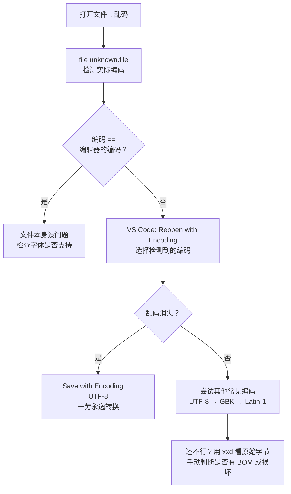

# $\rm Chapter \, 6$ 文本、编码、压缩包与常见数据格式

> 你从网上下载了一个 JSON 数据集，双击打开却全是乱码。你写了一个 Python 脚本在 Windows 上运行正常，上传到 Linux 服务器后直接运行却报 `/usr/bin/env: 'python3\r': No such file or directory`。你收到一个 `.tar.gz` 文件，解压时搞不清是一步还是两步。这些问题都不复杂，但没有一章专门讲清楚，它们就会反复出现，每次浪费你半小时。

> **开始前自检**：本章假设你已经会：
>
> - □ 用 `cat` 或编辑器查看过文本文件（§2.6、§5.1）
> - □ 在终端里运行过程序并看到过输出（§1.9）
> - □ 见过 `.json` / `.csv` 这类数据文件（§1.6）

## $\rm \S \, 6.1$ 文本文件和二进制文件：根本区别

计算机中的所有数据——代码、文档、图片、视频——最终都存储为**字节序列**。每个字节是 0-255 之间的整数。

关键区别在于**你怎么解读这些字节**：

- **文本文件**：字节序列按照某种字符编码解读为可读字符。如果用一个错误的编码去解读，就会看到乱码。
- **二进制文件**：字节序列按照特定格式解读——图片有自己的压缩算法，可执行文件有自己的指令编码。如果你用文本编辑器打开一个 `.exe` 或 `.jpg`，看到的是随机乱码，因为编辑器强行把任意字节当作字符来显示了。

同一个字节 `0x48` 在 ASCII/UTF-8 中解读为字符 `H`，但在一张 PNG 图片中它只是像素数据的一部分——没有字符含义。

在终端中快速判断：

```powershell
# PowerShell：查看文件开头的字节（5.1 与 7+ 通用，输出为十六进制）
Format-Hex unknown.file | Select-Object -First 1

# 想直接看到十进制数字时，两个版本的参数名不同：
Get-Content unknown.file -Encoding Byte -TotalCount 16   # Windows PowerShell 5.1
Get-Content unknown.file -AsByteStream -TotalCount 16    # PowerShell 7+；5.1 会报“找不到与参数名称匹配的参数”
```

判读这几个字节时别踩坑：`Format-Hex` 给的是十六进制。**不要因为看到大于 `0x7E` 的字节就断定这是二进制文件**——UTF-8 的中文每个字占 3 个字节、字节值都在 `0x7E` 以上（“中”是 `E4 B8 AD`，十进制 `228 184 173`），中文文本文件本来就长这样。PowerShell 没有内置的自动识别命令，想知道“这到底是什么文件”，用下面的 `file` 更可靠。

```bash
# Bash / Git Bash：file 命令自动判断（PowerShell 没有，用上面的 Format-Hex）
file unknown.file
# 输出示例：
# unknown.file: ASCII text
# unknown.file: UTF-8 Unicode text
# unknown.file: PNG image data, 800 x 600, 8-bit/color RGB
# unknown.file: ELF 64-bit LSB executable
```

`file` 命令不是看扩展名来判断——它读取文件开头的几个字节（称为**魔数** magic number），比对已知格式的特征。

---

## $\rm \S \, 6.2$ 字符编码：从字节到文字

### $\rm \S \, 6.2.1$ ASCII：最初的共识

ASCII 定义了 128 个字符到数字的映射：`A`=65，`a`=97，空格=32，换行=10。它只用了一个字节的低 7 位。英文字母、数字和常见标点都覆盖了。

但世界上不只有英文。中文、日文、阿拉伯文、Emoji——ASCII 装不下。

### $\rm \S \, 6.2.2$ 从 GBK 到 Unicode

不同地区各自扩展了 ASCII 之外的字节范围来编码本地文字——中文有 GBK/GB2312，日文有 Shift-JIS，俄文有 KOI8-R。同一个字节 `0xD6` 在 GBK 中可能是“中”字的一半，在 Shift-JIS 中可能是完全不同的字符。

这就是乱码的来源：**文件用编码 A 保存，你用编码 B 打开**。字节序列没有改变，但解读方式变了。

**Unicode** 统一了这一切：它为世界上几乎每种文字的每个字符分配了一个唯一的数字（码点）。`A` 是 U+0041，“中”是 U+4E2D，“😀” 是 U+1F600。

但 Unicode 只是“映射表”，没有规定这个数字在文件中应该用几个字节存储。这是 **UTF-8** 的工作。

### $\rm \S \, 6.2.3$ UTF-8 的设计

UTF-8 是 Unicode 最广泛使用的编码方案。它的设计很巧妙：

- ASCII 字符（U+0000 到 U+007F）仍然用**一个字节**表示，且和 ASCII 编码完全一致。一份纯英文的 UTF-8 文件和一份 ASCII 文件在字节层面完全相同。
- 其他字符使用 2-4 个字节。中文常用字通常是 3 个字节，Emoji 通常是 4 个字节。

```text
字符 'A'    Unicode: U+0041   UTF-8: 0x41          (1 字节)
字符 '中'   Unicode: U+4E2D   UTF-8: 0xE4 0xB8 0xAD (3 字节)
字符 '😀'   Unicode: U+1F600  UTF-8: 0xF0 0x9F 0x98 0x80 (4 字节)
```

UTF-8 是目前互联网和开发工具的默认编码。你应该把“文本文件默认用 UTF-8 保存”作为习惯。

### $\rm \S \, 6.2.4$ BOM：一个历史遗留的麻烦

BOM（Byte Order Mark，字节序标记）是某些编辑器在文件开头插入的 2-3 个不可见字节，用于标记编码类型。UTF-8 BOM 是 `0xEF 0xBB 0xBF`。

问题在于：**UTF-8 根本不需要 BOM**（UTF-8 没有字节序问题），但 Windows 记事本在历史上默认给 UTF-8 文件加 BOM。结果是：

- 你在 Windows 记事本中保存的脚本上传到 Linux，第一行 `#!/bin/bash` 前面多了不可见的 BOM 字节，Shell 不认识，脚本执行失败；
- 一个 JSON 配置文件因为 BOM 的存在导致解析器报“Unexpected token”。

在 VS Code 等现代编辑器中，可以明确选择“UTF-8”（无 BOM）或“UTF-8 with BOM”。**选择前者**，除非有明确理由需要 BOM。

### $\rm \S \, 6.2.5$ 乱码的标准排查流程



当你打开一个文件看到乱码：

1. 用 `file` 命令（Bash）或查看前几个字节，确认实际编码。
2. 确认你当前编辑器或终端使用的编码。
3. 用正确的编码重新打开，或在工具中显式指定编码转换。

在 VS Code 中，点击右下角的编码标签（如“UTF-8”）→ “Reopen with Encoding” → 选择实际编码（常见尝试顺序：UTF-8 → GBK → Latin-1）。

---

## $\rm \S \, 6.3$ 换行符：`\r\n` vs `\n`

在[文件系统、路径与权限](03-文件系统路径与权限.md)一章中你已经看过不同系统默认换行记号的对照（Windows 用 `\r\n`，Linux/macOS 用 `\n`）。这里完整展开原因和后果。

### $\rm \S \, 6.3.1$ 为什么会有三种换行符

历史原因。早期的电传打字机需要两个机械动作：**回车**（Carriage Return, CR, `\r`）把打印头移到行首，**换行**（Line Feed, LF, `\n`）把纸卷到下一行。后来不同操作系统做了不同的选择：

- Windows 保持了 `\r\n`（两个字符）
- Linux/现代 macOS 只用 `\n`（一个字符）
- 极早期的 Mac 只用 `\r`（已绝迹）

### $\rm \S \, 6.3.2$ 实际影响

**场景一**：你在 Windows 上编辑的 Shell 脚本上传到 Linux：

```bash
#!/bin/bash\r\n         ← \r 被当作命令名的一部分
echo "hello"\r\n
```

Bash 尝试寻找名为 `bash\r` 的解释器，不存在，报错：

```text
/bin/bash^M: bad interpreter: No such file or directory
```

报错里的路径就是 shebang 里写的那个解释器（`^M` 是终端对 `\r` 的显示方式）：内核要执行 `/bin/bash\r`，这个文件不存在，于是报 “bad interpreter”。如果首行写的是 `#!/usr/bin/env python3`，`/usr/bin/env` 本身存在，报错就改由它发出——`/usr/bin/env: 'python3\r': No such file or directory`，因为 `python3\r` 被当成了要找的程序名。核对报错里出现的名字与你首行写的是否一致，是判断“这是不是换行符问题”最快的办法。

**场景二**：Git 仓库中的文本文件，Windows 用户提交时是 `\r\n`，Linux 用户提交时是 `\n`。如果 Git 没有配置换行符自动转换，每次 diff 都会看到每行末尾的差异。

**场景三**：一个 CSV 文件在 Windows Excel 中正常打开，在 Linux 上的数据分析脚本中每行末尾多了个看不见的 `\r`，导致最后一列的值包含回车符。

### $\rm \S \, 6.3.3$ 解决工具

查看文件中是否包含 `\r`：

```bash
# Bash / Git Bash
cat -A file.txt
# 行末的 ^M$ 表示 CRLF ($ 是 LF，^M 是 CR)
# 行末只有 $ 表示 LF
```

Git Bash 与多数 Linux 发行版自带 `cat -A`；PowerShell 没有等价参数，用 VS Code 右下角的换行符标签查看（见本节末）。

```bash
# 转换：CRLF → LF（dos2unix 会把结果写回 file.txt 本身，先备份或先 cat -A 看一眼）
dos2unix file.txt

# 转换：LF → CRLF
unix2dos file.txt

# 没有 dos2unix 时的替代写法（同样就地改写）
sed -i 's/\r$//' file.txt
```

`dos2unix`/`unix2dos` 不是所有环境都自带：Linux 上通常要单独装（`sudo apt install dos2unix`，macOS 用 `brew install dos2unix`），Git Bash 里先用 `which dos2unix` 确认。

在 VS Code 中，右下角会显示当前文件的换行符类型（`CRLF` 或 `LF`），点击即可切换。

---

## $\rm \S \, 6.4$ 打包与压缩：两层不同的操作

### $\rm \S \, 6.4.1$ 基本区别

- **打包**（archiving）：把多个文件和目录合并成一个文件。典型工具：`tar`。
- **压缩**（compression）：通过算法减少数据体积。典型工具：`gzip`、`bzip2`、`xz`。
- **打包 + 压缩**：先把多个文件打成包，再压缩这个包。`.tar.gz` 就是这样——先 `tar` 打包，再 `gzip` 压缩。

有些格式（如 ZIP 和 7z）同时完成打包和压缩。

### $\rm \S \, 6.4.2$ 常见格式对照

| 扩展名 | 打包 | 压缩 | 典型创建命令 | 典型解压命令 |
|---|---|---|---|---|
| `.tar` | ✅ | ❌ | `tar -cvf` | `tar -xvf` |
| `.tar.gz` / `.tgz` | ✅ tar | ✅ gzip | `tar -czvf` | `tar -xzvf` |
| `.tar.bz2` | ✅ tar | ✅ bzip2 | `tar -cjvf` | `tar -xjvf` |
| `.zip` | ✅ | ✅ | `zip -r` | `unzip` |
| `.7z` | ✅ | ✅ | `7z a` | `7z x` |
| `.gz` | ❌ | ✅ gzip | `gzip` | `gunzip` |
| `.xz` | ❌ | ✅ xz | `xz` | `unxz` |

### $\rm \S \, 6.4.3$ `.tar.gz` 的两层扩展名

一个常见的误解：看到 `.tar.gz` 以为需要先 `gunzip` 再 `tar`：

```bash
# 不需要分两步！-z 让 tar 一边解压 gzip 流、一边解包，中间不落地 .tar 文件
tar -xzvf archive.tar.gz

# 一定要写成两条命令的话，用 zcat 把解压结果直接交给 tar：
# zcat archive.tar.gz | tar -x
```

`gunzip archive.tar.gz` 不是这条流水线的一步：它会解压出 `archive.tar`，同时**删掉原来的 `.gz` 文件**，然后你还得再跑一次 `tar -xvf archive.tar`。`tar -z` 与 `zcat | tar -x` 都不产生中间文件。

`tar` 的参数记忆法：

```text
tar -c(z/j)vf archive.tar.gz folder/   创建（c=create）
tar -x(z/j)vf archive.tar.gz           解压（x=extract）
tar -t(z/j)vf archive.tar.gz           查看内容（t=list）

z = gzip 压缩
j = bzip2 压缩
v = 显示过程（verbose）
f = 指定文件名（file）——它后面必须紧跟文件名，习惯上把 f 写在最后；写成 --file=archive.tar.gz 同样合法
```

### $\rm \S \, 6.4.4$ 在 PowerShell 中操作

PowerShell 5+ 内置了 `Compress-Archive` 和 `Expand-Archive`，但只支持 ZIP 格式。对于 `.tar.gz`，Windows 10 1803+ 内置了 `tar` 命令（和 Linux 相同），直接在 PowerShell 中使用即可。

```powershell
# PowerShell 原生 ZIP
Compress-Archive -Path folder -DestinationPath archive.zip
Expand-Archive -Path archive.zip -DestinationPath output

# 使用 tar（Windows 10 1803+ 和所有 Linux/macOS）
tar -xzvf archive.tar.gz
```

### $\rm \S \, 6.4.5$ 安全边界

永远不要解压来源不明的压缩包到重要目录。压缩包可以包含**绝对路径**或 `../` 路径，解压时可能覆盖系统文件或写入你意料之外的位置。先在临时目录中解压，用 `tar -tvf` 或 `unzip -l` 查看内容清单。

即使来源可信，也要留意 `tar` 解包时会**静默覆盖**目标目录里的同名文件，不会询问。两个习惯能避免损失：先 `tar -tvf archive.tar.gz` 看清里面有哪些路径，再解到一个新建的空目录（`mkdir out && tar -xvf archive.tar.gz -C out`）。

---

## $\rm \S \, 6.5$ 常见数据格式

代码不直接吃“数据”——它吃特定格式的结构化文本。下面是开发中最常遇到的几种。

### $\rm \S \, 6.5.1$ JSON：最通用的数据交换格式

JSON（JavaScript Object Notation）用键值对和数组表达结构化数据：

```json
{
  "title": "Attention Is All You Need",
  "authors": ["Vaswani", "Shazeer"],
  "year": 2017,
  "citations": 120000,
  "tags": ["transformer", "attention"]
}
```

JSON 的规则少而严格：

- 字符串必须用**双引号**（不能是单引号）。
- 最后一个元素后面**不能有逗号**。
- 键名也必须用双引号包起来。
- 值的类型：字符串、数字、布尔值（`true`/`false`）、`null`、数组、对象。

**常见 JSON 陷阱**：

1. **尾随逗号**：`{"a": 1,}` 不合法——最后一个元素后面多了一个逗号。Python 字典允许尾随逗号，但 JSON 不允许。
2. **注释**：JSON 标准不支持注释。某些工具（如 VS Code 的 `jsonc` 模式）允许 `//` 注释，但标准 JSON 解析器遇到注释会报错。
3. **编码**：JSON 文件应该是 UTF-8。Windows 工具可能输出 UTF-8 BOM，导致某些解析器失败。
4. **数字精度**：JSON 的数字没有区分整数和浮点数。非常精确的数字（如 ID、时间戳）在解析时可能丢失精度。JavaScript 中 JSON 数字超过 $2^{53}$ 可能出问题。

### $\rm \S \, 6.5.2$ CSV：最朴素但最容易踩坑的表格格式

CSV（Comma-Separated Values）用逗号分隔字段，换行分隔记录：

```csv
title,authors,year
"Attention Is All You Need","Vaswani, Shazeer",2017
"BERT","Devlin et al.",2019
```

看起来简单，但陷阱很多：

1. **字段内的逗号**：如果值本身包含逗号，整个字段必须用双引号包起来。
2. **字段内的引号**：如果值包含双引号，用两个双引号表示——`He said ""hello""`。
3. **字段内的换行**：一个单元格可能包含多行文本，但 CSV 用换行分隔行——此时字段必须被引号包住。
4. **Excel 的“善意”破坏**：Excel 打开 CSV 时会自动转换格式——长数字变成科学计数法，前导零被删除，日期格式被“修正”。查看原始 CSV 用纯文本编辑器，不要只依赖 Excel 的显示。

**处理 CSV 的基本规则**：不要手写 CSV 解析器。用 Python 的 `csv` 模块、PowerShell 的 `Import-Csv` 或任何成熟的库。

### $\rm \S \, 6.5.3$ YAML：给人写的配置语言

YAML 用缩进表示嵌套，比 JSON 更易读（但规则更多）：

```yaml
server:
  host: localhost
  port: 8080
  features:
    - logging
    - authentication
```

YAML 的常见坑：
- **缩进必须用空格，不能用 Tab**。混用空格和 Tab 会解析失败。
- **`yes`/`no`/`on`/`off` 是不是布尔值，取决于 YAML 版本**。YAML 1.1（PyYAML 等不少解析器仍在用）把不加引号的 `yes`/`no`/`on`/`off` 都当作布尔值：国家简称 `NO`（挪威）会被读成 `false`，`on` 会被读成 `true`；YAML 1.2 只认 `true`/`false`。同一份配置换个解析器结果就不同，拿不准时加引号。
- 很多开发工具用 YAML 做配置（Docker Compose——第 30 章，GitHub Actions——第 21 章）。你不需要现在就记住全部语法，但要知道缩进必须用空格、不能混 Tab：YAML 靠缩进判断层级，混进一个 Tab 常常让解析器在完全无关的行上报错。

### $\rm \S \, 6.5.4$ TOML：给配置文件设计的干净格式

TOML 比 YAML 的规则更少、歧义更少，越来越常用于项目配置（如 Python 的 `pyproject.toml`、Rust 的 `Cargo.toml`）：

```toml
# pyproject.toml（Python 项目）
[project]
name = "paper-manager"
version = "0.1.0"
dependencies = ["numpy>=1.24"]
```

`dependencies` 是一个字符串数组，版本约束写在字符串里——这是 Python 项目的写法（PEP 621 规定）。Rust 的 `Cargo.toml` 长得像，但依赖是写在 `[dependencies]` 表下、用 `numpy = "^1.24"` 这样的“键 = 版本要求”形式，两种文件不能互相照抄。

### $\rm \S \, 6.5.5$ 选哪个

| 场景 | 推荐格式 | 理由 |
|---|---|---|
| 前后端 API 数据交换 | JSON | 所有语言原生支持，工具链成熟 |
| 表格数据、数据分析导入导出 | CSV | Excel 和数据分析库的直接输入 |
| 项目配置、CI/CD 描述 | YAML 或 TOML | 比 JSON 更适合人写，注释友好 |
| 日志 | 每行一个 JSON（JSONL） | 方便 awk/jq 逐行处理又保持结构化 |
| 文档标记 | XML（或 HTML） | 此处不展开 |

### $\rm \S \, 6.5.6$ 数据格式工具箱

除了手动编辑，每种格式都有专门的命令行和代码工具帮你验证、转换和查询。知道它们存在就行，不需要全装：

| 格式 | 命令行工具 | 用途 |
|---|---|---|
| JSON | `jq` | 查询、过滤、变换 JSON（见[开发者命令行工具箱](07-开发者命令行工具箱.md)） |
| YAML | `yq` | YAML 版的 jq；也可转 JSON→用 jq→转回 |
| CSV | `csvkit`（含 `csvlook`、`csvcut`、`csvstat`） | 在终端中查看、切列、统计 CSV |
| XML/HTML | `xpath`、`pup`、`htmlq` | 用 CSS 选择器或 XPath 提取内容 |
| 通用转换 | `pandoc` | 文档格式互转（Markdown→HTML→PDF→DOCX） |
| 十六进制 | `xxd`、`hexdump` | 查看任意文件的原始字节，编码排障终极大法 |

在 PowerShell 中，`ConvertFrom-Json`、`ConvertTo-Json`、`Import-Csv`、`Export-Csv` 是内置的，不需要额外工具。但在 Bash 中，`jq` 和 `csvkit` 填补了相同的缺口。

---

## $\rm \S \, 6.6$ 正则表达式：字符串的搜索语言

正则表达式（regex）用模式描述你想匹配的字符串。它不是一种编程语言，而是嵌入在工具中的搜索语法——`grep`、`sed`、`Ctrl+F` 的“使用正则”模式、代码编辑器的查找替换都用它。

### $\rm \S \, 6.6.1$ 最小例子

假设你要在一堆论文标题中找出所有年份：

```text
(20\d{2})
```

- `20` — 匹配字面量 “20”
- `\d` — 匹配任意数字（0-9）
- `{2}` — 前面的模式（数字）出现恰好两次

所以它匹配 `2024`、`2017`、`2000`，但不匹配 `1999`。

`\d`、`\w` 这类简写属于 PCRE 风格，VS Code 的搜索、Python 的 `re`、`ripgrep` 都支持；命令行的 `grep` 属于另一套方言，下一节开头说明了差异。

### $\rm \S \, 6.6.2$ 日常最常用的几个模式

下表按 **PCRE 风格**书写（VS Code 搜索、Python `re`、`ripgrep` 都是这套）。GNU `grep -E` 用的是 POSIX 扩展正则，不认识 `\d` 和 `\w`：`grep -E '\d'` 匹配的是字母 `d` 本身，不是数字。所以写 grep 命令时数字要写 `[0-9]`、单词字符要写 `[A-Za-z0-9_]`；确实想用 `\d` 这种写法，可以 `grep -P`（GNU grep 编译时带 PCRE 支持才有，不是每个系统都有）。

| 模式 | 含义 | 示例 |
|---|---|---|
| `.` | 任意一个字符（除换行外） | `a.c` 匹配 `abc`、`aZc` |
| `*` | 前一个模式出现零次或多次 | `ab*c` 匹配 `ac`、`abc`、`abbbc` |
| `+` | 前一个模式出现一次或多次 | `ab+c` 匹配 `abc`、`abbbc`，不匹配 `ac` |
| `?` | 前一个模式出现零次或一次 | `ba?t` 匹配 `bt`、`bat` |
| `\d` | 任意数字 `[0-9]` | `\d+` 匹配 `42`、`001` |
| `\w` | 任意“单词字符”（字母数字下划线） | `\w+` 匹配变量名 |
| `\s` | 任意空白字符（空格、Tab、换行） | |
| `^` | 行首 | `^def` 匹配行首的 `def` |
| `$` | 行尾 | `;$` 匹配行末的分号 |
| `[abc]` | 方括号内任意一个字符 | `[ch]at` 匹配 `cat`、`hat` |
| `[^abc]` | 不在方括号内的任意字符 | `[^0-9]` 匹配非数字 |
| `(a\|b)` | a 或 b | `(jpg\|png)` 匹配 `jpg` 或 `png` |
| `\` | 转义，让特殊字符变回字面量 | `\.` 匹配句号本身 |

### $\rm \S \, 6.6.3$ 一个贯穿项目的例子

假设论文资料管理器中有文件 `papers.txt`，每行包含标题和年份：

```text
"Attention Is All You Need" (2017)
"BERT: Pre-training of Deep Bidirectional Transformers" (2019)
"Deep Residual Learning for Image Recognition" (2016)
```

用 grep 找出所有 2017-2019 的论文：

```bash
grep -E '20(1[7-9])([^0-9]|$)' papers.txt
```

- `20` — 字面量
- `1[7-9]` — “1” 后面跟 7-9 的任意数字，即 `17`、`18`、`19`
- `([^0-9]|$)` — 年份后面要么不是数字、要么是行尾，防止 `20170` 这样的数字被匹配（GNU 的 grep 还额外支持用 `\b` 表示单词边界，写 `grep -E '20(1[7-9])\b'` 同样能用；但那是扩展，换个 grep 实现就不保证可用）

### $\rm \S \, 6.6.4$ 正则不能做什么

正则适合**模式匹配**，不适合：
- 解析嵌套结构（如 HTML 的 `<div><div></div></div>`）—— 正则无法正确追踪嵌套深度；
- 解析 JSON——用 JSON 解析器；
- 验证复杂的语义（如 URL 是否合法可访问）—— 用 URL 解析库和 HTTP 请求。

**正则是一把好螺丝刀，不是一把万能瑞士军刀。**

---

## $\rm \S \, 6.7$ 校验和与哈希：下载的文件是否完整

从网上下载较大的文件（如系统镜像、数据集压缩包），你怎么知道它没在传输中被损坏？

**哈希函数**可以回答这个问题。它把任意长度的数据映射为固定长度的**摘要**（digest，常被叫作“指纹”）：

- 输入相同 → 哈希值一定相同；
- 输入哪怕只改动一个字节 → 哈希值完全不同的概率极高。

常见工具：

```bash
# Bash / Git Bash
sha256sum file.tar.gz
md5sum file.tar.gz
```

```powershell
# PowerShell：默认算法就是 SHA256
Get-FileHash file.tar.gz
Get-FileHash file.tar.gz -Algorithm MD5
```

如果下载源提供了预期的 SHA256 值，你就在本地算一次——两个值匹配就说明文件完整。**不匹配时不代表文件一定被恶意篡改，但一定代表了“本地文件和发布方意图发布的文件不一样”——你应该重新下载。**

> 哈希不能验证文件“来源可信”——一个有签名的恶意文件也有正确的哈希。验证来源需要数字签名（PGP、代码签名等），这不属于哈希的职责范围。

---

## $\rm \S \, 6.8$ 常见错误及其证据

### $\rm \S \, 6.8.1$ “脚本在本地正常，上传服务器就报错”

除了前文[换行符](#63-换行符rn-vs-n)一节讲过的 `\r\n`/`\n` 问题，还要检查：
1. 文件编码是否为 UTF-8 without BOM；
2. 文件路径是否使用了 Windows 反斜杠（服务器是 Linux）；
3. 是否引入了仅 Windows 可用的库或 API。

### $\rm \S \, 6.8.2$ “JSON 文件打不开，解析器说格式错误”

依次检查：是否有尾随逗号 → 是否用了单引号 → 是否有注释 → 编码是否为 UTF-8 → 是否有 BOM。如果文件很大，用 `head -c 500 file.json` 只看开头几个字符。

### $\rm \S \, 6.8.3$ “解压后文件数量不对或路径很奇怪”

`tar -tvf archive.tar.gz` 先查看内容清单。确认没有 `../` 路径和绝对路径。如果看到类似 `/etc/passwd` 或 `../../.ssh/authorized_keys` 的条目——**不要解压**，这是一个恶意构造的压缩包。

---

## $\rm \S \, 6.9$ 动手实践

在安全目录中完成。先建一个专门放实验文件的目录，后面的实践都在里面做（`mkdir` 和 `cd` 在 Bash 与 PowerShell 中都能用）：

```bash
# 当前目录：你自己的练习目录，例如 D:\projects 或 ~/projects
mkdir encoding-lab
cd encoding-lab
```

### $\rm \S \, 6.9.1$ 实践一：制造并解决乱码

1. 在 VS Code 中创建一个包含中文的文本文件 `hello.txt`，保存为 UTF-8。
2. 用 VS Code 的“Reopen with Encoding” → “GBK” 打开，观察乱码。
3. 切回 UTF-8，观察恢复正常。
4. 查看文件开头的字节，确认没有 BOM：

```bash
# Bash / Git Bash（当前目录：encoding-lab）
file hello.txt                 # 预期：hello.txt: UTF-8 Unicode text
xxd hello.txt | head -1        # 没装 xxd 就跳过，用下面的 PowerShell 写法
```

```powershell
# PowerShell（当前目录：encoding-lab）
Format-Hex hello.txt | Select-Object -First 1
```

判读：输出开头的前三个十六进制字节**不是** `EF BB BF`（十进制 `239 187 191`）就说明没有 BOM。想看到反例，用 VS Code 的“Save with Encoding”另存为“UTF-8 with BOM”，再重复第 4 步——这次开头三个字节就是 `EF BB BF`，`file` 也会显示 `UTF-8 Unicode (with BOM) text`。

### $\rm \S \, 6.9.2$ 实践二：换行符排查

1. 在 VS Code 中创建两个内容相同的文本文件：`crlf.txt`（点右下角状态栏选 `CRLF`）和 `lf.txt`（选 `LF`）。
2. 用 `cat -A` 查看两个文件的区别：

```bash
# Bash / Git Bash（当前目录：encoding-lab）
cat -A crlf.txt     # 预期：每行末尾是 ^M$（^M 是 \r，$ 是 \n）
cat -A lf.txt       # 预期：每行末尾只有 $（只有 \n）
```

3. 转换 `crlf.txt` 后再看一次：

```bash
dos2unix crlf.txt   # 会就地改写 crlf.txt，先备份更稳妥
cat -A crlf.txt     # 预期：行末的 ^M 消失，只剩 $
```

PowerShell 里没有 `cat -A`，用 VS Code 右下角的状态栏标签查看当前换行符，点击即可在 `CRLF`/`LF` 之间切换；切换并保存后，再用上面的 `cat -A` 核对。

### $\rm \S \, 6.9.3$ 实践三：压缩包

1. 在 `encoding-lab` 中造一个两层目录：

```bash
# Bash 与 PowerShell 都可运行（当前目录：encoding-lab）
mkdir -p proj/src
echo "hello" > proj/src/a.txt     # 内容与编码都不重要，这里只需要一个可压缩的文件
```

2. 创建三种格式的压缩包：

```bash
# .tar 与 .tar.gz：Bash / Git Bash / PowerShell 通用（Windows 10 1803+ 自带 tar）
tar -cvf proj.tar proj/
tar -czvf proj.tar.gz proj/

# .zip：Git Bash 用 zip（先 which zip 确认存在）；Windows 用下一条 PowerShell 命令
zip -r proj.zip proj/
```

```powershell
# PowerShell：Windows 用内置的 Compress-Archive 代替 zip 命令
Compress-Archive -Path proj -DestinationPath proj.zip
```

预期：`ls`（PowerShell 用 `Get-ChildItem`）列出 `proj.tar`、`proj.tar.gz`、`proj.zip`；`proj.tar.gz` 明显小于 `proj.tar`。

3. 查看内容而**不解压**：

```bash
# Bash / Git Bash：-t 只列清单，不写任何文件
tar -tvf proj.tar.gz     # 预期：逐行列出目录条目（行尾带 /）和文件条目
unzip -l proj.zip        # 预期：表头 + 条目列表 + 末尾的条目数与小计
```

Windows 上没有 `unzip` 时可用 7-Zip 的 `7z l proj.zip`，或直接跳到第 4 步看解压结果。

4. 分别解压到不同目录，比较大小：

```bash
# -C 指定解压目标目录（PowerShell 里的 tar 也支持）
mkdir out-tar && tar -xvf proj.tar -C out-tar
```

```powershell
# ZIP 用 Expand-Archive；目标已有同名文件时它会报错，而不是静默覆盖
Expand-Archive -Path proj.zip -DestinationPath out-zip
```

预期：`out-tar` 与 `out-zip` 里都能找到 `proj/src/a.txt`，内容与原文件一致。

### $\rm \S \, 6.9.4$ 实践四：JSON 和 CSV

1. 创建一个包含论文信息的 JSON 文件（3 条以上，包含数组字段），例如 `papers.json` 放一个数组，每个元素有 `title`、`authors`（数组）、`year`。
2. 读取并打印每条论文的标题：

```bash
# Bash / Git Bash：需要先安装 jq（获取方式见第 7 章 §7.1）
jq -r '.[].title' papers.json     # 预期：每篇论文一行标题，共 3 行以上
```

```powershell
# PowerShell（不需要额外工具）
(Get-Content papers.json -Raw | ConvertFrom-Json).title   # 预期：3 行以上标题
```

3. 将同样的数据导出为 CSV，确保正确处理包含逗号的字段。
4. 在纯文本编辑器中打开 CSV，肉眼确认转义：包含逗号的字段应该被双引号包住，预期看到 `"Vaswani, Shazeer"` 这样一整个字段，而不是被拆成两列。

### $\rm \S \, 6.9.5$ 实践五：正则搜索

1. 在任何一个包含 `.cpp` 文件的目录中（例如第 5 章打开的项目目录，或在 `encoding-lab` 里新建 `snippet.cpp` 写上两行 `#include`），找出所有包含 `#include` 的行：

```bash
# Bash / Git Bash：-r 递归，-n 显示行号
grep -rn --include='*.cpp' '#include' .
# 预期：每条匹配一行，形如 ./snippet.cpp:1:#include <iostream>
```

```powershell
# PowerShell：Select-String 没有 -Recurse，先让 Get-ChildItem 列出文件
Get-ChildItem . -Recurse -Filter *.cpp | Select-String '#include'
# 预期：Filename / LineNumber / Line 三列输出
```

2. 用正则找出所有以 `test_` 开头的函数名：

```bash
grep -nE 'test_[A-Za-z0-9_]+' snippet.cpp
# 预期：打印形如 3:int test_add(int a, int b); 的行；文件里没有就手写一行 int test_add(); 再试
```

3. 在 VS Code 的搜索框中点开正则模式（`.*` 按钮），输入 `test_[A-Za-z0-9_]+`，观察匹配文本被高亮；再输入 `20[0-9]{2}` 观察年份被高亮。这一步只观察“哪些文本被匹配”，不做替换——把 `foo_bar` 批量改成 `fooBar` 需要**捕获组**，第 8 章会讲。

---

## $\rm \S \, 6.10$ 总结

这章覆盖的是“每个开发者都遇到过、但没有一课专门讲”的基础层：

- **文本是字节 + 编码**。乱码不是文件坏了，是你用错了编码。
- **UTF-8 是现代默认**。保存时选 UTF-8 without BOM。
- **换行符有三种，`\r\n` vs `\n` 最常见**。跨平台移动文件时注意。
- **打包 ≠ 压缩**。`.tar.gz` 是两层：先 tar 打包，再 gzip 压缩。
- **JSON 严格但通用，CSV 简单但陷阱多，YAML 可读但敏感于缩进和 Tab**。选格式时先想到它们的坑。
- **正则用于模式搜索，不是万能解析器**。
- **哈希验证文件完整性**，但不验证来源可信。

---

## $\rm \S \, 6.11$ 关键概念回顾

1. 文本文件和二进制文件的根本区别是什么？

2. UTF-8 为什么在处理纯英文时和 ASCII 完全兼容？中文常用字在 UTF-8 中占几个字节？

3. BOM 是什么？UTF-8 为什么不需要它？它会引发哪些具体故障？

4. Windows 和 Linux 的默认换行符分别是什么？一个用 CRLF 保存的 Shell 脚本传到 Linux 会报什么错？

5. `tar` 和 `gzip` 分别做什么？`.tar.gz` 的两层扩展名意味着什么？为什么通常不需要先 `gunzip` 再 `tar`？

## $\rm \S \, 6.12$ 应用与辨析

6. CSV 中，值本身包含逗号时应该怎么处理？

7. 下载来的 JSON 文件被解析器报“格式错误”，按什么顺序排查？

## $\rm \S \, 6.13$ 本章自测答案

> 先闭卷作答本章“关键概念回顾”与“应用与辨析”，再核对以下答案。

### $\rm \S \, 6.13.1$ 自测答案 · 关键概念回顾
1. 不在于字节本身，而在于解读方式：文本按字符编码解读为可读字符，二进制按特定格式（图片、可执行文件等）解读。
2. 设计如此：ASCII 字符（U+0000–U+007F）在 UTF-8 中仍用单个字节表示且编码值与 ASCII 完全一致，所以纯英文的 UTF-8 文件和 ASCII 文件字节相同；中文常用字占 3 个字节，Emoji 占 4 个字节。
3. BOM 是文件开头的 2-3 个不可见字节，用于标记编码或字节序；UTF-8 没有字节序问题，BOM 反而变成数据开头的多余字节，让脚本首行的 `#!` 失效（报 `bad interpreter`）、让 JSON 解析器报“Unexpected token”。
4. Windows 用 `\r\n`（CRLF），Linux 和现代 macOS 用 `\n`（LF）；Shell 会把 `\r` 当成解释器路径的一部分，报 `/bin/bash^M: bad interpreter: No such file or directory`。
5. tar 打包（把多个文件合并成一个，不压缩），gzip 压缩（减小体积）；`.tar.gz` 表示先 tar 打包再 gzip 压缩，`tar -xzvf` 让 gzip 边解压、tar 边解包，中间不落地 `.tar` 文件（要写成两步就用 `zcat archive.tar.gz | tar -x`）。

### $\rm \S \, 6.13.2$ 自测答案 · 应用与辨析
6. 把整个字段用双引号包起来；不要手写解析器，用 Python 的 `csv` 模块或 PowerShell 的 `Import-Csv` 处理。
7. 先看文件开头有没有 BOM（`EF BB BF`，十进制 `239 187 191`）→ 检查尾随逗号 → 单引号 → 注释 → 确认编码是 UTF-8；文件很大时用 `head -c 500 file.json` 只看开头。

---

下一章[开发者命令行工具箱](07-开发者命令行工具箱.md)不再讲“理论”，而是给你一个实战工具箱——你将在终端中用一行命令搜索代码、请求 API 并定位端口冲突，而不用打开文件管理器或浏览器。

> 你现在能：区分文本与二进制文件，解释 UTF-8 与 BOM，处理换行与编码导致的乱码，用工具打包/解压并读写 JSON、CSV
