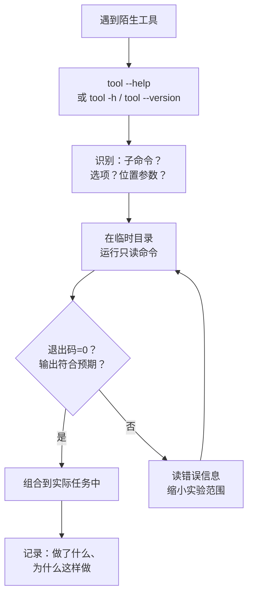

# $\rm Chapter \, 7$ 开发者命令行工具箱

> 从[计算机程序与开发全景](../01-基础观念/01-计算机程序与开发全景.md)到[文本、编码、压缩包与常见数据格式](06-文本编码压缩包与数据格式.md)的几章给了你理论框架。这一章把理论落地为一组日常工具，按任务类型组织：选择工具→阅读帮助→组合工具→验证结果。

> **开始前自检**：本章假设你已经会：
>
> - □ 会用 `cd`、`ls`、`cat`、`echo`（§2.4、§2.5、§2.6）
> - □ 理解管道与重定向：把一条命令的输出交给下一条（§2.10）
> - □ 在终端里运行过程序或解释器命令（§1.9）

## $\rm \S \, 7.1$ 按任务类型找工具

你已经会了 `cd`、`ls`、`pwd`、`cat`、`echo`。现在的问题是：当你需要做一件“我确定有工具能做但不知道叫什么”的事时，该怎么办？

本章按**任务类型**组织工具，而不是按字母表罗列。你不用背所有命令——知道每个任务类别下存在一个工具就够了。每条命令都会标出运行环境（Bash 还是 PowerShell）；少数难有 Windows 对应命令的（如 `find`+`xargs`、`patch`）会直接说明只适用 Bash。直接在你的终端中跑最小示例，用 `--help` 探索更多选项，然后回到贯穿项目用这些工具解决实际问题。

> **工具的获取方式**：`grep`、`less`、`head`、`tail`、`find`、`diff`、`curl` 在 Linux/macOS 与 Git Bash 中自带；Windows 上的同类能力由 PowerShell 内置命令提供（`Select-String`、`Get-Content`、`Compare-Object`、`Invoke-RestMethod` 等），不需要另装。但 `jq`、`rg`、`nc`、`lsof` 在 Windows 和 Git Bash 中通常**没有**，`zip` 也不一定有：它们要用第 9 章 §9.3.5 讲的包管理器安装（Windows 上先 `winget search jq`、`winget search ripgrep` 找到包名再 `winget install <包 ID>`，Linux 上 `sudo apt install jq ripgrep`）。本章遇到需要自装的工具会在命令旁标出，并给出不依赖它的替代写法。

---

## $\rm \S \, 7.2$ 文件与文本

### $\rm \S \, 7.2.1$ “这个文件太大了，我不想全部打开”

**分页查看**——一次看一屏，按空格翻页，按 `q` 退出。

```bash
# Bash
less huge_papers.json    # 空格翻页，/搜索，q退出
```

```powershell
# PowerShell
Get-Content huge_papers.json | Out-Host -Paging
# 或者
more huge_papers.json
```

`less` 比你想象的强大：按 `/` 后输入关键词可以搜索，按 `n` 跳到下一个匹配，按 `g` 跳到文件开头，按 `G` 跳到文件末尾。

### $\rm \S \, 7.2.2$ “我只想看文件的前几行或后几行”

```bash
# Bash
head -n 10 papers.csv      # 前 10 行
tail -n 10 papers.csv      # 最后 10 行
tail -f server.log         # 实时追踪文件末尾的新增内容（-f = follow）
```

```powershell
# PowerShell
Get-Content papers.csv -Head 10
Get-Content papers.csv -Tail 10
Get-Content server.log -Tail 10 -Wait    # 类似 tail -f
```

`tail -f` 是观察日志的标配——你启动一个服务后，在一个终端窗口中 `tail -f` 日志文件，另一个窗口中发送请求，就能实时看到服务记录了什么。

### $\rm \S \, 7.2.3$ “这个目录下哪个文件里写了 `connectTimeout`？”

**搜索文件内容**：

```bash
# Bash — grep 和 ripgrep
grep -r "connectTimeout" src/        # -r = 递归搜索目录
grep -rn "connectTimeout" src/       # -n = 显示行号
grep -rn --include="*.cpp" "TODO" src/

# rg 更快（需自装，见 §7.1）：默认递归、忽略 .git 和二进制文件
rg "connectTimeout" src/
rg -l "connectTimeout" src/          # 只列出文件名
```

```powershell
# PowerShell（当前目录：项目根目录）
Select-String -Path "src\*.cpp" -Pattern "connectTimeout"
# Select-String 没有 -Recurse 参数；递归搜索先让 Get-ChildItem 列出文件
Get-ChildItem src -Recurse -Filter *.cpp | Select-String "connectTimeout"
# 预期：每条匹配输出 Filename / LineNumber / Line 三列
```

> **竞赛生迁移提示**：`grep` 的搜索相当于对目录树做一次遍历，在访问的每个文件中检查模式是否出现。`rg`（ripgrep）做了大量工程优化——并行搜索、智能跳过 `.git` 和二进制文件，在大项目中可能快 10 倍以上。

### $\rm \S \, 7.2.4$ “这两个文件到底哪里不一样？”

OJ 用户习惯于“输出一样还是不一样”的二元判断；`diff` 告诉你**哪里**不一样，Git 的 `git diff` 底层调用的就是它。

```bash
# Bash（diff 在 Linux/macOS/Git Bash 中自带）
diff old.cpp new.cpp
# 输出格式：
# 5c5          ← 第 5 行被改(changed)
# <     return 0;      ← old.cpp 的第 5 行
# ---
# >     return 1;      ← new.cpp 的第 5 行

# 更可读的统一格式（Git 默认格式）
diff -u old.cpp new.cpp
# @@ -5,1 +5,1 @@   ← 位置标记：旧文件第 5 行起 1 行，新文件第 5 行起 1 行
# -    return 0;     ← 删掉的行
# +    return 1;     ← 加上的行

diff -r dir1/ dir2/       # 比较两个目录
diff -w file1 file2       # 忽略空白差异
```

```powershell
# PowerShell：Compare-Object 比较两个对象序列，默认只列出不同的行
Compare-Object (Get-Content old.cpp) (Get-Content new.cpp)
# SideIndicator：=> 表示该行只在第二个文件中，<= 表示只在第一个文件中
```

VS Code 和其他编辑器的内置 diff 视图（选中两个文件 → 右键 → “Compare Selected”）通常最直观，还能并排高亮改动位置；命令行的优势在于能写进脚本和 CI。

`patch` 是 diff 的逆操作——把 diff 的输出应用到文件上：

```bash
diff -u old.cpp new.cpp > fix.patch   # 生成补丁
patch old.cpp < fix.patch              # 把补丁应用到 old.cpp（Git Bash / Linux 自带）
# old.cpp 现在和 new.cpp 一样了
```

在 Git 之前，开源社区用 `diff` + `patch` + 邮件列表协作——Linux 内核至今仍然大量使用这个工作流。PowerShell 没有 `patch` 的对应命令，这一步只能在 Bash 或 Git Bash 中做。

### $\rm \S \, 7.2.5$ “给我提取 JSON 里的某个字段”

假设 `papers.json` 是一个 JSON 数组，每个元素是一篇论文：

```json
[
  {"title": "Attention Is All You Need", "year": 2017},
  {"title": "BERT", "year": 2019},
  {"title": "GPT-3", "year": 2020}
]
```

```bash
# Bash — jq（一个专门的 JSON 处理器，需自装，见 §7.1）
jq '.[].title' papers.json                      # .[] 展开数组，逐篇取 title
jq '.[] | {title, year}' papers.json            # 每篇只保留 title 和 year 两个字段
jq '.[] | select(.year > 2020)' papers.json     # 筛选 2020 年后的论文
jq '.[0].title' papers.json                     # 只取第一篇的标题
```

```powershell
# PowerShell — 原生对象管道（不需要额外工具）
$papers = Get-Content papers.json -Raw | ConvertFrom-Json
$papers | Select-Object title, year
$papers | Where-Object { $_.year -gt 2020 }
```

`jq` 有自己的查询语言（类似一种精简的函数式表达），官网有交互式教程。注意 `.title` 与 `.[].title` 的区别：前者用于“根对象就是一篇论文”，后者用于“根是数组”。数据形状和查询对不上时 jq 会报 `Cannot index array with string "title"`——那是查询假设错了，不是文件坏了。

### $\rm \S \, 7.2.6$ 压缩包：先看清单，再解压

打包、压缩与校验在[文本、编码、压缩包与常见数据格式](06-文本编码压缩包与数据格式.md)中已经讲过（`tar` 打包、`gzip` 压缩、`.tar.gz` 是两层操作的组合、`sha256sum`/`Get-FileHash` 校验完整性），这里只保留一条那章没展开的习惯：**先看清单，再解压**。

```bash
# Bash / Git Bash：-t 只列内容，不写任何文件
tar -tzvf archive.tar.gz
unzip -l archive.zip      # Git Bash 不一定自带 unzip；Windows 可用 7-Zip 的 7z l archive.zip
```

清单里如果出现 `../` 开头或 `/etc` 这样的绝对路径，就停下不要解压（见第 6 章 §6.4.5“安全边界”）。

### $\rm \S \, 7.2.7$ find + xargs：对所有匹配的文件执行操作

`find` 找到文件，但每次找到后手动处理就失去了自动化的意义。`-exec` 和 `xargs` 让 find 的结果自动流入下一个命令。这一节只适用 Bash（Git Bash 也可用）；PowerShell 没有 `find`/`xargs`，对应做法是用 `Get-ChildItem -Recurse` 把文件对象交给 `ForEach-Object`。

```bash
# 删除 .tmp 文件：先打印清单核对，确认后再删
find . -name '*.tmp' -print                 # 第 1 步：只列出将被处理的文件
find . -name '*.tmp' -exec rm -i {} +       # 第 2 步：逐个询问后删除（-i 会打印文件名等你确认）

# 对所有 .cpp 文件运行 clang-format（-exec 方式）
find src/ -name '*.cpp' -exec clang-format -i {} \;
# {} = 当前文件的路径，\; = 命令结束

# 对所有 .cpp 文件运行 clang-format（xargs 方式，更快——一次传多个文件）
find src/ -name '*.cpp' -print0 | xargs -0 clang-format -i
# -print0 和 -0 用 null 字符分隔文件名，避免空格/换行截断

# 统计项目中所有 .cpp 文件的总行数
find . -name '*.cpp' -print0 | xargs -0 cat | wc -l

# 只找最近 7 天内修改过的文件
find . -name '*.md' -mtime -7

# 找大于 10MB 的文件
find . -size +10M
```

删除类操作不要一步到位：`find . -name '*.tmp' -delete` 会递归删掉当前目录树下所有匹配的文件，不打印清单、不询问；先用 `-print` 核对清单，或者改用 `-exec rm -i {} +` 保留确认环节。

`-exec` 和 `xargs` 的区别：`-exec` 对每个文件分别执行一次命令；`xargs` 把尽可能多的文件名拼在一次命令中执行。文件数量少差异不大，文件多时 `xargs` 显著更快。

统计总行数时不要写成 `... | xargs -0 wc -l | tail -1`：`xargs` 在文件名太多时会分批调用 `wc`，每批各打印一行 `total`，`tail -1` 只留下最后一批的合计，结果偏小。要么拼成一个流再数（上面的写法），要么把所有合计相加：`find . -name '*.cpp' -print0 | xargs -0 wc -l | awk '{s+=$1} END {print s}'`。

---

## $\rm \S \, 7.3$ 网络与 API

### $\rm \S \, 7.3.1$ “这个 API 返回什么？它是不是挂了？”

**`curl`** 是命令行中最通用的 HTTP 客户端——它发送请求并显示响应。

```bash
# GET 请求，显示响应体
curl https://api.github.com/repos/torvalds/linux

# 显示响应头（-i = include headers）
curl -i https://api.github.com

# 只显示响应头（-I = HEAD 请求，只取头部）
curl -I https://example.com

# 显示请求与响应的调试信息（-v = verbose）
curl -v https://api.example.com

# 带参数的 GET 请求
curl "https://api.example.com/search?q=transformer&limit=10"

# POST JSON 数据
curl -X POST https://api.example.com/papers \
  -H "Content-Type: application/json" \
  -d '{"title":"My Paper","year":2024}'

# 下载文件，保留远程文件名（-O）
curl -O https://example.com/data.tar.gz

# 静默模式（-s = silent），常和管道配合
curl -s https://api.example.com/data | jq '.results'
```

`-v` 的输出里，以 `*` 开头的是 curl 自己报告的连接过程（域名解析到哪个 IP、TLS 握手、连接复用），`>` 是实际发出的请求行和请求头，`<` 是收到的状态行和响应头。请求超时、连到了错误的服务器、协议版本不对时，先看 `-v` 里连的 IP 和握手结果，比盯着响应体有用。

在 **Windows PowerShell 5.1** 中，`curl` 是 `Invoke-WebRequest` 的别名——参数完全不同，照抄上面的 `-i`、`-X` 会报错；PowerShell 7+ 取消了这个别名，`curl` 直接指向 Windows 自带的 `curl.exe`。先 `Get-Command curl` 看它解析到了哪个命令。安装 Git for Windows 后，Git Bash 中有原版 `curl`。也可以用：

```powershell
Invoke-RestMethod https://api.github.com/repos/torvalds/linux
```

### $\rm \S \, 7.3.2$ “网页加载时到底发了哪些请求？”

`curl` 给你的是“一个请求、一个响应”的视角。但现代网页加载时会发出几十到上百个请求（HTML → CSS → JS → 图片 → API 数据）。

打开浏览器的 **开发者工具**（F12），切换到 **Network（网络）** 标签页，刷新页面。你会看到：
- 每个请求的 URL、方法（GET/POST）、状态码（200/404/500）；
- 请求和响应头；
- 响应体内容；
- 请求的耗时瀑布——DNS 解析→连接→TLS→等待→下载。

这不是“前端开发者才需要的工具”。当你的后端 API 返回了数据但前端显示异常时，Network 面板能直接告诉你：请求发出去了吗？返回了什么？哪个环节耗时最长？

### $\rm \S \, 7.3.3$ “为什么连不上？DNS 有问题还是服务挂了？”

从[计算机程序与开发全景](../01-基础观念/01-计算机程序与开发全景.md)中你就知道：IP 地址大致标识主机，端口帮助操作系统把收到的数据交给正确进程。排查连通性时按网络层从低到高：

```bash
# Bash（Git Bash / Linux / macOS）
# 1. DNS 解析——域名对应的 IP 是什么？
nslookup api.example.com        # Windows 与 Linux/macOS 都有

# 2. 网络层面能不能到达目标主机？
ping api.example.com            # ICMP 探测。注意：有些服务器禁用 ping 但服务正常

# 3. 特定端口是否开放？（nc 需自装：Linux 用 apt install netcat-openbsd，macOS 用 brew install netcat）
nc -zv api.example.com 443      # netcat — 测试 TCP 连接
# 预期：打印 Connection to api.example.com 443 port [tcp/https] succeeded!（不同 netcat 变体措辞略有差异）
```

```powershell
# PowerShell：Windows 没有 nc，用内置的 Test-NetConnection
Test-NetConnection api.example.com -Port 443
# 看输出里的 TcpTestSucceeded：True 表示端口能连上
```

> **经验规则**：`ping` 不通不代表服务挂了（防火墙可能屏蔽 ICMP）；`ping` 通了不代表服务正常（端口可能没开）。`ping` 只能回答“IP 层是否可达”，不能替代对具体端口的连接测试。

---

## $\rm \S \, 7.4$ 进程、端口与磁盘

### $\rm \S \, 7.4.1$ “谁在用 8080 端口？”

这是开发中最常见的问题之一——你启动服务时报“端口已被占用”：

```bash
# Bash（Linux/macOS；lsof 和 ss 在 Windows 与 Git Bash 中通常没有）
lsof -i :8080                    # 列出占用该端口的进程；没有任何输出说明没进程占用
ss -tlnp | grep 8080             # 更轻量的替代；-p 只有 root 才能看到别的用户的进程，
                                 # 非 root 时进程列显示 -，那是权限不足，不代表端口空闲

# 拿到 PID 后查看进程详情（把 1234 换成上一步查到的 PID）
ps -p 1234 -o pid,user,comm,args
```

```powershell
# PowerShell（Windows 没有 lsof/ss，用内置的 Get-NetTCPConnection）
Get-NetTCPConnection -LocalPort 8080 -ErrorAction SilentlyContinue |
    Select-Object LocalAddress, LocalPort, State, OwningProcess
# OwningProcess 就是 PID；把下面的 1234 换成它
Get-Process -Id 1234
```

[计算机程序与开发全景](../01-基础观念/01-计算机程序与开发全景.md)中讲过：看到端口冲突不要随机杀进程。先确认占用者是谁、是否应该继续运行，再决定停止它或换端口。

### $\rm \S \, 7.4.2$ “这个进程在干什么？吃了多少资源？”

```bash
# Bash
ps aux | grep python              # 查找包含 "python" 的进程
top                               # 实时资源监控，按 q 退出
htop                              # top 的增强版（需额外安装）
```

```powershell
Get-Process python               # 查看 Python 进程
Get-Process | Sort-Object CPU -Descending | Select-Object -First 10  # CPU 前十
```

`top`/`htop` 的输出中需要关注的列：
- **PID**：进程 ID。
- **%CPU**：CPU 使用率。单核满载是 100%（多核可以超过 100%）。
- **%MEM**：物理内存使用率。
- **VSZ/RSS**：虚拟内存/常驻内存（RSS 更接近“这个进程实际吃了多少 RAM”）。

### $\rm \S \, 7.4.3$ “磁盘怎么满了？哪个目录最大？”

```bash
# Bash
df -h                            # 各分区的使用情况（-h = human readable）
du -sh folder/                   # 某个目录的总大小
du -sh * | sort -hr              # 当前目录下各项按大小降序排列
# sort -h 是 GNU 扩展，macOS/BSD 的 sort 没有它，改用 du -sm * | sort -rn（以 MB 为单位的数字排序）
```

```powershell
Get-PSDrive -PSProvider FileSystem               # 类似 df
Get-ChildItem folder -Recurse | Measure-Object -Property Length -Sum  # 类似 du
```

> **常见陷阱**：`df` 显示磁盘还有空间，但创建文件时报“No space left on device”——这可能是 **inode 耗尽**（Linux）。每个文件系统有最大文件数量限制，大量小文件（如 node_modules 的几十万个小文件）可能耗尽 inode 而磁盘空间仍有余量。`df -i` 查看 inode 使用情况。

### $\rm \S \, 7.4.4$ “我究竟运行的是哪个版本？它装在哪里？”

```bash
# Bash
which python                     # 可执行文件路径
python --version                 # 版本号
python -c "import sys; print(sys.executable)"  # Python 自身的完整路径（最可靠）
```

```powershell
Get-Command python | Select-Object Source    # 可执行文件路径
python --version
```

排查“安装了但找不到”或“版本不对”时，**同时记录版本号和可执行文件路径**。PATH 的搜索机制来自[终端、Shell与命令行](02-终端Shell与命令行.md)——Shell 按目录顺序查找，找到第一个匹配的可执行文件就停止；版本冲突的完整解决会在第 9 章[软件、运行时、SDK与包管理器](09-软件运行时SDK与包管理器.md)展开。

---

## $\rm \S \, 7.5$ 学会任何陌生工具的标准流程

你会在职业生涯中遇到几十上百个工具——不可能全部预先学完。面对陌生工具时有一套固定的探索流程：



**第一步：确认身份**

```bash
# Bash
tool --help           # 大多数 CLI 接受（或 -h, -?）
tool --version        # 确认版本
which tool            # 确认可执行文件路径
```

```powershell
# PowerShell
tool --help
tool --version
Get-Command tool      # 确认可执行文件路径
```

**第二步：读懂帮助信息**

帮助输出的结构通常是：

```text
用法：tool [全局选项] <子命令> [子命令选项] [参数...]

子命令：
  build    构建项目
  test     运行测试
  run      运行程序

选项：
  -o, --output FILE   输出到 FILE
  -v, --verbose       详细输出
  -q, --quiet         静默模式
```

先找到你要的子命令，再看它的选项。不要试图读完全部帮助——那跟背字典学语言一样低效。

**第三步：只读实验**

```bash
# Bash：在临时目录中操作（Windows 的 Git Bash 中也有 /tmp）
mkdir /tmp/tool-test && cd /tmp/tool-test
tool --dry-run ...          # 如果支持 dry-run（模拟运行）
tool list ...               # 只读子命令通常最安全
tool subcommand --help      # 子命令的帮助（多数工具是这个顺序；git --help commit 是常见例外）
```

```powershell
# PowerShell：用当前用户的临时目录
New-Item -ItemType Directory -Path "$env:TEMP\tool-test" -Force | Out-Null
Set-Location "$env:TEMP\tool-test"
```

**第四步：验证结果，而不是假设成功**

还记得[计算机程序与开发全景](../01-基础观念/01-计算机程序与开发全景.md)中的退出码吗——程序结束时返回给操作系统的一个整数，`0` 表示成功，非 0 表示某种失败。每次运行工具后，检查：
- 退出码是否为 0（紧接上一条命令，Bash 里运行 `echo $?`，PowerShell 里看 `$LASTEXITCODE`，它只反映外部程序）；
- 输出是否符合预期；
- 文件是否被创建/修改，内容和权限是否正确。

```bash
# Bash：$? 是上一条命令的退出码，必须在别的命令之前马上查看
echo $?
```

```powershell
# PowerShell
$LASTEXITCODE      # 上一条外部程序（python、git、tar 等）的退出码
$?                 # 上一条命令（含 cmdlet）成功与否的布尔值
```

**第五步：记录**

当你终于搞清楚一个错误时，把完整错误信息、原因和解决方法记下来。半年后你会感谢现在的自己——同样的错误会再次出现，而你已经不记得当初是怎么解决的了。

---

## $\rm \S \, 7.6$ 论文资料管理器：工具箱实战

回到贯穿项目。下面假设当前目录是 `paper-manager/`（贯穿项目仓库的根目录，`papers.json` 和源码都在里面）。其中“检查后端服务”和 `server.log` 两条要等你做到第 29 章（Python 后端提供 HTTP API）才会真正用上——现在知道有这些命令即可，那时再回来实际运行。

```bash
# Bash（Git Bash / Linux / macOS）——当前目录：paper-manager/
# 找出所有包含 "Attention" 的 JSON 文件（rg 需自装，见 §7.1）
rg "Attention" --type json

# 查看 papers.json 的结构（前 30 行）
head -n 30 papers.json

# 提取所有论文的标题和年份，按年份排序
jq '.[] | {title, year}' papers.json | jq -s 'sort_by(.year)'
```

```powershell
# PowerShell：同样三件事
Get-ChildItem . -Recurse -Filter *.json | Select-String "Attention"
Get-Content papers.json -Head 30
Get-Content papers.json -Raw | ConvertFrom-Json | Sort-Object year | Select-Object title, year
```

```bash
# 后端服务起来之后（第 29 章）：检查 8000 端口是否在监听
ss -tlnp | grep 8000            # Linux；有输出说明端口已被占用/监听
tail -n 50 server.log | rg -i error
```

```powershell
# Windows：检查端口
Get-NetTCPConnection -LocalPort 8000     # 有结果说明端口有人监听
Get-Content server.log -Tail 50 | Select-String -Pattern error
```

这些命令不要求全部手打——知道它们存在，需要时查回来即可。

---

## $\rm \S \, 7.7$ 动手实践

### $\rm \S \, 7.7.1$ 实践一：在项目中搜索

在你的论文管理器项目目录（或任何一个包含多个文件的目录）中，当前目录就是待搜索的目录：

1. 用 `grep`/`rg`/`Select-String` 找出所有包含 `#include` 的 `.cpp` 或 `.h` 文件：

```bash
# Bash / Git Bash：-r 递归，-l 只列文件名
grep -rl --include='*.cpp' --include='*.h' '#include' .
# 预期：每行一个文件路径，比如 ./src/main.cpp
```

```powershell
# PowerShell
Get-ChildItem . -Recurse -Include *.cpp,*.h | Select-String '#include' |
    Select-Object -ExpandProperty Path -Unique
# 预期：每行一个文件的完整路径
```

2. 统计每个文件中 `#include` 出现了多少次：

```bash
grep -rc --include='*.cpp' --include='*.h' '#include' .
# 预期：每行“文件:次数”，例如 ./src/main.cpp:7（没有匹配的文件显示 :0）
```

```powershell
Get-ChildItem . -Recurse -Include *.cpp,*.h | Select-String '#include' |
    Group-Object Filename -NoElement
# 预期：两列输出 Count 与 Name，例如 7 main.cpp
```

3. 找出包含 `TODO` 或 `FIXME` 注释的行：

```bash
grep -rnE 'TODO|FIXME' .
# 预期：每条匹配一行“文件:行号:行内容”，没有匹配就没有输出（退出码 1）
```

### $\rm \S \, 7.7.2$ 实践二：curl 调用公开 API

选择一个不需要认证的公开 API：

```bash
# Bash / Git Bash：查询 GitHub 上某个仓库的信息（jq 需自装）
curl -s https://api.github.com/repos/torvalds/linux | jq '.stargazers_count, .description'
# 预期：先打印一个很大的数字（星标数），再打印一行仓库描述
```

```powershell
# PowerShell 7+（curl 就是真正的 curl）；5.1 里请用 Invoke-RestMethod
Invoke-RestMethod https://api.github.com/repos/torvalds/linux |
    Select-Object stargazers_count, description
```

1. 先用 `curl`（不加 `| jq`）查看原始 JSON 响应——预期看到一大段 JSON 文本。
2. 用 `jq`（Bash）或 PowerShell 对象管道提取 `.stargazers_count` 和 `.description`——预期每个字段各占一行（一个数字、一段描述文字）。
3. 添加 `-i` 参数查看响应头，找到 `Content-Type`。预期：状态行以 `HTTP/2 200` 开头，响应头里有 `Content-Type: application/json; charset=utf-8`。

### $\rm \S \, 7.7.3$ 实践三：端口和进程

1. 在一个终端里启动一个简单的 HTTP 服务（Python 一行即可）。默认它会监听所有网卡，加上 `--bind 127.0.0.1` 只允许本机访问——否则同一局域网里的其他人也能浏览你当前目录下的文件：

   ```bash
   # Bash / PowerShell 都可运行；Ctrl+C 停止
   python -m http.server 9999 --bind 127.0.0.1
   # 预期：打印 Serving HTTP on 127.0.0.1 port 9999 ...
   ```

2. 在另一个终端中，确认 9999 端口已被占用，并找到对应进程：

   ```bash
   # Bash（Linux/macOS）：预期输出一行，含 python 与 PID
   lsof -i :9999
   ```

   ```powershell
   # PowerShell：预期 State 为 Listen，OwningProcess 是 python 的 PID
   Get-NetTCPConnection -LocalPort 9999 | Select-Object State, OwningProcess
   ```

3. 用 `Ctrl+C` 停止服务后再次运行上面的检查——预期这次没有任何输出，说明端口已释放。

### $\rm \S \, 7.7.4$ 实践四：探索陌生工具

选择下面列表中一个你从未用过的工具，仅凭 `--help` 完成一次只读操作。这些都是 Bash 工具（Git Bash 里可用；PowerShell 里只有 `sort` 是 `Sort-Object` 的别名，`wc`/`uniq`/`cut`/`find` 都没有，请打开 Git Bash 做）：

- `wc` — 统计文件的行数、单词数和字节数（预期：`wc -l file.txt` 打印行数与文件名）
- `sort` — 对文本排序（预期：排序后的行按字典序输出）
- `uniq` — 去重或统计重复行（预期：`uniq -c` 输出“次数 行内容”）
- `cut` — 按分隔符切分每行（预期：`cut -d, -f1` 只打印逗号前的第一列）
- `find` — 按名称、类型、时间等搜索文件（仅用只读选项 `-name`、`-type`；预期：匹配的文件路径逐行输出）

---

## $\rm \S \, 7.8$ 总结

- 本章的目标不是让你记住 `grep`、`curl`、`lsof` 的全部参数——而是让你知道**每个任务类别下存在一个合适的工具**。
- 遇到问题时的第一反应不是“去搜答案”，而是“我可以用哪个工具收集证据？”——日志看不懂用 `tail -f`、端口冲突用 `ss`/`Get-NetTCPConnection`、API 不通用 `curl -v`。
- 面对陌生工具时，`--help` → 只读实验 → 验证结果 → 记录，这个流程不依赖特定工具版本，长期通用。

---

## $\rm \S \, 7.9$ 关键概念回顾

1. `grep -r`、`tail -f`、`less` 分别解决什么任务？

2. 探索陌生工具的安全流程（五步）分别是什么？

3. `jq` 解决的核心问题是什么？为什么不能只用 `grep` 处理 JSON？

## $\rm \S \, 7.10$ 应用与辨析

4. `curl -i` 和 `curl -I` 有什么区别？

5. 浏览器 Network 面板能替代 `curl` 吗？什么情况下 `curl` 更有用？

6. 端口被占用时，找到占用者的命令是什么？（说出你所用平台的即可）

## $\rm \S \, 7.11$ 本章自测答案

> 先闭卷作答本章“关键概念回顾”与“应用与辨析”，再核对以下答案。

### $\rm \S \, 7.11.1$ 自测答案 · 关键概念回顾
1. `grep -r` 递归搜索目录中哪些文件包含某个文本；`tail -f` 实时追踪文件末尾的新增内容（看日志）；`less` 分页查看大文件。
2. 确认身份（`--help`/`--version`/路径）→ 读懂帮助的结构 → 在临时目录运行只读命令做实验 → 验证结果（退出码、输出、文件变化）→ 记录错误和解决方法。
3. 结构化地查询、过滤和变换 JSON 数据；grep 只做行文本匹配，不理解 JSON 的嵌套结构，无法正确提取多行或嵌套字段。

### $\rm \S \, 7.11.2$ 自测答案 · 应用与辨析
4. `-i` 在响应体前同时显示响应头（完整 GET 请求）；`-I` 发送 HEAD 请求只取响应头，不下载响应体。
5. 不能完全替代：Network 面板适合观察网页实际发出的几十上百个请求；`curl` 适合写进脚本和 CI、精确控制参数、查看原始交互。
6. Linux/macOS：`lsof -i :8080` 或 `ss -tlnp | grep 8080`（`ss -p` 需要 root 才显示进程，非 root 时进程列为 `-`，不代表没人占用）；Windows：`Get-NetTCPConnection -LocalPort 8080` 取 OwningProcess，再用 `Get-Process -Id` 查看。

---

本章覆盖了日常最高频的工具。当你需要写脚本、做复杂文本处理、或者用更现代的工具替代经典命令时，[Ch8 高级命令行工具箱](08-高级命令行工具箱.md)等你。

> 你现在能：用 grep 找内容、curl 请求接口、less 看大文件、tail -f 盯日志，并按“任务→工具”找到合适的命令
