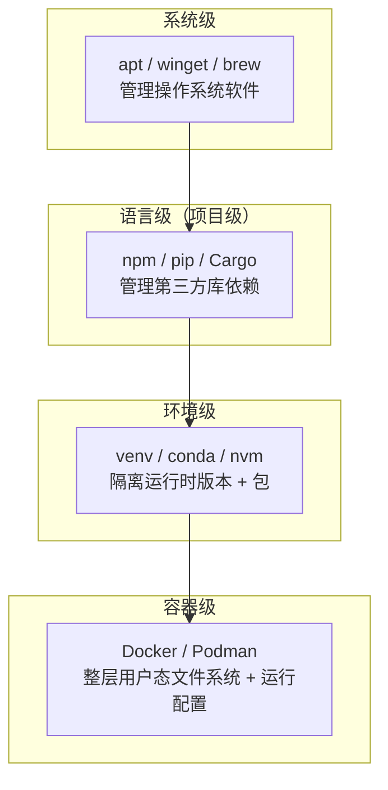

# $\rm Chapter \, 9$ 软件、运行时、SDK 与包管理器

> “我明明装了 Python，为什么终端说找不到？”“这个项目要求 Node.js 18，但我系统里装的是 20——是不是要全部重装？”装了库却 import 失败、不同项目需要同一个软件的不同版本——如果你被这些问题折磨过，这一章把它们一劳永逸地讲清楚。

> **开始前自检**：本章假设你已经会：
>
> - □ 会用终端运行命令与 Python 脚本（§2.4、§2.8）
> - □ 理解 PATH：输入程序名时 Shell 去哪里找它（§2.9）
> - □ 用 `Get-Command` / `command -v` 查过命令实际指向哪个可执行文件（§2.9）

## $\rm \S \, 9.1$ pip：Python 的包管理器

你已经能用 Python 写脚本了。但很快你会需要做一件事：**复用别人写好的代码**。比如你想让程序发一个 HTTP 请求——Python 标准库里有 `urllib`，但用起来很繁琐。你听说有一个叫 `requests` 的库，三行代码就能发请求。

**没有 pip 的世界**：你需要找到 `requests` 的 GitHub 仓库 → 下载源码 zip → 解压 → 复制到你的项目目录 → 检查 `requests` 依赖了哪些其他库（`urllib3`、`certifi`、`idna`……）→ 逐个下载那些库 → 放到正确的位置 → 处理版本兼容。只是为了发一个 HTTP 请求。每次新建项目都要重复一遍。

**pip**（Package Installer for Python）消除这一切。它是 Python 的**包管理器**（package manager）——一个专门负责查找、下载、安装、升级和记录 Python 第三方库的工具。

```bash
python -m pip install requests
# 一行命令。pip 自动找到 requests、下载、安装它和所有依赖。
# （写成 python -m pip 而不是裸 pip 的原因，§9.1.2 用一次真实的失败来演示。）
```

> **类比**：pip 像手机上的应用商店。你搜 `numpy`，点安装——不需要自己去官网找安装包、不需要手动编译、不需要管依赖关系。pip 自动处理下载、解压、依赖检查和安装的全过程。**边界**：应用商店只能装 App，pip 只能装 Python 包——它不知道你系统里的 `apt` 或 `winget` 在管什么。

### $\rm \S \, 9.1.1$ pip 做了什么

pip 的工作流程：你告诉它“我要 requests” → 它连接 **PyPI**（Python Package Index，`pypi.org`，Python 社区的中央包仓库）读取包的元数据、解析出需要的依赖 → 下载匹配当前平台和 Python 版本的 `.whl` 文件（没有匹配的才回退到源码包）→ 把包与解析出的依赖一起安装到当前 Python 的 `site-packages/` 目录。

```bash
# 查看 pip 把包装到了哪里（路径随安装而异）
python -m pip show requests | grep Location
# Location: /usr/lib/python3.9/site-packages
# ↑ 这个目录就是 Python 存放第三方包的地方
```

`import` 能成功的前提是：pip 安装的目录在 Python 的搜索路径（`sys.path`）中。每个 Python 安装有自己的 `site-packages/`——系统里有两个 Python 时，A 的 pip 装的包，B 默认找不到（例外：venv 用 `--system-site-packages` 创建、把目录写进 `PYTHONPATH`、或把包装进两者都会搜索的共享目录时，两个环境可能看到同一批包）。

### $\rm \S \, 9.1.2$ 最常见的陷阱：pip 和 python 不是一对

这是新手最容易撞上的问题：

```bash
pip install requests    # 成功
python -c "import requests"   # ModuleNotFoundError!
```

原因几乎总是：系统里有**两个 Python**。`pip` 属于 Python A（比如系统自带的 3.9），`python` 命令启动的是 Python B（比如你手动装的 3.12）。你用 A 的 pip 装了包，B 的 `import` 当然找不到。

```bash
# 诊断（版本号与路径随安装而异；Windows 下路径形如 C:\Python39\Lib\site-packages\pip）
pip --version       # pip 23.0 from /usr/lib/python3.9/site-packages/pip (python 3.9)
python --version    # Python 3.12.0
# ↑ 不是同一个 Python！
```

**修复**：永远用 `python -m pip install` 而不是裸 `pip install`。`python -m pip` 的含义是“启动当前这个 `python`，用它的 pip 模块”——保证包装到当前 Python 的位置。

```bash
python -m pip install requests    # 正确：包一定装到这个 python 能 import 的位置
```

> **经验规则**：忘掉 `pip install`——养成 `python -m pip install` 的习惯。它不是“高级写法”，而是在系统里存在多个 Python 时不容易装错位置的写法。

---

## $\rm \S \, 9.2$ 六个概念：应用、运行时、SDK、库、包管理器、项目环境

| 概念 | 它是什么 | 例子 |
|---|---|---|
| **应用程序** | 直接为用户完成任务的软件 | 浏览器、VS Code、Steam |
| **运行时** | 执行某类程序的引擎 | Node.js、Python 解释器、JVM、.NET Runtime |
| **SDK** | 开发某个平台所需的工具集合 | JDK（含编译器+JVM+工具）、Python（含解释器+pip+标准库）、.NET SDK |
| **库/包**(library/package) | 被项目引用的可复用代码 | `numpy`、`requests`、`boost` |
| **包管理器** | 查找、下载、安装、升级和记录包的软件 | npm、pip、apt、winget |
| **项目环境** | 某个项目专用的一套运行时、依赖与配置 | 虚拟环境（`venv/`）、`node_modules/` |

安装“Python”时实际上发生了什么？你下载了一个安装程序，它把三样东西放到了系统中：
1. **Python 解释器**（运行时）——`python`（Linux）或 `python.exe`（Windows）；
2. **标准库**——Python 内置的大量模块；
3. **pip**（包管理器）——用来安装第三方库。

安装“Node.js”时类似：得到了 `node`（运行时）、npm（包管理器）和 `npx`（包执行器）。

区分这些层次，你就能回答“安装了为什么不能运行”：
- 你安装了**运行时** → 可以执行 `.py` 或 `.js` 文件；
- 你没安装**某个第三方包** → `import numpy` 失败，尽管 `python` 本身能用；
- 你把包装到了**错误的环境** → 终端 A 能找到，终端 B 找不到。

---

## $\rm \S \, 9.3$ 包管理器的层次：从系统到项目

包管理器不只一种。它们运行在不同层级，管理不同类型的软件。

### $\rm \S \, 9.3.1$ 系统级包管理器

管理**操作系统层面的软件**：编译器、系统库、开发工具、字体、驱动等。

| 平台 | 包管理器 | 典型命令 |
|---|---|---|
| Windows | winget | `winget install Git.Git` |
| Ubuntu/Debian | apt | `sudo apt install build-essential` |
| Fedora/RHEL | dnf | `sudo dnf install gcc` |
| Arch | pacman | `sudo pacman -S gcc` |
| macOS | Homebrew | `brew install gcc` |

系统包管理器通常需要**管理员权限**（`sudo` 或 UAC 弹窗），因为它们把文件写到系统目录（`/usr/`、`C:\Program Files\`）。安装完成后，可执行文件放在系统 PATH 中的目录，所有用户通常都能找到。Windows 的 winget 是个例外：很多包装到用户目录，不一定提权（§9.3.5）。

**什么时候用系统包管理器**：安装你在任何项目中都需要的工具——`git`、`g++`、`curl`、`make`、`python`。

### $\rm \S \, 9.3.2$ 语言级（项目级）包管理器

管理**特定编程语言的第三方库**，随项目走：

| 语言/生态 | 包管理器 | manifest 文件 | lockfile | 依赖目录 |
|---|---|---|---|---|
| Python | pip / uv | `requirements.txt` 或 `pyproject.toml` | `uv.lock` / `poetry.lock`；`requirements.txt` 经 pip-tools/uv 生成时也可锁定版本 | `venv/Lib/site-packages/`（Windows）或 `venv/lib/python3.x/site-packages/` |
| Node.js | npm / pnpm / yarn | `package.json` | `package-lock.json` / `pnpm-lock.yaml` | `node_modules/` |
| C++ | vcpkg / Conan | `vcpkg.json` / `conanfile.txt` | — | 由 CMake 配置决定 |
| Rust | Cargo | `Cargo.toml` | `Cargo.lock` | `target/` |
| Java | Maven / Gradle | `pom.xml` / `build.gradle` | — | 无（本地仓库缓存 `~/.m2/repository` 由所有项目共用） |

语言级（项目级）包管理器通常**不需要管理员权限**——它们把包安装到项目目录或用户目录中。

### $\rm \S \, 9.3.3$ 环境级工具

当你需要**同一语言的不同版本同时存在**时（比如项目 A 需要 Python 3.9，项目 B 需要 Python 3.12），环境管理工具出场：

- Python：`venv`（内置）、`virtualenv`、`conda`、`pyenv`
- Node.js：`nvm`、`fnm`、`volta`
- 通用：`conda`（同时管理 Python 和系统级依赖）

环境工具的核心机制都是**隔离**：创建一个独立的目录树，其中包含特定版本的运行时和包，修改 PATH 让当前 Shell 优先找到这个隔离环境中的可执行文件。

### $\rm \S \, 9.3.4$ 一张图理解包管理器层次



四层不是互相替代的关系——它们解决不同粒度的问题。一个典型项目中你可能同时用到全部四层：用 `apt` 装的 g++，用 `pip`（在 venv 中）装的 numpy，用 `nvm` 切换的 Node.js 版本，最后用 Docker 打包成镜像发给团队。图里的容器层（镜像与容器）第 30 章才展开，这里只需要知道它比环境级更彻底：不只隔离依赖，连整个用户态文件系统一起打包。

### $\rm \S \, 9.3.5$ Windows 包管理器：winget、Chocolatey 与 Scoop

Windows 不像 Linux——没有统一的 `apt`。但你有三种选择：

| 工具 | 特点 | 权限 |
|------|------|------|
| **winget** | 微软官方，Win10/11 自带，包来自社区仓库 | 多数包装到用户目录，通常不弹 UAC；个别安装器需要写入系统目录时仍会请求提权 |
| **Chocolatey**（chocolatey.org） | 最老的 Windows 包管理器，数万个包 | 需要管理员 |
| **Scoop**（scoop.sh） | 所有软件装用户目录，不污染系统 | 不需要管理员 |

**winget 日常使用**：

```powershell
# 搜索
winget search python
# 列出已安装
winget list
# 只列出可升级的包，不做任何改动
winget upgrade
# 才是升级所有可升级的包（与第 13 章一致）
winget upgrade --all
# 安装：一次只写一个包标识，要装第二个包就再写一条命令
winget install Python.Python.3.12
```

**Scoop**（开发者首选——不需要 UAC 弹窗）。安装脚本来自网络，按安全规则先落盘、阅读、再执行，不要直接把它交给 Shell：

```powershell
Set-ExecutionPolicy RemoteSigned -Scope CurrentUser   # 见下方说明，只影响当前用户

# 1. 下载安装脚本到当前目录（只落盘，不执行）
irm get.scoop.sh -OutFile scoop-install.ps1
# 2. 打开读完再决定：用记事本或 VS Code 看它要写哪些目录、下载什么
notepad scoop-install.ps1
# 3. 确认没问题后执行
.\scoop-install.ps1

scoop install python git nodejs   # 全装到 ~/scoop/
scoop bucket add extras           # 添加更多软件源
scoop install vscode ffmpeg
scoop update *
```

> **安全规则**：任何 `irm … | iex` 都是把网络内容直接交给 Shell——它在下载完成的瞬间就以你的身份执行脚本，你没有任何机会先看一眼。改成“落盘 → 阅读 → 执行”只多花一分钟，却是审查的唯一机会。

`Set-ExecutionPolicy RemoteSigned -Scope CurrentUser` 的作用范围与恢复方法：它只影响当前用户的 PowerShell（不改系统级设置，也不需要管理员），RemoteSigned 的含义是“本地脚本可以运行，从网络下载的脚本必须带数字签名”。`Get-ExecutionPolicy -List` 可以查看各作用域当前生效的策略；想恢复默认执行 `Set-ExecutionPolicy Undefined -Scope CurrentUser`（表示删掉这一层的设置，回落到上级策略）。这个策略也会影响 §9.5.2 里 venv 的 `Activate.ps1`——如果激活时报“禁止运行脚本”，就是它被拦住了，按上面的方法设置后再试，或改用 `cmd`/Git Bash 激活。

**Chocolatey**（包最全）：

```powershell
choco install python --version=3.12
choco install ffmpeg imagemagick
choco upgrade all
```

**选哪个？**

| 场景 | 推荐 |
|------|------|
| 只需装 Git、Python、Node 等基础工具 | winget（系统自带） |
| 不想弹管理员确认、习惯 Linux 体验 | Scoop |
| 需要大量 Windows 桌面软件 | Chocolatey |

> **经验规则**：Windows 开发环境推荐搭配——winget（系统级基础运行时）+ Scoop（日常命令行工具）+ pip/npm（项目级库）。三者不冲突，各自管理不同层级。

---

## $\rm \S \, 9.4$ 命令“python”到底指向哪里

这是诊断所有安装问题的核心线索。

### $\rm \S \, 9.4.1$ PATH 在这里怎么用

PATH 的搜索机制在第 2 章 §2.9 已经定义：Shell 按 PATH 中目录的顺序查找同名可执行文件，命中第一个就停止，这里不重复。安装诊断只是把它用在“同一台机器上有多个 Python”的场景上：

- `C:\Python312\python.exe`（手动安装）
- `C:\Users\<你的用户名>\AppData\Local\Programs\Python\Python39\python.exe`（另一个版本）
- `C:\Users\<你的用户名>\anaconda3\python.exe`（Anaconda 带的）
- `C:\Users\<你的用户名>\.venv\myproject\Scripts\python.exe`（venv 的）

哪一个先被找到，取决于 PATH 中目录的排列顺序。留意这个场景里 PATH 管不到的部分：它只决定“先找到哪个”，不决定“哪个是对的”——包装进了另一个环境，PATH 排得再整齐也没有用。

### $\rm \S \, 9.4.2$ 诊断：看看你到底在调用哪个

`Get-Command` 和 `command -v`（§2.9）回答“输入的命令名实际解析到了哪个可执行文件”。当“版本不对”时，这是第一步：

```powershell
# PowerShell
Get-Command python | Select-Object Source
python --version
```

```bash
# Bash
command -v python
python --version

# Python 会告诉你它自己的完整路径（最可靠）
python -c "import sys; print(sys.executable)"
```

排查时把下面三类信息一起记下来；只记版本号不够——你的系统里可能有两个“3.12.0”，装在不同位置、属于不同环境：

| 要看的东西 | 为什么 | 命令（PowerShell / Bash） |
|---|---|---|
| 命令实际解析到哪个文件 | 决定现在跑的是哪一个安装 | `Get-Command python` / `command -v python`；要看全部匹配项用 `Get-Command python -All` / `which -a python` |
| 解释器的真实路径 | 比命令名可靠，不受别名影响 | `python -c "import sys; print(sys.executable)"` |
| 解释器与 pip 各自的版本 | 两者版本/路径不一致，就是“装错环境”的信号 | `python --version`、`python -m pip --version` |

### $\rm \S \, 9.4.3$ 典型的版本冲突场景

**场景一**：你用 `pip install numpy`，运行程序还是报 `ModuleNotFoundError`。

诊断：
```bash
command -v python        # /usr/bin/python3
command -v pip           # /home/alice/.local/bin/pip3  ← 注意到没？pip 和 python 不在同一路径下
python -m pip install numpy   # 通过 python 自身调用 pip，保证一致性
```

`pip` 和 `python` 可能来自不同的安装。一个防范方法是永远用 `python -m pip install` 而不是 `pip install`——前者保证 pip 使用当前 `python` 所关联的包管理模块。

**场景二**：在 VS Code 终端中可以运行 `python`，在 Windows Terminal 中却找不到。

不同的终端可能从不同的地方加载环境配置。VS Code 终端可能继承了 VS Code 本身的环境（包括它配置的 Python 路径），而独立的 Windows Terminal 从系统设置加载。差异源头通常是：PATH 的修改方式（系统级 vs 用户级 vs Shell 配置文件）不同。

---

## $\rm \S \, 9.5$ 全局安装 vs 项目内安装

### $\rm \S \, 9.5.1$ 全局安装的后果

```bash
python -m pip install requests    # 装到了系统 Python 的 site-packages 中
```

这相当于在你的系统中全局添加了一个包——所有项目、所有脚本都能 `import requests`。听起来方便，但代价是：

- 项目 A 需要 `requests==2.28`，项目 B 需要 `requests==2.31`——全局只有一个版本；
- 你无法从项目文件中知道“这个项目依赖了哪些包”；
- 在另一台机器上重建环境时，你需要手动回忆和安装所有依赖。

**全局安装适合**：你作为用户想用的工具（如 `httpie`、`black`、`jupyter`），而不是项目依赖。

### $\rm \S \, 9.5.2$ 项目内安装

Python 用 venv（虚拟环境）。在项目目录里执行（`venv` 是环境目录名，与项目同级）：

```bash
# 创建虚拟环境
python -m venv venv

# 激活（Linux/macOS/Git Bash）
source venv/bin/activate

# 现在 python 和 pip 都指向 venv 内的版本
python -m pip install requests    # 装到 venv 中，不影响系统 Python

# 记录依赖
python -m pip freeze > requirements.txt

# 在新机器上重建
python -m pip install -r requirements.txt
```

```powershell
# 激活（Windows PowerShell）；创建命令同样是 python -m venv venv
# 若被“禁止运行脚本”拦住，见 §9.3.5 的执行策略说明
.\venv\Scripts\Activate.ps1
```

激活成功的判据：提示符前通常出现 `(venv)`，且 `python -c "import sys; print(sys.prefix)"` 输出的路径以 venv 目录开头。

Node.js 用 `node_modules/` + `package.json`：

```bash
# 初始化项目
npm init -y

# 安装依赖（写入 node_modules/，记录到 package.json）
npm install express

# package.json 记录了依赖清单
# package-lock.json 记录了精确版本

# 在新机器上重建
npm install    # 有 lockfile 时按其中的精确版本安装
npm ci         # 更严格：要求 lockfile 存在，先清空 node_modules/ 再精确安装（第 22 章展开）
```

**项目内安装的优势**：项目自包含、可复现、不同项目间版本隔离。这是现代开发的标准做法。

---

## $\rm \S \, 9.6$ manifest 和 lockfile：为什么有两个文件

如果你看过任何 Node.js 或 Python 项目，会注意到依赖信息通常出现在**两个文件**中：

| 文件 | 作用 | 类比 |
|---|---|---|
| manifest（`package.json`、`pyproject.toml`、`Cargo.toml`） | 声明“我需要什么，不严格限定版本” | 采购申请单——“需要一台显示器，24-27 英寸都行” |
| lockfile（`package-lock.json`、`poetry.lock`、`Cargo.lock`） | 锁定“精确安装了哪个版本” | 收货清单——“最终购入 Dell U2723QE，序列号 xxx” |

**manifest** 由你编写和更新。它描述意图——`"numpy>=1.24, <2.0"` 表示兼容 1.24 到 2.0 之前的版本。

**lockfile** 由包管理器自动生成，不应手动编辑。它记录了已安装的每个包的精确版本和校验和——包括依赖的依赖（间接依赖）。它保证你和队友、CI 服务器在各自动机器上安装的包完全一致。

两者都提交到 Git（lockfile 也要提交——它是团队环境一致性的保障）。`.gitignore` 中排除的是依赖目录本身（如 `node_modules/`、`venv/`），因为 lockfile 已经包含了重建它们的全部信息。（Git 与 `.gitignore` 见第 19 章；现在只需记住结论。）

---

## $\rm \S \, 9.7$ 从源码到二进制：包是怎么来的

### $\rm \S \, 9.7.1$ 预编译包 vs 源码包

当你运行 `python -m pip install numpy`，pip 背后做了两件事之一：

1. **下载预编译包**（wheel / `.whl`）：某个 CI 系统已经针对你的平台（Windows x64、Linux ARM、macOS）编译好了 C 扩展，pip 直接把 `.so`/`.pyd` 文件放到正确位置。安装快，不需要本地编译器。
2. **从源码构建**（`.tar.gz` 源码分发）：如果没有匹配的预编译包，pip 下载源码，在你的机器上运行编译器（通常是 C/C++/Fortran 编译）。这需要你本地有编译器和相关库。安装慢，可能失败。

`numpy` 内部包含用 C 写的数值计算核心——在数组运算这类场景里，它比纯 Python 循环快几十到几百倍（倍数取决于运算类型和数据规模）。这就是为什么安装 `numpy` 时有时候很快（有预编译包），有时候要等几分钟并可能需要装编译器。

### $\rm \S \, 9.7.2$ 为什么“源码安装失败”很常见

```text
error: Microsoft Visual C++ 14.0 or greater is required.
```

这不是 Python 的问题——是 pip 尝试从源码编译某个包，但你的 Windows 上没有 C++ 编译器。解决方法：安装 Visual Studio Build Tools，或者（更简单的）查找该包的预编译 wheel。

`npm` 也有类似情况：某些 Node.js 包包含 C++ 原生模块（如 `node-sass`、`better-sqlite3`），安装时需要本地的 `node-gyp` 和匹配的 C++ 编译器。


---

## $\rm \S \, 9.8$ 升级、降级与卸载：状态管理的坑

### $\rm \S \, 9.8.1$ 升级不是“装新版本就行”

```bash
python -m pip install --upgrade numpy     # 升级单个包
python -m pip install -r requirements.txt # 按 manifest 重建——不会自动卸载不再需要的包
```

升级后可能出现的连锁问题：
- 包 A 升级了，包 B 依赖旧版 A——B 可能默默出错；
- 全局工具升级后语法变了——脚本中调用的命令失效；
- `pip` 本身升级后改变了默认行为（如从 `setup.py` 迁移到 `pyproject.toml`）。

**Python 的依赖解析器不会主动降级其他包来满足新约束**（pip 的旧版本尤其容易出这个问题）。现代的 `uv`、`poetry` 或 `pip-tools` 在处理依赖冲突时比裸 `pip` 更可靠。

### $\rm \S \, 9.8.2$ 卸载不等于清理干净

```bash
python -m pip uninstall numpy           # 删除了包文件
# 但 /tmp 中的编译缓存？用户目录下的 .cache/pip？还在。
# 其他包对这个包的隐性依赖？pip 不会检查。
```

Node.js 的 `npm uninstall` 会同时从 `package.json` 和 `node_modules/` 中移除。但全局工具（`npm install -g tool`）的卸载需要显式加 `-g`。

> **经验规则**：尽量不安装全局包。如果必须安装，记录下时间和原因。半年后清理环境时，你会发现自己完全不记得那些全局包是干什么的。

---

## $\rm \S \, 9.9$ 安全：安装脚本可以执行任意代码

`pip install`、`npm install` 和 `brew install` 在安装过程中都可能运行包作者编写的脚本（如 `setup.py`、`postinstall` 脚本）。这些脚本可以做任何事——读写你的文件、连接网络、修改系统配置。

这不是设计缺陷——包有时确实需要在安装时做编译、生成配置或下载额外资源。但你需要意识到：

1. **安装来自陌生源的包，相当于运行了一段不受审查的代码**。
2. **包的名称可能伪造**——`numpi`（不是 `numpy`）、`requets`（不是 `requests`）。这种攻击叫 typosquatting（拼写仿冒）。
3. **包管理器不会帮你审查代码**。npm 和 PyPI 有基本的安全扫描，但不可能覆盖所有攻击。

防范措施（按重要性排序）：
- 只安装明确知道来源的包；
- 检查包名拼写——多看两秒；
- 关注包的下载量、更新频率和 GitHub 仓库状态（积极的社区是重要信号）；
- 在项目的隔离环境中安装，不在系统 Python/system Node.js 中随意全局安装。

---

## $\rm \S \, 9.10$ 贯穿项目：论文管理器的环境搭建

假设论文管理器项目（第 46 章会完整搭建它）的目录是 `paper-manager/`，包含 Python 后端和 Node.js 前端工具链。初始化流程按“系统级 → 项目级 → 依赖 → 验证”四步走：

```powershell
# 1. 系统级：安装运行时（Windows，一次性）
winget install Python.Python.3.12
```

```powershell
# 第二个包再写一条命令：winget 一次只接受一个包标识
winget install OpenJS.NodeJS
```

```bash
# 2. 项目级：进入项目目录，创建隔离环境
cd paper-manager
python -m venv venv
```

```bash
# 激活（Linux/macOS/Git Bash）
source venv/bin/activate
```

```powershell
# 激活（Windows PowerShell）
.\venv\Scripts\Activate.ps1
```

```bash
# 3. 安装项目依赖——清单和 lockfile 来自项目仓库本身；
#    本阶段还没有这个项目目录时，先跳过这一步，等第 46 章建出它再来
python -m pip install -r requirements.txt
npm init -y                       # 还没有 package.json 时，先生成一份最小清单
npm install                       # 有 lockfile 的项目更严格的做法是 npm ci
```

```bash
# 4. 验证：解释器能工作、Node 读得到自己项目的名字
python -c "import json; print(json.__name__)"            # 预期输出：json
node -e "console.log(require('./package.json').name)"    # 预期输出：paper-manager
```

第 4 步故意只用 Python 标准库里的 `json`——它不需要安装任何包，验证的是“这条 `python` 命令确实能跑起来”。后端框架 Flask 要到第 29 章才引入，那时才需要 `python -m pip install flask`，现在不用验证它。

完成上述四步后，在一台新机器上重建环境是**可验证**的：`python -m pip install -r requirements.txt` 与 `npm ci`（或 `npm install`）会按清单和 lockfile 装出相同版本，再用第 4 步两条命令确认解释器与项目对得上——如果依赖版本有差异，lockfile 会在这里暴露出来，而不是等运行时报错。

---

## $\rm \S \, 9.11$ 动手实践

### $\rm \S \, 9.11.1$ 实践一：PATH 版本诊断

对 `python`、`git`、`g++` 三个命令分别做四件事，把结果记成一张表：

1. 记录版本号，例如 `python --version`。
2. 记录可执行文件完整路径：

   ```powershell
   # PowerShell
   Get-Command python | Select-Object Source
   # 预期输出一行，形如：C:\Users\<你的用户名>\AppData\Local\Programs\Python\Python312\python.exe
   where.exe python                # 列出 PATH 中全部匹配项，按 PATH 顺序
   ```

   ```bash
   # Bash / Git Bash
   command -v python               # 只给第一个被找到的
   which -a python                 # 列出 PATH 中全部匹配项
   ```

3. 查看 PATH 本身，确认第 2 步的路径落在其中哪个目录：

   ```powershell
   $env:Path -split ';'            # 分号分隔，按顺序一行一个目录
   ```

   ```bash
   echo "$PATH" | sed 's/:/ /g'    # 冒号分隔；换成空格后逐行更易对照
   ```

4. 如果第 2 步列出了多个版本，把它们按 PATH 中目录的先后顺序排列，写清“先被找到的是哪一个”——这就是“明明装了两个却总跑旧版”的答案。

### $\rm \S \, 9.11.2$ 实践二：创建虚拟环境

1. 在一个安全目录（新建的空目录即可）中创建：`python -m venv testenv`。
2. 激活：Windows PowerShell 用 `.\testenv\Scripts\Activate.ps1`，Bash/Git Bash 用 `source testenv/bin/activate`。提示符前通常出现 `(testenv)`。
3. 用硬证据确认隔离生效：

   ```bash
   python -m pip -V                          # 预期：pip 的路径位于 testenv 目录下
   python -c "import sys; print(sys.prefix)" # 预期：输出以 testenv 结尾的路径
   ```

4. 在环境中安装一个包并查看清单：`python -m pip install requests`，然后 `python -m pip freeze`——预期能看到 `requests` 及其依赖。
5. 退出环境（`deactivate`），再运行 `python -c "import sys; print(sys.prefix)"`——这次应回到系统 Python 的目录，说明隔离的确只在激活期间有效。
6. 删除这次实践用的 `testenv` 目录（确认当前目录下就是刚建的那个：PowerShell 用 `Remove-Item -Recurse testenv`，Bash 用 `rm -r testenv`）——整个环境随之清除，系统 Python 不受影响。

> 排障：如果第 2 步报“无法加载文件 …Activate.ps1，因为在此系统上禁止运行脚本”，那是 PowerShell 执行策略拦住了它，按 §9.3.5 的方法为当前用户设置 `RemoteSigned`，或改用 Git Bash/cmd 激活。

### $\rm \S \, 9.11.3$ 实践三：读懂 manifest

不必去 GitHub 找项目（Git/GitHub 见第 19、20 章），用本机已经装好的包就能看：

1. 查看一个已安装包声明的依赖：`python -m pip show requests`。输出里的 `Requires:` 一行是它的直接依赖（如 `certifi`、`charset-normalizer`、`idna`、`urllib3`）；没装过就先用 `python -m pip install requests` 装一个。
2. 用 `python -m pip freeze` 看这些名字都出现在列表里——你没有手写过任何清单，它们却是被自动装上的间接依赖。
3. 如果你手头有一个带 `package.json` / `package-lock.json` 的项目目录（第 22 章会建），打开 lockfile 数一下行数：几百行里大部分是依赖的依赖被锁死的版本。

---

## $\rm \S \, 9.12$ 总结

这一章拆解了“安装”这个词背后隐藏的六个层次。核心结论：

- **运行时执行程序，SDK 开发程序，包管理器管理第三方代码**。它们可能打包在一起，但概念不同。
- **PATH 决定 Shell 找到哪个可执行文件**。排查“安装了找不到”时，第一步通常是 `command -v`（或 `Get-Command`）看命令实际指向谁。
- **全局安装适合工具，项目安装适合依赖**。虚拟环境和 lockfile 让环境可复现。
- **包管理器不审查代码**。安装前花两秒确认包名和来源。

---

## $\rm \S \, 9.13$ 关键概念回顾

1. 运行时和 SDK 有什么区别？

2. 系统包管理器和语言级（项目级）包管理器分别管理什么？什么时候用哪个？

3. 虚拟环境解决的核心问题是什么？它怎么做到的？

4. manifest 和 lockfile 分别描述什么？为什么两者都要提交到 Git，但依赖目录要排除？

5. 为什么说安装包相当于运行了一段不受审查的代码？

## $\rm \S \, 9.14$ 应用与辨析

6. 下载预编译包和从源码构建有什么区别？各自在什么情况下发生？

7. `python` 和 `pip` 可能来自不同的安装——为什么这是问题？怎么防止？

8. 一个新队友拿到你的项目后，应该按什么顺序重建开发环境？

## $\rm \S \, 9.15$ 本章自测答案

> 先闭卷作答本章“关键概念回顾”与“应用与辨析”，再核对以下答案。

### $\rm \S \, 9.15.1$ 自测答案 · 关键概念回顾
1. 运行时是执行某类程序的引擎（Python 解释器、Node.js、JVM）；SDK 是开发某平台所需的工具集合，通常包含编译器、运行时、库、调试器和文档。
2. 系统包管理器管理操作系统层面的软件（git、g++、curl），通常需要管理员权限；语言级（项目级）包管理器管理某语言的第三方库，装到项目或用户目录；工具用系统的装，项目依赖用语言级的装。
3. 隔离不同项目的运行时版本和依赖版本，互不冲突；它创建独立的目录树并修改 PATH，让当前 Shell 优先找到隔离环境中的 python/pip。
4. manifest 声明“需要什么、版本范围”（人的意图）；lockfile 记录“精确安装了哪个版本”（含间接依赖）；提交两者保证团队和 CI 重建完全一致的环境，而依赖目录可以用 lockfile 重建，所以排除。
5. 安装过程可能执行包作者编写的脚本（setup.py、postinstall），这些脚本可以做任何事；包管理器只做基础扫描，所以只装来源明确的包、警惕拼写仿冒（typosquatting）。

### $\rm \S \, 9.15.2$ 自测答案 · 应用与辨析
6. 预编译包（wheel）已针对当前平台编译好，安装快、不需要本地编译器；从源码构建需要本地编译器（如 VS Build Tools）和相关库，慢且更容易失败。pip 优先找匹配当前平台和 Python 版本的 wheel，找不到时才回退到源码包。
7. 用 `pip` 装的包装进了一个 Python 的环境，而 `python` 命令实际是另一个 Python，`import` 自然找不到；用 `python -m pip install` 保证 pip 属于当前 `python`。
8. 先装运行时（系统包管理器）→ 创建虚拟环境 → 按 manifest/lockfile 安装依赖（`python -m pip install -r` / `npm ci`）→ 用零依赖命令验证解释器与项目对得上（如 `python -c "import json; print(json.__name__)"`）。

---

到这里，你已经具备了“在自己的机器上独立操作文件、终端、编辑器、包管理器和开发环境”的基础能力。下一章[从竞赛机模型到真实硬件](../03-计算机系统/10-计算机硬件速通.md)将镜头从操作层面拉到机器内部——CPU 为什么有时候“看起来很快”但实际上不快？你竞赛时建立的硬件模型有哪些关键细节需要修正？

> 你现在能：说清运行时、SDK、包管理器、依赖四层结构，为项目建虚拟环境，读懂 manifest 与 lockfile，并解释一次安装装到了哪里
