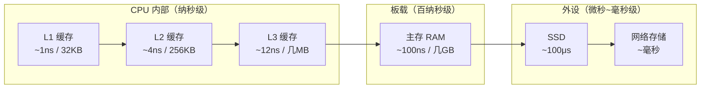

# $\rm Chapter \, 10$ 从竞赛机模型到真实硬件

> 你在 OJ 上写了一道 $\mathcal{O}(n)$ 的题，评测机显示用时 0.3 秒。同学写了一个理论上也是 $\mathcal{O}(n)$ 的算法，跑了 1.7 秒。评审说你的代码“缓存不友好”——缓存（cache）是什么？为什么它能让同一个复杂度的两个实现差出五倍？本章修正竞赛环境给你的一些不完整的硬件假设。

> **开始前自检**：本章假设你已经会：
>
> - □ 用复杂度分析过程序的运行时间（竞赛基础；第 1 章 §1.2 就是从一道 OJ 题讲起的）
> - □ 在 OJ 或本机观察过运行时间与内存占用（第 1 章 §1.9）
> - □ 知道可执行文件与进程的区别：进程是程序的一次运行实例（第 1 章 §1.2.4）

## $\rm \S \, 10.1$ 竞赛模型 vs 真实硬件模型

算法竞赛对计算机的建模是刻意简化的：

- **竞赛假设**：每次内存访问开销相同，CPU 按固定频率执行指令，复杂度相同 $\approx$ 运行时间差不多。
- **真实情况**：访问不同位置的内存，耗时可能差几百倍。CPU 在执行你的代码时，大部分时间不是在“算”，而是在**等数据**。

这不是说复杂度分析没用——它描述了增长趋势，在选择算法时不可替代。但两个同样 $\mathcal{O}(n)$ 的实现可能差 10 倍，原因不在算法，在硬件。

真实硬件可以用一个简化模型描述——不深入微架构细节，但足以解释“为什么这段代码慢”以及“评测机上的优化为什么不一定能迁移到服务器”。

---

## $\rm \S \, 10.2$ CPU：不只一个频率数字

### $\rm \S \, 10.2.1$ 核心、硬件线程与频率

你提交到 OJ 的程序通常跑在一个 CPU **核心**上。现代 CPU 有多个核心，每个核心可以独立执行指令。

- **物理核心**：芯片上实际的执行单元。
- **硬件线程**（Intel 叫 Hyper-Threading）：一个物理核心同时维护两套**寄存器**（register）状态——寄存器是 CPU 内部容量极小、访问最快的存储单元，每个硬件线程一套（§10.7 展开）——让操作系统看起来像有两个“逻辑 CPU”。当线程 A 在等内存时，线程 B 可以占用执行单元。它不等于核心数翻倍的性能——两个线程在共享同一组算术单元。
- **频率**：CPU 每秒的时钟周期数。$3.0 \, \text{GHz}$ = 每秒 30 亿个周期。但**一个周期不等于一条指令**。
- **IPC**（Instructions Per Cycle，每周期指令数）：平均每个周期完成了多少条指令。IPC 受指令间的依赖、**分支预测**（branch prediction，CPU 猜测 `if` 和循环会走哪条路，提前把那条路的指令取进来）和缓存命中率的影响巨大。一个高频率但低 IPC 的 CPU，实际吞吐量可能不如一个中等频率但高 IPC 的。
- **睿频**（Turbo Boost / Precision Boost）：CPU 在散热和功耗允许时自动超频。短时间任务可能跑在远高于基础频率的速度上。但持续高负载时，CPU 会降频以防止过热。

### $\rm \S \, 10.2.2$ 为什么同一个循环不是每次跑得一样快

在你的 OJ 经验中，同一段代码多次提交，运行时间可能波动 10%-20%。这在竞赛中无所谓（只要不超时），但在性能敏感的程序中需要理解原因：

- CPU 温度影响睿频持续时间；
- 操作系统的调度器可能把你的线程迁移到另一个核心；
- 缓存状态——冷缓存（cache cold，第一次运行，缓存是空的）vs 热缓存（cache warm，刚运行过，数据还在缓存里）；
- 其他进程争抢资源（内存带宽、缓存、执行单元）。

> **竞赛生迁移提示**：OJ 评测通常在一个干净环境中单次运行你的程序。真实服务器上，你的程序和其他几十个服务共享一台物理机。你在评测机上发现有效的 5% 微优化，在线程被抢占、缓存不断被其他进程刷新的服务器上可能完全测不出效果。

---

## $\rm \S \, 10.3$ 缓存：性能差异的最大来源

### $\rm \S \, 10.3.1$ 内存为什么“远”

第 1 章只提到过进程拥有自己的虚拟地址空间（[计算机程序与开发全景](../01-基础观念/01-计算机程序与开发全景.md) §1.2.4）；它到底意味着什么，在这里才讲清楚。从 CPU 的角度看，访问不同位置的数据，等待时间天差地别：



> **竞赛生迁移提示**：访问一次 RAM（约 $100 \, \text{ns}$）的时间里，CPU 大约要空等 300 个时钟周期（按 $3 \, \text{GHz}$ 折算）；按 IPC=1 折算约 300 条指令，而实际 IPC 通常大于 1，本可执行的指令更多。在 OJ 的百行小程序中你不会注意到这个差异——数据量小，所有东西都活在缓存里。但处理 GB 级数据集时，内存访问模式决定了性能上限。这就是为什么两个 $\mathcal{O}(n)$ 的程序在竞赛中可能都是 0.1 秒，在服务器上可能一个是 2 秒、一个是 20 秒。

### $\rm \S \, 10.3.2$ 局部性（locality）：缓存的原理

缓存之所以有效，靠的是程序的两个行为规律：

- **时间局部性**：你刚访问过的数据，很可能马上再访问。→ 缓存保留近期访问的内存行。
- **空间局部性**：你刚访问了 `arr[i]`，很可能马上访问 `arr[i+1]`。→ 缓存预取相邻内存行。

**缓存行**（cache line）是缓存与主存之间传输的最小单位，通常 64 字节。即使你只读一个 `int`（4 字节），CPU 也会把包含它的 64 字节一起加载到缓存。

### $\rm \S \, 10.3.3$ 用 C++ 例子理解缓存友好

考虑遍历二维数组的两种方式：

```cpp
// 方式 A：按行遍历
for (int i = 0; i < N; i++)
    for (int j = 0; j < N; j++)
        sum += arr[i][j];

// 方式 B：按列遍历
for (int j = 0; j < N; j++)
    for (int i = 0; i < N; i++)
        sum += arr[i][j];
```

在 C++ 中，二维数组按**行优先**（row-major）存储：`arr[0][0]`、`arr[0][1]`、`arr[0][2]`…在内存中是连续的。

- **方式 A**：按照内存中连续的顺序访问——每次缓存行加载后你可以用满 64 字节（16 个 `int`）。
- **方式 B**：每次访问都跳到另一行——缓存行刚加载的数据只用了一个 `int` 就被丢弃，下一次访问又跳到了很可能不在缓存中的位置。

两个实现都是 $\mathcal{O}(N^2)$，但在 $N = 4096$（约 $64 \, \text{MB}$）时，方式 B 可能比方式 A 慢 5–30 倍，具体倍数取决于机器的缓存大小。这不是理论上的差别——你可以在自己机器上用 `chrono` 计时验证（§10.10.1 给了完整程序）。

> **经验规则**：遍历多维数组时，让最内层循环匹配数据在内存中的连续方向。C++ 是行优先，Fortran/MATLAB 是列优先。

### $\rm \S \, 10.3.4$ 伪共享：多线程程序的隐形杀手

这一节涉及**线程**（thread）：同一进程内可以并行执行的两条指令流，共享同一个地址空间，因此能同时读写同一块内存。现在只需要这个最小含义，线程的完整机制在第 11 章 §11.3 详解。

当两个线程各自修改**不同**的变量，但这两个变量恰好落在同一个缓存行（64 字节）中时，CPU 的缓存一致性协议会让两个核心之间不断互相发送“这个缓存行被我改了”的信号——即使两个变量毫无逻辑关系，线程之间也在疯狂争抢缓存行所有权。

这就是**伪共享**（false sharing）。解决方法：在频繁写入的变量之间插入填充（padding），或使用线程局部存储，让不同线程的数据落在不同缓存行上。

---

## $\rm \S \, 10.4$ 不只是“内存多大”

### $\rm \S \, 10.4.1$ 物理内存、虚拟内存与页面缓存

进程有自己的虚拟地址空间（第 1 章 §1.2.4 提到过），所以“程序申请了多少内存”和“它真正占用多少物理 RAM”是两件事。内核实现这套地址空间靠的是**分页**（paging）：把虚拟地址空间和物理内存都切成固定大小的页（通常 $4 \, \text{KB}$），维护一张“虚拟页→物理页”的映射表。这里只需要两条结论：

- 申请的内存不立即对应物理 RAM；物理内存紧张时，暂时不用的页面会被写到磁盘（**交换空间 / swap**），再次访问时触发**缺页**（page fault）从磁盘读回，延迟从约 $100 \, \text{ns}$ 跳到约 $100 \, \text{μs}$。
- **页面缓存**（page cache）：内核把最近读写过的文件内容留在空闲 RAM 里，第二次读同一个文件通常不再访问磁盘。

背后的机制（分页、页表、按需分配、内存映射文件）在第 12 章 §12.2 展开。

### $\rm \S \, 10.4.2$ SSD 不是“更快的硬盘”

把 SSD 简单地看作“更快的 HDD”会掩盖一个重要的差异：

| 特性 | HDD | SSD |
|---|---|---|
| 随机读取延迟 | $\approx 10 \, \text{ms}$ | $\approx 0.1 \, \text{ms}$（快约 100 倍） |
| 顺序读取吞吐 | $\approx 150 \, \text{MB/s}$ | $\approx 3500 \, \text{MB/s}$（NVMe） |
| 写入寿命 | 受机械磨损限制（通常数年，与通电和启停次数有关） | 受写入总量（TBW）限制（日常开发中通常用不完） |
| 碎片影响 | 严重影响性能 | 几乎无影响（没有机械寻道） |

对开发者来说，最重要的区别是：**在 HDD 上避免随机 IO 是生死问题；在 SSD 上随机 IO 仍然比顺序 IO 慢，但差距缩小了**。这意味着你不需要像十年前那样精心设计数据结构来最小化磁盘寻道次数。但同时，**顺序 IO 在 SSD 上仍然更快**——如果你的程序可以改为顺序读写，不要因为 SSD 已经很快就不做这项优化。

---

## $\rm \S \, 10.5$ 数据搬运的隐形高速公路：PCIe

CPU 不是直接“看到”显卡、NVMe SSD 或网卡的。它们通过 **PCIe**（PCI Express）总线连接。

PCIe 的带宽通常用“通道数×代次”描述：`PCIe 4.0 x16` $\approx 32 \, \text{GB/s}$——这是 16 条通道**合计、单向**的带宽（单条通道约 $2 \, \text{GB/s}$），双向合计约 $64 \, \text{GB/s}$，[GPU、CUDA与AI计算](38-GPU-CUDA与AI计算.md)中的 $64 \, \text{GB/s}$ 指的正是这个双向口径。

对于 AI/GPU 开发来说，这个数字很重要：**模型加载到 GPU 显存（VRAM）时，数据需要从 CPU 的内存经过 PCIe 总线传输到 GPU 显存**。如果 PCIe 带宽是你的瓶颈，优化 GPU kernel 计算速度不会减少总耗时——因为 GPU 在大部分时间里实际上在**等数据到达**。

> 这就是[GPU、CUDA与AI计算](38-GPU-CUDA与AI计算.md)（选读）的前置知识。现在只需要知道：CPU 和 GPU 之间有一条带宽有限的通道，数据搬运的时间可能远超计算本身。

---

## $\rm \S \, 10.6$ 延迟、吞吐、并发、带宽：四个不能互换的维度

竞赛中你主要关心一个维度：**时间复杂度**→运行时间。真实性能涉及至少四个维度：

| 维度 | 含义 | 类比 |
|---|---|---|
| **延迟**（Latency） | 完成一个操作需要的时间 | 从下单到收到外卖的时间 |
| **吞吐量**（Throughput） | 单位时间内完成的操作数 | 外卖平台每小时能处理的订单数 |
| **并发度**（Concurrency） | 同时进行的操作数量 | 同时有多少个骑手在路上 |
| **带宽**（Bandwidth） | 单位时间内传输的数据量 | 水管每秒流过的水量（升/秒） |

四个维度衡量的是不同的东西，不能互相换算：水管的粗细（带宽）不决定水从这头流到那头要多久（延迟），同时有多少个骑手在路上（并发度）也不决定单个订单送得多快（吞吐量）。说“这条链路很快”之前，先问清自己在说哪个维度。

一个系统可以低延迟（单次操作很快）但低吞吐（一次只能做一个），也可以高吞吐但高延迟（每次操作慢，但能同时处理大量操作）。

这不只是硬件指标。同样的概念出现在：HTTP 服务器（低延迟→用户感知快；高吞吐→能支撑大量用户）、数据库查询、数据管道等。

---

## $\rm \S \, 10.7$ 汇编语言：CPU 真正“说”的语言

你写的 C++ 代码并不是 CPU 直接执行的。编译器把它翻译成**机器码**（machine code）——CPU 只认识的一串二进制字节；**汇编语言**（assembly language）是机器码的人类可读表示，一行汇编大约对应一条 CPU 指令。想看自己的代码变成了什么指令，用 `g++ -S` 就能停下来看一眼。

汇编的操作对象主要是**寄存器**——§10.2.1 提过的、CPU 内部容量很小（x86-64 只有 16 个通用寄存器）但访问速度最快的一批存储单元。

把下面三行存成 `demo.cpp`：

```cpp
int add(int a, int b) { return a + b; }
```

在同一目录运行（`-S` 只生成汇编、不继续汇编成机器码，`-o demo.s` 指定输出文件；GCC/Clang 系编译器都支持，Windows 上可用 MinGW 的 `g++`，或直接在 WSL 里跑）：

```bash
g++ -O2 -S -masm=intel demo.cpp -o demo.s
```

打开生成的 `demo.s`，找到 `add` 那一段。Linux / WSL（System V 调用约定，前两个整数参数放在 `rdi`、`rsi`）上大致是：

```asm
add:
    lea     eax, [rdi+rsi]
    ret
```

Windows 上的 MinGW g++ 用另一套调用约定，参数放在 `rcx`、`rdx`，生成的是同样形状的 `lea eax, [rcx+rdx]` 加 `ret`（寄存器名随平台变化，指令形状不变）。两个参数已经在寄存器里，所以“加法”只需要一条 `lea`（算出和）和一条 `ret`（返回），没有内存访问。`;` 在汇编里是注释；GDB 默认显示 AT&T 风格，`set disassembly-flavor intel` 可切换成上面这种 Intel 风格——指令含义不变。

为什么你需要知道汇编的存在？三个理由：

1. **调试崩溃时 GDB 可能显示汇编**——它的 `disassemble`（反汇编）命令会把当前函数还原成汇编代码，看到它时你不至于以为 GDB 坏了。
2. **理解性能**——编译器开启优化（`-O2`/`-O3`）后，你的 C++ 循环可能变成和源码对不上的汇编（循环展开、向量化、删除“无用”计算），这正是下一节“评测机上的优化不一定迁移”的底层原因。
3. **安全漏洞**——缓冲区溢出等漏洞本质上是汇编层面的问题：程序按 `mov`、`call` 一条条执行时，把数据写到了不该写的位置。

你不需要会写汇编。但看到这些指令时，知道它们是 CPU 的基本动作就够了：`mov`（搬运数据）、`add`（加法）、`cmp`（比较）、`jmp`（跳转——配合 `cmp` 实现 if 和循环）、`call`/`ret`（调用函数/返回）。

最后，不同 CPU 架构有不同的汇编——x86-64（桌面/服务器）、ARM（手机、Mac）、RISC-V（开源新架构）的指令各不相同，但思想相同：都是“加载、计算、存储、跳转”的组合，换架构只是查手册的问题。

---

## $\rm \S \, 10.8$ 为什么评测机上的优化不一定迁移

假设你在 OJ 上听人说“除法比移位慢”，于是想用位运算替换除法：

```cpp
// 两种写法只在 a >= 0 时结果相同：
// a / 4  是整数除法，向零取整（a = -5 时得 -1）
// a >> 2 是算术右移，向下取整（a = -5 时得 -2）
int x = a / 4;
int y = a >> 2;
```

要比较这两行的耗时，得用 `std::chrono` 把“重复几千万次的循环”包起来、每种写法各跑多次取中位数（§10.10.1 有完整的计时骨架），单次调用那点差别在这种方法下才能读出方向。

你测出改用位运算确实快了一点。但当你把同一份代码部署到服务器上时：

1. 服务器 CPU 的除法器和你的本地 CPU 不同代——差距可能缩小甚至反转；
2. 编译器的优化器（`-O2`、`-O3`）**比你更擅长这类微优化**——它很可能已经把 `a/4` 优化成了移位；
3. 这点差别在数据库查询和网络 I/O 的背景噪声中**完全不可测量**；
4. 你把 `a/4` 改成了 `a >> 2`，代码的可读性下降了——下一个维护这段代码的人需要停下来思考“为什么这里不用除法？”

---

## $\rm \S \, 10.9$ 外设：你和计算机之间的桥梁

前面讲的都是机箱里的东西。但作为开发者，你每天直接接触的是**输入输出设备**——键盘、鼠标、显示器、触控板。这一节是**选读**：跳过它不影响后面任何章节，也不影响本章自测；需要选设备时再回来查。

### $\rm \S \, 10.9.1$ 键盘：机械 vs 薄膜 vs 静电容

你每天敲几万次键盘。三种主流键轴技术：

| 类型 | 原理 | 手感 | 寿命 | 代表 |
|------|------|------|------|------|
| **薄膜**（membrane） | 按下导电层接触电路板 | 软绵、反馈模糊 | 约 500 万次 | 笔记本自带、办公键盘 |
| **机械**（mechanical） | 每个键有独立弹簧+触点开关 | 清晰段落感或线性 | 约 5000 万–1 亿次 | Cherry MX、国产轴 |
| **静电容**（electrostatic capacitive） | 按下改变电容值，无物理接触 | 极轻、顺滑 | 无触点磨损，寿命由厂商标称（随型号不同） | HHKB、RealForce |

**机械轴的类型**（最影响手感）：

| 轴体颜色 | 手感 | 声音 | 适合 |
|---------|------|------|------|
| **红轴**（线性） | 直上直下，无段落，压力较轻 | 小（无段落声，仍有触底声） | 游戏、长时间打字 |
| **茶轴**（微段落） | 略有“咔”的确认感，压力适中 | 中等 | 想要确认感又怕吵 |
| **青轴**（强段落） | 明显“咔嗒”声和阻力 | 大（清脆，共享办公室容易扰人） | 打字反馈强，**不适合开放式办公室** |

表中的寿命（按键次数）是厂商标称值，随型号与使用方式不同，只适合比较量级。

如果周围环境允许敲击声、又不知道自己喜欢什么手感，茶轴是折中的起点；已经确定在共享办公室用，就先看静音红轴或静音轴；条件允许的话，去实体店按几下比看评测可靠得多。

**键盘布局**：主流是 ANSI（美式，Enter 键横条）和 ISO（欧式，Enter 键倒 L 形）。程序员倾向于 ANSI——`\` 和 `|` 在 Enter 上方更易触及，`"` 和 `'` 的位置也更顺手。

### $\rm \S \, 10.9.2$ 鼠标与触控板：DPI、轮询率和加速度

- **DPI**（Dots Per Inch）：鼠标每移动 1 英寸光标移动的像素数。不是越高越好——$400$—$800$ DPI 适合精确操作，$1600+$ 适合快速移动。太高了光标“飘”。
- **轮询率**（polling rate）：鼠标每秒向电脑报告位置的次数，$125 \, \text{Hz}$ 到 $1000 \, \text{Hz}$ 不等。日常写代码时 $125 \, \text{Hz}$ 以上就够用，更高的轮询率主要影响游戏瞄准手感；它不改变光标定位精度，只改变位置更新的频率。
- **加速度**：操作系统会让光标移动速度随鼠标移动速度非线性增长。大多数程序员**关掉加速度**（“提高指针精确度”选项取消勾选）——因为代码定位需要肌肉记忆，速度应恒定。

### $\rm \S \, 10.9.3$ 显示器：分辨率、刷新率、色域、接口

| 参数 | 含义 | 建议 |
|------|------|------|
| **分辨率** | 屏幕像素数 | $1920\times1080$（1080p）起步；$2560\times1440$（2K）是甜点——够清晰不贵；$3840\times2160$（4K）字太小需缩放 |
| **刷新率** | 每秒重绘次数 | $60 \, \text{Hz}$ 够编程；$120+ \, \text{Hz}$ 滚动代码更顺滑，不是刚需但用了回不去 |
| **面板** | LCD 的三种主流类型：IPS（色彩好、可视角度大）、VA（对比度高）、TN（响应快但色彩差）；OLED 是另一类技术（像素自发光、黑色更纯） | 文字为主选 IPS——清晰、不偏色；IPS 的对比度低于 VA，暗环境下看黑色会发灰 |
| **烧屏** | OLED 长时间固定显示同一画面（状态栏、终端标题栏）会留下残影，且不可逆 | 长时间写代码、固定布局的界面，OLED 需要靠隐藏任务栏、调低亮度来规避 |
| **接口** | HDMI / DisplayPort / USB-C | 需要高刷或菊花链时选 DP；USB-C 一根线传视频+给笔记本充电，但要确认接口支持视频输出（DP Alt Mode） |

如果经常在代码、终端、文档之间来回切换，一块外接显示器带来的收益通常大于同价位的其他外设——但前提是桌面放得下、显卡有可用的输出接口；只有一台笔记本加一张小桌子的场景，先解决支架和键盘位置更实际。

### $\rm \S \, 10.9.4$ 接口速查

| 接口 | 形状 | 协议上限（随版本变化） | 典型用途 |
|------|------|------|---------|
| USB-A | 矩形，单面插 | 480 Mbps（USB 2.0）到 10 Gbps（USB 3.2） | 键盘、鼠标、U 盘 |
| USB-C | 椭圆，正反插 | 480 Mbps—40 Gbps（USB 2.0 到 USB4 / Thunderbolt） | 充电、显示器、外接硬盘 |
| HDMI | 梯形，19 针 | 10.2—48 Gbps（1.4 → 2.1） | 显示器、电视 |
| DisplayPort | 矩形斜角 | 约 21.6—80 Gbps（1.2 → 2.1） | 高刷显示器、菊花链 |
| 3.5mm 音频口 | 圆形 | — | 耳机、麦克风 |
| RJ-45（以太网） | 方形 8 针 | 100 Mbps—10 Gbps（百兆 → 万兆） | 有线网络 |

换算锚点：$8 \, \text{Gbps} = 1 \, \text{GB/s}$（小写 b 是 bit，大写 B 是 Byte）。形状不决定速度——同样是 USB-A 的接口，插在 USB 2.0 口上只有 $480 \, \text{Mbps}$；上表是各协议的**上限**，实际速度由接口版本、线材和两端设备中最低的一档决定。

买外设前先看接口：笔记本只有 USB-C 就要扩展坞；显示器只有 HDMI 1.4 跑不了 4K@60Hz；无线键盘很好，桌面放根充电线以防没电。

---

## $\rm \S \, 10.10$ 动手实践

### $\rm \S \, 10.10.1$ 实践一：验证缓存行效应

把下面这段程序存成 `cache_demo.cpp`。它用两种顺序遍历同一个 $4096 \times 4096$ 的 `int` 数组（工作集约 $64 \, \text{MB}$，即 §10.3.3 中的 $N = 4096$），分别计时：

```cpp
#include <chrono>
#include <cstddef>
#include <cstdio>
#include <vector>

double elapsed_ms(std::chrono::steady_clock::time_point a,
                  std::chrono::steady_clock::time_point b) {
    return std::chrono::duration<double, std::milli>(b - a).count();
}

int main() {
    constexpr int N = 4096;
    std::vector<int> arr(static_cast<std::size_t>(N) * N, 1);
    long long sum = 0;

    auto t0 = std::chrono::steady_clock::now();
    for (int i = 0; i < N; i++)                    // 方式 A：按行遍历
        for (int j = 0; j < N; j++)
            sum += arr[static_cast<std::size_t>(i) * N + j];
    auto t1 = std::chrono::steady_clock::now();

    for (int j = 0; j < N; j++)                    // 方式 B：按列遍历
        for (int i = 0; i < N; i++)
            sum += arr[static_cast<std::size_t>(i) * N + j];
    auto t2 = std::chrono::steady_clock::now();

    std::printf("sum=%lld\nA: %.0f ms\nB: %.0f ms\nB/A: %.1f\n",
                sum, elapsed_ms(t0, t1), elapsed_ms(t1, t2),
                elapsed_ms(t1, t2) / elapsed_ms(t0, t1));
}
```

在文件所在目录编译运行。`-O0` 和 `-O2` 各测一次（`-O2` 会做优化，比值可能变化；`sum` 被打印出来，就是为了防止 `-O2` 把求和循环整个删掉）：

```bash
g++ -O0 -std=c++17 cache_demo.cpp -o cache_demo_O0    # 不优化
g++ -O2 -std=c++17 cache_demo.cpp -o cache_demo_O2    # 优化
./cache_demo_O2     # PowerShell 下写 .\cache_demo_O2.exe
./cache_demo_O0     # PowerShell 下写 .\cache_demo_O0.exe
```

预期输出与判据：输出里 `B/A` 明显大于 1——方式 A（行优先）通常比方式 B（列优先）快 5–30 倍左右，具体倍数取决于你的 CPU 和内存。把 `N` 改成 8192（约 $256 \, \text{MB}$）再测一次，多数机器上比值会更大，因为数据更装不进缓存。

> 不要追求精确倍数：`-O2` 可能对某个循环做向量化，缓存大小也因机器而异。这个实践要看的是**方向**——同样的运算量，只因访问顺序不同就能差出数倍。

### $\rm \S \, 10.10.2$ 实践二：观察 CPU 频率和缓存信息

```powershell
# PowerShell（Windows）— 只读查询，不修改任何设置
Get-CimInstance Win32_Processor | Select-Object Name, NumberOfCores, NumberOfLogicalProcessors, MaxClockSpeed, L2CacheSize, L3CacheSize
```

```bash
# Bash / Zsh（Linux；macOS 下 getconf / /proc/cpuinfo 不可用，改用 sysctl -a | grep -i cache）
lscpu | grep -i cache            # L1d/L1i/L2/L3 各级容量
lscpu | grep -E "^CPU\(s\)|Thread|Core"   # 逻辑 CPU 数、每核线程数
getconf -a | grep CACHE          # Linux 专有：缓存大小
cat /proc/cpuinfo | head -20     # Linux 专有：每个逻辑 CPU 的信息
```

Windows 输出的 `L2CacheSize`/`L3CacheSize` 单位是 KB。不用深究每项细节——重点是看到“缓存分级、每级大小不同”以及“逻辑 CPU 数 ≠ 物理核心数”。预期输出：`NumberOfLogicalProcessors` 大于 `NumberOfCores`，`L1 < L2 < L3` 的容量依次增大。

### $\rm \S \, 10.10.3$ 实践三：用 `time` 测量真实程序的执行阶段

下面的命令在文件所在目录运行。先准备一个能观察到等待的任务——读一个自己生成的大文件：

```bash
# Bash / Zsh（Linux / macOS / WSL）
head -c 100M /dev/urandom > large_input.txt   # 在当前目录生成约 100 MB 文件
time cat large_input.txt > /dev/null          # 只读不显示，观察 real/user/sys
time g++ -O2 cache_demo.cpp -o cache_demo     # 也可以测编译：编译是 CPU 密集型
```

```powershell
# PowerShell（Windows）：没有 /dev/urandom，也没有 time 命令
[System.IO.File]::WriteAllBytes("$PWD\large_input.txt", (New-Object byte[] 104857600))

# Measure-Command 只给总耗时（相当于 real），看不到 user/sys
Measure-Command { [System.IO.File]::ReadAllBytes("$PWD\large_input.txt") | Out-Null } | Select-Object TotalSeconds
```

`time` 输出三部分：实际耗时（real/wall clock）、用户态 CPU 时间（user）、内核态 CPU 时间（sys）。在**单线程**程序里，`user+sys` 是 CPU 实际在工作的时间，`real - (user+sys)` 是在等 I/O、等网络的时间；多线程程序（或程序在多核上并行）里 `user+sys` 可以大于 `real`，因为它是所有线程 CPU 时间的**总和**，此时不能用减法推等待时间。预期输出：`time` 打印 real/user/sys 三行；连续跑几次，`real` 的波动通常比 `user+sys` 大——波动的那部分就是调度与 I/O 噪声。

---

## $\rm \S \, 10.11$ 总结

- **复杂度指导算法选择，但不能预测绝对速度**。缓存局部性、分支预测、系统负载可以让同样 $\mathcal{O}(n)$ 的实现差 10 倍。
- **CPU 普遍有 2–3 级缓存（现代桌面与服务器常见 L1/L2/L3 三级），访问 RAM 比访问 L1 慢约 100 倍**。内存访问模式（时间局部性 + 空间局部性）决定了真实性能。
- **多线程性能不只取决于核心数**。伪共享、缓存一致性协议和调度迁移影响远比核心数更隐蔽。
- **延迟、吞吐、带宽、并发度衡量不同的东西**。知道你在测量什么，才能判断优化方向对不对。
- **在测量之前不要优化**。编译器比你更擅长微优化。先改算法和数据结构，再改内存访问模式。

---

## $\rm \S \, 10.12$ 关键概念回顾

1. CPU 频率、核心数和 IPC 分别衡量什么？三者怎样共同决定“每秒执行多少指令”？

2. 为什么访问 RAM 比访问 L1 缓存慢约 100 倍？时间局部性和空间局部性分别指什么？

3. 遍历二维数组时，为什么在 C++ 中按行遍历比按列遍历快？

4. 两个线程各自修改不同变量，为什么可能因为伪共享而变慢？

5. 延迟和吞吐量的区别是什么？一个系统可以同时做到高延迟和高吞吐吗？

## $\rm \S \, 10.13$ 应用与辨析

6. 为什么说“评测机上的微优化不一定能迁移到服务器”？

7. 在 `lscpu` 输出中你看到 16 个 CPU，但物理核心只有 8 个。这是怎么回事？这对评估并行收益有什么影响？

## $\rm \S \, 10.14$ 本章自测答案

> 先闭卷作答本章“关键概念回顾”与“应用与辨析”，再核对以下答案。

### $\rm \S \, 10.14.1$ 自测答案 · 关键概念回顾
1. 频率是每秒的时钟周期数，核心数是可并行执行的单元数，IPC 是每个周期完成的指令数；三者相乘才近似每秒指令数，任何一项都不是单独的决定因素（IPC 受缓存命中、分支预测影响最大）。
2. 因为访问路径和介质不同：L1 是 CPU 核心内的 SRAM，几个时钟周期就能命中（约 $1 \, \text{ns}$）；RAM 要经内存控制器访问芯片外的 DRAM 颗粒，包含行激活与 CAS 延迟（约 $100 \, \text{ns}$）。时间局部性=刚访问过的数据很可能马上再访问，空间局部性=访问了 arr[i] 后很可能访问 arr[i+1]。
3. C++ 二维数组按行优先连续存储：按行遍历时每次加载的 64 字节缓存行能被 16 个 int 用满；按列遍历每次跳到另一行，缓存行只用 1 个 int 就被丢弃，频繁缺缓存。
4. 当两个变量恰好落在同一个缓存行（64 字节）时，缓存一致性协议让两个核心不断争抢缓存行所有权、互相发送失效信号，即使变量逻辑上毫无关系。
5. 延迟是单个操作完成的时间，吞吐量是单位时间完成的操作数；可以——比如每次操作慢但能同时处理大量任务的系统就是高延迟高吞吐。

### $\rm \S \, 10.14.2$ 自测答案 · 应用与辨析
6. 服务器 CPU 代次不同差距可能缩小甚至反转、编译器（`-O2`/`-O3`）比你更擅长这类微优化、微秒级差距被数据库查询和网络 I/O 的噪声淹没，还牺牲了可读性；优化应先算法和数据结构，再缓存局部性，最后才是指令级微调。
7. 开启了超线程（硬件线程）：每个物理核心维护两套寄存器状态，操作系统把它看作两个逻辑 CPU，但两个逻辑 CPU 共享同一组执行单元；16 个逻辑 CPU 不等于 16 个物理核心的吞吐，估算并行加速上限时应按物理核心数计算。

---

> 你现在能：在自己机器上跑出缓存友好与不友好的遍历耗时比，并用缓存行、局部性与 IPC 解释这个比值。

到这里，CPU 和缓存只是故事的一半——CPU 上的程序是谁在管理？多个程序怎么共享一台机器？为什么你在终端按 Ctrl+C 就能停止一个程序？下一章[操作系统、进程与线程](11-操作系统进程与线程.md)把镜头拉到操作系统层面。
