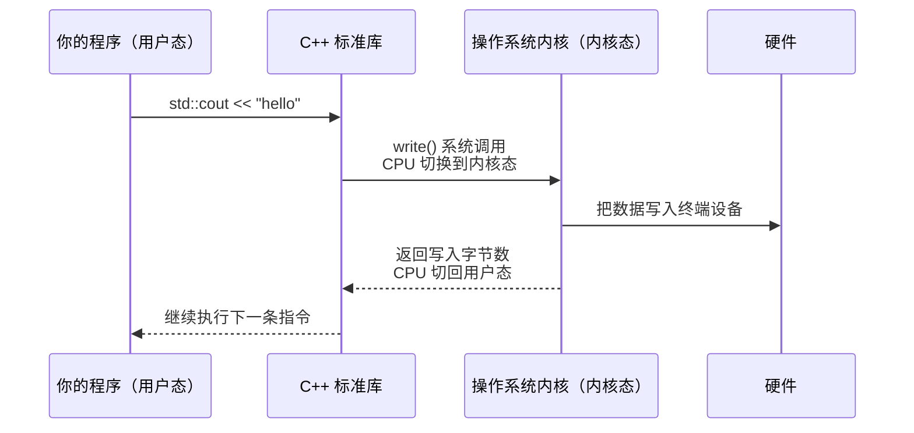
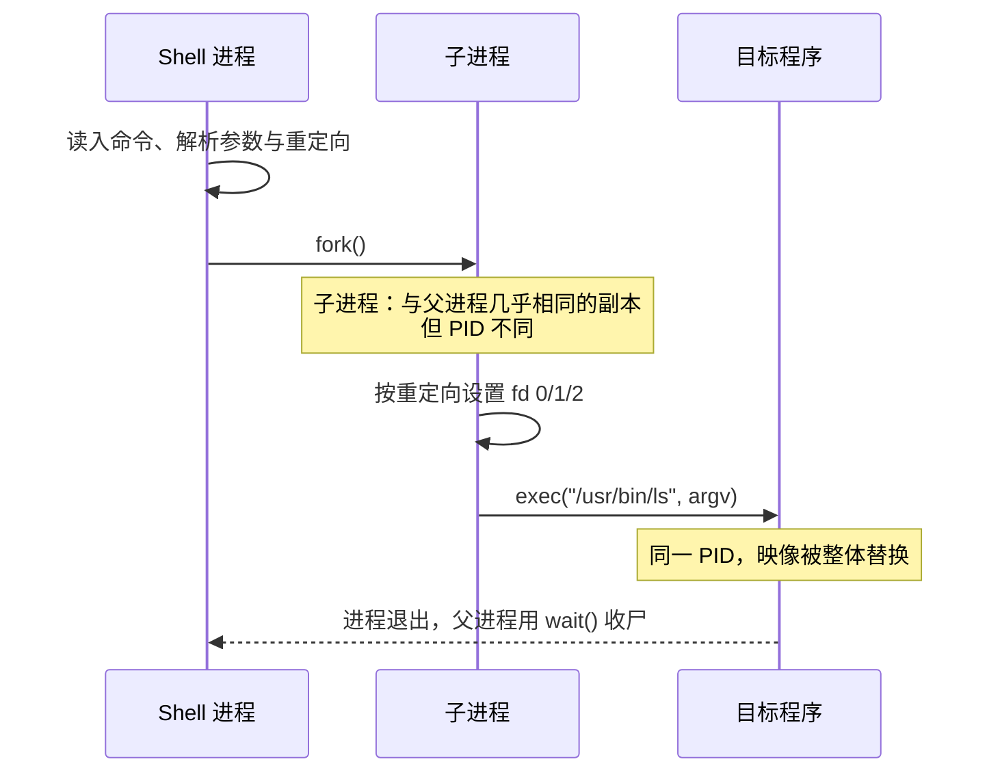

# $\rm Chapter \, 11$ 操作系统、进程与线程

> 在[计算机程序与开发全景](../01-基础观念/01-计算机程序与开发全景.md)中你第一次听到“进程”这个词——可执行文件躺在磁盘上，双击或敲回车后操作系统把它变成**进程**，分配 PID、虚拟地址空间、标准流和环境变量。在[终端、Shell与命令行](../02-终端与工具/02-终端Shell与命令行.md)中你用 `Ctrl+C` 中断过前台程序。在[从竞赛机模型到真实硬件](10-计算机硬件速通.md)中你看到了 CPU 的物理面貌——多核心、缓存层级、硬件线程。现在把这些串起来：谁在决定哪个程序跑在哪个核心上？一个程序为什么要同时做多件事？“卡死”是怎么发生的？

> **开始前自检**：本章假设你已经会：
>
> - □ 在第 1 章见过“进程是程序的一次运行”的说法
> - □ 会用终端运行命令并查看输出（第 2 章）
> - □ 能区分“源代码”与“运行中的程序”（第 1 章 §1.2）

## $\rm \S \, 11.1$ 内核态与用户态：一扇你看不到的门

在 OJ 上写代码时，你调用 `std::cin`、`new`、`fopen`，它们最终都变成了对操作系统的请求。但你的程序不能直接操作硬盘、网卡或内存控制器——这些硬件被操作系统**独占管理**。

### $\rm \S \, 11.1.1$ 两种执行模式

现代 CPU 至少有两种特权级别（x86 上叫 Ring 0 和 Ring 3，ARM 上叫 EL1 和 EL0）：

- **内核态**（kernel mode）：操作系统内核运行的级别。可以执行任何 CPU 指令、访问任何内存地址、直接控制硬件。
- **用户态**（user mode）：你的程序（以及你使用的几乎所有软件）运行的级别。不能直接访问硬件，不能修改页表，不能执行特权指令。



当你的 C++ 代码写 `std::cout << "hello"`，上面这张图中的每一步都在发生。每一次“和外界交互”——读文件、发网络包、申请内存、创建线程——都要经过**系统调用**（system call），触发用户态↔内核态的切换。这个切换本身有几十到几百个时钟周期的开销。这就是为什么系统调用比普通函数调用慢很多——在[从竞赛机模型到真实硬件](10-计算机硬件速通.md)中你见过同类量级的对比：访问一次 RAM 的时间，CPU 本来可以执行约 300 条指令。

> **类比**：用户态像在图书馆阅览室——你可以自由翻阅自己桌上的书，但不能进入书库。每次你需要一本不在桌上的书，就要填一张索书单（系统调用），等图书管理员（内核）从书库取出来交给你。这个过程比伸手拿桌上的书慢得多。

### $\rm \S \, 11.1.2$ 哪些操作会触发系统调用

你在 C++ 竞赛代码中每天都在用的这些操作，背后全是系统调用：

| 操作 | 底层系统调用（Linux） | 开销量级 |
|---|---|---|
| `std::cin` / `scanf` | `read()` | 微秒级 |
| `std::cout` / `printf` | `write()` | 微秒级 |
| `new` / `malloc`（大块） | `mmap()` 或 `brk()` | 不定（可能只操作用户态） |
| `fopen` | `open()` | 微秒级 |
| `std::thread` | `clone()` | 百微秒级 |
| `std::this_thread::sleep_for` | `nanosleep()` | 至少受调度粒度影响 |

在 OJ 的短程序中这些开销无关紧要。但在服务器程序中，每秒钟可能有几万到几十万次系统调用——减少不必要的系统调用是最有效的优化之一（比如把多次小 `write()` 合并为一次大 `write()`，这就是 C++ 中 `std::ios::sync_with_stdio` 能提速的原因——它禁用了 C 和 C++ 标准流之间的同步，减少了隐含的系统调用）。

### $\rm \S \, 11.1.3$ 内核：操作系统里始终运行的那段代码

前两节说的系统调用、特权级别，都属于同一个东西：**内核**（kernel）——操作系统里始终运行在内存中的一段核心代码。它负责四件事：

- **管理 CPU**：决定哪个进程/线程运行、运行多久——调度器就是内核的一部分（§11.2 展开）；
- **管理内存**：谁用哪块内存、页表怎么映射（第 12 章展开）；
- **管理设备**：通过**设备驱动**（device driver）与磁盘、网卡、显卡等硬件打交道；
- **提供系统调用接口**：用户态程序请求内核服务的唯一入口——就是 §11.1.2 那张表。

Linux 内核属于**宏内核**（monolithic kernel）——上述功能全部放在一个大的内核程序里，各部分之间直接互相调用。Windows 和 macOS 的内核（NT 内核、XNU）也把核心功能收在内核里运行（XNU 是 Mach 与 BSD 组合成的混合内核，结构并不完全相同），主线不需要区分它们的细节差异。

你不需要“学内核”，但需要记住它的角色：当你的程序说“我要读文件”时，内核替你去和磁盘控制器打交道——**你的程序永远不直接碰硬件**，这正是 §11.1.1 用户态存在的意义。

想知道当前机器跑的是哪个内核？Linux/macOS 的终端里运行：

```bash
uname -r
# 输出示例：6.8.0-45-generic
```

Windows 没有对应的单条命令，用 `winver` 查看系统版本号即可。

---

## $\rm \S \, 11.2$ 调度器：谁来决定下一个运行的是谁

你的电脑有 8 个核心（或 16 个硬件线程），但同时运行的程序和后台服务可能有几百个。**调度器**（scheduler）是内核的组件，负责决定“下一个使用 CPU 的是哪个线程”。

### $\rm \S \, 11.2.1$ 时间片与抢占

调度器不给任何线程无限的 CPU 时间。它把 CPU 时间切成短的时间片（time slice，通常几毫秒到几十毫秒），轮流分配给就绪的线程。当一个线程的时间片用完，或者它自己主动放弃（如在等 I/O），调度器就切换到下一个线程。

这个过程叫**上下文切换**（context switch）：保存当前线程的寄存器、程序计数器和栈指针，加载下一个线程的。

上下文切换不是免费的——每次切换消耗几微秒，更重要的是它刷掉了 CPU 的 L1/L2 缓存和分支预测器的状态。一个频繁被换下的线程，每次回来时缓存是冷的，性能大幅下降。这就解释了[从竞赛机模型到真实硬件](10-计算机硬件速通.md)中的结论：**在评测机上有效的微优化，在共享服务器上可能完全测不出效果**——你的线程频繁被换下，任何精细的流水线和缓存优化都被上下文切换抹平了。

### $\rm \S \, 11.2.2$ 优先级与 nice 值

不是所有线程都平等。调度器给高优先级线程更多 CPU 时间。在 Linux 上，`nice` 值范围从 -20（最高优先级）到 19（最低优先级）。普通程序默认 nice=0。

```bash
# 以较低优先级启动程序
nice -n 10 ./long_running_task
# 调整已运行进程的优先级
renice -n 5 -p 12345
```

你不应该随便调优先级——把一个普通程序设成高优先级，可能导致系统交互变卡（把 nice 调到 0 以下需要 root 或 `CAP_SYS_NICE` 权限，普通用户只能调低优先级）。这个机制的真正用途是：**确保紧急任务不被后台任务饿死**。比如你手动启动一个大数据处理任务，主动给它低优先级，让它不干扰你写代码和浏览网页。

### $\rm \S \, 11.2.3$ 调度策略

Linux 的普通任务（`SCHED_NORMAL`）默认使用公平调度：长期以来的实现是 **CFS**（Completely Fair Scheduler），核心思想是“让每个线程获得公平的 CPU 时间”；内核 6.6（2023 年）起开始转向同族的 **EEVDF**（Earliest Eligible Virtual Deadline First），这个“按权重分时间”的基本思想没有变。还有实时调度策略（`SCHED_FIFO`、`SCHED_RR`）用于音视频处理、工业控制等对延迟有硬性要求的场景。日常应用开发不需要碰这些——但知道它们存在，可以解释为什么某些服务（如音频处理）会申请实时优先级。

### $\rm \S \, 11.2.4$ CPU 亲和性

你可以告诉调度器“这个线程只允许在核心 3 和核心 4 上运行”：

```bash
taskset -c 3,4 ./my_program
```

这在两种场景中有用：
- 避免线程在不同核心间频繁迁移，保持 L1/L2 缓存热度；
- 把计算密集线程和 I/O 密集线程分配到不同核心，避免相互干扰。

但大多数情况下，让调度器自己决定比你手动绑定核心效果更好。调度器知道全局负载，而你只知道自己的程序。

---

## $\rm \S \, 11.3$ 线程：同一个地址空间里的多条执行流

### $\rm \S \, 11.3.1$ 进程 vs 线程——一个具体对比

在[计算机程序与开发全景](../01-基础观念/01-计算机程序与开发全景.md)中区分了“可执行文件”（磁盘上的静态产物）和“进程”（某次运行的实例）。现在加上线程：

| 维度 | 进程 | 线程 |
|---|---|---|
| 地址空间 | 独立 | 共享所属进程的地址空间 |
| 创建开销 | 较大（复制页表、文件描述符等） | 较小（只需栈和寄存器上下文） |
| 通信方式 | IPC——进程间通信（管道、共享内存、Socket——详见第 23 章） | 直接读写共享变量 |
| 隔离性 | 一个进程崩溃不影响其他进程 | 一个线程的越界写可能损坏其他线程的数据 |
| 典型数量 | 几十到几百 | 几千到几十万（协程/轻量线程） |

“一个程序同时做多件事”几乎都是用多线程实现的——浏览器用不同线程分别处理每个标签页的渲染和网络请求，游戏引擎用不同线程分别处理物理模拟、AI 和渲染，你的 Python 后端（第 17 章）用线程池处理同时到达的多个 HTTP 请求（第 23 章）。

### $\rm \S \, 11.3.2$ C++ 中的线程

C++11 引入了标准线程库。如果你只写过单线程算法题，下面是你需要知道的最小集合：

```cpp
#include <thread>
#include <mutex>
#include <atomic>
#include <vector>
#include <iostream>

std::mutex mtx;           // 互斥锁
int shared_counter = 0;   // 被多个线程共享的变量

void worker() {
    for (int i = 0; i < 1000; i++) {
        std::lock_guard<std::mutex> lock(mtx);  // 自动加锁，离开作用域自动解锁
        shared_counter++;
        // lock_guard 析构 → 自动释放锁，即使异常也安全
    }
}

int main() {
    std::vector<std::thread> threads;
    for (int i = 0; i < 4; i++)
        threads.emplace_back(worker);
    
    for (auto& t : threads)
        t.join();   // 等待线程结束
    
    std::cout << shared_counter << '\n';  // 4000
    return 0;
}
```

在竞赛中，你不关心并发——输入是确定的，程序是单线程的。但在真实系统中，并发是常态，也是最难调试的 bug 来源。

### $\rm \S \, 11.3.3$ 数据竞争与锁

上面代码中如果把 `lock_guard` 去掉，四个线程同时 `shared_counter++`，最终结果很可能不是 4000。原因是 `counter++` 不是原子操作——它实际是“读→加→写”三步，两个线程可能同时读到旧值，导致一次加操作丢失。

这就是**数据竞争**（data race）。C++ 标准定义数据竞争为**未定义行为**——编译器假设它不会发生，可能做出任何优化。

`std::mutex` + `std::lock_guard` 是最基础的解决方案：每次只有一个线程能进入加锁区域。代价是并行度下降——如果所有线程大部分时间都在等锁，多线程反而不如单线程。

### $\rm \S \, 11.3.4$ 原子操作

对于简单计数器，可以用 `std::atomic` 避免互斥锁的开销：

```cpp
std::atomic<int> counter{0};

void worker() {
    for (int i = 0; i < 1000; i++)
        counter.fetch_add(1, std::memory_order_relaxed);
        // 原子加——没有"读-改-写"的中间状态
}
```

原子操作由 CPU 硬件直接支持（通过特殊的原子指令），比互斥锁快得多，但只适用于简单操作。复杂的多步操作仍然需要锁。

### $\rm \S \, 11.3.5$ 死锁：两个线程在互相等待

```cpp
std::mutex a, b;

// 线程 1
void f1() {
    a.lock();
    b.lock();   // 如果线程 2 同时锁了 b，这里会永远等待
    // ...
    b.unlock();
    a.unlock();
}

// 线程 2
void f2() {
    b.lock();
    a.lock();   // 等线程 1 释放 a，但线程 1 在等 b
    // ...
    a.unlock();
    b.unlock();
}
```

两条线程各持一把锁、等另一把——谁都不会放开。

**预防死锁的经验规则**：
1. 所有线程按**相同的顺序**获取锁（先 a 后 b，不要有先 b 后 a）。
2. 如果必须获取多把锁，用 `std::lock(a, b)` 一次性获取，它内部使用死锁避免算法。
3. 尽量缩小锁的范围（加锁→干活→解锁，不要在锁内做 I/O 或长时间计算）。
4. 考虑用无锁数据结构（并发队列、原子变量）替代显式锁。


### $\rm \S \, 11.3.6$ 更多并发原语速览

`std::mutex` 只是起点。C++ 标准库还提供了（你不用全部记住，但要知道每种锁解决什么问题）：

| 原语 | 解决的问题 |
|---|---|
| `std::shared_mutex` | 读写锁：多个读者可以同时读，写者独占 |
| `std::condition_variable` | 线程等待“某个条件成立”：生产者-消费者模式 |
| `std::counting_semaphore`（C++20） | 限流：最多 N 个线程同时访问资源 |
| `std::barrier`（C++20） | 多个线程等待所有人都到达某一点再继续 |
| `std::future` / `std::async` | 异步任务：启动一个后台计算，之后取结果 |
| `std::jthread`（C++20） | 自动 join 的线程（避免忘记 join 导致 `std::terminate`） |

每种原语对应一类常见的并发场景。你不需要现在记住全部 API，但当你遇到“我需要线程 B 等线程 A 完成某件事再继续”时，知道有 `condition_variable` 这个东西存在，再去查文档。

---

## $\rm \S \, 11.4$ 信号：操作系统打断程序的方式

### $\rm \S \, 11.4.1$ 什么是信号

信号是操作系统发给进程的“异步通知”——有点像你在答题时，监考老师拍了拍你的肩膀说“还有五分钟”。

你对信号其实已经不陌生了：
- **Ctrl+C** 向当前前台程序发送 `SIGINT`（中断信号），请求程序停止。这就是[终端、Shell与命令行](../02-终端与工具/02-终端Shell与命令行.md)中提到的“它只是请求中断当前前台程序，已经写入的文件不会自动回滚”。
- 访问非法内存地址 → `SIGSEGV`（段错误），你看到的 “Segmentation fault” 就是这样来的。
- 除零 → `SIGFPE`。
- `kill -9 PID` → `SIGKILL`，强制终止进程，进程没有机会执行任何清理。

### $\rm \S \, 11.4.2$ 程序可以处理信号

进程可以注册**信号处理函数**，在收到信号时执行特定动作——比如在收到 `SIGINT` 时关闭文件、释放锁、记录“服务正在优雅退出”的日志，然后再退出。这就是[日常系统管理：软件、用户、服务与日志](13-系统服务日志与软件安装.md)一章会展开的**优雅退出**（graceful shutdown）的基础。

`SIGKILL` 和 `SIGSTOP` 是例外——它们不能被捕获或忽略，保证始终能强制终止一个失控的进程。

### $\rm \S \, 11.4.3$ 信号在日常工具中的角色

- `kill PID` 默认发 `SIGTERM`（终止请求，可被程序捕获）；
- `kill -9 PID` 发 `SIGKILL`（强制终止，不可捕获——[终端、Shell与命令行](../02-终端与工具/02-终端Shell与命令行.md)中说过“确认进程是否在写重要数据，能优雅停止就不要强杀”，现在你知道了优雅停止靠的是 `SIGTERM` 而不是 `SIGKILL`）；
- `Ctrl+Z` 发 `SIGTSTP`，把前台程序挂起到后台（这就是[终端、Shell与命令行](../02-终端与工具/02-终端Shell与命令行.md)中“前台/后台”的底层机制）；
- 进程崩溃时的 “core dump” 文件，可以事后用 gdb 加载，回到崩溃那一刻——等于一个“事后调试器”。

---

## $\rm \S \, 11.5$ 进程树与作业控制

### $\rm \S \, 11.5.1$ 进程不是孤岛

每个进程（除了 PID 为 1 的 init/systemd）都有一个**父进程**。启动关系形成一棵树：

```text
systemd (PID 1)
  ├── sshd (PID 500)
  │     └── bash (PID 501)       ← 你的 SSH 会话
  │           └── python (PID 600) ← 你启动的后端
  ├── postgres (PID 300)          ← 数据库服务
  └── nginx (PID 400)             ← Web 服务器
```

父进程先退出时，子进程变成“孤儿”并被 init（PID 1）收养。子进程先退出但父进程没有回收它时，它变成“僵尸”——进程已经死了但 PID 和退出状态还留在进程表中，直到父进程调用 `wait()`。

### $\rm \S \, 11.5.2$ 查看进程树

```bash
# Linux — 树状显示
pstree -p
ps aux --forest
```

```powershell
# PowerShell：Get-Process 没有 Parent 属性，要父进程号得用 CIM
Get-CimInstance Win32_Process | Format-Table ProcessId, ParentProcessId, Name
```

### $\rm \S \, 11.5.3$ 前台/后台/守护进程

[终端、Shell与命令行](../02-终端与工具/02-终端Shell与命令行.md)讲过前台和后台的基本操作。现在是底层视角：

- **前台进程**：占用终端，接收键盘信号（Ctrl+C → SIGINT，Ctrl+Z → SIGTSTP）。
- **后台进程**：不占用终端，但如果终端关闭，后台进程通常会收到 `SIGHUP`（挂断信号）而退出。
- **守护进程**（daemon）：完全脱离终端。`systemd` 管理的服务（如数据库、Web 服务器）都是守护进程——它们不受终端关闭影响，不接收 Ctrl+C，由 systemd 负责启动、停止和重启。

把程序变成后台进程的最简方法：

```bash
./long_task &
# & → 后台运行，Shell 立即返回提示符
```

但这不等于是可靠的守护进程。如果终端关闭，`SIGHUP` 仍可能终止它。真正可靠的后台服务需要用 `systemd` 管理（见[日常系统管理：软件、用户、服务与日志](13-系统服务日志与软件安装.md)）。

### $\rm \S \, 11.5.4$ 进程是怎么被创建出来的：fork 与 exec

§11.3.1 那张对比表说进程“创建开销较大（复制页表、文件描述符等）”。这句话是对的，但很容易让人以为“启动一个新程序 = 把整个内存搬一遍”，于是得出“进程很贵、能少用就少用”的结论——这个结论在 Shell 和 Python 的日常用法里会误导你。要看清真实成本，得先知道进程是怎么造出来的。

Unix 造进程只用两个系统调用配合，而不是一个“创建并运行程序”的调用：

- **`fork()`**：把当前进程**复制**一份。父进程和子进程在 `fork()` 返回后都继续执行同一条指令之后的下一条语句，区别只在返回值——父进程拿到子进程的 PID，子进程拿到 0。此时两者有各自独立的进程表项、各自的 PID，但内存内容和打开的文件描述符是“同一个模子刻出来的”。
- **`exec()`** 系列：把**当前进程**的整个用户空间映像换掉——代码段、数据段、堆、栈全部被新程序的可执行文件替换，然后从新程序的入口开始执行。注意 `exec` 不创建新进程：PID 不变、父进程不变，只是“壳还在，内容换了个人”。调用成功时它不返回（因为原程序的代码已经不存在了）。

于是 Shell 执行一条命令的流程是：



`ls` 本身不 fork 任何东西——运行它的是 Shell 主动 fork 出来的子进程。这就是为什么你在[终端、Shell与命令行](../02-终端与工具/02-终端Shell与命令行.md)里看到“Shell 通过 PATH 找到程序并启动它”这一步，在系统层面是 fork 加 exec 两条动作。

**为什么“复制整个内存”不慢：写时复制**。如果 `fork()` 真的把父进程几 GB 的内存逐字节抄一遍，Shell 每执行一条命令都要付这个代价——那进程确实很贵。实际做法是**写时复制**（copy-on-write，COW）：`fork()` 只把父进程的页表复制一份，并让父子双方的虚拟页都指向**同一批物理页**，同时把这些页标记为只读；内核把这份开销记在两边身上（页表里的一份引用）。此后谁**写**某一页，CPU 触发保护性缺页，内核才把那一页真正复制一份给写入者，恢复可写权限，双方接下来各写各的。

```text
fork() 之后：  父 ──┐
                    ├──→ 同一批物理页（标记为只读，引用计数 2）
              子 ──┘
子进程写第 N 页：内核只为第 N 页做一份私有副本，其余页仍然共享
```

所以 `fork` 的成本与“父进程实际写过的内存量”相关，而不是与“父进程占用的地址空间大小”相关。这条机制解释了几件事：Shell 反复 fork 执行命令并不昂贵；一个占几 GB 的 Python 进程 `fork` 出子进程几乎是瞬间完成；以及**子进程一旦大量写内存，内存占用会真实翻倍**——共享是延迟生效的，不是免费的。

> **竞赛生迁移提示**：可以把 COW 想成给一份大数组做了“惰性复制”——访问时共享，修改时才按需分裂。区别在于粒度是页（$4 \, \text{KiB}$）而不是元素，而且这个机制在用户态是不可见的：你的 C++ 代码里没有任何“共享/私有”的开关，它由内核和 MMU 在背后完成。

**它出现在哪些你已经在用的地方**：

- **Shell 的每一条外部命令**：`ls`、`g++`、`git`、`python` 这些不是 Shell 内置的命令，每条都要 fork 一次（内置命令如 `cd`、`echo` 不 fork，这就是它们在脚本里“更快”的原因之一）。
- **Shell 的管道**：§2.10 讲的 `a | b` 在系统层面是“fork 出两个子进程，把一个的 fd 1 接上另一个的 fd 0，再各自 exec”。这也解释了为什么管道两端的命令在不同的进程里——它们无法共享内存变量，只能通过管道这个字节流通信。
- **Python 的 `multiprocessing`**：Linux 上的默认启动方式（`fork`）就是直接 fork 当前解释器，因此子进程天然拥有父进程已导入的模块和已加载的数据；这也是为什么“先建好一份大缓存，再 fork 出多个 worker”比“每个 worker 各自重建缓存”省内存——在 worker 只读这份缓存时，物理页是共享的。反过来说，一旦 worker 修改它，内存就开始按改动量增长。
- **`fork` 不是唯一的进程创建方式**：Windows 没有 `fork`（Python 在 Windows 上导入 `os` 后 `hasattr(os, 'fork')` 是 `False`，`multiprocessing` 改用 `spawn`——启动一个全新的解释器再重新导入模块，所以 Windows 上子进程不会自动获得父进程的内存状态，上一条的“共享大缓存”技巧在那里不适用）；现代 Linux 上还有 `posix_spawn`、`clone` 等接口，`std::thread` 背后就是 `clone`（这正是 §11.1.2 表里 `std::thread` 对应 `clone()` 的原因：线程是共享地址空间的特殊 clone）。

**自己观察一次 COW 的效果**。下面这段 C 程序分配 $200 \, \text{MiB}$、只读取其中一页、然后逐页写入：

```c
/* cow_demo.c —— 观察 VmRSS 随“写入量”而不是“虚拟大小”增长（Linux） */
#include <stdio.h>
#include <stdlib.h>
#include <unistd.h>

int main(void) {
    size_t n = 200UL * 1024 * 1024;          /* 200 MiB 虚拟空间 */
    char *p = malloc(n);
    if (!p) { perror("malloc"); return 1; }

    printf("pid=%d\n", getpid());
    printf("before write: p[0]=%d\n", p[0]);  /* 只读第一页，不写 */
    fflush(stdout);
    sleep(4);

    p[0] = 1;                                /* 只写第一页：按需分配这一页 */
    printf("after touching 1 page\n");
    fflush(stdout);
    sleep(4);

    for (size_t i = 0; i < n; i += 4096) p[i] = 1;   /* 每页都写 */
    printf("after writing every page\n");
    fflush(stdout);
    sleep(4);
    return 0;
}
```

```bash
# 前置：Linux（或 WSL）的 Bash，已装 gcc；当前目录任意
gcc -O0 cow_demo.c -o cow_demo
./cow_demo &                 # 后台运行，它会在每个阶段停 4 秒
PID=$(pgrep -f ./cow_demo)
grep VmSize /proc/$PID/status   # 阶段 1：VmSize 约 200 MB，VmRSS 只有几 MB
sleep 4; grep VmRSS /proc/$PID/status   # 阶段 2：写第一页后 VmRSS 略增
sleep 4; grep VmRSS /proc/$PID/status   # 阶段 3：逐页写完后 VmRSS 涨到约 200 MB
```

三个阶段的对照就是一句话的证明：**虚拟大小 `VmSize` 一开始就是 $200 \, \text{MiB}$，而常驻内存 `VmRSS` 只有在真正写入之后才增长**。`VmRSS` 是“实际占了多少物理 RAM”，`VmSize` 是“地址空间里划了多大一块”，两者的分离正是 §12.2 讲的按需分配，而 `fork` 的 COW 是同一套机制在父子进程之间的应用。（Windows（含 Git Bash）上这个实验不能原样跑：Git Bash 的 `/proc` 是 MSYS 自己模拟的，`ps` 显示的 PID 与 `/proc` 目录名不是一回事，也没有真正的 `fork`；请用 WSL 或 Linux 服务器。）

---

## $\rm \S \, 11.6$ 内存不够时：过度承诺与 OOM killer

### $\rm \S \, 11.6.1$ 为什么 malloc 成功了，程序却还是被杀掉

你在竞赛里习惯的模型是“内存申请失败会返回 `nullptr`（或抛 `bad_alloc`）”。但在 Linux 服务器上，一个申请了几 GB 内存的程序往往申请时一切正常，跑了一会儿突然整个进程消失——没有异常、没有 core dump，日志也停在半路。它多半不是崩了，而是被内核**杀掉**了。

原因是 Linux 默认的**内存过度承诺**（memory overcommit）策略：`malloc` 和 `new` 拿到的只是虚拟地址空间（§12.2），内核不检查物理内存 + swap 是否够用就答应了；真正消耗物理内存要等到页面被写入。这和航空公司的超售是同一个逻辑——它假设“不是所有乘客同时登机”，多数情况下成立，但一旦所有程序同时开始用内存，就无票可发了。

```bash
# 前置：Linux（只读命令）
cat /proc/sys/vm/overcommit_memory
# 0（默认）= 启发式：明显过分的申请才拒绝；1 = 总是答应；2 = 严格按上限，申请时就会失败
free -h            # 物理内存与 swap 的余量——判断是否真的紧张
```

当物理内存和 swap 都被耗尽、内核无法再为某个缺页找到可用的页时，它必须淘汰一些东西才能继续，于是启动 **OOM killer**（Out-Of-Memory killer）：从进程里挑一个杀掉，把内存腾出来。这是内核的兜底机制，不是故障本身——故障是“内存真的不够了”，OOM killer 只是这个故障的表现形式。

### $\rm \S \, 11.6.2$ 它会挑谁

OOM killer 不是随机挑，也不是简单“杀内存最大的那个”，而是给每个进程算一个 **`oom_score`**（大致与它占用的内存成正比），然后杀掉分数最高的。分数受两个因素调节：进程自身的 `oom_score_adj`（$-1000$ 到 $1000$），以及内核判断它是否“重要”（比如正在被别的进程依赖、或属于特权服务）。普通用户可以在 $-1000$（几乎不可能被选中）到 $1000$（优先被牺牲）之间调整自己的进程：

```bash
# 前置：Linux
cat /proc/12345/oom_score          # 当前分数（越大越危险）
cat /proc/12345/oom_score_adj      # 调节值，默认 0
# 降低某个重要进程被杀的概率（-1000 表示完全豁免；需要权限，且别对普通程序乱设）
echo -1000 | sudo tee /proc/12345/oom_score_adj
```

保护一个进程、等于把风险转移给别的进程——这不会减少系统总内存压力，只是改变了“谁先死”。所以它只在“这个服务必须活着、别的可以死”的明确判断下使用。

### $\rm \S \, 11.6.3$ 怎么确认是 OOM 干的

OOM 事件会写进内核日志，这是唯一可靠的证据来源：

```bash
# 前置：Linux，需要能读内核日志（多数发行版要 sudo，或把自己加入 adm/systemd-journal 组）
dmesg -T | grep -i "out of memory"     # -T 把时间戳转成可读时间
# 预期看到形如：Out of memory: Killed process 12345 (python) total-vm:..., anon-rss:..., file-rss:...
# 记下 anon-rss（匿名页常驻内存，即程序自己申请并写过的那些内存）——它告诉你这个进程死前实际吃了多少
journalctl -k | grep -i "oom"          # systemd 系统上的等价查法：-k 只看内核消息
```

`dmesg` 的输出里有几点值得留意：它会给出被杀的进程名、PID 和 `anon-rss`；如果触发的是一次全局 OOM，前面通常还有一段逐个打印各进程 `oom_score` 的列表，那正是它在比较候选者。看到 `Killed process` 就可以停止怀疑“代码有 bug”——进程是被 `SIGKILL` 带走的，它没有机会记录任何东西，所以应用日志里看不到异常是正常的。

### $\rm \S \, 11.6.4$ 排查与处理顺序

先确认是不是 OOM，再决定改什么。顺序很重要：把机器内存加回去只是让故障晚点发生，先弄清“谁在涨”才是根治。

```bash
# 1. 确认是 OOM（见上）还是别的原因。若 dmesg 里没有与时间点吻合的 OOM 记录，就往别处查
# 2. 观察趋势：是常态高占用，还是一路涨上去（后者是泄漏或缓存无上限）
free -h                              # 系统层面：used 与 swap
ps -eo pid,user,rss,comm --sort=-rss | head   # 进程层面：rss 单位是 KB，按降序排
# 3. 追到进程内部：持续记录单个进程的 RSS，看它是稳的还是在爬（Linux）
while true; do date; grep VmRSS /proc/12345/status; sleep 5; done
```

常见的三类原因对应三种不同的修法：**内存泄漏**（RSS 只涨不落，回到代码里找没释放的对象，[内存、文件与输入输出](12-内存文件与输入输出.md) §12.2.3 讲了怎么用工具定位）；**上限设置过大**（缓存、连接池、批处理大小按机器内存的百分比设置，机器一变就失控）；**并发量超预期**（每个请求都占一份内存，请求数一涨总量就爆）。真正的解法通常是给服务设一个内存上限，让它自己在超限时优雅失败，而不是把整台机器拖到 OOM。

**容器里触发的不是同一种 OOM**。Docker/Kubernetes 用 cgroup 给容器设内存上限（如 `docker run -m 512m`），超限时杀掉容器内进程的是 **cgroup OOM killer**：它只在自己的 cgroup 范围内挑受害者，看的是该 cgroup 内的 `memory.max` 和 `oom.group` 等设置，与整台机器的 `oom_score` 是两套判断。这个区别直接影响你该去哪里找证据：

```bash
# 前置：Linux + Docker。宿主机内核日志里的记录
dmesg -T | grep -i "oom" | tail -5
# 预期能看到 "Memory cgroup out of memory" 或 "oom-kill:...,oom_memcg=..." 的字样——
# 这说明触发者是容器的内存上限，而不是宿主机内存耗尽
docker inspect <容器名> --format '{{.HostConfig.Memory}}'   # 0 表示没设上限
docker stats                                               # 实时看容器的内存占用与上限
```

这几条命令的出现顺序已经说明了怎么用：看到“容器被杀”，先在宿主机 `dmesg` 里确认是 cgroup OOM 还是全局 OOM；是前者就去检查容器的内存上限与进程实际用量，而不是去加机器内存。[Docker 基础](../08-部署运维/30-Docker基础.md)讲怎么设这些参数，这里只需要记住：**容器里的 OOM，是容器自己的限额撞了墙，与宿主机剩余多少内存是两回事**。

---

## $\rm \S \, 11.7$ 信号处理函数的严格约束

§11.4 说进程可以注册信号处理函数，例子是“收到 `SIGINT` 时关闭文件、释放锁、打一条日志”。方向没错，但**在信号处理函数里调用 `printf` 或 `malloc` 是不安全的**——这不是风格问题，而是一个会导致死锁或内存损坏的真实缺陷，也是为什么“随手在 handler 里打日志”是一类很常见的线上故障。

原因要从信号是何时送达说起。信号在任意时刻打断进程的主流程：它可能在 `main` 正执行到 `malloc` 内部**一半**的地方被送达（比如已经改了空闲链表的指针、还没写完计数）。此时处理函数如果又调用 `malloc`，就会看到一份自相矛盾的数据结构——这是**重入**（reentrancy）问题。`printf` 同理：它内部有自己的缓冲区和锁，主流程可能正持着这把锁，处理函数再进一次就**死锁**；而且 `printf` 本身还可能触发内存分配。判断一个函数能否在信号处理函数里安全调用的标准叫**异步信号安全**（async-signal-safe）——POSIX 明确规定了一份可以在信号处理函数中调用的函数清单，`write()`、`_exit()`、`kill()` 等在其中，`printf`、`malloc`、`free`、`exit()`、`pthread_mutex_lock` 都不在。

正确的做法是把处理函数压缩到最低限度：**只设置一个标志位，实际工作在主循环里做**。

```c
/* signal_flag.c —— 信号处理函数只置标志，主循环负责实际处理（Linux/macOS/WSL） */
#include <signal.h>
#include <stdio.h>
#include <unistd.h>

volatile sig_atomic_t stop_requested = 0;   /* 唯一的“允许在 handler 里碰”的类型 */

void on_sigint(int signo) {
    (void)signo;
    stop_requested = 1;      /* 唯一该做的事：一次原子赋值 */
}

int main(void) {
    struct sigaction sa = {0};
    sa.sa_handler = on_sigint;
    sigemptyset(&sa.sa_mask);
    sigaction(SIGINT, &sa, NULL);

    long i = 0;
    while (!stop_requested) {          /* 主循环观察标志 */
        i++;
        if (i % 100000000L == 0) { printf("still running (%ld)\n", i); fflush(stdout); }
    }
    printf("收到中断，开始清理：关闭文件、写完缓冲、释放资源\n");
    return 0;
}
```

```bash
# 前置：Linux（WSL 也可）的 Bash + gcc；当前目录任意
gcc -O2 signal_flag.c -o signal_flag
./signal_flag
# 预期：程序持续运行；另开一个终端 kill -INT <PID>（或直接按 Ctrl+C）
# 预期：打印“收到中断，开始清理…”，程序正常退出（退出码 0）
```

`volatile sig_atomic_t` 这个类型值得单独记一句：`sig_atomic_t` 保证读写是**单条指令完成**的，不会读到只写了一半的值；`volatile` 告诉编译器“这个变量可能被程序流程之外的东西改动”，禁止把它优化进寄存器缓存，从而保证主循环每次都能读到 handler 写下的新值。这两个限定缺一不可。至于“只置标志”为什么够用：主循环本来就在高频、可控的上下文里运行，所有清理逻辑放在那里执行，就完全避开了重入与死锁。

> **边界与例外**：这条规则针对的是“处理函数里做复杂工作”。设置标志位、再比如 `write(2, ...)` 直接把几个字节写进 stderr、`_exit()` 直接退出，都是安全的。反过来，如果某个库明确说明了它注册的信号处理是安全的（或它自己就把工作转交出去），按它的文档来就行——这里要建立的是判断标准：**不确定某个函数是否异步信号安全时，就不要在处理函数里调用它**。

---

## $\rm \S \, 11.8$ fd 上限、cgroup 与 namespace

### $\rm \S \, 11.8.1$ fd 上限：线程与连接也占额度

[文件系统、路径与权限](../02-终端与工具/03-文件系统路径与权限.md) §3.10.4 讲了文件描述符与 `Too many open files`。这里补上它与进程/线程的交叉部分：fd 额度是**按进程**计的，同一进程的所有线程共用一份，所以一个多线程服务每开一个连接、每打开一个文件都在消耗同一份额度；而额度本身由启动它的环境决定。

```bash
# 前置：Linux
ulimit -n                              # 当前 Shell 会话的软上限
cat /proc/12345/limits | grep -i "open files"   # 某个已运行进程的实际上限
ls /proc/12345/task | wc -l            # 该进程的线程数——线程也会占资源（栈、内核结构）
pstree -p 12345                        # 看线程/子进程结构
```

真正的处理方式（改 `ulimit`、`limits.conf`、systemd 的 `LimitNOFILE`，以及“先确认是不是泄漏”）已在 §3.10.4 按“谁设的上限就改谁”的顺序讲清楚了，这里不重复。要记住的补充只有两条：**服务被 systemd 启动时，你登录会话里的 `ulimit -n` 对它无效**，必须改 unit 文件；**线程数上限（`nproc`/`ThreadsMax`）与 fd 上限是两份独立的额度**，一个服务报 `Resource temporarily unavailable` 时要分清是哪一种（看是 `fork` 失败报 `EAGAIN`，还是 `open` 失败报 `EMFILE`）。

### $\rm \S \, 11.8.2$ 容器：共享内核，靠 namespace 与 cgroup 隔离

既然讲到了 systemd、信号与内存限制，就可以回答一个从[Docker 基础](../08-部署运维/30-Docker基础.md) §30.1.1 延伸过来的问题：容器里的进程，从操作系统的角度看究竟是什么？答案是——**它就是你宿主内核上的一个普通进程**，只不过被施加了两类约束。这也是“容器不是轻量虚拟机”这句话在系统层面的确切含义。

- **namespace**（命名空间）改变进程**能看到什么**。内核把很多全局资源做成彼此隔离的多份视图：PID namespace 让容器里的进程看到自己的 `PID 1` 和一套从 1 开始编号的进程树（宿主上看它是另一个 PID）；mount namespace 给容器一份自己的挂载表，于是容器里的 `/` 和宿主机的 `/` 是两棵不同的树；还有 network（自己的网卡、路由表）、UTS（自己的主机名）、IPC、user namespace 等。这解释了为什么容器里 `ps` 只看到几个进程、`ps aux` 里那个 `nginx` 在宿主机上 `ps` 出的 PID 完全不同——不是有第二个内核，而是同一个内核在按 namespace 裁剪显示。
- **cgroup**（control group，控制组）限制进程**能用多少**。§11.6.4 的容器 OOM 就是它的一个表现：内存上限、CPU 份额与限额、进程数上限、I/O 带宽都由 cgroup 记账和强制。你在 `docker run -m 512m`、`--cpus 2` 里设的值，最终都落成 cgroup 文件里的数字。

```bash
# 前置：Linux（需要能读 /sys/fs/cgroup 与有一定权限）
ls /sys/fs/cgroup/                        # cgroup v2 的挂载点；下面看某个进程属于哪个组
cat /proc/self/cgroup                     # 显示 0::/... 形式的路径，即当前进程所在的 cgroup
docker inspect <容器名> --format '{{.State.Pid}}'   # 容器的“第一个进程”在宿主机上的真实 PID
# 用这个 PID 去看它所属的 namespace（需要 root）
sudo ls -l /proc/<PID>/ns/                # pid、mnt、net、uts 等条目——每个都指向不同的 namespace
sudo readlink /proc/<PID>/ns/pid          # 与宿主 init 的 ns/pid 比较，不同即处于隔离的 PID 视图
```

所以容器与虚拟机的差别不是“隔离强弱的程度差别”，而是**机制不同**：虚拟机虚拟出一整套硬件和内核，容器只是让同一个内核给一组进程提供另一套视图与额度。直接后果是容器启动只需毫秒级（不需要引导内核）、开销极小，代价是内核漏洞可能同时影响宿主机与所有容器，且容器里不能跑与宿主内核不兼容的别的内核。[Docker 基础](../08-部署运维/30-Docker基础.md) §30.1 起讲的是怎么用这些能力（镜像、容器、数据卷、Compose），这里建立的是“它们在操作系统层面到底是什么”这一层概念。平台差异同样要记住：这套机制是 Linux 的，macOS 与 Windows 上的 Docker Desktop 实际是在一个 Linux 虚拟机里跑容器——这也是 §25.1 的 WSL 与 Docker 关系密切的原因。

---

## $\rm \S \, 11.9$ 并发 vs 并行：两个常被混用的词

- **并发**（concurrency）：多个任务在**同一时间段**内都在进行中，但任意时刻只有一个在执行（单核上调度器轮流切换）。
- **并行**（parallelism）：多个任务在**同一时刻**真正同时执行（多核上不同核心各跑各的）。

在单核机器上，多线程提供并发但不提供并行。在多核机器上，多线程可以同时提供并发和并行。你在写 `std::thread` 时，你的程序里既有并发（逻辑上同时处理多个请求），也有并行（OS 把你的线程调度到不同核心上）。

这个区分不只是概念游戏——它影响你怎么做优化。并发的瓶颈通常是锁争用和上下文切换开销；并行的瓶颈通常是数据分区是否均匀，以及是否存在[伪共享](10-计算机硬件速通.md#rm-s-1034-伪共享多线程程序的隐形杀手)（两个线程写同一缓存行的不同变量）。

---

## $\rm \S \, 11.10$ 进程排障工具箱

这些工具帮助你观察“程序到底在做什么”。不用全记住，遇到问题回来查。

### $\rm \S \, 11.10.1$ 状态概览

| 工具 | 平台 | 一句话 |
|---|---|---|
| `htop` / `btop` | Linux/macOS | 彩色交互式进程监视器，比 `top` 更直观。`btop` 还显示网络和磁盘 |
| `glances` | 跨平台 (Python) | 一个界面包含 CPU、内存、磁盘 IO、网络、进程树 |
| Process Explorer | Windows | 微软官方高级任务管理器，显示进程树、句柄、DLL 加载、锁持有者 |
| `ps aux --forest` | Linux | 命令行中的进程树 |
| Task Manager | Windows | 内置，`Ctrl+Shift+Esc`；“详细信息”标签页比“进程”标签页更有用 |

### $\rm \S \, 11.10.2$ 线程级排障

| 工具 | 一句话 |
|---|---|
| `top -H` 或 `htop`（按 H） | 查看每个线程的 CPU 使用率，不是只看进程汇总 |
| `ps -eLf` | 列出所有线程，包含 LWP（轻量进程 ID） |
| `strace -p PID` | 追踪进程正在执行的系统调用（见实时发生了什么） |
| `ltrace -p PID` | 追踪动态库函数调用 |
| Process Explorer (Windows) | 双击进程→Threads 标签页，看每个线程的 CPU 时间、起始地址和调用栈 |

### $\rm \S \, 11.10.3$ 死锁和锁分析

| 工具/方法 | 一句话 |
|---|---|
| `gdb -p PID` + `thread apply all bt` | 附加到运行中的进程（在 gdb 提示符下也可以写 `attach PID`），打印所有线程的调用栈——如果多个线程都卡在 `lock()` 上，你找到了死锁 |
| `pstack PID` (Linux) | 更简单版本的调用栈打印 |
| ThreadSanitizer (TSan) | [编辑器、IDE与调试器](../02-终端与工具/05-编辑器IDE与调试器.md)讲过的编译器 Sanitizer——`g++ -fsanitize=thread`，运行时检测数据竞争 |
| Helgrind (Valgrind 的一部分) | 检测 POSIX 线程错误，不需要重编译 |

---

## $\rm \S \, 11.11$ 动手实践

四个实践有共同的前置条件：在一台有 C++ 编译器和终端的 Linux/WSL 机器上、新建的空目录（如 `~/os-lab`）里进行。涉及 `top`、`gdb`、`kill` 的操作只在 Linux/WSL 下演示；Windows 请用 WSL（任务管理器或 `Stop-Process` 能替代一部分观察，但没有 gdb，也没有 Bash 的 `kill`/`pkill`）。

### $\rm \S \, 11.11.1$ 实践一：观察调度效果

1. 写一个死循环 `while (true) {}` 的 C++ 程序，编译并运行（`g++ spin.cpp -o spin && ./spin`）。预期输出：无——程序不产生任何输出，也不自行退出，前台被占住正说明它在满负荷运行。
2. 打开另一个终端用 `top` / `htop` / Task Manager 观察：它占用了多少 CPU？成功标志：该进程的 CPU 占用接近 100%，即占满一个核心。
3. 同时启动该程序的**四个实例**。预期输出：四个进程各占接近 100%，在 4 核以上的机器上会分布在不同核心（`top` 中按 `1` 可展开每个核心的占用）。
4. 全部终止：前台实例按 `Ctrl+C`；后台的用 `pkill -f ./spin`（或先 `pgrep -f ./spin` 看 PID，再用 `kill` 逐个结束）。
5. 清理：确认 `pgrep -f ./spin` 已无输出，删除编译产物与源文件（`rm spin spin.cpp`）。

### $\rm \S \, 11.11.2$ 实践二：数据竞争的第一手体验

1. 把 §11.3.2 的多线程计数器代码删掉 `lock_guard` 后存为 `race.cpp`，编译运行（`g++ -O2 -pthread race.cpp -o race && ./race`；代码里要保留 `#include <iostream>`，否则 `std::cout` 编译不过），运行 10 次。预期输出：绝大多数次结果小于 4000 且每次不同（具体值随机），偶尔也可能撞出 4000——这不影响结论。
2. 加上 `-fsanitize=thread`（g++/clang++ 均支持）重新编译运行（`g++ -fsanitize=thread -g -O1 -pthread race.cpp -o race_tsan && ./race_tsan`）。预期输出：TSan 打印 `WARNING: ThreadSanitizer: data race`，并给出两个线程各自的读写位置与调用栈。
3. 加回 `std::mutex` 后再运行 10 次。预期输出：10 次结果都是 4000。
4. 清理：删除 `race`、`race_tsan`、`race.cpp`。

### $\rm \S \, 11.11.3$ 实践三：用 gdb 分析死锁

1. 写一个故意死锁的程序（两个线程，两把锁，相反加锁顺序，可参考 §11.3.5 的 `f1`/`f2`），编译运行（`g++ -pthread deadlock.cpp -o deadlock && ./deadlock`）。预期输出：无——程序不退出，两个线程互相等待。
2. 在另一个终端中找到它的 PID（`pgrep -f ./deadlock`），用 `gdb -p PID` 附加。预期输出：gdb 打印附加成功并停下（需要先装 gdb，WSL/Ubuntu 用 `sudo apt install gdb`）。
3. 执行 `thread apply all bt`，观察两个线程各自卡在哪一行。成功标志：两个线程的调用栈分别停在 `std::mutex::lock()`（再往下是 `__lll_lock_wait` 一类）上，且各自持有的锁与等待的锁正好对调。
4. 修复加锁顺序，验证不再卡死。
5. 清理：先在 gdb 里 `detach` 再 `quit`，回到终端 `kill PID` 结束仍卡住的旧进程（不结束它，重新编译会因可执行文件被占用而失败）；确认 `pgrep -f ./deadlock` 已无输出。
6. 清理编译产物与源文件（`rm deadlock deadlock.cpp`）。

### $\rm \S \, 11.11.4$ 实践四：信号实验

1. 写一个 C++ 程序，用 `std::signal` 或 `sigaction` 注册 `SIGINT` 处理函数，在主循环中运行（不立即退出），编译运行。预期输出：打印启动信息后持续运行，不自行退出。
2. 按 Ctrl+C，观察处理函数是否被调用。预期输出：处理函数里的打印出现，且因为处理函数只打印不退出，程序仍在运行。
3. 在另一个终端用 `kill PID`（无 -9），观察 `SIGTERM` 的效果。预期输出：只注册了 SIGINT 时，SIGTERM 走默认动作，进程立即结束——看不到处理函数里的打印。
4. 重新启动程序，用 `kill -9 PID`（`SIGKILL`），确认进程被强制终止。预期输出：进程直接消失，处理函数与任何清理代码都没有机会执行。
5. 清理：用 `pgrep -f ./signal_test` 确认无残留进程，删除编译产物与源文件。

---

## $\rm \S \, 11.12$ 总结

操作系统像一台机器的“总经理”：它分配 CPU 时间（调度器），管理内存（虚拟内存和分页），隔离程序（用户态/内核态），提供通信（信号），并确保一个程序的崩溃不会带着整台机器重启（进程隔离）。

- **用户态和内核态的切换**是程序与外界交互的必经之路，每次切换都有代价。
- **调度器用时间片轮转和多级优先级**实现“看起来同时运行”。上下文切换的开销抹平了微优化效果。
- **Shell 执行命令靠 fork + exec**：fork 复制出一个子进程，exec 把它的映像换成目标程序。fork 之所以不慢，是因为写时复制——父子先共享只读页，谁写才复制哪一页。
- **线程共享地址空间，轻量但隔离弱；进程隔离强但通信开销大**。
- **锁解决数据竞争，但引入了死锁风险**。按相同顺序加锁、缩小临界区、优先用原子操作和无锁结构。
- **信号是 OS 的通知机制**。Ctrl+C 是 SIGINT，段错误是 SIGSEGV，kill -9 是 SIGKILL（不可拦截）。信号处理函数里只能做异步信号安全的事——设置 `volatile sig_atomic_t` 标志，工作留给主循环。
- **内存不足时 Linux 靠过度承诺拖延、靠 OOM killer 兜底**。确认它的唯一可靠证据是内核日志里的 `Killed process` 记录。
- **容器是宿主内核上的一组普通进程**：namespace 隔离它们看到的视图，cgroup 限制它们能用的资源。
- **并发 ≠ 并行**。并发是逻辑结构，并行是物理执行。

---

## $\rm \S \, 11.13$ 关键概念回顾

1. 用户态和内核态有什么区别？为什么系统调用比普通函数调用慢？上下文切换是什么，它又为什么会抹平[从竞赛机模型到真实硬件](10-计算机硬件速通.md)中讨论的微优化？

2. 线程和进程在地址空间、创建开销和隔离性上有什么区别？

3. 什么是数据竞争？`std::mutex` 解决它的机制是什么？死锁发生的必要条件和预防方法分别是什么？

4. `SIGINT`、`SIGTERM`、`SIGKILL` 的区别是什么？

5. Shell 执行一条外部命令时，`fork` 和 `exec` 各做了什么事？既然 `fork` 要“复制”父进程的内存，为什么它并不昂贵？

## $\rm \S \, 11.14$ 应用与辨析

6. 用哪条 gdb 命令可以在不停止进程的情况下查看所有线程的调用栈？

7. 一个 Python 服务毫无征兆地消失，日志停在半路，既没有异常也没有 core dump，`free -h` 却显示内存曾被打满。你会按什么顺序确认原因？容器里的同类故障与此有什么不同？

> **加练**（做完再回看 §11.15.3 的答案）：
> ① 为什么 `htop`/`top` 中一个多线程程序的总 CPU 占用可以超过 100%？这代表什么？
> ② 为什么不建议在信号处理函数里用 `printf` 打日志？正确做法是什么？
> ③ 容器“不是轻量虚拟机”在系统层面指什么？namespace 与 cgroup 各负责哪一半？

## $\rm \S \, 11.15$ 本章自测答案

> 先闭卷作答本章“关键概念回顾”与“应用与辨析”，再核对以下答案。

### $\rm \S \, 11.15.1$ 自测答案 · 关键概念回顾
1. 内核态可以执行任何指令、直接控制硬件；用户态不能，只能通过系统调用请求内核代做；每次系统调用都要切换 CPU 特权级别，有几十到几百个时钟周期的开销。上下文切换则是调度器保存当前线程的寄存器、程序计数器和栈指针，再加载下一个线程的状态；切换会刷掉 L1/L2 缓存和分支预测器状态，线程回来时缓存是冷的，精细的优化被抹平。
2. 进程有独立地址空间、创建开销大、隔离强（一个崩溃不影响其他）；线程共享所属进程的地址空间、创建开销小、隔离弱（越界写可能损坏其他线程的数据）。
3. 多个线程同时读写同一变量且至少一个是写、没有同步——在 C++ 中是未定义行为；mutex 让任意时刻只有一个线程能进入临界区，加锁的“读-改-写”不再交错。锁又引入死锁：两个线程各持有一把锁、又在等待对方持有的另一把锁，谁都无法继续；预防方法是所有线程按相同顺序加锁、用 `std::lock` 一次获取多把锁、尽量缩小锁范围、必要时用无锁结构。
4. SIGINT 是 Ctrl+C 发出的中断请求，SIGTERM 是 `kill PID` 默认发的终止请求，两者都能被程序捕获做优雅退出；SIGKILL 强制终止，不可捕获、不可忽略。
5. 并发是同一时间段内多个任务都在进行（逻辑结构，单核即可）；并行是同一时刻真正同时执行（需要多核）；并发的瓶颈是锁争用和上下文切换，并行的瓶颈是数据分区是否均匀和伪共享。
6. `fork` 复制出当前进程的一个副本，父子从同一位置继续执行，返回值不同（父拿到子 PID，子拿到 0）；`exec` 不新建进程，而是把当前进程的代码段、数据段、堆、栈整体换成目标程序并从它的入口开始执行（成功时不返回），所以执行外部命令是“fork 出子进程 → 在子进程里 exec”。之所以不贵，是因为 `fork` 并不复制内存内容，只复制页表并让父子共享同一批物理页且标记为只读（写时复制）；谁写某一页，内核才为那一页做私有副本。成本因此与“父进程写过的内存量”相关，而不是与“地址空间大小”相关（§11.5.4）。

### $\rm \S \, 11.15.2$ 自测答案 · 应用与辨析
6. 在另一个终端 `gdb -p PID` 附加到运行中的进程，然后执行 `thread apply all bt` 打印所有线程的调用栈；不想打扰进程时可以用 `pstack PID`（Linux）。
7. 没有任何异常、没有 core dump 就消失，符合被 `SIGKILL` 带走的特征，而 Linux 上最典型的原因是 OOM killer。顺序是：先在时间点上核对内核日志（`dmesg -T | grep -i "out of memory"`，systemd 系统用 `journalctl -k`），找 `Killed process ... anon-rss:...` 这样的记录——有它就可以停止怀疑代码 bug；再看趋势判断是“常态占用过高”还是“一路涨上去”（`free -h` 看系统，`ps -eo pid,user,rss,comm --sort=-rss | head` 看进程，`grep VmRSS /proc/PID/status` 连续观察单个进程），一路涨通常是泄漏或某个缓存没有上限。容器里的同名故障由 cgroup OOM killer 触发，只在容器自己的内存上限（`docker run -m`）内挑受害者，而 `dmesg` 里会显示 `Memory cgroup out of memory`；此时要检查的是容器上限与容器内实际用量，而不是“宿主机还剩多少内存”（§11.6）。

### $\rm \S \, 11.15.3$ 自测答案 · 加练
① top/htop 按线程累计 CPU 时间：多线程程序在多个核心上并行运行时，各线程的占用相加会超过 100%（如 4 个线程各占满一个核心时显示约 400%）——这是并行生效的正常现象，不是 bug；反之，多核机器上单线程程序永远显示不超过 100%。
② `printf` 不是异步信号安全的：主流程可能正持有它的内部锁或在它内部改缓冲区，此时被信号打断、处理函数再调用 `printf`，会造成重入导致的死锁或数据损坏；它还可能在内部申请内存，与正在执行的 `malloc` 冲突。正确做法是让处理函数只做最小、原子的事——设置一个 `volatile sig_atomic_t` 标志位，主循环看到标志后再做关闭文件、释放锁、写日志等实际清理（§11.7）。
③ 指容器并非虚拟出一整套硬件和内核，而是宿主内核上的一组普通进程：namespace（PID、mount、network、UTS、IPC、user 等）隔离它们“能看到什么”，cgroup 限制它们“能用多少”（内存、CPU、进程数、I/O）。因此容器启动只需毫秒级、开销极小；代价是共享内核，内核漏洞可能同时影响宿主机与所有容器（§11.8.2）。

---

下一章[内存、文件与输入输出](12-内存文件与输入输出.md)从“操作系统怎么管理 CPU”转向“操作系统怎么管理内存”——你会发现 `new` 出来的内存并没有立即占用物理 RAM，`fopen` 打开的文件可能根本没有真正访问磁盘，而[计算机程序与开发全景](../01-基础观念/01-计算机程序与开发全景.md)中“标准流是三个文件描述符”的说法在这时会获得全新的解释。

> 你现在能：解释内核态/用户态与系统调用的作用，用 ps/top 观察进程与线程，区分并发与并行，并能识别数据竞争与死锁的征兆
