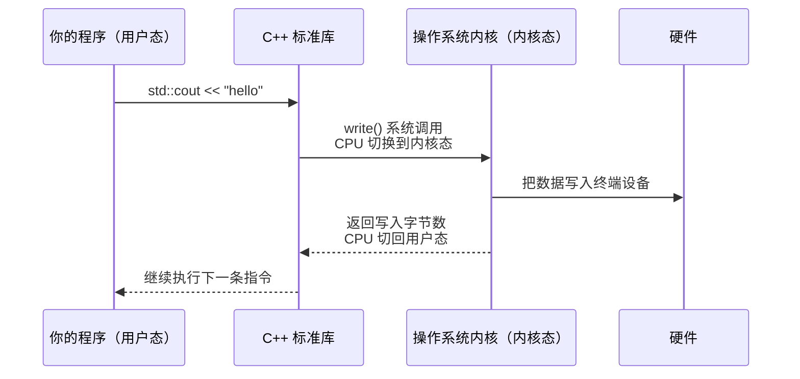

# $\rm Chapter \, 11$ 操作系统、进程与线程

> 在[计算机程序与开发全景](../01-基础观念/01-计算机程序与开发全景.md)中你第一次听到“进程”这个词——可执行文件躺在磁盘上，双击或敲回车后操作系统把它变成**进程**，分配 PID、虚拟地址空间、标准流和环境变量。在[终端、Shell与命令行](../02-终端与工具/02-终端Shell与命令行.md)中你用 `Ctrl+C` 中断过前台程序。在[从竞赛机模型到真实硬件](10-计算机硬件速通.md)中你看到了 CPU 的物理面貌——多核心、缓存层级、硬件线程。现在把这些串起来：谁在决定哪个程序跑在哪个核心上？一个程序为什么要同时做多件事？“卡死”是怎么发生的？

> **开始前自检**：本章假设你已经会：
>
> - □ 在第 1 章见过“进程是程序的一次运行”的说法
> - □ 会用终端运行命令并查看输出（第 2 章）
> - □ 能区分“源代码”与“运行中的程序”（第 1 章 §1.2）

## $\rm \S \, 11.1$ 内核态与用户态：一扇你看不到的门

在 OJ 上写代码时，你调用 `std::cin`、`new`、`fopen`，它们最终都变成了对操作系统的请求。但你的程序不能直接操作硬盘、网卡或内存控制器——这些硬件被操作系统**独占管理**。

### $\rm \S \, 11.1.1$ 两种执行模式

现代 CPU 至少有两种特权级别（x86 上叫 Ring 0 和 Ring 3，ARM 上叫 EL1 和 EL0）：

- **内核态**（kernel mode）：操作系统内核运行的级别。可以执行任何 CPU 指令、访问任何内存地址、直接控制硬件。
- **用户态**（user mode）：你的程序（以及你使用的几乎所有软件）运行的级别。不能直接访问硬件，不能修改页表，不能执行特权指令。



当你的 C++ 代码写 `std::cout << "hello"`，上面这张图中的每一步都在发生。每一次“和外界交互”——读文件、发网络包、申请内存、创建线程——都要经过**系统调用**（system call），触发用户态↔内核态的切换。这个切换本身有几十到几百个时钟周期的开销。这就是为什么系统调用比普通函数调用慢很多——在[从竞赛机模型到真实硬件](10-计算机硬件速通.md)中你见过同类量级的对比：访问一次 RAM 的时间，CPU 本来可以执行约 300 条指令。

> **类比**：用户态像在图书馆阅览室——你可以自由翻阅自己桌上的书，但不能进入书库。每次你需要一本不在桌上的书，就要填一张索书单（系统调用），等图书管理员（内核）从书库取出来交给你。这个过程比伸手拿桌上的书慢得多。

### $\rm \S \, 11.1.2$ 哪些操作会触发系统调用

你在 C++ 竞赛代码中每天都在用的这些操作，背后全是系统调用：

| 操作 | 底层系统调用（Linux） | 开销量级 |
|---|---|---|
| `std::cin` / `scanf` | `read()` | 微秒级 |
| `std::cout` / `printf` | `write()` | 微秒级 |
| `new` / `malloc`（大块） | `mmap()` 或 `brk()` | 不定（可能只操作用户态） |
| `fopen` | `open()` | 微秒级 |
| `std::thread` | `clone()` | 百微秒级 |
| `std::this_thread::sleep_for` | `nanosleep()` | 至少受调度粒度影响 |

在 OJ 的短程序中这些开销无关紧要。但在服务器程序中，每秒钟可能有几万到几十万次系统调用——减少不必要的系统调用是最有效的优化之一（比如把多次小 `write()` 合并为一次大 `write()`，这就是 C++ 中 `std::ios::sync_with_stdio` 能提速的原因——它禁用了 C 和 C++ 标准流之间的同步，减少了隐含的系统调用）。

### $\rm \S \, 11.1.3$ 内核：操作系统里始终运行的那段代码

前两节说的系统调用、特权级别，都属于同一个东西：**内核**（kernel）——操作系统里始终运行在内存中的一段核心代码。它负责四件事：

- **管理 CPU**：决定哪个进程/线程运行、运行多久——调度器就是内核的一部分（§11.2 展开）；
- **管理内存**：谁用哪块内存、页表怎么映射（第 12 章展开）；
- **管理设备**：通过**设备驱动**（device driver）与磁盘、网卡、显卡等硬件打交道；
- **提供系统调用接口**：用户态程序请求内核服务的唯一入口——就是 §11.1.2 那张表。

Linux 内核属于**宏内核**（monolithic kernel）——上述功能全部放在一个大的内核程序里，各部分之间直接互相调用。Windows 和 macOS 的内核（NT 内核、XNU）也把核心功能收在内核里运行（XNU 是 Mach 与 BSD 组合成的混合内核，结构并不完全相同），主线不需要区分它们的细节差异。

你不需要“学内核”，但需要记住它的角色：当你的程序说“我要读文件”时，内核替你去和磁盘控制器打交道——**你的程序永远不直接碰硬件**，这正是 §11.1.1 用户态存在的意义。

想知道当前机器跑的是哪个内核？Linux/macOS 的终端里运行：

```bash
uname -r
# 输出示例：6.8.0-45-generic
```

Windows 没有对应的单条命令，用 `winver` 查看系统版本号即可。

---

## $\rm \S \, 11.2$ 调度器：谁来决定下一个运行的是谁

你的电脑有 8 个核心（或 16 个硬件线程），但同时运行的程序和后台服务可能有几百个。**调度器**（scheduler）是内核的组件，负责决定“下一个使用 CPU 的是哪个线程”。

### $\rm \S \, 11.2.1$ 时间片与抢占

调度器不给任何线程无限的 CPU 时间。它把 CPU 时间切成短的时间片（time slice，通常几毫秒到几十毫秒），轮流分配给就绪的线程。当一个线程的时间片用完，或者它自己主动放弃（如在等 I/O），调度器就切换到下一个线程。

这个过程叫**上下文切换**（context switch）：保存当前线程的寄存器、程序计数器和栈指针，加载下一个线程的。

上下文切换不是免费的——每次切换消耗几微秒，更重要的是它刷掉了 CPU 的 L1/L2 缓存和分支预测器的状态。一个频繁被换下的线程，每次回来时缓存是冷的，性能大幅下降。这就解释了[从竞赛机模型到真实硬件](10-计算机硬件速通.md)中的结论：**在评测机上有效的微优化，在共享服务器上可能完全测不出效果**——你的线程频繁被换下，任何精细的流水线和缓存优化都被上下文切换抹平了。

### $\rm \S \, 11.2.2$ 优先级与 nice 值

不是所有线程都平等。调度器给高优先级线程更多 CPU 时间。在 Linux 上，`nice` 值范围从 -20（最高优先级）到 19（最低优先级）。普通程序默认 nice=0。

```bash
# 以较低优先级启动程序
nice -n 10 ./long_running_task
# 调整已运行进程的优先级
renice -n 5 -p 12345
```

你不应该随便调优先级——把一个普通程序设成高优先级，可能导致系统交互变卡（把 nice 调到 0 以下需要 root 或 `CAP_SYS_NICE` 权限，普通用户只能调低优先级）。这个机制的真正用途是：**确保紧急任务不被后台任务饿死**。比如你手动启动一个大数据处理任务，主动给它低优先级，让它不干扰你写代码和浏览网页。

### $\rm \S \, 11.2.3$ 调度策略

Linux 的普通任务（`SCHED_NORMAL`）默认使用公平调度：长期以来的实现是 **CFS**（Completely Fair Scheduler），核心思想是“让每个线程获得公平的 CPU 时间”；内核 6.6（2023 年）起开始转向同族的 **EEVDF**（Earliest Eligible Virtual Deadline First），这个“按权重分时间”的基本思想没有变。还有实时调度策略（`SCHED_FIFO`、`SCHED_RR`）用于音视频处理、工业控制等对延迟有硬性要求的场景。日常应用开发不需要碰这些——但知道它们存在，可以解释为什么某些服务（如音频处理）会申请实时优先级。

### $\rm \S \, 11.2.4$ CPU 亲和性

你可以告诉调度器“这个线程只允许在核心 3 和核心 4 上运行”：

```bash
taskset -c 3,4 ./my_program
```

这在两种场景中有用：
- 避免线程在不同核心间频繁迁移，保持 L1/L2 缓存热度；
- 把计算密集线程和 I/O 密集线程分配到不同核心，避免相互干扰。

但大多数情况下，让调度器自己决定比你手动绑定核心效果更好。调度器知道全局负载，而你只知道自己的程序。

---

## $\rm \S \, 11.3$ 线程：同一个地址空间里的多条执行流

### $\rm \S \, 11.3.1$ 进程 vs 线程——一个具体对比

在[计算机程序与开发全景](../01-基础观念/01-计算机程序与开发全景.md)中区分了“可执行文件”（磁盘上的静态产物）和“进程”（某次运行的实例）。现在加上线程：

| 维度 | 进程 | 线程 |
|---|---|---|
| 地址空间 | 独立 | 共享所属进程的地址空间 |
| 创建开销 | 较大（复制页表、文件描述符等） | 较小（只需栈和寄存器上下文） |
| 通信方式 | IPC——进程间通信（管道、共享内存、Socket——详见第 23 章） | 直接读写共享变量 |
| 隔离性 | 一个进程崩溃不影响其他进程 | 一个线程的越界写可能损坏其他线程的数据 |
| 典型数量 | 几十到几百 | 几千到几十万（协程/轻量线程） |

“一个程序同时做多件事”几乎都是用多线程实现的——浏览器用不同线程分别处理每个标签页的渲染和网络请求，游戏引擎用不同线程分别处理物理模拟、AI 和渲染，你的 Python 后端（第 17 章）用线程池处理同时到达的多个 HTTP 请求（第 23 章）。

### $\rm \S \, 11.3.2$ C++ 中的线程

C++11 引入了标准线程库。如果你只写过单线程算法题，下面是你需要知道的最小集合：

```cpp
#include <thread>
#include <mutex>
#include <atomic>
#include <vector>
#include <iostream>

std::mutex mtx;           // 互斥锁
int shared_counter = 0;   // 被多个线程共享的变量

void worker() {
    for (int i = 0; i < 1000; i++) {
        std::lock_guard<std::mutex> lock(mtx);  // 自动加锁，离开作用域自动解锁
        shared_counter++;
        // lock_guard 析构 → 自动释放锁，即使异常也安全
    }
}

int main() {
    std::vector<std::thread> threads;
    for (int i = 0; i < 4; i++)
        threads.emplace_back(worker);
    
    for (auto& t : threads)
        t.join();   // 等待线程结束
    
    std::cout << shared_counter << '\n';  // 4000
    return 0;
}
```

在竞赛中，你不关心并发——输入是确定的，程序是单线程的。但在真实系统中，并发是常态，也是最难调试的 bug 来源。

### $\rm \S \, 11.3.3$ 数据竞争与锁

上面代码中如果把 `lock_guard` 去掉，四个线程同时 `shared_counter++`，最终结果很可能不是 4000。原因是 `counter++` 不是原子操作——它实际是“读→加→写”三步，两个线程可能同时读到旧值，导致一次加操作丢失。

这就是**数据竞争**（data race）。C++ 标准定义数据竞争为**未定义行为**——编译器假设它不会发生，可能做出任何优化。

`std::mutex` + `std::lock_guard` 是最基础的解决方案：每次只有一个线程能进入加锁区域。代价是并行度下降——如果所有线程大部分时间都在等锁，多线程反而不如单线程。

### $\rm \S \, 11.3.4$ 原子操作

对于简单计数器，可以用 `std::atomic` 避免互斥锁的开销：

```cpp
std::atomic<int> counter{0};

void worker() {
    for (int i = 0; i < 1000; i++)
        counter.fetch_add(1, std::memory_order_relaxed);
        // 原子加——没有"读-改-写"的中间状态
}
```

原子操作由 CPU 硬件直接支持（通过特殊的原子指令），比互斥锁快得多，但只适用于简单操作。复杂的多步操作仍然需要锁。

### $\rm \S \, 11.3.5$ 死锁：两个线程在互相等待

```cpp
std::mutex a, b;

// 线程 1
void f1() {
    a.lock();
    b.lock();   // 如果线程 2 同时锁了 b，这里会永远等待
    // ...
    b.unlock();
    a.unlock();
}

// 线程 2
void f2() {
    b.lock();
    a.lock();   // 等线程 1 释放 a，但线程 1 在等 b
    // ...
    a.unlock();
    b.unlock();
}
```

两条线程各持一把锁、等另一把——谁都不会放开。

**预防死锁的经验规则**：
1. 所有线程按**相同的顺序**获取锁（先 a 后 b，不要有先 b 后 a）。
2. 如果必须获取多把锁，用 `std::lock(a, b)` 一次性获取，它内部使用死锁避免算法。
3. 尽量缩小锁的范围（加锁→干活→解锁，不要在锁内做 I/O 或长时间计算）。
4. 考虑用无锁数据结构（并发队列、原子变量）替代显式锁。


### $\rm \S \, 11.3.6$ 更多并发原语速览

`std::mutex` 只是起点。C++ 标准库还提供了（你不用全部记住，但要知道每种锁解决什么问题）：

| 原语 | 解决的问题 |
|---|---|
| `std::shared_mutex` | 读写锁：多个读者可以同时读，写者独占 |
| `std::condition_variable` | 线程等待“某个条件成立”：生产者-消费者模式 |
| `std::counting_semaphore`（C++20） | 限流：最多 N 个线程同时访问资源 |
| `std::barrier`（C++20） | 多个线程等待所有人都到达某一点再继续 |
| `std::future` / `std::async` | 异步任务：启动一个后台计算，之后取结果 |
| `std::jthread`（C++20） | 自动 join 的线程（避免忘记 join 导致 `std::terminate`） |

每种原语对应一类常见的并发场景。你不需要现在记住全部 API，但当你遇到“我需要线程 B 等线程 A 完成某件事再继续”时，知道有 `condition_variable` 这个东西存在，再去查文档。

---

## $\rm \S \, 11.4$ 信号：操作系统打断程序的方式

### $\rm \S \, 11.4.1$ 什么是信号

信号是操作系统发给进程的“异步通知”——有点像你在答题时，监考老师拍了拍你的肩膀说“还有五分钟”。

你对信号其实已经不陌生了：
- **Ctrl+C** 向当前前台程序发送 `SIGINT`（中断信号），请求程序停止。这就是[终端、Shell与命令行](../02-终端与工具/02-终端Shell与命令行.md)中提到的“它只是请求中断当前前台程序，已经写入的文件不会自动回滚”。
- 访问非法内存地址 → `SIGSEGV`（段错误），你看到的 “Segmentation fault” 就是这样来的。
- 除零 → `SIGFPE`。
- `kill -9 PID` → `SIGKILL`，强制终止进程，进程没有机会执行任何清理。

### $\rm \S \, 11.4.2$ 程序可以处理信号

进程可以注册**信号处理函数**，在收到信号时执行特定动作——比如在收到 `SIGINT` 时关闭文件、释放锁、记录“服务正在优雅退出”的日志，然后再退出。这就是[日常系统管理：软件、用户、服务与日志](13-系统服务日志与软件安装.md)一章会展开的**优雅退出**（graceful shutdown）的基础。

`SIGKILL` 和 `SIGSTOP` 是例外——它们不能被捕获或忽略，保证始终能强制终止一个失控的进程。

### $\rm \S \, 11.4.3$ 信号在日常工具中的角色

- `kill PID` 默认发 `SIGTERM`（终止请求，可被程序捕获）；
- `kill -9 PID` 发 `SIGKILL`（强制终止，不可捕获——[终端、Shell与命令行](../02-终端与工具/02-终端Shell与命令行.md)中说过“确认进程是否在写重要数据，能优雅停止就不要强杀”，现在你知道了优雅停止靠的是 `SIGTERM` 而不是 `SIGKILL`）；
- `Ctrl+Z` 发 `SIGTSTP`，把前台程序挂起到后台（这就是[终端、Shell与命令行](../02-终端与工具/02-终端Shell与命令行.md)中“前台/后台”的底层机制）；
- 进程崩溃时的 “core dump” 文件，可以事后用 gdb 加载，回到崩溃那一刻——等于一个“事后调试器”。

---

## $\rm \S \, 11.5$ 进程树与作业控制

### $\rm \S \, 11.5.1$ 进程不是孤岛

每个进程（除了 PID 为 1 的 init/systemd）都有一个**父进程**。启动关系形成一棵树：

```text
systemd (PID 1)
  ├── sshd (PID 500)
  │     └── bash (PID 501)       ← 你的 SSH 会话
  │           └── python (PID 600) ← 你启动的后端
  ├── postgres (PID 300)          ← 数据库服务
  └── nginx (PID 400)             ← Web 服务器
```

父进程先退出时，子进程变成“孤儿”并被 init（PID 1）收养。子进程先退出但父进程没有回收它时，它变成“僵尸”——进程已经死了但 PID 和退出状态还留在进程表中，直到父进程调用 `wait()`。

### $\rm \S \, 11.5.2$ 查看进程树

```bash
# Linux — 树状显示
pstree -p
ps aux --forest
```

```powershell
# PowerShell：Get-Process 没有 Parent 属性，要父进程号得用 CIM
Get-CimInstance Win32_Process | Format-Table ProcessId, ParentProcessId, Name
```

### $\rm \S \, 11.5.3$ 前台/后台/守护进程

[终端、Shell与命令行](../02-终端与工具/02-终端Shell与命令行.md)讲过前台和后台的基本操作。现在是底层视角：

- **前台进程**：占用终端，接收键盘信号（Ctrl+C → SIGINT，Ctrl+Z → SIGTSTP）。
- **后台进程**：不占用终端，但如果终端关闭，后台进程通常会收到 `SIGHUP`（挂断信号）而退出。
- **守护进程**（daemon）：完全脱离终端。`systemd` 管理的服务（如数据库、Web 服务器）都是守护进程——它们不受终端关闭影响，不接收 Ctrl+C，由 systemd 负责启动、停止和重启。

把程序变成后台进程的最简方法：

```bash
./long_task &
# & → 后台运行，Shell 立即返回提示符
```

但这不等于是可靠的守护进程。如果终端关闭，`SIGHUP` 仍可能终止它。真正可靠的后台服务需要用 `systemd` 管理（见[日常系统管理：软件、用户、服务与日志](13-系统服务日志与软件安装.md)）。

---

## $\rm \S \, 11.6$ 并发 vs 并行：两个常被混用的词

- **并发**（concurrency）：多个任务在**同一时间段**内都在进行中，但任意时刻只有一个在执行（单核上调度器轮流切换）。
- **并行**（parallelism）：多个任务在**同一时刻**真正同时执行（多核上不同核心各跑各的）。

在单核机器上，多线程提供并发但不提供并行。在多核机器上，多线程可以同时提供并发和并行。你在写 `std::thread` 时，你的程序里既有并发（逻辑上同时处理多个请求），也有并行（OS 把你的线程调度到不同核心上）。

这个区分不只是概念游戏——它影响你怎么做优化。并发的瓶颈通常是锁争用和上下文切换开销；并行的瓶颈通常是数据分区是否均匀，以及是否存在[伪共享](10-计算机硬件速通.md#rm-s-1034-伪共享多线程程序的隐形杀手)（两个线程写同一缓存行的不同变量）。

---

## $\rm \S \, 11.7$ 进程排障工具箱

这些工具帮助你观察“程序到底在做什么”。不用全记住，遇到问题回来查。

### $\rm \S \, 11.7.1$ 状态概览

| 工具 | 平台 | 一句话 |
|---|---|---|
| `htop` / `btop` | Linux/macOS | 彩色交互式进程监视器，比 `top` 更直观。`btop` 还显示网络和磁盘 |
| `glances` | 跨平台 (Python) | 一个界面包含 CPU、内存、磁盘 IO、网络、进程树 |
| Process Explorer | Windows | 微软官方高级任务管理器，显示进程树、句柄、DLL 加载、锁持有者 |
| `ps aux --forest` | Linux | 命令行中的进程树 |
| Task Manager | Windows | 内置，`Ctrl+Shift+Esc`；“详细信息”标签页比“进程”标签页更有用 |

### $\rm \S \, 11.7.2$ 线程级排障

| 工具 | 一句话 |
|---|---|
| `top -H` 或 `htop`（按 H） | 查看每个线程的 CPU 使用率，不是只看进程汇总 |
| `ps -eLf` | 列出所有线程，包含 LWP（轻量进程 ID） |
| `strace -p PID` | 追踪进程正在执行的系统调用（见实时发生了什么） |
| `ltrace -p PID` | 追踪动态库函数调用 |
| Process Explorer (Windows) | 双击进程→Threads 标签页，看每个线程的 CPU 时间、起始地址和调用栈 |

### $\rm \S \, 11.7.3$ 死锁和锁分析

| 工具/方法 | 一句话 |
|---|---|
| `gdb -p PID` + `thread apply all bt` | 附加到运行中的进程（在 gdb 提示符下也可以写 `attach PID`），打印所有线程的调用栈——如果多个线程都卡在 `lock()` 上，你找到了死锁 |
| `pstack PID` (Linux) | 更简单版本的调用栈打印 |
| ThreadSanitizer (TSan) | [编辑器、IDE与调试器](../02-终端与工具/05-编辑器IDE与调试器.md)讲过的编译器 Sanitizer——`g++ -fsanitize=thread`，运行时检测数据竞争 |
| Helgrind (Valgrind 的一部分) | 检测 POSIX 线程错误，不需要重编译 |

---

## $\rm \S \, 11.8$ 动手实践

四个实践有共同的前置条件：在一台有 C++ 编译器和终端的 Linux/WSL 机器上、新建的空目录（如 `~/os-lab`）里进行。涉及 `top`、`gdb`、`kill` 的操作只在 Linux/WSL 下演示；Windows 请用 WSL（任务管理器或 `Stop-Process` 能替代一部分观察，但没有 gdb，也没有 Bash 的 `kill`/`pkill`）。

### $\rm \S \, 11.8.1$ 实践一：观察调度效果

1. 写一个死循环 `while (true) {}` 的 C++ 程序，编译并运行（`g++ spin.cpp -o spin && ./spin`）。预期输出：无——程序不产生任何输出，也不自行退出，前台被占住正说明它在满负荷运行。
2. 打开另一个终端用 `top` / `htop` / Task Manager 观察：它占用了多少 CPU？成功标志：该进程的 CPU 占用接近 100%，即占满一个核心。
3. 同时启动该程序的**四个实例**。预期输出：四个进程各占接近 100%，在 4 核以上的机器上会分布在不同核心（`top` 中按 `1` 可展开每个核心的占用）。
4. 全部终止：前台实例按 `Ctrl+C`；后台的用 `pkill -f ./spin`（或先 `pgrep -f ./spin` 看 PID，再用 `kill` 逐个结束）。
5. 清理：确认 `pgrep -f ./spin` 已无输出，删除编译产物与源文件（`rm spin spin.cpp`）。

### $\rm \S \, 11.8.2$ 实践二：数据竞争的第一手体验

1. 把 §11.3.2 的多线程计数器代码删掉 `lock_guard` 后存为 `race.cpp`，编译运行（`g++ -O2 -pthread race.cpp -o race && ./race`；代码里要保留 `#include <iostream>`，否则 `std::cout` 编译不过），运行 10 次。预期输出：绝大多数次结果小于 4000 且每次不同（具体值随机），偶尔也可能撞出 4000——这不影响结论。
2. 加上 `-fsanitize=thread`（g++/clang++ 均支持）重新编译运行（`g++ -fsanitize=thread -g -O1 -pthread race.cpp -o race_tsan && ./race_tsan`）。预期输出：TSan 打印 `WARNING: ThreadSanitizer: data race`，并给出两个线程各自的读写位置与调用栈。
3. 加回 `std::mutex` 后再运行 10 次。预期输出：10 次结果都是 4000。
4. 清理：删除 `race`、`race_tsan`、`race.cpp`。

### $\rm \S \, 11.8.3$ 实践三：用 gdb 分析死锁

1. 写一个故意死锁的程序（两个线程，两把锁，相反加锁顺序，可参考 §11.3.5 的 `f1`/`f2`），编译运行（`g++ -pthread deadlock.cpp -o deadlock && ./deadlock`）。预期输出：无——程序不退出，两个线程互相等待。
2. 在另一个终端中找到它的 PID（`pgrep -f ./deadlock`），用 `gdb -p PID` 附加。预期输出：gdb 打印附加成功并停下（需要先装 gdb，WSL/Ubuntu 用 `sudo apt install gdb`）。
3. 执行 `thread apply all bt`，观察两个线程各自卡在哪一行。成功标志：两个线程的调用栈分别停在 `std::mutex::lock()`（再往下是 `__lll_lock_wait` 一类）上，且各自持有的锁与等待的锁正好对调。
4. 修复加锁顺序，验证不再卡死。
5. 清理：先在 gdb 里 `detach` 再 `quit`，回到终端 `kill PID` 结束仍卡住的旧进程（不结束它，重新编译会因可执行文件被占用而失败）；确认 `pgrep -f ./deadlock` 已无输出。
6. 清理编译产物与源文件（`rm deadlock deadlock.cpp`）。

### $\rm \S \, 11.8.4$ 实践四：信号实验

1. 写一个 C++ 程序，用 `std::signal` 或 `sigaction` 注册 `SIGINT` 处理函数，在主循环中运行（不立即退出），编译运行。预期输出：打印启动信息后持续运行，不自行退出。
2. 按 Ctrl+C，观察处理函数是否被调用。预期输出：处理函数里的打印出现，且因为处理函数只打印不退出，程序仍在运行。
3. 在另一个终端用 `kill PID`（无 -9），观察 `SIGTERM` 的效果。预期输出：只注册了 SIGINT 时，SIGTERM 走默认动作，进程立即结束——看不到处理函数里的打印。
4. 重新启动程序，用 `kill -9 PID`（`SIGKILL`），确认进程被强制终止。预期输出：进程直接消失，处理函数与任何清理代码都没有机会执行。
5. 清理：用 `pgrep -f ./signal_test` 确认无残留进程，删除编译产物与源文件。

---

## $\rm \S \, 11.9$ 总结

操作系统像一台机器的“总经理”：它分配 CPU 时间（调度器），管理内存（虚拟内存和分页），隔离程序（用户态/内核态），提供通信（信号），并确保一个程序的崩溃不会带着整台机器重启（进程隔离）。

- **用户态和内核态的切换**是程序与外界交互的必经之路，每次切换都有代价。
- **调度器用时间片轮转和多级优先级**实现“看起来同时运行”。上下文切换的开销抹平了微优化效果。
- **线程共享地址空间，轻量但隔离弱；进程隔离强但通信开销大**。
- **锁解决数据竞争，但引入了死锁风险**。按相同顺序加锁、缩小临界区、优先用原子操作和无锁结构。
- **信号是 OS 的通知机制**。Ctrl+C 是 SIGINT，段错误是 SIGSEGV，kill -9 是 SIGKILL（不可拦截）。
- **并发 ≠ 并行**。并发是逻辑结构，并行是物理执行。

---

## $\rm \S \, 11.10$ 关键概念回顾

1. 用户态和内核态有什么区别？为什么系统调用比普通函数调用慢？上下文切换是什么，它又为什么会抹平[从竞赛机模型到真实硬件](10-计算机硬件速通.md)中讨论的微优化？

2. 线程和进程在地址空间、创建开销和隔离性上有什么区别？

3. 什么是数据竞争？`std::mutex` 解决它的机制是什么？死锁发生的必要条件和预防方法分别是什么？

4. `SIGINT`、`SIGTERM`、`SIGKILL` 的区别是什么？

5. 并发和并行的区别是什么？各自的瓶颈是什么？

## $\rm \S \, 11.11$ 应用与辨析

6. 用哪条 gdb 命令可以在不停止进程的情况下查看所有线程的调用栈？

7. 为什么 `htop`/`top` 中一个多线程程序的总 CPU 占用可以超过 100%？这代表什么？

## $\rm \S \, 11.12$ 本章自测答案

> 先闭卷作答本章“关键概念回顾”与“应用与辨析”，再核对以下答案。

### $\rm \S \, 11.12.1$ 自测答案 · 关键概念回顾
1. 内核态可以执行任何指令、直接控制硬件；用户态不能，只能通过系统调用请求内核代做；每次系统调用都要切换 CPU 特权级别，有几十到几百个时钟周期的开销。上下文切换则是调度器保存当前线程的寄存器、程序计数器和栈指针，再加载下一个线程的状态；切换会刷掉 L1/L2 缓存和分支预测器状态，线程回来时缓存是冷的，精细的优化被抹平。
2. 进程有独立地址空间、创建开销大、隔离强（一个崩溃不影响其他）；线程共享所属进程的地址空间、创建开销小、隔离弱（越界写可能损坏其他线程的数据）。
3. 多个线程同时读写同一变量且至少一个是写、没有同步——在 C++ 中是未定义行为；mutex 让任意时刻只有一个线程能进入临界区，加锁的“读-改-写”不再交错。锁又引入死锁：两个线程各持有一把锁、又在等待对方持有的另一把锁，谁都无法继续；预防方法是所有线程按相同顺序加锁、用 `std::lock` 一次获取多把锁、尽量缩小锁范围、必要时用无锁结构。
4. SIGINT 是 Ctrl+C 发出的中断请求，SIGTERM 是 `kill PID` 默认发的终止请求，两者都能被程序捕获做优雅退出；SIGKILL 强制终止，不可捕获、不可忽略。
5. 并发是同一时间段内多个任务都在进行（逻辑结构，单核即可）；并行是同一时刻真正同时执行（需要多核）；并发的瓶颈是锁争用和上下文切换，并行的瓶颈是数据分区是否均匀和伪共享。

### $\rm \S \, 11.12.2$ 自测答案 · 应用与辨析
6. 在另一个终端 `gdb -p PID` 附加到运行中的进程，然后执行 `thread apply all bt` 打印所有线程的调用栈；不想打扰进程时可以用 `pstack PID`（Linux）。
7. top/htop 按线程累计 CPU 时间：多线程程序在多个核心上并行运行时，各线程的占用相加会超过 100%（如 4 个线程各占满一个核心时显示约 400%）——这是并行生效的正常现象，不是 bug；反之，多核机器上单线程程序永远显示不超过 100%。

---

下一章[内存、文件与输入输出](12-内存文件与输入输出.md)从“操作系统怎么管理 CPU”转向“操作系统怎么管理内存”——你会发现 `new` 出来的内存并没有立即占用物理 RAM，`fopen` 打开的文件可能根本没有真正访问磁盘，而[计算机程序与开发全景](../01-基础观念/01-计算机程序与开发全景.md)中“标准流是三个文件描述符”的说法在这时会获得全新的解释。

> 你现在能：解释内核态/用户态与系统调用的作用，用 ps/top 观察进程与线程，区分并发与并行，并能识别数据竞争与死锁的征兆
