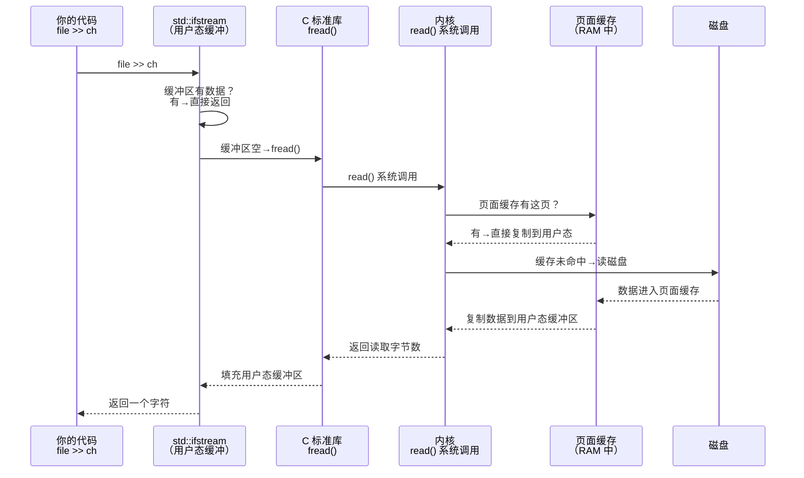

# $\rm Chapter \, 12$ 内存、文件与输入输出

> 你写 `std::cin >> a >> b` 时，数据从哪里来？写 `std::cout << result` 时，输出去了哪里？程序明明退出了，`cout` 的内容却还没出现在屏幕上？一次 `fopen` 打开 GB 级文件，你的程序占用的 RAM 却没有涨 $1 \, \text{GB}$——谁在帮你"假装读了"？

> **开始前自检**：本章假设你已经会：□ 理解进程的标准输入/输出（第 1 章）；
> □ 用终端或程序读写过文件；
> □ 知道内存与磁盘是两种不同的存储。

## $\rm \S \, 12.1$ 再谈标准流：从"三个管道"到内核对象

### $\rm \S \, 12.1.1$ 文件描述符——操作系统给你的"号码牌"

在[计算机程序与开发全景](../01-基础观念/01-计算机程序与开发全景.md)中，你把标准输入、标准输出和标准错误理解为"三个连接到进程的管道"。在[文件系统、路径与权限](../02-终端与工具/03-文件系统路径与权限.md)中你知道了"目录本质上也是一种文件"。现在把这两个认识合在一起。

操作系统内核为每个进程维护一张**打开文件表**。当你 `fopen` 一个文件，或当 Shell 在启动你的程序时把标准流连接好，内核就在这张表里新增一条记录，并给你一个整数编号——**文件描述符**（file descriptor，Linux）或**文件句柄**（file handle，Windows）。

惯例上，这三个编号属于每个进程的标准三件套：

| 描述符 | C++ 对象 | 默认连接 |
|---|---|---|
| 0  | `std::cin` | 键盘输入（或 Shell 重定向的来源） |
| 1  | `std::cout` | 终端输出（或 Shell 重定向的目标） |
| 2  | `std::cerr` | 终端输出（通常和 stdout 是同一个窗口，但独立流） |

回想[终端、Shell与命令行](../02-终端与工具/02-终端Shell与命令行.md)中的重定向：当你写 `./program < input.txt > output.txt`，Shell 做的事就是——在 `program` 启动前，把文件描述符 0 指向 `input.txt`，把 1 指向 `output.txt`。`program` 内部仍然只对 `std::cin` 和 `std::cout` 操作，完全不需要知道自己正在读写文件。这就是 Unix 哲学中的"一切皆文件"带来的可组合性。

### $\rm \S \, 12.1.2$ C++ 中的一次文件读取，到底发生了什么

从你的代码到磁盘盘片（或 SSD 控制器），中间经历了多层。以 `std::ifstream` 读取一个字节为例：



大多数时候，那一段数据已经在**页面缓存**中（[从竞赛机模型到真实硬件](10-计算机硬件速通.md)讲过：操作系统用空闲 RAM 缓存最近读写过的文件），`read()` 不会真正碰磁盘。这就是为什么第二次读取同一个文件比第一次快几十到几百倍。

### $\rm \S \, 12.1.3$ stdout 的缓冲之谜

回忆你在 OJ 上调代码时遇到过的情况：程序明明已经执行到 `cout << "debug"`，却看不到输出，直到程序结束才一起出现。这不是 bug——是**缓冲**。

C 和 C++ 的标准输出有三种缓冲模式：

| 模式 | 何时输出 | `std::cout` 默认？ |
|---|---|---|
| 全缓冲 | 缓冲区满才输出（如 $4 \, \text{KB}$ 或 $8 \, \text{KB}$） | 输出到文件时 |
| 行缓冲 | 遇到 `\n` 时输出 | 输出到终端时（Linux） |
| 无缓冲 | 每个字符立即输出 | `std::cerr` |

`std::cout` 在输出到终端时通常是行缓冲，但通过管道或重定向连接到文件时变为全缓冲。这解释了两种常见"bug"：

1. **OJ 中输出不全**：程序在 `cout << result` 后立即 `return 0`，全缓冲区的最后一批数据还没来得及刷出。解决方法：在 `return` 前加 `std::cout << std::flush` 或直接用 `std::endl`（它相当于 `'\n'` + `flush`，但有开销）。
2. **日志顺序错乱**：`std::cout` 和 `std::cerr` 的缓冲模式不同，导致屏幕上的输出顺序和代码中的执行顺序不一致——`cerr` 因为无缓冲，往往先出现。这是[计算机程序与开发全景](../01-基础观念/01-计算机程序与开发全景.md)中"机器需要继续处理的结果写 stdout，人类诊断信息写 stderr"这一约定的底层原因之一。

### $\rm \S \, 12.1.4$ `sync_with_stdio` 的真实含义

C++ 为了兼容 C 的 `printf`/`scanf`，默认把 `std::cout`/`std::cin` 与 C 的 `stdout`/`stdin` **同步**。这保证你在混用 `cout << x` 和 `printf("%d", x)` 时输出顺序正确，但代价是每次 `cout` 都可能触发一次隐含的系统调用。

```cpp
std::ios::sync_with_stdio(false);
// 禁用与 C 标准流的同步
// 现在 cout 和 printf 不能安全混用
// 但 cout 速度大幅提升（在某些实现中可快 10 倍）
```

这也是为什么你会在 OJ 题解中看到很多人模板性地写这一行——不是因为神秘，而是它把 `cout` 从"每写一个字符就要确认 C 的缓冲区状态"变成"只管自己的缓冲区就行"。

---

## $\rm \S \, 12.2$ 再谈虚拟内存：每个进程以为自己拥有整台机器

### $\rm \S \, 12.2.1$ 虚拟地址空间的结构

[从竞赛机模型到真实硬件](10-计算机硬件速通.md)讲了操作系统用分页机制实现虚拟内存（把虚拟地址空间和物理内存都切成固定大小的页，维护"虚拟页→物理页"映射）。现在从"你的程序看到的视角"展开。一个典型 Linux 进程的虚拟地址空间布局（简化）：

```text
高地址
├── 内核空间（用户态不可直接访问）
├── 栈（stack）
│     └── 局部变量、函数调用帧
│         自动增长（或缩小），每次函数调用时分配
├── ↕ 栈和堆之间的空隙（可以增长）
├── 堆（heap）
│     └── new / malloc 从这里分配
├── 数据段
│     ├── .bss（未初始化全局变量）
│     └── .data（已初始化全局/静态变量）
├── 代码段（text）
│     └── 编译后的机器指令（只读）
低地址
```

你在竞赛中习惯的那些内存分配，分别落在这个地图的不同区域：

```cpp
int global_arr[1000];       // .bss 或 .data，整个程序生命周期
int* heap_arr = new int[n]; // 堆，手动管理生命周期
int stack_arr[100];         // 栈，函数返回时自动销毁
static int counter = 0;     // .data，全局生命周期，文件作用域
```

在 OJ 的短程序中，你不需要关心这些区域的区别——所有东西都放得下。但在长时间运行的服务器程序中，栈溢出、堆碎片、内存泄漏各自有不同的症状和工具。

### $\rm \S \, 12.2.2$ 虚拟内存的"骗术"

操作系统给你的程序看的那些地址——`0x7ffd...`、`0x55b2...`——不是物理 RAM 中的真实地址。每个进程有自己独立的虚拟地址空间，背后是 CPU 的**内存管理单元（MMU）**把虚拟地址翻译为物理地址。

这套映射机制带来了几个实际后果：

1. **按需分配**：`new int[1000000]` 后，操作系统只记录"此进程的虚拟地址 X 到 Y 应该对应 $4 \, \text{MB}$ 的空间"，但不立即分配物理页。只有当你的代码第一次**访问**（读或写）这个数组的某个位置时，CPU 触发**缺页**（page fault），内核才分配一个真正的物理页并建立映射（初始化为全零页）。

2. **交换（swap）**：物理内存不够用时，内核把某些很久没被访问的页面写到磁盘，腾出物理页给活跃进程。被换出的页再次被访问时，触发缺页，内核从磁盘读回——代价是内存访问延迟从 ~$100 \, \text{ns}$ 变成 ~$100 \, \text{μs}$（千倍差距）。

3. **内存映射文件**：你可以告诉内核"把文件 X 的内容映射到我的虚拟地址空间"。之后对这段地址的读写自动变成对文件的读写，由页面缓存机制优化。大文件的随机访问或数据库的存储引擎大量使用这个技术。

### $\rm \S \, 12.2.3$ 内存泄漏：`new` 之后忘了 `delete`

```cpp
void leaky_function() {
    int* data = new int[1000000];
    // 用 data 做些事情
    // 没有 delete[] data;
}   // data 指针销毁了，但它指向的内存没有被释放
```

在 OJ 中，程序几秒后就退出，操作系统会回收进程的全部内存——泄漏无所谓。在服务器程序中，一个每分钟被调用一次的函数如果每次都泄漏 $1 \, \text{MB}$，几小时后整个机器就会被拖垮。

排查工具（你不需要全装，知道它们各管什么场景）：

| 工具 | 一句话 |
|---|---|
| AddressSanitizer (`-fsanitize=address`) | [编辑器、IDE与调试器](../02-终端与工具/05-编辑器IDE与调试器.md)介绍过：编译时加这个标志，运行时自动报告泄漏位置和大小 |
| Valgrind (`valgrind --leak-check=full`) | Linux，不需要重编译，但慢 10-20 倍 |
| Heaptrack | 图形化分析堆分配，火焰图式查看"谁分配了最多的内存" |
| Dr. Memory | Windows 内存调试器，类似 Valgrind |
| `heaptrack_gui` (Linux) | Heaptrack 的 GUI 版本，直观看到分配热点 |

---

## $\rm \S \, 12.3$ 同步 I/O(synchronous I/O)、异步 I/O(asynchronous I/O)与事件驱动

### $\rm \S \, 12.3.1$ 同步 I/O——等待，直到完成

你在竞赛中写的所有 I/O 都是同步的：

```cpp
int x;
std::cin >> x;   // 程序在这里停下，直到读到一个整数
std::cout << x;  // 程序在这里停下，直到数据进入缓冲区
```

线程在 `read()` 系统调用中阻塞——CPU 空转等待。对于 OJ 的短程序这不是问题。但一个处理 1000 个并发请求的 Web 服务器，如果每个请求的线程都阻塞在数据库查询上，就浪费了大量 CPU 和内存。

### $\rm \S \, 12.3.2$ 异步 I/O——"你去读，读好了告诉我"

异步 I/O 的核心思想：发出一个读取请求后立即返回，等数据就绪时通过回调、信号或轮询得到通知。在这期间，线程可以处理其他任务。

**I/O 多路复用**（I/O multiplexing）是单线程处理多个连接的关键技术。Linux 上有三种经典机制：
- `select`（最老，最多 1024 个描述符）
- `poll`（无数量限制，但仍是线性扫描）
- `epoll`（Linux 专有，$\mathcal{O}(1)$ 事件通知，现代服务器的标配）

Windows 上有 **IOCP**（I/O Completion Ports），macOS/BSD 上有 **kqueue**。

你不需要现在就理解它们的 API——但要明白：所有现代高性能服务器（Nginx、Node.js、Redis、Python asyncio、Rust tokio）底层都用的是这些机制。它们的共同思路是**不让线程在等待 I/O 时阻塞，而是让内核在数据就绪时通知你**。

### $\rm \S \, 12.3.3$ 什么时候异步 I/O 有意义

如果一次 I/O 操作耗时 $100 \, \text{μs}$（SSD 随机读），你的 CPU 在这期间可以执行约 30 万条指令。对于需要同时处理大量 I/O 的程序（Web 服务器、数据库、消息队列），异步 I/O 的收益巨大。对于主要在做计算、偶尔读写文件的程序（你的论文管理器 CLI），同步 I/O 更简单且完全够用。

---

## $\rm \S \, 12.4$ 文本文件与二进制文件的 I/O 视角

[文本、编码、压缩包与常见数据格式](../02-终端与工具/06-文本编码压缩包与数据格式.md)从编码角度区分了文本文件和二进制文件（文本是"按编码解读的字节"，二进制按特定格式解读）。现在从 I/O 角度看：

在 C++ 中，`std::ifstream` 默认以**文本模式**打开文件。文本模式下：
- Windows 上 `\r\n` 自动转换为 `\n`；
- `Ctrl+Z`（0x1A）被视为文件结束标记（DOS 遗留行为）。

而 `std::ifstream file("data.bin", std::ios::binary)` 以**二进制模式**打开——每个字节原样返回，不进行任何转换。

> **跨平台实际影响**：如果你在 Windows 上以文本模式读取一个二进制文件（如图片），中途遇到字节 0x1A 就会提前结束，遇到 0x0D 0x0A 会被合并为 0x0A，文件损坏。处理非文本数据时，永远加 `std::ios::binary`。

---

## $\rm \S \, 12.5$ I/O 排障工具箱

### $\rm \S \, 12.5.1$ "磁盘在忙什么？"

```bash
# Linux — 每个磁盘的实时读写速率和 IOPS
iostat -x 1

# 哪个进程在疯狂读写磁盘
iotop

# 追踪某个进程的所有文件操作（打开、读、写、关闭）
strace -e trace=file -p PID
```

```powershell
# Windows — 性能计数器
Get-Counter '\PhysicalDisk(_Total)\Disk Reads/sec'
Get-Counter '\PhysicalDisk(_Total)\Disk Writes/sec'
```

### $\rm \S \, 12.5.2$ "这个程序到底在读哪个文件？"

`lsof`（list open files）显示一个进程打开的所有文件和网络连接：

```bash
lsof -p PID          # 某进程打开了什么
lsof /var/log/app.log  # 哪个进程正在写这个日志
lsof -i :8080        # 哪个进程在监听/连接 8080 端口
```

在 Windows 上，Process Explorer（微软官方免费工具，可以在 `live.sysinternals.com` 下载）的 "Find → Find Handle or DLL" 可以按文件名搜索哪个进程打开了它——这个功能在你试图删除一个文件但提示"被占用"时尤其有用。

### $\rm \S \, 12.5.3$ "内存都去哪了？"

```bash
free -h              # 物理内存 + swap 概览
cat /proc/meminfo    # 细化到每种内存用途
vmstat 1             # 每 CPU 的上下文切换、swap in/out 实时速率
pmap -x PID          # 某个进程的内存映射明细
```

`pmap -x PID` 的输出可以让你看到第 12.2 节的地址空间布局——哪一段是代码、哪一段是堆、哪一段是映射的文件——对应的实际物理内存占用。排查"为什么一个什么都没做的程序占了 $500 \, \text{MB}$ 内存"时，`pmap` 是第一站。

---

## $\rm \S \, 12.6$ 贯穿项目：论文管理器的 I/O 优化

假设论文管理器有一个功能：读取 `papers.json`（$50 \, \text{MB}$，包含十万条论文记录），用 `std::ifstream` 逐行解析。

最基础的写法可能是：

```cpp
std::ifstream file("papers.json");   // 默认文本模式
std::string line;
while (std::getline(file, line)) {
    // 解析 JSON 行
}
```

你可能注意到它比想象中慢。从本章的知识出发，逐层分析：

1. **缓冲大小**：`std::ifstream` 默认缓冲区通常是几 KB。每次缓冲区耗尽就触发一次 `read()` 系统调用。对于 $50 \, \text{MB}$ 文件，几千次系统调用本身的累积开销就不少。可以调大缓冲区，或用 `mmap` 把整个文件映射到内存。

2. **页面缓存**：如果你第一次运行这个程序，数据确实从 SSD 读出（~$3500 \, \text{MB/s}$ 顺序读，$50 \, \text{MB}$ 约 14ms——很快）。但如果你在循环中随机访问文件的不同位置，触发缺页和磁盘随机读取，性能就会垮。

3. **文本模式的转换开销**：Windows 上文本模式每个 `\r\n` 都要检查并转换，对 $50 \, \text{MB}$ 文本是额外的一层。用二进制模式读入内存再解析，可以避免这层开销。

改进版本：

```cpp
std::ifstream file("papers.json", std::ios::binary | std::ios::ate);
// binary: 不转换换行符；ate: 打开时定位到文件末尾
std::streamsize size = file.tellg();
file.seekg(0);
std::string buffer(size, '\0');
file.read(buffer.data(), size);  // 一次 read() 读入整个文件
// 然后在 buffer 上做字符串解析，不再碰磁盘
```

对 $50 \, \text{MB}$ 文件来说一次读入完全可行。但如果是 $5 \, \text{GB}$ 的日志文件，就需要流式处理。**选择哪种方式取决于数据量和内存约束**，没有一刀切的答案。

---

## $\rm \S \, 12.7$ 动手实践

### $\rm \S \, 12.7.1$ 实践一：观察页面缓存的威力

1. 找一个 ~$50 \, \text{MB}$ 的文本文件（或生成一个：`base64 /dev/urandom | head -c 50MB > random.txt`）。
2. 写一个 C++ 程序，用 `std::ifstream` 读取并计算行数。
3. 第一次运行，用 `time` 计时。
4. 第二次运行，再计一次——第二次应该明显更快（页面缓存生效）。
5. 运行 `sudo sh -c 'echo 3 > /proc/sys/vm/drop_caches'`（清空页面缓存——这是个安全操作，不影响数据），再运行第三次——时间回到第一次的水平。

### $\rm \S \, 12.7.2$ 实践二：stdout 缓冲实验

1. 写一个程序，`std::cout << "A\n"`，然后 `sleep(2)`，然后 `std::cout << "B"`（注意 B 后没有 `\n`），然后 `return 0`。
2. 直接运行：A 立即出现，B 可能延迟（取决于平台）或程序结束时才出现。
3. 把输出重定向到文件：`./program > output.txt`。观察：A 和 B 都没有立即写入文件——直到程序退出。
4. 在 `B` 后面加上 `<< std::flush` 或 `<< std::endl`，再次重定向——这次立即写入。

### $\rm \S \, 12.7.3$ 实践三：追踪系统调用

```bash
# Linux
strace -e trace=read,write ./my_program 2>&1 | head -50
# 看到你的程序实际向 OS 发起了多少次 read/write
```

你会惊讶于一个"只读了一个文件"的程序实际做了几十甚至上百次系统调用——加载动态库、读取语言环境配置、内存分配……这些都是你看不到的"隐性开销"。

---

## $\rm \S \, 12.8$ 总结

- 标准流在 OS 底层是三个文件描述符。Shell 重定向就是启动进程前替换这些描述符的指向。
- 一次文件读取经过多级缓冲：用户态 `fstream` 缓冲 → C 标准库缓冲 → 页面缓存（内核）→ 磁盘。大多数时候数据在页面缓存中就命中了。
- `std::cout` 的缓冲模式取决于输出目标——终端是行缓冲，文件是全缓冲。`cerr` 无缓冲。
- 虚拟内存让每个进程以为自己独占 4GB/16EB 空间。背后的分页、缺页和 swap 对程序透明——但性能影响不透明。
- 同步 I/O 每个操作阻塞线程；异步 I/O 通过 epoll/IOCP 实现单线程处理大量连接。
- 以二进制模式打开非文本文件，避免无意中触发换行符转换。

---

## $\rm \S \, 12.9$ 关键概念回顾

1. 文件描述符/句柄是什么？描述符 0、1、2 默认分别连接什么？

2. Shell 重定向 `./program < input.txt` 在文件描述符层面做了什么？

3. 从你写 `file >> ch` 到数据从磁盘读出，中间经过哪些缓冲层？

4. `std::cout` 输出到终端和输出到文件时，缓冲行为有什么不同？

5. `new` 一个很大的数组后，为什么程序占用的物理 RAM 可能远小于申请的大小？首次访问这个数组时底层发生了什么？

6. 同步 I/O 和异步 I/O 的核心区别是什么？什么时候应该考虑异步 I/O？

7. 为什么读取非文本文件时要加 `std::ios::binary`？

## $\rm \S \, 12.10$ 应用与辨析

8. 用哪个工具可以查看"某个文件正在被哪个进程占用"？

9. 你的程序读一个大文件很慢。如何区分"磁盘本身慢"和"程序缓冲用得不好"？

## $\rm \S \, 12.11$ 本章自测答案

> 先闭卷作答本章"关键概念回顾"与"应用与辨析"，再核对以下答案。

### 自测答案 · 关键概念回顾
1. 文件描述符是内核为每个进程维护的打开文件表中的整数编号；0=stdin（键盘或重定向源），1=stdout（终端或重定向目标），2=stderr（终端，独立流）。
2. 在启动程序前把文件描述符 0 指向 input.txt；程序内部仍然只操作 std::cin，完全不知道自己正在读文件。
3. fstream 用户态缓冲 → C 标准库 fread 缓冲 → 内核 read() 系统调用 → 页面缓存 → 磁盘；大多数时候数据在页面缓存中就命中了。
4. 输出到终端通常是行缓冲（遇到 \n 就输出）；重定向到文件时是全缓冲（缓冲区满或程序退出才写出）；`cerr` 始终无缓冲。
5. 虚拟内存按需分配：new 只记录虚拟地址映射，不立即分配物理页；首次访问某个位置时触发缺页，内核才分配物理页并建立映射（初始化为全零页）。
6. 同步 I/O 阻塞线程直到操作完成，异步 I/O 发出请求立即返回、数据就绪时内核通知；需要同时处理大量 I/O（Web 服务器、数据库、消息队列）时考虑，计算为主的程序用同步更简单。
7. 文本模式会做转换：Windows 上把 \r\n 合并为 \n，并把 0x1A 当作文件结束标记，二进制数据会被破坏；binary 模式每个字节原样返回。

### 自测答案 · 应用与辨析
8. Linux 用 `lsof /path/to/file`；Windows 用 Process Explorer 的 Find → Find Handle or DLL 按文件名搜索。
9. 用 `strace -c` 统计 read 系统调用的次数和总字节数：若调用次数极多而每次字节数很小，是缓冲太小（调大缓冲区或用 mmap 一次读入）；若每次 read 本身都耗时很长，再用 `iostat -x 1` 看磁盘利用率——利用率高才是磁盘瓶颈。

---

下一章[日常系统管理：软件、用户、服务与日志](13-系统服务日志与软件安装.md)把前面所有关于进程、用户、权限、日志和服务管理的分散知识点汇成一体——你将在真实的系统管理场景中，安装软件、编写服务、阅读日志并人为制造故障来练习排查。

> 你现在能：解释文件描述符、缓冲与文本/二进制模式，用 lsof、strace 观察程序打开了哪些文件与系统调用，区分同步与异步 I/O
