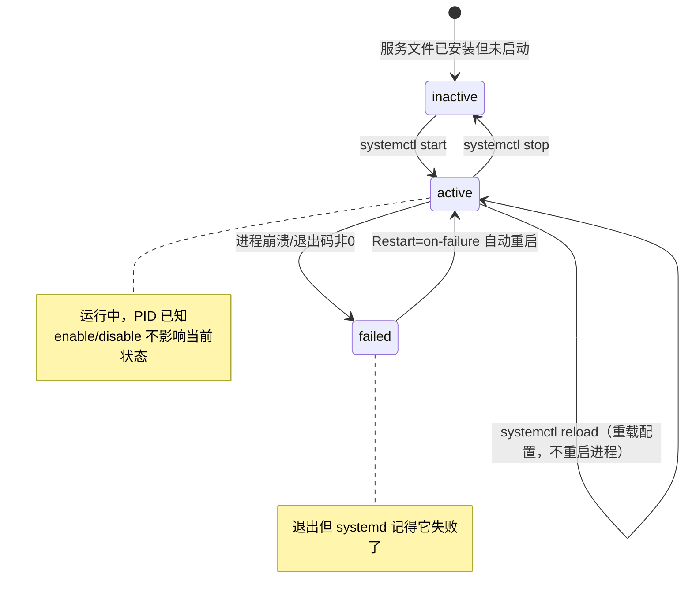

# $\rm Chapter \, 13$ 日常系统管理：软件、用户、服务与日志

> 你已经知道进程是程序的一次运行实例、服务是持续运行等待请求的程序（都来自[计算机程序与开发全景](../01-基础观念/01-计算机程序与开发全景.md)），后台进程不占用终端但终端关闭时可能被挂断信号终止（[终端、Shell与命令行](../02-终端与工具/02-终端Shell与命令行.md)和[操作系统、进程与线程](11-操作系统进程与线程.md)），信号是 OS 发给进程的异步通知（[操作系统、进程与线程](11-操作系统进程与线程.md)）。现在把这些串起来，回答一个实际问题：你写了一个后端程序，怎么让它开机自动启动、崩溃后自动重启、把输出写进结构化的日志，并且不以 root 身份运行？

> **开始前自检**：本章假设你已经会：
>
> - □ 会运行程序并解读退出码（第 2 章）
> - □ 理解进程与服务的基本概念（第 1 章 §1.5、第 11 章）
> - □ 用包管理器安装过软件（第 9 章）

## $\rm \S \, 13.1$ 从“双击运行”到“开机自启”

### $\rm \S \, 13.1.1$ 前台、后台、守护进程

[终端、Shell与命令行](../02-终端与工具/02-终端Shell与命令行.md)和[操作系统、进程与线程](11-操作系统进程与线程.md)分别从操作和机制角度讲过了前台/后台。这里聚焦一条完整的升级路径：

```text
双击或 ./app              → 前台进程，占终端，Ctrl+C 停止
./app &                   → 后台进程，终端关了就没了
nohup ./app &             → 忽略 SIGHUP，终端关了继续活
screen / tmux 里运行      → 手工管理的"伪后台"
systemd service           → 操作系统管理：开机启动、崩溃重启、日志收集
```

每一步解决一类问题。`nohup` 解决了“终端关了程序就挂了”的问题（原理：让进程忽略[操作系统、进程与线程](11-操作系统进程与线程.md)中讲过的 `SIGHUP` 信号——终端关闭时发给它的挂断通知），但不解决“程序崩溃了谁帮我重启”。`tmux`（终端多路复用器）让你可以在一个终端里开多个“虚拟窗口”，断开后重连——但它仍然需要你手动启动程序。

**守护进程**（daemon，发音“迪蒙”）是完全脱离终端控制的后台进程。名字来源于希腊神话中亦正亦邪的精灵——不是贬义。守护进程通常：

- 父进程是 PID 1（systemd/init），不隶属于任何用户会话；
- 工作目录通常是 `/`（避免占用某个会被卸载的目录）；
- 标准输入/输出/错误被重定向到 `/dev/null` 或日志系统；
- 不接收终端信号（Ctrl+C、SIGHUP）。

### $\rm \S \, 13.1.2$ systemd：现代 Linux 的服务管理器

systemd 是大多数 Linux 发行版（Ubuntu 15.04+、Debian 8+、CentOS 7+、Fedora、Arch）的初始化系统和服务管理器。它管理服务、挂载、定时器、日志等。你不需要学透 systemd，但需要看懂和编写基本的服务单元。



图中的状态转换对应了几个关键命令：

```bash
systemctl start paper-manager      # 启动
systemctl stop paper-manager       # 停止
systemctl restart paper-manager    # 重启（= stop + start）
systemctl reload paper-manager     # 重载配置（不重启进程，进程需支持 SIGHUP）
systemctl enable paper-manager     # 开机自启
systemctl disable paper-manager    # 取消开机自启
systemctl status paper-manager     # 查看状态、PID、最近日志
systemctl is-active paper-manager  # 脚本中判断服务是否在运行
```

`reload` vs `restart` 的区别很容易误解：`reload` 不发 `SIGTERM`——它发 `SIGHUP`，由程序自己决定如何处理（通常是重新读取配置文件）。`restart` 是停掉再启动——旧的连接全断，新的连接重新建立。生产环境中优先用 `reload`，除非配置变更要求重启。

### $\rm \S \, 13.1.3$ 编写一个 systemd service 文件

以论文管理器后端为例，把程序变成一个可管理的服务。创建文件 `/etc/systemd/system/paper-manager.service`（需要管理员权限，因为修改的是系统目录）：

```ini
[Unit]
Description=Paper Manager Backend
# 等网络就绪后再启动。After 只决定启动顺序，不表示"依赖"——网络没起来时它也会尝试启动
After=network.target

[Service]
# systemd 认为进程启动即就绪（最常用）
Type=simple
# 以这个用户身份运行（不是 root！）
User=paper-mgr
Group=paper-mgr
WorkingDirectory=/opt/paper-manager
ExecStart=/opt/paper-manager/venv/bin/python -m uvicorn main:app --host 0.0.0.0 --port 8000
# ↑ uvicorn 是 Python 的 HTTP 服务器——现在只需要看懂 ExecStart 的格式
# （等于在终端执行：/opt/paper-manager/venv/bin/python -m uvicorn main:app --host 0.0.0.0 --port 8000）
# Python 后端应用的具体写法见第 29 章
# reload 时发 SIGHUP
ExecReload=/bin/kill -HUP $MAINPID
# 进程崩溃时自动重启
Restart=on-failure
# 等 5 秒再重启（防止反复崩溃的快速循环）
RestartSec=5
# stdout 与 stderr 都进 systemd 日志
StandardOutput=journal
StandardError=journal

[Install]
# 正常多用户模式下启动（服务器默认运行级别）
WantedBy=multi-user.target
```

> **注意**：systemd 的 unit 文件不支持行尾注释——写成 `Type=simple  # 注释` 会让 systemd 把 `simple  # 注释` 整个当成取值，服务直接启动失败（`systemd-analyze verify` 会报 `Failed to parse service type`）。注释必须像上面这样独占一行，这是它和一般 INI 文件的一个差别。

每一行的意义：

- **User/Group**：[文件系统、路径与权限](../02-终端与工具/03-文件系统路径与权限.md)讲过了“管理员/root 是最后手段，不是第一反应”。这里是落实处——创建一个专用的低权限账户来跑服务，即使服务被攻破，攻击者也不能直接修改系统文件。
- **Restart=on-failure**：进程退出码非 0 时自动重启。你不需要自己写守护进程的 while-true 循环或 watch-dog 脚本——systemd 就是 watch-dog。
- **StandardOutput/Error=journal**：[计算机程序与开发全景](../01-基础观念/01-计算机程序与开发全景.md)和[内存、文件与输入输出](12-内存文件与输入输出.md)花了很大篇幅讲 stdout 和 stderr 的分工。这里的配置让两个流都进入 systemd 日志（journald），你可以在一个地方同时看到正常输出和错误——比分别看两个文件方便。
- **WantedBy=multi-user.target**：确定开机自启的“触发时机”——系统进入多用户模式（服务器典型状态）时启动。

### $\rm \S \, 13.1.4$ Windows 对照：Windows Service

Windows 的服务概念和 systemd 对应，工具不同：

```powershell
# 查看服务状态
Get-Service                          # 所有服务
Get-Service -Name "MSSQLSERVER"      # 特定服务

# 启动/停止（需要管理员权限）
Start-Service -Name "MyService"
Stop-Service -Name "MyService"

# 设置启动类型
Set-Service -Name "MyService" -StartupType Automatic
# Automatic = 开机自启，Manual = 手动，Disabled = 禁用

# 创建新服务（需要管理员权限）
New-Service -Name "MyService" -BinaryPathName "C:\app\myapp.exe" `
    -Description "My Application Service" -StartupType Automatic
```

Windows 的事件查看器（Event Viewer）是 journald 的对应物——应用程序可以通过 Windows Event Log API 写入结构化日志。不过日常开发中，你接触 Windows Service 的场景比 systemd 少——很多 Windows 上的服务器软件（如 IIS、SQL Server）自带服务安装器。

**第三方工具**：NSSM（Non-Sucking Service Manager，nssm.cc）是一个开源工具，可以把任意 `.exe` 包装成 Windows Service——很多没有内置服务支持的 Python 或 Node.js 程序通过它注册为服务。

---

## $\rm \S \, 13.2$ 日志：不只是写到文件

### $\rm \S \, 13.2.1$ 日志的层次

在 OJ 编码时你的“日志”是 `cout << "x = " << x << endl`。在真实系统中，日志有多个维度的结构化信息：

```text
[2026-03-15T14:32:01.123Z] [ERROR] [paper_manager.api] [req-abc123]
  数据库连接超时: host=db.example.com, timeout_ms=5000, retry=3/3
```

每一条应该包含：时间戳（精确到毫秒）、级别、来源组件、请求/会话标识、描述错误的具体参数。别人根据这条日志就应该能判断“是不是数据库挂了”而不用问你。

### $\rm \S \, 13.2.2$ 日志级别：不是所有输出都一样重要

五个通用级别（各语言/框架名称略有不同，本质相同）：

| 级别 | 含义 | 触发动作 |
|---|---|---|
| DEBUG | 调试信息：变量值、流程分支 | 开发环境开启，生产环境关闭 |
| INFO | 关键事件：服务启动、请求处理、定时任务完成 | 正常输出，记录“发生过什么” |
| WARN | 潜在问题：磁盘 80% 满、重试成功、参数退化到默认值 | 应关注但不紧急 |
| ERROR | 请求失败：API 返回 500、数据库查询超时 | 需要立即响应（告警） |
| FATAL | 服务不可恢复：无法连接数据库、必要配置文件缺失 | 服务通常退出 |

一个常见的反模式：把所有输出都标成 INFO，然后在上万行 INFO 里找不到唯一的 ERROR。更糟糕的是，用 `cout` 的默认输出（没有时间戳、没有级别）当“日志”。在[编辑器、IDE与调试器](../02-终端与工具/05-编辑器IDE与调试器.md)的调试讨论中已经说过 `cout` 调试法的局限——到了生产环境，没有结构化日志就等同于没有任何可观测性。

### $\rm \S \, 13.2.3$ journald：systemd 的统一日志系统

如果 stdout 和 stderr 被配置为 `journal`，程序的全部输出都会进入 journald。查看方式：

```bash
journalctl -u paper-manager          # 只看这个服务的日志
journalctl -u paper-manager -f       # -f = follow，类似 tail -f，实时追踪
journalctl -u paper-manager --since "10 minutes ago"
journalctl -u paper-manager -p err   # 只看 ERROR 及以上级别
journalctl -u paper-manager -n 50    # 最近 50 条
journalctl --vacuum-size=500M        # 限制日志总大小；会删除较早的日志文件，不可恢复
```

`journalctl` 的强大在于跨服务关联：当你怀疑“nginx 代理请求到后端时出问题”，可以同时看 nginx 的日志和后端服务的日志，并按时间对齐——因为它们都在同一个 journald 中。

### $\rm \S \, 13.2.4$ 日志轮转与磁盘危机

在[开发者命令行工具箱](../02-终端与工具/07-开发者命令行工具箱.md)中你用过 `df -h` 看各分区的使用情况、`du -sh` 看某个目录的大小。日志是占用磁盘的元凶之一——一个不轮转的错误日志可以在几小时内把几百 GB 的分区写满（写多快取决于错误频率和单条日志的大小，重新打印同一个异常的循环最容易失控）。

Linux 上 `logrotate` 是经典的日志轮转工具。它按大小或时间自动归档、压缩和删除旧日志。systemd 的 journald 自带大小限制（在 `/etc/systemd/journald.conf` 中配置）。

> **实践中**：你常常会发现一个服务突然挂了，原因不是 bug，而是磁盘被日志写满。先用 `df -h` 看分区使用率，再用 `du -sh /var/log` 或 `journalctl --disk-usage` 确认“罪魁祸首是不是日志”——这比盯着代码找 bug 更快。

### $\rm \S \, 13.2.5$ 日志工具一览

| 工具/平台 | 一句话 |
|---|---|
| journald + journalctl | Linux 现代标配，systemd 自带 |
| `logrotate` | 经典日志轮转，支持压缩、邮件、自定义脚本 |
| Elastic Stack (ELK) | Elasticsearch + Logstash + Kibana，集中式日志搜索和分析 |
| Grafana + Loki | 轻量级 ELK 替代，和 Prometheus 生态无缝 |
| Windows Event Viewer | 内置，应用程序和服务日志 |
| `tail -f` / `less +F` | 手动追踪文本日志的最简方式 |
| `lnav` (Log Navigator) | 终端中的彩色日志查看器，自动识别格式、支持 SQL 查询 |

---

## $\rm \S \, 13.3$ 身份、权限与服务账户

### $\rm \S \, 13.3.1$ 不要用你的账户跑服务

[文件系统、路径与权限](../02-终端与工具/03-文件系统路径与权限.md)说过“管理员/root 是最后手段，不是第一反应”。在生产环境中这不仅是安全底线，也是隔离原则的体现。

为每个服务创建**专用系统账户**：

```bash
# 创建系统用户（无密码、不创建家目录、不可登录）
sudo useradd -r -s /usr/sbin/nologin -d /opt/paper-manager paper-mgr
# -r: 系统账户（UID < 1000，不占用人类用户的命名空间）
# -s /usr/sbin/nologin: 这个账户不能登录 Shell——即使密码泄露也无法 SSH
# -d: 家目录路径（不是 shell 的工作目录；不加 -m 时只记录到 /etc/passwd，不会真的创建目录）
```

然后用[文件系统、路径与权限](../02-终端与工具/03-文件系统路径与权限.md)中学过的 `chown` 把应用程序的文件所有权赋予这个账户：

```bash
sudo chown -R paper-mgr:paper-mgr /opt/paper-manager
```

### $\rm \S \, 13.3.2$ umask：新文件的默认权限

[文件系统、路径与权限](../02-终端与工具/03-文件系统路径与权限.md)讲了用 `chmod` 修改已有文件的权限。但新创建的文件默认权限是什么？由 **umask** 决定。

```bash
umask         # 查看当前值，通常 022 或 002
umask 027     # 临时设置：owner 全权限，group r-x，others ---
```

umask 是从“满权限”中**减掉**的掩码。默认权限 666（文件）或 777（目录）减去 umask。`umask 022` → 新文件 644（rw-r--r--），新目录 755（rwxr-xr-x）。

服务账户的 umask 通常设置在其 systemd unit 中（`UMask=027`），确保服务创建的任何文件默认不对其他用户可读。

---

## $\rm \S \, 13.4$ 软件安装的“日常管理”视角

[软件、运行时、SDK与包管理器](../02-终端与工具/09-软件运行时SDK与包管理器.md)从概念上分层讲解了包管理器——系统级（apt/winget）、项目级（pip/npm）、环境级（venv/nvm），以及 PATH 如何决定哪个可执行文件被找到。这里加上实际操作和维护：

### $\rm \S \, 13.4.1$ 系统级：各平台的日常操作

```bash
# Ubuntu/Debian
sudo apt update                   # 更新包列表（不安装任何东西）
sudo apt upgrade                  # 升级所有已安装的包
apt list --installed              # 看看系统装了什么
apt search keyword                # 搜索包
sudo apt remove package           # 卸载（保留配置文件）
sudo apt purge package            # 完全卸载（包括配置文件）
sudo apt autoremove               # 删除不再需要的自动安装的依赖
```

```powershell
# Windows winget
winget search keyword
winget install Git.Git
winget list                       # 已安装清单
winget upgrade --all              # 升级所有可升级的
winget uninstall Git.Git
```

### $\rm \S \, 13.4.2$ 源码安装：`./configure && make && make install`

一些工具和库没有预编译包，需要从源码自己构建。经典三步：

```bash
./configure          # 检测系统环境，生成 Makefile
make                 # 编译
sudo make install    # 安装到系统目录（通常 /usr/local）
```

第四步（卸载）比前三步更麻烦：`sudo make uninstall` **只在 Makefile 提供了这个目标时才有效**。不是所有项目都有。这意味着从源码安装后很难彻底清除。因此优先用包管理器，只有别无选择时才从源码安装——并在安装前阅读 `INSTALL` 或 `README` 文件，搞清楚安装前缀（`--prefix`）、依赖和卸载方式。

### $\rm \S \, 13.4.3$ 动态库路径：`ldconfig` 和 `LD_LIBRARY_PATH`

在[计算机程序与开发全景](../01-基础观念/01-计算机程序与开发全景.md)中看过编译和链接的分工——编译器把每个源文件转换成目标文件，链接器把函数引用和实现对应起来。编译通过了，运行时报 `error while loading shared libraries: libXXX.so: cannot open shared object file`——这是典型的**运行时找不到动态库**。

系统在固定的几个目录（`/lib`、`/usr/lib`、`/usr/local/lib` 等）中搜索动态库，缓存由 `/etc/ld.so.conf` 配置：

```bash
sudo ldconfig              # 重建动态库缓存
ldconfig -p | grep XXX     # 搜索某个库是否在缓存中
```

临时指定额外的搜索路径（用于开发测试，不用于生产部署）：

```bash
export LD_LIBRARY_PATH=/opt/custom/lib:$LD_LIBRARY_PATH
./my_program
```

> **Windows 对应**：DLL 的搜索顺序默认是“可执行文件所在目录 → `System32` → Windows 目录 → 当前目录 → `PATH` 中的目录”（启用 SafeDllSearchMode 时；顺序与安全模式会随系统策略变化）。把 DLL 放到可执行文件同目录下是一种简单但粗暴的做法。

---

## $\rm \S \, 13.5$ 配置与 Secret 管理

### $\rm \S \, 13.5.1$ 配置分离原则

代码和配置应该分开。你把数据库密码写在源码里，就不可能在 GitHub 上开源；你把端口号写死在代码里，部署到不同环境就需要重新编译。

常见的配置层级（优先级从高到低）：

1. 命令行参数（`--port 8080`）
2. 环境变量（`$PORT`）
3. 配置文件（`config.yaml`、`.env`）
4. 代码中的默认值

### $\rm \S \, 13.5.2$ 不要把 Secret 放进 Git

[软件、运行时、SDK与包管理器](../02-终端与工具/09-软件运行时SDK与包管理器.md)讲过“安装包相当于运行一段不受审查的代码”。这里给出具体做法：

- **API Key、数据库密码、私钥** → 放在环境变量中，或放在代码仓库之外的配置文件中（如 `/etc/paper-manager/secrets.env`，权限 `600`）。
- **`.env` 文件** → 加入 `.gitignore`。提供一个 `.env.example`（含占位符，不含真实值）作为团队参考。
- **systemd 的 `EnvironmentFile`** 指令可以从指定文件加载环境变量——这个文件的权限应设为 `600` 且所有者是服务账户。

### $\rm \S \, 13.5.3$ 版本控制和变更记录

[Git与团队协作](../05-开发工作流/19-Git与团队协作.md)一章会完整讲 Git，但这里先说一个习惯：对系统配置文件的每次修改都记录在注释中（日期、修改人、原因）。这不算“完美的配置管理”，但在 team 只有两三个人时有效避免了“上次是谁改的这个参数”的追问。

---

## $\rm \S \, 13.6$ 定时任务：让机器按时自动做事

### $\rm \S \, 13.6.1$ cron：最经典的定时系统

```bash
crontab -e      # 编辑当前用户的定时任务
crontab -l      # 列出已配置的任务

# 格式：分 时 日 月 星期 命令
# 每天凌晨 3 点备份数据库
0 3 * * * /opt/paper-manager/backup.sh

# 每 5 分钟检查一次服务是否存活
*/5 * * * * /opt/paper-manager/healthcheck.sh
```

cron 的日志通常通过本地邮件系统（`/var/mail/`）发送给用户。如果一个 cron 任务静默失败，第一件事是检查 cron 的日志（journalctl 或 `/var/log/cron`）和用户的 mail spool。

### $\rm \S \, 13.6.2$ systemd timer：cron 的现代替代

systemd timer 可以替代 cron，优势是与 journald 集成（日志自动记录）、支持随机延迟（避免“午夜风暴”——所有任务同时触发）、可依赖其他 systemd unit：

```ini
# paper-manager-backup.timer
[Timer]
OnCalendar=daily
# 如果上次错过了（机器关机），开机后补执行
Persistent=true
# 随机延迟最高 5 分钟
RandomizedDelaySec=300
```

片段只列了 `[Timer]` 段：要真正跑起来，还需要一个同名的 `paper-manager-backup.service` 指明“执行什么”，并在 timer 里补上 `[Install]` 与 `WantedBy=timers.target`，才能用 `systemctl enable --now paper-manager-backup.timer` 启用。

### $\rm \S \, 13.6.3$ Windows 任务计划程序

图形界面，或 PowerShell：

```powershell
# 注册任务需要管理员权限（下面三行在管理员 PowerShell 中执行）
$trigger = New-ScheduledTaskTrigger -Daily -At 3am
$action = New-ScheduledTaskAction -Execute "powershell" -Argument "-File C:\Scripts\backup.ps1"
Register-ScheduledTask -TaskName "PaperBackup" -Trigger $trigger -Action $action
```

---

## $\rm \S \, 13.7$ 故障演练：故意破坏，练习修复

以下五个场景覆盖了 80% 的服务故障。在一个安全环境中（虚拟机或临时云主机）亲手制造并排查每一个。每个场景结束（或排查完）后把改动改回去：`sudo systemctl revert 服务名`（或把 `ExecStart`、`User` 改回原样）并 `sudo systemctl daemon-reload`，用 `chmod` 恢复被改动的权限，删除 `/tmp/bigfile` 一类测试文件。

### $\rm \S \, 13.7.1$ 场景一：服务启动失败

```bash
# 修改 ExecStart 指向一个不存在的路径
sudo systemctl edit --full paper-manager  # 把路径改错
sudo systemctl start paper-manager        # 启动失败
journalctl -u paper-manager -n 20         # 看日志，第一行通常会直接告诉你原因
systemctl status paper-manager            # 看 Active: failed 和退出码
```

### $\rm \S \, 13.7.2$ 场景二：端口被占用

启动第二个绑定同一端口的进程。用[开发者命令行工具箱](../02-终端与工具/07-开发者命令行工具箱.md)中学过的 `ss -tlnp` 或 `Get-NetTCPConnection` 找出占用者。

### $\rm \S \, 13.7.3$ 场景三：权限不足

把服务的 `User` 改成一个没有读取应用目录权限的账户，或用 `chmod 000` 移除应用文件的访问权限，然后启动。观察日志中的错误类型（`EACCES` / `Permission denied`），用[文件系统、路径与权限](../02-终端与工具/03-文件系统路径与权限.md)中的权限排查流程定位。

### $\rm \S \, 13.7.4$ 场景四：动态库缺失

如果服务器环境缺少某个 `.so` 文件，用 `ldd /path/to/executable` 查看缺少了哪个库，再用包管理器安装。

### $\rm \S \, 13.7.5$ 场景五：磁盘写满

```bash
# 创建一个大文件填满分区（在临时环境中！）
dd if=/dev/zero of=/tmp/bigfile bs=1M count=10000
# 观察服务的行为：写入失败、日志停止、可能的崩溃
df -h  # 确认分区已满
rm /tmp/bigfile  # 恢复
```

---

## $\rm \S \, 13.8$ 动手实践

### $\rm \S \, 13.8.1$ 实践一：编写并管理 systemd service

前置条件：一台运行 systemd 的 Linux（虚拟机或云主机）；WSL 需要手动启用 systemd（在 `/etc/wsl.conf` 里写 `[boot]` + `systemd=true`，再 `wsl --shutdown` 重启）；需要 sudo。

1. 写一个简单的 Python 脚本 `alive.py`：一个无限循环，每秒打印一行时间戳和“alive”。先直接 `python3 alive.py` 验证。预期输出：终端每秒多一行，Ctrl+C 能停下。
2. 创建 service 文件 `/etc/systemd/system/alive.service`，像 §13.1.3 那样配置（`ExecStart` 用 `python3 -u /opt/alive/alive.py`——Python 输出到管道/journal 时默认全缓冲，加 `-u` 或设置 `Environment=PYTHONUNBUFFERED=1` 才能实时看到日志），然后 `sudo systemctl daemon-reload`。预期输出：`systemctl cat alive` 打印出你写的单元内容。
3. `sudo systemctl start alive` → 检查 `systemctl status alive` → `journalctl -u alive` 查看输出。成功标志：status 显示 `Active: active (running)`，journalctl 里有每秒一行的日志。
4. `sudo systemctl enable alive` 并重启机器（如果是虚拟机），确认服务在开机后自动运行。预期输出：重启后 `systemctl status alive` 仍是 active，`systemctl is-enabled alive` 输出 `enabled`。
5. 手动结束进程（用 `systemctl show -p MainPID --value alive` 取 PID 后 `kill`），等待 `RestartSec` 后观察 `systemctl status`——服务应该已经自动重启。预期输出：MainPID 变成新值、启动时间更新（被信号结束也算失败，所以 `Restart=on-failure` 会触发）。
6. 清理：`sudo systemctl stop alive`、`sudo systemctl disable alive`、删除 service 文件、`sudo systemctl daemon-reload`。

### $\rm \S \, 13.8.2$ 实践二：分析日志

前置条件：沿用实践一的服务 `alive`；普通用户可能读不到全部日志——Ubuntu/Debian 上需要属于 `adm` 或 `systemd-journal` 组，否则命令前加 `sudo`（加入组：`sudo usermod -aG systemd-journal $USER`，重新登录后生效）。

1. 用 journalctl 查看你的服务的日志，尝试不同的过滤参数。预期输出：`journalctl -u alive` 只剩该服务的记录，条数随时间增长。
2. 用 `-p err` 只看错误级别的日志。预期输出：无——服务正常运行时没有 err 级别的记录，这本身就是“没有错误”的证据。
3. 用 `--since` 和 `--until` 限制时间范围。预期输出：输出只落在指定区间内（如 `--since "10 minutes ago"`）。
4. 导出为文本保存：`journalctl -u alive > service.log`。预期输出：`wc -l service.log` 得到一个非零行数，`less service.log` 能翻阅。
5. 清理：删除导出的 `service.log`。

### $\rm \S \, 13.8.3$ 实践三：创建服务账户

前置条件：需要 sudo；建议在实验机上做，账户名用 §13.3.1 的 `paper-mgr`；服务目录对该账户必须可读（若故意不可读，正好可以复现 §13.7.3 的权限故障）。

1. 用 `useradd -r` 创建一个系统账户：`sudo useradd -r -s /usr/sbin/nologin -d /opt/alive paper-mgr`。预期输出：`id paper-mgr` 显示账户存在，`getent passwd paper-mgr` 的登录 Shell 是 `/usr/sbin/nologin`。
2. 修改第 1 个实践中的 service 文件，用这个账户运行（改 `User=`/`Group=` 后 `sudo systemctl daemon-reload && sudo systemctl restart alive`）。预期输出：restart 后 `systemctl status alive` 仍为 active；若应用文件对该账户不可读，会在日志里看到 `Permission denied` / `EACCES`。
3. 启动服务，用 `ps aux | grep paper` 确认进程的所有者是新账户而不是你的用户。预期输出：进程行的 USER 列是 `paper-mgr`（`grep` 自己也可能出现在结果里，忽略即可）。
4. 清理：把 service 文件改回原账户并 `daemon-reload`（或停用并删除服务），再 `sudo userdel paper-mgr` 删除测试账户——不要加 `-r`，否则会连 `-d` 指定的 `/opt/alive` 一起删掉。

---

## $\rm \S \, 13.9$ 总结

- **systemd 管理服务的完整生命周期**：启动、停止、重载、重启、开机自启、依赖排序。不需要自己写看门狗脚本。
- **日志不止于“写到文件”**。带时间戳、级别和上下文的日志才能在生产环境中排障。journald 整合了所有 systemd 服务的输出。
- **用专用低权限账户运行服务**。umask 控制新文件的默认权限。
- **配置和 Secret 与代码分开**。环境变量和受保护配置文件是基本实践。
- **systemd timer 和 cron 解决定时任务**。systemd timer 更现代，与日志集成更好。
- **故意的故障演练能大幅加速排障学习**。端口冲突、权限不足、磁盘写满、依赖缺失——这些都是日常运维中的“高频题型”，在安全环境中主动触发并修复它们，比被动等待故障发生高效得多。

---

## $\rm \S \, 13.10$ 关键概念回顾

1. `systemctl start`、`stop`、`restart`、`reload`、`enable` 分别做什么？service 文件里的 `Restart=on-failure` 和 `RestartSec` 解决什么问题？

2. 为什么不应该以 root 身份运行应用服务？umask 影响什么，如何设置服务创建的新文件的默认权限？

3. 日志级别 DEBUG、INFO、WARN、ERROR、FATAL 分别适合什么场景？

4. `journalctl -u service-name -f` 在做什么？

5. `ldconfig` 解决什么问题？

## $\rm \S \, 13.11$ 应用与辨析

6. cron 和 systemd timer 的优缺点分别是什么？

7. 你遇到了一个服务启动失败的错误。按什么顺序收集证据？

8. 怎样确保 API Key 不会通过代码被提交到 Git 仓库？

## $\rm \S \, 13.12$ 本章自测答案

> 先闭卷作答本章“关键概念回顾”与“应用与辨析”，再核对以下答案。

### $\rm \S \, 13.12.1$ 自测答案 · 关键概念回顾
1. start 启动、stop 停止、restart 停掉再启动、reload 发 SIGHUP 让进程重读配置（不重启进程）、enable 设置开机自启（disable 取消）。`Restart=on-failure` 让进程崩溃（退出码非 0）时自动重启；`RestartSec` 是重启前的等待秒数，防止反复崩溃时进入快速循环。
2. root 能绕过几乎所有权限检查：服务一旦被攻破，攻击者可以直接修改系统文件；用专用低权限账户运行，把损害限制在服务自身。umask 决定新创建文件的默认权限（满权限 666/777 减去掩码）；在 systemd unit 中写 `UMask=027` 即可让服务的新文件默认组内可读、其他用户不可读。
3. DEBUG 是调试细节（生产关闭）；INFO 是正常关键事件；WARN 是潜在问题（如磁盘 80% 满）；ERROR 是操作失败需要响应；FATAL 是服务不可恢复（通常退出）。
4. 只看该服务的日志，并实时追踪新增内容（-f 类似 tail -f）。
5. 重建系统的动态库缓存（按 /etc/ld.so.conf 配置的目录），让运行时能找到新安装的 .so；`ldconfig -p` 可查询某个库是否在缓存中。

### $\rm \S \, 13.12.2$ 自测答案 · 应用与辨析
6. cron 简单经典、到处可用，但日志分散（靠邮件）、没有依赖管理；systemd timer 与 journald 集成、支持随机延迟（避免“午夜风暴”）和错过后的补执行（Persistent=true）。
7. `systemctl status 服务名` 看状态和退出码 → `journalctl -u 服务名 -n 20` 看最近日志（第一行常直接说明原因）→ 再检查路径、端口、权限和动态库（ldd）是否齐全。
8. 不放源码和命令行：放环境变量或仓库之外的 600 权限文件（systemd 用 EnvironmentFile 加载）；`.env` 加入 .gitignore 并提供 .env.example 占位模板；一旦泄露立即轮换密钥。

---

这里完成了计算机系统篇。你现在理解了从硬件（CPU 缓存、内存层级、PCIe）到操作系统（进程调度、虚拟内存、文件 I/O、信号），再到日常管理（systemd、日志、权限、定时任务）的完整链路。接下来，镜头从“你的机器”转向“世界上其他机器”——网络是怎样把两台计算机连接起来的？你访问 `github.com` 时，实际经历了哪些环节？

> 你现在能：把程序配置成开机自启的系统服务，用 journalctl 查日志并按时间线排查启动失败，安全地设置运行账户与敏感配置
