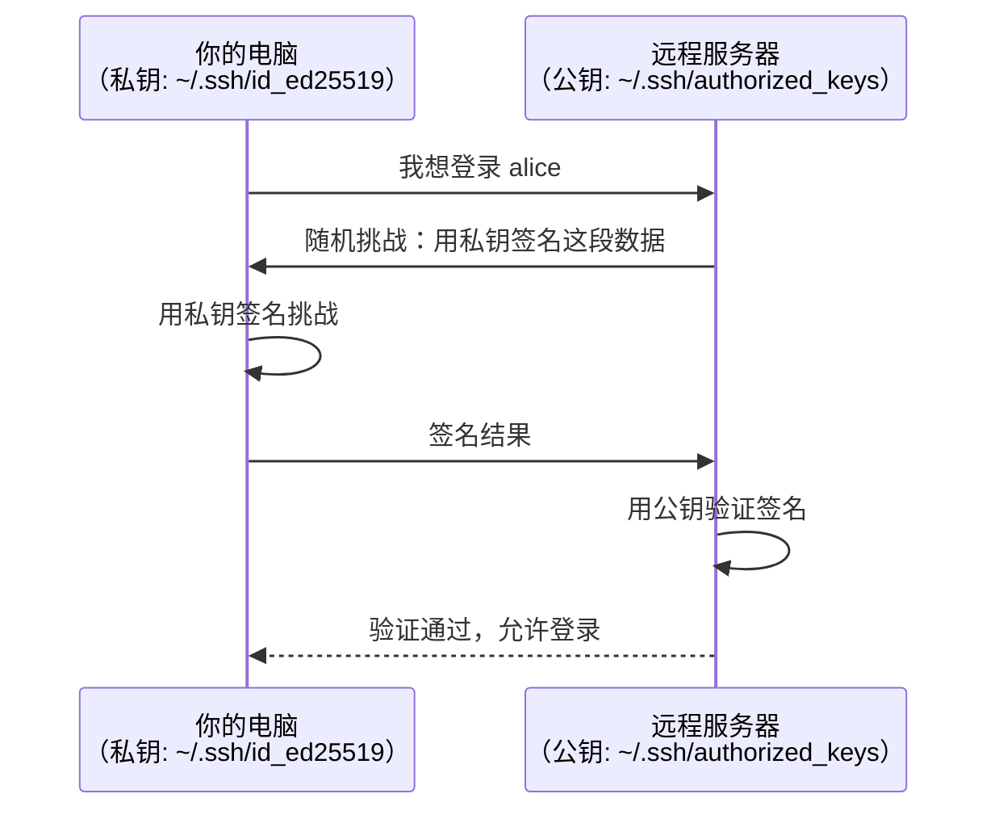

# $\rm Chapter \, 14$ SSH、远程开发与服务器生存指南

> 你的论文管理器后端写好了，但你的笔记本电脑只有 $16 \, \text{GB}$ 内存，而实验室有一台 $256 \, \text{GB}$ 内存 + 8 张 GPU 的服务器。你怎么从自己的电脑安全地登录那台服务器，在上面跑程序，关掉自己的电脑后程序继续运行，第二天再连上去看结果？**SSH** 是这一切的基础。

> **开始前自检**：本章假设你已经会：
>
> - □ 知道 IP 地址标识主机、端口标识服务（第 1 章 §1.5）
> - □ 会用终端执行命令（第 2 章 §2.4）
> - □ 理解客户端-服务器的基本对话方式（第 1 章 §1.5）

## $\rm \S \, 14.1$ SSH 解决什么问题

在[计算机、程序与开发全景](../01-基础观念/01-计算机程序与开发全景.md)中你学过：IP 地址标识网络中的一台主机，端口号标识该主机上的一个进程。但知道 IP 和端口只能让你“找到”那台机器——你需要一种安全的、加密的方式**登录并在上面执行命令**。

**SSH**（Secure Shell）提供：
1. **加密通信**：你和服务器之间的所有内容（包括密码）都被加密。有人在同一个 WiFi 上抓包也看不到你在输入什么。
2. **身份认证**：服务器验证“你确实是你”。可以用密码，但强烈建议用密钥。
3. **远程执行**：登录后在服务器上运行命令，就像坐在服务器前面打开的终端一样。

SSH 默认端口是 **22**——当你 `ssh alice@server.example.com`，实际是连接到 `server.example.com:22`。


---

## $\rm \S \, 14.2$ 密码 vs 密钥：为什么密钥更安全

### $\rm \S \, 14.2.1$ 密码认证的问题

```
ssh alice@192.168.1.100
alice@192.168.1.100's password: ********
```

每次登录都要输密码。而且如果服务器的 SSH 端口暴露在公网上，会有大量自动化脚本不断尝试常见密码（“暴力破解”）。

### $\rm \S \, 14.2.2$ 密钥认证的原理

密钥认证使用**非对称加密**（asymmetric encryption）——一把钥匙加密的内容只有另一把能解开。这和 HTTPS 中 TLS 证书的原理相同（详见第 24 章）：



**私钥永远不离开你的电脑**——服务器只收到一个签名结果，而不是私钥本身。服务器上的公钥可以公开（但没必要），私钥必须严格保密。

### $\rm \S \, 14.2.3$ 生成和使用密钥对

```bash
# 在你的电脑上生成密钥对
ssh-keygen -t ed25519 -C "alice@example.com"
#   -t ed25519: 使用 Ed25519 算法（现代、安全、短）
#   -C: 注释（通常是你的邮箱）

# 这会生成两个文件：
# ~/.ssh/id_ed25519     ← 私钥！绝不发送给任何人、不放进 Git、不粘贴到任何地方
# ~/.ssh/id_ed25519.pub ← 公钥！可以安全地分享，放到服务器上

# 把公钥复制到服务器
ssh-copy-id alice@server.example.com
# 这条命令把 ~/.ssh/id_ed25519.pub 的内容追加到
# 服务器上 ~/.ssh/authorized_keys 文件中
```

Windows 自带的 OpenSSH 客户端有 `ssh`、`scp`、`ssh-keygen`，但没有 `ssh-copy-id`：在 Windows 上可以在 WSL 或 Git Bash 里执行它，或者手动把 `~/.ssh/id_ed25519.pub` 的内容追加到服务器的 `~/.ssh/authorized_keys` 里。

之后登录就不需要密码了：

```bash
ssh alice@server.example.com
# 直接登录——密钥认证自动完成
```

### $\rm \S \, 14.2.4$ `known_hosts`：防止中间人攻击

第一次连接一台新服务器时，SSH 会显示：

```text
The authenticity of host 'server.example.com (192.168.1.100)' can't be established.
ED25519 key fingerprint is SHA256:xxxxxxxxxxxxxxxxxxxxxxxxxxxxxxxxxxxxxxxxxxx.
Are you sure you want to continue connecting (yes/no/[fingerprint])?
```

这不是错误——是 SSH 在说“我不认识这台服务器，这是它的指纹，你确认吗？”。输入 `yes` 后，指纹被保存到 `~/.ssh/known_hosts`。下次连接时，SSH 会比较指纹——如果指纹变了（可能是服务器重装了系统，也可能是中间人攻击），SSH 会发出严重警告并拒绝连接。

### $\rm \S \, 14.2.5$ `~/.ssh/config`：别再记 IP 和端口了

每次输入 `ssh alice@10.0.0.5 -p 2222 -i ~/.ssh/lab_key` 是浪费时间且容易出错。`~/.ssh/config` 让你用短别名替代这些：

```text
Host lab
    HostName 10.0.0.5
    User alice
    Port 2222
    IdentityFile ~/.ssh/lab_key

Host gpu-server
    HostName gpu-cluster.lab.edu
    User zhang-san
    ForwardAgent yes          # 从这台机器 SSH 到其他机器时带上本机的密钥

Host *.lab.edu
    User alice                # 所有 *.lab.edu 的主机默认用 alice 登录
    ServerAliveInterval 60    # 每 60 秒发一次心跳，防止闲置断开
```

之后：

```bash
ssh lab              # = ssh alice@10.0.0.5 -p 2222 -i ~/.ssh/lab_key
scp data.csv lab:~/projects/
ssh lab "nvidia-smi" # 不需要登录交互式 Shell，直接执行命令
```

> **经验规则**：拿到一台新服务器的 SSH 凭据后，第一步就是把它写进 `~/.ssh/config`。之后你永远不会再输入那串 IP 和端口。

### $\rm \S \, 14.2.6$ ssh-agent：只输一次密码

`ssh-keygen` 生成密钥时可以设一个**密码短语**（passphrase）保护私钥——这样即使私钥文件泄露，对方没有密码短语也用不了。代价是每次 SSH 连接都要输一次密码短语，频繁登录很烦。

**ssh-agent** 解决这个问题：一个在后台运行的守护进程，把你的私钥**解密后缓存在内存**里，SSH 需要签名时直接找它要：

```bash
ssh-add ~/.ssh/id_ed25519     # 把私钥加入 agent——只需输入一次密码短语
ssh-add -l                    # 列出 agent 中已加载的密钥
# 之后本机所有 SSH 连接都不再询问密码短语
```

macOS 和常见 Linux 桌面通常自动运行 agent；如果提示 `Could not open a connection to your authentication agent`，先执行 `eval "$(ssh-agent -s)"` 启动它。Windows 上 ssh-agent 是系统服务（默认未启动）：在管理员 PowerShell 里 `Start-Service ssh-agent`；想开机自动启动，用 `Set-Service ssh-agent -StartupType Automatic`。

agent 的真正威力是**转发**（agent forwarding）：`~/.ssh/config` 中的 `ForwardAgent yes`（上一节 `gpu-server` 的例子）让密钥穿过中间机器——本机 → 服务器 A → 服务器 B 逐层跳转时，A 不保存你的私钥，只是把签名请求转发回你本机的 agent。典型场景：你在 A 上 `git clone` 私有仓库或 `git push`，用的都是本机的 GitHub 密钥，A 上不需要放任何私钥。

**安全注意**：ForwardAgent 期间，服务器 A 上能访问 agent socket 的人（root 用户、或攻破 A 的攻击者）可以冒用你的密钥。**只对信任的服务器开启 ForwardAgent**；对不信任的跳板机，改用 `ProxyJump`——它只借用 A 的网络通道到达 B，不把密钥暴露给 A。

---

## $\rm \S \, 14.3$ 基础远程操作

### $\rm \S \, 14.3.1$ 登录和执行命令

```bash
# 登录
ssh alice@server.example.com

# 执行一条命令（不进入交互 Shell）
ssh alice@server.example.com "nvidia-smi"

# 指定端口（如果 SSH 不在默认的 22 端口）
ssh -p 2222 alice@server.example.com
```

### $\rm \S \, 14.3.2$ 传输文件

```bash
# SCP——基于 SSH 的文件复制
scp local_file.txt alice@server:/home/alice/data/
scp -r local_dir/ alice@server:/home/alice/
scp alice@server:/home/alice/results.txt ./

# rsync——增量同步（只传输变化的部分，支持断点续传）
rsync -avzP local_dir/ alice@server:/home/alice/data/
# -a: 归档模式（保留权限、时间戳）
# -v: 详细输出（列出传输了哪些文件）
# -z: 压缩
# -P: 断点续传 + 进度条
```

**rsync vs scp：什么时候用哪个**

`scp` 随 Windows 自带的 OpenSSH 客户端一起提供；`rsync` 在 Windows 上要经 WSL 使用，或用 MSYS2/cwRsync 之类单独安装。

| 场景 | 工具 |
|------|------|
| 传一个文件到服务器 | `scp`——简单直接 |
| 传整个项目目录（含几百个文件） | `rsync`——增量传输，第二次只传变化的文件 |
| 从服务器下载训练结果，网络不稳定 | `rsync -P`——断了可以续传 |
| 同步本地目录到服务器（像 Dropbox） | `rsync -avz --delete`——删掉服务器上本地已不存在的文件 |
| 传输前先预览哪些文件会被传 | `rsync -avzn`——`-n` 是 dry-run，只列文件不真传 |

**`rsync` 的核心优势是增量**——它比较源和目标文件的修改时间和大小，只传输有变化的文件。对于代码项目（几百个小文件，每次只改几个），第二次同步从 30 秒降到不到 1 秒。

**`/` 的陷阱**：`rsync local_dir/ server:dir/`（源路径末尾有 `/`）和 `rsync local_dir server:dir/`（没有 `/`）行为不同——前者复制目录**内容**，后者复制目录**本身**。不确定时先加 `-n` 预览。

---

## $\rm \S \, 14.4$ 断开后程序继续运行

### $\rm \S \, 14.4.1$ 问题：为什么关终端程序就停了

在[操作系统、进程与线程](11-操作系统进程与线程.md)中你学过 `SIGHUP` 信号——当终端关闭时，Shell 向所有附着于该终端的子进程发送 `SIGHUP`，默认行为是终止进程。你的 SSH 会话是一个终端——你通过 SSH 启动的程序会收到 `SIGHUP`。

### $\rm \S \, 14.4.2$ tmux：会话管理器

**tmux**（terminal multiplexer，终端多路复用器）是最广泛使用的方案。它在服务器上创建一个**持久会话**——即使你的 SSH 断开，tmux 会话和其中的所有进程仍然在运行。

```bash
# 在服务器上安装 tmux
sudo apt install tmux          # Ubuntu/Debian

# 创建新会话
tmux new -s training           # -s: 会话名称

# 在 tmux 中启动训练
python train.py

# 断开会话（Ctrl+B，然后按 D）——训练继续运行！
# 关闭 SSH 连接——训练不受影响

# 第二天重新 SSH 登录，重新连接会话
tmux attach -t training        # -t: 目标会话名称
# 你又看到了训练输出！
```

常用 tmux 快捷键（`Ctrl+B` 是默认前缀键，之后按另一个键）：

| 快捷键 | 功能 |
|---|---|
| `Ctrl+B` `D` | 断开会话（detach） |
| `Ctrl+B` `C` | 创建新窗口 |
| `Ctrl+B` `N` / `P` | 切换窗口（next/previous） |
| `Ctrl+B` `%` | 垂直分割面板 |
| `Ctrl+B` `"` | 水平分割面板 |
| `Ctrl+B` 方向键 | 切换面板 |

### $\rm \S \, 14.4.3$ 替代方案

| 工具 | 特点 |
|---|---|
| **tmux** | 最广泛使用，Ctrl+B 操作 |
| **screen** | tmux 的前身，功能较少但几乎所有系统都预装 |
| **nohup** | `nohup python train.py &`——最简单的后台化，输出默认写进 `nohup.out`，但没法像 tmux 那样重连交互 |
| **systemd service** | [日常系统管理：软件、用户、服务与日志](13-系统服务日志与软件安装.md)讲过，适合长期运行的服务而非临时训练 |

### $\rm \S \, 14.4.4$ asciinema：把终端会话录成文字

想给别人看“我敲了什么、输出是什么”——截图只能截一帧，录屏是几十 MB 的像素视频。**asciinema** 把终端会话录成**文本格式的录像**（cast 文件）：体积远小于录屏（短演示只有几 KB 到几十 KB，长时间的日志输出会更大）、里面的文字可以直接复制粘贴、上传后得到一个分享链接（asciinema.org）。

```bash
asciinema rec demo.cast    # 开始录制，之后正常操作终端
# 按 Ctrl+D 停止录制
asciinema play demo.cast   # 本地回放
asciinema upload demo.cast # 上传，输出一个分享链接
```

典型用途：录下 bug 的复现步骤发给队友（对方能逐字看到你输入的命令和输出）、做 CLI 工具演示、记录“我当时就是这样操作的”。安装：`sudo apt install asciinema`（Debian/Ubuntu）或 `brew install asciinema`（macOS）。

---

## $\rm \S \, 14.5$ 端口转发：安全访问远程服务

在训练服务器上启动了 Jupyter Notebook（监听 `localhost:8888`），你怎么在自己电脑的浏览器中打开它？

**SSH 端口转发**（port forwarding，也叫 SSH tunneling）在本地开一个端口，把流量通过 SSH 隧道转发到远程服务器：

```bash
# -L 本地端口:远程地址:远程端口
ssh -L 8888:localhost:8888 alice@server.example.com

# 现在打开浏览器访问 http://localhost:8888
# 实际访问的是 server 上的 localhost:8888
# 所有流量通过 SSH 加密隧道传输
```

**反向端口转发**（`-R`）让远程服务器可以访问你本地的服务——比如你在本地跑了一个 Webhook 调试器，想让远程服务器上的应用能回调到你的本地：

```bash
ssh -R 9090:localhost:3000 alice@server.example.com
# 服务器上的 localhost:9090 → 你本地电脑的 localhost:3000
```

---

## $\rm \S \, 14.6$ 共享服务器生存礼仪

训练服务器通常很多人共用。不要成为那个被所有人讨厌的人。

### $\rm \S \, 14.6.1$ GPU：用之前先问

```bash
nvidia-smi                # 查看 GPU 状态：谁在用？用了多少显存？利用率如何？
```

在占用 GPU 前，先看有没有人正在用。如果有空闲 GPU，用这个。如果所有 GPU 都被占用，问一下对方大概什么时候结束——不要直接 `kill -9` 别人的进程（回顾[操作系统、进程与线程](11-操作系统进程与线程.md)中 `SIGKILL` 不可捕获——对方连保存 checkpoint 的机会都没有）。

### $\rm \S \, 14.6.2$ 磁盘：不要写满共享分区

```bash
df -h                     # 查看各分区使用率
du -sh ~/                 # 你的家目录占用多少
du -sh /data/* | sort -hr | head   # 共享数据分区最大的几个目录
```

[开发者命令行工具箱](../02-终端与工具/07-开发者命令行工具箱.md)中的方法在这里同样适用。数据集的解压缓存、临时训练日志、core dump 文件——这些很容易填满几百 GB。用完的临时文件及时清理。

### $\rm \S \, 14.6.3$ 不要把 Token 写进命令行

```bash
# ❌ 危险：API Key 出现在 Shell 历史中
export OPENAI_API_KEY=sk-xxxx
python train.py

# ✅ 安全：从文件读取（权限 600）
export $(cat ~/.secrets/env | xargs)
python train.py

# ✅ 更好：环境变量文件权限严格
chmod 600 ~/.secrets/env
```

`~/.bash_history` 记录了你在终端中输入的每一条命令。如果你的 API Key 出现在历史文件中，任何一个能登录这台服务器的人都能看到。

### $\rm \S \, 14.6.4$ 总结：共享服务器规矩

1. **GPU 先用 `nvidia-smi` 查看再占用**。不要抢正在使用的 GPU。
2. **磁盘不是无限的**。大数据集放 `/data/`（共享分区），定期清理临时文件。
3. **Token/密码/私钥不进命令行**。用环境变量文件，权限 `600`。
4. **不要 `kill -9` 别人的进程**。先沟通。`SIGKILL` 让对方连保存的机会都没有。
5. **长时间任务放 tmux 或 screen 里**。别占着 SSH 前台让终端开着过夜。
6. **安装软件到用户目录或环境管理中**。不要 `sudo pip install` 到系统 Python。

---

## $\rm \S \, 14.7$ VS Code Remote：图形化的远程开发

VS Code 的 **Remote - SSH** 扩展让你在本地 VS Code 中直接编辑远程服务器上的文件——终端也在远程，代码补全基于远程环境安装的库。不需要在服务器上安装 GUI，只需要 SSH 连接。

安装扩展后，按 `F1` → “Remote-SSH: Connect to Host” → 输入 `alice@server.example.com`。打开文件夹时选择远程路径。你的本地 VS Code 变成一个“窗口”，实际一切计算都在远程服务器上。

**JetBrains Gateway**（jetbrains.com/remote-development）为 JetBrains IDE（PyCharm、CLion、IntelliJ）提供类似的远程开发体验。

---

## $\rm \S \, 14.8$ 动手实践

如果你有一台能 SSH 登录的远程机器（云服务器、实验室服务器、甚至本地的虚拟机）：

Windows 上建议在 WSL 里做这些实践——PowerShell 自带 `ssh`/`scp`/`ssh-keygen`，但没有 `ssh-copy-id` 和 `tmux`；涉及服务器端的 Python 命令统一写 `python3`（Ubuntu 20.04 起默认不再提供 `python` 这个命令）。

### $\rm \S \, 14.8.1$ 实践一：密钥认证

1. 生成密钥对（`ssh-keygen -t ed25519`）。预期输出：提示保存路径（默认 `~/.ssh/id_ed25519`）和 passphrase，结束后打印一个 fingerprint 与随机艺术图；`ls ~/.ssh` 能看到 `id_ed25519` 与 `id_ed25519.pub` 两个文件。
2. 用 `ssh-copy-id alice@server` 把公钥放到远程服务器（PowerShell 里没有这条命令：在 WSL/Git Bash 里执行，或手动把 `id_ed25519.pub` 的内容追加到服务器的 `~/.ssh/authorized_keys`）。预期输出：打印 `Number of key(s) added: 1`。
3. SSH 登录——不再需要密码。预期输出：`ssh alice@server` 直接进入服务器提示符，不再询问服务器的登录密码（若给私钥设了 passphrase，问的是本地私钥的 passphrase）。
4. 查看 `~/.ssh/known_hosts` 的内容。预期输出：能看到服务器主机名/IP 与它的公钥条目。
5. 清理：本实践不产生临时文件；若要撤销授权，从服务器的 `~/.ssh/authorized_keys` 中删掉那一行（删掉本地私钥就再也无法登录，确认不再需要时再做）。

### $\rm \S \, 14.8.2$ 实践二：tmux 持久会话

前置条件：服务器上已装 tmux（`tmux -V` 检查，没有则 `sudo apt install tmux`）。

1. SSH 登录，`tmux new -s test`。预期输出：屏幕底部出现状态栏，显示会话名 `test`。
2. 在 tmux 中运行 `python3 -c "import time; [print(i, flush=True) or time.sleep(1) for i in range(1000)]"`。预期输出：从 0 开始每秒打印一个数字。
3. `Ctrl+B` `D` 断开。退出 SSH。预期输出：回到本地提示符；重新登录后 `tmux ls` 仍显示 `test` 会话。
4. 重新 SSH 登录，`tmux attach -t test`——确认程序一直在运行。预期输出：看到的数字比离开时大得多，说明会话期间打印没有中断。
5. 清理：在会话里按 `Ctrl+C` 停掉程序，再 `tmux kill-session -t test`（之后 `tmux ls` 会提示没有服务器在运行）。

### $\rm \S \, 14.8.3$ 实践三：端口转发

前置条件：远程服务器有 `python3`；本地 8888 端口没有被别的程序占用。

1. 在远程服务器上运行 `python3 -m http.server 8888 --bind 127.0.0.1`。预期输出：打印 `Serving HTTP on 127.0.0.1 port 8888 ...`。（`--bind 127.0.0.1` 只监听本机；不加的话默认监听所有网卡，会把当前目录暴露给整个网络——隧道访问本机端口不受影响。）
2. 在本地运行 `ssh -L 8888:localhost:8888 alice@server`。预期输出：无，命令保持挂起说明隧道已建立（本地 8888 被别的程序占用时会报 `bind: Address already in use`）。
3. 在本地浏览器中打开 `http://localhost:8888`——你看到的是远程服务器上的文件列表。成功标志：列出的是服务器当前目录的内容，而不是你本机的目录。
4. 清理：本地按 Ctrl+C 关闭隧道；回到服务器终端按 Ctrl+C 停掉 `http.server`，确认目录不再暴露在外。

---

## $\rm \S \, 14.9$ 总结

- SSH 是加密的远程登录协议。密钥认证比密码更安全且更方便。
- 私钥（`~/.ssh/id_ed25519`）绝不外传；公钥（`.pub`）放在服务器上的 `~/.ssh/authorized_keys`。
- `scp`/`rsync` 传输文件。`rsync` 支持断点续传和增量同步。
- tmux 创建持久会话——断开 SSH 后程序继续运行，重连后能看到输出。
- 端口转发（`-L`/`-R`）把远程端口映射到本地，安全访问仅监听 localhost 的服务。
- 共享服务器：先查 GPU/磁盘再占用，Token 不进命令行，不要 kill 别人的进程。

---

## $\rm \S \, 14.10$ 关键概念回顾

1. SSH 解决什么核心问题？它默认使用哪个端口？

2. 公钥和私钥分别应该存放在什么地方？哪个绝不可以发送给任何人？`known_hosts` 文件的作用是什么？

3. 为什么直接 SSH 登录后运行的程序在断开 SSH 后会停止？tmux 的 `Ctrl+B` `D` 和 `Ctrl+B` `C` 分别做什么？

4. `ssh -L 8888:localhost:8888 alice@server` 让本地浏览器访问 `localhost:8888` 时实际看到了什么？

5. 共享服务器上的三条基本规矩是什么？

## $\rm \S \, 14.11$ 应用与辨析

6. `scp` 和 `rsync` 有什么区别？什么时候用 `rsync`？

7. 你 SSH 登录服务器运行 `python train.py` 后直接关闭电脑，第二天发现训练早就停了。原因是什么？正确做法是什么？

## $\rm \S \, 14.12$ 本章自测答案

> 先闭卷作答本章“关键概念回顾”与“应用与辨析”，再核对以下答案。

### $\rm \S \, 14.12.1$ 自测答案 · 关键概念回顾
1. 提供加密通信、身份认证和远程执行命令——安全地登录远程机器并操作它；默认端口 22。
2. 私钥（~/.ssh/id_ed25519）留存在你的电脑上，绝不发送给任何人；公钥（.pub）放到服务器的 ~/.ssh/authorized_keys。`known_hosts` 记录你确认过的服务器指纹，防止中间人攻击；下次连接时如果指纹变了，SSH 会发出严重警告并拒绝连接。
3. SSH 会话是一个终端：断开时 Shell 向附着于该终端的进程发送 SIGHUP（挂断信号），默认行为是终止进程。`Ctrl+B` `D` 断开会话（detach，会话和其中的程序继续运行）；`Ctrl+B` `C` 创建新窗口。
4. 实际访问的是远程服务器上的 localhost:8888 服务（如 Jupyter），所有流量经过 SSH 加密隧道传输。
5. 用 GPU 前先 `nvidia-smi` 查看再占用，不抢正在使用的 GPU；磁盘不是无限的，大数据集放共享分区并及时清理临时文件；Token/密码/私钥不进命令行（用权限 600 的环境变量文件）。

### $\rm \S \, 14.12.2$ 自测答案 · 应用与辨析
6. scp 简单全量复制；rsync 增量同步（只传变化的部分）、支持断点续传和压缩；传输大量小文件或传输可能中断时用 rsync。
7. SSH 断开时终端关闭，Shell 向附着于该终端的子进程发送 SIGHUP，训练进程被终止；正确做法是先在服务器上 `tmux new -s training` 创建持久会话，在会话内运行训练，断开 SSH 不影响它，第二天 `tmux attach -t training` 查看输出。

---

SSH 让你能安全地操作任何远程机器——至此，从硬件、操作系统到系统管理与远程开发的主线已经完整。接下来镜头从“机器”转向“语言”：你在竞赛里最熟悉的 C++，在真实工程里要怎样组织代码、管理依赖、避免内存错误？下一章[从竞赛 C++ 到工程 C++](../06-编程语言/15-C++从竞赛到工程.md)进入编程语言篇。

> 你现在能：用 SSH 密钥登录远程服务器，用 scp/rsync 传输文件，用 ssh config 与 agent 简化连接，用 tmux 保住长任务，并能做端口转发
