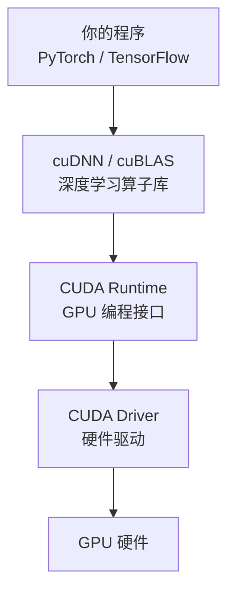

# $\rm Chapter \, 35$ GPU、显卡与 AI 计算

> 你每天听到"显卡""GPU""A100""H100""显存"。但如果你问一个典型的 CS 学生"GPU 到底是什么"，最常见的回答是"一种用来训练 AI 的硬件"。这不准确——GPU 最初是为渲染三角形设计的，而它"顺便"成了 AI 的核心引擎，是因为一个巧合：它的架构恰好擅长神经网络需要的大规模矩阵乘法。这一章从零拆解 GPU——从像素到张量，从 DirectX 到 CUDA。

## $\rm \S \, 35.1$ GPU 到底是什么

### $\rm \S \, 35.1.1$ 它是一块独立的"小电脑"

**GPU**（Graphics Processing Unit，图形处理器）是一块独立的电路板（通常插在主板的 PCIe 插槽上），上面有：

| 部件 | 作用 | 对应 CPU 概念 |
|---|---|---|
| **GPU 核心芯片** | 执行计算 | CPU 核心 |
| **显存（VRAM）** | GPU 独享的高速内存 | 系统 RAM（但 GPU 不能直接用系统 RAM） |
| **供电模块（VRM）** | 把电源的 12V 转换为芯片需要的低压大电流 | 主板供电 |
| **散热系统** | 风扇 + 散热片，把 $300 \, \text{W}$+ 的热量排出去 | CPU 散热器（但 GPU 功耗通常是 CPU 的 2-5 倍） |
| **显示输出接口** | HDMI / DisplayPort / USB-C | 主板的视频输出（集成显卡用） |

GPU 不是 CPU 的"附件"——它是一台高度专业化的协处理器。它有自己的内存（显存）、自己的指令集、自己的操作系统（驱动）。CPU 通过 PCIe 总线向 GPU 发送命令和数据，GPU 独立执行后把结果传回来。

> **类比**：CPU 像一个大厨——什么菜都会做、每道菜做得很快（低延迟）。GPU 像一万个厨房帮工——每个只会切洋葱，但同时切一万个洋葱比大厨快得多。AI 训练就是"同时切一万个洋葱"（一万个独立的矩阵乘法），所以 GPU 碾压 CPU。

### $\rm \S \, 35.1.2$ 显存（VRAM）：GPU 自己的内存池

这是 GPU 最重要的参数——比核心数量更影响你实际能做什么。

在[从竞赛机模型到真实硬件](08-计算机硬件速通.md)中你知道了 CPU 访问系统 RAM 经过三级缓存，延迟 ~$100 \, \text{ns}$。GPU 显存是**独立的内存芯片**，焊接在显卡电路板上，通过**超高带宽总线**（不是普通的内存通道）连接到 GPU 核心。一个典型的消费级 GPU（如 RTX 4070）有 $12 \, \text{GB}$ 显存、约 $500 \, \text{GB/s}$ 带宽；数据中心 GPU（如 H100）有 $80 \, \text{GB}$ 显存、约 3.35TB/s 带宽。

这块显存不共享系统的 RAM——CPU 不能直接访问显存，GPU 也不能直接访问系统 RAM。两者之间必须通过 PCIe 总线传输数据（这就是[从竞赛机模型到真实硬件](08-计算机硬件速通.md)中提到的"PCIe 带宽可能是瓶颈"的原因）。

**为什么显存大小比你想象的更重要**：
- AI 模型的参数（weights）必须在显存中。
- 训练时，参数 + 梯度 + 优化器状态（如 Adam 的动量） + 激活值全部在显存中。
- 一个 70 亿参数的模型，仅参数就需要约 $14 \, \text{GB}$（FP16 精度）。加上训练所需的额外状态，实际需要 $40\sim60 \, \text{GB}$。这就是为什么你不能在 $12 \, \text{GB}$ 显存的游戏卡上训练大模型。

### $\rm \S \, 35.1.3$ GPU 和"显卡"是什么关系

**显卡**（graphics card / video card）是整块电路板的通俗叫法——上面有 GPU 芯片、显存、供电、散热、输出接口。**GPU** 特指那块计算芯片本身。日常交流中两者混用，但技术上 GPU 只是显卡上最大的那一颗芯片。

**集成显卡**（iGPU）是 CPU 芯片内置的简单 GPU——共享系统 RAM、性能很弱、但功耗极低。**独立显卡**（dGPU）是插在主板上的独立设备——有自己的显存、高功耗（可到 $450 \, \text{W}$+）、高性能。

---

## $\rm \S \, 35.2$ 从像素到张量：GPU 为什么变了

### $\rm \S \, 35.2.1$ GPU 的原生任务：渲染三角形

每一个 3D 游戏画面由数以万计的三角形组成。GPU 的工作流程大致是：

1. **顶点处理**：计算每个三角形顶点的 3D 位置、光照、纹理坐标。
2. **光栅化**：把三角形转换为屏幕上的像素。
3. **像素着色**：计算每个像素的颜色——这个像素应该是什么纹理、多亮、反射了什么光。

第 3 步是并行的终极场景：1920×1080 的屏幕有 200 万像素，每帧（1/60 秒内）要对每个像素独立计算颜色。GPU 被设计为**同时处理几百万个彼此无关的简单任务**——这和 "做几百万次独立的矩阵乘法" 在计算模式上是同一个问题。

### $\rm \S \, 35.2.2$ 关键渲染技术速览

这些是你在游戏设置里见过但不一定理解的名词。理解它们不需要写代码——只需要知道 GPU 在做什么：

| 技术 | 全称 | 解决什么问题 | 一句话 |
|---|---|---|---|
| **抗锯齿**（Anti-Aliasing, AA） | — | 斜线边缘出现阶梯状的"锯齿" | 在边缘像素上取多个采样点，取平均颜色。MSAA 取 4-8 个采样点；TAA 利用上一帧的信息。 |
| **各向异性过滤**（Anisotropic Filtering, AF） | — | 斜着看的纹理变模糊（如远处的地面） | 在纹理的不同方向上使用不同的采样率。`4x`/`8x`/`16x` 指采样倍数——数字越大越清晰，性能影响越小（现代 GPU 几乎免费） |
| **垂直同步**（VSync） | Vertical Synchronization | 画面撕裂——屏幕上半部分显示上一帧、下半部分显示下一帧 | 强制 GPU 等屏幕刷新完再输出下一帧。代价：稍有延迟 |
| **可变刷新率** | G-Sync (NVIDIA) / FreeSync (AMD) | VSync 导致的延迟和卡顿 | 显示器刷新率动态匹配 GPU 输出帧率——不撕裂、不卡顿、不额外延迟 |
| **光线追踪**（Ray Tracing） | — | 反射、阴影、全局光照看起来很假 | 从摄像机反方向追踪每束光线的路径——真实但极其昂贵。RTX 显卡有专门的 RT Core 加速 |
| **DLSS / FSR / XeSS** | Deep Learning Super Sampling 等 | 光线追踪太慢，60fps 跑不到 | 用 AI 把低分辨率渲染结果"猜测"为高分辨率——渲染 1080p 输出 4K |

### $\rm \S \, 35.2.3$ 2007：GPU 的分水岭

2007 年，NVIDIA 发布了 **CUDA**（Compute Unified Device Architecture）。这是一个大胆的赌注：让 GPU 不只做图形，也做通用计算。

CUDA 让程序员可以用 C/C++ 写程序直接在 GPU 上运行——不需要把计算伪装成三角形渲染。这在今天看来理所应当，但在 2007 年是一步险棋。当时 GPU 还没有双精度浮点、没有 ECC 内存、没有统一虚拟地址空间——这些 CPU 理所当然的东西，在 GPU 上全部是后续十几年逐步加入的。

2012 年，AlexNet 用两块 GTX 580 游戏显卡训练了一个深度神经网络，在 ImageNet 竞赛中碾压传统方法。深度学习时代开始了，GPU 从"玩游戏的"变成了"做 AI 的"。

---

## $\rm \S \, 35.3$ GPU 架构：为什么"核心数"不能直接比较

### $\rm \S \, 35.3.1$ CPU 核 vs GPU 核

在[从竞赛机模型到真实硬件](08-计算机硬件速通.md)中你见过 CPU 的多核结构——每个核心有独立的分支预测器、乱序执行引擎、大容量 L1 缓存。这叫**重核**（heavy core）设计——擅长复杂逻辑、分支密集、低延迟。

GPU 的核心（NVIDIA 叫 CUDA Core）是**轻核**（light core）——没有分支预测、没有乱序执行、缓存极小。单个 GPU 核心执行简单任务的速度远不如 CPU 核心。但 GPU 有**几千个**这样的轻核。

NVIDIA 把 32 个 CUDA Core 编为一组（叫 **warp**），这 32 个核心在同一时刻执行**同一条指令**，但操作不同的数据（SIMT——Single Instruction, Multiple Threads）。如果你写了一个 if-else，32 个线程有的走入 if、有的走入 else——warp 需要两轮都执行（一轮让 if 线程干活 else 线程空转，一轮反过来）。这就是**分支发散**（branch divergence）——GPU 最怕 if-else。

AMD 用类似的方案：64 个核心一组叫 **wavefront**。

### $\rm \S \, 35.3.2$ 计算单元的结构

一个现代 NVIDIA GPU（如 RTX 4090）的内部层级：

```text
GPU 芯片
├── GPC (Graphics Processing Cluster) ×11
│   └── TPC (Texture Processing Cluster) ×6
│       └── SM (Streaming Multiprocessor) ×2
│           ├── CUDA Core ×128
│           ├── Tensor Core ×4（专门矩阵乘法——AI 核心）
│           ├── RT Core ×1（光线追踪加速）
│           ├── 寄存器文件 256KB
│           └── 共享内存 / L1 缓存 128KB
└── L2 缓存 72MB
```

RTX 4090 的芯片 AD102 完整版有 12 个 GPC、每个 GPC 含 6 个 TPC、每个 TPC 含 2 个 SM（共 144 个 SM）；RTX 4090 关闭了 1 个 GPC 和 2 个 TPC，启用 11 个 GPC 中的 **128 个 SM**。每个 SM 含 128 个 CUDA Core，所以 RTX 4090 共有 128 × 128 = **16,384 个 CUDA Core**。

但你不需要记住这些数字。关键认知是：GPU 不是"一万多个独立核心自由运行"，而是被组织成层级结构——一个 SM 内的所有核心共享指令获取单元、共享寄存器文件、共享缓存。

### $\rm \S \, 35.3.3$ Tensor Core：矩阵乘法的硬件加速器

2017 年，NVIDIA 在 Volta 架构（V100）中引入了 **Tensor Core**。它是一个专门做 4×4 矩阵乘加（`D = A × B + C`）的硬件单元——一个时钟周期完成一个操作，比用 CUDA Core 模拟快几倍到十几倍。

这就是为什么 A100/H100"特别适合 AI"——不是 CUDA Core 多了很多，而是 Tensor Core 强了很多（支持更多精度格式、吞吐量更高）。

---

## $\rm \S \, 35.4$ GPU 软件栈

### $\rm \S \, 35.4.1$ 驱动、CUDA、cuDNN 的关系



分层的原因：你不需要直接写 CUDA 代码（虽然可以）。PyTorch 调用 cuDNN 的卷积/矩阵乘法实现，cuDNN 调用 CUDA Runtime，CUDA Runtime 调用驱动，驱动操作硬件。每一层封装了下层的复杂性。

版本兼容是 AI 环境问题的重灾区：
- **CUDA Driver** 和 **CUDA Toolkit** 不是同一个东西。Driver 随系统安装（可升级而无需重装 Toolkit），Toolkit 是开发包（编译器 + 库）。Driver 版本 ≥ Toolkit 版本即可。
- PyTorch 自带一份 CUDA 运行时（叫做 `torch` 的 CUDA build），不需要你单独装 CUDA Toolkit。
- `nvidia-smi` 右上角显示的 CUDA 版本是 **Driver 支持的最高 CUDA 版本**，不是已安装的 Toolkit 版本。

### $\rm \S \, 35.4.2$ 验证 PyTorch 确实在用 GPU

```bash
# 最基本
python -c "import torch; print(torch.cuda.is_available())"

# 更详细
python -c "import torch; print(torch.cuda.get_device_name(0)); print(torch.cuda.get_device_capability(0))"

# 查看显存
nvidia-smi
```

### $\rm \S \, 35.4.3$ AMD 和 Apple：NVIDIA 之外的生态

- **AMD ROCm**（rocm.docs.amd.com）：AMD 的 CUDA 等价物。生态在快速增长（PyTorch 官方支持），但成熟度仍不及 CUDA。消费级 AMD 显卡（RX 7900 XTX 等）的 ROCm 支持仍在完善中。
- **Apple Metal / MPS**：苹果自研芯片（M1/M2/M3/M4）上的 GPU 计算框架。PyTorch 通过 `mps` 后端支持——不需要额外安装。M 系列芯片的"统一内存"架构意味着 CPU 和 GPU 共享同一块物理内存（不需要通过 PCIe 传输数据），这对于显存受限的模型来说是一个独特优势。
- **Intel oneAPI**：Intel 的跨架构计算框架，支持 Intel GPU（Arc 系列、数据中心 GPU）。

---

## $\rm \S \, 35.5$ 显卡怎么选：消费卡 vs 工作站卡 vs 数据中心卡

| 类型 | 代表 | 显存 | 价格 | 适合 |
|---|---|---|---|---|
| **消费卡** | RTX 4060/4070/4090 | $8\sim24 \, \text{GB}$ | 300–1600 美元 | 学习、小模型微调、游戏 |
| **工作站卡** | RTX 4000 Ada / 5000 Ada | $20\sim32 \, \text{GB}$ | 1000–4000 美元 | 专业可视化、中小规模训练 |
| **数据中心卡** | A100/H100/B200 | $40\sim192 \, \text{GB}$ | 1万–4万+ 美元 | 大规模训练和推理 |

关键差异不只是显存和价格：
- 消费卡通常有风扇（噪音大，但散热好）。数据中心卡用被动散热（依赖服务器机箱风扇——安静但必须放在机房里）。
- 数据中心卡有 NVLink/NVSwitch 互联——多卡之间高速通信（$900 \, \text{GB/s}$ vs PCIe $64 \, \text{GB/s}$）。
- 消费卡不支持 ECC 显存（错误校验——数据中心训练跑几天不能容忍一次 bit-flip）。
- 消费卡的 Tensor Core 精度支持可能受限（如 FP64 太弱）。

对于学习和小规模微调（如 fine-tune 一个 7B 模型），一张 RTX 4090（$24 \, \text{GB}$ 显存）足够了。对于从头训练大模型，A100/H100 集群是必需品。

---

## $\rm \S \, 35.6$ 动手实践

### 实践一：查看你的 GPU

```bash
# Linux
nvidia-smi                      # NVIDIA GPU 状态
lspci | grep -i vga             # 系统识别到的 GPU

# Windows
nvidia-smi                      # 同上
# 或打开：任务管理器 → 性能 → GPU
```

### 实践二：观察 GPU 在做什么

```bash
# 持续监控（每秒刷新）
watch -n 1 nvidia-smi           # Linux
nvidia-smi -l 1                 # 两个平台通用

# 关注：
# - GPU-Util：利用率——但高利用率≠高效利用
# - Memory-Usage：显存占用 / 总量
# - Processes：谁占了 GPU
```

### 实践三：验证 PyTorch GPU 环境

```python
import torch
print(f"CUDA available: {torch.cuda.is_available()}")
print(f"GPU name: {torch.cuda.get_device_name(0)}")
print(f"VRAM total: {torch.cuda.get_device_properties(0).total_memory / 1e9:.1f} GB")

# 简单的 GPU → CPU → GPU 传输测试
x = torch.randn(10000, 10000)
x_gpu = x.cuda()
y = x_gpu @ x_gpu.T           # 矩阵乘法
print(f"Done: {y.shape}")
```

---

## $\rm \S \, 35.7$ 总结

- GPU 是一块独立的硬件——有自己内存（显存）、自己的处理器（几千个轻核）、通过 PCIe 和 CPU 通信。
- GPU 最初为渲染三角形设计——同时计算几百万个像素。这种高度并行的架构恰好适合神经网络中的大规模矩阵运算。
- 显存（VRAM）是你实际能运行多大模型的天花板。参数、梯度、优化器状态都在显存里。
- CUDA 让 GPU 能用于通用计算。PyTorch/cuDNN/CUDA Toolkit/CUDA Driver 形成四层软件栈。
- 消费卡（RTX 4090）适合学习和微调；数据中心卡（A100/H100）适合大规模训练。显存大小是第一筛选条件。

---

## $\rm \S \, 35.8$ 关键概念回顾

1. GPU 和 CPU 的设计目标有什么根本不同？
> CPU 是少数"重核"：擅长复杂逻辑、分支密集、低延迟；GPU 是几千个"轻核"：没有分支预测和乱序执行，擅长同时执行大量简单、独立的并行任务（像素、矩阵乘法）。

2. 显存（VRAM）为什么不能和系统 RAM 直接共享？
> 显存是独立焊接在显卡上的内存芯片，通过超高带宽总线连接 GPU 核心；CPU 不能直接访问显存，GPU 也不能直接访问系统 RAM，数据交换必须经过 PCIe 总线。

3. 显卡、GPU 芯片、集成显卡、独立显卡分别是什么关系？
> 显卡是整块电路板（含 GPU 芯片、显存、供电、散热、输出接口）；GPU 特指上面那颗计算芯片；集成显卡是 CPU 内置的简单 GPU（共享系统 RAM），独立显卡是插在主板上、有独立显存的整卡。

4. 为什么 GPU 的核心数不能和 CPU 核心数直接对比？
> 核心性质完全不同：GPU 核心是轻核，32 个一组以 SIMT 方式同时执行同一条指令、操作不同数据，单核性能远低于 CPU 核心；"核心数"描述的是另一种并行模式。

5. 显存大小为什么是 AI 训练的第一瓶颈？
> 模型的参数、梯度、优化器状态和激活值都必须放进显存；显存不够就无法运行该规模的模型，而核心数、带宽只影响运行的快慢。

## $\rm \S \, 35.9$ 应用与辨析

6. "抗锯齿""各向异性过滤""垂直同步"分别解决什么画面问题？
> 抗锯齿消除斜线边缘的锯齿阶梯；各向异性过滤改善斜视角下纹理模糊（如远处地面）；垂直同步解决画面撕裂（强制 GPU 等屏幕刷新完再输出）。

7. CUDA Driver 和 CUDA Toolkit 有什么区别？`nvidia-smi` 显示的是哪个版本？
> Driver 是随系统安装的硬件驱动（可独立升级），Toolkit 是开发包（编译器 + 库）；`nvidia-smi` 右上角显示的是 Driver 支持的最高 CUDA 版本，不是已安装 Toolkit 的版本。

8. 消费级显卡（RTX 4090）和数据中心显卡（H100）的关键差异是什么？
> 显存（$24 \, \text{GB}$ vs 80GB+）、价格、散热方式（风扇 vs 被动散热）、NVLink 高速互联、ECC 显存和 Tensor Core 精度支持；学习和小规模微调用消费卡，大规模训练用数据中心卡。

---

GPU 让你认识了计算机里的"视觉引擎"。但图像在进入 GPU 之前，首先是一串数字——像素的颜色值。颜色怎么用数字表示？一张数码照片的内部结构是什么？为什么同一张照片的 JPEG 版本只有 RAW 版本的十分之一大小？下一章拆解图像、图形和颜色的数字世界。
