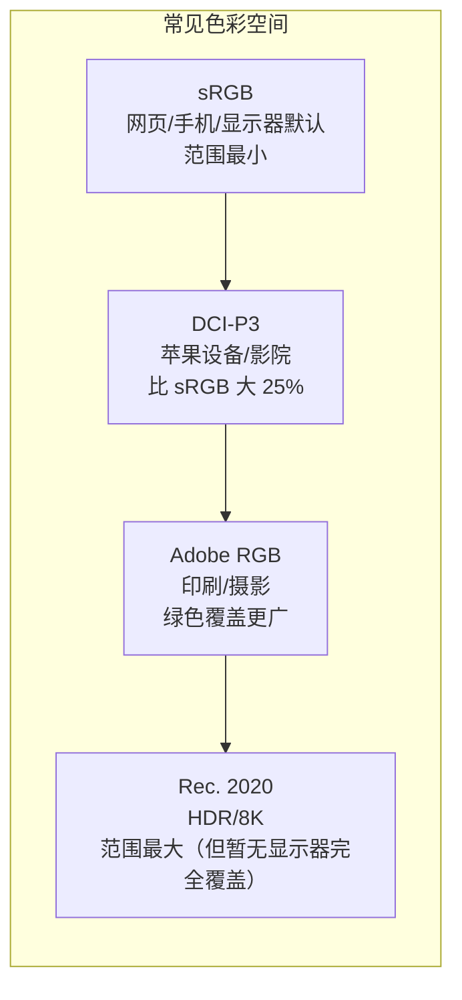

# $\rm Chapter \, 36$ 图像、图形与显示基础

> 你用手机拍了张照片，传到电脑上变成了一个 `.jpg` 文件。你在游戏里把"分辨率"调到 4K，画面细腻了但帧率暴降。你买显示器时纠结"1080p 还是 4K？""$60 \, \text{Hz}$ 还是 $144 \, \text{Hz}$？""sRGB 还是 DCI-P3？"——这些词天天出现在商品页面和设置菜单里，但它们到底意味着什么？这一章从零拆解数字图像和显示技术。

## $\rm \S \, 36.1$ 数字图像的本质：像素网格

### $\rm \S \, 36.1.1$ 分辨率：图像的"棋盘"有多大

把一张数字图像想象成一个巨大的棋盘——每个格子是一个**像素**（pixel = picture element）。像素存储的是**颜色**——通常三个数字（红、绿、蓝，RGB）。

一张"1920×1080"的图像，意味着宽度 1920 像素，高度 1080 像素，总共约 207 万像素。4K 是 3840×2160，约 830 万像素——是 1080p 的四倍（长宽各两倍，面积四倍）。

"分辨率"这个词被用在两个不同的上下文中，很容易混淆：
- **图像/视频的分辨率** = 总像素数（如 3840×2160）。
- **显示器的分辨率** = 物理像素数 + 每英寸像素密度（PPI, Pixels Per Inch）。

一个 6 寸手机屏幕的 1080p 和一个 27 寸显示器的 1080p 都是 1920×1080 像素，但手机的 PPI 远高于显示器（像素更密集→画面更细腻）。

### $\rm \S \, 36.1.2$ 颜色深度：每个像素用多少比特存储

**8-bit 颜色** = R、G、B 每个通道用 8 位（0-255 = 256 种强度）。总共有 256³ ≈ 1677 万种颜色。

**10-bit 颜色**（HDR 显示器）= 每个通道 10 位（0-1023）。色彩过渡更平滑，减少"色带"（天空渐变出现肉眼可见的条纹）。

**32-bit 颜色**通常指 8-bit × 4 通道：RGBA——A 是 Alpha（不透明度），用于叠加和合成。

这就是[文本、编码、压缩包与常见数据格式](../02-终端与工具/05-文本编码压缩包与数据格式.md)中"字节序列的解读方式决定含义"的延伸：同样一串字节，解读为 RGB vs BGR vs RGBA vs YUV，呈现的颜色完全不同。

### $\rm \S \, 36.1.3$ 色彩空间：同样的数字，不同的颜色

你对数字 255 的解读取决于当前使用的**色彩空间**（color space）——它定义了"数字到实际颜色的映射规则"。



**sRGB** 是最小公分母——几乎每台设备都支持。网页上 `#FF0000` 用 sRGB 解释为"标准红色"。**DCI-P3** 是苹果设备的默认色彩空间——同样一张照片在 iPhone 上比在普通显示器上更鲜艳，不是因为屏幕更好，而是因为 P3 的色域更大。**Display P3** 是苹果对 DCI-P3 的 sRGB 兼容变种。

当你在 Photoshop 或 Lightroom 中看到一条颜色不对的照片，最常见的原因：图片内嵌的色彩空间和你显示器/软件的默认色彩空间不一致——软件以为这串数字应该用 sRGB 解释，但图片实际是用 Adobe RGB 保存的。

## $\rm \S \, 36.2$ 图像格式：RAW、JPEG、PNG、GIF、WebP、AVIF

### $\rm \S \, 36.2.1$ RAW vs JPEG：摄影的第一道选择题

当你按下数码相机的快门，传感器采集到的原始数据叫 **RAW**（原始、未处理）。它不是一张"照片"——是一个包含每个像素光强度读数的数据文件（通常 12-14 位深），还没有经过白平衡、降噪、锐化、色调映射等处理。

- **RAW**：$40\sim100 \, \text{MB}$/张。保留最多信息，后期调整的余地大（曝光 ±2 档可以拉回来）。但必须用专门软件处理。
- **JPEG**：$2\sim10 \, \text{MB}$/张。相机内置处理器自动把 RAW 数据转换为 JPEG（扔掉大量"人眼注意不到"的信息）。即拍即用，但后期调整余地小。

### $\rm \S \, 36.2.2$ JPEG：有损压缩的原理（大致）

JPEG 不是魔法——它利用人眼的两个弱点：

1. **人眼对亮度变化比对颜色变化更敏感**——JPEG 把颜色信息降采样（YUV 4:2:0），亮度保留全分辨率，颜色分辨率减半。
2. **人眼注意不到高频细节的小变化**——JPEG 把图像切成 8×8 小块，对每个块做 DCT（离散余弦变换），然后扔掉高频分量中"接近零"的数据。质量参数（0-100）控制"多接近零才算零"——质量越低，扔得越多，文件越小但块状伪影越多。

重复保存 JPEG 会累积压缩伪影——每保存一次就再扔一次数据。如果你在编辑图片，中间产物用 PNG 或 TIFF（无损），只在最终输出时用 JPEG。

### $\rm \S \, 36.2.3$ PNG：无损、支持透明

PNG 使用 DEFLATE 压缩（和 ZIP 相同算法，回顾[文本、编码、压缩包与常见数据格式](../02-终端与工具/05-文本编码压缩包与数据格式.md)中的"打包 + 压缩"）。无损意味着解压后每个像素和原始一模一样。

PNG 适合：文字截图、Logo、UI 元素——需要清晰边缘和透明背景的场景。不适合照片（文件会比 JPEG 大 5-10 倍）。

### $\rm \S \, 36.2.4$ 现代格式：WebP、AVIF、HEIC

| 格式 | 压缩率（相比 JPEG） | 特点 |
|---|---|---|
| **WebP** | 好 25-35% | Google 出品，支持有损/无损/动画/透明。几乎所有现代浏览器支持 |
| **AVIF** | 好 50% | 基于 AV1 视频编码器。HDR、广色域支持。Safari/Firefox/Chrome 均支持 |
| **HEIC/HEIF** | 好 50% | Apple 默认照片格式（基于 HEVC/H.265）。Windows 需付费解码器 |

### $\rm \S \, 36.2.5$ GIF：该淘汰但还没淘汰的动画格式

GIF 只有 256 种颜色（8-bit 调色板）。照片变成 GIF 会产生灾难性的色彩失真。它"还活着"的唯一原因是广泛的动图支持和 meme 文化。对于现代动画需求，APNG（动画 PNG）和 WebP 动画提供了更好的质量和更小的文件。

---

## $\rm \S \, 36.3$ 显示设备：从像素到你的眼睛

### $\rm \S \, 36.3.1$ 刷新率与帧率

- **刷新率**（refresh rate，单位 Hz）：显示器每秒钟重绘屏幕的次数。$60 \, \text{Hz}$ = 每秒 60 次，$144 \, \text{Hz}$ = 每秒 144 次。
- **帧率**（frame rate，单位 fps）：GPU 每秒钟渲染出新画面的次数。

两者独立：GPU 以 200fps 渲染游戏画面，但显示器 $60 \, \text{Hz}$ 意味着你实际上每分钟只能看到 60 帧——多余的帧白白消耗了 GPU 功耗。反过来，GPU 以 40fps 渲染，$144 \, \text{Hz}$ 显示器也救不了——显示器反复显示同一帧直到 GPU 输出新帧。

**G-Sync (NVIDIA) / FreeSync (AMD)** 让显示器动态匹配 GPU 的帧率——GPU 每输出一帧，显示器立即刷新。40fps 时显示器跑 $40 \, \text{Hz}$，144fps 时跑 $144 \, \text{Hz}$。这样消除了画面撕裂和 VSync 的延迟。

### $\rm \S \, 36.3.2$ 响应时间与拖影

液晶（LCD）像素从一种颜色切换到另一种颜色需要时间——**响应时间**（通常指灰阶到灰阶，GTG）。响应时间 > 显示一帧的时间（$60 \, \text{Hz}$ 的一帧是 16.7ms）会产生**拖影**——快速移动的物体后面拖出一条模糊的尾巴。

OLED 的响应时间远快于 LCD（< 1ms vs 3-10ms），所以 OLED 显示器的动态清晰度通常更好——即使同样的刷新率。

### $\rm \S \, 36.3.3$ HDR：不只是"更亮"

在[GPU、显卡与AI计算](35-GPU-CUDA与AI计算.md)中你见过显示器接口（HDMI/DisplayPort）。日常场景有巨大的亮度跨度——阳光直射 100,000 nits，而普通 SDR 显示器只能显示 0-300 nits。**HDR**（High Dynamic Range，高动态范围）扩展了这个范围：

| 规格 | 峰值亮度 | 色域 | 色深 |
|---|---|---|---|
| **SDR** (sRGB) | ~300 nits | sRGB | 8-bit |
| **HDR400** | 400 nits | sRGB | 8-bit（伪 HDR——很多显示器标 HDR400 但体验无实质提升） |
| **HDR600** | 600 nits | DCI-P3（部分） | 10-bit |
| **HDR1000+** | 1000+ nits | DCI-P3 全覆盖 | 10-bit |

HDR 需要整个链条支持：内容（HDR 视频/游戏）→ GPU（HDR 输出）→ 连接线（HDMI 2.0+ 或 DP 1.4+）→ 显示器（HDR 认证）。任何一环不支持就退化为 SDR。

---

## $\rm \S \, 36.4$ 视频编码：为什么一部电影可以才 $2 \, \text{GB}$

### $\rm \S \, 36.4.1$ 基础思想：不存每一帧，只存变化的部分

一个 1080p 视频每秒 60 帧，每帧 1920×1080×3 字节 ≈ $6 \, \text{MB}$。60 帧/秒 × $6 \, \text{MB}$ = 360MB/秒。一部 2 小时的电影需要 $360 \, \text{MB}$ × 7200 秒 ≈ $2.5 \, \text{TB}$——不现实。

视频编码解决这个问题的三个核心策略：

1. **帧内压缩**：每一帧内部用类似 JPEG 的算法压缩。
2. **帧间压缩**：相邻两帧之间 99% 的像素完全相同（背景不变）。只存**变化的像素**（运动矢量）。
3. **关键帧**：每隔一定帧数存一个完整帧（I 帧），中间只存差异帧（P 帧、B 帧）。拖动进度条时解码器跳到最近的 I 帧开始解码。

### $\rm \S \, 36.4.2$ 主流编解码器

| 编解码器 | 年代 | 压缩率（相比无损） | 典型用途 |
|---|---|---|---|
| **H.264 / AVC** | 2004 | 好 100-200x | 蓝光、YouTube、监控 |
| **H.265 / HEVC** | 2013 | H.264 的 2x | 4K 流媒体、iPhone 视频 |
| **AV1** | 2018 | HEVC 的 1.3x | YouTube、Netflix 新内容 |
| **H.266 / VVC** | 2020 | HEVC 的 1.5x | 8K、VR |

HEVC 的专利许可费异常复杂（三个不同的专利池收费）——这是 AV1 出现的主要原因：**免专利费**，由 Google/Mozilla/Cisco/Amazon/Netflix 等组成的开放媒体联盟（AOMedia）推动。

### $\rm \S \, 36.4.3$ 编码与解码

- **编码**：把原始视频压缩为 `.mp4`/`.mkv` 文件。CPU 软件编码最慢但质量最高（x264/x265）；GPU 硬件编码（NVENC/AMF/QuickSync）快 10-20 倍但同等码率下质量略低——适合直播和实时录制。
- **解码**：播放视频时把压缩数据还原为像素。几乎所有现代设备都有硬件解码器（不需要 CPU 参与）——这就是为什么你的手机能流畅播放 4K 视频。

---

## $\rm \S \, 36.5$ 动手实践

### 实践一：用 `ffprobe` 查看图像/视频的元数据

```bash
# 安装 ffmpeg（包含 ffprobe）
# Ubuntu: sudo apt install ffmpeg
# macOS: brew install ffmpeg
# Windows: winget install Gyan.FFmpeg

# 查看图片信息
ffprobe photo.jpg

# 查看视频信息
ffprobe video.mp4
# 关注：编码格式、分辨率、帧率、码率、色彩空间
```

### 实践二：比较 JPEG 质量

用 GIMP/Photoshop 或命令行 ImageMagick 保存同一张图片为不同 JPEG 质量的版本：

```bash
# 安装 ImageMagick
# Ubuntu: sudo apt install imagemagick
# macOS: brew install imagemagick

convert original.png -quality 95 high.jpg
convert original.png -quality 50 medium.jpg
convert original.png -quality 10 low.jpg

ls -lh *.jpg    # 对比文件大小
# 肉眼对比三张图片——质量 10 的块状伪影可见
```

### 实践三：检查显示器的刷新率

- Windows：设置 → 系统 → 屏幕 → 高级显示 → 选择刷新率
- macOS：系统设置 → 显示器 → 刷新率
- 确认你的显示器跑在多少 Hz。很多 $144 \, \text{Hz}$ 显示器默认跑 $60 \, \text{Hz}$——没改过设置的话你一直在用 $60 \, \text{Hz}$。

---

## $\rm \S \, 36.6$ 总结

- 数字图像 = 像素网格 + 色彩空间 + 压缩算法。分辨率是总像素数，PPI 是密度，两者描述不同概念。
- sRGB 是显示器的"最小公分母"。DCI-P3 更广，HDR 需要 10-bit + 高亮度。
- JPEG 靠扔高频细节压缩；PNG 无损用 DEFLATE；WebP/AVIF/HEIC 是现代替代。
- 刷新率 ≠ 帧率。G-Sync/FreeSync 让显示器匹配 GPU 节奏。
- 视频编码靠帧间压缩。H.264 普及了 HD 视频，HEVC 支撑 4K，AV1 免专利费。
- `ffprobe` 和 ImageMagick 是命令行处理图像视频的利器——不需要打开 GUI 也能读取和转换。

---

## $\rm \S \, 36.7$ 关键概念回顾

1. 1920×1080 是几百万像素？4K 是 1080p 的几倍？
> 约 207 万像素；4K（3840×2160）约 830 万像素，长宽各是 1080p 的 2 倍，总面积是 4 倍。

2. sRGB 和 DCI-P3 有什么区别？为什么同一张照片在 iPhone 上更鲜艳？
> 它们是不同的色彩空间（数字到颜色的映射规则），P3 色域比 sRGB 大约 25%；iPhone 默认用 P3 解释颜色，同样的数字映射出更大的颜色范围，所以更鲜艳。

3. JPEG 的压缩利用了人眼的哪两个特性，从而大幅减小文件？
> 人眼对亮度变化比对颜色变化更敏感（颜色可降采样）；人眼注意不到高频细节的小变化（可扔掉接近零的高频分量）。

4. 为什么 PNG 不适合照片（文件大），但适合 Logo 和截图？
> PNG 是无损压缩：照片细节多、压缩率低，文件比 JPEG 大 5-10 倍；Logo/截图是平坦色块和清晰边缘，无损保真、支持透明，文件也不大。

5. 视频编码中 I 帧、P 帧、B 帧分别是什么？拖动进度条时解码器做了什么？
> I 帧是完整帧，P 帧只存与前一帧的差异（运动矢量），B 帧是双向参考的差异帧；拖动进度条时解码器跳到最近的 I 帧开始解码。

## $\rm \S \, 36.8$ 应用与辨析

6. G-Sync/FreeSync 解决什么问题？和 VSync 有什么不同？
> 让显示器刷新率动态匹配 GPU 帧率，既消除画面撕裂又没有额外延迟；VSync 是固定刷新率下的强制同步，帧率低于刷新率时会卡顿和延迟。

7. H.264、HEVC 和 AV1 的核心区别是什么？
> 压缩率一代比一代高（HEVC 约为 H.264 的 2 倍，AV1 再高约 1.3 倍）；AV1 的关键不同是免专利费，由 Google/Mozilla/Netflix 等组成的开放媒体联盟推动。

---

从这里开始，你对计算机的理解从"能写代码的机器"扩展到"能处理视觉和媒体的完整系统"——你知道了颜色怎样用数字表示、图片怎样压缩、显示器怎样把像素变成画面。视觉之后是听觉：声音怎样被采样成数字、WAV 和 MP3 差在哪、AI 怎样听懂和说出人类语言？下一章拆解音频处理与语音 AI。
