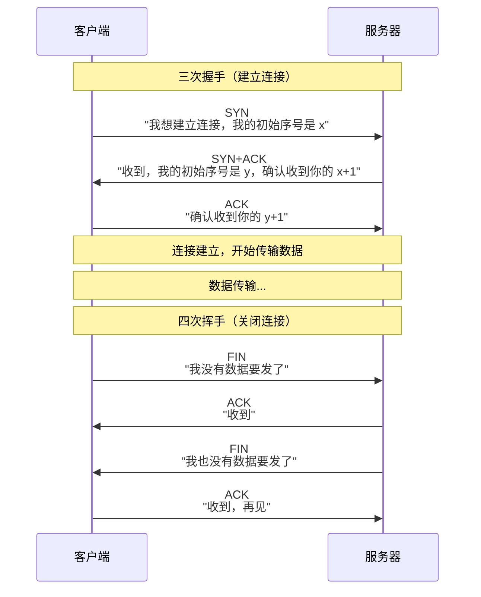
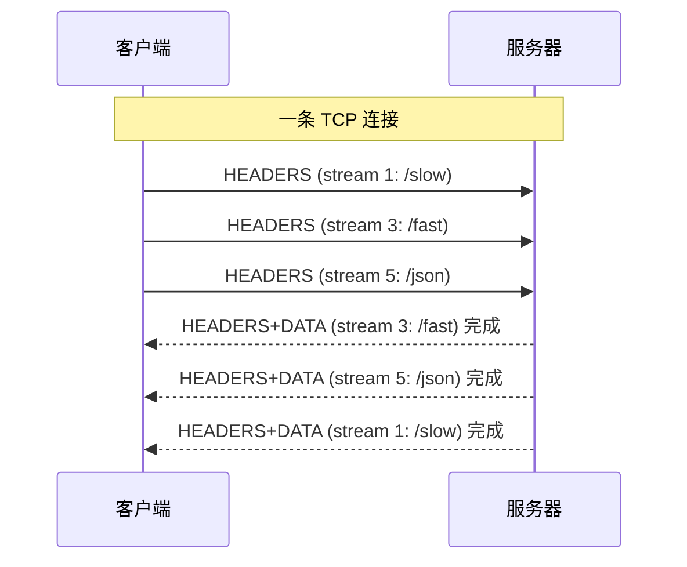
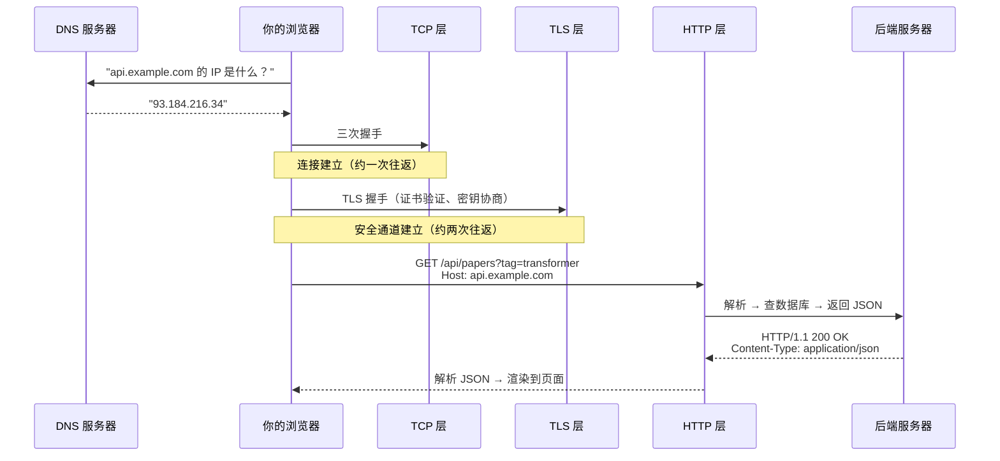

# $\rm Chapter \, 23$ 网络基础到 HTTP

> 你在浏览器地址栏输入 `github.com`，按下回车，不到一秒后一个完整的页面出现在眼前。这期间你的计算机会发出多个网络请求，经过路由器、交换机、DNS 服务器和反向代理，最终从 GitHub 的服务器取回 HTML、CSS、JavaScript 和图片。这个过程涉及 IP 地址、端口、TCP 连接、TLS 握手和 HTTP 协议——这一章逐个拆开 IP、端口、TCP 与 HTTP，TLS 握手则留到下一章。后半部分再往里走一层：HTTP/1.1 之后协议版本变了什么、服务端怎样主动把消息推给浏览器、浏览器在跨域和 Cookie 上加的两条安全边界，以及局域网里 CIDR、DHCP、ARP、MTU 这些基础件——它们是排查“本机连不上”和后面 Docker 端口映射失败的共同背景。

> **开始前自检**：本章假设你已经会：
>
> - □ 理解客户端-服务器与服务、端口（第 1 章 §1.5）
> - □ 会在终端运行命令（第 2 章 §2.4）
> - □ 用过浏览器访问网页（第 5 章 §5.11 浏览器开发者工具）

## $\rm \S \, 23.1$ 网络是怎样把两台机器连起来的

### $\rm \S \, 23.1.1$ IP 地址：网络世界的门牌号

在[文件系统与权限](../02-终端与工具/03-文件系统路径与权限.md)中你学到了“绝对路径从根出发找到文件”。在网络中，**IP 地址**扮演了类似的角色——它标识网络中的一台主机。

IPv4 地址是 32 位整数，通常写成四个 0-255 的数字：

```text
192.168.1.100     ← 你家局域网中某台设备
142.250.80.46     ← google.com 的一个 IP
127.0.0.1         ← 永远指向"本机"（loopback）
```

在[操作系统、进程与线程](../03-计算机系统/11-操作系统进程与线程.md)中你学到了端口——IP 地址告诉数据包“寄到哪栋楼”，端口告诉“楼里哪个房间（哪个进程）”。一个完整的目的地是 `IP:端口`，例如 `127.0.0.1:8000`。

IPv6（128 位）正在逐步替代 IPv4，地址写成八组十六进制数字。日常开发中绝大多数场景你接触的还是 IPv4，但知道 IPv6 的存在可以避免在见到 `::1`（IPv6 的 loopback）时困惑。

### $\rm \S \, 23.1.2$ 从你的机器到目标机器：一跳一跳地走

数据不是从你的电脑“直达” GitHub 服务器的。它经过若干个中间路由器：


每一跳根据**路由表**决定“下一步发给谁”。你可以用 `traceroute`（Linux/macOS）或 `tracert`（Windows）亲自查看：

```bash
traceroute github.com    # Linux/macOS
```

```powershell
tracert github.com       # Windows
```

输出每一行是一跳，包含中间路由器的 IP 和往返延迟。看到 `* * *` 表示那台路由器不响应探测包（但不一定表示网络断了——有些路由器配置为忽略 traceroute 请求）。

> **竞赛生迁移提示**：路由本质上是图上的最短路径问题。但你学过的 Dijkstra 和 Bellman-Ford 只描述了“最优路径怎么算”——在实际网络中，路由协议（OSPF、BGP）还要处理节点动态加入/离开、链路故障、策略路由和商业关系。算法是基础，工程是另一层。

### $\rm \S \, 23.1.3$ NAT：为什么你家所有设备共用一个公网 IP

你的笔记本电脑 IP 可能是 `192.168.1.100`。这不是公网 IP——它是**私有地址**，只在你的家庭局域网内有效。全球成千上万台设备都可以有 `192.168.1.100`，因为它们在不同的局域网里。

当你访问 `github.com` 时，路由器做了一件事：**NAT**（Network Address Translation，网络地址转换）。它把你的私有 IP+端口替换为路由器的公网 IP+一个新端口，记录映射关系，等响应回来时再反向替换。对 GitHub 服务器来说，请求来自你家路由器的公网 IP——它不需要、也不知道你内网的 IP。

NAT 是在 IPv4 地址不够用的情况下让几十亿设备共享有限公网地址的核心方案。IPv6 普及后 NAT 就不再是必需品，但在过渡期你仍然需要理解它。

---

## $\rm \S \, 23.2$ TCP：可靠的“数据管道”

### $\rm \S \, 23.2.1$ TCP 保证什么

在 IP 之上，**TCP**（Transmission Control Protocol，传输控制协议）提供了可靠的字节流传输：

- **有序**：数据按发送顺序到达。
- **无丢失**：丢失的包会被自动重传。
- **无重复**：重复的包会被自动丢弃。
- **流量控制**：接收方可以告诉发送方“慢点，我处理不过来了”。

这就像你在 OJ 上提交代码时，你不需要关心评测机收到的字节序列是否完整、是否乱序——TCP 已经帮你保证了。如果你自己用 UDP（无连接、不保证送达）实现一个文件传输，就要处理丢包重传、乱序重组和拥塞控制——这正是 TCP 替你做的。

### $\rm \S \, 23.2.2$ 三次握手与四次挥手

TCP 连接建立需要**三次握手**：



记住“三次握手”不只是应付面试——当你遇到 `Connection refused`（服务器端口没开，SYN 被 RST 拒绝）和 `Connection timed out`（SYN 发出后没有收到任何回复——大概率是防火墙丢弃了包）时，你能判断问题出在握手的哪一步。

### $\rm \S \, 23.2.3$ UDP：不保证送达，但很快

**UDP**（User Datagram Protocol）是 TCP 的“轻量级替代”。它不建立连接、不保证送达、不保证顺序——应用层发一个数据报，UDP 尽力而为地送到目的地。

为什么还用 UDP？有些场景下**时效性 > 可靠性**。视频通话丢一个包不影响整体体验；DNS 查询通常是一个请求一个响应的短交互，用 TCP 的三次握手建立连接再发请求得不偿失；游戏中的位置更新如果因为丢失重传导致延迟，位置数据反而不准了。

日常开发中你写的大多数程序（HTTP API、数据库查询、文件传输）基于 TCP。UDP 更常见于基础设施层和实时应用。

### $\rm \S \, 23.2.4$ TCP 三次握手：为什么建立连接要三个步骤

```text
客户端                       服务器
  |                            |
  |── SYN (seq=x) ──────────→ |  ① "我想和你通信，我的起始序号是 x"
  |                            |
  |← SYN-ACK (seq=y, ack=x+1) |  ② "收到，我的起始序号是 y，等你确认"
  |                            |
  |── ACK (ack=y+1) ────────→ |  ③ "收到，连接建立完毕"
  |                            |
  |═══ 连接建立，开始传输数据 ══|
```

为什么是三次而不是两次？因为网络可能延迟和重传旧的 SYN 包。如果只用两次握手，服务器收到一个延迟的旧 SYN 就建立连接并分配资源——而客户端早已放弃。三次握手让客户端有机会说“不，这不是我需要的连接”。

### $\rm \S \, 23.2.5$ TIME_WAIT：为什么端口不能立刻复用

TCP 关闭连接后有 **TIME_WAIT** 状态（时长由操作系统决定，Linux 上默认约为 $2 \times \text{MSL} \approx 60$ 秒）。你重启服务器时可能遇到过 `Address already in use`——就是这个原因。旧连接的残留数据包可能还在网络中漂，TIME_WAIT 确保这些残留包过期后才允许同一端口被新连接复用。

### $\rm \S \, 23.2.6$ HTTP keep-alive：不用每次都三次握手

HTTP/1.0 中，每个请求都要新建一个 TCP 连接——请求 HTML → 关闭 → 新建连接请求 CSS → 关闭 → 新建连接请求 JS。**HTTP keep-alive**（HTTP/1.1 默认开启）让一个 TCP 连接可以承载多个 HTTP 请求，省掉反复握手的开销。

### $\rm \S \, 23.2.7$ tcpdump 最小实践：不是“抓包黑客工具”

`tcpdump`（或 Wireshark）让你看到网络上实际传输了什么——对于调试“API 调不通到底是请求没发出去还是响应没返回来”是终极武器（`tcpdump` 在 Linux/WSL 中可用，`-i any` 是 Linux 的写法；Windows 原生环境用 Wireshark 图形界面抓包）：

```bash
sudo tcpdump -i any port 5000 -A
# -i any: 任意网卡
# port 5000: 只看 5000 端口的流量
# -A: 以 ASCII 显示包内容（可以直接看到 HTTP 请求和响应文本）

# 输出示例：
# 10:30:01.123456 IP localhost.54321 > localhost.5000: Flags [P.], seq 1:85
# GET /api/papers HTTP/1.1
# Host: localhost:5000
# ...
```

如果你能看到 `GET` 请求发出但没收到响应——后端挂了或端口错了。如果所有请求都正常收发——问题不在网络上。

---

## $\rm \S \, 23.3$ HTTP：Web 的通用语言

### $\rm \S \, 23.3.1$ 请求-响应模型

HTTP（HyperText Transfer Protocol）是最广泛使用的应用层协议。它运行在 TCP 之上，遵循严格的**请求-响应**模式：客户端发送一个请求，服务器返回一个响应。

HTTP 请求的结构：

```text
GET /papers?tag=transformer HTTP/1.1        ← 方法 路径?参数 协议版本
Host: api.example.com                       ← 头部（Headers）——键值对
Accept: application/json
User-Agent: paper-manager/1.0
Authorization: Bearer <access-token>       ← 真实 Token 只放在环境变量或密钥管理器中，不进文档
                                             ← 空行表示头部结束
                                             ← 请求体（Body）——GET 请求通常没有
```

HTTP 响应的结构：

```text
HTTP/1.1 200 OK                              ← 协议版本 状态码 状态描述
Content-Type: application/json              ← 响应头
Content-Length: 256
Date: Sat, 15 Mar 2026 10:30:00 GMT

{                                           ← 响应体
  "title": "Attention Is All You Need",
  "year": 2017
}
```

在[开发者命令行工具箱](../02-终端与工具/07-开发者命令行工具箱.md)中你用过 `curl` 直接查看原始 HTTP 流量。现在从协议角度重新审视 `curl` 的输出：每一行响应头、状态码、响应体，都对应上面结构的一部分。

### $\rm \S \, 23.3.2$ HTTP 方法：你想让服务器做什么

| 方法 | 语义 | 对资源的影响 | 请求体 |
|---|---|---|---|
| **GET** | 获取资源 | 不应有副作用（只读） | 通常无 |
| **POST** | 创建资源 | 有副作用 | 有（新建的数据） |
| **PUT** | 替换资源（完整更新） | 幂等（重复执行结果相同） | 有（完整新数据） |
| **PATCH** | 部分更新资源 | 可能不幂等 | 有（只含要改的字段） |
| **DELETE** | 删除资源 | 幂等 | 通常无 |
| **HEAD** | 同 GET 但不返回响应体 | 只读 | 无 |
| **OPTIONS** | 查询支持的方法 | 只读 | 无 |

**幂等**（idempotent）是 HTTP 中的重要概念：一个操作执行一次和执行多次，产生相同的副作用。`PUT` 是幂等的（重复上传同一个文件，结果还是那个文件），`POST` 不是（重复创建会生成多个资源）。

### $\rm \S \, 23.3.3$ 状态码：服务器一句话告诉你结果

| 范围 | 类别 | 你常遇到的 |
|---|---|---|
| **2xx** | 成功 | `200 OK`、`201 Created`、`204 No Content` |
| **3xx** | 重定向 | `301 Moved Permanently`、`302 Found`、`304 Not Modified` |
| **4xx** | 客户端错误 | `400 Bad Request`、`401 Unauthorized`、`403 Forbidden`、`404 Not Found`、`429 Too Many Requests` |
| **5xx** | 服务器错误 | `500 Internal Server Error`、`502 Bad Gateway`、`503 Service Unavailable` |

`401` vs `403` 是一个经典混淆点：`401` 表示“你没有提供认证凭据（或凭据无效）”，`403` 表示“你的身份已经确认，但这个资源不给你看”。

### $\rm \S \, 23.3.4$ 请求头和响应头：元数据的通道

头部携带的是**关于请求/响应的元信息**，而不是资源本身。常用的：

| 头部 | 方向 | 含义 |
|---|---|---|
| `Host` | 请求 | 我要访问哪个域名（同一 IP 可能托管多个网站） |
| `Content-Type` | 双向 | 请求体/响应体的格式：`application/json`、`text/html` |
| `Content-Length` | 双向 | 体的字节数 |
| `Authorization` | 请求 | 认证凭据：`Bearer <access-token>`（占位符，真实 Token 不进文件） |
| `Accept` | 请求 | 我想要什么格式的响应 |
| `User-Agent` | 请求 | 我是浏览器/curl/Python |
| `Set-Cookie` | 响应 | 请在你的浏览器中保存这个 Cookie |
| `Location` | 响应（3xx） | 重定向目标 URL |
| `Cache-Control` | 响应 | 这个资源可以缓存多久 |

---

## $\rm \S \, 23.4$ 在终端中操作 HTTP 的全部层次

你已经会了 `curl` 的基本 GET 请求。现在是完整版：

```bash
# 查看完整交互过程（-v = verbose，显示请求头和响应头）
curl -v https://api.github.com/repos/torvalds/linux

# 显示时间分解（DNS、TCP、TLS、首字节、总耗时）
curl -w '\nDNS: %{time_namelookup}s\nTCP: %{time_connect}s\nTLS: %{time_appconnect}s\nFirstByte: %{time_starttransfer}s\nTotal: %{time_total}s\n' \
  -o /dev/null -s https://api.github.com
# -o /dev/null 是 Unix 写法；Windows PowerShell 中改用 -o NUL（丢弃响应体）

# POST JSON
curl -X POST https://httpbin.org/post \
  -H "Content-Type: application/json" \
  -d '{"name": "paper-manager", "version": "1.0"}'

# 跟随重定向（-L）
curl -L http://github.com    # http → https 重定向

# 下载文件并显示进度条
curl -O -# https://example.com/large_dataset.tar.gz
```

### $\rm \S \, 23.4.1$ 不止 curl 的 HTTP 工具

| 工具 | 类型 | 用途 |
|---|---|---|
| **curl** | CLI | 命令行 HTTP 客户端，脚本和 CI 标配 |
| **httpie** (`http`) | CLI | 比 curl 更友好的输出（自动格式化 JSON、语法高亮），适合人类交互 |
| **Postman**（postman.com） | GUI | 请求集合管理、环境变量、团队协作 |
| **Insomnia**（insomnia.rest） | GUI | Postman 的开源替代，支持 GraphQL 和 gRPC |
| **Hoppscotch**（hoppscotch.io） | Web | 基于浏览器的 API 测试工具，无需安装 |
| **浏览器 F12 → Network** | 内置 | 观察网页实际发出的所有请求——排查“为什么页面加载了但没数据”时比 curl 更快 |
| **mitmproxy**（mitmproxy.org） | CLI/Web | 中间人代理，拦截和查看本机所有 HTTP/HTTPS 流量（调试第三方 SDK 的神器） |
| **wget** | CLI | 比 curl 更偏向下载场景：递归下载、断点续传、镜像网站 |

---

## $\rm \S \, 23.5$ HTTP/1.1 之后：HTTP/2 与 HTTP/3

前面所有示例的响应首行都是 `HTTP/1.1 200 OK`。这个 `1.1` 不是装饰——它决定了浏览器在一条连接上能同时做多少事，也决定了你在 DevTools 里看到的“连接数”和“排队时间”长什么样。

### $\rm \S \, 23.5.1$ 一条连接一次一个请求：队头阻塞

`keep-alive` 让一条 TCP 连接可以依次承载多个请求，但它仍然规定：**响应必须按请求的顺序返回**。第 2 个响应不能在第 1 个响应之前发出，即使它已经准备好了。

这本来问题不大，直到页面对同一个域名发起几十个请求。浏览器用一个变通办法缓解——对同一个域名同时开 6 条连接，多个请求分散到 6 条连接上并行。变通办法能缓解但不能消除问题：一条连接上仍排着队，而每个域名 6 条连接的上限是硬编码的。

自己在本地看到这个现象，只需一个串行处理请求的服务。下面的最小服务用裸 socket 实现：它对每条连接按字节流顺序读请求、同步处理、再读下一个请求——这正是 HTTP/1.1 连接的规定行为。把它存成 `raw_hol.py`：

```python
import socket, threading, time

RESP = {'/slow': b'{"endpoint":"slow"}', '/fast': b'{"endpoint":"fast"}'}

def handle(conn):
    """按 TCP 字节流顺序串行处理请求——HTTP/1.1 连接就是这样工作的。"""
    f = conn.makefile('rwb')
    try:
        while True:
            line = f.readline()
            if not line:
                break
            path = line.split()[1].decode()
            while f.readline() not in (b'\r\n', b'\n', b''):
                pass                       # 跳过头，简化演示
            if path == '/slow':
                time.sleep(3)              # 慢接口占用这条连接 3 秒
            body = RESP.get(path, b'{}')
            f.write(b'HTTP/1.1 200 OK\r\nContent-Type: application/json\r\n'
                    b'Content-Length: %d\r\n\r\n' % len(body) + body)
            f.flush()
    finally:
        conn.close()

srv = socket.socket(); srv.setsockopt(socket.SOL_SOCKET, socket.SO_REUSEADDR, 1)
srv.bind(('127.0.0.1', 5057)); srv.listen(8)
print('raw HTTP/1.1 server on 127.0.0.1:5057')
while True:
    conn, _ = srv.accept()
    threading.Thread(target=handle, args=(conn,), daemon=True).start()
```

在第一个终端运行 `python raw_hol.py`，在第二个终端运行下面的客户端——它把两个请求一次性写进**同一条** TCP 连接（这种写法叫**请求流水线**，pipelining）：

```python
import socket, time
s = socket.create_connection(('127.0.0.1', 5057), 5); s.settimeout(8)
s.sendall(b'GET /slow HTTP/1.1\r\nHost: x\r\n\r\nGET /fast HTTP/1.1\r\nHost: x\r\n\r\n')
t0 = time.time(); buf = b''; seen = 0
while time.time() - t0 < 5:
    try: c = s.recv(4096)
    except socket.timeout: break
    if not c: break
    buf += c
    while seen < buf.count(b'HTTP/1.1 200 OK'):
        seen += 1
        print(f'第 {seen} 个响应头到达 t={time.time()-t0:.2f}s')
print('两个响应体:', [b for b in buf.split(b'HTTP/1.1 200 OK') if b'endpoint' in b])
s.close()
```

实测输出：

```text
第 1 个响应头到达 t=3.00s
第 2 个响应头到达 t=3.00s
两个响应体: [b'\r\nContent-Type: application/json\r\nContent-Length: 19\r\n\r\n{"endpoint":"slow"}', b'\r\nContent-Type: application/json\r\nContent-Length: 19\r\n\r\n{"endpoint":"fast"}']
```

`/fast` 本身不等待任何东西（同一台机器上单独请求它只需要 0.02 秒），但它的响应头在第 3.00 秒才出现在连接上——和 `/slow` 同一时刻。它被前面那个慢请求堵住了，这就是**队头阻塞**（head-of-line blocking）。如果你把这两个请求分别发在两条连接上，`/fast` 会立即返回——浏览器的“每域名 6 条连接”限制本质上就是在用更多连接换并行度。

### $\rm \S \, 23.5.2$ HTTP/2：一条连接上并发多个流

HTTP/2 的核心变化是：**把一条 TCP 连接切成多个互相独立的流**（stream），每个流承载一个请求-响应，流之间可以交错传输。



交换流之间是交错的——`/fast` 不必等 `/slow` 跑完。这条连接也不再是“一次一个请求”，所以浏览器不需要为一个域名开 6 条连接（实际实现仍可能开多条，但原因变成了别的）。

随着这个变化一起落地的还有两处配套改动。**二进制分帧**（binary framing）：HTTP/2 不再发送以 `\r\n` 分隔的纯文本，而是发送二进制帧（帧头标明类型、流编号、长度）。纯文本对人和 `tcpdump` 友好，二进制对机器解析高效且无歧义——代价是你不能再靠肉眼看字节流读懂一个 HTTP/2 会话。**头部压缩**（HPACK）：请求头里有大量重复内容（Cookie、User-Agent 在每个请求里都出现），HTTP/2 用一份连接级字典，第二次出现的头部只发一个索引号。这解释了 §23.5.4 里一个可观察的差异：DevTools 显示的请求大小通常小于你能拼出的文本长度。

自己验证多路复用，需要一个会说 HTTP/2 的本地服务。安装 `hypercorn`（Python 的 ASGI 服务器，`pip install hypercorn`），把下面内容存成 `asgi_app.py`：

```python
async def app(scope, receive, send):
    if scope['type'] != 'http':
        return
    body = b'{"ok": true}'
    await send({'type': 'http.response.start', 'status': 200,
                'headers': [(b'content-type', b'application/json')]})
    await send({'type': 'http.response.body', 'body': body})
```

启动服务器（绑到 `8443`，QUIC 部分先关掉）：

```bash
python -m hypercorn asgi_app:app --bind 127.0.0.1:8443 --quic-bind none
```

它自己会打印 `Running on http://127.0.0.1:8443`。然后用一个直接操作 HTTP/2 帧的客户端（`pip install h2`）在**一条**连接上同时打开三个流：

```python
import socket, h2.connection, h2.config, h2.events
cfg = h2.config.H2Configuration(client_side=True, header_encoding='utf-8')
c = h2.connection.H2Connection(config=cfg)
s = socket.create_connection(('127.0.0.1', 8443), 5)
c.initiate_connection(); s.sendall(c.data_to_send())
ids = []
for _ in range(3):                        # 三个流一起打开，不等第一个完成
    sid = c.get_next_available_stream_id(); ids.append(sid)
    c.send_headers(sid, [(':method', 'GET'), (':scheme', 'http'),
                         (':authority', '127.0.0.1:8443'), (':path', '/')], end_stream=True)
s.sendall(c.data_to_send())
print('one TCP connection, concurrently open streams:', ids)
order = []; s.settimeout(5); closed = 0
while closed < 3:
    data = s.recv(65535)
    for ev in c.receive_data(data):
        if isinstance(ev, h2.events.ResponseReceived):
            order.append(('headers', ev.stream_id))
        if isinstance(ev, h2.events.DataReceived):
            c.acknowledge_received_data(ev.flow_controlled_length, ev.stream_id)
        if isinstance(ev, h2.events.StreamEnded):
            order.append(('end', ev.stream_id)); closed += 1
    s.sendall(c.data_to_send())
print('interleaved completion:', order)
s.close()
```

实测输出：

```text
one TCP connection, concurrently open streams: [1, 3, 5]
interleaved completion: [('headers', 1), ('headers', 3), ('headers', 5), ('end', 1), ('end', 3), ('end', 5)]
```

三个流编号 `1 3 5`（客户端发起的流用奇数）同时存在于一条连接上，响应按流交错返回。作为对比，§23.5.1 的 HTTP/1.1 连接上第二个请求必须等第一个结束。

### $\rm \S \, 23.5.3$ HTTP/3：把依赖换掉

HTTP/2 解决了 HTTP 这一层的排队问题，但它仍跑在一条 TCP 连接上，而 TCP 有它自己的顺序保证：字节流按序交付，一个包丢了，后面的包即使已经到达也必须在内核缓冲区里等着，直到丢失的那个重传回来。也就是说，HTTP/2 的多个流共享同一条 TCP 管道的顺序约束——一个包丢失会让所有流一起停顿。这就是**TCP 层队头阻塞**。

HTTP/3 的做法是换掉传输层：它跑在 **QUIC** 之上，而 QUIC 基于 **UDP**。UDP 本身不保证顺序，QUIC 在用户态实现了可靠性、拥塞控制和加密，并且把“流”这个概念做进了传输层——某个流的包丢了，只影响那一个流，其它流继续交付，TCP 层队头阻塞随之消失。QUIC 还把 TLS 握手合并进连接建立过程，减少一次往返。

代价也要看清：UDP 在很多企业网络和部分运营商链路上被限速或直接封禁，HTTP/3 因此普遍采用“先试后降级”的策略——第一次访问通常仍走 TCP 上的 HTTP/2，服务器通过响应头 `Alt-Svc: h3=":443"` 告诉客户端“下次可以试试 HTTP/3”，客户端下次才在新连接上试 QUIC，失败就退回。

### $\rm \S \, 23.5.4$ 观察你实际用到的版本

协议版本对使用者是透明的：`fetch`、`requests`、浏览器的地址栏都不需要知道版本。但它决定了调试工具的输出和你遇到的性能特征。

**浏览器 DevTools**：Network 面板打开后刷新页面，右键表头勾选 **Protocol** 列（Chrome/Edge），就能逐行看到 `h2`、`h3` 或 `http/1.1`；点进单个请求 → Headers，最上面一行是 `Request URL` 与状态码，Chrome 会把协议显示在 Headers 顶层。同一个页面里不同请求可能用不同协议——首次访问的文档请求常是 `h3` 或 `h2`，从 CDN 小站取资源可能是 `http/1.1`，取决于对方服务器是否支持。也可以打开 `chrome://net-export/` 抓一份网络日志，或用 `chrome://net-internals/#http2` 看当前连接。

**curl**：`curl --http2 -v https://example.com` 强制用 HTTP/2 发起（服务器不支持时会协商回落），`-v` 的输出里会有 `using HTTP/2` 和响应首行 `HTTP/2 200`。用 `-w '%{http_version}\n'` 可以只打印协商结果，方便脚本判断。这里有一个容易踩的坑：curl 是否支持 HTTP/2 取决于**编译时**链接的库，不是版本号。用 `curl --version` 看第一行的特性列表，没有 `HTTP2` 字样就说明这个 curl 不支持——此时 `--http2` 会直接报 `option --http2: the installed libcurl version does not support this`：

```bash
curl --version | head -1
# 输出的特性列表里必须有 HTTP2，否则下面这句会报“不支持”
curl --http2 -o /dev/null -w 'negotiated: HTTP/%{http_version}\n' https://example.com
```

服务器是否支持 HTTP/2 也可以用 `curl -I` 看响应头有没有 `Alt-Svc`，但更可靠的判据是 `-w '%{http_version}'` 的实际协商结果。

> **经验规则**：排查“为什么这个页面要 3 秒”时，先在 DevTools 的 Timing 里确认有没有长时间的 Queueing（排队等连接）或 Stalled。若你看到大量请求挤在 6 条连接上排队，而服务器支持 HTTP/2，升级协议往往比优化任何一行后端代码都有效。反过来，如果所有请求的排队时间都很短，协议版本不是你当前瓶颈，别在这里花时间。

---

## $\rm \S \, 23.6$ 服务端主动推送：轮询、SSE 与 WebSocket

到目前為止所有通信都是客户端发起、服务器响应。但有一类需求天然是反方向的——服务器上有了新数据，要立刻告诉已经打开的页面：论文解析完成、有人给你发了消息、后台任务进度从 30% 变成 60%。

HTTP 的请求-响应模型不允许服务器主动开口，于是得到答案的路线只有三条：客户端不停问、服务器用一种特殊的响应慢慢说、或者干脆换一个不是请求-响应的协议。

### $\rm \S \, 23.6.1$ 轮询：客户端不停问

最直接的办法是**轮询**（polling）：`setInterval` 每两秒发一次 `GET /api/jobs/42`，看 `status` 字段变了没有。

```javascript
setInterval(async () => {
  const r = await fetch('/api/jobs/42');
  const job = await r.json();
  if (job.status !== 'running') { clearInterval(timer); render(job); }
}, 2000);   // 每 2 秒问一次
```

它不需要任何服务端新东西，任何能返回 JSON 的后端都能配合，这是它唯一的优势。代价有两个，都随规模放大：**延迟**是轮询间隔的一半左右（平均等 1 秒才知道结果变了），把间隔改小就换成第二个代价——**请求数是用户数与频率的乘积**。1000 个在线用户每 2 秒问一次，就是每秒 500 个请求，其中绝大多数回答是“还没好”，纯属浪费。如果很多客户端同时启动（比如都在整点刷新），它们的轮询会同步拍在同一时刻，形成周期性尖峰。

### $\rm \S \, 23.6.2$ SSE：服务器用一个长响应慢慢说

**SSE**（Server-Sent Events，服务器发送事件）把“不停问”变成“问一次，服务器保持连接持续回答”。它在 HTTP 之上工作，响应是一个不会结束的 `text/event-stream` 流，服务器写一段、客户端收一段。

最小服务端（Flask，`pip install flask`）——把内容存成 `sse_app.py`：

```python
import time
from flask import Flask, Response

app = Flask(__name__)

@app.route('/events')
def events():
    def stream():
        for i in range(1, 4):
            yield f"id: {i}\nevent: tick\ndata: {{\"n\": {i}}}\n\n"
            time.sleep(0.5)
        yield "data: [done]\n\n"
    return Response(stream(), mimetype='text/event-stream',
                    headers={'Cache-Control': 'no-cache'})
```

启动 `python -m flask --app sse_app run --port 5050`，然后用 curl 读这个流（`-N` 关闭 curl 自己的输出缓冲，否则你会等到连接结束才看到内容）：

```bash
curl -N -i http://127.0.0.1:5050/events
```

实测输出：

```text
HTTP/1.1 200 OK
Cache-Control: no-cache
Content-Type: text/event-stream; charset=utf-8
Transfer-Encoding: chunked
Connection: close

id: 1
event: tick
data: {"n": 1}

id: 2
event: tick
data: {"n": 2}

id: 3
event: tick
data: {"n": 3}

data: [done]
```

注意 `Content-Type` 是 `text/event-stream`，`Transfer-Encoding: chunked` 表示响应体长度未知、边生成边发送。数据格式很简单：每条消息由若干 `字段: 值` 行组成，行之间用 `\n` 分隔，消息之间用空行分隔。`data:` 是内容，`event:` 是自定义事件名（不写就是默认的 `message`），`id:` 是这条消息的编号。`id` 不是摆设——浏览器会自动重连，重连时把最后收到的 `id` 通过请求头 `Last-Event-ID` 带上去，服务端据此决定从哪继续，这是 SSE 自带的断线续传。

浏览器这一侧只需要 `EventSource`：

```javascript
const es = new EventSource('/events');        // 立刻发起一个长连接请求
es.onopen = () => console.log('连接建立');      // readyState: 0 -> 1
es.addEventListener('tick', e => {            // 监听服务端自定义的 event: tick
  console.log('收到 tick:', JSON.parse(e.data));
});
es.onerror = () => console.log('连接出错，readyState =', es.readyState);
// 服务端正常结束流或网络断开后，浏览器会自动重连——默认约 3 秒后重试
// es.close();  // 主动关闭，关闭后不再重连
```

`EventSource` 的 `readyState` 有三个值：`0` 表示正在连接、`1` 表示已打开、`2` 表示已关闭。在 DevTools 的 Network 面板里，这条请求会一直挂在列表中，状态不是完成而是在持续接收（Chrome 会显示 EventStream 标签，逐条列出收到的事件）——这与普通请求“发出、完成、消失”的形态明显不同。

SSE 的边界很明确：**单向**，只能服务器发、客户端收。要双向就得另开一个普通 `POST` 通道，或者换 WebSocket。

### $\rm \S \, 23.6.3$ WebSocket：双向，但要走一次特殊握手

**WebSocket** 提供一条全双工连接——建立之后双方随时可以发消息，没有“请求-响应”的配对关系。它不从 HTTP 继承消息格式：建立之后传输的不是 HTTP 报文，而是 WebSocket 帧（一种轻量的二进制帧格式）。HTTP 在这里只负责一件事：**升级握手**。

浏览器发出的是一个带特殊请求头的普通 HTTP 请求：

```text
GET /ws HTTP/1.1
Host: 127.0.0.1:5055
Upgrade: websocket
Connection: Upgrade
Sec-WebSocket-Key: <每次随机生成的 base64 值>
Sec-WebSocket-Version: 13
```

服务器如果同意，返回一个**不是 200 的状态码** `101 Switching Protocols`，表示“这条连接不再按 HTTP 解释”。实测一次握手（服务端用 `hypercorn` 跑一个 WebSocket echo，见本节末尾的实践）：

```text
=== 服务器响应 ===
HTTP/1.1 101 
sec-websocket-accept: nWhcjoOVHGaUzJuW6BJKjdMdXao=
upgrade: WebSocket
connection: Upgrade
server: hypercorn-h11
=== 校验 ===
期望 Accept: nWhcjoOVHGaUzJuW6BJKjdMdXao=
=== 回显帧 === 810b6563686f3a2068656c6c6f -> 文本部分: echo: hello
```

`Sec-WebSocket-Accept` 是把客户端给的 `Sec-WebSocket-Key` 拼上一个固定 GUID 后取 SHA-1 再 base64 得到的。它不提供任何安全保证（值完全由请求头算出，谁都能算），作用是确认对端真的理解 WebSocket 协议、而不是一个把 Upgrade 头当普通头忽略掉的代理。这就是为什么握手会失败在代理上——中间设备不认识 `Upgrade` 就可能返回普通响应，客户端看到不是 101 就报错。回显帧的十六进制 `810b...` 里，`81` 是“文本帧 + 结束”，`0b` 是长度 11，后面是 `echo: hello`。

浏览器侧用 `WebSocket` 对象，注意它是**事件驱动**的，没有 `await` 的请求-响应配对：

```javascript
const ws = new WebSocket('ws://localhost:5055/ws');   // 注意是 ws:// 不是 http://
ws.onopen    = () => ws.send('hello');                // readyState: 0 -> 1，此刻才能发
ws.onmessage = e => console.log('服务器说:', e.data);   // readyState 保持 1
ws.onclose   = e => console.log('连接关闭，code =', e.code);  // readyState -> 3
ws.onerror   = () => console.log('出错，readyState =', ws.readyState);
```

`readyState` 的取值和 SSE 不同：`0` CONNECTING、`1` OPEN、`2` CLOSING、`3` CLOSED，且**不会自动重连**——断线重连要自己写（监听 `onclose` 后延时重建，并补拉一次可能错过的数据）。在 DevTools 的 Network 面板里，WebSocket 请求的状态显示为 `101`，点开后有一个 Messages 标签，可以逐条看到双向的所有帧，方向用颜色区分。加密连接用 `wss://`，对应 `https://`。

### $\rm \S \, 23.6.4$ 三条路线怎么选

| 需求 | 轮询 | SSE | WebSocket |
|---|---|---|---|
| 只有服务器→客户端，消息频率不高（进度、通知、日志流） | 可用但浪费 | **合适** | 能做但过重 |
| 只有服务器→客户端，且要自动重连、断线续传 | 要自己实现 | **内建**（`id` + `Last-Event-ID`） | 要自己实现 |
| 双向高频（聊天、协同编辑、实时游戏） | 不适用 | 单向，做不到 | **合适** |
| 需要二进制帧、自定义子协议 | 不适用 | 只能传文本 | 支持 |
| 想复用现有 HTTP 中间件（认证、代理、限流） | 天然复用 | 复用（就是一个 HTTP 响应） | 握手能复用，升级后中间件通常看不到了 |
| 服务器和客户端都最省事、能接受延迟 | **最省事** | 稍多 | 最复杂 |

判断顺序可以按这个来：消息是单向还是双向？单向优先 SSE，双向才用 WebSocket。如果连“实时”都不需要（比如一天更新一次的数据），普通请求-响应加重试就够，加长连接只会增加你要维护的故障模式。轮询不是“落后方案”，它有明确适用面：更新频率低、用户数少、又不想在服务端引入长连接的时候，它是代码量最小、最容易排查的选择。

> **竞赛生迁移提示**：长连接会把“无状态服务”变成“有状态服务”。每个打开的 SSE/WebSocket 连接都占用服务端一个 socket 和一份内存，负载均衡器后面还需要在客户端重连时把它粘到同一台后端（或用共享的 Redis 分发消息），否则消息会丢。这是它与普通 HTTP API 最重要的运维差异。

---

## $\rm \S \, 23.7$ 跨域与 Cookie：浏览器的两条安全边界

前几节讲的都是“数据怎么传”。这一节讲浏览器额外加在 HTTP 之上的限制——它们经常表现为“curl 能通，浏览器不行”，因为 curl 不受浏览器安全策略约束。

### $\rm \S \, 23.7.1$ 同源策略与 CORS 预检

浏览器对页面里的 JavaScript 有一条硬规则：**它只能读取“同源”的响应**。**源**（origin）由协议、主机、端口三者共同决定（`https://app.example.com:443` 与 `https://api.example.com` 不同源，端口不同也不同源）。同源的 `fetch` 随便发；跨源的请求**浏览器照样会发出去**，只是不让你的 JavaScript 读到响应——这一点很关键：它意味着请求已经到达服务器、可能已经产生了副作用，你却在浏览器里看到报错。

服务器想允许某个源读取，就在响应里加 **CORS**（Cross-Origin Resource Sharing，跨源资源共享）头。按请求是否“简单”，浏览器分成两条路径。

**简单请求**直接发出，浏览器事后检查响应头；只要响应里有 `Access-Control-Allow-Origin`（值是该源，或 `*`）就放行。要成为简单请求，方法必须是 `GET`/`HEAD`/`POST`，且不能带自定义头、`Content-Type` 只能是 `application/x-www-form-urlencoded`、`multipart/form-data`、`text/plain` 三种之一。

**非简单请求**（比如 `PUT`、带 `Authorization` 头、`Content-Type: application/json`）之前，浏览器先自动发一个 **预检请求**（preflight）：方法为 `OPTIONS`，带上 `Access-Control-Request-Method` 与 `Access-Control-Request-Headers` 说明“我接下来想这么发”，问服务器是否允许。服务器回一组 `Access-Control-Allow-*` 头，浏览器据此决定是否发出真实请求。

用下面这个最小服务端观察两条路径（存成 `cors_app.py`）：

```python
from flask import Flask, jsonify, request
app = Flask(__name__)

@app.route('/cors-echo', methods=['GET', 'OPTIONS'])
def echo():
    if request.method == 'OPTIONS':                        # 预检请求
        r = jsonify({}); r.status_code = 204
        r.headers['Access-Control-Allow-Origin'] = 'http://localhost:8080'
        r.headers['Access-Control-Allow-Methods'] = 'GET, POST'
        r.headers['Access-Control-Allow-Headers'] = 'Content-Type'
        r.headers['Access-Control-Max-Age'] = '600'
        return r
    r = jsonify({'ok': True})
    r.headers['Access-Control-Allow-Origin'] = 'http://localhost:8080'
    return r
```

启动 `python -m flask --app cors_app run --port 5050`，先模拟浏览器的预检：

```bash
curl -i -X OPTIONS http://127.0.0.1:5050/cors-echo \
  -H "Origin: http://localhost:8080" \
  -H "Access-Control-Request-Method: POST" \
  -H "Access-Control-Request-Headers: Content-Type"
```

实测输出（节选响应头）：

```text
HTTP/1.1 204 NO CONTENT
Access-Control-Allow-Origin: http://localhost:8080
Access-Control-Allow-Methods: GET, POST
Access-Control-Allow-Headers: Content-Type
Access-Control-Max-Age: 600
```

再模拟简单请求（不触发预检）：

```bash
curl -i http://127.0.0.1:5050/cors-echo -H "Origin: http://localhost:8080"
```

```text
HTTP/1.1 200 OK
Content-Type: application/json
Content-Length: 12
Access-Control-Allow-Origin: http://localhost:8080

{"ok":true}
```

逐项看这些头的语义。`Access-Control-Allow-Origin` 是唯一必需的，它的值必须**精确匹配**请求的 `Origin`（写 `http://localhost:8080` 而不是 `localhost:8080`），或者用 `*` 表示“谁都行”。`Access-Control-Allow-Methods` 只对预检有意义，列出允许的方法。`Access-Control-Allow-Headers` 列出允许的请求头——这是“带 `Authorization` 头被拒”的典型原因，服务器没在预检响应里列它。`Access-Control-Max-Age` 让浏览器缓存这次预检结果（单位秒），否则每个非简单请求前都会多一次 `OPTIONS` 往返。还有两个不是必须但常见的：`Access-Control-Allow-Credentials: true`（允许携带 Cookie，见下）和 `Access-Control-Expose-Headers`（默认只有少数几个响应头能被 JavaScript 读到，要读别的得显式暴露）。

有三个必须知道的边界。`*` 和 `credentials` 互斥：如果响应是 `Access-Control-Allow-Origin: *`，浏览器会拒绝携带 Cookie 的请求，这种组合下必须回显具体的 `Origin`。CORS 是**浏览器**的限制，不是服务端访问控制——用 curl 或服务端脚本请求同一个地址永远不受它影响，所以它绝不能当作权限手段（真正的权限是 §29.4 的认证与授权）。最后，预检失败看起来像“请求没发出去”，实际是真实请求根本没被发出，Network 面板里只能看到那条 `OPTIONS`——排查时先看它，而不是猜后端。

> **实践中最省事的绕开方式**：开发时让前端请求同源路径，由开发服务器代理到后端（第 29 章 §29.17.2 的 Vite `server.proxy` 就是这么做的）。同源就没有 CORS，联调阶段能少一整类问题。CORS 只在“前后端确实部署在不同源”时才必须配。

### $\rm \S \, 23.7.2$ Cookie 的五个属性

`Set-Cookie` 响应头（§23.3.4 的表里出现过）建立一个 Cookie：浏览器保存这个键值对，在之后符合条件的请求里通过 `Cookie` 请求头带回去。带不带、带去哪、JavaScript 能不能读，全部由响应头里附带的属性控制。

用这个最小服务端看服务端实际发出的属性：

```python
from flask import Flask, make_response, jsonify
app = Flask(__name__)

@app.route('/set')
def set_cookie():
    r = make_response(jsonify({'ok': True}))
    r.set_cookie('session_id', 'demo-value', httponly=True,
                 samesite='Lax', secure=True, max_age=3600)
    return r
```

`curl -i http://127.0.0.1:5051/set | grep -i set-cookie` 实测输出：

```text
Set-Cookie: session_id=demo-value; Expires=Mon, 14 Sep 2026 12:14:19 GMT; Max-Age=3600; Secure; HttpOnly; Path=/; SameSite=Lax
```

五个属性各自控制什么：

**`Domain`** 决定这个 Cookie 会被发给哪些主机。不写时默认是设置它的那台主机本身（不含子域）；写了 `.example.com`（前导点）则 `app.example.com` 和 `api.example.com` 都会带上它。范围定得越宽，泄漏面越大——一个子域被攻破，它的脚本读到的 Cookie 就能用在其它子域上。

**`Path`** 在同一台主机内继续收窄：只有请求路径以它开头时才发送。默认是设置它的那个路径。上面的输出是 `Path=/`，即整站都带。

**`Secure`** 表示这个 Cookie 只通过 HTTPS 发送。没有它，一个 HTTP 请求（例如用户敲了 `http://` 而不是 `https://`，或页面里有一张 HTTP 图片）也会明文带上 Cookie，同网络的攻击者就能抓走它。所以只要 Cookie 里有身份凭据，就应当配 `Secure`。

**`HttpOnly`** 表示 JavaScript 不能通过 `document.cookie` 读到它。这挡的是 XSS——页面被注入脚本后，脚本无法偷走会话 Cookie。它不影响浏览器自动携带 Cookie，所以服务端照常收到，用户也无感。

**`SameSite`** 控制**跨站**请求是否携带这个 Cookie，防的是 CSRF（跨站请求伪造）——攻击者从自己的站点构造一个指向你服务的表单或请求，浏览器若自动带上你的 Cookie，这个请求就以你的身份生效了。三个取值差别如下：

| 取值 | 效果 | 什么时候用 |
|---|---|---|
| `Strict` | 任何跨站请求都不带（包括从别的网站点链接跳过来） | 高敏感操作（转账确认页）；代价是用户从外部链接进来时会“看起来没登录” |
| `Lax` | 跨站的**顶层导航**（点链接、地址栏跳转）带，跨站的 `fetch`/`POST`/iframe 不带 | 大多数站点会话 Cookie 的常见默认值；挡住了最典型的 CSRF，又不太伤体验 |
| `None` | 跨站也带，完全不加限制 | 确实需要跨站携带（第三方嵌入、跨域 API）；**必须同时配 `Secure`**，否则浏览器直接拒收这个 Cookie |

`SameSite=None` 强制要求 `Secure`，原因是：既然允许它在跨站请求里自动发送，就必须保证这条链路是加密的，否则 Cookie 会在任何一次明文请求里暴露给中间人。这条规则由浏览器强制执行——漏配 `Secure` 的 `None` Cookie 会被静默丢弃，服务端看到的症状是“Set-Cookie 明明发了，下一个请求就是没有它”。

几个容易踩的坑：`Set-Cookie` 是响应头，不是请求头；一个响应可以有多个 `Set-Cookie` 头（各管一个 Cookie），而请求里的 `Cookie` 头把多个 Cookie 用 `; ` 拼成一行。另外，上面这些防御是相互配合而不是互相替代的——`HttpOnly` 挡 XSS、`SameSite` 挡 CSRF、`Secure` 挡明文传输，各自针对不同的攻击路径。应用安全深化的部分（[附录 H](../11-附录/附录H-应用安全深化.md)）会把它们放回完整的威胁模型里讲，这里只需记住每个属性在防哪一件事。

---

## $\rm \S \, 23.8$ 局域网的基础设施：CIDR、DHCP、ARP 与 MTU

§23.1.3 说 NAT 让家里所有设备共用一个公网 IP，但没说清“一个网段”到底是什么、地址是怎么来的。这四个概念是排查“局域网里连不通”时绕不开的东西——它们也直接解释后面 Docker 和部署章节里的现象。

### $\rm \S \, 23.8.1$ CIDR：`192.168.1.0/24` 是什么意思

IP 地址是 32 位整数，写成四段十进制只是为了好读。这 32 位被**斜杠后面的数字**切成两半：前 $N$ 位是**网络位**，剩下的位是**主机位**。`192.168.1.0/24` 表示前 24 位是网络位、后 8 位是主机位，同一个网络里最多有 $2^{8} = 256$ 个地址。这个写法叫 **CIDR**（Classless Inter-Domain Routing，无类别域间路由）。

需要注意这里通常有两个地址不能分给主机：全 0 的那个是网络地址（`192.168.1.0`），全 1 的那个是广播地址（`192.168.1.255`）。所以 `/24` 能分配给设备的通常是 254 个。斜杠数字越大，网络越小：`/16` 有 $2^{16} = 65536$ 个地址，`/25` 只有 128 个（可用 126 个）。

在 Windows 上 `ipconfig` 直接给出掩码，把它和地址对上就能看出网段；在 Linux/macOS 上用 `ip addr`（或较老的 `ifconfig`）：

```powershell
ipconfig          # Windows：看 IPv4 地址、子网掩码、默认网关
```

```bash
ip addr show       # Linux/macOS：看 inet 后面的地址与 /N 前缀
```

实际输出长这样（本机 WiFi 环境，已隐去无关行）：

```text
   IPv4 地址 . . . . . . . . . . . . : 183.173.152.149(首选) 
   子网掩码  . . . . . . . . . . . . : 255.255.248.0
   默认网关. . . . . . . . . . . . . : 183.173.152.1
   DHCP 服务器 . . . . . . . . . . . : 166.111.8.17
```

掩码 `255.255.248.0` 换算成 CIDR 就是 `/21`（前 21 位是 1），网络地址是 `183.173.152.0`，可用主机地址共 $2^{11} - 2 = 2046$ 个。

**默认网关**（default gateway）的作用是回答“目标不在我这个网段时发给谁”。主机判断目标 IP 与自己是否同网段：同网段就直接在本地链路上找它；不同网段就把包交给默认网关，由网关继续转发。路由表里那行 `0.0.0.0` 就是“前面几条更具体的规则都不匹配时用这条”，它的下一跳就是默认网关——可以用 `netstat -rn`（Windows）或 `ip route`（Linux/macOS）看到：

```text
网络目标        网络掩码          网关       接口   跃点数
          0.0.0.0          0.0.0.0    183.173.152.1  183.173.152.149     45
    183.173.152.0    255.255.248.0            在链路上   183.173.152.149    301
```

第一行是默认路由（走网关），第二行是本网段直连（`在链路上`，不经过网关）。把这两行和上面的 `183.173.152.0/21` 对上，就是“同网段直连、跨网段走网关”的完整证据。

### $\rm \S \, 23.8.2$ DHCP：地址不用手填

主机刚接入网络时并不知道自己该用哪个 IP（手填容易冲突，还要求人懂网段）。**DHCP**（Dynamic Host Configuration Protocol，动态主机配置协议）解决这件事：主机广播一句“有 DHCP 服务器吗，给我一套配置”，服务器回应一组地址、掩码、网关、DNS。

它的交互过程常被简写成四个字母：客户端的 **DISCOVER**（我不认识任何人，谁给我地址）、服务器的 **OFFER**（我这儿有个可用的）、客户端的 **REQUEST**（那我要这个）、服务器的 **ACK**（确认，地址归你了，租期 N 小时）。理解这段的意义不在于能背出来，而在于两个实际推论：**地址是租的**，租期到了要续租，设备太久不上线地址可能被收走分给别人——所以“IP 是设备的身份”这个念头不可靠（真要固定标识得靠 MAC，或干脆用代码里的域名/服务名）；**换网络就会换地址**，笔记本从家里拿到办公室，IP 完全不同，网关和 DNS 也跟着变。

上面 `ipconfig` 输出里的“获得租约的时间 / 租约过期的时间 / DHCP 服务器”三行就是 DHCP 的直接痕迹。Linux 上可以用 `ip addr` 看地址、`ip route` 看网关，想知道是哪台服务器给的，可以用 `journalctl -u NetworkManager` 之类的日志查看（各发行版工具不同，这点不必强求统一）。

### $\rm \S \, 23.8.3$ ARP：同网段通信要先知道 MAC

同一个网段内的机器要在**链路层**交换帧，而链路层用的地址是网卡的 **MAC 地址**，不是 IP。于是有了一个鸡生蛋的问题：我知道目标的 IP，但发帧需要目标的 MAC。

**ARP**（Address Resolution Protocol，地址解析协议）就是查这个映射的：主机在网段内广播“`183.173.152.1` 的 MAC 是谁？”，持有这个 IP 的机器单播回应自己的 MAC；结果被缓存起来（ARP 缓存），下次直接用。在 Windows 和 Linux 上用 `arp -a` 查看缓存：

```powershell
arp -a            # Windows：列出 IP 与 MAC 的对应关系
```

```bash
arp -a             # Linux/macOS 可能需要 ip neigh（较新系统 arp 已被 iproute2 取代）
```

本机实测输出（节选）：

```text
接口: 183.173.152.149 --- 0x9
  Internet 地址         物理地址              类型
  183.173.152.1         94-29-2f-37-88-02     动态        
  183.173.159.255       ff-ff-ff-ff-ff-ff     静态        
  224.0.0.2             01-00-5e-00-00-02     静态        
```

网关 `183.173.152.1` 已经有一条“动态”记录——因为刚才 ping 过它；广播地址和几个组播地址是链路层约定的固定 MAC（`ff-ff-ff-ff-ff-ff` 就是广播）。IPv6 里对应的机制叫**邻居发现**（Neighbor Discovery，ND），用 `ip -6 neigh` 查看，作用和 ARP 相同。

这条缓存解释了一个常见现象：换网关、改 IP 后短时间连不通。IP 与 MAC 的对应关系短期内还是旧值，包发给了错误的机器；等缓存过期或手动清掉就好了（Windows：`arp -d`，需要管理员权限；Linux：`sudo ip neigh flush all`）。它也是“自己 ping 得通、别人 ping 不通”这类局域网问题的排查点之一。

### $\rm \S \, 23.8.4$ MTU 与分片

链路层一帧能承载的数据有上限，这个上限叫 **MTU**（Maximum Transmission Unit，最大传输单元）。以太网常见值是 1500 字节，指的是 IP 报文长度上限（不含链路层帧头）。

上层的包如果大于 MTU 就要**分片**（fragmentation）：拆成多个小包分别发送，到目的地再重组。分片会带来麻烦——**任一片丢失，整个包都要重传**（TCP 无法只重传一个片），而且路径上每台设备的 MTU 可能不同。更麻烦的是中间设备可能需要分片却没有足够信息（下一条链路里还有隧道时尤其如此）。这是 VPN、隧道、云网络里“大文件上传卡住、小请求正常”这类怪现象的常见来源。

想知道一个路径的 MTU，就用“禁止分片”的方式发探测包，逐步加大直到失败。IP 头加 ICMP 头共 28 字节，所以探测值要加上 28 才是 MTU。

```powershell
ping -f -l 1472 183.173.152.1     # Windows：-f 禁止分片，-l 指定数据部分字节数
```

```bash
ping -M do -s 1472 183.173.152.1  # Linux：-M do 禁止分片，-s 指定数据部分字节数
```

实测结果（`1472 + 28 = 1500`，正好是以太网 MTU）：

```text
正在 Ping 183.173.152.1 具有 1472 字节的数据:
来自 183.173.152.1 的回复: 字节=1472 时间=87ms TTL=255
```

把值加到 1500，就会出现“需要分片但设置了禁止分片”的报错：

```text
正在 Ping 183.173.152.1 具有 1500 字节的数据:
需要拆分数据包但是设置 DF。
    数据包: 已发送 = 1，已接收 = 0，丢失 = 1 (100% 丢失)
```

实测的边界说明了什么：本机这条路径的 MTU 是 1500。若你把 1472 逐步加大、在更小的地方就失败（比如 1400 就报错），说明路径上某条链路 MTU 更小，它上层的隧道封装吃掉了空间。注意这是**探测**而非诊断终点——真要定位是路径上哪一跳，Linux 上可以用 `tracepath`（它会自动报告路径 MTU），Windows 上需要 `netsh interface ipv4 show subinterfaces` 看本机接口的 MTU。

> **一次排查用的最小清单**：局域网里 A 连不上 B，按这四层看——`ip addr` 确认两者是否在同一网段、掩码是否一致；`ip route` 或 `netstat -rn` 确认默认网关和本网段路由是否正常；`arp -a` / `ip neigh` 确认网关和目标的 MAC 是否解析出来了；`ping -M do -s 1472`（若跨 VPN/隧道）确认 MTU 是否被隧道吃掉。这些全都健康再往上查端口和防火墙（第 24 章 §24.4 的分层排障）。

---

## $\rm \S \, 23.9$ 服务监听在哪里：`0.0.0.0` 与 `127.0.0.1` 的区别

§23.1.1 说过 `127.0.0.1` 永远指向本机，那是从**客户端**角度看一个地址该发给谁。从**服务端**角度看，同一个写法回答的是另一个问题：这个服务接受哪些网卡上的连接。

一台机器有多块网卡（回环 `lo`、无线网卡、有线网卡，容器里还有虚拟网卡），每块网卡有自己的 IP。服务启动时指定的监听地址决定它接受哪些网卡上的连接：

- **`127.0.0.1:8000`**：只接受回环接口上的连接，也就是只有本机能连。别的机器、同一个 Docker 主机上的容器、甚至宿主机上一个不同的网络命名空间都连不上。
- **`0.0.0.0:8000`**：监听所有 IPv4 网卡，任何能路由到本机某个 IP 的连接都接受（`::` 是 IPv6 的对应写法）。

`0.0.0.0` 不是“本机地址”，它是**通配符**——表示“所有本机地址”。请求的目标地址仍然必须写成具体的某个 IP，`0.0.0.0` 永远不会出现在一个目标地址里。

在 Windows 上用 `netstat -ano`、Linux 上用 `ss -tlnp` 看监听状态，两种写法的差别一眼可见：

```bash
ss -tlnp | grep 8000          # Linux：-t TCP、-l 仅监听、-n 不做名称解析、-p 显示进程
netstat -ano | findstr 8000   # Windows：-a 全部、-n 数字形式、-o 显示 PID
```

同时启动两个服务（一个绑 `0.0.0.0:5063`，一个绑 `127.0.0.1:5064`）后实测：

```text
  TCP    0.0.0.0:5063           0.0.0.0:0              LISTENING       3732
  TCP    127.0.0.1:5064         0.0.0.0:0              LISTENING       37744
```

第一列 `Local Address` 就是监听地址。此时从本机访问 `http://127.0.0.1:5063/` 和 `http://127.0.0.1:5064/` **都返回 200**——回环地址落在 `0.0.0.0` 的监听范围内。但用本机的局域网 IP 访问时差别出现（实测）：

```text
# 连 0.0.0.0:5063（监听所有网卡）
code=200
# 连 127.0.0.1:5064（只监听回环）
curl: (7) Failed to connect to 183.173.152.149 port 5064 after 2041 ms: Could not connect to server
```

这就是 Docker 场景里那个经典坑的完整机制：容器内服务监听 `127.0.0.1:8000` 时，只有容器**内部**能连上它；宿主机的端口映射（`docker run -p 8000:8000`）把宿主机的连接转发到容器的网络接口上，而那些连接的目标地址是容器的非回环 IP，服务没在这些网卡上监听，于是连接被拒绝（或超时，取决于是什么在丢包）。`docker ps` 和 `-p` 参数看起来都正常，`docker logs` 里服务也明明启动了，但浏览器就是连不上。Docker 章节里“容器内服务监听 `0.0.0.0:8000` 需要端口映射”这句结论（[Docker 基础](../08-部署运维/30-Docker基础.md)）说的正是这件事——端口映射只负责转发，服务必须在对应的网卡上监听才接得住。

要确认一个正在运行的服务监听在哪，看 `ss`/`netstat` 的第一列就够了：出现 `0.0.0.0` 或 `::` 说明外部可达，出现 `127.0.0.1` 或 `::1` 说明只有本机可达。反过来说，开发机上出于安全考虑**应当**用 `127.0.0.1` 绑定——一个只打算自己用的数据库或调试服务监听 `0.0.0.0` 意味着同网络里的任何人都能尝试连接。

> **安全提示**：`0.0.0.0` 是“暴露给所有能路由到本机的网络”，不只是“让我的另一台设备连上”。在没有认证和防火墙的情况下把数据库、调试端口或管理接口绑到 `0.0.0.0` 是常见的信息泄漏来源。真正的暴露范围取决于防火墙和路由：本机上用 `0.0.0.0` 且没有防火墙规则时，同一局域网都可访问；公网服务器上则等于对全网开放。

---

## $\rm \S \, 23.10$ 一个请求的完整时间线



`curl -w` 可以单独测量每一段的耗时。当 API “慢”时，先确定是哪一段慢，再决定优化方向——加缓存（减少后端处理时间）、换 CDN（减少 RTT）还是优化 TLS 配置（启用 TLS 1.3 或会话复用，减少握手往返）。

---

## $\rm \S \, 23.11$ 动手实践

### $\rm \S \, 23.11.1$ 实践一：用 curl 解剖 HTTP 交互

```bash
curl -v https://httpbin.org/json          # 完整交互
curl -I https://httpbin.org/json          # 只看响应头
curl -X POST https://httpbin.org/post \
  -H "Content-Type: application/json" \
  -d '{"paper": "Attention Is All You Need", "year": 2017}'
curl -v -L http://github.com             # 跟随重定向
```

每次观察：状态码、响应头（特别是 `Content-Type`）、响应体格式。

> 前置：在任意可访问外网的目录中运行，不需要先建项目。成功标志：`-v` 输出里有 `> GET /json` 与 `< HTTP/1.1 200 OK`；POST 的响应体回显你发送的 JSON；`-L` 跟随重定向后最终为 `200 OK`。清理：命令不写本地文件，无需清理。

### $\rm \S \, 23.11.2$ 实践二：traceroute 看物理路径

```bash
traceroute github.com      # Linux/macOS
```

```powershell
tracert github.com         # Windows
```

观察：经过了多少跳？哪些跳延迟突然增大？

> 前置：Linux/macOS/WSL 用 `traceroute`，Windows 用 `tracert`。成功标志：输出若干“跳数 + 路由器 IP + 往返延迟”行；部分跳显示 `* * *` 表示该路由器不响应探测，属正常。清理：只读命令，无文件产生，无需清理。

### $\rm \S \, 23.11.3$ 实践三：浏览器 Network 面板

1. 打开 F12 → Network 标签页，刷新任意网页。
2. 点击第一个请求，查看 Headers → Request Headers 和 Response Headers。
3. 找到 `Content-Type`、`Cache-Control`、请求方法。
4. 在 Timing 标签页中查看 DNS、TCP、TLS 各段耗时。

> 前置：任意现代浏览器，不需要预先准备页面。成功标志：列表中出现多条请求，任一请求的 Headers 同时有 Request Headers 与 Response Headers（含 `Content-Type`），Timing 中有 DNS/TCP/TLS 分段。清理：只读操作，无需清理。

### $\rm \S \, 23.11.4$ 实践四：分析状态码

```bash
curl -v https://httpbin.org/status/404
curl -v https://httpbin.org/status/500
curl -v https://httpbin.org/status/302
curl -v https://httpbin.org/basic-auth/user/pass -u user:wrongpass  # 401
# 这里用 httpbin 的公开测试账号故意给错密码；真实密码不要写在命令行里（会进入 Shell 历史）
```

> 前置：可访问外网的目录。成功标志：四条命令分别返回 `404`、`500`、`302`、`401` 状态码（httpbin 偶发限流时响应体可能不同，以状态码为准）。清理：无文件产生，无需清理。

### $\rm \S \, 23.11.5$ 实践五：观察协议版本与服务端推送

前置：Python 3.12 及以上，安装 `pip install flask hypercorn h2`（这三个包分别用于 SSE/CORS 服务端、HTTP/2 服务端和 HTTP/2 客户端）。全部命令在同一个新目录中运行。

1. 把 §23.5.2 的 `asgi_app.py` 存到当前目录，启动 `python -m hypercorn asgi_app:app --bind 127.0.0.1:8443 --quic-bind none`。预期输出：终端打印 `Running on http://127.0.0.1:8443`。
2. 另开终端运行 §23.5.2 的客户端脚本。预期输出：`concurrently open streams: [1, 3, 5]`，随后一行 `interleaved completion` 列出三个流的 `headers` 与 `end` 事件——三个流确实共用一条 TCP 连接。
3. 打开 `curl --version | head -1`，确认特性列表里有没有 `HTTP2`。有则运行 `curl --http2 -o /dev/null -w 'negotiated: HTTP/%{http_version}\n' https://example.com`，预期输出 `negotiated: HTTP/2`（服务器不支持时回落为 `HTTP/1.1`，同样算成功，差异本身就说明了协商过程）；没有 `HTTP2` 字样则 `--http2` 会报 `the installed libcurl version does not support this`，这是环境限制而非命令写错。
4. 把 §23.6.2 的 `sse_app.py` 存到当前目录，启动 `python -m flask --app sse_app run --port 5050`，另开终端执行 `curl -N -i http://127.0.0.1:5050/events`。预期输出：响应头含 `Content-Type: text/event-stream` 与 `Transfer-Encoding: chunked`，随后依次出现 `id: 1` / `event: tick` / `data: {"n": 1}` 三组消息。
5. 在浏览器中打开 `http://127.0.0.1:5050/events`，按 F12 → Network，观察这条请求始终处于未完成状态、逐条追加事件；把终端里的 Flask 服务 Ctrl+C 停掉，浏览器会显示 `EventSource` 的重连尝试（Console 中反复出现对同一 URL 的请求）。
6. 清理：Ctrl+C 停掉两个服务；`asgi_app.py`、`sse_app.py` 是本实践创建的，确认不需要后可删除；服务不写数据库、不产生数据文件。

### $\rm \S \, 23.11.6$ 实践六：用系统自带的网络工具看基础设施

前置：Linux/macOS 或 Windows；需要本机有可用的网络接口（WiFi 或以太网）。全部是只读命令，不改配置。

1. Windows 运行 `ipconfig`、Linux/macOS 运行 `ip addr show`。预期输出：找到 IPv4 地址与子网掩码（Linux 是 `/N` 形式）。把掩码换算成 CIDR，写出本机的网络地址与可用地址范围——这一步是后面判断“是不是同网段”的基础。
2. Windows 运行 `netstat -rn`、Linux/macOS 运行 `ip route`。预期输出：找到 `0.0.0.0` 那一行（默认路由）和本网段那一行（`在链路上`/`link`）。两行的存在说明“同网段直连、跨网段走默认网关”都在生效。
3. Windows 运行 `arp -a`、Linux 运行 `ip neigh`（较新系统）或 `arp -a`。预期输出：网关 IP 有一条“动态”记录和对应 MAC；广播地址是 `ff-ff-ff-ff-ff-ff`。若网关没有记录，先 `ping` 一次网关再重看。
4. 探测路径 MTU：Windows 用 `ping -f -l 1472 <默认网关IP>`，Linux 用 `ping -M do -s 1472 <默认网关IP>`。预期输出：有回复（在以太网环境 `1472 + 28 = 1500` 刚好等于 MTU）。再把 1472 加大到 1500，预期输出变成“需要拆分数据包但是设置 DF”或 `Frag needed` 且丢包 100%——这个失败点就是 MTU 的边界。
5. 观察监听地址：Windows 用 `python -m http.server 8000 --bind 127.0.0.1` 和另一个终端 `python -m http.server 8001 --bind 0.0.0.0` 各起一个静态服务，然后 `netstat -ano | findstr "800"`（Linux：`ss -tlnp | grep 800`）。预期输出：`8000` 那行的 `Local Address` 是 `127.0.0.1:8000`，`8001` 那行的 `Local Address` 是 `0.0.0.0:8001`。用本机局域网 IP 访问前者会连接失败、访问后者成功（§23.9 的实测结果）。
6. 清理：Ctrl+C 停掉两个 `http.server`；本实践不产生文件。

---

## $\rm \S \, 23.12$ 总结

- **IP 是地址，端口是房间号**。127.0.0.1:8000 和 93.184.216.34:443 分别指向“本机的 Python 后端”和“互联网上一台服务器的 HTTPS 端口”。
- **TCP 在不可靠的 IP 之上建立可靠连接**。三次握手建立连接，ACK 确认送达，超时重传补缺。
- **HTTP 是请求-响应模式**。方法表达意图，状态码表达结果，头部携带元数据。
- **一个 HTTP 请求的耗时包括 DNS + TCP + TLS + 等待响应 + 传输数据**。优化前先测量各段。
- **HTTP/1.1 一条连接一次一个响应**，后到的响应被前面那个堵住；HTTP/2 在一条连接上并发多个流并压缩头部；HTTP/3 改用基于 UDP 的 QUIC，消掉 TCP 层的队头阻塞。版本对使用者透明，但决定 DevTools 的 Protocol 列和 curl 的 `%{http_version}`。
- **服务端主动推送有三条路线**：轮询最简单但请求数随用户数放大；SSE 单向、基于 HTTP、自带重连与 `Last-Event-ID` 续传；WebSocket 双向，靠一次 `101` 升级握手建立，断线要自己重连。
- **CORS 是浏览器的安全策略**：非简单请求先发 `OPTIONS` 预检，服务器用 `Access-Control-Allow-*` 放行；`*` 与携带 Cookie 互斥。Cookie 的 `Secure` 管明文传输、`HttpOnly` 挡 XSS、`SameSite` 挡 CSRF，`SameSite=None` 必须配 `Secure`。
- **局域网四件基础设施**：CIDR 的斜杠数字划分网络位与主机位；DHCP 发放地址（地址是租来的）；ARP 把 IP 映射到同网段通信所需的 MAC；MTU 决定大包是否分片。
- **监听 `0.0.0.0` 还是 `127.0.0.1`** 决定服务能从哪些网卡被连上，用 `ss -tlnp` / `netstat -ano` 的第一列验证。

---

## $\rm \S \, 23.13$ 关键概念回顾

1. IP 地址和端口分别解决什么问题？CIDR 写法 `192.168.1.0/24` 里的 `/24` 说明了什么？

2. HTTP 方法中 GET 和 POST 的核心区别是什么？哪些方法是幂等的？

3. HTTP/1.1 的队头阻塞是什么？HTTP/2 和 HTTP/3 分别用什么办法消除或绕过它？

4. 轮询、SSE、WebSocket 各自适合什么场景？为什么 WebSocket 需要一次特殊的握手？

5. `SameSite=Lax` 和 `SameSite=None` 有什么区别，为什么 `None` 必须配 `Secure`？

## $\rm \S \, 23.14$ 应用与辨析

1. TCP 三次握手的目的是什么？`Connection refused` 和 `Connection timed out` 分别说明什么？

2. 你的后端接口用 curl 请求一切正常，但从 `http://localhost:5173` 的前端页面发起时浏览器报 CORS 错误，而 `Access-Control-Allow-Origin: *` 也已经配了——最可能的原因是什么？

3. 局域网里 A ping 不通同网段的 B，用 `arp -a` 看到网关有 MAC 记录、而 B 的 IP 没有。这说明问题出在哪一层？服务监听 `0.0.0.0` 与 `127.0.0.1` 的差别又如何用 `ss -tlnp` 验证？

## $\rm \S \, 23.15$ 本章自测答案

> 先闭卷作答本章“关键概念回顾”与“应用与辨析”，再核对以下答案。

### $\rm \S \, 23.15.1$ 自测答案 · 关键概念回顾
1. IP 地址标识网络中的主机（寄到哪栋楼），端口标识主机上的哪个进程（楼里哪个房间）；完整目的地是 IP:端口。`/24` 表示 32 位地址里前 24 位是网络位、后 8 位是主机位，同一网络最多 256 个地址（通常 254 个可分配给设备，全 0 是网络地址、全 1 是广播地址）。
2. GET 获取资源、不应有副作用（只读）；POST 创建资源、有副作用；PUT 和 DELETE 是幂等的（执行多次结果相同），POST 不是。
3. HTTP/1.1 规定一条连接上的响应必须按请求顺序返回，前面的慢响应会堵住后面已经准备好的响应（§23.5.1 的实验中 `/fast` 等到第 3.00 秒才出现）。HTTP/2 把连接切成可交错的流，并在传输层之上解除了这一约束；HTTP/3 进一步改用基于 UDP 的 QUIC，把流做进传输层，消除 TCP 层“丢一个包所有流一起等”的队头阻塞。
4. 轮询适合更新频率低、用户少、不想引入长连接的场景；SSE 适合服务器单向推送且希望自带重连与断线续传（`Last-Event-ID`）的场景；WebSocket 适合双向高频通信（聊天、协同编辑、游戏）。WebSocket 传输的不是 HTTP 报文而是 WebSocket 帧，因此需要先用一个带 `Upgrade: websocket` 的 HTTP 请求拿到 `101 Switching Protocols`，把这条连接从 HTTP 协议切换到 WebSocket 协议，并用 `Sec-WebSocket-Accept` 确认对端真的理解该协议。
5. `Lax` 只允许跨站的顶层导航（点链接跳转）携带 Cookie，跨站的 `fetch`/`POST` 不带；`None` 允许任何跨站请求携带，因此必须配 `Secure` 保证 Cookie 只在加密链路里传输——否则浏览器会直接丢弃这个 Cookie，症状是“Set-Cookie 发了但下一个请求没有它”。

### $\rm \S \, 23.15.2$ 自测答案 · 应用与辨析
1. 同步双方的初始序号、建立可靠连接；refused 表示对端端口没有进程监听（SYN 被 RST 拒绝），timed out 表示 SYN 发出后没有回复——大概率是防火墙丢包或主机不可达。
2. 最可能与凭据（Cookie、`credentials: 'include'`）有关：`Access-Control-Allow-Origin: *` 与携带凭据的请求互斥，浏览器会拒绝；此时必须回显具体的 `Origin` 并配 `Access-Control-Allow-Credentials: true`。另两个常见原因是预检响应里 `Access-Control-Allow-Headers` 没列出实际使用的头（如 `Content-Type`），或预检请求本身被中间件拦截没返回 204。
3. ARP 缓存里没有 B 的 MAC 记录、网关却有，说明本机到网关的链路正常（IP 层与默认网关可用），问题出在“同网段内解析不到目标主机”这一层——B 可能不在线、IP 被改成了别的、或不在同一网段（掩码不一致）。监听地址的差别用 `ss -tlnp`（Linux）或 `netstat -ano`（Windows）看 `Local Address` 第一列：`0.0.0.0:8000` 表示所有网卡可达，`127.0.0.1:8000` 表示只有本机可达（容器里的服务绑成后者时，宿主机的端口映射传来的连接目标不是回环地址，因此连不上，见 §23.9）。

---

下一章把 HTTP 之上再加两层——域名（为什么你不用记 IP 地址）、HTTPS（为什么咖啡厅 WiFi 窃听不了你的 GitHub 密码）和代理（公司网络和 VPN 在做什么），同时建立网络排障的系统方法。

> 你现在能：解释 IP、端口、TCP/UDP 的分工，读懂 HTTP 请求-响应与状态码，用 curl 调试接口，并按层排查“连不上”
