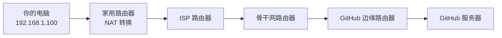
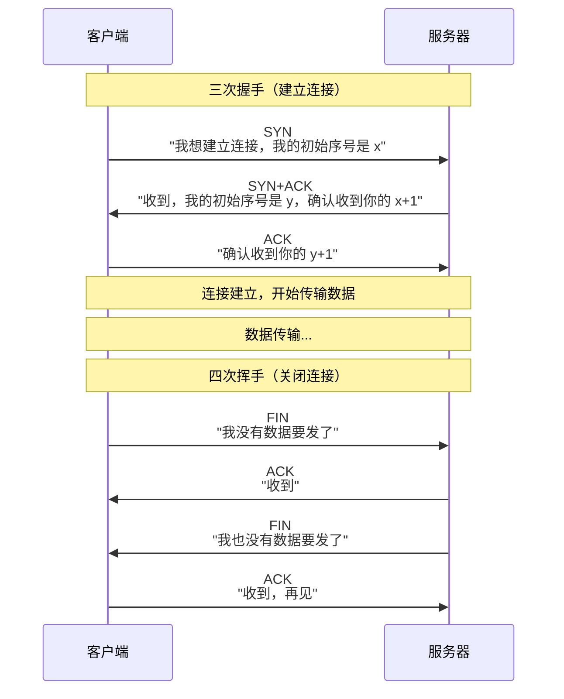
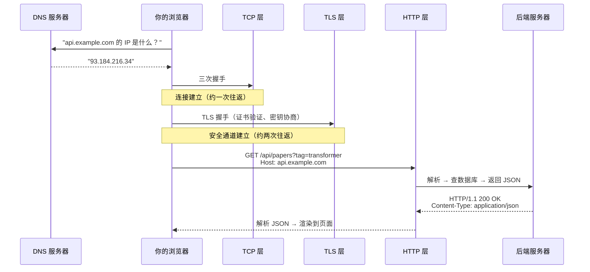

# $\rm Chapter \, 23$ 网络基础到 HTTP

> 你在浏览器地址栏输入 `github.com`，按下回车，不到一秒后一个完整的页面出现在眼前。这期间你的计算机会发出多个网络请求，经过路由器、交换机、DNS 服务器和反向代理，最终从 GitHub 的服务器取回 HTML、CSS、JavaScript 和图片。这个过程涉及 IP 地址、端口、TCP 连接、TLS 握手和 HTTP 协议——这一章逐个拆开 IP、端口、TCP 与 HTTP，TLS 握手则留到下一章。

> **开始前自检**：本章假设你已经会：□ 理解客户端-服务器与服务、端口（第 1 章）；
> □ 会在终端运行命令；
> □ 用过浏览器访问网页。

## $\rm \S \, 23.1$ 网络是怎样把两台机器连起来的

### $\rm \S \, 23.1.1$ IP 地址：网络世界的门牌号

在[文件系统与权限](../02-终端与工具/03-文件系统路径与权限.md)中你学到了"绝对路径从根出发找到文件"。在网络中，**IP 地址**扮演了类似的角色——它标识网络中的一台主机。

IPv4 地址是 32 位整数，通常写成四个 0-255 的数字：

```text
192.168.1.100     ← 你家局域网中某台设备
142.250.80.46     ← google.com 的一个 IP
127.0.0.1         ← 永远指向"本机"（loopback）
```

在[操作系统、进程与线程](../03-计算机系统/11-操作系统进程与线程.md)中你学到了端口——IP 地址告诉数据包"寄到哪栋楼"，端口告诉"楼里哪个房间（哪个进程）"。一个完整的目的地是 `IP:端口`，例如 `127.0.0.1:8000`。

IPv6（128 位）正在逐步替代 IPv4，地址写成八组十六进制数字。日常开发中绝大多数场景你接触的还是 IPv4，但知道 IPv6 的存在可以避免在见到 `::1`（IPv6 的 loopback）时困惑。

### $\rm \S \, 23.1.2$ 从你的机器到目标机器：一跳一跳地走

数据不是从你的电脑"直达" GitHub 服务器的。它经过若干个中间路由器：



每一跳根据**路由表**决定"下一步发给谁"。你可以用 `traceroute`（Linux/macOS）或 `tracert`（Windows）亲自查看：

```bash
traceroute github.com    # Linux/macOS
```

```powershell
tracert github.com       # Windows
```

输出每一行是一跳，包含中间路由器的 IP 和往返延迟。看到 `* * *` 表示那台路由器不响应探测包（但不一定表示网络断了——有些路由器配置为忽略 traceroute 请求）。

> **竞赛生迁移提示**：路由本质上是图上的最短路径问题。但你学过的 Dijkstra 和 Bellman-Ford 只描述了"最优路径怎么算"——在实际网络中，路由协议（OSPF、BGP）还要处理节点动态加入/离开、链路故障、策略路由和商业关系。算法是基础，工程是另一层。

### $\rm \S \, 23.1.3$ NAT：为什么你家所有设备共用一个公网 IP

你的笔记本电脑 IP 可能是 `192.168.1.100`。这不是公网 IP——它是**私有地址**，只在你的家庭局域网内有效。全球成千上万台设备都可以有 `192.168.1.100`，因为它们在不同的局域网里。

当你访问 `github.com` 时，路由器做了一件事：**NAT**（Network Address Translation，网络地址转换）。它把你的私有 IP+端口替换为路由器的公网 IP+一个新端口，记录映射关系，等响应回来时再反向替换。对 GitHub 服务器来说，请求来自你家路由器的公网 IP——它不需要、也不知道你内网的 IP。

NAT 是在 IPv4 地址不够用的情况下让几十亿设备共享有限公网地址的核心方案。IPv6 普及后 NAT 就不再是必需品，但在过渡期你仍然需要理解它。

---

## $\rm \S \, 23.2$ TCP：可靠的"数据管道"

### $\rm \S \, 23.2.1$ TCP 保证什么

在 IP 之上，**TCP**（Transmission Control Protocol，传输控制协议）提供了可靠的字节流传输：

- **有序**：数据按发送顺序到达。
- **无丢失**：丢失的包会被自动重传。
- **无重复**：重复的包会被自动丢弃。
- **流量控制**：接收方可以告诉发送方"慢点，我处理不过来了"。

这就像你在 OJ 上提交代码时，你不需要关心评测机收到的字节序列是否完整、是否乱序——TCP 已经帮你保证了。如果你自己用 UDP（无连接、不保证送达）实现一个文件传输，就要处理丢包重传、乱序重组和拥塞控制——这正是 TCP 替你做的。

### $\rm \S \, 23.2.2$ 三次握手与四次挥手

TCP 连接建立需要**三次握手**：



记住"三次握手"不只是应付面试——当你遇到 `Connection refused`（服务器端口没开，SYN 被 RST 拒绝）和 `Connection timed out`（SYN 发出后没有收到任何回复——大概率是防火墙丢弃了包）时，你能判断问题出在握手的哪一步。

### $\rm \S \, 23.2.3$ UDP：不保证送达，但很快

**UDP**（User Datagram Protocol）是 TCP 的"轻量级替代"。它不建立连接、不保证送达、不保证顺序——应用层发一个数据报，UDP 尽力而为地送到目的地。

为什么还用 UDP？有些场景下**时效性 > 可靠性**。视频通话丢一个包不影响整体体验；DNS 查询通常是一个请求一个响应的短交互，用 TCP 的三次握手建立连接再发请求得不偿失；游戏中的位置更新如果因为丢失重传导致延迟，位置数据反而不准了。

日常开发中你写的大多数程序（HTTP API、数据库查询、文件传输）基于 TCP。UDP 更常见于基础设施层和实时应用。

### $\rm \S \, 23.2.4$ TCP 三次握手：为什么建立连接要三个步骤

```text
客户端                       服务器
  |                            |
  |── SYN (seq=x) ──────────→ |  ① "我想和你通信，我的起始序号是 x"
  |                            |
  |← SYN-ACK (seq=y, ack=x+1) |  ② "收到，我的起始序号是 y，等你确认"
  |                            |
  |── ACK (ack=y+1) ────────→ |  ③ "收到，连接建立完毕"
  |                            |
  |═══ 连接建立，开始传输数据 ══|
```

为什么是三次而不是两次？因为网络可能延迟和重传旧的 SYN 包。如果只用两次握手，服务器收到一个延迟的旧 SYN 就建立连接并分配资源——而客户端早已放弃。三次握手让客户端有机会说"不，这不是我需要的连接"。

### $\rm \S \, 23.2.5$ TIME_WAIT：为什么端口不能立刻复用

TCP 关闭连接后有 **TIME_WAIT** 状态（默认持续约 $2 \, \text{msl} \approx 60$ 秒）。你重启服务器时可能遇到过 `Address already in use`——就是这个原因。旧连接的残留数据包可能还在网络中漂，TIME_WAIT 确保这些残留包过期后才允许同一端口被新连接复用。

### $\rm \S \, 23.2.6$ HTTP keep-alive：不用每次都三次握手

HTTP/1.0 中，每个请求都要新建一个 TCP 连接——请求 HTML → 关闭 → 新建连接请求 CSS → 关闭 → 新建连接请求 JS。**HTTP keep-alive**（HTTP/1.1 默认开启）让一个 TCP 连接可以承载多个 HTTP 请求，省掉反复握手的开销。

### $\rm \S \, 23.2.7$ tcpdump 最小实践：不是"抓包黑客工具"

`tcpdump`（或 Wireshark）让你看到网络上实际传输了什么——对于调试"API 调不通到底是请求没发出去还是响应没返回来"是终极武器：

```bash
sudo tcpdump -i any port 5000 -A
# -i any: 任意网卡
# port 5000: 只看 5000 端口的流量
# -A: 以 ASCII 显示包内容（可以直接看到 HTTP 请求和响应文本）

# 输出示例：
# 10:30:01.123456 IP localhost.54321 > localhost.5000: Flags [P.], seq 1:85
# GET /api/papers HTTP/1.1
# Host: localhost:5000
# ...
```

如果你能看到 `GET` 请求发出但没收到响应——后端挂了或端口错了。如果所有请求都正常收发——问题不在网络上。

---

## $\rm \S \, 23.3$ HTTP：Web 的通用语言

### $\rm \S \, 23.3.1$ 请求-响应模型

HTTP（HyperText Transfer Protocol）是最广泛使用的应用层协议。它运行在 TCP 之上，遵循严格的**请求-响应**模式：客户端发送一个请求，服务器返回一个响应。

HTTP 请求的结构：

```text
GET /papers?tag=transformer HTTP/1.1        ← 方法 路径?参数 协议版本
Host: api.example.com                       ← 头部（Headers）——键值对
Accept: application/json
User-Agent: paper-manager/1.0
Authorization: Bearer sk-xxxx
                                             ← 空行表示头部结束
                                             ← 请求体（Body）——GET 请求通常没有
```

HTTP 响应的结构：

```text
HTTP/1.1 200 OK                              ← 协议版本 状态码 状态描述
Content-Type: application/json              ← 响应头
Content-Length: 256
Date: Sat, 15 Mar 2026 10:30:00 GMT

{                                           ← 响应体
  "title": "Attention Is All You Need",
  "year": 2017
}
```

在[开发者命令行工具箱](../02-终端与工具/07-开发者命令行工具箱.md)中你用过 `curl` 直接查看原始 HTTP 流量。现在从协议角度重新审视 `curl` 的输出：每一行响应头、状态码、响应体，都对应上面结构的一部分。

### $\rm \S \, 23.3.2$ HTTP 方法：你想让服务器做什么

| 方法 | 语义 | 对资源的影响 | 请求体 |
|---|---|---|---|
| **GET** | 获取资源 | 不应有副作用（只读） | 通常无 |
| **POST** | 创建资源 | 有副作用 | 有（新建的数据） |
| **PUT** | 替换资源（完整更新） | 幂等（重复执行结果相同） | 有（完整新数据） |
| **PATCH** | 部分更新资源 | 可能不幂等 | 有（只含要改的字段） |
| **DELETE** | 删除资源 | 幂等 | 通常无 |
| **HEAD** | 同 GET 但不返回响应体 | 只读 | 无 |
| **OPTIONS** | 查询支持的方法 | 只读 | 无 |

**幂等**（idempotent）是 HTTP 中的重要概念：一个操作执行一次和执行多次，产生相同的副作用。`PUT` 是幂等的（重复上传同一个文件，结果还是那个文件），`POST` 不是（重复创建会生成多个资源）。

### $\rm \S \, 23.3.3$ 状态码：服务器一句话告诉你结果

| 范围 | 类别 | 你常遇到的 |
|---|---|---|
| **2xx** | 成功 | `200 OK`、`201 Created`、`204 No Content` |
| **3xx** | 重定向 | `301 Moved Permanently`、`302 Found`、`304 Not Modified` |
| **4xx** | 客户端错误 | `400 Bad Request`、`401 Unauthorized`、`403 Forbidden`、`404 Not Found`、`429 Too Many Requests` |
| **5xx** | 服务器错误 | `500 Internal Server Error`、`502 Bad Gateway`、`503 Service Unavailable` |

`401` vs `403` 是一个经典混淆点：`401` 表示"你没有提供认证凭据（或凭据无效）"，`403` 表示"你的身份已经确认，但这个资源不给你看"。

### $\rm \S \, 23.3.4$ 请求头和响应头：元数据的通道

头部携带的是**关于请求/响应的元信息**，而不是资源本身。常用的：

| 头部 | 方向 | 含义 |
|---|---|---|
| `Host` | 请求 | 我要访问哪个域名（同一 IP 可能托管多个网站） |
| `Content-Type` | 双向 | 请求体/响应体的格式：`application/json`、`text/html` |
| `Content-Length` | 双向 | 体的字节数 |
| `Authorization` | 请求 | 认证凭据：`Bearer sk-xxxx` |
| `Accept` | 请求 | 我想要什么格式的响应 |
| `User-Agent` | 请求 | 我是浏览器/curl/Python |
| `Set-Cookie` | 响应 | 请在你的浏览器中保存这个 Cookie |
| `Location` | 响应（3xx） | 重定向目标 URL |
| `Cache-Control` | 响应 | 这个资源可以缓存多久 |

---

## $\rm \S \, 23.4$ 在终端中操作 HTTP 的全部层次

你已经会了 `curl` 的基本 GET 请求。现在是完整版：

```bash
# 查看完整交互过程（-v = verbose，显示请求头和响应头）
curl -v https://api.github.com/repos/torvalds/linux

# 显示时间分解（DNS、TCP、TLS、首字节、总耗时）
curl -w '\nDNS: %{time_namelookup}s\nTCP: %{time_connect}s\nTLS: %{time_appconnect}s\nFirstByte: %{time_starttransfer}s\nTotal: %{time_total}s\n' \
  -o /dev/null -s https://api.github.com

# POST JSON
curl -X POST https://httpbin.org/post \
  -H "Content-Type: application/json" \
  -d '{"name": "paper-manager", "version": "1.0"}'

# 跟随重定向（-L）
curl -L http://github.com    # http → https 重定向

# 下载文件并显示进度条
curl -O -# https://example.com/large_dataset.tar.gz
```

### $\rm \S \, 23.4.1$ 不止 curl 的 HTTP 工具

| 工具 | 类型 | 用途 |
|---|---|---|
| **curl** | CLI | 命令行 HTTP 客户端，脚本和 CI 标配 |
| **httpie** (`http`) | CLI | 比 curl 更友好的输出（自动格式化 JSON、语法高亮），适合人类交互 |
| **Postman**（postman.com） | GUI | 请求集合管理、环境变量、团队协作 |
| **Insomnia**（insomnia.rest） | GUI | Postman 的开源替代，支持 GraphQL 和 gRPC |
| **Hoppscotch**（hoppscotch.io） | Web | 基于浏览器的 API 测试工具，无需安装 |
| **浏览器 F12 → Network** | 内置 | 观察网页实际发出的所有请求——排查"为什么页面加载了但没数据"时比 curl 更快 |
| **mitmproxy**（mitmproxy.org） | CLI/Web | 中间人代理，拦截和查看本机所有 HTTP/HTTPS 流量（调试第三方 SDK 的神器） |
| **wget** | CLI | 比 curl 更偏向下载场景：递归下载、断点续传、镜像网站 |

---

## $\rm \S \, 23.5$ 一个请求的完整时间线



`curl -w` 可以单独测量每一段的耗时。当 API "慢"时，先确定是哪一段慢，再决定优化方向——加缓存（减少后端处理时间）、换 CDN（减少 RTT）还是升级 TLS 证书（减少握手往返）。

---

## $\rm \S \, 23.6$ 动手实践

### 实践一：用 curl 解剖 HTTP 交互

```bash
curl -v https://httpbin.org/json          # 完整交互
curl -I https://httpbin.org/json          # 只看响应头
curl -X POST https://httpbin.org/post \
  -H "Content-Type: application/json" \
  -d '{"paper": "Attention Is All You Need", "year": 2017}'
curl -v -L http://github.com             # 跟随重定向
```

每次观察：状态码、响应头（特别是 `Content-Type`）、响应体格式。

### 实践二：traceroute 看物理路径

```bash
traceroute github.com      # Linux/macOS
tracert github.com         # Windows
```

观察：经过了多少跳？哪些跳延迟突然增大？

### 实践三：浏览器 Network 面板

1. 打开 F12 → Network 标签页，刷新任意网页。
2. 点击第一个请求，查看 Headers → Request Headers 和 Response Headers。
3. 找到 `Content-Type`、`Cache-Control`、请求方法。
4. 在 Timing 标签页中查看 DNS、TCP、TLS 各段耗时。

### 实践四：分析状态码

```bash
curl -v https://httpbin.org/status/404
curl -v https://httpbin.org/status/500
curl -v https://httpbin.org/status/302
curl -v https://httpbin.org/basic-auth/user/pass -u user:wrongpass  # 401
```

---

## $\rm \S \, 23.7$ 总结

- **IP 是地址，端口是房间号**。127.0.0.1:8000 和 93.184.216.34:443 分别指向"本机的 Python 后端"和"互联网上一台服务器的 HTTPS 端口"。
- **TCP 在不可靠的 IP 之上建立可靠连接**。三次握手建立连接，ACK 确认送达，超时重传补缺。
- **HTTP 是请求-响应模式**。方法表达意图，状态码表达结果，头部携带元数据。
- **一个 HTTP 请求的耗时包括 DNS + TCP + TLS + 等待响应 + 传输数据**。优化前先测量各段。

---

## $\rm \S \, 23.8$ 关键概念回顾

1. IP 地址和端口分别解决什么问题？

2. HTTP 方法中 GET 和 POST 的核心区别是什么？哪些方法是幂等的？

3. 状态码 401 和 403 分别表示什么？

4. HTTP 请求头和请求体分别携带什么类型的信息？

5. 一次 HTTP 请求从发出到收到首个字节，经历了哪些主要阶段？

## $\rm \S \, 23.9$ 应用与辨析

1. TCP 三次握手的目的是什么？`Connection refused` 和 `Connection timed out` 分别说明什么？

2. UDP 和 TCP 的使用场景有什么不同？

## $\rm \S \, 23.10$ 本章自测答案

> 先闭卷作答本章"关键概念回顾"与"应用与辨析"，再核对以下答案。

### 自测答案 · 关键概念回顾
1. IP 地址标识网络中的主机（寄到哪栋楼），端口标识主机上的哪个进程（楼里哪个房间）；完整目的地是 IP:端口。
2. GET 获取资源、不应有副作用（只读）；POST 创建资源、有副作用；PUT 和 DELETE 是幂等的（执行多次结果相同），POST 不是。
3. 401 表示没有提供认证凭据或凭据无效；403 表示身份已确认，但无权访问这个资源。
4. 头部携带关于请求/响应的元信息（Host、Content-Type、Authorization 等键值对）；请求体携带实际数据（如 POST 要创建的资源内容）。
5. DNS 解析 → TCP 三次握手 → TLS 握手（HTTPS）→ 发送请求 → 服务器处理 → 收到首个响应字节；`curl -w` 可以分段测量每段耗时。

### 自测答案 · 应用与辨析
1. 同步双方的初始序号、建立可靠连接；refused 表示对端端口没有进程监听（SYN 被 RST 拒绝），timed out 表示 SYN 发出后没有回复——大概率是防火墙丢包或主机不可达。
2. TCP 有序、无丢失，适合 HTTP、文件传输、数据库查询；UDP 不保证送达但开销小、延迟低，适合视频通话、DNS、实时游戏——时效性大于可靠性的场景。

---

下一章把 HTTP 之上再加两层——域名（为什么你不用记 IP 地址）、HTTPS（为什么咖啡厅 WiFi 窃听不了你的 GitHub 密码）和代理（公司网络和 VPN 在做什么），同时建立网络排障的系统方法。

> 你现在能：解释 IP、端口、TCP/UDP 的分工，读懂 HTTP 请求-响应与状态码，用 curl 调试接口，并按层排查"连不上"
