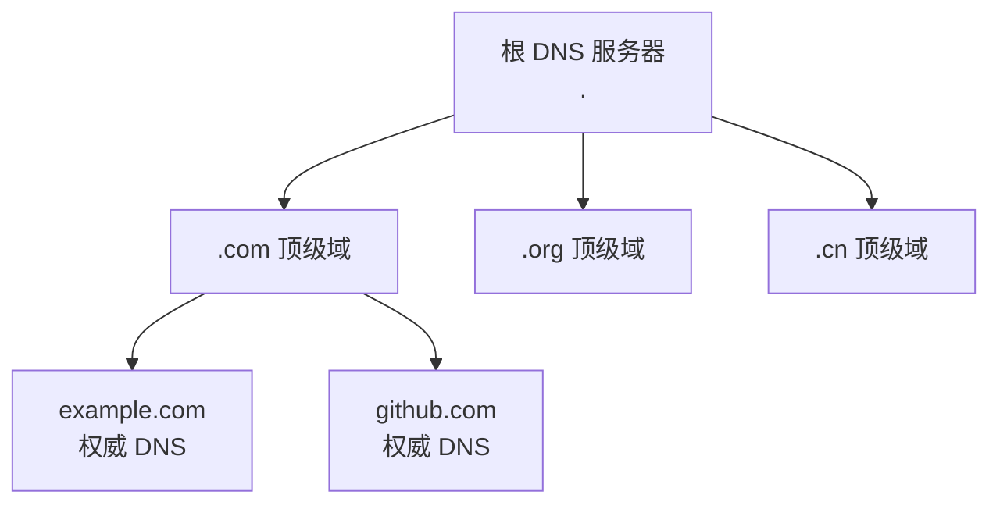
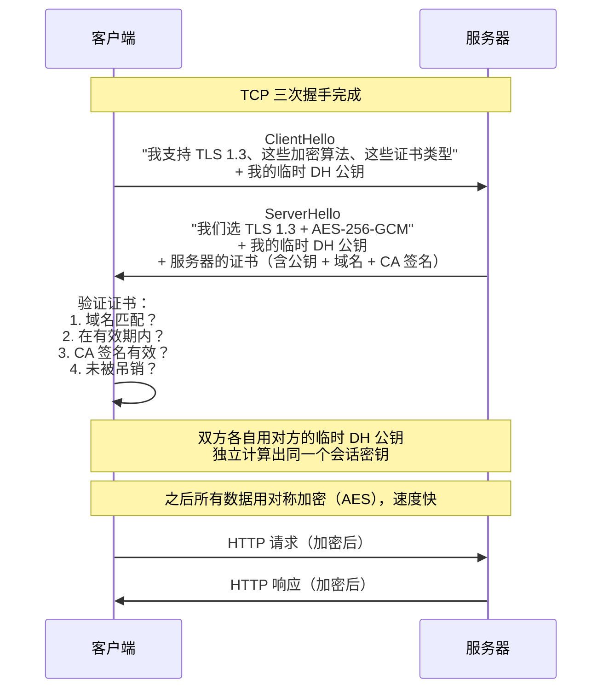
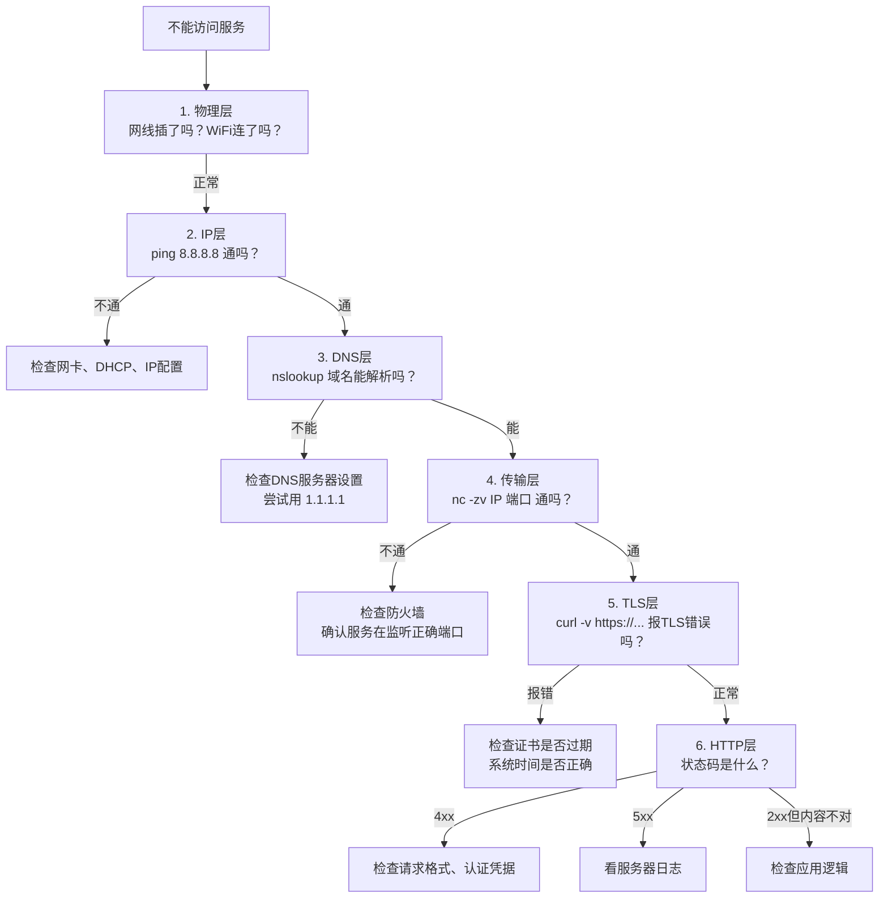

# $\rm Chapter \, 24$ 域名、HTTPS、代理与排障

> [上一章](./23-网络基础到HTTP.md)你看到了从浏览器发出 HTTP 请求到收到响应的完整链路。这一章回答链路中还没解释的三个环节：`github.com` 这个域名是怎么变成 IP 地址的？`https://` 中的那个 `s` 到底保护了什么？公司网络、VPN 和云服务里的"代理"又是什么角色？最后用一个系统的排障框架收尾。

## $\rm \S \, 24.1$ DNS：互联网的电话簿

### $\rm \S \, 24.1.1$ 为什么需要域名

IP 地址是网络层真正使用的地址。但让人类记住 `142.250.80.46`（Google）或 `20.205.243.166`（GitHub）不现实。**DNS**（Domain Name System，域名系统）把人类可读的名字翻译为机器可读的 IP 地址。

DNS 是一个**分层的、分布式的数据库**：



- **根 DNS 服务器**全球只有 13 组（逻辑上），由 ICANN（Internet Corporation for Assigned Names and Numbers，互联网名称与数字地址分配机构）管理。你的电脑不需要直接问根服务器——ISP（Internet Service Provider，互联网服务提供商）和公共 DNS 已经缓存了顶级域的信息。
- **顶级域（TLD）服务器**管理 `.com`、`.org`、`.cn` 等。
- **权威 DNS 服务器**拥有某个具体域名（如 `github.com`）的最终答案。

### $\rm \S \, 24.1.2$ 三次 DNS 解析的实际过程

当你在浏览器中输入 `api.github.com`：

1. **浏览器缓存**：最近解析过的域名？有就直接用。
2. **操作系统缓存**：浏览器没命中，问 OS（`/etc/hosts` 文件优先于 DNS）。
3. **DNS 解析器**（通常是你的路由器或 ISP 提供的）：收到请求后，如果自己的缓存没有，就递归查询——从根 → `.com` → `github.com` → `api.github.com`。
4. **返回结果**：IP 地址 + TTL（生存时间，告诉中间缓存这个结果可以保存多久）。

```bash
# 手动查询 DNS
nslookup github.com              # 两个平台通用
dig github.com                   # Linux/macOS，输出更详细
dig @8.8.8.8 github.com         # 指定使用 Google 的公共 DNS
```

```powershell
Resolve-DnsName github.com       # PowerShell 专用
```

### $\rm \S \, 24.1.3$ DNS 记录类型

| 类型 | 全称 | 查询结果 |
|---|---|---|
| **A** | Address | 域名 → IPv4 地址 |
| **AAAA** | — | 域名 → IPv6 地址 |
| **CNAME** | Canonical Name | 别名 → 规范域名（`www.github.com` → `github.com`） |
| **MX** | Mail Exchange | 邮件服务器地址 |
| **TXT** | Text | 任意文本——常用于域名验证、SPF（反垃圾邮件） |
| **NS** | Name Server | 这个域名由哪个 DNS 服务器管理 |

### $\rm \S \, 24.1.4$ 公共 DNS 服务

你的 ISP 默认提供 DNS 解析，但有些情况下你可能想切换到更快的、更可靠的或能过滤恶意网站的公共 DNS：

| 服务 | 地址 | 特点 |
|---|---|---|
| Cloudflare | `1.1.1.1` | 速度最快之一，隐私友好 |
| Google Public DNS | `8.8.8.8` | 最广泛使用，全球覆盖 |
| Quad9 | `9.9.9.9` | 自动过滤已知恶意域名 |
| NextDNS（nextdns.io） | 自定义 | 可配置过滤规则，支持去广告和追踪保护 |

切换 DNS 不会让你的网速"变快"——它只影响域名解析这一步的延迟。但如果你的 ISP 的 DNS 服务器经常超时或被劫持（国内某些运营商会把不存在的域名解析到广告页），换公共 DNS 可以解决。

### $\rm \S \, 24.1.5$ `/etc/hosts`：不经过 DNS 的名字解析

在 DNS 之前，有一个更优先的名字解析方式：

```bash
# /etc/hosts (Linux/macOS) 或 C:\Windows\System32\drivers\etc\hosts (Windows)
127.0.0.1    myproject.local
192.168.1.50 dev-server
```

`hosts` 文件是本地维护的名字-地址映射，优先级高于 DNS。开发中常用它把 `myproject.local` 指向 `127.0.0.1`，让你可以用真实域名测试本地服务。

---

## $\rm \S \, 24.2$ HTTPS 与 TLS：加密、认证与完整性

### $\rm \S \, 24.2.1$ HTTP 的三个安全问题

普通的 HTTP 明文传输。在咖啡厅 WiFi 上，同一网络中的任何人：

1. **可以窃听**你发出去的所有数据（包括密码、Cookie）。
2. **可以篡改**响应内容（在返回的 HTML 中注入恶意脚本）。
3. **无法验证**你访问的 `github.com` 确实是 GitHub 的服务器——攻击者可以在 DNS 层面把你的请求导向自己的假服务器。

**HTTPS**（HTTP over TLS）解决了全部三个问题：**加密**（防窃听）、**完整性校验**（防篡改）、**身份认证**（防冒充）。

### $\rm \S \, 24.2.2$ TLS 握手：在 TCP 之上建立安全通道

[上一章](./23-网络基础到HTTP.md)的 Mermaid 图中 TLS 层出现了但没展开。现在展开：



关键点：TLS 1.3 的握手比旧版本更简洁。客户端先在 ClientHello 中发送自己的临时 DH 公钥，服务器在 ServerHello 中回复自己的临时 DH 公钥和证书，双方各自独立计算出完全相同的**会话密钥**——不需要"客户端生成密钥再用服务器公钥加密发送"（那是已废弃的 RSA 密钥传输模式）。之后的数据传输都用这个对称密钥（AES）加密。为什么先非对称后对称？因为非对称加密太慢了——加密整个网页的 HTML 用非对称算法不现实，而 AES 在 CPU 上有硬件指令加速（AES-NI），每秒可以加解密几 GB。

### $\rm \S \, 24.2.3$ 证书与 CA：谁给服务器做担保

你怎么知道服务器的公钥是真的？如果你连接到一个自称 `github.com` 的服务器，它发给你一个自己生成的公钥——你怎么验证？

答案是**证书链**。服务器不只发给你公钥，还发给你一份**数字证书**，里面包含了公钥、域名、有效期和**CA（证书颁发机构）的数字签名**：

```text
你的浏览器信任列表（操作系统预装）
  └── Let's Encrypt / DigiCert / GlobalSign 等 CA 的根证书
        └── CA 签发了 github.com 的证书
              └── github.com 的证书包含 github.com 的公钥
```

浏览器（或 curl）在 TLS 握手时验证整个链——如果任何一环的签名不匹配、证书过期或域名不匹配，TLS 握手就会失败，你会看到 `SSL certificate problem` 错误。

**Let's Encrypt**（letsencrypt.org）是一个免费、自动化的 CA，极大地降低了 HTTPS 的使用门槛。大部分个人项目和小型网站都用它的证书。

### $\rm \S \, 24.2.4$ 什么时候你会遇到 TLS 错误

| 错误 | 含义 | 排查方向 |
|---|---|---|
| `certificate has expired` | 证书过期了 | 服务器管理员需要续签（Let's Encrypt 证书 90 天有效） |
| `self-signed certificate` | 服务器用的是自己签发的证书，不是 CA 签的 | 本地开发环境正常（`localhost`）；生产环境不安全 |
| `hostname mismatch` | 证书写的域名是 `example.com`但你访问的是 `www.example.com` | 证书需要包含多个域名（SAN）或使用通配符 `*.example.com` |
| `unable to get local issuer certificate` | 你的系统不信任签发这张证书的 CA | 常见于公司内网——公司有自己的内部 CA，需要手动添加到系统信任列表 |
| `SSL certificate problem: certificate chain` | 中间证书缺失 | 服务器配置问题：忘记提供完整的证书链 |
| `unknown CA` | CA 不在系统信任列表中 | 通常在 curl 中看到：用 `-k`（不安全）临时绕过或安装 CA 证书 |

---

## $\rm \S \, 24.3$ 代理：中间人（正当的那种）

### $\rm \S \, 24.3.1$ 正向代理：帮客户端访问外部资源

**正向代理**（forward proxy）位于客户端一侧。公司网络中你经常遇到它：

```text
你的电脑 → 公司代理服务器 → 互联网
```

用途：
- 访问控制（只允许访问白名单中的网站）；
- 缓存（代理保存常用资源的副本，减少外网带宽消耗）；
- 审计（记录谁访问了什么）；
- 绕过限制（通过代理访问被网络防火墙屏蔽的资源）。

配置方式（以环境变量为例）：

```bash
export HTTP_PROXY=http://proxy.company.com:8080
export HTTPS_PROXY=http://proxy.company.com:8080
# curl、pip、npm 等工具会自动识别这些环境变量
```

### $\rm \S \, 24.3.2$ 反向代理：帮服务器接收外部请求

**反向代理**（reverse proxy）位于服务器一侧，是生产环境中的标配：

```text
互联网 → Nginx/Caddy → 你的后端应用（Python/Node.js/Go）
```

用途：
- **TLS 终止**：反向代理处理 HTTPS（证书管理、加解密），后端应用只需要处理 HTTP。证书只需要在代理层面配置一次。
- **静态文件服务**：反向代理直接返回 CSS、JS、图片，不需要经过慢速的应用服务器。
- **负载均衡**：把请求分发给多个后端实例。
- **缓存、限流、压缩**：统一处理，后端代码不需要关心。
- **路径路由**：`/api/*` → 后端，`/admin/*` → 管理面板，`/` → 前端静态文件。

常见反向代理软件：

| 软件 | 特点 |
|---|---|
| **Nginx**（nginx.org） | 十年来最广泛使用的 Web 服务器和反向代理 |
| **Caddy**（caddyserver.com） | 自动 HTTPS（Let's Encrypt 自动签发和续期），配置极简 |
| **Traefik**（traefik.io） | 专为容器和微服务设计，自动发现 Docker/K8s 中的服务 |
| **HAProxy** | 纯负载均衡器，性能极致 |
| **Cloudflare Tunnel** | 不需要公网 IP，通过 Cloudflare 边缘网络暴露本地服务 |

### $\rm \S \, 24.3.3$ VPN：加密隧道

VPN（Virtual Private Network，虚拟专用网络）在你和 VPN 服务器之间建立一条**加密隧道**。你所有的网络流量先进入隧道，从 VPN 服务器出口进入互联网。

对网站来说，请求来自 VPN 服务器的 IP，而不是你的真实 IP。VPN 保护的是"你的 ISP/咖啡厅 WiFi 看不到你在访问什么"——但 VPN 提供商自己可以看到你的流量。选择 VPN 时，信任 VPN 提供商至少和信任你的 ISP 一样重要。

技术上，VPN 不是代理的简单替代。代理工作在应用层（HTTP 代理理解 HTTP，可以缓存、过滤；SOCKS5 代理不关心协议），VPN 工作在更低层（通常 L3/IP 层），把所有流量（HTTP、DNS、游戏、SSH）都封装在隧道中。

### $\rm \S \, 24.3.4$ 开发中最常见的代理场景

当你在本地运行前后端分离项目时：

```text
浏览器 → localhost:5173（Vite 前端开发服务器）
              ↓ /api/* 请求被 Vite proxy 转发
           localhost:8000（Python 后端）
```

Vite（前端构建工具）自带的代理功能本质就是一个简化的反向代理。它的目的是解决**跨域**（CORS）问题——浏览器禁止 `localhost:5173` 上的 JavaScript 向 `api.example.com` 发请求（不同源），但如果前端和后端都通过同一个地址（`localhost:5173`）访问，浏览器就认为它们是同源的。代理在中间把 `/api/*` 请求默默转发到真正的后端。

---

## $\rm \S \, 24.4$ 网络排障的分层方法

### $\rm \S \, 24.4.1$ 从下往上排查

网络问题看起来复杂，但你有了这些概念之后，按下面的顺序逐层排除：



### $\rm \S \, 24.4.2$ 每个排查步骤的核心命令

| 层 | 命令 | 看什么 |
|---|---|---|
| IP | `ping 8.8.8.8` | 网络连通性 |
| DNS | `nslookup domain` / `dig domain` | 域名能否解析、解析结果是否正确 |
| TCP | `nc -zv host port` / `Test-NetConnection` | 端口是否开放 |
| TLS | `curl -v https://host` / `openssl s_client -connect host:443` | 证书是否有效、TLS 握手是否成功 |
| HTTP | `curl -v http://host` | 状态码、响应头、响应体 |

`nc -zv host port` 只能告诉你**一个**端口开不开。当你想知道"这台机器上到底有哪些端口在服务"时，用 **nmap**（网络扫描器）一次扫完：`nmap -p 1-1000 192.168.1.1` 扫描前 1000 个端口，`nmap -sV host` 在发现端口后进一步探测背后的服务版本（如 "OpenSSH 9.6"）。它解决两类问题：不知道服务监听在哪个端口（扫一遍就有答案）；验证服务器的防火墙配置是否正确——从外部扫描，看哪些端口真的暴露在公网上（生产服务器通常只应暴露 80/443 等少数端口）。nmap 在 Windows 上同样可用（nmap.org 提供官方安装包）。

### $\rm \S \, 24.4.3$ 一个真实排障案例

用户报告："访问论文管理器网站，浏览器一直转圈。"

**分层排查的实际过程**：

1. `nslookup paper-manager.example.com` → 正常返回 IP。DNS 没问题。
2. `ping 93.184.216.34` → 通。网络层没问题。
3. `nc -zv 93.184.216.34 443` → `Connection refused`。

问题定位到了：服务器的 443 端口没在监听。有可能是 Nginx 没启动、绑定错了端口、或者防火墙屏蔽了 443。

4. SSH 登录服务器，`systemctl status nginx` → `inactive `。
5. `journalctl -u nginx -n 20` → 日志显示 `bind() to 0.0.0.0:443 failed (13: Permission denied)`。

原因：重启服务器后，Nginx 以非 root 用户试图绑定 443 端口（小于 1024 的端口在 Linux 上需要特殊权限）。解决：给 Nginx 的二进制文件添加 `CAP_NET_BIND_SERVICE` 能力，或改用大于 1024 的端口并用 iptables 转发。

这是真实世界中每天发生的排障过程——不是猜，而是一层层收集证据，缩窄范围。

---

## $\rm \S \, 24.5$ 动手实践

### 实践一：DNS 实验

```bash
# 查询不同记录类型
dig github.com A          # IPv4 地址
dig github.com MX         # 邮件服务器（如果有）
dig @8.8.8.8 github.com   # 指定 DNS 服务器

# 查看解析的完整过程
dig +trace github.com     # 从根开始逐步追踪
```

### 实践二：TLS 证书检查

```bash
# 查看某个网站的证书详情
openssl s_client -connect github.com:443 -servername github.com | openssl x509 -noout -dates -subject -issuer

# curl 只看 TLS 握手
curl -vI https://github.com 2>&1 | grep -E "SSL|subject|issuer|expire"
```

### 实践三：分层排障演练

1. 故意输入一个不存在的域名，用 `nslookup` 查看结果。
2. 用 `nc -zv localhost 12345` 尝试连接一个没有服务在监听的端口。
3. 用 `curl -v https://expired.badssl.com` 观察证书过期错误。
4. 用 `curl -v https://self-signed.badssl.com` 观察自签名证书错误。

### 实践四：反向代理最简体验

如果你有一台能装 Docker 的机器：

```bash
# 用 Caddy 在三行配置中启用自动 HTTPS 反向代理
# Caddyfile:
# your-domain.com {
#     reverse_proxy localhost:8000
# }
docker run -d -p 80:80 -p 443:443 -v $PWD/Caddyfile:/etc/caddy/Caddyfile caddy
```

不需要手动申请证书、配置 TLS 参数——Caddy 自动完成。

---

## $\rm \S \, 24.6$ 总结

- **DNS 是一棵分层的分布式树**。`hosts` 文件优先于 DNS 查询。`nslookup`/`dig` 是诊断"解析不对"的基础工具。
- **TLS 提供加密、完整性和身份认证**。证书链连接了你的浏览器和全球信任的 CA。TLS 错误按证书过期→域名不匹配→自签名→CA 不信任的顺序排查。
- **正向代理帮客户端出去，反向代理帮服务器接收**。Nginx/Caddy/Traefik 是现代部署中的标配反向代理。
- **网络排障从下往上**：IP → DNS → TCP → TLS → HTTP。每一层都有对应的诊断命令，不要跳层猜测。

---

## $\rm \S \, 24.7$ 关键概念回顾

1. `nslookup` 和 `dig` 有什么区别？`/etc/hosts` 的优先级为什么高于 DNS？
> nslookup 两个平台通用、输出简单；dig 是 Linux/macOS 工具、输出更详细（可 +trace 看完整解析过程）；hosts 是本地手工维护的映射，先查本地文件既快又能覆盖/测试域名。

2. HTTP 和 HTTPS 在安全上有什么区别？TLS 同时提供哪三项保障？
> HTTP 明文传输，可被窃听、篡改和冒充；HTTPS 在 TCP 之上加 TLS，同时提供加密（防窃听）、完整性校验（防篡改）和身份认证（防冒充）。

3. 证书链的作用是什么？浏览器怎样验证一张证书是否可信？
> 把服务器的证书信任追溯到浏览器预装的根证书：CA 签发服务器证书、根证书签发 CA；验证域名匹配、有效期、CA 签名有效且未被吊销。

4. 正向代理和反向代理分别位于客户端侧还是服务器侧？
> 正向代理位于客户端一侧（帮客户端访问外部资源，可缓存、审计、控制访问）；反向代理位于服务器一侧（帮服务器接收请求，做 TLS 终止、负载均衡、路由）。

5. 网络排障从下往上的五个层次分别检查什么？
> IP 层（ping 连通性）→ DNS 层（域名能否解析）→ 传输层（端口是否开放，nc -zv）→ TLS 层（证书、握手）→ HTTP 层（状态码、响应）。

## $\rm \S \, 24.8$ 应用与辨析

1. `Connection refused` 出现在 TCP 层还是 HTTP 层？
> TCP 层——对端端口没有进程监听，SYN 被 RST 拒绝，发生在 HTTP 请求之前；如果端口是开的而应用有问题，你看到的会是 HTTP 错误而不是 refused。

2. 代理和 VPN 有什么本质区别？各自工作在网络的哪一层？
> 代理工作在应用层——HTTP 代理理解 HTTP、可以缓存和过滤，SOCKS5 代理不关心协议；VPN 工作在更低层（通常 L3/IP 层），把 HTTP、DNS、游戏、SSH 等所有流量都封装进加密隧道，因此两者不能互相替代。

---

从下一章开始，镜头从"网络怎样通信"转向"数据怎样持久存储与展示"——你将学习 SQL 数据库（让论文管理器能记住数据）、数据库运维、前端和后端开发，最终把整套应用部署上线。
