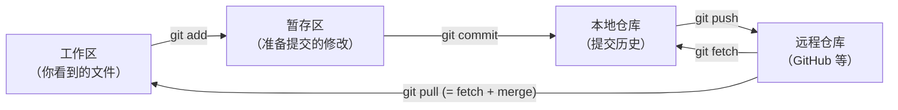
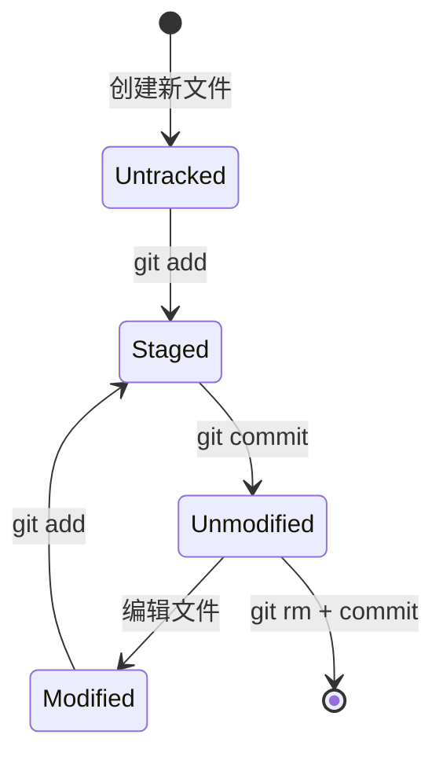

# $\rm Chapter \, 19$ Git：本地版本控制

> 你在写代码时可能有过这样的经历：`main.cpp` → `main_v2.cpp` → `main_v2_final.cpp` → `main_v2_final_FIXED.cpp`。一周后你完全不记得它们之间的区别。更糟的是，你改了一个功能后发现错了，但原来的代码已经被覆盖了。Git 是一个**版本控制系统**（Version Control System，VCS）——它不只是"保存"，而是用一条**提交链**记录项目的每一次有意修改。

## $\rm \S \, 19.1$ Git 不是什么"网盘"——它是本地的快照链

### $\rm \S \, 19.1.1$ Git 解决什么问题

在[文件系统与权限](../02-终端与工具/03-文件系统路径与权限.md)中你学会了用目录和文件组织项目。但仅靠文件系统无法回答：
- 上周三的版本里，`parser.cpp` 长什么样？
- 谁改了 `database.cpp` 的第 42 行？什么时候？为什么？
- 两个人同时改同一个文件，怎么合并而不互相覆盖？

Git 是这三个问题的答案。它由 Linus Torvalds 在 2005 年创建，现在是全球最广泛使用的版本控制系统。

### $\rm \S \, 19.1.2$ Git 的四个区域



本章聚焦前三个——完全离线可用，不需要 GitHub 账号。下一章再加入远程仓库。

**工作区**就是你在[编辑器、IDE 与调试器](../02-终端与工具/05-编辑器IDE与调试器.md)中看到和编辑的那些文件。**暂存区**（staging area，也叫 index）让你选择"哪些修改放进下一个提交"——不是所有修改都必须一起提交。**本地仓库**（repository）是 `.git/` 目录，存储了完整的提交历史。

> **类比**：工作区是桌上散落的论文草稿。暂存区是你整理好准备装订的一叠。提交是装订完成、盖上日期章的定稿——一旦装订就不能偷偷换页（只能新装订一版）。

### $\rm \S \, 19.1.3$ 第一次使用 Git

```bash
git config --global user.name "Your Name"
git config --global user.email "you@example.com"
# 这个身份会记录在每一次提交中——与登录 GitHub 的账号无关
```

---

## $\rm \S \, 19.2$ 基本工作流：四个文件状态

一个文件在 Git 中只有四种状态：



- **Untracked**（未跟踪）：Git 不知道这个文件的存在。新建的文件初始在此状态。
- **Unmodified**（未修改）：文件自上次提交后没有变化。
- **Modified**（已修改）：文件内容变了，但还没有告诉 Git"这个修改准备提交"。
- **Staged**（已暂存）：修改已经被标记为"下一个提交中要包含"。

查看文件和暂存区的状态：

```bash
git status               # 最常用的 Git 命令——看看"现在是什么情况"
git diff                 # 工作区 vs 暂存区：具体改了什么
git diff --staged        # 暂存区 vs 上次提交：即将提交什么
```

### $\rm \S \, 19.2.1$ 第一次提交

```bash
# 在项目根目录
git init                         # 创建 .git/ 目录——此后这是一个 Git 仓库

# 创建 .gitignore 文件——告诉 Git 哪些文件不要跟踪
echo "build/"        > .gitignore
echo "*.exe"        >> .gitignore
echo "venv/"        >> .gitignore

git add .                        # 添加当前目录下所有文件到暂存区
git status                       # 确认：哪些被暂存了？
git commit -m "Initial commit: project skeleton"
# -m "..." 是提交消息——描述这次提交做了什么
```

`git commit` 在 `.git/objects/` 中创建了一个**快照**（当前所有暂存文件的完整副本，通过哈希存储，相同内容只存一份）。每个提交包含：
- 快照的哈希 ID
- 提交者姓名、邮箱和时间戳
- 提交消息
- 父提交的哈希（第一个提交没有父提交）

### $\rm \S \, 19.2.2$ 第二次提交

```bash
# 编辑 main.cpp，然后
git status                       # main.cpp: modified
git diff                         # 看看自己改了啥
git add main.cpp                 # 只暂存 main.cpp（其他修改不会被提交）
git commit -m "Add paper parser"
```

现在你的仓库中有两个提交，第二个的"父亲"是第一个。`git log` 展示这条链：

```bash
git log                          # 从新到旧列出提交
git log --oneline                # 每行一个提交，简洁视图
git log --oneline --graph --all  # 可视化所有分支
```

---

## $\rm \S \, 19.3$ 分支：同一项目的平行世界

### $\rm \S \, 19.3.1$ 为什么需要分支

你在开发"论文 CSV 导入"功能。写了一半，队友报告线上有个紧急 bug 需要马上修复。你现在的代码是半成品——不能提交到主线，但你也不想丢掉进展。

分支给你一个**独立的开发线**。默认分支通常叫 `main`（或 `master`——旧项目）。从 `main` 分出一个分支，在上面做修改，改完后再合并回来。主线和你的功能线互不干扰。

```bash
git branch                       # 列出所有本地分支
git branch add-csv-import        # 创建新分支（不切换过去）
git switch add-csv-import        # 切换到新分支（Git 2.23+）
# 或一步到位：
git switch -c add-csv-import     # 创建并切换
```

在 `add-csv-import` 分支上做的所有提交，在切回 `main` 后是看不到的——每个分支有自己的提交链。

### $\rm \S \, 19.3.2$ 合并

功能开发完成，把分支合并回主线：

```bash
git switch main                  # 回到主线
git merge add-csv-import         # 把 add-csv-import 的提交合并到 main
```

如果 `main` 在你分支开发期间没有其他人提交过新东西，这只是一个**快进合并**（fast-forward）——直接把 `main` 的指针移到你分支的最新提交。没有冲突，没有额外合并提交。

如果 `main` 在你开发期间有新的提交（别人修了那个紧急 bug），`main` 和 `add-csv-import` 就有了**分叉历史**。Git 会尝试自动合并。如果修改的是不同文件（或同一文件的不同行），通常自动成功。Git 会创建一个**合并提交**（merge commit）来记录"这两条线在这里汇合了"。

### $\rm \S \, 19.3.3$ 冲突：当 Git 无法自动决定时

如果两个分支修改了**同一个文件的同一行**，Git 无法自动判断应该保留谁的版本。这被称作冲突（conflict）——不是错误，只是 Git 说"这个决定应该由人类来做"。

```bash
git merge add-csv-import
# Auto-merging main.cpp
# CONFLICT : Merge conflict in main.cpp
```

打开冲突文件，Git 用 `<<<<<<<` / `=======` / `>>>>>>>` 标记了两个版本：

```cpp
<<<<<<< HEAD                          // 当前分支（main）的版本
    std::cout << "Loading papers..." << std::endl;
=======
    std::cerr << "Loading papers..." << std::endl;  // add-csv-import 的版本
>>>>>>> add-csv-import
```

你需要手动决定保留哪个（或写一个新的综合版本），删除冲突标记，然后：

```bash
git add main.cpp                  # 告诉 Git：冲突已解决
git commit                        # 不需要 -m——Git 会提供默认合并消息
```

> 冲突不是灾难。它是一个清晰的信号：两个人修改了同一个地方，需要沟通一下意图。在没有版本控制的世界里，这种"冲突"的代价是某人的修改被无声覆盖，而 Git 让你在覆盖之前停下来。

---

## $\rm \S \, 19.4$ 撤销：如何安全地回到过去

### $\rm \S \, 19.4.1$ 还没暂存的修改：`git restore`

```bash
# "我刚才改的 parser.cpp 全错了，想回到上次提交的状态"
git restore parser.cpp              # 丢弃工作区的修改（不可恢复！）

# 从暂存区移除（但保留在工作区）
git restore --staged parser.cpp     # 相当于"取消 git add"
```

### $\rm \S \, 19.4.2$ 已经提交的修改：`git revert`

```bash
# 已经提交了一次有问题的修改，创建一个新的提交来撤销它
git revert HEAD                     # 撤销最近的提交
git revert abc1234                  # 撤销特定提交
```

`git revert` 是**安全的撤销**——它不删除历史，而是创建一个新的提交把内容恢复到目标版本之前的状态。所有人都能看到"这里有过一次撤销"。

### $\rm \S \, 19.4.3$ `git reset`：谨慎使用

```bash
git reset --soft HEAD~1             # 撤销最近的提交，保留修改在暂存区
git reset --mixed HEAD~1            # 撤销最近的提交，保留修改在工作区（默认）
git reset --hard HEAD~1             # 彻底删除最近的提交和所有修改——不可恢复
```

`--hard` 会永久删除工作区和暂存区的修改。在[文件系统与权限](../02-终端与工具/03-文件系统路径与权限.md)中你学过"删除前先确认"——这里是一样的：先 `git log` 确认你要回到哪个提交，再用 `git stash` 临时保存当前工作（见下文），最后才考虑 `reset --hard`。

### $\rm \S \, 19.4.4$ `git stash`：临时保存未提交的修改

你要紧急切到另一个分支，但当前工作还没到可以提交的程度：

```bash
git stash                   # 保存当前修改，恢复到上次提交的干净状态
git switch main             # 去处理紧急事务
# ... 修完 bug，提交 ...
git switch add-csv-import
git stash pop               # 恢复之前保存的修改
```

`stash` 是一个栈——你可以多次 `git stash`，用 `git stash list` 查看，用 `git stash pop` 恢复最近一次的。

---

## $\rm \S \, 19.5$ 查看历史：考古学家的工具箱

```bash
git log --oneline --graph --all     # ASCII 艺术的分支图

git blame parser.cpp                # 每一行最后是谁、在哪个提交中修改的

git show abc1234                    # 查看特定提交的完整修改

git diff main..add-csv-import       # 两个分支之间的全部差异对比
git diff --name-only main..         # 只看改了哪些文件，不看具体内容
```

`git blame` 不是"找出谁该背锅"——是"找到这行代码的修改背景，以便理解当初为什么这样写"。

---

## $\rm \S \, 19.6$ 日常工作流总结

```bash
# 开始新功能
git switch -c feature-name

# 工作循环
# ... 编辑代码 ...
git status                  # 看看改了啥
git diff                    # 看看具体改了什么
git add -p                  # 交互式暂存——逐块决定是否暂存
git commit -m "描述你做了什么、为什么这样做"

# 同步主线（如果主线在你开发期间有更新）
git switch main
git pull                    # 拉取远程更新（下一章）
git switch feature-name
git merge main              # 把主线的新提交合并到你的分支

# 功能完成，合并回主线
git switch main
git merge feature-name
git branch -d feature-name  # 删除已合并的分支
```

---

## $\rm \S \, 19.7$ git bisect：二分查找是谁引入了 Bug

### $\rm \S \, 19.7.1$ 问题场景

你维护论文管理器。昨天一切正常，今天运行 `./paper-cli papers.txt` 输出结果少了一半。你最近一周提交了 20 次修改——是哪一个提交引入的 bug？

你的第一反应可能是逐个检查代码。但在 OJ 中你学过一个算法：**二分查找**——从 $n$ 个元素中找一个目标，只需 $\log_2 n$ 次比较。`git bisect` 把这个算法应用到提交历史上。

### $\rm \S \, 19.7.2$ 二分定位过程

```bash
git bisect start            # 开始二分查找
git bisect bad HEAD         # 当前版本是坏的（有 bug）
git bisect good abc1234     # 上周五的版本是好的（没 bug）

# Git 自动检出中间的一个提交
# 现在测试这个版本：
./paper-cli papers.txt      # 输出正确——这个版本没问题！
git bisect good             # 告诉 Git：这个版本是好的

# Git 继续缩小范围，检出另一个提交
./paper-cli papers.txt      # 输出少了——找到有问题的提交了！
git bisect bad

# 重复几次后，Git 精确定位到引入 bug 的那个提交：
# 具体来说：
#   第 1 轮：20 个嫌疑提交 → 检出一个，测试后剩下 10 个
#   第 2 轮：10 个 → 5 个
#   第 3 轮：5 个 → 2 个
#   第 4 轮：2 个 → 1 个
#   第 5 轮：1 个 → 定位完成
# 20 个提交只需 4-5 次测试（$\log_2 20 \approx 4.3$）

git bisect reset            # 结束二分查找，回到原来的 HEAD
```

### $\rm \S \, 19.7.3$ 自动化

如果测试可以被脚本化，`git bisect` 可以全自动运行：

```bash
git bisect start HEAD abc1234
git bisect run ./test_papers.sh   # 脚本返回 0=good, 非0=bad
# Git 自动二分、自动运行脚本，最终输出第一个有问题的提交
```

这是竞赛生最能理解的 Git 功能——把你最熟悉的算法直接应用到日常调试中。200 个提交中找 bug，只需 $\log_2 200 \approx 8$ 次测试。

---

## $\rm \S \, 19.8$ 动手实践

在安全目录中完成。所有操作完全本地，不联网。

### 实践一：第一次提交

1. 创建目录 `git-lab`，进入。
2. `git init`。
3. 创建 `README.md`，写入一行内容。`git add README.md && git commit -m "Add README"`。
4. 创建 `main.cpp`，写入简单内容。提交。
5. 修改 `main.cpp`。`git status` → `git diff` → `git add` → `git commit`。
6. `git log` 查看三次提交（含初始化）。

### 实践二：分支与合并

1. 从 `main` 创建分支 `add-parser`。
2. 在分支上创建 `parser.cpp` 并提交。
3. 切回 `main`，修改 `main.cpp` 中与 `parser.cpp` 不相关的几行并提交。
4. 合并 `add-parser` → `main`。观察是否产生合并提交。
5. `git log --oneline --graph --all` 查看分叉历史。

### 实践三：制造并解决冲突

1. 创建两个分支 `branch-a` 和 `branch-b`。
2. 在两个分支中各自修改 `main.cpp` 的同一行。
3. 合并 `branch-a` → `main`（成功）。
4. 合并 `branch-b` → `main`（冲突！）。
5. 打开 `main.cpp`，找到冲突标记，手动解决，`git add`，`git commit`。

### 实践四：安全撤销

1. 修改 `main.cpp`，暂不提交。用 `git restore` 丢弃修改。
2. 修改并提交一次。用 `git revert HEAD` 撤销。
3. 修改一些文件，用 `git stash` 临时保存，切到其他分支，再切回来 `git stash pop`。

---

## $\rm \S \, 19.9$ Pre-commit Hook：让 Git 在提交前替你检查

每次提交你都依赖自己记得检查：格式对不对、有没有把调试代码交进去、有没有误传大文件。人总会忘——17.2.1 里你手写 `.gitignore`，正是为了对抗"忘记提交不该提交的文件"。**Git Hook** 是 Git 在执行某些操作（commit、push 等）前后自动运行的脚本：每个仓库的 `.git/hooks/` 目录里放着全部钩子的模板（以 `.sample` 结尾，默认不启用）。把脚本命名为 `pre-commit` 并加上执行权限后，`git commit` 会先运行它——**脚本返回非零退出码就阻止这次提交**，返回 0 才继续。

```bash
#!/bin/bash
# .git/hooks/pre-commit —— 最小示例：禁止提交调试代码
if grep -rn -E "print\(|console\.log" src/; then
    echo "检测到调试代码，请先移除再提交"
    exit 1
fi
```

（钩子运行时当前目录是仓库根目录；Windows 上 Git for Windows 会用自带的 Bash 运行钩子，脚本按 Bash 语法写即可。）

问题在于：`.git/hooks/` 本身**不被 Git 跟踪**——换电脑、队友克隆仓库，钩子就没了。**pre-commit 框架**（pre-commit.com）解决共享问题：它是独立于 Git 的工具，用 YAML 文件声明要运行的检查，`pre-commit install` 一条命令把钩子装进 `.git/hooks/`；YAML 文件提交进仓库，全队共享同一套规则：

```yaml
# .pre-commit-config.yaml —— 提交进仓库
repos:
  - repo: https://github.com/pre-commit/pre-commit-hooks
    rev: v5.0.0        # 固定到某个已发布版本；pre-commit autoupdate 可升级
    hooks:
      - id: trailing-whitespace        # 检查行尾空格
      - id: end-of-file-fixer          # 文件末尾保留一个空行
      - id: check-added-large-files    # 禁止提交大文件（默认超过 500KB 报错）
      - id: detect-private-key         # 禁止提交私钥
```

这只是通用检查；代码格式检查（如第 7 章见过的 `clang-format`、前端常用的 ESLint）同样能以 hook 形式接入，规则都写在同一个 YAML 里。安装（`pip install pre-commit`，Python 见[第 15 章](../06-编程语言/17-Python速通.md)）后执行 `pre-commit install`，然后故意保存一个带行尾空格的改动并提交——观察钩子报错、提交被阻止，这就是钩子在工作。

> **经验规则**：钩子是"提交前的最后一道防线"——秒级、只在本机跑、适合浅层检查；更全面的测试和静态检查在 CI 里做（[第 19 章](21-依赖构建测试与CI.md)），钩子快但不能替代 CI。

---

## $\rm \S \, 19.10$ 总结

- Git 是本地版本控制——不需要网络、不需要服务器。`.git/` 目录保存了完整的提交历史。
- 四个区域：工作区 → 暂存区（`git add`）→ 本地仓库（`git commit`）→ 远程仓库（`git push`，下一章）。
- 四个状态：Untracked、Unmodified、Modified、Staged。`git status` 是你最常用的命令。
- 分支是独立的开发线。合并解决分叉。冲突是 Git 说"这个决定需要人类来下"。
- `revert` 是安全的撤销（保留历史），`reset --hard` 是破坏性的（删除历史），`stash` 是临时保存。
- `git log --oneline --graph --all` 给你整个仓库的鸟瞰图。
- `pre-commit` hook 在提交前自动运行检查，非零退出码阻止提交；pre-commit 框架把规则写进仓库，全队共享。

---

## $\rm \S \, 19.11$ 关键概念回顾

1. 工作区、暂存区和本地仓库分别存储什么？
> 工作区是你编辑的实际文件；暂存区记录"哪些修改放进下一个提交"；本地仓库（.git/）存储完整的提交历史和快照。

2. 一个文件在 Git 中有哪四种状态？
> Untracked（未跟踪）、Unmodified（未修改）、Modified（已修改）、Staged（已暂存）。

3. `git add` 和 `git commit` 分别做了什么？
> add 把工作区的修改放入暂存区；commit 把暂存区的内容固化为一个快照——包含哈希、作者、时间戳和提交消息。

4. 合并冲突时 Git 在文件中插入了什么标记？
> `<<<<<<< HEAD`（当前分支版本）、`=======`（分隔线）、`>>>>>>> 分支名`（另一分支版本）；手动解决后删除标记再 add 和 commit。

5. `git stash` 解决什么问题？
> 临时保存未提交的修改（入栈），让你能干净地切换分支处理紧急事务，之后用 `git stash pop` 恢复。

6. pre-commit hook 是怎么阻止一次提交的？
> 它是 `.git/hooks/` 下的脚本，`git commit` 执行前由 Git 自动运行；脚本返回非零退出码时提交被阻止，返回 0 才继续。

## $\rm \S \, 19.12$ 应用与辨析

1. 创建并切换到新分支的一行命令是什么？
> `git switch -c 分支名`（旧写法是 `git checkout -b 分支名`）。

2. `git revert` 和 `git reset --hard` 之间的根本区别是什么？
> revert 创建新提交来撤销旧提交——历史保留、可安全协作、可恢复；reset --hard 直接删除提交和修改——历史重写、不可恢复，只能用于确认无误的本地操作。

3. 手写的 pre-commit 脚本和 pre-commit 框架有什么区别？为什么团队通常用框架？
> 手写脚本只存在于本机的 `.git/hooks/`，不被 Git 跟踪、无法共享；框架用提交进仓库的 `.pre-commit-config.yaml` 声明检查，`pre-commit install` 安装钩子，全队自动共享同一套规则。

---

Git 让你在本地管理版本。但当你需要和队友协作、备份代码或在开源社区中贡献时，需要把本地仓库和远程仓库连接起来——这就是 GitHub 的角色。它不是 Git，也不是网盘，而是围绕 Git 仓库构建的协作平台。
