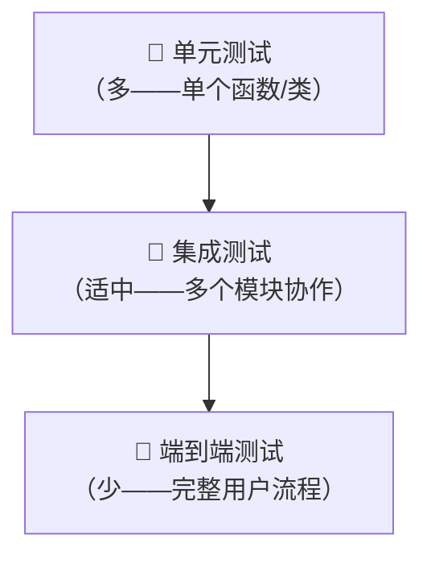
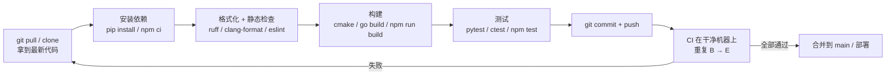

# $\rm Chapter \, 19$ 依赖、构建、测试与 CI

> 你的论文管理器项目现在有 C++ 写的命令行工具、Python 写的后端和数据处理脚本、一些 JSON 数据文件和几个第三方库。每次改完代码，你需要：重新编译 C++ 部分、确认 Python 依赖没被破坏、运行测试、格式化代码、检查有没有忘记 `delete`——这些步骤如果全靠手动，每次都要十分钟且大概率漏掉某一步。本章把"从源码到可部署产物"的整个流水线统一讲清楚。

## $\rm \S \, 19.1$ 构建：不只 `g++ main.cpp`

### $\rm \S \, 19.1.1$ 构建系统的统一视角

CMake 是 C++ 生态中最通用的构建系统，但不是唯一的，也不是每种语言都需要它。

**构建系统**（build system）的核心任务是：读取你对"如何从源码生成产物"的描述，确定依赖关系，然后只对变化的部分重新构建。

你在[第 13 章 C++ 工程](../06-编程语言/13-C++从竞赛到工程.md)中已经用过 CMake——在 `CMakeLists.txt` 中声明源文件和编译选项，CMake 生成 Makefile 或 Ninja 文件，再由 Make/Ninja 调用 `g++` 编译。这是 C++ 生态最通用的方案，也是你目前唯一需要掌握的构建系统。

下面是各种语言的主流构建工具。当你在其他项目中遇到陌生的构建文件时，回来查这张表。

| 语言 | 构建/任务工具 | 描述文件 | 一句话 |
|---|---|---|---|
| C++ | CMake + Make/Ninja | `CMakeLists.txt` | CMake 生成构建文件，Make/Ninja 实际调用编译器 |
| C++ | Meson | `meson.build` | C++ 新兴构建系统，配置更简洁，但社区和教程资源比 CMake 少 |
| C++ (Windows) | MSBuild | `.vcxproj` | Visual Studio 的构建引擎 |
| Python | setuptools / hatch / poetry | `pyproject.toml` | Python 包构建；纯脚本项目常常不需要构建步骤 |
| Node.js | npm scripts | `package.json` 中的 `"scripts"` | `npm run build` → 执行任意命令 |
| Rust | Cargo | `Cargo.toml` | 构建 + 包管理 + 测试 + 文档，一体化 |
| Go | `go build` | `go.mod` | 不需要单独的构建文件——源码结构就是构建描述 |
| Java | Maven / Gradle | `pom.xml` / `build.gradle` | 管理依赖、编译和打包 |

### $\rm \S \, 19.1.2$ 任务运行器：当"构建"不只是一次编译

你的项目中可能混合了多种语言——C++ 的 CLI 用 CMake，Python 的后端需要 `pip install`，前端（以后会加入，详见[第 20 章 Node.js 与前端工具链](20-Nodejs-npm与前端工具链.md)）需要 `npm run build`。你不想手动跑三次不同的命令。

**任务运行器**（task runner）把多个命令编排为一个工作流。最简单的方案是 `Makefile`（不是只能给 C 用）：

```makefile
# Makefile
.PHONY: build test clean

build:
	cd cpp-parser && cmake --build build
	pip install -r requirements.txt

test:
	cd cpp-parser && cmake --build build --target test
	python -m pytest tests/

clean:
	rm -rf cpp-parser/build
	rm -rf __pycache__
```

现在 `make build` 跑所有构建步骤，`make test` 跑所有测试，`make clean` 清理。新队友拿到项目后只需要记住三个命令。

更复杂的需求用 **Task**（taskfile.dev，Go 写的 YAML 任务工具）或 **Just**（just.systems，类似 Make 但语法更友好）。它们解决的根本问题是同一个：**把多步骤的构建/测试/部署流程编码为一个短命令**。

---

## $\rm \S \, 19.2$ 依赖管理：项目的"购物清单"

### $\rm \S \, 19.2.1$ 直接依赖 vs 间接依赖

你在 `pyproject.toml` 中写 `numpy>=1.24`——这是**直接依赖**（项目直接使用的包）。但 `numpy` 本身又依赖了 `libopenblas`、`libgfortran` 等底层库——这些是**间接依赖**（传递依赖）。

在 JS 生态中，`npm install express` 可能会安装几百个包——`express` 只依赖几十个，这几十个又各自有依赖。这就是为什么一个简单的 Node.js 项目的 `node_modules/` 可能有几千个文件和几百 MB。

间接依赖的问题：`numpy` 使用的 `libopenblas` 版本有安全漏洞，但 `numpy` 还没有更新——你的项目间接受影响。`pip audit`（pip-audit）和 `npm audit` 可以扫描已知漏洞，但你仍然需要等上游修复。

### $\rm \S \, 19.2.2$ 版本约束与冲突

在[软件、运行时、SDK 与包管理器](../02-终端与工具/07-软件运行时SDK与包管理器.md)中你见过 manifest 和 lockfile 的分工。版本约束写在你编辑的 manifest 中：

```text
numpy>=1.24,<2.0        # 任何 1.24+ 但不到 2.0 的版本
requests~=2.31.0        # 兼容 2.31.0（≈ >=2.31.0, <2.32.0）
click==8.1.7            # 精确版本
```

**语义化版本**（SemVer，semver.org）用 `MAJOR.MINOR.PATCH` 格式传达兼容性承诺：

- MAJOR 增加 → 不兼容的 API 修改。`1.x` 和 `2.x` 不能互换。
- MINOR 增加 → 向后兼容的新功能。`1.14` 和 `1.15` 应该能互换。
- PATCH 增加 → 向后兼容的 Bug 修复。`1.14.0` 和 `1.14.1` 应该能互换。

**但不要盲信版本号**。SemVer 依赖维护者的主观判断——有的包在 MINOR 升级中引入了破坏性变更，有的包永远 0.x（表示"还没有稳定 API"）。Node.js 生态中 `~` 和 `^` 操作符的语义与 Python 的 `~=` 不完全相同。不同生态的"兼容"定义有细微差异，但核心思想相同。

### $\rm \S \, 19.2.3$ 依赖冲突的典型场景

```text
你的项目 → paper-parser(需要 numpy>=1.24)
你的项目 → viz-tools(需要 numpy==1.22)
```

两个直接依赖要求同一个包的互不兼容版本。Python 的 pip 在这种情况下会报错（dependency conflict）并拒绝安装。Node.js 的 npm 可以在 `node_modules/` 中为不同包安装不同版本的同一个库（嵌套依赖），但会增加体积和加载复杂度。

解决办法：升级 `viz-tools` 到支持新版 numpy 的版本；或者 fork `viz-tools` 自己适配；或者重新评估是否真的需要 `viz-tools`。

---

## $\rm \S \, 19.3$ 测试：从"OJ 评测"到"工程测试"

### $\rm \S \, 19.3.1$ 测试金字塔



- **单元测试**：测试单个函数或类的一个方法。输入→输出，没有外部依赖（数据库、网络、文件系统）。快（毫秒级）、隔离、大量。
- **集成测试**：测试多个模块之间的协作。比如"HTTP 请求 → 路由 → controller → 数据库 → 响应"。较慢、需要准备测试环境。
- **端到端测试**（E2E）：模拟真实用户操作——打开浏览器、点击按钮、验证页面显示正确文本。最慢、最脆弱、但也最接近"用户实际看到的东西"。

在 OJ 上，你的"测试"是评测机的输入输出比较——这本质上是一种单元测试（测试入口函数 `main` 对整个输入文件的输出）。

### $\rm \S \, 19.3.2$ C++ 测试框架速览

在[从竞赛 C++ 到工程 C++](../06-编程语言/13-C++从竞赛到工程.md)中你见过 Google Test 的基本语法。更多选择：

| 框架 | 特点 |
|---|---|
| **Google Test** | 工业标准，配套 GMock（mock 框架），文档丰富 |
| **Catch2**（github.com/catchorg/Catch2） | 单头文件，BDD 风格（`SCENARIO`），适合中小项目 |
| **doctest**（github.com/doctest/doctest） | 超轻量（编译比 Catch2 快很多），API 兼容 Catch2 |

### $\rm \S \, 19.3.3$ 测试替身：隔离被测对象

测试"从数据库读取论文并过滤"的逻辑时，你不想真的启动一个数据库——那会让测试变慢、依赖外部服务、且数据状态不可预测。

**Mock/Stub/Fake**（统称测试替身 test doubles）是你的替代品。一个 stub 版本的"数据库"可能只是一个返回固定数据的函数：

```cpp
// Stub：假装这是数据库查询的结果
std::vector<Paper> fake_database() {
    return {{"Paper A", 2020}, {"Paper B", 2021}};
}

TEST(FilterTest, RecentPapers) {
    auto papers = fake_database();
    auto recent = filter_recent(papers, 2020);
    EXPECT_EQ(recent.size(), 2);
}
```

测试不验证"数据库查询是否正确"（那是数据库驱动层的集成测试的责任），而是验证"给定某种数据，过滤逻辑是否正确"。

---

## $\rm \S \, 19.4$ CI：另一台干净机器上的自动检查

### $\rm \S \, 19.4.1$ 为什么需要 CI

你在自己的机器上写了代码、编译通过、测试全绿、推送到 GitHub。第二天队友在你的代码上改了一行，编译失败——但他的机器上失败了不代表你的代码有问题（可能是平台差异、未提交的本地配置、忘记推送的依赖更新）。

CI 把代码从 GitHub 拉到一个**干净的虚拟机**中（没有你本地的缓存、未提交的文件、全局安装的工具），从头安装依赖、构建、运行测试。只有在这台干净机器上全部通过，才算真正"能构建、测试通过"。

这在本质上和 OJ 的评测机制相同——你的 OJ 提交在评测机上编译运行，不依赖你本地的任何环境。把 CI 理解为"你项目的评测机"，概念完全吻合。

### $\rm \S \, 19.4.2$ GitHub Actions 的最小 CI

在[GitHub：远程仓库与协作](18-GitHub使用与协作.md)中你见过 GitHub Actions 的基本概念。一个实际的三语言项目 CI：

```yaml
# .github/workflows/ci.yml
name: CI
on: [push, pull_request]

jobs:
  cpp:
    runs-on: ubuntu-latest
    steps:
      - uses: actions/checkout@v4
      - run: sudo apt install cmake g++
      - run: cmake -B build && cmake --build build
      - run: cmake --build build --target test

  python:
    runs-on: ubuntu-latest
    steps:
      - uses: actions/checkout@v4
      - uses: actions/setup-python@v5
        with: { python-version: '3.12' }
      - run: pip install -r requirements.txt
      - run: ruff check . && mypy src/
      - run: pytest

  frontend:  # 以后会加入
    runs-on: ubuntu-latest
    steps:
      - uses: actions/checkout@v4
      - uses: actions/setup-node@v4
        with: { node-version: '20' }
      - run: npm ci
      - run: npm run build
```

三个 job 并行运行——C++ 和 Python 的构建同时进行，互不等待。任意一个失败，PR 旁边就会出现红色的叉号。

### $\rm \S \, 19.4.3$ CI 平台的替代选择

| 平台 | 特点 |
|---|---|
| **GitHub Actions** | 与 GitHub 深度集成，免费额度（公开仓库无限） |
| **GitLab CI** | GitLab 内置，`.gitlab-ci.yml` 文件和 GitLab Runner |
| **Jenkins** | 老牌自托管 CI，Java 生态，极灵活 |
| **CircleCI / Travis CI** | 早期 SaaS CI 先驱 |
| **pre-commit**（pre-commit.com） | 本地 Git hook 管理器——在 `git commit` 前自动运行 linter/formatter。比 CI 更快（秒级），但不能替代 CI（不在干净环境中运行） |

---

## $\rm \S \, 19.5$ 一个完整的工作流

把依赖、构建、测试和 CI 串起来：



这套流程对任何语言任何项目都适用——只是具体命令不同。你在本地跑 B→E 只需要几十秒（增量构建），CI 上可能需要几分钟（从零开始），但两者执行的逻辑完全相同。

---

## $\rm \S \, 19.6$ 静态库与动态库

### $\rm \S \, 19.6.1$ 为什么需要库

§19.5 的工作流里"构建"只是一个框，这一节把它拆开。你在[第 1 章 计算机程序与开发全景](../01-基础观念/01-计算机程序与开发全景.md)见过完整链条：编译器把每个源文件编译成目标文件（`.o`），链接器再把目标文件和库连成可执行文件。目标文件是编译产物，可执行文件是最终产物，中间缺一种形态——**库**（library）：把编译好的目标文件打包，供多个程序复用。

问题出在复用上。论文管理器的 C++ 部分将来可能有三个程序：CLI、批量导入器、统计工具，都要用 `parse_paper()`。按第 13 章的做法，每个程序都要把 `paper.cpp` 一起编译链接，同一份代码被复制进三个可执行文件；改一行 `parse_paper()`，三个程序全部重新编译。库把"编译一次"和"到处使用"分开。按编译时复制还是运行时加载，库分为两类：静态库和动态库。

### $\rm \S \, 19.6.2$ 静态库：编译时复制

**静态库**（static library）在 Linux/macOS 上叫 `libxxx.a`，在 Windows 上叫 `.lib`。链接时，链接器把静态库中用到的目标文件**复制进**可执行文件——链接完成后，可执行文件不再需要这个库文件，拷到别的机器直接能跑。

最小示例（Linux，bash，在 `cpp-parser/` 目录下）：

```bash
g++ -c paper.cpp -std=c++17 -o paper.o   # 只编译不链接，得到目标文件
ar rcs libpaper.a paper.o                # ar 把目标文件打包成静态库
g++ main.cpp -L. -lpaper -o paper-cli    # 链接：把用到的代码从库里复制进来
```

- `-c`：只编译、不链接——第 13 章"改一个 .cpp 只重编译它再链接"的前提就是它。
- `ar rcs`：归档工具（archive），`r` 加入、`c` 创建、`s` 生成索引。`libpaper.a` 本质上是一个装着 `.o` 的包。
- `-L.`：告诉链接器到当前目录找库；`-lpaper`：找名为 `libpaper.a` 的文件——`lib` 前缀和 `.a` 后缀是命名约定，`-l` 只写中间的名字。

静态库的代价也在这条链上：三个程序就有三份 `parse_paper()` 的机器码，磁盘和内存都重复；库一更新（重新 `ar` 打包），所有使用它的程序都得**重新链接**。（Windows 上 MSVC 的 `.lib` 还有另一种形态——dll 附带的"导入库"，只记录函数入口、不包含代码，遇到 `.lib` 和 `.dll` 同名成对出现时就是它。）

### $\rm \S \, 19.6.3$ 动态库：运行时加载

**动态库**（shared library，共享库）在 Linux 上叫 `libxxx.so`（shared object），在 Windows 上叫 `.dll`（Dynamic Link Library）。链接时只记录"我要用这个库"，不复制代码；程序运行时，操作系统把库加载进内存，多个程序共享同一份。

```bash
g++ -c -fPIC paper.cpp -std=c++17 -o paper.o   # -fPIC（位置无关代码）：动态库编译的常规要求
g++ -shared -o libpaper.so paper.o             # 生成动态库
g++ main.cpp -L. -lpaper -o paper-cli          # 链接命令与静态库完全相同
```

链接命令一样，产物却"欠债"——运行 `./paper-cli` 通常会报 `error while loading shared libraries: libpaper.so: cannot open shared object file`。这个报错你在[第 11 章 系统服务、日志与软件安装](../03-计算机系统/11-系统服务日志与软件安装.md)排过（`LD_LIBRARY_PATH` 就是那里的工具），在这里它恰好是动态库代价的证据：**可执行文件不再自包含**，目标机器上必须有版本匹配的库，否则启动即失败。Windows 上这种版本冲突有个专门的名字：**DLL Hell**（DLL 地狱）——程序 A 更新了一个共享 dll，程序 B 突然无法启动。

> **类比**：静态库像把公式表复印进每个人的笔记本，人手一份、互不干扰，但公式表改版时每本都要重新复印；动态库像教室墙上贴一张公共公式表，所有人看同一张、省纸，但换新表时依赖旧记号的人会瞬间看不懂——这就是动态库的版本兼容问题。

收益对应代价：一个 `.so` 在内存里只加载一份；修复 bug 只需替换库文件，使用它的程序下次启动即用新版（**热更新**），不必重新编译链接——前提是函数接口没变。

### $\rm \S \, 19.6.4$ 你的程序已经在用动态库

用第 11 章的 `ldd` 看上面静态链接出的 `paper-cli` 依赖哪些库（Ubuntu 示例，具体输出随系统而异）：

```bash
ldd ./paper-cli
# 	linux-vdso.so.1
# 	libstdc++.so.6
# 	libc.so.6
# 	ld-linux-x86-64.so.2
```

列表里没有 `parse_paper()`——静态链接时它已经复制进二进制了。`libstdc++.so.6` 是 C++ 标准库实现，`libc.so.6` 是 C 运行库：你每次写 `#include <iostream>` 编译出的程序都在用它们，只是编译器默认帮你链好，你没看见。如果用 §19.6.3 的动态库链接，`ldd` 列表里会多出 `libpaper.so` 一行——这是"你的程序在用动态库"最直观的证据。Windows 没有 `ldd`，可以用 Process Explorer 或微软的 Dependencies 工具查看进程加载了哪些 dll。

怎么选（经验规则）：**自己项目内部的代码，优先静态库**——部署少一个"目标机器有没有这个库、版本对不对"的变量；**被多个程序共享、或需要热更新的代码，才用动态库**。对绝大多数项目，你不需要亲手造动态库——系统库和第三方库已经替你把这个机制用上了。接口变没变、谁来承诺，正是下一节版本号要回答的问题。

> **竞赛生迁移提示**：OJ 上你只提交一份 `main.cpp`，评测机把它编成一个可执行文件，代码没有第二个消费者，库的概念无从显现；工程里"可执行文件"不是唯一产物——库本身也是可以交付的构建产物。

---

## $\rm \S \, 19.7$ 语义化版本

### $\rm \S \, 19.7.1$ 版本号是兼容性承诺

§19.2.2 已经定义了语义化版本的三个数字，当时站在"选依赖"的角度读别人的版本号；这一节换到"发布自己的项目"的角度：你的库或程序每发一个新版本，都要回答所有使用者同一个问题——**升级会不会破坏我的代码？** 语义化版本用 `MAJOR.MINOR.PATCH`（如 `2.1.3`）把这个承诺编码进版本号：

- **MAJOR** 递增：不兼容的 API 修改——使用者**必须改代码**才能升级，1.x 的代码在 2.x 下可能编译不过或行为不同。
- **MINOR** 递增：向后兼容的新功能——升级安全，还能用新东西。
- **PATCH** 递增：向后兼容的 bug 修复——升级应该无感，只是更正确。

注意"兼容"是维护者的承诺，不是自动成立的事实（§19.2.2 说过不要盲信版本号）。对使用者：MAJOR 要警惕，升级前先读 §19.8 的变更记录；对维护者：升 MAJOR 是强加给所有使用者的一次升级成本，动手前想清楚。

### $\rm \S \, 19.7.2$ 各生态的"允许范围"写法

版本号要能被工具使用，得翻译成"允许安装哪个范围"。npm 的 `package.json` 里（§19.2.1 的 express 就住在那里）：

```json
{
  "dependencies": {
    "express": "^4.18.2",
    "moment": "~2.29.4"
  }
}
```

- `^4.18.2`（npm 的默认写法）：允许 `>=4.18.2, <5.0.0`——4.x 里的任意最新版，但绝不超过 5.0.0。
- `~2.29.4`：允许 `>=2.29.4, <2.30.0`——只在 2.29.x 内更新。

`npm install` 会挑约束内当前最新的版本，并把实际选中的那一版写进 `package-lock.json`（[第 7 章](../02-终端与工具/07-软件运行时SDK与包管理器.md)讲过 lockfile）——约束是意图，lockfile 是事实。Python 的 `requirements.txt` 没有 `^`，用显式区间表达同一意图：

```text
numpy>=1.20,<2.0
```

numpy 的 MINOR 更新（1.21、1.22……）都会装上，2.x 不会。`^1.2.3` 与 `numpy>=1.20,<2.0` 的比较维度相同，都是"允许的版本范围"，只是语法不同。

### $\rm \S \, 19.7.3$ 0.x：还没承诺稳定

约定：**0.x（如 0.1.0、0.3.2）表示"API 尚未承诺稳定"**。此时 MAJOR 恒为 0，MINOR 递增也可以包含破坏性变更——`0.2.0` 里用得好好的接口在 `0.3.0` 消失，不算违约。所以看到依赖是 0.x 要谨慎：每次升级前都读它的变更记录。

何时升到 1.0？经验规则：**当你开始对外承诺 API 稳定时**——有真实的使用者（哪怕只有你自己之外的一个人），并且愿意承担"破坏性变更必须用 MAJOR 表达"的责任。版本号是承诺，不是功劳簿：加了一堆功能只升 MINOR；改了一个接口名就要升 MAJOR。

> **经验规则**：给论文管理器定版本：`0.1.0` 起步，加功能升 MINOR、修 bug 升 PATCH；等后端 API 有第二个使用方、你愿意承诺接口稳定时，才升 `1.0.0`。

---

## $\rm \S \, 19.8$ Changelog 与 Release Notes

### $\rm \S \, 19.8.1$ 用户升级前想知道什么

语义化版本只承诺"这次会不会破坏"——MAJOR 会，MINOR/PATCH 不会。但使用者真正想问的是：**破坏的是哪个接口？旧写法是什么、新写法是什么？** 这是版本号回答不了的，需要一份具体记录。

**Changelog**（变更日志）就是这份记录：项目根目录下一个叫 `CHANGELOG.md` 的文件，按版本倒序记录每次发布的变更。它写给"升级的人"看，不是写给开发者自己看——记"使用者能观察到的变化"（接口、行为、输出格式），而不是"我重构了内部代码"。

### $\rm \S \, 19.8.2$ Keep a Changelog 格式

最通用的约定是 **Keep a Changelog**（keepachangelog.com）：每个版本一个小节，标题是版本号加发布日期，小节内按 **Added / Changed / Fixed / Removed** 四类列条目——新增功能、行为或接口变化、bug 修复、删除的功能。顶部永远保留一个 `[Unreleased]` 小节，积累还没发布出去的变更：

```markdown
# Changelog

## [Unreleased]
### Changed
- 后端 API 改为返回 JSON，不再返回 CSV（破坏性变更，旧字段名 title 改为 name）

## [0.2.0] - 2026-08-01
### Added
- `/api/papers/search` 接口，支持按标签筛选论文
### Fixed
- 修复 CSV 中带逗号的标题被错误分列的问题

## [0.1.0] - 2026-07-01
### Added
- 命令行工具 `paper-cli`：解析论文列表并输出 JSON
```

写法要点：破坏性变更写清楚"旧用法 → 新用法"；每条一行、动词开头、用使用者的语言；不要写"修复了一些 bug"这种零信息条目。

### $\rm \S \, 19.8.3$ 与 Release Notes 的分工

**Release Notes**（发布说明）是"发布这一次"时写给用户的说明——GitHub 的 Releases 页面、发版邮件、更新公告都属于它；Changelog 是仓库里持续维护的完整记录。两者内容高度重叠：发布时把 Changelog 对应版本的小节复制出来，就是当次的 Release Notes。

> **经验规则**：日常流程是"改代码 → 在 [Unreleased] 下记一条 → 发版时补上版本号和日期、把该小节移到已发布区"。让 changelog 与版本号同步：MAJOR 升级那一版，Changed 下一定有一串破坏性变更——这正是使用者最需要读的部分。

---

## $\rm \S \, 19.9$ 可复现构建

### $\rm \S \, 19.9.1$ 同一份源码，两次构建

论文管理器 0.2.0 上线三个月后，用户报了一个只在旧版本出现的 bug。你 `git checkout` 当时的提交（第 17 章）重新构建、准备复现——但新构建出的程序和当时发布的不一致，bug 复现不出来。源码没变，变的是**构建环境**：当时的编译器、依赖、机器，都已经是三个月前的了。

于是有了一个标准：**可复现构建**（reproducible build）——同一份源码、同一台机器、不同时间构建，产物应该**逐字节相同**（byte-for-byte）。有了它，"这个二进制确实是这份源码编出来的"才可验证；旧版本出问题才能按原样重建。

### $\rm \S \, 19.9.2$ 什么在破坏可复现性

最小的例子就在 C++ 里：`__DATE__` 和 `__TIME__` 预定义宏会把编译时刻写进产物：

```cpp
std::cout << "构建于 " << __DATE__ << " " << __TIME__ << "\n";
```

```bash
g++ -std=c++17 -o app main.cpp && sha256sum app   # 第一次构建并计算哈希
sleep 2 && g++ -std=c++17 -o app main.cpp && sha256sum app
# 两次 sha256 不同——__TIME__ 精确到秒，二进制里嵌入了不同的时间
```

`sha256sum` 输出文件的 SHA-256 哈希，内容差一个字节哈希就完全不同——它是"两个产物是否逐字节相同"的测量工具。除了时间戳，常见的破坏因素还有几类：

- **构建路径**：调试信息会嵌入源文件的绝对路径——`/home/you/project` 和 CI 的 `/build` 编出来的二进制不同。
- **随机数**：部分构建工具每次生成随机的 build ID。
- **环境变量**：PATH 里的编译器版本、`CFLAGS` 等编译选项、依赖版本——这是最大的变量，编译器升级一次，同一份源码的产物就变一次。

### $\rm \S \, 19.9.3$ 两条捷径：lockfile 与 Docker

日常项目不需要手工解决全部因素，两条现成路径覆盖绝大多数情况。

**依赖锁定**。`package-lock.json`（npm）、`poetry.lock`（Python）——第 7 章和 §19.2 的 lockfile，作用就是让"装的依赖版本"可复现。依赖是产物差异的最大来源，锁住依赖就锁住大半。

**环境固定**。Docker（[第 27 章](../08-部署运维/27-Docker基础.md)）把整个构建环境——操作系统、编译器、依赖——封进镜像。只要 Dockerfile 不变，构建环境就不变，产物基本一致。这是通往可复现构建的捷径：你不必手工处理时间戳、路径这些细节，环境整体被固定了。

验证方法：同一环境构建两次，比较 `sha256sum` 的输出。日常项目做到"lockfile + 固定环境（CI 或 Docker）"已经足够；追求连时间戳、路径都固定的严格逐字节复现，属于专业领域，需要时再深入。

> **类比**：可复现构建像菜谱的完整记录——菜谱（源码）一样，食材批次（依赖）不同、灶具（环境）不同，成品就不会完全一样。lockfile 锁食材批次，Docker 锁灶具。

---

## $\rm \S \, 19.10$ 动手实践

### 实践一：给论文管理器加 CI

1. 在项目根目录创建 `.github/workflows/ci.yml`。
2. 先只加入一个 job（Python 测试）。
3. 推送并观察 GitHub Actions 标签页——job 是否在运行？通过了还是失败了？
4. 故意在测试中制造一个失败，再次推送——观察 PR 上的红色叉号。

### 实践二：用 Makefile 编排多命令

1. 创建一个 `Makefile`，包含 `build`、`test`、`clean` 三个目标。
2. 确保 `make build` 和 `make test` 能连续执行（build 的产物能被 test 使用）。
3. 故意改坏一个源文件，运行 `make build`——观察 Make 是否报错并停止。

### 实践三：扫描依赖漏洞

```bash
pip install pip-audit
pip-audit           # 检查已安装的包是否有已知漏洞
```

如果你用 Node.js：

```bash
npm audit
```

### 实践四：把代码打包成静态库（需要 Linux 或 WSL）

1. 在 `cpp-parser/` 下挑一个不依赖其他模块的源文件（如 `paper.cpp`），执行 `g++ -c paper.cpp -std=c++17 -o paper.o`，再用 `ar rcs libpaper.a paper.o` 打包成静态库。
2. 执行 `g++ main.cpp -L. -lpaper -o paper-cli` 链接并运行——行为应当与直接编译所有源文件时一致。
3. 重新用动态库链接（`g++ -c -fPIC paper.cpp -std=c++17`，再 `g++ -shared -o libpaper.so paper.o`），运行 `ldd ./paper-cli`——观察列表里多出的 `libpaper.so` 一行。

### 实践五：写 CHANGELOG.md

1. 在项目根目录创建 `CHANGELOG.md`，用 Keep a Changelog 格式记下最近完成的三项改动，分别归入 Added / Changed / Fixed。
2. 为当前状态定一个版本号（如 `0.1.0`），补一个带日期的小节，把这三项改动写进去。
3. 想象一个破坏性变更（如改一个函数名），写进 `[Unreleased]` 的 Changed，并保证这一条让"升级的人"一眼看懂"旧写法 → 新写法"。

---

## $\rm \S \, 19.11$ 总结

- 构建系统管理"从源码到产物"的过程。不同语言有不同工具（CMake/npm/Cargo/Maven），但核心原理相同：描述依赖关系，只重建变化的部分。
- 依赖管理有 manifest（人的意图）和 lockfile（机器的精确记录）两层。SemVer 是约定，不应盲信。
- 测试金字塔：大量快速单元测试 + 适量集成测试 + 少量端到端测试。测试替身隔离被测对象。
- CI 在干净机器上重复构建→测试流程。和 OJ 评测是同一个思想——不依赖个人环境。
- 静态库（`.a`/`.lib`）编译时把代码复制进可执行文件，动态库（`.so`/`.dll`）运行时加载；内部代码优先静态，多程序共享或热更新才用动态。
- 语义化版本是兼容性承诺（MAJOR 破坏 / MINOR 新功能 / PATCH 修复），changelog 记录具体变更，lockfile 与固定环境让构建可复现。

---

## $\rm \S \, 19.12$ 关键概念回顾

1. 直接依赖和间接依赖分别是什么？lockfile 为什么必须提交到 Git？
> 直接依赖是项目直接使用的包，间接依赖是这些包再依赖的传递依赖；提交 lockfile 才能保证团队和 CI 安装的精确版本（含间接依赖）完全一致。

2. 语义化版本 `2.1.3` 中三个数字分别意味什么？
> 2=MAJOR（不兼容的 API 修改）、1=MINOR（向后兼容的新功能）、3=PATCH（向后兼容的 bug 修复）；版本号是维护者的承诺，不应盲信。

3. `Makefile` 中的 `.PHONY` 是什么意思？
> 声明这些目标是伪目标（不是文件名）：即使目录里恰好有同名文件，make 也总是执行规则——build/test/clean 这类命令目标必须声明。

4. 静态库和动态库的区别是什么？自己项目内部的代码为什么优先静态库？
> 静态库（`.a`/`.lib`）链接时把代码复制进可执行文件，自包含但每个程序一份拷贝、更新需重新链接；动态库（`.so`/`.dll`）运行时加载、多程序共享一份，但有版本兼容问题（DLL Hell）；内部代码优先静态，因为部署少一个"目标机器库版本"的变量。

5. `package.json` 里 `^1.2.3` 和 `~1.2.3` 分别允许哪些版本？
> `^1.2.3` 允许 `>=1.2.3, <2.0.0`（同 MAJOR 内最新）；`~1.2.3` 允许 `>=1.2.3, <1.3.0`（同 MINOR 内最新）；实际选中的版本由 lockfile 记录。

## $\rm \S \, 19.13$ 应用与辨析

1. 构建系统和任务运行器有什么不同？
> 构建系统按描述文件确定依赖关系、只重建变化的部分（CMake、Cargo）；任务运行器把多个命令编排成工作流（Makefile、Task、Just），可以依次调用多个构建系统。

2. 单元测试和集成测试的区别是什么？什么时候用 Stub/Mock？
> 单元测试测单个函数/类（快、隔离、无外部依赖），集成测试测多个模块的协作；被测对象依赖数据库、网络等外部服务时用测试替身隔离，只验证被测逻辑。

3. CI 解决的核心问题是什么？为什么本地测试通过不能替代 CI 通过？
> 在干净虚拟机里从零安装依赖、构建、测试，排除本地缓存、未提交文件、全局工具等环境差异；本地通过只说明"在你的机器上通过"。

---

[Git：本地版本控制](17-Git与团队协作.md)处理了"代码版本"，[GitHub：远程仓库与协作](18-GitHub使用与协作.md)处理了"团队协作"，本章处理了"产物质量"。接下来，你需要把整个项目变成一个别人能通过浏览器访问的应用——这需要前端（HTML/CSS/JavaScript）和后端（Python API）协同工作。但在此之前，有一条分支路线：Node.js 和 npm 不仅是前端工具链的基石，也是理解现代 JavaScript 生态的钥匙。
