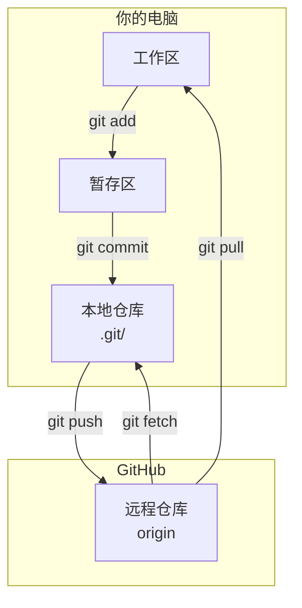
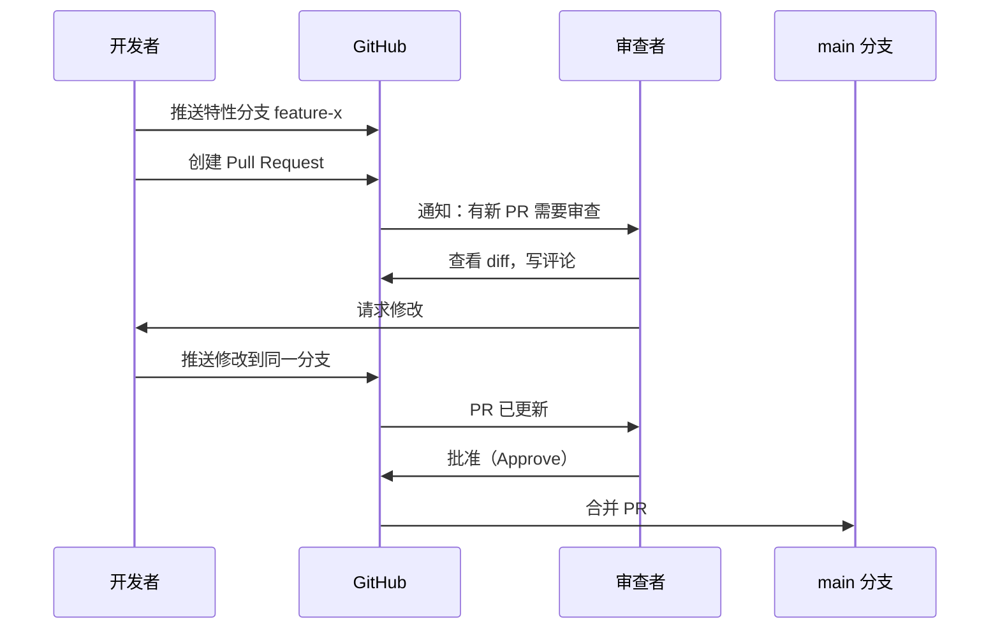

# $\rm Chapter \, 20$ GitHub：远程仓库与协作

> [上一章](./19-Git与团队协作.md)中的一切操作都在你自己的电脑上完成——只有你能看到那些提交。当你需要和队友协作、备份代码或在开源社区贡献时，需要一个远程仓库。GitHub 是最广泛使用的 Git 远程托管平台，但它不是 Git 本身——它是在 Git 之上添加了协作层、权限管理和自动化的服务。

> **开始前自检**：本章假设你已经会：□ 会用 git 做本地提交（第 19 章）；
> □ 理解远程与本地仓库的关系；
> □ 会用终端执行 git 命令。

## $\rm \S \, 20.1$ Git、GitHub、本地仓库和远程仓库的关系



- **Git** 是版本控制工具——你电脑上的命令行程序。
- **GitHub**（github.com）是一个网站 + 服务——托管 Git 仓库，加上 Issue、Pull Request、Actions 等协作功能。
- **GitLab**（gitlab.com）和 **Gitee**（gitee.com）提供类似的功能，底层都是 Git。本章以 GitHub 为例，但概念在其他平台上完全通用。
- **本地仓库**在你电脑的 `.git/` 中。**远程仓库**在 GitHub 的服务器上。一个本地仓库可以同时连接多个远程仓库。

---

## $\rm \S \, 20.2$ 第一次连接：从 `git clone` 开始

### $\rm \S \, 20.2.1$ 创建仓库

在 GitHub 网页上：点击右上角 `+` → `New repository` → 填写名称（如 `paper-manager`）→ 选择 Public 或 Private → 不要勾选 "Initialize with README"（如果本地已有代码）→ 创建。

GitHub 会显示后续步骤。如果你的本地项目已经存在：

```bash
cd paper-manager
git init
git add .
git commit -m "Initial commit"
git remote add origin https://github.com/YOUR_USERNAME/paper-manager.git
git push -u origin main
# -u 设置 upstream——之后只需 git push 即可
```

如果是从零开始或要参与已有的项目：

```bash
git clone https://github.com/USER/REPO.git
cd REPO
# 本地仓库已配置好，origin 指向远程仓库
```

### $\rm \S \, 20.2.2$ HTTPS vs SSH 认证

GitHub 需要验证"你确实是你"。两种方式：

| 方式 | URL 格式 | 优点 | 缺点 |
|---|---|---|---|
| **HTTPS**（加密 HTTP——详见第 24 章） | `https://github.com/USER/REPO.git` | 无需额外配置，任何网络环境通常都通 | 每次 push 要输用户名和 Token（可以用 Git 凭据管理器缓存） |
| **SSH** | `git@github.com:USER/REPO.git` | 配置一次后无需重复认证 | 需要生成 SSH 密钥对并上传公钥 |

SSH 密钥配置（在[SSH远程开发与服务器生存指南](../03-计算机系统/14-SSH远程开发与服务器生存指南.md)中你学过 SSH 远程连接的概念）：

```bash
# 生成密钥对（如果有现成的可以跳过）
ssh-keygen -t ed25519 -C "your_email@example.com"

# 复制公钥
cat ~/.ssh/id_ed25519.pub

# 粘贴到 GitHub → Settings → SSH and GPG keys → New SSH key
# 测试连接
ssh -T git@github.com
# "Hi USERNAME! You've successfully authenticated..."
```

**Token 和私钥永远不要出现在代码、命令行参数或环境变量中**——这是从[软件、运行时、SDK 与包管理器](../02-终端与工具/09-软件运行时SDK与包管理器.md)的安全原则在 Git 层面的延伸。GitHub 的 Personal Access Token 按仓库权限细分，定期过期——比你用主密码更安全。

---

## $\rm \S \, 20.3$ 远程协作的核心命令

### $\rm \S \, 20.3.1$ `fetch`、`pull`、`push`

```bash
git fetch origin                 # 从远程下载新数据，但不修改工作区
git log origin/main              # 查看远程 main 分支的最新提交
git diff main..origin/main       # 比较本地和远程的差异

git pull                         # = fetch + merge（把远程修改拉取并合并到当前分支）
git pull --rebase                # = fetch + rebase（把本地提交放在远程提交之后——更干净的历史）

git push origin main             # 把本地 main 分支推送到远程
```

**先 fetch 再决定怎么做**——这让你在合并之前看到远程到底有什么新东西。`git pull` 是捷径，但当你和远程有冲突时，先 `fetch` 再手动 `merge` 给更多控制。

### $\rm \S \, 20.3.2$ 推送被拒绝的常见情况

```bash
git push
# ! [rejected] main -> main 
# 原因：远程有你本地没有的提交。你的推送会覆盖它们。
```

解决：

```bash
git pull --rebase               # 先拉取远程更新，把你的提交放在上面
# 解决可能的冲突
git push
```

---

## $\rm \S \, 20.4$ Issue：不只是 Bug 报告

**Issue** 是 GitHub 的讨论线索。它可以用来：
- 报告 Bug（附最小复现步骤——回想[编辑器、IDE 与调试器](../02-终端与工具/05-编辑器IDE与调试器.md)中写最小复现的流程）
- 提议新功能
- 提问和讨论
- 用 Markdown 写格式化内容、贴代码、上传截图

一个好的 Issue 包含：
1. 清晰描述"发生了什么"和"期望发生什么"
2. 复现步骤（最小的操作序列）
3. 环境（操作系统、软件版本）
4. 相关日志或截图

---

## $\rm \S \, 20.5$ Pull Request：文明的代码合并方式

### $\rm \S \, 20.5.1$ PR 是什么

在[上一章](./19-Git与团队协作.md)中你直接在本地 `git merge`。在一个团队项目中，直接合并到 `main` 意味着一个人的错误会立刻影响所有人。

**Pull Request**（简称 PR，GitLab 中叫 Merge Request）在合并之前插入了一个**人类审查**的步骤：



### $\rm \S \, 20.5.2$ PR 工作流

```bash
# 1. 从 main 的最新状态开始
git switch main
git pull
git switch -c fix-parser-bug

# 2. 修复并提交
# ... 写代码 ...
git add -p
git commit -m "Fix year parsing for papers before 1900"

# 3. 推送到 GitHub
git push -u origin fix-parser-bug

# 4. 在 GitHub 网页上创建 Pull Request
#    - Base: main  ← Compare: fix-parser-bug
#    - 写标题和描述
#    - 请求审查者
#    - 创建 PR

# 5. 审查者提了建议 → 本地修改 → 推送
# ... 改代码 ...
git add .
git commit -m "Address review feedback: use std::stoi with try/catch"
git push

# 6. 审查通过 → 在 GitHub 网页上点击 "Merge pull request"

# 7. 清理本地
git switch main
git pull
git branch -d fix-parser-bug
```

### $\rm \S \, 20.5.3$ PR 的审查状态

| 状态 | 含义 |
|---|---|
| **Comment** | 一般性评论，不明确批准或拒绝 |
| **Approve** | 审查通过，可以合并 |
| **Request changes** | 必须修改后才能合并——阻止合并按钮 |

一个好的 PR 审查不是"找茬"，而是**共享代码的所有权**——审查者理解了你的修改，团队整体的代码质量在提升，未来出了问题时不止一个人知道这段代码的思路。

### $\rm \S \, 20.5.4$ fork 与 clone 的区别

**clone** 是拿到一个仓库的本地副本。你直接对原仓库有推送权限（如果你是协作者）。

**fork** 是把别人的仓库**完整复制**到你的 GitHub 账户下。你对 fork 有完全控制权（推送、修改、删除都不影响原仓库）。当你修改好并想贡献回原项目时，从你的 fork 向原仓库发起 Pull Request。

开源贡献的标准流程：

```text
1. fork 原仓库 → 你的 GitHub 账户下出现一个副本
2. git clone 你的 fork → 本地
3. 创建分支 → 修改 → 提交 → push 到你的 fork
4. 在 GitHub 上：你的 fork → 原仓库，发起 Pull Request
5. 原仓库维护者审查并合并（或要求修改）
```

---

## $\rm \S \, 20.6$ GitHub Actions：推送后自动发生的事情

GitHub Actions 是 GitHub 内置的 CI/CD（持续集成/持续部署）服务。你在仓库中创建 `.github/workflows/` 目录，放入 YAML 文件：

```yaml
# .github/workflows/test.yml
name: Run Tests
on: [push, pull_request]        # 每次推送或 PR 时触发
jobs:
  test:
    runs-on: ubuntu-latest
    steps:
      - uses: actions/checkout@v4
      - uses: actions/setup-python@v5
        with:
          python-version: '3.12'
      - run: pip install -r requirements.txt
      - run: python -m pytest
```

效果：每次有人推送代码或创建 PR，GitHub 自动在一台干净的虚拟机中检出代码、安装依赖、运行测试。如果测试失败，PR 旁边会出现一个红色叉号。要让失败**阻止合并**，需要在仓库 Settings → Branches 中启用分支保护（branch protection），并将该检查设为必需状态检查（required status check）——否则失败只是警告，合并按钮仍然可用。

这和 OJ 的"提交 → 自动评测 → 通过/失败"的流程何其相似——只是测试的不是算法题的输出，而是你的项目的测试套件。

---

## $\rm \S \, 20.7$ `.gitignore` 和 Secret

### $\rm \S \, 20.7.1$ `.gitignore`——永远不要让这些东西进入 Git

[文件系统与权限](../02-终端与工具/03-文件系统路径与权限.md)中你在项目目录中创建了 `.gitignore`。典型的 `.gitignore`：

```gitignore
# 构建产物
build/
*.exe
*.o
*.obj

# 依赖
node_modules/
venv/
__pycache__/

# 环境配置（含密钥）
.env

# IDE
.vscode/
.idea/

# 操作系统
.DS_Store    # macOS
Thumbs.db    # Windows
```

规则：编译产物、第三方依赖（可以从 lockfile 重建的）、包含密钥的配置文件、编辑器/OS 的临时文件——全部进 `.gitignore`。

### $\rm \S \, 20.7.2$ Secret 管理

GitHub 提供了 **Repository Secrets**（Settings → Secrets and variables → Actions）用于在 CI 中安全使用密钥。你在本地用 `.env` 文件（已加入 `.gitignore`），在 CI 中用 GitHub Secrets——密钥永远不会出现在仓库代码中。

如果密钥不小心被提交并推送了（哪怕只存活了一分钟）：**立即轮换密钥**——在服务提供商那边生成新密钥，旧密钥作废。从 Git 历史中删除只是补救措施，不能保证没有人已经 clone 了你的仓库。

---

## $\rm \S \, 20.8$ gh CLI：不离开终端完成协作

到目前为止，创建 Issue、发起 PR、查看 CI 状态都要打开浏览器。**gh**（GitHub CLI）是 GitHub 官方的命令行工具——这些操作全部可以在终端里完成，不用切换窗口：

```bash
gh auth login        # 首次使用：浏览器 OAuth 认证
gh repo clone torvalds/linux   # 克隆任意公开仓库
gh pr create --title "添加论文 CSV 导入" --body "实现从 CSV 文件批量导入论文"
gh pr list           # 查看当前仓库的 PR 列表
gh pr checkout 42    # 在本地检出 PR #42
gh issue create --title "搜索框不支持中文" --body "复现：输入中文关键词后按回车无反应"
gh run list          # 查看最近的 CI 运行
gh run watch         # 实时查看 CI 日志
```

其中 `gh pr checkout 42` 把 PR #42 的分支拉到本地并切换过去——审查别人的 PR 不再需要先到网页上找分支名；`gh run watch` 对应 §20.6 的 GitHub Actions——推送后不用刷新网页，直接在终端实时看 CI 每一步的输出。

为什么用 gh 而不是网页？快速操作更快、可以写进脚本自动化、手始终留在键盘上。网页版仍然有用——查看带渲染效果的讨论、管理仓库设置时更直观，两者互补。安装：Windows 用 `winget install GitHub.cli`，macOS 用 `brew install gh`，Linux 按 gh 官方文档（cli.github.com）添加 apt 源后安装。

---

## $\rm \S \, 20.9$ 实践

### 实践一：创建仓库并推送

1. 在 GitHub 上创建一个 Public 仓库。
2. 将论文管理器项目初始化为 Git 仓库。
3. 创建 `.gitignore`，提交，推送到 GitHub。
4. 在 GitHub 网页上确认文件已出现。

### 实践二：完整的 PR 流程

1. 在 GitHub 上从 `main` 创建一个 Issue（如"添加 CSV 导入功能"）。
2. 本地创建分支 `add-csv-import`，实现功能，提交，推送。
3. 在 GitHub 上创建 Pull Request，在描述中写上 `Closes #1`（自动关联 Issue）。
4. 自己审查自己的 PR diff——有没有不该出现的文件或调试代码？

### 实践三：SSH 认证

1. 生成 SSH 密钥对（如果没有的话）。
2. 将公钥添加到 GitHub Settings。
3. 用 SSH URL 克隆一个仓库，确认不需要输入密码。

---

## $\rm \S \, 20.10$ 总结

- GitHub 不是 Git——它是在 Git 基础上提供远程托管、Issue、Pull Request、Actions 等协作功能的平台。
- `clone` 是本地副本，`fork` 是完整仓库拷贝到你的账户。开源贡献用 fork + PR。
- PR 在合并前插入人类审查——不是官僚流程，而是代码质量保障和团队知识共享。
- GitHub Actions 在每次 push/PR 时自动运行测试（"云端 OJ"）。
- Token、私钥、`.env` 永远不进 Git。仓库应包含 `.gitignore` 和 lockfile，但不应包含构建产物和依赖目录。

---

## $\rm \S \, 20.11$ 关键概念回顾

1. Git 和 GitHub 的区别是什么？

2. `git fetch`、`git pull`、`git push` 分别做了什么？

3. clone 和 fork 有什么区别？什么时候用 fork？

4. Pull Request 在合并之前做了什么？为什么需要它？

5. GitHub Actions 的核心价值是什么？

## $\rm \S \, 20.12$ 应用与辨析

1. 密钥被推送到公开仓库后，第一步应该做什么？

2. HTTPS 和 SSH 两种远程认证方式分别适合什么场景？

## $\rm \S \, 20.13$ 本章自测答案

> 先闭卷作答本章"关键概念回顾"与"应用与辨析"，再核对以下答案。

### 自测答案 · 关键概念回顾
1. Git 是本地运行的版本控制工具；GitHub 是托管 Git 仓库并提供 Issue、Pull Request、Actions 等协作功能的网站/服务（GitLab、Gitee 类似）。
2. fetch 从远程下载新提交但不改动工作区；pull = fetch + merge（拉取并合并到当前分支）；push 把本地提交推送到远程。
3. clone 是拿到仓库的本地副本；fork 是把别人的仓库完整复制到你自己的 GitHub 账户下（不影响原仓库）；向原项目贡献代码时用 fork + PR。
4. 在合并前插入人类审查环节：查看 diff、讨论、请求修改、批准后才合并；它是代码质量保障，也让多人共享代码的所有权。
5. 每次 push 或创建 PR 时自动在干净虚拟机中安装依赖、构建、运行测试——项目的"云端 OJ"，失败会显示红叉并可用分支保护阻止合并。

### 自测答案 · 应用与辨析
1. 立即轮换密钥——在服务提供商处生成新密钥使旧密钥作废；从 Git 历史中删除只是补救，不能保证没有人已经 clone 了仓库。
2. HTTPS 无需额外配置、受限网络通常也通，但每次 push 需要用户名和 Token（可交给凭据管理器缓存）；SSH 需要先生成密钥对并上传公钥，配置一次后免重复认证——长期个人开发常用 SSH，临时环境或网络受限时用 HTTPS。

---

到这里，你已经能独立管理本地和远程仓库、参与团队协作。接下来，你写的代码不能一直靠手动 `g++` 和 `python script.py`——需要系统的依赖管理、构建自动化和测试体系。下一章比[软件、运行时、SDK 与包管理器](../02-终端与工具/09-软件运行时SDK与包管理器.md)更进一步，把依赖、构建、测试和 CI 串成完整的开发流水线。

> 你现在能：把本地仓库推送到 GitHub，用 clone/fork/PR 参与协作，配置认证，读懂 Issue 与 Actions 基本流程，并知道密钥泄露后如何处理
