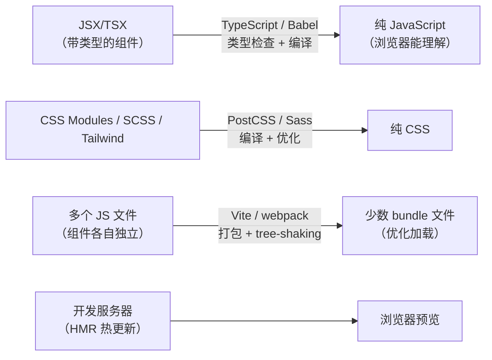

# $\rm Chapter \, 22$ Node.js、npm 与前端工具链

> npm（Node.js 的包管理器，第 9 章提过）装了几百个包到 `node_modules/`。`npm run dev` 启动了开发服务器。但你敲下这些命令时——`npm install` 到底做了什么？`node_modules` 为什么这么大？`npm run dev` 为什么能跑起来？这一章回答这些问题。

> **开始前自检**：本章假设你已经会：
>
> - □ 理解运行时与包管理器的分层模型（第 9 章）
> - □ 会读 package.json 之类的清单文件
> - □ 在终端运行过命令

## $\rm \S \, 22.1$ Node.js：浏览器之外的 JavaScript

### $\rm \S \, 22.1.1$ 同一个语言，不同的运行时

JavaScript 最初只能在浏览器中运行——按 `F12` 打开开发者工具，里面的 **Console**（控制台）面板可以直接输入 JavaScript 代码并立即看到结果，它就是一个浏览器 JavaScript 运行时（`F12` 工具的详细用法见第 24 章）。

**Node.js**（nodejs.org）在 2009 年改变了这一点——它把 Chrome 的 V8 JavaScript 引擎从浏览器中剥离出来，加上了文件系统、网络、进程等操作系统 API，让 JavaScript 可以像 Python 一样在终端中运行。

同一个 `console.log("hello")` 在浏览器中输出到开发者控制台，在 Node.js 中输出到终端。但可用 API 不同：
- 浏览器有 `document`、`window`、`fetch`、DOM API。
- Node.js 有 `fs`（文件系统）、`path`、`http`、`process`、没有 DOM。

这和[编程语言范式概览](../06-编程语言/16-编程语言范式概览.md)中讲的“同一种语言在不同运行时中可用的能力可能不同”是同一个道理——JavaScript 本身相同，但“能做什么”取决于运行时提供了什么 API。

### $\rm \S \, 22.1.2$ Node.js 的三大用途

安装 Node.js 不是因为你要写 Node.js 后端——前端工具链需要它。

前端构建工具（Vite/webpack）、代码质量工具（ESLint/Prettier）和后端服务（Express/Fastify）都基于 Node.js。当你第一次运行 `npm run dev` 时，回来查这张表就知道它实际在做什么。

| 场景 | 说明 | 工具举例 |
|---|---|---|
| **前端构建** | 把源码（TSX/SCSS）编译打包成浏览器能直接运行的 HTML/CSS/JS | Vite、webpack——`npm run dev` / `npm run build` |
| **代码质量** | 格式化、静态检查、类型检查——在编译前发现问题 | Prettier、ESLint、TypeScript 编译器 |
| **后端服务** | 用 JavaScript 写 HTTP 服务端（本书不展开） | Express、Fastify、Next.js |

一个典型的前端项目中，你不需要写任何 Node.js 代码——但你使用的所有工具都运行在 Node.js 之上。

---

## $\rm \S \, 22.2$ npm：不止是“装包的”

### $\rm \S \, 22.2.1$ npm 的三个身份

**npm**（npmjs.com）同时是：

1. **包注册表**（registry）：托管 JavaScript 包的中央服务器——类似 PyPI（Python）或 crates.io（Rust）。
2. **命令行客户端**：终端中的 `npm` 命令，随 Node.js 一起安装。
3. **包管理生态**：`package.json`、lockfile、`node_modules/` 的约定。

这三者在[软件、运行时、SDK 与包管理器](../02-终端与工具/09-软件运行时SDK与包管理器.md)的六层模型中，分别对应“远程包源”“包管理器客户端”和“依赖记录文件”——和 Python 的 PyPI/pip/requirements.txt 是同一个结构。

### $\rm \S \, 22.2.2$ `package.json`：不只是依赖清单

```json
{
  "name": "paper-manager-frontend",
  "version": "0.1.0",
  "scripts": {
    "dev": "vite",
    "build": "vite build",
    "preview": "vite preview",
    "lint": "eslint src/",
    "format": "prettier --write src/"
  },
  "dependencies": {
    "react": "^18.3.1"
  },
  "devDependencies": {
    "vite": "^5.4.0",
    "eslint": "^9.0.0",
    "prettier": "^3.3.0"
  }
}
```

`dependencies` 和 `devDependencies` 的区别：

- **dependencies**：运行时需要——用户访问你的网站时，浏览器会加载 React。
- **devDependencies**：只在**开发/构建时**需要——Vite 负责构建打包，Prettier 负责格式化，ESLint 负责检查。它们不会出现在最终发给用户的产物中。

Python 的 `requirements.txt` 没有这个区分（`pip install` 的 `--dev` 依赖第三方工具实现）。区分 dev/prod 依赖可以让生产部署的 `node_modules/` 大幅减小。

### $\rm \S \, 22.2.3$ `node_modules` 为什么这么大

[依赖、构建、测试与 CI](21-依赖构建测试与CI.md)中讨论过直接依赖和间接依赖——这正是 `node_modules` 膨胀的根源。

`npm install express` 的结果：你只添加了一个直接依赖，但 npm 安装了 express 自身的 30 个直接依赖，这 30 个各自还有依赖……最终的 `node_modules/` 可能有 200+ 个包。这是 JavaScript 生态的特点——细粒度模块化（一个包通常只做一件事），导致依赖树又深又宽。

`npm ci`（clean install）比 `npm install` 更适合 CI 环境：它严格按 `package-lock.json` 安装精确版本（不更新任何东西），且在安装前自动删除现有的 `node_modules/`——保证每次安装结果完全一致。

### $\rm \S \, 22.2.4$ `npm run` 做了什么

当你运行 `npm run dev`，npm 在 `package.json` 的 `"scripts"` 中查找 `"dev"` 的值（`"vite"`），然后用 Shell 执行它。关键特性：

1. **局部优先**：如果项目中有 `node_modules/.bin/vite`，npm 优先用它（而不是系统全局安装的版本）。不同项目可以依赖不同版本的 Vite，互不冲突。
2. **环境变量注入**：npm 会把 `node_modules/.bin` 临时追加到 PATH 中，所以脚本中可以直接写 `vite` 而不用写完整路径。
3. **生命周期钩子**：`predev` 和 `postdev` 脚本如果存在，会在 `dev` 之前和之后自动执行。

---

## $\rm \S \, 22.3$ 前端构建工具链：从源码到浏览器可执行的产物

### $\rm \S \, 22.3.1$ 为什么前端需要“构建”

在 OJ 上，你的 C++ 代码编译成可执行文件后就完成了。前端比这复杂——浏览器需要的是 HTML、CSS 和 JavaScript 文件，但你写代码的方式和浏览器最终消费的方式之间隔了若干层：



**Vite**（vitejs.dev，法语“快”）是当前最主流的前端构建工具。它做了三件事：

1. **开发模式**：启动一个本地 HTTP 服务器（默认 `localhost:5173`），在你修改代码时自动刷新浏览器（HMR——Hot Module Replacement，连刷新都不用，只替换改动的模块）。
2. **构建模式**：把 JSX/TSX/Vue 文件编译为浏览器能理解的 JS，把 SCSS/Tailwind 编译为 CSS，把所有模块打包优化，输出到 `dist/` 目录。
3. **代理**：把 `/api/*` 请求转发到后端服务器。浏览器出于安全限制，禁止页面从 `localhost:5173` 向 `localhost:8000` 发请求（不同端口 = 不同源）。代理让请求先到 `localhost:5173`，再由开发服务器**转发**到 `localhost:8000`——浏览器看到的始终是同一个地址，就不会触发跨域限制。正向代理的完整概念在第 24 章展开。

### $\rm \S \, 22.3.2$ 其他构建工具

| 工具 | 定位 | 特点 |
|---|---|---|
| **Vite**（vitejs.dev） | 开发服务器 + 构建 | 基于 esbuild（Go）+ Rollup，启动快、HMR 极快 |
| **webpack** | 传统打包器 | 配置灵活但复杂，被 Vite 逐渐替代 |
| **esbuild**（esbuild.github.io） | 极速打包器 | Go 编写，比 webpack 快 10-100 倍。Vite 内部用了它 |
| **Turbopack** | Next.js 专属 | Rust 编写，Vercel 出品 |
| **Rollup** | 库打包器 | 适合打包 npm 库（Vite 用 Rollup 做生产构建） |
| **Parcel**（parceljs.org） | 零配置打包器 | 适合快速原型 |

### $\rm \S \, 22.3.3$ 代码检查与格式化

| 工具 | 解决什么 |
|---|---|
| **ESLint**（eslint.org） | JavaScript/TypeScript 静态分析：未使用变量、禁止 `==`（用 `===`）、React Hooks 规则 |
| **Prettier**（prettier.io） | 前端格式化——JS/TS/CSS/HTML/JSON/Markdown 都能格式化 |
| **Biome**（biomejs.dev） | Rust 写的 ESLint + Prettier，极快，一体化 |

### $\rm \S \, 22.3.4$ TypeScript：JavaScript + 类型

**TypeScript**（typescriptlang.org）是 JavaScript 的超集——加上了静态类型系统。TypeScript 代码被编译器（`tsc` 或 esbuild）编译为纯 JavaScript 后才能在浏览器中运行。类型在编译后完全消失——运行时不产生任何开销。

```typescript
// TypeScript
interface Paper {
    title: string;
    year: number;
    authors: string[];
}

function getRecentPapers(papers: Paper[], cutoff: number): Paper[] {
    return papers.filter(p => p.year >= cutoff);
}
```

这段代码在编译为 JavaScript 后，`interface`、`string`、`number` 全部消失——运行时只是普通的 `filter`。类型只在**开发时**存在——编辑器靠它们做自动补全和错误提示，CI 靠 `tsc --noEmit` 检查整个项目没有类型错误。

TypeScript 之于 JavaScript，类似于[编程语言范式概览](../06-编程语言/16-编程语言范式概览.md)中讨论的“类型标注之于 Python”——是可选的、不改变运行时行为、但大幅提升可维护性和重构安全性。

---

## $\rm \S \, 22.4$ 包管理器替代品

npm 不是唯一选择。Node.js 生态有三个相互竞争的包管理器：

| 工具 | 特点 |
|---|---|
| **npm** | Node.js 自带，生态最大，速度最慢 |
| **pnpm**（pnpm.io） | 硬链接共享 `node_modules/`（相同包只存一份），严格（未声明依赖不可 import） |
| **yarn** | Facebook 出品，PnP（Plug'n'Play）模式不需要 `node_modules/` 目录 |
| **bun**（bun.sh） | Zig 写的全能运行时——Node.js 替代 + npm 替代 + 打包器 + 测试运行器，极快 |

在[软件、运行时、SDK 与包管理器](../02-终端与工具/09-软件运行时SDK与包管理器.md)中的原则在这里同样适用：**选一套坚持用，不要叠加**。

---

## $\rm \S \, 22.5$ 动手实践

### 实践一：检查你的 Node.js 环境

```bash
node --version           # Node.js 版本
npm --version            # npm 版本
command -v node          # 可执行文件路径
npm config list          # 全局配置
```

### 实践二：从零初始化一个前端项目

```bash
npm create vite@latest paper-frontend -- --template react-ts
cd paper-frontend
npm install              # 观察 node_modules/ 的大小
npm run dev              # 启动开发服务器，浏览器打开
# 修改 src/App.tsx 中的一段文字，观察浏览器自动刷新
npm run build            # 生产构建，观察 dist/ 目录的输出
```

### 实践三：读懂 package.json

打开 `paper-frontend/package.json`，找出：
- 3 个 `dependencies` 和 3 个 `devDependencies`
- scripts 中有哪些可以执行的命令
- 确认 `npm run dev` 实际执行的是哪个命令

---

## $\rm \S \, 22.6$ 总结

- Node.js = 浏览器之外的 JavaScript 运行时。你不需要写 Node.js 代码，但前端工具链运行在它上面。
- npm = 包注册表 + CLI 客户端 + 生态。`package.json` 描述项目 + 依赖 + 脚本。`npm run <script>` 执行预定义的命令。
- `node_modules/` 巨大是因为细粒度模块化 + 深层间接依赖。`npm ci` 保证 CI 环境可复现。
- 前端构建工具链把 TypeScript/JSX/SCSS 编译为浏览器能直接消费的 JS + CSS。Vite 是当前主流。
- TypeScript 给 JavaScript 加上了编译时类型检查——运行时零开销。

---

## $\rm \S \, 22.7$ 关键概念回顾

1. Node.js 和浏览器中的 JavaScript 运行时有什么不同？

2. `dependencies` 和 `devDependencies` 的区别是什么？

3. `npm run dev` 做了什么？

4. Vite 的开发模式和生产构建分别做了什么？

5. TypeScript 的类型在编译后会发生什么？

## $\rm \S \, 22.8$ 应用与辨析

1. `npm install` 和 `npm ci` 有什么区别？CI 环境中应该用哪个？

2. npm、pnpm、yarn 和 bun 怎么选？

## $\rm \S \, 22.9$ 本章自测答案

> 先闭卷作答本章“关键概念回顾”与“应用与辨析”，再核对以下答案。

### 自测答案 · 关键概念回顾
1. 语言相同，但可用的 API 不同：浏览器提供 DOM、window、fetch；Node.js 提供 fs（文件系统）、path、process、http，没有 DOM。
2. dependencies 是运行时需要、用户浏览器会加载的（如 React）；devDependencies 只在开发/构建时需要（Vite、ESLint、Prettier），不会出现在最终产物中。
3. npm 在 package.json 的 scripts 中查找 “dev” 的值（如 “vite”），用 Shell 执行；它优先使用项目内 node_modules/.bin 的版本，并把 .bin 临时加入 PATH。
4. 开发模式启动本地服务器（默认 localhost:5173），带 HMR 热更新和 /api 代理；生产构建把 TSX/SCSS 编译、打包、优化后输出到 dist/。
5. 完全消失——interface 和类型标注编译为 JavaScript 后不产生任何运行时开销，类型只存在于开发期（编辑器补全和 CI 的 tsc --noEmit）。

### 自测答案 · 应用与辨析
1. install 会按 manifest 更新依赖树；ci 严格按 package-lock.json 安装精确版本，并在安装前删除现有 node_modules/，保证每次结果一致——CI 环境用 npm ci。
2. npm 自带、生态最大但较慢；pnpm 用硬链接在磁盘上共享依赖、占用小且依赖声明更严格；yarn 提供 PnP 模式可以不用 node_modules；bun 是极快的全能运行时。选型的共同原则是选一套坚持用，不在同一项目中叠加多个包管理器。

---

有了前端工具链，你的论文管理器已经有了“壳”——但它还活在本地。浏览器里的搜索框只能搜本地假数据，JavaScript 发不出真正的 HTTP 请求。下一站是网络：你需要理解数据怎样从服务器穿越互联网到达浏览器，以及这中间每一层在做什么——从 IP 地址、TCP 连接、HTTP 协议，一直到域名解析和 HTTPS 加密。下一章[网络基础到 HTTP](../04-网络/23-网络基础到HTTP.md)就从 “两台计算机怎样找到彼此” 开始。

> 你现在能：解释 Node.js 为何让 JavaScript 能离开浏览器，用 npm 安装/管理依赖，读懂 manifest 与 lockfile，运行 npm run 脚本
