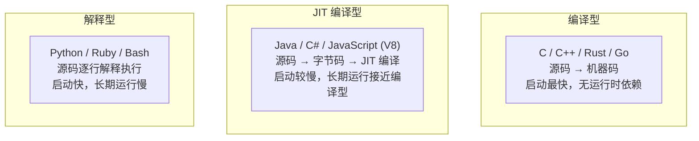

# $\rm Chapter \, 16$ 编程语言范式：不只是语法不同

> 你写了几年 C++，可能已经习惯了用 `for` 循环遍历数组、用类组织数据、用函数封装逻辑。但当你偶然看到一段 Haskell 代码——没有任何循环、没有任何变量赋值、全是数学化的函数组合——可能会想“这真的是同一个任务吗？”这一章给出几十种编程语言背后的少数几种**范式**（paradigm）。理解范式之后，任何一门陌生语言你都能在半小时内定位到它在范式地图上的位置。

> **开始前自检**：本章假设你已经会：
>
> - □ 会 C++ 的类、函数与 STL 用法（竞赛基础；第 15 章 §15.1 的示例就建立在这些之上）
> - □ 见过多种风格的代码（面向过程、类、lambda）（第 15 章 §15.1 的过程式代码、§15.3.2 的 lambda）
> - □ 了解编译型与脚本语言执行方式的差异（第 1 章 §1.2.2；运行时的概念见第 9 章 §9.2）

## $\rm \S \, 16.1$ 什么是范式

**编程范式**是一组关于“程序应该怎样组织”的基本假设和模式。它不是编译器强制执行的规则，而是一种**思维框架**。同一门语言可以支持多种范式——C++ 同时支持命令式、面向对象(OOP)、泛型和有限的函数式；Python 支持命令式、面向对象、函数式和少量的声明式。

范式之争（“OOP 已死”“函数式才是未来”）大部分时候是营销噪音。工程中真正重要的是：**知道当前任务最适合用哪种范式表达，以及你手上的语言对它的支持程度**。

---

## $\rm \S \, 16.2$ 命令式：告诉计算机“怎么做”

### $\rm \S \, 16.2.1$ 本质

命令式（imperative）是你最熟悉的范式——它用**语句序列**描述计算步骤：先做 A，再做 B，如果条件 C 则做 D，重复 E 直到 F。

```cpp
// C++ — 命令式风格
int sum = 0;
for (int i = 0; i < arr.size(); i++) {
    if (arr[i] > 0) {
        sum += arr[i];
    }
}
```

你明确告诉计算机：创建一个变量、初始化它、遍历、判断、累加。每一步是**对状态的修改**。

### $\rm \S \, 16.2.2$ 命令式的变体

| 子范式 | 核心思想 | 代表语言 |
|---|---|---|
| **过程式** | 程序 = 数据结构 + 过程（函数） | C、Fortran、Pascal |
| **面向对象** | 程序 = 对象 + 消息传递 | C++、Java、C#、Python、Ruby |
| **面向数据** | 程序 = 数据布局 + 批量变换 | 游戏引擎（ECS 架构）、数据库系统内部 |

C 是纯过程式——有 `struct` 但没有方法，数据和行为分离。C++ 把数据和行为捆绑成类——同一个 `paper.parse()` 方法的行为可以取决于 `paper` 的运行时类型（通过虚函数）。

---

## $\rm \S \, 16.3$ 面向对象：四个核心思想，不是“用 class 就叫 OOP”

### $\rm \S \, 16.3.1$ 封装

把数据和操作它的函数绑在一起，外部只能通过公开接口访问：

```cpp
class Paper {
    std::string title;    // private — 外部不可直接修改
    int year;
public:
    const std::string& get_title() const { return title; }
    void set_year(int y) {
        if (y < 1500 || y > 2100) throw std::invalid_argument("year out of range");
        year = y;
    }
};
```

封装的核心不是 `private` 关键字，而是**不变量**（invariant）——“title 永远不是空字符串”“year 永远在合理范围内”。外部代码不能随意破坏这个不变量，因为它不能直接写 `paper.year = -100`。

### $\rm \S \, 16.3.2$ 继承与多态

继承表达“is-a”关系。多态允许用基类指针调用派生类的方法：

```cpp
class Exporter {
public:
    virtual std::string export_paper(const Paper& p) = 0;  // 纯虚函数 = 接口
    virtual ~Exporter() = default;
};

class JsonExporter : public Exporter {
public:
    std::string export_paper(const Paper& p) override {
        return "{ \"title\": \"" + p.get_title() + "\" }";
    }
};

// 调用方不需要知道是 JsonExporter 还是 CsvExporter
void save_papers(const std::vector<Paper>& papers, Exporter& exporter) {
    for (auto& p : papers)
        write(exporter.export_paper(p));
}
```

代码复用有两个基本方式：**继承**（is-a：`Dog` 是一种 `Animal`）和**组合**（has-a：`Car` 包含一个 `Engine` 实例）。“组合优于继承”不是教条，而是**当你拿不准两个类之间是否真有 is-a 关系时，先用组合更安全**。滥用继承——比如只为了复用代码就让 `Stack` 继承 `Vector`——会导致接口臃肿和行为意外。

### $\rm \S \, 16.3.3$ 不同语言的 OOP 风味

| 语言 | OOP 特色 |
|---|---|
| **C++** | 多重继承、虚函数表、RAII、值语义（对象可以栈分配） |
| **Java/C#** | 单继承 + 多接口、所有对象堆分配、垃圾回收、反射 |
| **Python** | “一切皆对象”、鸭子类型（不管类型只看有没有那个方法）、多重继承 + MRO |
| **Rust** | 没有继承！用 trait（类似接口） + 组合实现多态 |
| **Go** | 没有类！用 struct + interface（隐式实现——不需要声明“我实现了这个接口”） |
| **JavaScript** | 原型链而不是类继承（ES6 `class` 是语法糖）、动态修改对象 |

Python 的鸭子类型是一个经典例子：

```python
def export_papers(exporter, papers):
    for p in papers:
        exporter.export(p)  # 不在乎 exporter 是什么类型，只在乎它有 export 方法
```

这比 C++ 的虚函数更灵活（不需要继承同一个基类），但也更危险（如果 `exporter` 没有 `export` 方法，到运行时才报错）。

---

## $\rm \S \, 16.4$ 函数式：把计算而不是状态放在中心

### $\rm \S \, 16.4.1$ 核心思想

函数式编程的核心不是“有函数”，而是：

1. **不可变数据**：变量一旦赋值就不能再改变。没有 `x = x + 1`，只有“从旧值产生一个新值”。
2. **纯函数**：相同输入总是产生相同输出，没有副作用（不修改外部状态、不写文件、不发网络请求）。
3. **高阶函数**：函数可以作为参数传递、作为返回值返回。

```haskell
-- Haskell：计算正数之和
sumPositive arr = sum (filter (> 0) arr)
-- 没有循环、没有变量、没有修改——只有函数组合
```

等价的 Python（函数式风格）：

```python
sum_positive = sum(filter(lambda x: x > 0, arr))
# 或更 Pythonic：
sum_positive = sum(x for x in arr if x > 0)
```

等价的 C++（ranges；C++20 只有 views，`std::ranges::fold_left` 要到 C++23）：

```cpp
auto sum_positive = std::ranges::fold_left(   // C++23；C++20 可改用 std::accumulate
    arr | std::views::filter([](int x) { return x > 0; }),
    0, std::plus{}
);
```

三种语言的语法不同，但**范式相同**：描述“什么是正数之和”（声明式），而不是“初始化 sum=0，遍历，if >0，累加”（命令式）。

### $\rm \S \, 16.4.2$ 函数式的实际优势

**可测试性**：纯函数不需要 mock 数据库——相同输入永远相同输出。测试就是传入一个值、检查返回值。

**并发安全**：没有共享可变状态 → 没有数据竞争。在[操作系统、进程与线程](../03-计算机系统/11-操作系统进程与线程.md)中你花了很多时间理解 `std::mutex` 和死锁——函数式的不可变性从根源上消灭了这类问题。

**代码的可理解性**：一个没有副作用的函数，你只需要看它的输入输出来理解它。一个有副作用的函数（修改了全局变量、写了文件、发了网络请求），你需要知道整个系统的状态。

### $\rm \S \, 16.4.3$ 函数式语言谱系

| 语言 | 纯度 | 特征 |
|---|---|---|
| **Haskell**（haskell.org） | 纯函数式 | 一切必须纯函数，副作用被隔离在 IO 类型中。学习曲线极陡，但一旦理解，对“副作用控制”的思维方式会改变你写所有语言的方式 |
| **OCaml** / **F#** | 函数式为主 | ML 语言家族，强类型推断。OCaml 在金融和编译器领域有存在感；F# 在 .NET 生态中 |
| **Elixir** / **Erlang** | 函数式 + Actor 并发 | Erlang 的 Beam VM，轻量进程 + 不可变数据 + 容错设计。WhatsApp 和 Discord 的服务器端大量使用 |
| **Clojure** | 函数式 Lisp | 运行在 JVM 上，Lisp 语法，不可变数据结构。Rich Hickey 的演讲是软件设计的思想宝藏 |
| **Scala** | 混合 | JVM 语言，同时支持 OOP 和函数式。Apache Spark 用 Scala 编写 |

### $\rm \S \, 16.4.4$ 函数式思想在常用语言中的渗透

即使你不学 Haskell，函数式思想已经渗透进你每天使用的语言：

- **C++**：`std::transform`、`std::for_each`、ranges（C++20）、lambda
- **Python**：`map`/`filter`/`reduce`、列表推导式、`functools`、`itertools`
- **JavaScript**：`array.map()`/`filter()`/`reduce()`——React 的函数组件和不可变状态管理
- **Rust**：Iterator trait、`map`/`filter`/`fold`、`Option`/`Result` 的方法链
- **Go**：没有内置 map/filter（有意保持极简），但 closure 和 first-class function 是语言核心
- **Java**：Stream API（Java 8+）、lambda、`Optional`

---

## $\rm \S \, 16.5$ 声明式：描述“是什么”而不是“怎么做”

### $\rm \S \, 16.5.1$ SQL：最成功的声明式语言

```sql
SELECT title, year FROM papers WHERE year >= 2020 ORDER BY year DESC;
```

这段代码没有说“遍历每行，判断 year，放入结果集，排序”——你说的是**“我要什么”**，数据库的查询优化器决定**怎么做**（走索引还是全表扫描、用哪种 join 算法、并行度多少）。

你在[文本、编码、压缩包与常见数据格式](../02-终端与工具/06-文本编码压缩包与数据格式.md)中学过正则表达式也是声明式的：你描述模式，引擎决定匹配算法。

### $\rm \S \, 16.5.2$ 声明式在各领域的体现

| 领域 | 声明式工具/语言 | 描述什么 |
|---|---|---|
| 数据库 | SQL | 要查询和修改的数据 |
| 构建 | Makefile / CMake / Dockerfile | 产物和依赖关系 |
| 基础设施 | Terraform / Kubernetes YAML / Ansible | 期望的系统状态 |
| UI | HTML + CSS | 文档结构和样式 |
| 配置 | YAML / TOML / JSON | 期望的配置状态 |
| 逻辑编程 | Prolog | 事实和规则 |

在[日常系统管理：软件、用户、服务与日志](../03-计算机系统/13-系统服务日志与软件安装.md)中你写过的 systemd service 文件就是一种声明式配置——你声明“这个服务的可执行文件在哪、以谁的身份运行、崩溃后自动重启”，systemd 确保实际状态匹配声明。

---

## $\rm \S \, 16.6$ 类型系统：静态 vs 动态、强 vs 弱

### $\rm \S \, 16.6.1$ 两对容易混淆的维度

“静态/动态”是关于**什么时候检查类型**。“强/弱”是关于**类型转换有多严格**。

| | 编译时检查类型（静态） | 运行时检查类型（动态） |
|---|---|---|
| **严格转换（强类型）** | C++、Rust、Haskell、Java | Python、Ruby、Elixir |
| **宽松转换（弱类型）** | C（允许 `void*` 随意转换） | JavaScript、PHP |

C++ 是静态强类型——编译器在编译时就知道每个变量的确切类型，且 `int` 和 `std::string` 不能隐式互相转换（除非你定义了转换运算符）。

Python 是动态强类型——变量没有类型（同一个变量可以先 `int` 后 `str`），但值有类型，且不允许 `"hello" + 42`：

```python
x = 42         # x 绑定到 int
x = "hello"    # x 绑定到 str——完全合法
"hello" + 42   # TypeError——Python 很强，不隐式转换
```

JavaScript 是动态弱类型：

```javascript
"hello" + 42   // "hello42"——JS 自动把 42 转换成字符串，没有错误
42 == "42"     // true——自动类型强制
42 === "42"    // false——严格比较，这才是你通常想要的
```

### $\rm \S \, 16.6.2$ 类型推断：静态但不冗长

现代静态类型语言不再要求你写 `std::vector<std::string>::iterator it = ...`。类型推断让编译器推导类型，你只写 `auto`（C++）、`let`（Rust）、`var`（Java 10+）、`:=`（Go）。

```rust
// Rust——完全不需要写类型
let papers = load_papers();           // 编译器推导出 Vec<Paper>
let recent: Vec<_> = papers.iter()    // 显式标注类型也是可选的
    .filter(|p| p.year >= 2020)
    .collect();
```

类型推断给你静态类型的安全性（错误在编译时暴露），但免除了大部分类型标注的键盘成本。

---

## $\rm \S \, 16.7$ 编译 vs 解释 vs JIT

这组区分在[计算机、程序与开发全景](../01-基础观念/01-计算机程序与开发全景.md)中有过初步定义。现在从语言选择角度展开：



三者不是绝对的分界。Python 的 CPython 实现是解释性的，但 PyPy 用 JIT；Java 的字节码在 JVM 上先解释（启动快），热点代码再 JIT 编译（长期运行快）。

**实际影响**：
- C++/Rust 适合需要极低延迟或极低资源消耗的场景（游戏引擎、操作系统、高频交易、嵌入式）。
- Java/C# 适合大型企业应用——JIT 编译 + 成熟的 GC + 丰富的库生态。
- Python/Ruby 适合开发速度优先的场景（脚本、数据科学、Web 原型、自动化）。
- Go 在编译型和脚本型之间取得了独特的平衡——编译产物是单文件二进制、启动极快、语法刻意保持简单（上手以天计）。

---

## $\rm \S \, 16.8$ 并发模型：不只多线程

在[操作系统、进程与线程](../03-计算机系统/11-操作系统进程与线程.md)中你接触了 `std::thread` 和互斥锁。不同语言对并发的支持各有侧重：

| 模型 | 代表 | 核心机制 |
|---|---|---|
| **OS 线程** | C++ `std::thread`、Java、Python `threading` | 操作系统调度，重量级 |
| **轻量线程/协程** | Go goroutine、Erlang process | 语言运行时调度，百万级并发 |
| **async/await** | Python asyncio、JavaScript、Rust tokio、C# | 事件循环 + 异步任务，I/O 密集场景（asyncio/JS 为单线程，tokio 默认多线程） |
| **Actor 模型** | Erlang/Elixir、Akka (Scala/Java) | 不共享内存，只通过消息通信 |
| **数据并行** | OpenMP、CUDA、Metal | 同一操作在大量数据上并行执行 |

Go 的 goroutine 是最简洁的并发模型之一：

```go
// Go——启动一个 goroutine 只需要 go 关键字
go fetchPapers(url, results)
go fetchPapers(otherUrl, results)
// 两个请求并发执行，不需要线程池、不需要 async/await
```

Erlang 的并发哲学最激进：**“让它崩溃”**——不要写复杂的错误处理试图挽救每一个故障，让进程崩溃，由 supervisor 自动重启。这种容错理念在电信系统（爱立信 AXE 交换机）中被验证了三十年。

---

## $\rm \S \, 16.9$ 语言选择：一个不会过时的决策框架

不要陷入“XX 语言是最好的”的争论。用四个问题作为选择框架：

1. **生态匹配**：你要解决的任务，哪个语言有最成熟的库和社区？做数据科学选 Python（numpy/pandas/scikit-learn），做系统内核选 C/Rust，做 Web 前端选 JavaScript/TypeScript，做高性能网络服务 Go 或 Rust 都合适。

2. **性能约束**：你的延迟预算是毫秒（大多数 Web 服务→Go/Java/C#）还是微秒（交易系统→C++/Rust）？你的内存限制是 GB（服务器）还是 KB（嵌入式→C/Zig）？

3. **团队能力与维护成本**：团队成员熟悉什么语言？团队离职后，市场上有多少人能接手？一段 C++ 模板元编程和一个 Go `for` 循环，五年后的维护成本差距巨大。

4. **语言本身的工程属性**：编译速度（Go 以编译快著称，大型 Rust 项目的编译时间常是它的数倍到十倍）、包管理成熟度（Rust Cargo 是标杆，C++ 仍在追赶）、学习曲线（Go 上手以天计，Rust 通常要几个月才能熟练驾驭 borrow checker）。


---

## $\rm \S \, 16.10$ 动手实践

### $\rm \S \, 16.10.1$ 实践一：用函数式风格改写命令式代码

前置：一段你自己写的命令式循环代码（C++ 或 Python），放进练习目录 `para-lab/`。C++ 侧需要 C++20 的 views（g++ 10+/MSVC 19.3x+）；`std::ranges::fold_left` 还要 C++23（g++ 13+/MSVC 19.36+），标准不够就用 `std::accumulate` 代替。Python 侧用第 17 章的列表推导即可。

1. C++：把 `for` 循环累加改写成 `views::filter` + `std::ranges::fold_left`（C++23；C++20 用 `std::accumulate` 代替）。预期：输出与原循环相同。
2. Python：把同一个循环改成 `sum(x for x in arr if x > 0)` 或列表推导。预期：输出与原循环相同。
3. 对比两种写法在“循环里还有打印/计数等副作用”时是否仍然更清楚。成功判据：你能给出选择其中一种的一个具体理由——这里没有标准答案。

清理：删除本次产生的可执行文件等编译产物，源码保留；`para-lab/` 可留作后面章节的练习。

### $\rm \S \, 16.10.2$ 实践二：体验类型系统差异

前置：Python 3（`python --version` 预期输出 `Python 3.x`）；做 JavaScript 部分需要 Node.js（第 22 章 §22.1）。当前目录：任意安全目录，不产生文件。

```powershell
# PowerShell：用单引号包住整个表达式，避免 PowerShell 先解析内部的引号
python -c '"hello" + 42'          # 预期：TypeError: can only concatenate str (not "int") to str
python -c 'print(type(None))'     # 预期：<class 'NoneType'>
node -e 'console.log("hello" + 42)'    # 预期：hello42
node -e 'console.log(typeof null)'     # 预期：object（JavaScript 的历史遗留）
```

```bash
# Bash / WSL 的引号规则相同，把上面四条原样粘贴即可
```

成功判据：你能解释 Python 为什么报错（动态但强类型，不做隐式转换）、JavaScript 为什么不报错（弱类型，自动把数字转成字符串），以及 `typeof null === "object"` 是缺陷而非设计。

清理：没有产生文件；退出解释器（`exit()` 或 Ctrl+D）即可。

### $\rm \S \, 16.10.3$ 实践三：安装一门陌生语言，只写 Hello World

前置：Windows 用 winget 或 Scoop（第 9 章 §9.3.5），或直接在 WSL/Linux 里用系统包管理器；当前目录：练习目录 `lang-lab/`。

1. 选一门没用过的语言（建议 Go 或 Rust），先搜包再安装：

```powershell
# PowerShell：winget 一次只接受一个包标识；先看清标识再安装
winget search go
winget search rustup
# 预期：输出若干条结果，记下包标识（如 GoLang.Go、Rustlang.Rustup），再 winget install <包标识>
```

> **安全提醒**：不要执行从网上抄来的 `curl ... | sh` 或 `irm ... | iex`——那等于把未经审查的脚本直接交给 Shell（第 9 章 §9.3.5）。

2. 安装后新开一个终端确认工具链可用：Go 用 `go version`，Rust 用 `rustup --version`。预期：打印版本号（具体版本随安装时间变化）。
3. 按官方 Getting Started 写 Hello World：Go 是 `go run hello.go`；Rust 先用 `cargo new hello` 建项目，进入目录后 `cargo run`（PowerShell 5.1 不支持 `&&` 连写，分两条执行）。预期：输出 `Hello, World!`；Go 用 `go build` 还会得到单文件可执行文件——与 C++ 的 CMake + 编译器 + 链接器链条对比。
4. 成功判据：你能说出这门语言从源码到可执行文件比 C++ 少了哪些步骤。

清理：不想保留时卸载——`winget uninstall <第 1 步记下的包标识>`（Rust 也可用 `rustup self uninstall`）；先确认当前目录不在 `hello/` 里，再删除练习目录。

---

## $\rm \S \, 16.11$ 总结

- **命令式**告诉计算机“怎么做”（C 最纯粹），**声明式**描述“我要什么”（SQL 最纯粹）。大多数语言是混合体。
- **OOP**的核心不是 `class`，而是封装不变量、通过接口通信、用继承或多态换灵活性。组合优先于继承。
- **函数式**的核心不是 `map`，而是不可变数据和纯函数。好处是易测试、无数据竞争、代码局部可理解。
- **类型系统**：静态/动态决定检查时机，强/弱决定转换严格程度。类型推断让你兼得静态安全和不冗长。
- **并发模型**不只有线程。goroutine、async/await、Actor 针对不同场景。
- **没有最好的语言，只有最匹配的语言**。学多门语言的目的是扩大“思维工具箱”，而不是积攒简历关键词。

---

## $\rm \S \, 16.12$ 关键概念回顾

1. 命令式和声明式的根本区别是什么？各举一个例子。

2. 面向对象的四个核心概念是什么？“组合优于继承”在什么场景下成立？

3. 函数式编程的两个核心原则是什么？纯函数为什么容易测试？

4. C++ 是静态还是动态类型？强还是弱？Python 呢？JavaScript 呢？

5. 编译型和解释型语言在启动速度和峰值性能上有什么区别？JIT 处于哪个位置？

## $\rm \S \, 16.13$ 应用与辨析

6. Go 的 goroutine 和 C++ 的 `std::thread` 在模型上有什么区别？

7. 什么时候该用函数式风格而不是命令式风格实现同一个功能？

## $\rm \S \, 16.14$ 本章自测答案

> 先闭卷作答本章“关键概念回顾”与“应用与辨析”，再核对以下答案。

### $\rm \S \, 16.14.1$ 自测答案 · 关键概念回顾
1. 命令式告诉计算机“怎么做”——一步步修改状态的语句序列（C++ 的 for 循环累加）；声明式描述“我要什么”（SQL 的 SELECT、正则表达式），怎么做由引擎决定。
2. 封装、继承、多态、抽象；当你不确定两个类之间真的有 is-a 关系时用组合更安全——纯粹为了复用代码而继承（如 Stack 继承 Vector）会导致接口臃肿。
3. 不可变数据 + 纯函数（相同输入永远相同输出、无副作用）；纯函数测试只需传值、检查返回值，不需要 mock 数据库或网络。
4. C++ 静态强类型；Python 动态强类型（“hello” + 42 报 TypeError）；JavaScript 动态弱类型（“hello” + 42 得到 “hello42”）。
5. 编译型启动快、峰值性能高；解释型启动快但长期运行慢；JIT 先解释执行（启动快），再对热点代码编译（长期运行接近编译型）——Java、V8 属于这一类。

### $\rm \S \, 16.14.2$ 自测答案 · 应用与辨析
6. std::thread 是操作系统线程，由内核调度、创建成本高，数量到百万级不可行；goroutine 是语言运行时调度的轻量协程，内存开销小，可以支撑百万级并发。
7. 当逻辑是“把集合变换成另一个集合”（筛选、映射、聚合）且没有副作用时，函数式表达更短、更不容易出错（如用列表推导替代 for 循环累加）；当任务本质是按顺序修改状态（打印日志、写文件、状态机）时，命令式更直观。

---

接下来，为了真正让论文资料管理器跑起来，你需要一门能快速编写 API、处理数据和管理依赖的语言——Python。下一章（第 17 章）假设你会 C++，直接带你进入 Python 的思考方式，而不是重复“变量是什么”“循环怎么写”。

> 你现在能：说清命令式/函数式/面向对象各自的适用边界与组合方式，解释编译、解释与 JIT 的差异，并能理性比较同一任务的语言选择
