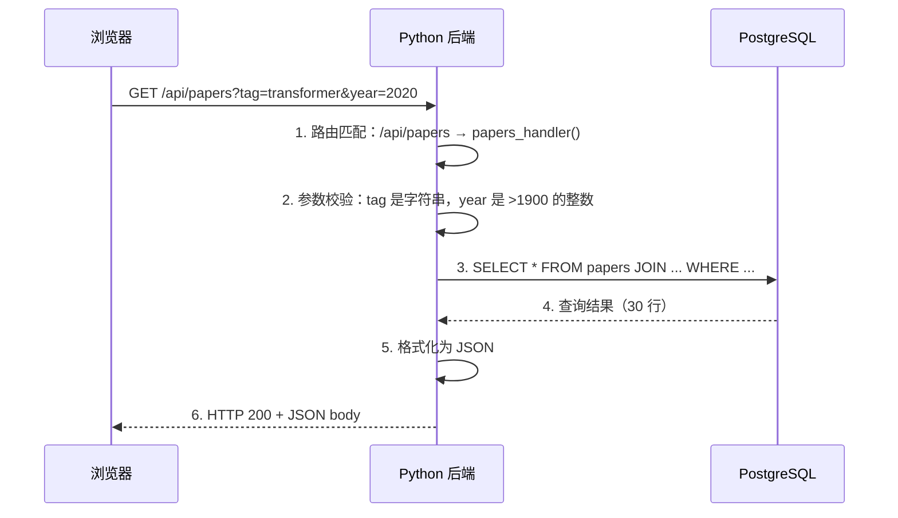

# $\rm Chapter \, 29$ 后端与 API：让前端有数据可拿

> 前端页面的 `fetch('/api/papers')` 需要一个**后端**来响应。后端不是神秘的“服务器代码”——它就是一个持续运行的网络程序：接收 HTTP 请求、检查参数是否合法、查询数据库、把结果格式化为 JSON 返回。和你的 C++ CLI 工具唯一本质区别是：它不读 `std::cin`，而是读 HTTP 请求；不写 `std::cout`，而是返回 HTTP 响应。

> **开始前自检**：本章假设你已经会：
>
> - □ 理解 HTTP 方法与状态码（第 23 章）
> - □ 写过 Python 脚本（第 17 章）
> - □ 理解请求-响应与 JSON 数据

## $\rm \S \, 29.1$ 后端做什么：一次请求的完整旅程



每一步对应一个明确的职责：

1. **路由**：把 URL 路径映射到处理函数。`GET /api/papers` → `list_papers()`。
2. **校验**：确保输入合法——`year` 必须是整数才能传给数据库（否则报 400，不报 500）。
3. **业务逻辑**：真正干活的部分——查询数据库、计算、调用外部 API。
4. **序列化**：把 Python/C++ 对象转换为 JSON/XML/Protobuf 等前端能理解的数据格式。
5. **错误处理**：数据库挂了 → 返回 503 而不是崩溃。用户传了非法参数 → 返回 400 并说明哪错了。

---

## $\rm \S \, 29.2$ 最小后端（Python Flask）

**Flask** 是一个 Python 的 Web 框架——它的核心工作是帮你把 URL 路径（如 `/api/papers`）映射到处理函数、解析 HTTP 请求参数、把 Python 对象序列化为 JSON 响应。你安装它只需要 `pip install flask`。

Flask 用**装饰器**（decorator）来注册路由：`@app.route('/api/papers')` 写在函数定义前，意思是“当收到 `GET /api/papers` 请求时，调用下面这个函数”——装饰器是 Python 的一种语法糖（`@xxx` 放在函数/类定义前，相当于把函数传给 `xxx` 并替换原函数），你不需要理解它的实现细节，只需要知道它的效果。

```python
from flask import Flask, request, jsonify
import sqlite3

app = Flask(__name__)

@app.route('/api/papers')
def list_papers():
    # 1. 获取并校验参数
    tag = request.args.get('tag')
    year_str = request.args.get('year')
    year = int(year_str) if year_str else None

    # 2. 构造查询（参数化查询——防止 SQL 注入）
    conn = sqlite3.connect('papers.db')
    conn.row_factory = sqlite3.Row     # 让结果可以用列名访问
    cur = conn.cursor()

    if tag:
        cur.execute('''
            SELECT p.* FROM papers p
            JOIN paper_tags pt ON p.id = pt.paper_id
            JOIN tags t ON pt.tag_id = t.id
            WHERE t.name = ? AND (? IS NULL OR p.year >= ?)
            ORDER BY p.citations DESC
            LIMIT 50
        ''', (tag, year, year))
    else:
        cur.execute('''
            SELECT * FROM papers
            WHERE (? IS NULL OR year >= ?)
            ORDER BY citations DESC LIMIT 50
        ''', (year, year))

    papers = [dict(row) for row in cur.fetchall()]
    return jsonify(papers)

if __name__ == '__main__':
    app.run(debug=True, port=8000)
```

运行它：

```bash
python app.py
# 在另一个终端：
curl "http://localhost:8000/api/papers?tag=transformer&year=2020"
```

### $\rm \S \, 29.2.1$ 其他 Python 框架

| 框架 | 定位 | 特点 |
|---|---|---|
| **Flask** (flask.palletsprojects.com) | 微框架 | 最小惊喜，适合 API 和小项目 |
| **FastAPI** (fastapi.tiangolo.com) | 现代 API 框架 | 自动生成 OpenAPI 文档、类型驱动、异步原生支持 |
| **Django** (djangoproject.com) | 全栈框架 | ORM、Admin、认证内置——“一揽子方案” |

### $\rm \S \, 29.2.2$ 其他语言的后端框架

| 语言 | 框架 | 特点 |
|---|---|---|
| **Node.js** | Express / Fastify / Hono | JS 全栈——前后端同一语言 |
| **Go** | `net/http` / Gin / Echo | 单文件二进制、轻量 goroutine 并发 |
| **Rust** | Actix-web / Axum | 内存安全 + C++ 级性能，学习曲线最陡 |
| **Java** | Spring Boot | 企业标准，生态极广 |
| **C#** | ASP.NET Core | 微软生态，Entity Framework ORM 强大 |

---

## $\rm \S \, 29.3$ REST API 约定

REST（Representational State Transfer）不是协议——是一组**约定**。遵守约定让 API 对任何人都可预测。

```text
GET    /api/papers          → 列表（支持 ?tag=&year= 筛选）
GET    /api/papers/42       → 单条论文
POST   /api/papers          → 创建新论文（请求体是 JSON）
PUT    /api/papers/42       → 完整更新论文 42
PATCH  /api/papers/42       → 部分更新论文 42
DELETE /api/papers/42       → 删除论文 42
```

- **用名词而非动词**：`/api/papers`，不是 `/api/getPapers`。HTTP 方法已经表达了动词。
- **用 HTTP 状态码表达结果**：201 Created、400 Bad Request、404 Not Found、500 Internal Server Error。
- **JSON 作为请求和响应格式**：几乎所有现代 API 默认用 JSON。

---

## $\rm \S \, 29.4$ 认证与会话

### $\rm \S \, 29.4.1$ 你的后端怎么知道“你是你”

HTTP 本身是无状态的——每个请求都是独立的，服务器不记得你上次请求了什么。认证机制在无状态的 HTTP 之上“伪造”了状态：

| 机制 | 原理 | 适用场景 |
|---|---|---|
| **API Key / Bearer Token** | 请求头中带 `Authorization: Bearer sk-xxxx` | 机器对机器的 API |
| **JWT**（JSON Web Token） | 服务器签发一个包含用户 ID 和过期时间的签名 token | 用户认证、微服务间通信 |
| **Session + Cookie** | 服务器在内存/Redis 中存 session，浏览器在 Cookie 中存 session ID | 传统 Web 应用 |
| **OAuth 2.0** | 委托认证——“用 GitHub 账号登录” | 第三方登录 |

### $\rm \S \, 29.4.2$ 不要在 JWT 中放敏感信息

JWT 的 payload 只是 **Base64 编码**，不是加密——任何人都能解码看到内容。JWT 的安全来自**签名**（防止篡改），不是**加密**（防止读取）。不要把密码、信用卡号、身份证号放进 JWT。

---

## $\rm \S \, 29.5$ 中间件：请求的“安检”管道

**中间件**（middleware）是在请求到达处理函数之前和离开处理函数之后执行的代码：

```text
请求 → [日志中间件] → [认证中间件] → [CORS 中间件] → 处理函数
                                                                ↓
响应 ← [日志中间件] ← [错误处理中间件] ← [压缩中间件] ← ← ← ←
```

每个中间件只做一件事：日志中间件记录每次请求的方法、路径和耗时；认证中间件验证 Authorization 头；CORS 中间件设置跨域响应头。

---

## $\rm \S \, 29.6$ 并发与扩展

在[操作系统、进程与线程](../03-计算机系统/11-操作系统进程与线程.md)中你学过单线程 vs 多线程。后端框架对并发的处理方式不同：

- **Flask** 默认同步单线程——一次只处理一个请求。`app.run(threaded=True)` 开多线程。
- **FastAPI** 原生异步（asyncio）——单线程事件循环，I/O 等待时不阻塞。
- **Go** goroutine —— 每个请求一个轻量协程，百万并发无压力。
- **Node.js** 事件循环——单线程，所有 I/O 异步。

对于论文管理器这种小项目，选哪个框架的并发差异完全可以忽略。当你的 API 每秒要处理几千个请求时，这个差异才变得重要。

---

## $\rm \S \, 29.7$ 幂等性与重试（Idempotency & Retry）：响应丢了，重发安全吗

网络不可靠。“没收到响应”有两种可能：请求根本没到达服务器；或请求到了、服务器处理完了，响应在回来的路上丢了——客户端无法区分，于是每个请求都带着一个问题：如果重发，服务器会不会把同一件事做两遍？

[网络基础到HTTP](../04-网络/23-网络基础到HTTP.md)的结论是：**幂等**的操作执行一次和十次副作用相同——PUT、DELETE 天然幂等，重发多少次都安全；POST 不幂等，每发一次就多创建一条数据。对 POST 这类操作，要靠**幂等键**（idempotency key）让重发变得无害：客户端为一次业务动作生成一个唯一标识随请求发送，服务器第一次见到这个 key 时正常处理并保存结果，同一个 key 再来，直接返回第一次的结果。生成幂等键用 **UUID**（Universally Unique Identifier，通用唯一标识符）——随机生成的 128 位标识，重复概率低到可以忽略；Stripe 支付 API 的 `Idempotency-Key` 请求头就是这么做的，是业界标准做法。

服务器端实现——幂等键先占位，结果与业务数据在同一事务里提交：

```python
import json, sqlite3
from sqlite3 import IntegrityError
from flask import Flask, request, jsonify

app = Flask(__name__)
def connect():
    conn = sqlite3.connect('papers.db')
    conn.execute('CREATE TABLE IF NOT EXISTS idempotency (key TEXT PRIMARY KEY, response_json TEXT)')
    return conn
@app.route('/api/papers', methods=['POST'])
def create_paper():
    key = request.headers.get('Idempotency-Key')
    if not key:
        return jsonify({'error': '缺少 Idempotency-Key 请求头'}), 400
    conn = connect()
    try:
        data = request.get_json()
        conn.execute('INSERT INTO idempotency (key) VALUES (?)', (key,))
        cur = conn.execute('INSERT INTO papers (title, year) VALUES (?, ?)',
                           (data['title'], data['year']))
        result = {'id': cur.lastrowid, 'title': data['title'], 'year': data['year']}
        conn.execute('UPDATE idempotency SET response_json = ? WHERE key = ?',
                     (json.dumps(result), key))
        conn.commit()
        return jsonify(result), 201
    except IntegrityError:      # 同样的 key 违反主键约束：说明已处理过
        conn.rollback()
        row = conn.execute('SELECT response_json FROM idempotency WHERE key = ?',
                           (key,)).fetchone()
        return jsonify(json.loads(row[0])), 201
    finally:
        conn.close()
```

关键在两点：`key` 是 `idempotency` 表的主键（唯一性约束在[SQL 从零开始](26-SQL从零开始.md)学过），重复插入抛 `IntegrityError`，整个事务回滚——重复的论文不会写入，然后取回第一次的结果返回。

客户端配合幂等键重试（`requests` 是 Python 的 HTTP 客户端库，第 17 章装过）：

```python
import time, uuid, requests

key = str(uuid.uuid4())          # 一次业务动作一个 key，重试时复用
for attempt in range(4):
    try:
        r = requests.post('http://localhost:8000/api/papers',
                          json={'title': 'A', 'year': 2026},
                          headers={'Idempotency-Key': key}, timeout=5)
    except requests.RequestException:
        r = None                 # 网络问题，值得重试
    if r and r.status_code < 500 and r.status_code != 429:
        break                    # 成功或 4xx：重试无用
    time.sleep(2 ** attempt)     # 指数退避：1s、2s、4s
```

- **超时**（timeout）是客户端愿意等待响应的最长时间（`timeout=5` 即最多 5 秒）——没有它，一次网络卡死会让客户端无限期挂起。
- **指数退避**（exponential backoff）：等待时间按 1s、2s、4s 翻倍，给过载的服务器喘息时间，而不是用重试把它压垮。重试只适合网络瞬时错误（连接失败、超时）和服务器过载（5xx）。
- 4xx 不重试：请求本身有错，重试一万次结果一样；唯一的例外是 **429 Too Many Requests**——“你太快了”，等一会儿再试是合理的（§29.9 讲限流时细说）。

验证：同一个 key 连发两次 `curl -X POST http://localhost:8000/api/papers -H 'Content-Type: application/json' -H 'Idempotency-Key: demo-key-1' -d '{"title":"A","year":2026}'`，两次响应里的 `id` 相同，`papers` 表里只有一行；换一个 key 才插入第二行。

---

## $\rm \S \, 29.8$ 优雅关闭（Graceful Shutdown）：给进程一点收尾时间

在[操作系统、进程与线程](../03-计算机系统/11-操作系统进程与线程.md)学过：`kill PID` 发 SIGTERM，进程可以注册处理函数在退出前做清理；`kill -9` 的 SIGKILL 不可拦截。[系统服务与日志](../03-计算机系统/13-系统服务日志与软件安装.md)的 `systemctl stop`、以及第 30 章会讲的 `docker stop`，发的都是 SIGTERM——它们给你收尾的时间。但 Flask 默认不处理 SIGTERM：收到就立刻终止，正在处理的请求被拦腰截断（用户拿到连接中断而不是响应），数据库事务可能只写了一半。

第 11 章提到过的优雅退出（graceful shutdown）——后端语境里叫**优雅关闭**——完整形态是收到 SIGTERM 后按顺序做四件事：停止接受新请求；等待正在处理的请求完成（设一个超时上限，不能无限等）；关闭数据库连接（提交或回滚未完成的事务）；进程退出。

Flask 需要自己写信号处理函数：

```python
import signal, time
from flask import Flask, jsonify

app = Flask(__name__)
shutting_down = False

def begin_shutdown(signum, frame):
    global shutting_down
    print('收到 SIGTERM：拒绝新请求，等待存量请求完成...')
    shutting_down = True

signal.signal(signal.SIGTERM, begin_shutdown)   # 注册 SIGTERM 处理函数

@app.route('/api/papers')
def list_papers():
    if shutting_down:            # ① 停收新请求
        return jsonify({'error': '服务器正在关闭'}), 503
    time.sleep(3)                # 模拟慢查询，制造观察窗口
    return jsonify([{'id': 1}])

if __name__ == '__main__':
    app.run(threaded=True, port=8000)
```

收到 SIGTERM 后，`begin_shutdown` 只改一个标志位：正在执行的请求处理函数照常跑完并返回——这就是**排空**（drain）在途请求；新请求看到标志位返回 503，告诉调用方“正在关闭”。数据库连接的收尾放在处理函数的 `finally` 或 `@app.teardown_request` 钩子里（26.2 的示例就是每个请求新建连接，关闭它即可）。

收尾不能无限进行：`docker stop` 发完 SIGTERM 默认等 10 秒（可配 `stop_grace_period`），超时后补发 SIGKILL 强制杀死——所以排空的上限必须小于调用方的耐心。生产环境用 gunicorn、waitress 这类 WSGI 服务器时，它们内置了排空逻辑（如 gunicorn 的 `--graceful-timeout`），原理和上面的标志位相同。

验证（Linux/macOS）：`python app.py` 启动后，另开终端用 `ps` 找到 PID，`kill <PID>`。观察：正在处理的慢请求正常返回 200，之后的请求返回 503，服务端打印“收到 SIGTERM…”。

---

## $\rm \S \, 29.9$ 限流（Rate Limiting）：别让一个客户端独占服务器

认证回答“你是谁”，不回答“你能用多快”。一个失控脚本可以每秒打 1000 个请求：把数据库打满让所有用户卡住、把按调用量计费的服务烧光预算、把整站数据爬走。[域名、HTTPS、代理与排障](../04-网络/24-域名HTTPS代理与排障.md)提到反向代理能做的“限流”，就是这里的主角：**限流**（rate limiting）限制同一客户端单位时间内的请求数，超出直接拒绝。

最简单的策略是**固定窗口**（fixed window）：把时间切成每分钟一段，每段最多 60 个请求。它有一个知名漏洞——窗口边界：客户端第 59 秒把本窗口的 60 次额度用完，第 61 秒进入新窗口又满血 60 次，两秒内发出 120 次，“每分钟 60 次”形同虚设。

更稳的两种策略：**滑动窗口**（sliding window）统计“最近 60 秒内”的实际请求数，不看整点边界，边界攻击失效；**令牌桶**（token bucket）以恒定速率向桶里补充令牌、每个请求消耗一个，桶空就拒绝——桶容量允许短时突发（一口气连发 20 个没问题），但平均速率被钉死。

最小实现——把限流挂在 `before_request` 钩子上（29.5 节的中间件位置，每个请求进入路由前先执行）：

```python
import time
from flask import Flask, request, jsonify

app = Flask(__name__)
hits = {}                          # ip -> 最近 60 秒内每个请求的时间戳

@app.before_request                # 每个请求进入路由前先执行
def rate_limit():
    now = time.time()
    recent = [t for t in hits.get(request.remote_addr, []) if now - t < 60]
    if len(recent) >= 60:          # 最近 60 秒内已超过 60 个请求
        resp = jsonify({'error': '请求过于频繁，请稍后再试'})
        resp.status_code = 429
        resp.headers['Retry-After'] = str(int(60 - (now - recent[0])))
        return resp                # 返回响应 = 拦截，请求不进路由
    recent.append(now)
    hits[request.remote_addr] = recent
```

被拒的请求收到 **429 Too Many Requests**（状态码表在[网络基础到HTTP](../04-网络/23-网络基础到HTTP.md)见过）和 **Retry-After** 响应头——后者告诉客户端等多少秒再试，正好呼应上一节“429 值得重试”：客户端该做的是等够时间再试，而不是立刻再打。

两点边界：内存字典只对单个进程有效——多进程、多台机器必须用共享存储（Redis 是常见选择），否则每个进程各算各的额度（本机演示中所有请求都来自 127.0.0.1，额度是所有本地客户端共用的）；生产环境更常见的做法是在 Nginx（[域名、HTTPS、代理与排障](../04-网络/24-域名HTTPS代理与排障.md)学过它做反向代理）里配置，后端代码一行不用改：

```nginx
limit_req_zone $binary_remote_addr zone=api:10m rate=60r/m;
server {
    location /api/ {
        limit_req zone=api burst=20 nodelay;
    }
}
```

`rate=60r/m` 是平均速率，`burst=20` 允许短时突发（令牌桶思想）。Nginx 位于后端之前（第 24 章的部署图），请求先经过它，限流自然生效。

---

## $\rm \S \, 29.10$ API 版本管理（Versioning）：改接口不能砸了老客户端

你的 API 一旦上线，调用方就不只是自己的前端——还有别人的脚本、合作方程序。某天你要把 `GET /api/papers` 响应里的 `year` 从数字改成字符串：直接改，老客户端按数字解析立刻崩溃。**API 版本**（version）让新旧两套接口约定共存：同一份数据，按版本号提供不同的路由和字段。

三种常见做法：

| 方式 | 示例 | 特点 |
|---|---|---|
| URL 路径 | `/api/v1/papers`、`/api/v2/papers` | 最直观：浏览器地址栏、curl、日志都看得到版本。最常用 |
| 请求头 | `Accept: application/vnd.api+v2` | URL 不变，但每个请求都要多带一个头，缓存和调试都不方便 |
| 查询参数 | `/api/papers?version=2` | 容易漏带、被遗忘，日志里难聚合 |

选择维度是“版本是否容易被客户端带上、被发现”——URL 路径因为不会漏、最直观，成为事实标准。

什么时候必须升版本：**破坏性变更**（breaking change）——删除字段、修改已有字段的含义（如 `year` 数字改字符串）、改变认证方式。什么时候不需要：**向后兼容**（backward compatible）的变更——添加新字段、增加可选参数，旧客户端忽略不认识的字段即可。一句话：删字段要升版本，加字段不用。

实现——两个路由共享同一份查询，差异只在返回字段：

```python
def query_papers():
    # 真实代码：连接数据库执行 SELECT（见 26.2），这里简化成一条数据
    return [{'id': 1, 'title': 'Attention Is All You Need',
             'year': 2017, 'citations': 120000}]

@app.route('/api/v1/papers')
def list_papers_v1():
    rows = query_papers()
    return jsonify([{'id': r['id'], 'title': r['title'], 'year': r['year']}
                    for r in rows])          # v1：只返回三个字段

@app.route('/api/v2/papers')
def list_papers_v2():
    return jsonify(query_papers())           # v2：多了 citations 字段
```

验证：分别 `curl localhost:8000/api/v1/papers` 和 `curl localhost:8000/api/v2/papers`，对比字段差异。

版本切换的代价从上面就看得出：每个改动都要想一遍“v1 和 v2 各该是什么样”，测试跑两遍、文档写两份，维护负担随版本数成倍增长——所以版本不是越多越好，没有外部调用方的内部 API 可以先不建版本目录，等第一次破坏性变更再引入。旧版本也不能无限期养着：发布 v2 时就定好 v1 的**停用日期**（sunset date），到期下线、删除路由，期间通过文档和响应头（`Deprecation`、`Sunset`）通知客户端迁移。

---

## $\rm \S \, 29.11$ API 调试工具：curl 之外的图形化客户端

curl 适合“发一个请求、看一个响应”的快速检查，也能写进脚本。但当你需要保存一批请求、按项目组织、把请求连同环境一起共享给队友时，图形化 API 客户端更顺手：**Postman**（GUI，最流行）、**Hoppscotch**（浏览器中直接使用，无需安装）、**Insomnia**（GUI，开源）。它们记住你发过的每个请求，支持环境变量（dev/staging/prod 一键切换），并把 JSON 响应格式化显示。

但学习的顺序不能反过来：先用 curl 搞清楚“我到底在发一个什么样的 HTTP 请求”（方法、路径、请求头、请求体——本章每个示例都是先 curl 验证，再谈机制），然后才用图形化工具处理复杂工作流。直接上手 GUI，反而说不清请求的每个部分是什么，出问题时也无从排查。

---

## $\rm \S \, 29.12$ 动手实践

### 实践一：写论文管理器的后端

用 Flask 或 FastAPI 实现以下 API：
- `GET /api/papers`：支持 `?tag=` 和 `?year=` 筛选
- `GET /api/papers/:id`：返回单条论文的完整信息（含标签）
- `POST /api/papers`：创建新论文（请求体 JSON）
- `DELETE /api/papers/:id`：删除论文

### 实践二：前后端对接

1. 启动后端（`python app.py`）。
2. 启动前端开发服务器（`npm run dev`）。
3. 配置 Vite 代理把 `/api/*` 转发到 `localhost:8000`。
4. 确认前端能正常加载论文列表。

### 实践三：添加认证

1. 生成一个简单的 API Key（`openssl rand -hex 32`）。
2. 后端添加中间件：检查 `Authorization: Bearer <key>` 头。
3. 前端在 `fetch` 中添加 Authorization 头。
4. 确认不带 key 的请求返回 401。

### 实践四：让 API 更抗造

1. 给 `POST /api/papers` 加幂等键（§29.7 的代码）：同一个 key 发两次 `curl`，验证两次返回的 `id` 相同、`papers` 表里只有一行。
2. 加上限流中间件（§29.9 的代码）：循环快速发 70 个请求，观察第 61 个起返回 429 并带 `Retry-After` 头。
3. （Linux/macOS）启动后另开终端 `kill <PID>`：在途请求正常返回、新请求返回 503，验证优雅关闭（§29.8）。

---

## $\rm \S \, 29.13$ 总结

- 后端的职责：路由 → 校验 → 业务逻辑 → 序列化 → 错误处理。
- REST API 约定：用名词路径 + HTTP 方法表达操作，用状态码表达结果，用 JSON 做数据格式。
- 认证在无状态的 HTTP 之上建立“你是谁”的认知。JWT 签名防篡改，不加密。
- 中间件是请求的“安检管道”——日志、认证、CORS、压缩，各司其职。
- 幂等键 + 重试：POST 这类非幂等操作靠客户端生成的幂等键去重；重试按指数退避（1s、2s、4s），4xx 不重试、429 例外。
- 优雅关闭：收到 SIGTERM 后停收新请求 → 排空在途请求（设上限）→ 关闭数据库 → 退出；Docker stop 默认等 10 秒再 SIGKILL。
- 限流：固定窗口有边界漏洞，滑动窗口、令牌桶更稳；被拒返回 429 + Retry-After。
- API 版本：URL 路径最常用；只有破坏性变更才升版本；旧版本设停用日期。

---

## $\rm \S \, 29.14$ 关键概念回顾

1. 后端处理一次请求的五个步骤分别是什么？

2. REST API 的核心约定是什么？（路径、方法、状态码）

3. 中间件的作用是什么？

4. 客户端重发 POST 请求为什么危险？幂等键怎么消除这个危险？

5. 收到 SIGTERM 后，后端按什么顺序收尾？为什么不能无限等？

## $\rm \S \, 29.15$ 应用与辨析

4. `GET /api/papers/42` 和 `DELETE /api/papers/42` 的 URL 相同，后端怎么区分？

5. JWT 的 payload 可以放密码吗？为什么？

6. 用户提交了一个不存在的 tag 值，后端应该返回什么状态码？为什么不是 500？

7. 你做了“每分钟 60 次”的固定窗口限流，却发现有客户端在 2 秒内发出了 120 个请求。漏洞在哪？怎么修？

## $\rm \S \, 29.16$ 本章自测答案

> 先闭卷作答本章“关键概念回顾”与“应用与辨析”，再核对以下答案。

### 自测答案 · 关键概念回顾
1. 路由匹配（URL→处理函数）、参数校验（确保输入合法）、业务逻辑（查数据库/计算）、序列化（对象→JSON）、错误处理（合适的状态码和错误消息）。
2. 路径用名词（`/api/papers`）、HTTP 方法表达动作（GET/POST/PUT/DELETE）、状态码表达结果（200/201/400/404/500）、JSON 做数据格式。
3. 在请求到达处理函数之前和之后，串行执行通用逻辑（日志、认证、CORS、压缩），避免在每个处理函数中重复代码。
4. POST 不幂等，服务器可能已经处理过第一次请求（只是响应丢了），重发会重复创建。幂等键是客户端为一次业务动作生成的 UUID，服务器以它为表主键：同一个 key 只处理一次，重复请求触发主键冲突，直接返回第一次的结果。
5. 停收新请求 → 等待在途请求完成（设超时上限）→ 关闭数据库连接 → 退出。调用方（如 Docker stop）默认等 10 秒就会补发 SIGKILL 强杀，收尾必须在此时间内完成。

### 自测答案 · 应用与辨析
4. 通过 HTTP 方法区分——Flask/FastAPI 的路由装饰器同时绑定路径和方法（`@app.route('/api/papers/<id>', methods=['DELETE'])`）。
5. 不能。JWT payload 只是 Base64 编码（非加密），任何人都能解码读取。JWT 的安全靠签名（防篡改），不靠加密（防读取）。敏感信息永远不放 JWT。
6. 200 OK + 空列表（[]）。这不是错误——查询条件有效，只是没有匹配的数据。500 表示“服务器内部出了问题”，用户传了合法但无匹配的参数不是服务器的错。
7. 固定窗口的边界漏洞：第 59 秒用光当前窗口额度，第 61 秒进入新窗口又满额，两个窗口的额度在 2 秒内叠加。改用滑动窗口（统计最近 60 秒）或令牌桶（平均速率 + 突发额度）。

---

后端让论文管理器有了数据源，幂等键、优雅关闭和限流让它能应对重试、停机与刷量。但“在我电脑上能运行”不是终点——你需要让它在任何人的电脑上都能跑起来、在服务器上稳定运行、在出问题时能快速恢复。Docker 就是做这件事的。

> 你现在能：用 Python 写一个提供 JSON 的 HTTP API，解释路由/请求/响应/错误码，用 curl 或前端调用它，并说清 CORS 与鉴权的位置
