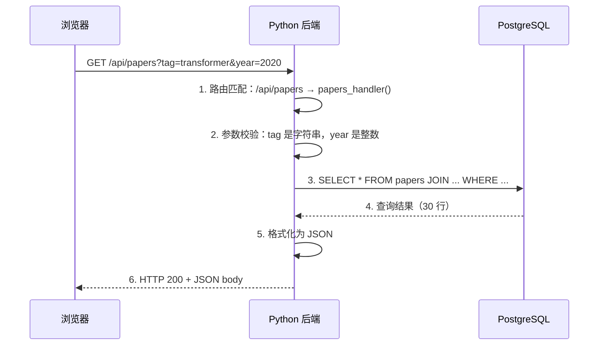
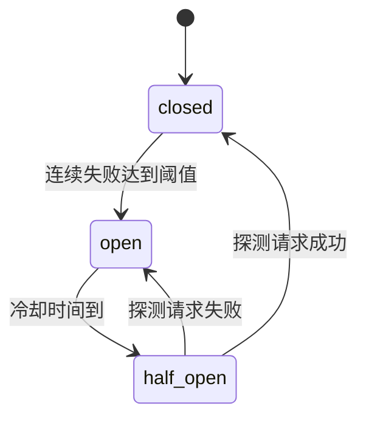

# $\rm Chapter \, 29$ 后端与 API：让前端有数据可拿

> 前端页面的 `fetch('/api/papers')` 需要一个**后端**来响应。后端不是神秘的“服务器代码”——它就是一个持续运行的网络程序：接收 HTTP 请求、检查参数是否合法、查询数据库、把结果格式化为 JSON 返回。和你的 C++ CLI 工具唯一本质区别是：它不读 `std::cin`，而是读 HTTP 请求；不写 `std::cout`，而是返回 HTTP 响应。

> **开始前自检**：本章假设你已经会：
>
> - □ 理解 HTTP 方法与状态码（第 23 章 §23.3.2、§23.3.3）
> - □ 写过 Python 脚本（第 17 章）
> - □ 理解请求-响应与 JSON 数据（第 23 章 §23.3.1；第 6 章 §6.5.1 的 JSON）
> - □ 知道事务、索引与唯一约束的作用（第 26 章 §26.4、§26.5；第 27 章 §27.8）

## $\rm \S \, 29.1$ 后端做什么：一次请求的完整旅程



每一步对应一个明确的职责：

1. **路由**：把 URL 路径映射到处理函数。`GET /api/papers` → `list_papers()`。
2. **校验**：确保输入合法——`year` 必须是整数才能传给数据库（否则报 400，不报 500）。
3. **业务逻辑**：真正干活的部分——查询数据库、计算、调用外部 API。
4. **序列化**：把 Python/C++ 对象转换为 JSON/XML/Protobuf 等前端能理解的数据格式。
5. **错误处理**：数据库挂了 → 返回 503 而不是崩溃。用户传了非法参数 → 返回 400 并说明哪错了。

---

## $\rm \S \, 29.2$ 最小后端（Python Flask）

**Flask** 是一个 Python 的 Web 框架——它的核心工作是帮你把 URL 路径（如 `/api/papers`）映射到处理函数、解析 HTTP 请求参数、把 Python 对象序列化为 JSON 响应。你安装它只需要 `pip install flask`。

Flask 用**装饰器**（decorator）来注册路由：`@app.route('/api/papers')` 写在函数定义前，意思是“当收到 `GET /api/papers` 请求时，调用下面这个函数”——装饰器是 Python 的一种语法糖（`@xxx` 放在函数/类定义前，相当于把函数传给 `xxx` 并替换原函数），你不需要理解它的实现细节，只需要知道它的效果。

```python
from flask import Flask, request, jsonify
import sqlite3

app = Flask(__name__)

@app.route('/api/papers')
def list_papers():
    # 1. 获取并校验参数
    tag = request.args.get('tag')
    year_str = request.args.get('year')
    try:
        year = int(year_str) if year_str else None
    except ValueError:
        return jsonify({'error': 'year 必须是整数'}), 400   # 非法输入是客户端的错，不是 500

    # 2. 构造查询（参数化查询——防止 SQL 注入）
    conn = sqlite3.connect('papers.db')
    conn.row_factory = sqlite3.Row     # 让结果可以用列名访问
    cur = conn.cursor()

    if tag:
        cur.execute('''
            SELECT p.* FROM papers p
            JOIN paper_tags pt ON p.id = pt.paper_id
            JOIN tags t ON pt.tag_id = t.id
            WHERE t.name = ? AND (? IS NULL OR p.year >= ?)
            ORDER BY p.citations DESC
            LIMIT 50
        ''', (tag, year, year))
    else:
        cur.execute('''
            SELECT * FROM papers
            WHERE (? IS NULL OR year >= ?)
            ORDER BY citations DESC LIMIT 50
        ''', (year, year))

    papers = [dict(row) for row in cur.fetchall()]
    return jsonify(papers)

if __name__ == '__main__':
    app.run(debug=True, port=8000)   # 仅本地开发；生产用 §29.13 的 WSGI 服务器，不要开 debug
```

运行它：

```bash
python app.py
# 在另一个终端：
curl "http://localhost:8000/api/papers?tag=transformer&year=2020"
```

### $\rm \S \, 29.2.1$ 其他 Python 框架

| 框架 | 定位 | 特点 |
|---|---|---|
| **Flask** (flask.palletsprojects.com) | 微框架 | 最小惊喜，适合 API 和小项目 |
| **FastAPI** (fastapi.tiangolo.com) | 现代 API 框架 | 自动生成 OpenAPI 文档、类型驱动、异步原生支持 |
| **Django** (djangoproject.com) | 全栈框架 | ORM、Admin、认证内置——“一揽子方案” |

### $\rm \S \, 29.2.2$ 其他语言的后端框架

| 语言 | 框架 | 特点 |
|---|---|---|
| **Node.js** | Express / Fastify / Hono | JS 全栈——前后端同一语言 |
| **Go** | `net/http` / Gin / Echo | 单文件二进制、轻量 goroutine 并发 |
| **Rust** | Actix-web / Axum | 内存安全 + C++ 级性能，学习曲线最陡 |
| **Java** | Spring Boot | 企业标准，生态极广 |
| **C#** | ASP.NET Core | 微软生态，Entity Framework ORM 强大 |

---

## $\rm \S \, 29.3$ REST API 约定

REST（Representational State Transfer）不是协议——是一组**约定**。遵守约定让 API 对任何人都可预测。

```text
GET    /api/papers          → 列表（支持 ?tag=&year= 筛选）
GET    /api/papers/42       → 单条论文
POST   /api/papers          → 创建新论文（请求体是 JSON）
PUT    /api/papers/42       → 完整更新论文 42
PATCH  /api/papers/42       → 部分更新论文 42
DELETE /api/papers/42       → 删除论文 42
```

- **用名词而非动词**：`/api/papers`，不是 `/api/getPapers`。HTTP 方法已经表达了动词。
- **用 HTTP 状态码表达结果**：201 Created、400 Bad Request、404 Not Found、500 Internal Server Error。
- **JSON 作为请求和响应格式**：几乎所有现代 API 默认用 JSON。

---

## $\rm \S \, 29.4$ 认证与会话

### $\rm \S \, 29.4.1$ 你的后端怎么知道“你是你”

HTTP 本身是无状态的——每个请求都是独立的，服务器不记得你上次请求了什么。认证机制在无状态的 HTTP 之上“伪造”了状态：

| 机制 | 原理 | 适用场景 |
|---|---|---|
| **API Key / Bearer Token** | 请求头中带 `Authorization: Bearer <token>`；token 从环境变量或密钥管理服务读取，不进源码、不进 Git（第 13 章 §13.5.2） | 机器对机器的 API |
| **JWT**（JSON Web Token） | 服务器签发一个包含用户 ID 和过期时间的签名 token | 用户认证、微服务间通信 |
| **Session + Cookie** | 服务器在内存/Redis 中存 session，浏览器在 Cookie 中存 session ID | 传统 Web 应用 |
| **OAuth 2.0** | 委托认证——“用 GitHub 账号登录” | 第三方登录 |

### $\rm \S \, 29.4.2$ 不要在 JWT 中放敏感信息

JWT 的 payload 只是 **Base64 编码**，不是加密——任何人都能解码看到内容。JWT 的安全来自**签名**（防止篡改），不是**加密**（防止读取）。不要把密码、信用卡号、身份证号放进 JWT。

---

## $\rm \S \, 29.5$ 中间件：请求的“安检”管道

**中间件**（middleware）是在请求到达处理函数之前和离开处理函数之后执行的代码：

```text
请求 → [日志中间件] → [认证中间件] → [CORS 中间件] → 处理函数
                                                                ↓
响应 ← [日志中间件] ← [错误处理中间件] ← [压缩中间件] ← ← ← ←
```

每个中间件只做一件事：日志中间件记录每次请求的方法、路径和耗时；认证中间件验证 Authorization 头；CORS 中间件设置跨域响应头。

---

## $\rm \S \, 29.6$ 并发与扩展

在[操作系统、进程与线程](../03-计算机系统/11-操作系统进程与线程.md)中你学过单线程 vs 多线程。后端框架对并发的处理方式不同：

- **Flask** 的处理函数默认是同步的（开发服务器从 Flask 1.0 起默认按线程处理请求）；`app.run(threaded=True)` 显式打开多线程，生产环境的并发能力则取决于 §29.13 的 WSGI 服务器配置。
- **FastAPI** 原生异步（asyncio）——单线程事件循环，I/O 等待时不阻塞。
- **Go** goroutine —— 每个请求一个轻量协程，创建开销远小于线程；能扛多少并发取决于内存、I/O 和每请求的工作量，不是无条件的。
- **Node.js** 事件循环——单线程，所有 I/O 异步。

对于论文管理器这种小项目，选哪个框架的并发差异完全可以忽略。当你的 API 每秒要处理几千个请求时，这个差异才变得重要。

---

## $\rm \S \, 29.7$ 幂等性与重试（Idempotency & Retry）：响应丢了，重发安全吗

网络不可靠。“没收到响应”有两种可能：请求根本没到达服务器；或请求到了、服务器处理完了，响应在回来的路上丢了——客户端无法区分，于是每个请求都带着一个问题：如果重发，服务器会不会把同一件事做两遍？

[网络基础到HTTP](../04-网络/23-网络基础到HTTP.md)的结论是：**幂等**的操作执行一次和十次，对服务器状态的副作用相同——PUT、DELETE 天然幂等，重发不会多做一次修改（响应码可能不同，比如第二次 DELETE 通常返回 404，但状态没有被多改）；POST 不幂等，每发一次就多创建一条数据。对 POST 这类操作，要靠**幂等键**（idempotency key）让重发变得无害：客户端为一次业务动作生成一个唯一标识随请求发送，服务器第一次见到这个 key 时正常处理并保存结果，同一个 key 再来，直接返回第一次的结果。生成幂等键用 **UUID**（Universally Unique Identifier，通用唯一标识符）——随机生成的 128 位标识，重复概率低到可以忽略；Stripe 支付 API 的 `Idempotency-Key` 请求头就是这么做的，是业界标准做法。

服务器端实现——幂等键先占位，结果与业务数据在同一事务里提交：

```python
import json, sqlite3
from sqlite3 import IntegrityError
from flask import Flask, request, jsonify

app = Flask(__name__)
def connect():
    conn = sqlite3.connect('papers.db')
    conn.execute('CREATE TABLE IF NOT EXISTS idempotency (key TEXT PRIMARY KEY, response_json TEXT)')
    return conn
@app.route('/api/papers', methods=['POST'])
def create_paper():
    key = request.headers.get('Idempotency-Key')
    if not key:
        return jsonify({'error': '缺少 Idempotency-Key 请求头'}), 400
    conn = connect()
    try:
        data = request.get_json()
        conn.execute('INSERT INTO idempotency (key) VALUES (?)', (key,))
        cur = conn.execute('INSERT INTO papers (title, year) VALUES (?, ?)',
                           (data['title'], data['year']))
        result = {'id': cur.lastrowid, 'title': data['title'], 'year': data['year']}
        conn.execute('UPDATE idempotency SET response_json = ? WHERE key = ?',
                     (json.dumps(result), key))
        conn.commit()
        return jsonify(result), 201
    except IntegrityError:      # 同样的 key 违反主键约束：说明已处理过（或正在处理）
        conn.rollback()
        row = conn.execute('SELECT response_json FROM idempotency WHERE key = ?',
                           (key,)).fetchone()
        if row is None or row[0] is None:   # 第一次请求还没写完结果
            return jsonify({'error': '同一幂等键的请求正在处理中，请稍后重试'}), 409
        return jsonify(json.loads(row[0])), 201
    finally:
        conn.close()
```

关键在两点：`key` 是 `idempotency` 表的主键（唯一性约束在[SQL 从零开始](26-SQL从零开始.md)学过），重复插入抛 `IntegrityError`，整个事务回滚——重复的论文不会写入，然后取回第一次的结果返回；如果第一次请求还在处理（结果尚未写入），返回 409 让客户端稍后重试。

客户端配合幂等键重试（`requests` 是 Python 的 HTTP 客户端库，第 17 章装过）：

```python
import time, uuid, requests

RETRYABLE = {429, 502, 503, 504}   # 临时性故障的状态码
key = str(uuid.uuid4())          # 一次业务动作一个 key，重试时复用
for attempt in range(4):
    try:
        r = requests.post('http://localhost:8000/api/papers',
                          json={'title': 'A', 'year': 2026},
                          headers={'Idempotency-Key': key}, timeout=5)
    except requests.RequestException:
        r = None                 # 网络问题，值得重试
    if r is not None and r.status_code not in RETRYABLE:
        break                    # 成功、4xx 或其他 5xx：重试无用
    time.sleep(2 ** attempt)     # 指数退避：1s、2s、4s
```

- **超时**（timeout）是客户端愿意等待响应的最长时间（`timeout=5` 即最多 5 秒）——没有它，一次网络卡死会让客户端无限期挂起。
- **指数退避**（exponential backoff）：等待时间按 1s、2s、4s 翻倍，给过载的服务器喘息时间，而不是用重试把它压垮。重试只适合网络瞬时错误（连接失败、超时）和临时性的服务端故障（429/502/503/504；500、501 这类是确定性错误，重试无用）。
- 4xx 不重试：请求本身有错，重试一万次结果一样；唯一的例外是 **429 Too Many Requests**——“你太快了”，等一会儿再试是合理的（§29.14 讲限流时细说）。
- **随机抖动**（jitter）：退避时间要加上随机量再等待。原因见 §29.8.2——没有抖动时，所有重试会在同一时刻一起到达。

验证：同一个 key 连发两次 `curl -X POST http://localhost:8000/api/papers -H 'Content-Type: application/json' -H 'Idempotency-Key: demo-key-1' -d '{"title":"A","year":2026}'`，两次响应里的 `id` 相同，`papers` 表里只有一行；换一个 key 才插入第二行。

---

## $\rm \S \, 29.8$ 超时预算、抖动与熔断器

上一节的重试策略有三个隐含前提：超时要设得合理、重试要错开、下游不会一直坏下去。这三件事各自有一条机制，缺哪条都会把“重试”变成放大故障的手段。

### $\rm \S \, 29.8.1$ 超时要贯穿调用链

一个请求通常要穿过几层才到数据库：浏览器 → 网关/反向代理 → 后端服务 → 数据库。每一层都可能“等”。如果只有最外层设了超时，内层就会继续跑已经没人要的结果。

超时不能各层随便设，必须构成一条**逐跳预算**（per-hop budget）：每一层的超时必须**小于**上游愿意等它的时间，留出余量给网络和处理。

```text
浏览器/客户端      超时 3.0s
网关              超时 2.0s     ← 必须 < 3.0s
后端服务          超时 1.5s     ← 必须 < 2.0s
数据库查询        超时 1.0s     ← 必须 < 1.5s
```

反过来说，如果数据库查询没有超时，会发生这个链条：客户端 3 秒后放弃并断开，后端仍在等那条慢查询，数据库的连接和 CPU 被占着；用户看到超时后重试，于是又叠上一条同样慢的查询。结果是**负载不降反升**——这就是“重试风暴”的一种形态。所以超时是必需的，而且每一层都必须有。

实现上，各层设置方式不同但都要显式配置：Python 的 `requests` 用 `timeout=1.0`；数据库驱动有自己的语句超时（如 Postgres 的 `SET statement_timeout = '1s'`）；Nginx 反向代理用 `proxy_read_timeout`；网关或服务网格通常有全局默认。有一个容易忽略的点：`requests` 的单一 `timeout` 同时作用于连接和读取两个阶段，需要分别控制时用 `timeout=(1.0, 1.5)`。

> **经验规则**：逐跳预算不需要在项目第一行代码就定得精确，但**必须存在且单调递减**。上线前检查一遍：最外层客户端的超时是多少？它下面的每一层是不是都比它小？只要有一个内层超时大于外层，那里就是资源泄漏的入口。

### $\rm \S \, 29.8.2$ 抖动：为什么退避必须加随机数

§29.7 讲指数退避时说的是 1s、2s、4s——如果所有失败的客户端都按这个固定时间表重试，它们会在**同一时刻**一起回来。这不是理论问题：1000 个客户端在下游故障时同时失败，第 2 秒它们会同时发出 1000 个重试请求，第 4 秒同时发出 1000 个。这 1000 个请求砸向一个刚出问题的服务，等于在它恢复的过程中再压一次——这种同步重试的集合效果通常叫**惊群**（thundering herd），也叫重试风暴。

修法是在退避时间上加随机量，让重试点散开。最简单的做法叫 **full jitter**：把等待时间取成“从 0 到这个退避上限之间的一个随机数”，而不是那个确定值。

```python
import time, uuid, random, requests

RETRYABLE = {429, 502, 503, 504}
key = str(uuid.uuid4())                 # 一次业务动作一个 key，重试时复用
for attempt in range(4):
    try:
        r = requests.post('http://localhost:8000/api/papers',
                          json={'title': 'A', 'year': 2026},
                          headers={'Idempotency-Key': key}, timeout=(1.0, 1.5))
    except requests.RequestException:
        r = None                        # 网络问题（含超时），值得重试
    if r is not None and r.status_code not in RETRYABLE:
        break                           # 成功、4xx 或其他 5xx：重试无用
    cap = 2 ** attempt                  # 退避上限：1s、2s、4s
    time.sleep(random.uniform(0, cap))  # full jitter：在 [0, cap] 内随机等待
```

把两个版本的等待时刻摊开看差别（`random` 用固定种子以便复现）：

```text
指数退避（无 jitter）: [1.0, 3.0, 7.0, 15.0, 31.0]
指数退避（full jitter）: [0.324, 0.626, 3.229, 3.809, 12.383]
无 jitter：1000 个客户端在 t=2.0s 同时重试 -> 峰值 1000 请求
有 jitter：每个 0.4s 窗口内的重试数 -> [180, 202, 205, 195, 218]
```

无抖动时 1000 个客户端的第 1 次重试全部落在 t=2.0 秒；加了 full jitter 后，同样的 1000 个请求分散到各个时间窗口（每 0.4 秒约 200 个），峰值降为五分之一。对下游来说，这是“能不能扛住”的区别。

抖动还有其他变体（decorrelated jitter、equal jitter），差异在随机分布的形态；`full jitter` 因为实现最简单、效果足够好而被广泛采用（AWS 的架构博客把它作为推荐做法）。关键是那条原则：**任何带等待的重试循环都要加随机量**，无论退避是不是指数增长。

### $\rm \S \, 29.8.3$ 熔断器：连续失败后快速失败

超时和抖动都是“一次调用”层面的策略。但还有一类情况它们处理不了：下游**已经明确挂了**（服务没启动、端口不通、部署坏了）。此时每个请求仍会走完整流程——建立连接、等超时、失败、重试——用户等好几秒才拿到错误，而这段时间里你的服务还在把请求源源不断地送过去。

**熔断器**（circuit breaker）的机制来自电路保险丝：连续失败达到阈值后“断开”，之后的请求**不再调用下游**，直接快速返回错误。这有两个效果：用户立刻拿到失败而不是等超时；下游不再被无意义的请求持续冲击，有机会恢复。

它有三个状态，构成一个状态机：



**关闭（closed）**是正常工作状态，请求正常发往下游，同时统计失败次数。**打开（open）**是熔断后的状态，所有请求**不调用下游**，立即返回错误（通常配 503 或你自定义的错误码），这段时间叫冷却期。**半开（half_open）**是冷却期结束后的试探状态：放**少量**请求过去，成功则说明下游恢复了，回到 closed；失败则说明还没好，回到 open 继续冷却。半开的意义在于自动恢复——没有它，熔断打开后就需要人工干预才能恢复。

用下面的最小实现观察状态迁移（`threshold=3`，冷却 1 秒，下游以 80% 概率失败）：

```python
import time, random

class CircuitBreaker:
    def __init__(self, threshold=3, cooldown=5.0):
        self.state = 'closed'; self.fails = 0; self.threshold = threshold
        self.cooldown = cooldown; self.opened_at = 0.0
    def call(self, fn):
        now = time.time()
        if self.state == 'open':
            if now - self.opened_at < self.cooldown:
                return 'FAST_FAIL（熔断打开，不再调用下游）'
            self.state = 'half_open'
            print('   -> 冷却结束，进入 half_open，放一个探测请求')
        try:
            r = fn()
            if self.state == 'half_open':
                self.state = 'closed'; self.fails = 0
                print('   -> 探测成功，回到 closed')
            return r
        except RuntimeError as e:
            self.fails += 1
            if self.state == 'half_open' or self.fails >= self.threshold:
                self.state = 'open'; self.opened_at = time.time()
                print(f'   -> 失败，熔断打开（cooldown={self.cooldown}s）')
            return f'FAIL: {e}'

random.seed(3)
def flaky():
    if random.random() < 0.8: raise RuntimeError('下游超时')
    return 'OK'
cb = CircuitBreaker(threshold=3, cooldown=1.0)
for i in range(10):
    print(f'请求 {i+1}: {cb.call(flaky)}')
    time.sleep(0.15)
```

实测输出（节选）：

```text
请求 1: FAIL: 下游超时
请求 2: FAIL: 下游超时
   -> 失败，熔断打开（cooldown=1.0s）
请求 3: FAIL: 下游超时
请求 4: FAST_FAIL（熔断打开，不再调用下游）
请求 5: FAST_FAIL（熔断打开，不再调用下游）
...
请求 9: FAST_FAIL（熔断打开，不再调用下游）
   -> 冷却结束，进入 half_open，放一个探测请求
   -> 失败，熔断打开（cooldown=1.0s）
请求 10: FAIL: 下游超时
```

请求 4 到 9 都是 `FAST_FAIL`——它们没有调用 `flaky()`，所以不计入失败统计、不消耗下游资源。冷却结束后进 half_open 放了一个探测请求，失败则回到 open 重新计时。生产环境不用手写：Python 有 `pybreaker`、`tenacity`（也管重试），Java 生态有 Resilience4j、Hystrix；服务网格（Istio 等）可以在代理层配，后端代码零改动。

熔断必须和重试、超时配合看，三者的职责不同：**超时**限制单次调用等多久；**重试**（配退避 + 抖动）处理偶发失败；**熔断**在下游持续失败时止损。顺序上，一次业务调用通常是“外层熔断判断 → 内层按预算调用（带超时）→ 失败后按退避 + 抖动重试 → 重试仍失败则计入熔断器的失败统计”。

**什么时候不该加熔断**：下游本身就是“失败也无所谓”的可选依赖（比如推荐位、头像服务），加熔断不如直接简单 try/except 返回降级内容（空列表、默认头像）——熔断器此时的复杂度换不来收益。调用频率极低的接口也不值得加，因为失败统计要攒够阈值可能要好几天，而阈值设小又会误判。单一后端、没有下游依赖的应用（比如整个项目就是一个 Flask 服务加一个数据库）也不需要：数据库挂了就是挂了，熔断器不能让它更快恢复。熔断解决的是“**多个上游共享一个下游**”时的雪崩问题，不是单点故障。

---

## $\rm \S \, 29.9$ 后台任务、队列与背压

到目前为止，所有工作都在请求处理函数里同步完成。这对快操作（查一次数据库、格式化 JSON）没问题，但对几秒到几十分钟的操作就不成立。

### $\rm \S \, 29.9.1$ 请求里不该做长任务

具体场景：论文管理器要支持“上传 PDF，后台解析出标题、作者、摘要”。解析耗时 5 到 30 秒，且要用外部工具。如果直接在 `POST /api/papers/upload` 里做解析，会连续出问题。

HTTP 的请求-响应模型要求处理函数尽快返回。用户在浏览器里等 30 秒，中间的每一层都可能超时——Nginx 默认 `proxy_read_timeout` 只有 60 秒、负载均衡器更短、用户可能直接关掉页面（客户端断开后后端仍在跑）。同时，一个请求占着一个工作进程/线程 30 秒，并发上传 10 个文件就会把整个服务的处理能力吃光——其他用户的快速请求（比如“列出论文”）也排在后面。这就是后面 Docker 部署章节里“服务失去响应”的常见成因。

正确做法是把耗时的部分**移出请求**：请求只做快速的部分（校验参数、保存文件、把任务写进队列），然后立刻返回“已接受、正在处理”，由**后台 worker**异步执行真正的解析。用户通过另一个接口轮询或订阅进度（第 23 章 §23.6 的 SSE/WebSocket 就是为此准备的）。

```python
# 请求处理函数：只入队，不干活
@app.route('/api/papers', methods=['POST'])
def create_paper():
    data = request.get_json()
    job_id = queue.enqueue('parse_pdf', {'path': data['path']})
    return jsonify({'job_id': job_id, 'status': 'accepted'}), 202   # 202 Accepted：已接受，尚未完成
```

`202 Accepted` 在这里是准确的状态码——请求合法、已被接受，但处理还没结束（对比 `201 Created` 表示资源已经建好了）。响应里给出 `job_id`，客户端用它查询进度或订阅结果。

### $\rm \S \, 29.9.2$ 任务队列与 worker

**任务队列**（task queue）是连接“请求进程”和“worker 进程”的中间件：请求进程把任务描述（函数名 + 参数）序列化后放入队列，worker 进程从队列取出执行。两者可以在不同进程、不同机器上，因此队列必须是一个独立可访问的服务——常见选择是 Redis（简单、快）或 RabbitMQ（有更完整的路由和确认语义）。

Python 生态最常用的任务是 **Celery**（celeryproject.org）或更新的 **RQ**、**Dramatiq**。以 Celery 为例，最小用法是：

```python
# tasks.py
from celery import Celery
app = Celery('paper_tasks', broker='redis://localhost:6379/0')

@app.task
def parse_pdf(path):
    ...                     # 耗时 5-30 秒的解析
    return {'title': ..., 'authors': ...}
```

启动 worker（独立进程，可以起多个、也可以分布在多台机器上）：

```bash
celery -A tasks worker --loglevel=info
```

请求进程里用 `parse_pdf.delay(path)` 把任务投出去——它只做序列化和网络发送，立刻返回，实际的 `parse_pdf` 在 worker 进程里执行。

这个结构带来的能力很直接：解析慢不再拖慢 HTTP 响应；worker 数量可以按任务量独立扩缩（和 Web 进程的扩缩解耦）；worker 崩溃可以重启，任务还在队列里。代价是系统更复杂了——多了一个 Redis 依赖、多了一类进程要监控、还要处理“任务失败了怎么办”（重试、进死信队列）。

### $\rm \S \, 29.9.3$ 背压：队列满了要拒绝，不是无限堆积

队列解决的是“异步执行”，但队列本身也可能被压垮。

设想入队速率持续高于 worker 的处理速率：每秒进来 100 个任务，worker 每秒只能处理 10 个。任务在队列里越积越多，用户的等待时间从 1 秒涨到 1 小时。如果队列没有容量上限，它最终会把存储吃满，然后整个系统一起挂掉——那时候连“查询进度”的请求也处理不了，因为队列服务自己没内存了。

**背压**（backpressure）就是这个问题的处理方式：队列有上界，**满了就拒绝新任务**，让调用方（也就是 HTTP 请求）立刻知道“现在太忙”，返回 `503 Service Unavailable` 并带 `Retry-After`（与 §29.14 限流被拒时的做法一致）。用户拿到明确的“稍后重试”比“排在一个永远不会被处理的队尾”好得多——前者可恢复，后者只是把故障延后并放大。

```python
import queue
q = queue.Queue(maxsize=5)          # 有界队列：这是背压的关键
try:
    q.put_nowait(task)
except queue.Full:
    return jsonify({'error': '任务队列已满，请稍后重试'}), 503   # 明确拒绝，而不是无限堆积
```

实测 20 个任务投进容量 5 的队列：

```text
任务 0: 入队成功（队列长度 1）
...
任务 4: 入队成功（队列长度 5）
任务 5: 队列已满 -> 拒绝（返回 503，让客户端稍后重试）
...
总计: 接受 5, 拒绝 15
```

接受 5 个、明确拒绝 15 个——这个结果看起来像是“丢了很多请求”，但它保全的是整个服务：队列服务不膨胀、worker 不被压垮、已接受的 5 个任务能按时完成。进一步的做法是给队列加**优先级**（用户直接触发的任务高于批量导入）、或用**丢弃策略**（队列满时丢掉最老的任务）——选择取决于业务上哪些任务可以等、哪些不能丢。

### $\rm \S \, 29.9.4$ 至少一次投递与幂等键

队列还有一个必须理解的语义：**投递保证是“至少一次”**（at-least-once），不是“恰好一次”。

原因是 worker 的确认机制：worker 从队列取出任务、执行、然后向队列确认“任务完成”（ACK）。如果 worker 在处理过程中崩溃，它没有发出 ACK，队列会认为任务未被处理，重新投给另一个 worker。但“崩溃”有很多种——任务其实已经产生了副作用（文件写了、邮件发了、数据库改了），只是 ACK 没来得及发出。这种情况下任务会被执行第二遍。而如果反过来设计成“取出即确认”，worker 崩溃时任务就永久丢失了——那变成 at-most-once，长任务场景更不可接受。所以主流队列选的都是“至少一次 + 要求任务本身可重复执行”。

这意味着 **worker 里的任务必须幂等**——这正是 §29.7 的幂等键在后台任务场景的用武之地。做法相同：用任务的稳定标识（业务 ID，而不是每次重试都变的随机值）作为唯一键，执行前先占位：

```python
def handle_job(job_id, title):
    try:
        c.execute('INSERT INTO processed(job_id) VALUES(?)', (job_id,))   # 唯一约束去重
        c.execute('INSERT INTO papers(title) VALUES(?)', (title,))
        c.commit()
        return f'{job_id}: 已执行'
    except sqlite3.IntegrityError:
        c.rollback()
        return f'{job_id}: 重复投递，跳过（副作用只发生一次）'
```

同一个 `job_id` 投递两次，实测：

```text
job-1: 已执行
job-1: 重复投递，跳过（副作用只发生一次）
job-2: 已执行
papers 行数: 2 (期望 2，而不是 3)
```

注意这里的 `job_id` 必须是**任务的业务标识**（比如“解析文件 X”对应的记录 ID），不能是每次投递新生成的随机 UUID——那样两次投递的 key 不同，去重就失效了。这与 §29.7 中“客户端为一次业务动作生成一个 key、重试时复用”是同一条原则：**幂等键要标识一次业务动作，而不是一次传输尝试**。副作用无法幂等时（比如“发一封提醒邮件”），退一步的做法是把副作用本身设计成可检查的（先记录“已发送”再发，或由发送服务配合去重）。

---

## $\rm \S \, 29.10$ 部署期间不中断：滚动、蓝绿与金丝雀

前面几节保证的是“服务运行时的正确性”。但还有一个必然发生的事件会破坏可用性：发新版本。如果部署过程是“停掉旧进程、启动新进程”，那么这中间的几秒到几十秒服务不可用——夜里发版也许还能接受，白天发版会直接变成用户可见的故障。

### $\rm \S \, 29.10.1$ 三种发布方式

**滚动发布**（rolling deployment）：把实例分成几批，逐批替换——先起 1 个新版本实例、健康检查通过后停掉 1 个旧实例，如此循环直到全部换新。整个过程始终有实例在提供服务，不需要额外的空闲资源。

**蓝绿发布**（blue-green deployment）：同时准备两套完整环境（蓝＝当前版本，绿＝新版本），新版本在绿环境部署并验证后，把流量（通常是负载均衡器或 DNS 指向）一次性从蓝切到绿。切换瞬间完成，失败时切回蓝也很快。代价是需要两倍的资源，且切换是“全量”的——新版本的问题会一次性影响所有用户。

**金丝雀发布**（canary deployment）：先让新版本只接一小部分流量（比如 1%、5%），观察它的错误率和延迟，正常则逐步提高比例直到 100%，异常则回退。名字来自“矿井里的金丝雀”这个旧时做法——先用承受能力弱的个体探路。它需要按比例分流的基础设施（负载均衡器或服务网格支持按权重/请求头分流），也需要有能看指标的地方（第 32 章可观测性）。

三者的取舍维度是**可用资源**和**风险暴露面**：滚动最省资源但回退慢（旧版本已经被替换掉了）；蓝绿切换快、回退快但资源翻倍；金丝雀风险最小但基础设施要求最高。对小项目来说，滚动发布加一个能快速回退的旧镜像通常就够了，不必一开始就搭金丝雀。

### $\rm \S \, 29.10.2$ 数据库迁移必须对旧代码兼容

以上三种方式都假设“新旧版本可以同时运行”——发布过程中确实会有一段时间新旧实例共存（滚动和金丝雀下是必然，蓝绿下也有切换的瞬间）。这直接约束了数据库迁移：**新版本的迁移不能让旧版本的代码报错**。

反例：你给 `papers` 表加一个非空新列 `status`，并在同一次发布里让新代码写它。迁移执行的那一刻（旧实例还在跑），旧代码的 `INSERT INTO papers (title, year) VALUES (...)` 没有提供 `status`——如果这个列是 `NOT NULL` 且没有默认值，旧代码的所有插入立即失败。用户看到的是“发布期间写入全部报错”。

安全做法是把一次变更拆成三步，让新旧代码都能在中间的每个状态下工作，这套模式常称为 **expand–migrate–contract**（扩展 → 迁移 → 收缩）：

1. **扩展（expand）**：只做向后兼容的结构变更。加列时允许为空或有默认值；加索引、加新表都可以随时做。此时旧代码（不写新列）和新代码（写新列）都能正常工作。
2. **迁移（migrate）**：部署新代码，开始写入和读取新列；同时用一次性的数据回填（backfill）把历史数据的该列补齐。这一步（尤其回填）要在业务低峰、分批进行——全表 `UPDATE` 会长时间持锁（第 27 章 §27.4 的长事务问题）。
3. **收缩（contract）**：确认没有任何代码还在使用旧结构后，才删掉旧列、加上非空约束或唯一约束。

拿上面那个例子走一遍：先加 `status TEXT`（可为空，`expand`）→ 部署新代码并回填历史行（`migrate`）→ 确认全部代码已使用新列后，改成 `NOT NULL`（`contract`）。整个过程任何一步中断，线上代码都还在工作。这个模式的深入讨论（含大表加索引的具体风险）在[附录 I](../11-附录/附录I-数据可靠性与备份.md)的 Schema Migration 部分。

### $\rm \S \, 29.10.3$ 回滚还是前滚

新版本上线后发现 bug，有两个方向：**回滚**（rollback）回到旧版本，或**前滚**（roll-forward）修好问题再发一个新版本。

判断依据主要是**数据库迁移是否已经发生**。如果新版本带来的迁移是“可逆的”（只是加了一个没人用的列），回滚是安全的、速度也快——重新部署上一个镜像即可。但如果迁移已经做了**不可逆**的部分（删了列、改了数据、做了破坏性回填），回滚代码之后数据库结构已经不对了，此时的“回滚”需要先写一个反向迁移，风险和时间都不确定。这种情况下前滚往往更可控：问题明确、修一个具体 bug、再走一次发布流程。

第二条依据是**故障是否与新版本的代码逻辑相关、且原因已经清楚**。原因不明的故障不要急着回滚——如果故障其实来自外部依赖或数据异常，回滚不会解决问题，反而会丢失新版本里能提供更多信息的日志，还会让排查从“一个版本”变成“两个版本”。

实践上有两条经验规则。**保持滚动发布时的旧版本可回**：保留上一个镜像的 tag、保留它的容器配置，别在发布成功后立刻清理，给一个观察窗口（比如一个工作日）。**监控要覆盖“发布后”的时段**：错误率、延迟分位数、队列积压量这些指标在发布前后的对比，是决定回滚的最直接证据——没有它，回滚与否只能靠感觉。

---

## $\rm \S \, 29.11$ 多租户隔离

**多租户**（multi-tenancy）是指一套应用实例服务多个互相独立的客户（租户，tenant）——想象论文管理器的 SaaS 版本，多所高校各自使用，彼此看不到对方的数据。数据隔离方式主要有三种，差别在于“隔离边界画在哪里”。

**共享表 + tenant 列**：所有租户的数据在同一张表里，多加一个 `tenant_id` 列区分。资源利用率最高（一张表、一套索引），运维最简单，但隔离完全依赖**每一处查询都记得加 `WHERE tenant_id = ?`**。这条约束靠人遵守，迟早会漏——某个新加的接口忘了加条件，租户 A 就能读到租户 B 的数据。这是**越权读取**（cross-tenant data leak），也是多租户系统最常见、最严重的事故类型。

补救办法不是“写代码时小心一点”，而是让漏写变成不可能或立刻暴露：把租户条件放进**数据访问层的强制路径**（所有查询都必须经过一个自动注入 `tenant_id` 的封装，禁止业务代码直接拼 SQL）；或在 Postgres 里用**行级安全策略**（Row-Level Security，RLS），把 `tenant_id` 的过滤放到数据库层——即使应用忘了写条件，数据库也会自动加上。此外要有测试兜底：自动化测试里包含“以租户 A 的身份尝试读租户 B 的数据”这类用例。

**schema-per-tenant**：每个租户一个数据库 schema（Postgres 里是 schema，MySQL 里对应 database）。隔离比共享表强一些（表结构、索引、备份可以按租户操作），但仍共用同一个数据库实例——某个租户的重查询仍可能影响其他租户的资源。代价是 schema 数量膨胀后，迁移要执行 N 遍（每个 schema 一次），新租户开通也要建一整套表。

**database-per-tenant**：每个租户一个独立数据库（甚至独立实例）。隔离最强——资源、备份、故障、权限完全分开，某租户的灾难不影响别人；也最便于合规（数据物理分离、可以按租户单独导出交付）。代价最明显：成本随租户数线性增长，跨租户的统计查询（“所有高校一共存了多少论文”）变得很麻烦，迁移要执行 N 次，运维对象从“一个库”变成“一百个库”。

选择取决于**隔离要求、租户数量、成本承受度**这三者的取舍，而不是单看技术先进程度。租户数量少、每个租户数据敏感（金融、医疗）时，database-per-tenant 的隔离值得那份成本；租户数量多、每个租户数据量小（SaaS 工具）时，共享表加 tenant 列几乎是唯一经济的选择，此时重点在于把强制过滤做扎实；schema-per-tenant 常作为两者的折中——但要注意它不会自动解决“跨租户查询变复杂”和“迁移跑 N 遍”这两个问题。

> **安全提醒**：无论哪种方案，**对象存储、缓存、消息队列、日志也需要同样的隔离判断**。数据库加上了 `tenant_id`，但文件路径用了全局唯一的文件名（`/uploads/report.pdf`）、缓存键没带租户前缀、日志把所有租户的查询混在一起——这些地方一样会泄漏数据。写隔离方案时把数据流过的每个存储都列一遍，逐个确认隔离键。

---

## $\rm \S \, 29.12$ correlation ID：让一个请求的日志串起来

§29.5 的中间件提到“日志中间件记录每次请求的方法、路径和耗时”。这在单个服务里够用，一旦请求穿过多个服务就失效了——用户的一个操作可能依次经过网关、论文服务、解析服务、通知服务，四个服务各写各的日志。出问题时你在日志里搜“300 毫秒左右、返回 500 的那次请求”，得到一堆互不相关的行，无法确定哪些属于同一次用户操作。

**correlation ID**（关联标识，也叫 request ID、trace ID）解决这件事：给每个进入系统的请求分配一个唯一标识，**在所有下游调用中透传**，所有服务都把它写进日志。之后按这个 ID 过滤，就能拿到这次请求的完整路径。

实现只有三步：入口生成或沿用请求头里的 ID；写日志时带上它；调下游时把它放进请求头传下去。

```python
import uuid, logging
logging.basicConfig(level=logging.INFO, format='%(message)s')

def handle(request_headers):
    rid = request_headers.get('X-Request-ID') or str(uuid.uuid4())[:8]  # 入口沿用或生成
    logging.info(f'[req-{rid}] 收到请求')
    downstream_headers = {'X-Request-ID': rid}                          # 透传给下游
    logging.info(f'[req-{rid}] 转发到下游，携带 {downstream_headers}')
    logging.info(f'[req-{rid}] 返回响应')
    return {'X-Request-ID': rid, 'body': 'ok'}
```

实测：

```text
--- 客户端带了 ID（跨服务链路保持同一个） ---
[req-abc12345] 收到请求
[req-abc12345] 转发到下游，携带 {'X-Request-ID': 'abc12345'}
[req-abc12345] 返回响应
{'X-Request-ID': 'abc12345', 'body': 'ok'}
--- 客户端没带（入口生成一个） ---
[req-c3db93c0] 收到请求
[req-c3db93c0] 转发到下游，携带 {'X-Request-ID': 'c3db93c0'}
[req-c3db93c0] 返回响应
```

客户端带了 ID 就沿用（这样用户报告问题时可以把他浏览器控制台里看到的 ID 直接给你），没带就生成一个。**响应里也要把它带回去**（响应头 `X-Request-ID`）——这是用户唯一能提供给你的线索，没有它，“我这边报错了”就只能靠时间范围大海捞针。

两个实现要点。把它放进**上下文**而不是逐层传参：Python 里通常用 `contextvars`，Web 框架的日志中间件在入口设置一次，同进程内后续的日志自动带上，业务函数不需要关心它。它和**链路追踪**（第 32 章 §32.2.3 的 traces）是不同层次的东西——correlation ID 标识“这一次用户操作”，链路追踪的 trace/span 还记录调用树与各段耗时；OpenTelemetry 之类的体系会把两者打通（通常让 trace ID 直接充当 correlation ID）。本节关心的只是日志关联这一最小目标：**日志里没有这个 ID，事后排查就只能猜**。

---

## $\rm \S \, 29.13$ 优雅关闭（Graceful Shutdown）：给进程一点收尾时间

在[操作系统、进程与线程](../03-计算机系统/11-操作系统进程与线程.md)学过：`kill PID` 发 SIGTERM，进程可以注册处理函数在退出前做清理；`kill -9` 的 SIGKILL 不可拦截。[系统服务与日志](../03-计算机系统/13-系统服务日志与软件安装.md)的 `systemctl stop`、以及第 30 章会讲的 `docker stop`，发的都是 SIGTERM——它们给你收尾的时间。但 Flask 默认不处理 SIGTERM：收到就立刻终止，正在处理的请求被拦腰截断（用户拿到连接中断而不是响应），数据库事务可能只写了一半。

第 11 章提到过的优雅退出（graceful shutdown）——后端语境里叫**优雅关闭**——完整形态是收到 SIGTERM 后按顺序做四件事：停止接受新请求；等待正在处理的请求完成（设一个超时上限，不能无限等）；关闭数据库连接（提交或回滚未完成的事务）；进程退出。

Flask 需要自己写信号处理函数：

```python
import signal, time
from flask import Flask, jsonify

app = Flask(__name__)
shutting_down = False

def begin_shutdown(signum, frame):
    global shutting_down
    print('收到 SIGTERM：拒绝新请求，等待存量请求完成...')
    shutting_down = True

signal.signal(signal.SIGTERM, begin_shutdown)   # 注册 SIGTERM 处理函数

@app.route('/api/papers')
def list_papers():
    if shutting_down:            # ① 停收新请求
        return jsonify({'error': '服务器正在关闭'}), 503
    time.sleep(3)                # 模拟慢查询，制造观察窗口
    return jsonify([{'id': 1}])

if __name__ == '__main__':
    app.run(threaded=True, port=8000)
```

收到 SIGTERM 后，`begin_shutdown` 只改一个标志位：正在执行的请求处理函数照常跑完并返回——这就是**排空**（drain）在途请求；新请求看到标志位返回 503，告诉调用方“正在关闭”。数据库连接的收尾放在处理函数的 `finally` 或 `@app.teardown_request` 钩子里（§29.2 的示例就是每个请求新建连接，关闭它即可）。

收尾不能无限进行：`docker stop` 发完 SIGTERM 默认等 10 秒（可配 `stop_grace_period`），超时后补发 SIGKILL 强制杀死——所以排空的上限必须小于调用方的耐心。生产环境用 gunicorn、waitress 这类 WSGI 服务器时，它们内置了排空逻辑（如 gunicorn 的 `--graceful-timeout`），原理和上面的标志位相同。

验证（Linux/macOS）：`python app.py` 启动后，另开终端用 `ps` 找到 PID，`kill <PID>`。观察：正在处理的慢请求正常返回 200，之后的请求返回 503，服务端打印“收到 SIGTERM…”。

---

## $\rm \S \, 29.14$ 限流（Rate Limiting）：别让一个客户端独占服务器

认证回答“你是谁”，不回答“你能用多快”。一个失控脚本可以每秒打 1000 个请求：把数据库打满让所有用户卡住、把按调用量计费的服务烧光预算、把整站数据爬走。[域名、HTTPS、代理与排障](../04-网络/24-域名HTTPS代理与排障.md)提到反向代理能做的“限流”，就是这里的主角：**限流**（rate limiting）限制同一客户端单位时间内的请求数，超出直接拒绝。

最简单的策略是**固定窗口**（fixed window）：把时间切成每分钟一段，每段最多 60 个请求。它有一个知名漏洞——窗口边界：客户端第 59 秒把本窗口的 60 次额度用完，第 61 秒进入新窗口又满血 60 次，两秒内发出 120 次，“每分钟 60 次”形同虚设。

更稳的两种策略：**滑动窗口**（sliding window）统计“最近 60 秒内”的实际请求数，不看整点边界，边界攻击失效；**令牌桶**（token bucket）以恒定速率向桶里补充令牌、每个请求消耗一个，桶空就拒绝——桶容量允许短时突发（一口气连发 20 个没问题），但平均速率被钉死。

最小实现——把限流挂在 `before_request` 钩子上（29.5 节的中间件位置，每个请求进入路由前先执行）：

```python
import time
from flask import Flask, request, jsonify

app = Flask(__name__)
hits = {}                          # ip -> 最近 60 秒内每个请求的时间戳

@app.before_request                # 每个请求进入路由前先执行
def rate_limit():
    now = time.time()
    recent = [t for t in hits.get(request.remote_addr, []) if now - t < 60]
    if len(recent) >= 60:          # 最近 60 秒内已超过 60 个请求
        resp = jsonify({'error': '请求过于频繁，请稍后再试'})
        resp.status_code = 429
        resp.headers['Retry-After'] = str(int(60 - (now - recent[0])))
        return resp                # 返回响应 = 拦截，请求不进路由
    recent.append(now)
    hits[request.remote_addr] = recent
```

被拒的请求收到 **429 Too Many Requests**（状态码表在[网络基础到HTTP](../04-网络/23-网络基础到HTTP.md)见过）和 **Retry-After** 响应头——后者告诉客户端等多少秒再试，正好呼应上一节“429 值得重试”：客户端该做的是等够时间再试，而不是立刻再打。

两点边界：内存字典只对单个进程有效——多进程、多台机器必须用共享存储（Redis 是常见选择），否则每个进程各算各的额度（本机演示中所有请求都来自 127.0.0.1，额度是所有本地客户端共用的）；生产环境更常见的做法是在 Nginx（[域名、HTTPS、代理与排障](../04-网络/24-域名HTTPS代理与排障.md)学过它做反向代理）里配置，后端代码一行不用改：

```nginx
limit_req_zone $binary_remote_addr zone=api:10m rate=60r/m;
server {
    location /api/ {
        limit_req zone=api burst=20 nodelay;
    }
}
```

`rate=60r/m` 是平均速率，`burst=20` 允许短时突发（令牌桶思想）。Nginx 位于后端之前（第 24 章的部署图），请求先经过它，限流自然生效。

---

## $\rm \S \, 29.15$ API 版本管理（Versioning）：改接口不能砸了老客户端

你的 API 一旦上线，调用方就不只是自己的前端——还有别人的脚本、合作方程序。某天你要把 `GET /api/papers` 响应里的 `year` 从数字改成字符串：直接改，老客户端按数字解析立刻崩溃。**API 版本**（version）让新旧两套接口约定共存：同一份数据，按版本号提供不同的路由和字段。

三种常见做法：

| 方式 | 示例 | 特点 |
|---|---|---|
| URL 路径 | `/api/v1/papers`、`/api/v2/papers` | 最直观：浏览器地址栏、curl、日志都看得到版本。最常用 |
| 请求头 | `Accept: application/vnd.api+v2` | URL 不变，但每个请求都要多带一个头，缓存和调试都不方便 |
| 查询参数 | `/api/papers?version=2` | 容易漏带、被遗忘，日志里难聚合 |

选择维度是“版本是否容易被客户端带上、被发现”——URL 路径因为不会漏、最直观，成为事实标准。

什么时候必须升版本：**破坏性变更**（breaking change）——删除字段、修改已有字段的含义（如 `year` 数字改字符串）、改变认证方式。什么时候不需要：**向后兼容**（backward compatible）的变更——添加新字段、增加可选参数，旧客户端忽略不认识的字段即可。一句话：删字段要升版本，加字段不用。

实现——两个路由共享同一份查询，差异只在返回字段：

```python
def query_papers():
    # 真实代码：连接数据库执行 SELECT（见 26.2），这里简化成一条数据
    return [{'id': 1, 'title': 'Attention Is All You Need',
             'year': 2017, 'citations': 120000}]

@app.route('/api/v1/papers')
def list_papers_v1():
    rows = query_papers()
    return jsonify([{'id': r['id'], 'title': r['title'], 'year': r['year']}
                    for r in rows])          # v1：只返回三个字段

@app.route('/api/v2/papers')
def list_papers_v2():
    return jsonify(query_papers())           # v2：多了 citations 字段
```

验证：分别 `curl localhost:8000/api/v1/papers` 和 `curl localhost:8000/api/v2/papers`，对比字段差异。

版本切换的代价从上面就看得出：每个改动都要想一遍“v1 和 v2 各该是什么样”，测试跑两遍、文档写两份，维护负担随版本数成倍增长——所以版本不是越多越好，没有外部调用方的内部 API 可以先不建版本目录，等第一次破坏性变更再引入。旧版本也不能无限期养着：发布 v2 时就定好 v1 的**停用日期**（sunset date），到期下线、删除路由，期间通过文档和响应头（`Deprecation`、`Sunset`）通知客户端迁移。

---

## $\rm \S \, 29.16$ API 调试工具：curl 之外的图形化客户端

curl 适合“发一个请求、看一个响应”的快速检查，也能写进脚本。但当你需要保存一批请求、按项目组织、把请求连同环境一起共享给队友时，图形化 API 客户端更顺手：**Postman**（GUI，最流行）、**Hoppscotch**（浏览器中直接使用，无需安装）、**Insomnia**（GUI，开源）。它们记住你发过的每个请求，支持环境变量（dev/staging/prod 一键切换），并把 JSON 响应格式化显示。

但学习的顺序不能反过来：先用 curl 搞清楚“我到底在发一个什么样的 HTTP 请求”（方法、路径、请求头、请求体——本章每个示例都是先 curl 验证，再谈机制），然后才用图形化工具处理复杂工作流。直接上手 GUI，反而说不清请求的每个部分是什么，出问题时也无从排查。

---

## $\rm \S \, 29.17$ 动手实践

四个实践都围绕同一个后端服务，先建工作目录并进入（Bash：`mkdir api-lab && cd api-lab`；PowerShell：`mkdir api-lab; cd api-lab`）。除实践二的前端部分外，都不需要前端构建工具。

### $\rm \S \, 29.17.1$ 实践一：写论文管理器的后端

前置：Python 与 Flask（`pip install flask`，§29.2）；把第 26 章练习的 `papers.db` 复制到当前目录（没有的话，脚本首次连接会新建一个空库，查询会报 `no such table: papers`）。

用 Flask 或 FastAPI 实现以下 API（选 FastAPI 需要 `pip install fastapi uvicorn`，启动命令是 `uvicorn main:app --reload`，不是 `python main.py`）：
- `GET /api/papers`：支持 `?tag=` 和 `?year=` 筛选
- `GET /api/papers/:id`：返回单条论文的完整信息（含标签）
- `POST /api/papers`：创建新论文（请求体 JSON）
- `DELETE /api/papers/:id`：删除论文

每实现一个路由就验证一次：`python app.py` 启动，预期终端打印 `* Running on http://127.0.0.1:8000`；另开终端 `curl "http://localhost:8000/api/papers"`，预期返回 JSON 数组（没有数据时是 `[]`）；`curl -i "http://localhost:8000/api/papers/999"`，预期 `404` 和 JSON 错误体；`curl -X POST -H "Content-Type: application/json" -d '{"title":"A","year":2026}' ...`，预期 `201`。清理：Ctrl+C 停止服务；`papers.db` 保留。

### $\rm \S \, 29.17.2$ 实践二：前后端对接

前置：实践一的后端在 `localhost:8000` 运行；前端页面来自第 28 章实践（也可以新写一个只含 `fetch` 的页面）。若用 Vite 项目（第 22 章 §22.5.2 建过），在 `vite.config.js` 里加开发代理，让前端的 `/api/...` 请求转发到后端——这样浏览器看到的是同源请求，不涉及 CORS：

```js
// vite.config.js：把 /api 开头的请求转发到本地后端
export default { server: { proxy: { '/api': 'http://localhost:8000' } } }
```

不建 Vite 项目也可以：用 `python -m http.server 8080` 托管静态页面，由后端在响应里加 CORS 头允许 `http://localhost:8080`。

1. 启动后端（`python app.py`）。预期输出：终端打印 `* Running on http://127.0.0.1:8000`。
2. 启动前端开发服务器（`npm run dev`）。预期输出：Vite 打印 `Local: http://localhost:5173/`。
3. 浏览器打开前端地址，在开发者工具 Network 面板确认 `/api/papers` 请求返回 `200`，页面列出论文。若请求 404，先检查代理路径是否多写/少写了 `/api`。
4. 停掉后端再刷新，预期前端显示“加载失败”提示——这验证了第 28 章实践三的错误状态处理。
5. 清理：Ctrl+C 停掉两个开发服务器。

### $\rm \S \, 29.17.3$ 实践三：添加认证

前置：实践一的后端可运行。生成密钥：`openssl rand -hex 32`（WSL/Git Bash 可用；PowerShell 里用 `python -c "import secrets;print(secrets.token_hex(32))"`）。预期输出 64 个十六进制字符。

1. 后端从环境变量读取 key——`export API_KEY=$(openssl rand -hex 32)`（Windows：`$env:API_KEY = ...`），代码里用 `os.environ["API_KEY"]`，**不要把 key 写进源码**（第 13 章 §13.5.2）。
2. 后端添加中间件：检查 `Authorization: Bearer <token>` 头。预期输出：不带头的请求返回 `401`，头正确时返回数据。
3. 在测试脚本或 curl 里带上头验证：`curl -i localhost:8000/api/papers` 预期 `401`；`curl -i -H "Authorization: Bearer $API_KEY" localhost:8000/api/papers` 预期 `200`。注意：密钥放进浏览器端源码就等于公开——真实应用里浏览器不持有长期 API Key，用户认证走 §29.4 的 JWT/Session/OAuth；这里只演示中间件的位置。
4. 清理：`unset API_KEY`（Windows：`Remove-Item Env:API_KEY`）；密钥只留在本地环境变量里，不要提交到 Git。

### $\rm \S \, 29.17.4$ 实践四：让 API 更抗造

前置：实践一的后端已加入 §29.7 的幂等键代码和 §29.14 的限流中间件；`curl` 可用。

1. 给 `POST /api/papers` 加幂等键（§29.7 的代码）：同一个 key 发两次 `curl`，预期两次响应里的 `id` 相同，且 `SELECT COUNT(*) FROM papers` 只多了一行。
2. 加上限流中间件（§29.14 的代码）：循环快速发 70 个请求，预期第 61 个起返回 `429` 并带 `Retry-After` 头（这是你自己本机的服务，不要对别人的服务做这件事）。
3. （Linux/macOS/WSL）启动后另开终端 `kill <PID>`：预期在途请求正常返回、之后的新请求返回 `503`，验证优雅关闭（§29.13）。
4. 清理：停掉服务；删掉 `idempotency` 表里的演示行（或在练习库里直接重建表），不要留下演示用的 key。

---

## $\rm \S \, 29.18$ 总结

- 后端的职责：路由 → 校验 → 业务逻辑 → 序列化 → 错误处理。
- REST API 约定：用名词路径 + HTTP 方法表达操作，用状态码表达结果，用 JSON 做数据格式。
- 认证在无状态的 HTTP 之上建立“你是谁”的认知。JWT 签名防篡改，不加密。
- 中间件是请求的“安检管道”——日志、认证、CORS、压缩，各司其职。
- 幂等键 + 重试：POST 这类非幂等操作靠客户端生成的幂等键去重；重试按指数退避（1s、2s、4s）并加随机抖动（full jitter）打散重试时刻，只重试 429/502/503/504 这类临时故障，4xx 与确定性 5xx 不重试。
- 超时是逐跳预算：每一层的超时必须小于上游愿意等它的时间，否则客户端放弃后内层仍在消耗资源。
- 熔断器三态（关闭 / 打开 / 半开）在下游持续失败时快速失败并自动试探恢复；它与超时、重试是三层不同职责，可选依赖和低频调用不值得加。
- 长任务移出请求：入队（返回 202 + job_id），worker 异步执行；队列要有上界，满了返回 503 做背压，而不是无限堆积。队列是至少一次投递，worker 里的任务必须幂等（幂等键标识业务动作，不是传输尝试）。
- 发布不中断：滚动最省资源、蓝绿切换快、金丝雀风险最小；数据库迁移必须新旧代码兼容（expand–migrate–contract），回滚还是前滚主要看迁移是否可逆。
- 多租户隔离从共享表加 tenant 列到 database-per-tenant 逐级增强，共享表方案最大的风险是漏写 tenant 条件导致越权读取，需要用强制路径或行级安全兜底。
- correlation ID 让跨服务日志可按一次用户操作串起来：入口生成或沿用请求头、写进日志、透传给下游，并在响应头回传。
- 优雅关闭：收到 SIGTERM 后停收新请求 → 排空在途请求（设上限）→ 关闭数据库 → 退出；Docker stop 默认等 10 秒再 SIGKILL。
- 限流：固定窗口有边界漏洞，滑动窗口、令牌桶更稳；被拒返回 429 + Retry-After。
- API 版本：URL 路径最常用；只有破坏性变更才升版本；旧版本设停用日期。

---

## $\rm \S \, 29.19$ 关键概念回顾

1. 后端处理一次请求的五个步骤分别是什么？

2. REST API 的核心约定是什么？（路径、方法、状态码）

3. 客户端重发 POST 请求为什么危险？幂等键怎么消除这个危险？

4. 熔断器的三个状态各是什么意思？为什么需要“半开”这个状态？

5. 为什么重试等待时间要加随机抖动？不加会发生什么？

## $\rm \S \, 29.20$ 应用与辨析

6. 一个上传接口在请求里同步解析 PDF（10 秒），并发上传一多整个服务就变慢。应该怎么改造？

7. 你做了“每分钟 60 次”的固定窗口限流，却发现有客户端在 2 秒内发出了 120 个请求。漏洞在哪？怎么修？

8. 发布新版本时给 `papers` 表加了一个 `NOT NULL` 的新列，结果发布会造成线上写入全部报错。为什么？正确的做法是什么？

## $\rm \S \, 29.21$ 本章自测答案

> 先闭卷作答本章“关键概念回顾”与“应用与辨析”，再核对以下答案。

### $\rm \S \, 29.21.1$ 自测答案 · 关键概念回顾
1. 路由匹配（URL→处理函数）、参数校验（确保输入合法）、业务逻辑（查数据库/计算）、序列化（对象→JSON）、错误处理（合适的状态码和错误消息）。
2. 路径用名词（`/api/papers`）、HTTP 方法表达动作（GET/POST/PUT/DELETE）、状态码表达结果（200/201/400/404/500）、JSON 做数据格式。
3. POST 不幂等，服务器可能已经处理过第一次请求（只是响应丢了），重发会重复创建。幂等键是客户端为一次业务动作生成的 UUID，服务器以它为表主键：同一个 key 只处理一次，重复请求触发主键冲突，直接返回第一次的结果。
4. closed 正常放行并统计失败；open 时不再调用下游、立即快速失败，给下游恢复的时间；冷却结束后进入 half_open，放少量探测请求，成功则回到 closed，失败则回到 open。半开是自动恢复的关键——没有它，熔断打开后只能靠人工干预才能恢复。
5. 不加抖动时所有客户端会按同一个退避时间表在同一时刻重试，形成惊群（重试风暴）——1000 个客户端在第 2 秒同时回来，等于在下游恢复过程中再压一次。加随机（如 full jitter 在 `[0, cap]` 内取值）会把它们分散到各个时间窗口，峰值大幅下降。

### $\rm \S \, 29.21.2$ 自测答案 · 应用与辨析
6. 把耗时部分移出请求：接口只做校验、保存文件、入队，立即返回 `202 Accepted` 和 `job_id`；由独立的 worker 进程从队列取任务执行解析，客户端用 `job_id` 轮询或通过 SSE/WebSocket 订阅进度（第 23 章 §23.6）。这样既避免长时间占用工作进程，也避开各层代理的超时；同时队列要有上界，满了返回 503 做背压。
7. 固定窗口的边界漏洞：第 59 秒用光当前窗口额度，第 61 秒进入新窗口又满额，两个窗口的额度在 2 秒内叠加。改用滑动窗口（统计最近 60 秒）或令牌桶（平均速率 + 突发额度）。
8. 因为发布过程中新旧实例会共存（滚动、金丝雀下必然，蓝绿也有切换瞬间），而旧代码的 `INSERT` 没有提供这个新列——非空且无默认值时旧代码的写入立即失败。正确做法是 expand–migrate–contract：先加可为空（或有默认值）的列，部署新代码并回填历史数据，确认没有代码再使用旧写法后，才加上 `NOT NULL` 约束。

---

后端让论文管理器有了数据源，幂等键、超时预算与抖动、熔断器、队列背压和滚动发布让它能应对重试、过载、停机与发版。但“在我电脑上能运行”不是终点——你需要让它在任何人的电脑上都能跑起来、在服务器上稳定运行、在出问题时能快速恢复。Docker 就是做这件事的。

> 你现在能：用 Python 写一个提供 JSON 的 HTTP API，解释路由/请求/响应/错误码，用 curl 或前端调用它，说清 CORS 与鉴权的位置，并为它配上超时、带抖动的重试与熔断器，把长任务拆到队列里
