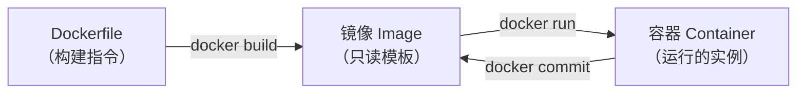

# $\rm Chapter \, 30$ Docker：让环境跟着代码走

> 你给队友发了论文管理器的源码。他克隆下来后 `pip install` 报错——他系统里的 Python 是 3.9，你的代码用到了 3.12 的语法。他的 PostgreSQL 是 14，你的 SQL 用到了 16 才支持的语法。你在[软件、运行时、SDK 与包管理器](../02-终端与工具/09-软件运行时SDK与包管理器.md)中学过虚拟环境可以隔离 Python 版本和包——但数据库呢？系统库呢？操作系统呢？**Docker** 把整个用户态环境（包括操作系统用户空间、运行时、依赖、你的代码）打包成一个标准化的镜像，在任何人的机器上以完全相同的方式运行。

> **开始前自检**：本章假设你已经会：
>
> - □ 理解进程、端口与配置文件（第 11 章 §11.5；第 13 章 §13.5、§13.7.2）
> - □ 装过并运行过软件或服务（第 13 章 §13.1.2、§13.4）
> - □ 在终端执行过命令（第 2 章 §2.4、§2.8）

## $\rm \S \, 30.1$ Docker 的核心思想：把环境“装箱”

这个镜像可以在任何装有 Docker 的机器上以完全相同的方式运行——不需要重装 Python、不需要配数据库、不需要手动处理动态库冲突。

> **类比**：你的 C++ 程序编译出来是一个 `.exe` 文件，拿到任何装有匹配动态库的机器上就能运行。Docker 镜像相当于连动态库和操作系统用户空间也打包进来——“可执行文件 + 它的整个世界”。你不用再关心目标机器装了哪个版本的 Python、Postgres 是什么版本、系统里有没有 `libopenblas.so`——这些都在镜像里。

### $\rm \S \, 30.1.1$ Docker 不是什么

理解了 Docker 是什么后，先澄清三个常见误解：

- **不是虚拟机**：虚拟机（VM）是一台完整的虚拟电脑——有自己的内核、驱动、init 系统。Docker 容器和宿主机**共享同一个操作系统内核**，容器只是一个隔离的用户空间。所以启动容器只需秒级（不需要启动 OS），内存开销极小（不需要加载内核）。
- **不是云平台**：Docker 在你的本地机器上运行。你可以把 Docker 镜像部署到任何云上，但 Docker 本身不是云。
- **不是万能药**：“在我电脑上用 Docker 能跑”不代表“在服务器上一定没问题”——如果容器内部硬编码了 `localhost`、依赖了特定内核版本、或者端口和宿主机冲突，问题依然存在。

## $\rm \S \, 30.2$ 镜像与容器：类与实例



- **镜像**（image）是只读的模板——包含文件系统、依赖、你的代码。像[从竞赛 C++ 到工程 C++](../06-编程语言/15-C++从竞赛到工程.md)中类的定义。
- **容器**（container）是镜像的运行实例——在镜像之上加了一层可写层。像类的实例（对象）。

同一个镜像可以同时启动多个容器，就像 `std::vector<int>` 可以创建多个实例。每个容器有自己的文件系统可写层，修改不会影响镜像或其他容器。

> 如果删除一个容器（`docker rm`），容器可写层上所有修改都会丢失。需要持久化的数据（数据库、文件）要存放在容器的可写层之外，通常用**数据卷**（volume）——卷独立于容器生命周期（绑定挂载宿主目录是另一种方式，两者对比见 §30.9）。

### $\rm \S \, 30.2.1$ 镜像分层：为什么镜像能共享、又为什么删不掉东西

上面说“容器在镜像之上加了一层可写层”——这句话里的“层”不是比喻，而是文件系统的实际结构。**每条会改变文件系统的 Dockerfile 指令产生一个只读层**，镜像就是这些层按顺序叠起来的集合：

```text
容器可写层（可读写，容器一删就没了）
────────────────────────────────
第 4 层：COPY . .            （源码）
第 3 层：RUN pip install ...  （依赖）
第 2 层：COPY requirements.txt .
第 1 层：FROM python:3.12-slim （基础镜像，本身也是多层）
```

把多层叠成一个可用的文件系统，靠的是**联合文件系统**（Union File System，如 overlay2）。它提供一个统一的目录视图：读取某个文件时从最上层往下找，第一个找到的版本生效；写文件时，若它来自只读层，就先把这一份复制到可写层再改（叫**写时复制**，Copy-on-Write）。所以容器改一个来自镜像的文件，开销是复制那一个文件，而不是整个镜像。

分层的两个直接后果：

**一是层可以被复用。** `python:3.12-slim` 这层的内容对所有基于它的镜像只有一份，磁盘上不会为每个镜像复制一遍；`docker pull` 时输出里那些 `Pull complete` 的层 ID，如果本地已有就显示 `Already exists`——它是按层下载的，不是按镜像整体下载。同一个 Dockerfile 第二次构建时命中缓存（§30.4 提到的 “Using cache”），也是同一套机制。

**二是删除文件不会让镜像变小。** 在某一层执行 `RUN rm -rf /tmp/bigfile`，产生的效果是在**新层里记一条“这个路径已删除”的标记**，下面那层里的原始文件仍然完整存在、仍占空间。因为层是只读的，没人能回去修改历史层。用 `docker history <image>` 能看到每一层的大小，`RUN` 那一层看起来很小（只有删除标记），而引入大文件的那一层照样很大。

```bash
# 观察一个镜像各层的大小（CREATED BY 是产生该层的指令）
docker history python:3.12-slim
docker history paper-api
# SIZE 为 0B 的行通常是元数据指令（ENV、CMD、EXPOSE），不产生文件系统层
```

要让镜像**真正变**小，得让那个大文件从不进入任何层：

1. **同一条 `RUN` 里下载并删掉**：`RUN curl -o /tmp/x.tar.gz ... && tar ... && rm /tmp/x.tar.gz` ——临时文件在同一层内创建又删除，不会留在历史层里（这正是 `pip install --no-cache-dir` 的原理：不把 pip 的下载缓存留在层里）。
2. **多阶段构建**：把编译工具链和大文件留在 builder 阶段，只把最终产物复制到运行镜像（§30.8 详述）。
3. **`--squash`**（`docker build --squash`）：把构建结果压成一层。它是实验性选项且会丢掉层缓存带来的复用能力，日常工程中不如前两种常用。

> **竞赛生迁移提示**：可以把它类比成“带版本历史的数组快照”。只读层像已提交的历史版本，可写层是当前工作区；`rm` 相当于在最新版本里记录“这个元素视为不存在”，历史版本中的元素仍在，总内存不会因此减少。想缩小总内存，只能从一开始就不把大对象放进任何一个版本。

---

## $\rm \S \, 30.3$ 第一个容器

```bash
# 拉取 Python 官方镜像并启动
docker run -it python:3.12-slim bash
# -i: 交互模式（保持 stdin 打开）
# -t: 分配伪终端
# python:3.12-slim: 镜像名——Python 3.12，slim 是精简版（不含编译器/文档）
# bash: 容器启动后运行 bash（而不是 Python）

# 在容器中：
python --version       # Python 3.12.x
which python           # /usr/local/bin/python
exit                   # 退出并停止容器
```

这个容器里的 Python 和你的宿主系统的 Python **完全隔离**——文件系统、PATH、包、用户都是容器自己的。

### $\rm \S \, 30.3.1$ 核心命令

```bash
docker pull python:3.12-slim        # 下载镜像（run 时会自动 pull）
docker images                       # 列出本地镜像
docker ps                           # 列出正在运行的容器
docker ps -a                        # 包括已停止的容器
docker logs <container>             # 查看容器输出
docker exec -it <container> bash    # 进入正在运行的容器
docker stop <container>             # 停止（发 SIGTERM，优雅退出）
docker rm <container>               # 删除容器
docker rmi <image>                  # 删除镜像
```

### $\rm \S \, 30.3.2$ 端口映射

容器内的服务监听自己的网络栈。要让宿主机的浏览器访问容器内的服务，需要端口映射：

```bash
docker run -p 8000:8000 paper-api
# -p 宿主机端口:容器端口
# 访问 localhost:8000 → 转发到容器内 8000 端口
```

回顾[域名、HTTPS、代理与排障](../04-网络/24-域名HTTPS代理与排障.md)中的反向代理概念——Docker 的端口映射在效果上类似一层简化的反向代理（准确说它工作在四层：只按端口转发，不解析 HTTP 内容）。

### $\rm \S \, 30.3.3$ PID 1 与信号：为什么 `docker stop` 有时要等 10 秒

前面 §30.3.1 把 `docker stop` 注释为“发 SIGTERM，优雅退出”。这个说法在**应用自己处理 SIGTERM 时**成立，但它有一个很容易踩空的默认行为。

容器里的第一个进程（你通过 `CMD` 或 `docker run` 启动的那个）在容器内看到的 PID 是 **1**。Linux 内核把 PID 1 当作特殊进程：**它不施加默认的信号动作**。普通进程收到没有注册处理函数的 `SIGTERM`，内核默认把它终止；PID 1 收到未处理的 `SIGTERM` 时，信号被静默丢弃，进程继续运行。

这个设计的本意是保护 init 系统（systemd、sysvinit）：关机流程由它自己决定，不能因为一个默认动作就死掉。但它同样作用于容器里的应用——于是出现这样的现象：

```bash
docker stop <container>
# 过了整整 10 秒才返回；期间容器状态是 Up (10 seconds) 之类
# docker stop -t 1 <container>  # 可把等待时间改成 1 秒
```

`docker stop` 的实际行为是：向容器内 PID 1 发 `SIGTERM`，等待默认 $10$ 秒的宽限期；如果进程还在，就补一个 `SIGKILL`（不可捕获，立即杀死）。如果应用没处理 `SIGTERM`，那 $10$ 秒就是纯粹的空等——**本该用来关闭连接池、写完未落盘的日志、把正在处理的请求做完的“优雅退出”时间，会被白白烧掉**，最后进程还是被强制杀掉，第 13 章讲的 graceful shutdown 在容器里等于没生效。

三种修法，从最推荐到最应急：

**一、应用自己处理 `SIGTERM`。** Flask 用 `waitress` 或 Gunicorn 这类 WSGI 服务器时，它们本来就处理 `SIGTERM`；自己写循环的服务要注册处理函数。这既是正解，也是优雅退出真正的落点。

**二、用 `exec` 形式写 `CMD`。** 两种写法有实质区别：

```dockerfile
# shell 形式：Docker 会执行 /bin/sh -c "python app.py"
# 于是容器里 PID 1 是 sh，python 是 sh 的子进程
CMD python app.py

# exec 形式：pid 1 直接就是 python，信号直达应用
CMD ["python", "app.py"]
```

shell 形式下 `SIGTERM` 发给了 `sh`。`sh` 通常不会把它转发给子进程（且 `sh` 作为 PID 1 也会忽略未处理的 `SIGTERM`），子进程因此收不到任何通知。manifest 里能看到痕迹：`docker exec <container> ps aux` 显示两个进程时，通常就是这种写法。

**三、加 `--init`（tini）。** 启动容器时加 `--init`，或 Dockerfile 里写 `ENTRYPOINT ["tini", "--"]`，Docker 会在你的命令前插入一个极小的 init 程序。它做两件事：转发信号给子进程、回收孤儿进程（避免僵尸进程堆积）。适用于**不方便改应用代码**的第三方镜像。

可复现实验（需本机安装 Docker 后验证）：让一个脚本忽略 `SIGTERM`，观察 `docker stop` 的真实耗时。

```bash
# 1. 启动一个只 sleep、不处理信号的容器（sh 作为 PID 1）
docker run -d --name pid1-lab alpine sh -c 'sleep 600'
# 2. 计时停止它
time docker stop pid1-lab
# 预期：real 约 10 秒——SIGTERM 被 PID 1 忽略，docker stop 等满宽限期后发 SIGKILL
docker rm pid1-lab

# 3. 同样是 sleep，但加 --init（tini 作为 PID 1，它会转发信号）
docker run -d --init --name pid1-lab2 alpine sh -c 'sleep 600'
time docker stop pid1-lab2
# 预期：远小于 10 秒——tini 收到 SIGTERM 后转发给子进程，sleep 立即结束
docker rm pid1-lab2

# 4. 对照：直接 exec 启动的进程本身就是 PID 1，且它处理了 SIGTERM（sleep 默认会响应 SIGTERM）
docker run -d --name pid1-lab3 alpine sleep 600
time docker stop pid1-lab3
# 预期：秒级返回
docker rm pid1-lab3

# 5. 观察某个容器的 PID 1 到底是什么
docker exec <container> ps -o pid,ppid,comm -p 1
```

把第 1 步和第 4 步的结果对比，就能明白“优雅退出为什么有时形同虚设”；把第 3 步加进去，可以看清 `--init` 补上的正是“信号转发”这一环。

> **经验规则**：写完 Dockerfile 后用 `docker stop` 计时一次。如果每次都要 10 秒，说明应用没有收到或没有处理 SIGTERM——这是排查“上线后请求被硬断、数据没来得及落盘”的第一条线索。想缩短宽限期可以用 `docker stop -t 3`，但那只是把强制杀死提前，不是修复。

---

## $\rm \S \, 30.4$ Dockerfile：把环境写成代码

`Dockerfile` 是构建镜像的“食谱”：

```dockerfile
# 论文管理器后端 Dockerfile
FROM python:3.12-slim                          # 基础镜像

WORKDIR /app                                    # 设置工作目录

COPY requirements.txt .                         # 先复制依赖列表（利用缓存）
RUN pip install --no-cache-dir -r requirements.txt  # 安装依赖

COPY . .                                        # 复制所有源码

EXPOSE 8000                                     # 声明容器监听哪个端口（文档作用）
CMD ["python", "app.py"]
```

逐条解释：

- **FROM**：以哪个镜像为基础。`python:3.12-slim` 包含了 Python 3.12 和 pip，但不含编译器。
- **WORKDIR**：后续命令在哪个目录中执行。`/app` 如果不存在会自动创建。
- **COPY**：把宿主机的文件复制到镜像中。**先COPY依赖列表→RUN安装→再COPY源码**——如果 `requirements.txt` 没变，Docker 缓存 `RUN pip install` 的结果，避免每次构建都重新下载所有依赖。
- **RUN**：构建镜像时执行的命令。
- **EXPOSE**：文档性质——声明容器将监听 8000 端口（不影响实际网络行为）。
- **CMD**：容器启动时默认执行的命令。

构建并运行：

```bash
docker build -t paper-api .         # 构建镜像（-t 命名）
docker run -p 8000:8000 paper-api   # 启动容器
curl http://localhost:8000/api/papers  # 测试
```

---

## $\rm \S \, 30.5$ Docker Compose：编排多个服务

你的论文管理器需要三个服务：前端（Vite）、后端（Python）、数据库（PostgreSQL）。每个服务一个容器，用 Compose 统一管理。

```yaml
# docker-compose.yml
services:
  db:
    image: postgres:16-alpine
    environment:
      POSTGRES_DB: paperdb
      POSTGRES_PASSWORD: ${DB_PASSWORD}    # 从环境变量读取——不写进文件
    volumes:
      - pgdata:/var/lib/postgresql/data    # 数据卷——持久化数据库
    ports:
      - "5432:5432"

  backend:
    build: ./backend
    environment:
      DATABASE_URL: postgresql://postgres:${DB_PASSWORD}@db:5432/paperdb
      # "db" 是 Compose 的服务名——自动解析为容器 IP
    ports:
      - "8000:8000"
    depends_on:
      - db                                   # 等待 db 启动

  frontend:
    build: ./frontend
    ports:
      - "5173:5173"
    depends_on:
      - backend

volumes:
  pgdata:                                    # 命名卷——数据独立于容器
```

一键启动所有服务：

```bash
docker compose up -d        # -d: 后台运行
docker compose logs -f      # 实时查看所有服务日志
docker compose down         # 停止并删除所有容器（数据卷保留）
docker compose down -v      # 同时删除数据卷——彻底重置
```

---

## $\rm \S \, 30.6$ 安全与最佳实践

1. **不要在 Dockerfile 中写密码/Token**。用环境变量（`${VAR}`）或 Docker Secrets（`docker secret`，只在 Swarm 集群模式下可用，超出本书范围）。
2. **不要以 root 运行容器**。在 Dockerfile 中添加 `USER 1000`（或非 root 用户）。
3. **用 `.dockerignore` 排除不需要的文件**——和 `.gitignore` 类似规则。排除 `.git`、`node_modules`、`venv`、`__pycache__` 可以显著减小构建上下文。
4. **不挂载不必要的宿主目录**。谨慎使用 `bind mount`（`-v /host/path:/container/path`）——容器对挂载目录的写操作直接影响宿主机。

---

## $\rm \S \, 30.7$ 资源限制：让容器失败而不是拖垮宿主机

默认情况下，一个容器能吃光宿主机的全部内存和 CPU。如果你在宿主机上跑了三个服务，其中一个进程内存失控，内核的 OOM Killer（Out-Of-Memory Killer）会在内存耗尽时挑一个进程杀掉——它**没有义务挑那个惹事的容器**，可能顺手把数据库杀了。资源限制把“谁负责”这件事变明确：给容器划一块配额，超了就杀这个容器自己。

底层机制是 **cgroup**（control group，控制组）——Linux 内核按组统计和限制资源的能力。Docker 把每个容器放进一个 cgroup，`--memory` 之类的参数就是往那个 cgroup 的限额文件里写值。容器看到的“可用内存上限”也来自 cgroup，所以很多运行时能感知到限额并按它调整自身策略（例如 JVM 的堆上限）。

```bash
# 限制内存 512MB，最多用 1.5 个 CPU 核心
# （反斜杠续行后不能再跟注释，所以说明写在这里）
#   --memory 512m      硬上限：超过即 OOM
#   --memory-swap 512m 内存 + swap 的总上限；设成与 --memory 相同表示禁用 swap
#   --cpus 1.5         CPU 配额，1.5 表示可占 1.5 个核心的计算时间
docker run -d --name api \
  --memory 512m \
  --memory-swap 512m \
  --cpus 1.5 \
  -p 8000:8000 paper-api

# 观察实时用量
docker stats            # 每行：CPU%、内存用量/上限、网络与磁盘 IO
docker stats --no-stream  # 只打印一次（适合放进脚本）
```

几个容易误解的点：

- **超内存是“被杀”，不是“变慢”**：内存是硬边界，容器内进程申请超过限额时分配失败，容器以退出码 137 被终止（$128+9$，即收到信号 9 / SIGKILL）。看到 137 且 `docker inspect <container> --format '{{.State.OOMKilled}}'` 为 `true`，就可以判定是 OOM，而不是代码崩溃。
- **CPU 超限是“变慢”**：`--cpus` 是配额，容器用满配额时会被内核限流（throttle），请求延迟升高但不会被杀。所以“CPU 打满”表现为响应变慢，“内存打满”表现为进程消失——这两种现象指向的处理完全不同。
- **`--memory-swap` 要一起设**：只设 `--memory` 时，容器仍可能使用 swap，实际内存压力会被 swap 掩盖一部分，延迟变得难以解释。显式设 `--memory-swap` 等于 `--memory` 可以关掉这条模糊地带。
- **限制不是越小越好**：给 Python 服务 128MB 反而会让它在正常流量下就 OOM。先用 `docker stats` 观察正常运行一天的内存峰值，再留 $20\%\text{–}30\%$ 余量设限。

Compose 里同样可以设（写成 `deploy.resources` 或 `mem_limit`/`cpus`，视 Compose 版本；生产环境用 `deploy.resources.limits`）。可复现观察（需本机安装 Docker 后验证）：起一个会被限制的容器并加压，看 `docker stats` 的内存列顶到上限、然后容器退出码 137。

---

## $\rm \S \, 30.8$ 多阶段构建：把编译工具链留在构建阶段

编译型语言（C++、Go、Rust）的镜像有个常见浪费：编译需要一整套工具链（gcc/g++、头文件、CMake），而**运行**只需要一个二进制和它依赖的少量动态库。把工具链留在最终镜像里，体积能差出一到两个数量级，也放大了攻击面（编译器可以被用来在容器内编译恶意代码）。

多阶段构建（multi-stage build）让一个 Dockerfile 里有多个 `FROM`：前一个阶段（**builder**）负责编译，后一个阶段只从 builder **复制产物**，工具链本身从不进入最终镜像。

```dockerfile
# 阶段一：builder —— 只用来编译，不会出现在最终镜像里
FROM gcc:14 AS builder
WORKDIR /src
COPY . .
RUN g++ -O2 -std=c++20 -o paper-cli main.cpp parser.cpp \
        -static-libstdc++ -static-libgcc

# 阶段二：运行镜像 —— 只带产物，不带编译器
FROM debian:12-slim
WORKDIR /app
COPY --from=builder /src/paper-cli /app/paper-cli
USER 1000
ENTRYPOINT ["/app/paper-cli"]
```

与 §30.2.1 的分层机制呼应：`COPY --from=builder` 只把**文件**复制进新阶段，不复制 builder 的任何层。所以 `gcc:14` 的几百 MB 完全不进入最终镜像——这比“在同一个阶段里编译完再 `rm` 掉工具链”干净得多，因为被删除的层仍然会留在镜像里（§30.2.1 讲的正是这件事）。

```bash
docker build -t paper-cli .
docker images paper-cli        # 预期：几十 MB 量级，而不是 gcc 镜像的数百 MB
docker history paper-cli       # 层数很少，且没有任何一层来自 gcc
```

三种缩小镜像的手段的选择依据：**能删干净的临时文件**用同层 `rm`；**构建工具链留在构建期**用多阶段构建；**确实需要同一层交付**才考虑 `--squash`（代价是失去层复用与缓存）。

---

## $\rm \S \, 30.9$ 数据持久化：volume、bind mount 与 tmpfs

§30.2 提到容器可写层随容器销毁而消失，所以数据要放到外面。具体有三种挂载方式，它们的差别在**数据存在哪、活多久、以及谁负责管理**。

| | volume（卷） | bind mount（绑定挂载） | tmpfs |
|---|---|---|---|
| 数据实际位置 | Docker 管理区（Linux 上默认 `/var/lib/docker/volumes/<名字>/_data`；Docker Desktop 在虚拟机内部） | 你指定的**宿主机路径** | 内存 |
| 生命周期 | 独立于容器，直到 `docker volume rm` | 与宿主机目录一致，容器删了文件还在 | 容器停止即消失 |
| 谁创建、谁管理 | `docker volume create` 或 `-v name:/path` 自动创建，`docker volume ls` 可列 | 你自己事先建好目录 | 无 |
| 跨平台一致性 | 三种平台行为一致 | **差异明显**——见下文 | 仅 Linux 容器 |
| 典型用途 | 数据库数据、上传文件、需要备份的持久数据 | 开发时把源码挂进容器、改完立即生效、挂配置文件 | 临时缓存、密钥文件、高性能但可丢的中间数据 |

写法上的区别只有一个小细节：

```bash
docker run -v paper-data:/data paper-api        # 卷（名字不以 / 或 ./ 开头）
docker run -v "$PWD/src:/app/src" paper-api     # 绑定挂载（路径以 / 或 ./ 或盘符开头）
docker run --mount type=tmpfs,destination=/tmp paper-api
# 也可用更明确的 --mount 语法：--mount type=volume,source=paper-data,target=/data
```

**Docker Desktop 上 bind mount 的性能问题**：在 macOS 和 Windows 上，Docker 跑在一个轻量虚拟机里，宿主机文件系统与虚拟机文件系统是两套。绑定挂载需要跨这道边界同步文件访问，因此**大量小文件读写**（比如 `node_modules`、Python 的导入）会明显变慢——这是 Windows/macOS 上的已知代价，Linux 上不存在，因为容器与宿主机共用同一套文件系统。应对办法：把依赖目录放在容器内（用卷覆盖它，而不是绑定挂载宿主机目录）、或改用 Compose 提供的文件同步机制。

**选择依据**（不是绝对规则，取决于目标）：

- 数据要备份、要迁移、要跟容器解耦 → **卷**。`docker volume rm` 会永久删除卷内数据，执行前先确认（§30.11.2 的实践与清理步骤）。
- 开发时想让宿主机改动立即在容器生效、或挂载配置文件 → **bind mount**，但要接受跨平台性能差异，并注意容器对写操作会直接改到你的宿主机文件。
- 数据是临时的、或出于安全考虑不希望落盘（例如只读挂载进来的密钥副本）→ **tmpfs**。

> **安全提示**：`-v /var/run/docker.sock:/var/run/docker.sock` 这类挂载让容器能控制宿主机上的 Docker，等于把宿主机权限交给了容器。它确实被一些工具（如某些 CI、监控）使用，但要清楚这是**信任边界内的操作**，不是普通的目录挂载。

---

## $\rm \S \, 30.10$ 容器网络：`localhost` 指的不是你的电脑

### $\rm \S \, 30.10.1$ bridge 网络与 `docker0`

每个容器有自己的**网络命名空间**（network namespace）——独立的一套网卡、路由表、`localhost`。Docker 默认给容器接上一个叫 `bridge` 的虚拟网络：宿主机上会出现一个虚拟网桥设备 `docker0`，每个容器从它那里分到一个私有 IP（默认 `172.17.0.0/16` 网段）。容器之间通过这个网桥通信，宿主机也能看到这些虚拟网卡。

```bash
docker network ls              # 列出网络（默认有 bridge/host/none）
docker network inspect bridge  # 看这个网段里各容器的 IP
ip addr show docker0           # Linux 宿主机上查看网桥（Windows/macOS 需进入 Docker 虚拟机）
docker exec <container> hostname -i   # 查看某容器拿到的 IP
```

`host` 网络模式（`--network host`）则完全跳过这层：容器直接使用宿主机的网络命名空间，端口不再需要映射，但也就失去了网络隔离；`none` 表示不给网络。日常用默认的 bridge。

### $\rm \S \, 30.10.2$ 端口映射是怎么实现的

§30.3.2 说过 `-p 8000:8000` 把宿主机端口转发到容器。机制在 Linux 上是 **iptables 的 DNAT**（Destination NAT，目标地址转换）：Docker 在 `nat` 表的 `DOCKER` 链里插入一条规则，把目的端口为 $8000$ 的入站包的目标地址改写为容器 IP 的 $8000$ 端口。所以“端口映射”不是代理进程在转发，而是内核在网络层改写地址——这也是为什么它只认端口、不认识 HTTP（回顾 §30.3.2 里“工作的四层”那句）。

```bash
# Linux 上查看映射规则
sudo iptables -t nat -L DOCKER -n
# 也能看到端口占用：宿主机的 8000 是被 docker-proxy 或内核规则占用的
docker port <container>        # 查看某容器当前映射
```

这带来两个实用推论：其一，同一个宿主机端口不能被两个容器映射，冲突时报 `port is already allocated`；其二，**映射只在宿主机生效**——容器之间访问不需要映射，直接用服务名或容器 IP 就能通（这正是 §30.5 Compose 里 `DATABASE_URL` 写 `db:5432` 的原因，`db` 由 Compose 的内嵌 DNS 解析成容器 IP）。

### $\rm \S \, 30.10.3$ 容器内的 `localhost` 指向容器自己

这是从宿主机迁移到容器时最常见的困惑：在容器里写 `http://localhost:8000`，访问的是**这个容器自己**的 8000 端口，不是宿主机的，也不是别的容器的。因为每个容器有独立的网络命名空间，`localhost`（`127.0.0.1`）在容器内解析到容器自己的回环接口。

对照 §23.9 的结论：容器内服务必须监听 `0.0.0.0` 才能被端口映射转发来的连接接住——监听 `127.0.0.1` 时只有容器自己连得上，宿主机映射来的连接目标地址是容器的非回环 IP，会被拒绝。两者是同一条机制的两面：**网络命名空间隔离了 `localhost`，映射负责把连接送进容器的网卡。**

需要从容器访问宿主机上的服务时：

- **Docker Desktop（Windows/macOS）**：用特殊主机名 `host.docker.internal`，Docker 会把它解析到宿主机的地址。§32.4.2 的 Uptime Kuma 实践用的就是这个：监控容器要访问宿主机上的本地服务时，地址不能写 `localhost`，要写 `host.docker.internal`。
- **Linux 上默认没有这个主机名**，可用 `--add-host host.docker.internal:host-gateway` 添加到容器的 `/etc/hosts`，或直接用宿主机的局域网 IP（用 `ip addr` 查）。
- **更好的做法**：让两个服务都在 Compose 网络里，用服务名通信，完全绕开“跨出容器访问宿主机”这类问题。

```bash
# 验证容器内 localhost 的含义（需本机安装 Docker 后验证）
docker run -it --rm alpine sh -c 'wget -qO- http://localhost:1/ ; echo "exit=$?"'
# 预期：连接失败（容器内 1 端口没有服务），说明 localhost 指的是容器自己
docker run -it --rm alpine sh -c 'cat /etc/hosts'
# 预期：能看到容器自己的 127.0.0.1 与它从 bridge 网络拿到的 IP——两套地址互不影响
```

---

## $\rm \S \, 30.11$ 动手实践

### $\rm \S \, 30.11.1$ 实践一：容器化 Python 后端

1. 在论文管理器后端目录创建 Dockerfile（内容见 §30.4）——目录里应有可运行的 `app.py`、`requirements.txt`。
2. `docker build -t paper-api .`——构建输出随构建器版本略有差异，成功标志是最后出现 `paper-api` 镜像名（BuildKit 会打印 `naming to docker.io/library/paper-api:latest`）；失败时看第一条 `ERROR`。
3. `docker run -p 8000:8000 paper-api`——成功判据：另一个终端里 `curl http://localhost:8000/api/papers` 返回 JSON；若报 `port is already allocated`，换一个宿主机端口再试。
4. 用 `curl` 或浏览器验证 API 正常响应（同上一步）。
5. `docker logs <container>` 查看输出——应看到后端启动日志；`docker exec -it <container> bash` 进入容器后 `ls /app` 能看到源码，说明镜像内容符合预期。

> 前置：论文管理器后端可本地运行，当前目录就是后端目录（含 Dockerfile）；Docker 可用（`docker --version` 有输出）。成功判据：`docker ps` 显示容器 `Up`，`curl http://localhost:8000/api/papers` 返回 JSON。清理：`docker stop <container> && docker rm <container>`；若要连镜像一起删，再加 `docker rmi paper-api`。

### $\rm \S \, 30.11.2$ 实践二：添加数据卷

1. 修改 Dockerfile，确保 SQLite 数据库文件存储在 `/data/` 目录（例如把数据库路径改成由 `DATABASE_PATH=/data/papers.db` 之类的环境变量控制）。
2. `docker run -v paper-data:/data -p 8000:8000 paper-api`——成功判据：`docker volume ls` 里出现 `paper-data`，容器正常响应请求。
3. 在容器内插入几条数据（用后端的 POST 接口最省事；`python:*-slim` 镜像里没有 `sqlite3` 命令行，用 `docker exec <container> python -c ...` 走 Python 的 sqlite3 模块也可以），然后删除容器：`docker rm -f <container>`。
4. 重新启动一个同样的容器（挂载同一个卷）：`docker run -v paper-data:/data -p 8000:8000 paper-api`——成功判据：之前插入的数据仍能查到（卷独立于容器生命周期）。

> 前置：完成实践一且镜像可构建；后端支持把数据库路径配置到 `/data`。成功判据：删除容器并重建后，数据仍然存在。清理：`docker rm -f <container>`；确认不再需要这些数据后，再 `docker volume rm paper-data`（该命令会永久删除卷内数据）。

### $\rm \S \, 30.11.3$ 实践三：Compose 启动全栈

1. 用上面的 `docker-compose.yml` 启动前端+后端+数据库——成功判据：`docker compose ps` 三个服务都是 `running`。
2. `docker compose logs -f` 观察三个服务的启动顺序——应看到 db 先就绪、backend 与 frontend 随后开始监听；`depends_on` 只保证启动顺序，不保证 db 已经能接受连接。
3. 在前端页面中添加一条论文，确认数据库已持久化——成功判据：`docker compose restart backend` 后这条记录仍能查到（或后端 API 返回的条数增加）。
4. `docker compose down -v` 彻底清理——成功判据：`docker compose ps` 不再列出服务，数据卷也被删除。

> 前置：项目根目录有 §30.5 的 `docker-compose.yml`，并在同目录的 `.env` 里设置 `DB_PASSWORD`（Compose 会读取它）。成功判据：三个服务同时运行，写入的数据在容器重启后仍在。清理：只想停止服务、保留数据用 `docker compose down`；`docker compose down -v` 会连数据卷一起删除（数据永久丢失，确认不需要后再执行）。

---

## $\rm \S \, 30.12$ 总结

- 镜像 = 只读模板，容器 = 运行实例 + 可写层。同一个镜像可以启动多个容器。
- 每条 Dockerfile 指令产生一个只读层，靠联合文件系统叠成统一目录视图；层可被多个镜像共享，但**删除文件只在新层留下标记，镜像不会因此变小**。
- Dockerfile 把环境构建写成代码——基础镜像→安装依赖→复制源码→设置启动命令。多阶段构建让编译工具链只留在 builder 阶段。
- 端口映射（`-p`）把容器端口暴露到宿主机，底层是 iptables DNAT；容器内 `localhost` 指容器自己。
- 数据要放在容器外：卷（volume）跨平台一致、绑定挂载（bind mount）方便开发但在 Docker Desktop 上跨文件系统有性能代价、tmpfs 只存内存。
- 容器的第一个进程是 PID 1，内核不对它施加默认信号动作——所以 `docker stop` 可能等满 10 秒才杀。用 exec 形式 `CMD`、应用自处理 `SIGTERM`、或加 `--init` 让优雅退出真正生效。
- 用 `--memory`/`--cpus` 限制资源（机制是 cgroup）：内存超限被杀（退出码 137），CPU 超限只是变慢。
- Compose 编排多个服务的启动顺序、网络和存储。

---

## $\rm \S \, 30.13$ 关键概念回顾

1. Docker 镜像和容器的区别是什么？和虚拟机的区别是什么？

2. Dockerfile 中 COPY 和 RUN 分别什么时候执行？为什么先 COPY requirements.txt 再 COPY 源码？

3. 镜像分层带来哪两个直接后果？为什么 `RUN rm -rf` 一个大文件不会让镜像变小？

4. 容器里的 1 号进程（PID 1）和普通进程在信号处理上有什么不同？`docker exec <container> ps` 看到两个进程，通常说明 Dockerfile 有什么问题？

5. `--memory` 超限和 `--cpus` 超限分别表现为什么现象？靠什么观察？

## $\rm \S \, 30.14$ 应用与辨析

6. `docker run -p 8000:8000` 和直接在宿主机运行 Python 后端的区别是什么？

7. `docker compose down` 和 `docker compose down -v` 的区别是什么？另说明卷、绑定挂载、tmpfs 三者该在什么场景下选哪个。

8. 你的容器每次 `docker stop` 都要等 10 秒，日志里看不到任何退出前的清理输出。列出至少两个可能原因与对应修法；再说明多阶段构建为什么能把镜像从数百 MB 降到几十 MB。

## $\rm \S \, 30.15$ 本章自测答案

> 先闭卷作答本章“关键概念回顾”与“应用与辨析”，再核对以下答案。

### $\rm \S \, 30.15.1$ 自测答案 · 关键概念回顾
1. 镜像是只读模板，容器是镜像的运行实例（加可写层）。Docker 容器和宿主机共享内核（不是虚拟机——不需要启动完整的 OS），因此启动极快（秒级）、内存开销极小。
2. COPY 在构建时执行（把宿主机文件复制到镜像），RUN 在构建时执行（运行命令）。先 COPY requirements.txt → RUN pip install → 再 COPY 源码——利用 Docker 的层缓存：只要 requirements.txt 没变，pip install 的结果就被缓存。
3. ①层可以被复用：`python:3.12-slim` 这样的基础层对基于它的所有镜像只有一份，`docker pull` 按层下载、已有层显示 `Already exists`，构建时的 “Using cache” 也是同一机制。②删除文件只是在新层记录删除标记，历史只读层里的原始文件仍在、仍占空间。所以 `RUN rm -rf` 不会让镜像变小——要让大文件不进任何层，得在同一条 `RUN` 里创建并删除、或用多阶段构建只复制产物。
4. 普通进程收到未注册处理函数的 `SIGTERM` 会被内核默认终止；PID 1 是例外，内核不施加默认动作，信号被静默丢弃。所以容器里 PID 1 不处理 `SIGTERM` 时，`docker stop` 会等满默认 $10$ 秒宽限期再发 `SIGKILL`，优雅退出失效。看到两个进程通常说明 `CMD` 用的是 shell 形式（`CMD python app.py`），PID 1 是 `sh`，它不转发信号给 `python`——改成 exec 形式 `CMD ["python", "app.py"]`。
5. `--memory` 是硬上限，超限的容器被 OOM Killer 杀掉（退出码 137，`docker inspect ... --format '{{.State.OOMKilled}}'` 为 true）；`--cpus` 是配额，超限只是被限流，表现为响应变慢而进程仍在。两者都用 `docker stats` 观察实时用量与上限。

### $\rm \S \, 30.15.2$ 自测答案 · 应用与辨析
6. 容器内是隔离的文件系统、网络栈和进程空间——不依赖宿主机的 Python 版本、系统库、全局包。但容器内服务监听 `0.0.0.0:8000` 需要容器自己的端口映射才能从宿主机访问。
7. 前者停止并删除容器和网络，保留数据卷。后者同时删除数据卷——数据彻底丢失（类似 `DROP DATABASE` + 删除备份）。三者选择：需要备份、迁移、与容器解耦的持久数据用**卷**（跨平台行为一致）；开发时要把宿主机源码改动即时映射进容器、或挂配置文件用**绑定挂载**（注意 Docker Desktop 上跨文件系统同步大量小文件会慢）；只在内存中短期存在、不希望落盘的数据用 **tmpfs**。
8. 原因一：应用没有注册 `SIGTERM` 处理函数，PID 1 忽略信号——修法是应用自己处理 `SIGTERM`（Gunicorn/waitress 等已内置，自写循环需自行注册）。原因二：`CMD` 写成了 shell 形式，PID 1 是 `sh`，它把子进程 `python` 挡在了信号之外——修法是改成 exec 形式 `CMD ["python", "app.py"]`。若第三方镜像不方便改代码，可加 `--init` 用 tini 转发信号。多阶段构建之所以能大幅瘦身，是因为 `COPY --from=builder` 只复制**产物文件**，不复制 builder 的任何层，`gcc:14` 等工具链的数百 MB 从不进入最终镜像。

---

Docker 让你的项目可以在任何机器上无差异运行。但“能运行”和“用户能通过公网访问”之间还差好几步——域名配置、HTTPS 证书、反向代理、CI/CD 部署流水线。下一章把 Docker 容器送上云。

> 你现在能：解释镜像与容器的关系与分层机制，写一个 Dockerfile（含多阶段构建）打包应用，用 docker run/ps/exec/stats 运行与排查容器，给容器设资源限制，按场景选择卷/绑定挂载/tmpfs，并解释端口映射与容器内 `localhost` 的含义
