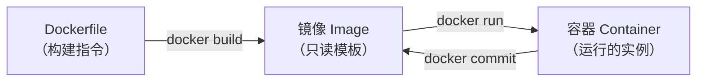

# $\rm Chapter \, 30$ Docker：让环境跟着代码走

> 你给队友发了论文管理器的源码。他克隆下来后 `pip install` 报错——他系统里的 Python 是 3.9，你的代码用到了 3.12 的语法。他的 PostgreSQL 是 14，你的 SQL 用到了 16 才支持的语法。你在[软件、运行时、SDK 与包管理器](../02-终端与工具/09-软件运行时SDK与包管理器.md)中学过虚拟环境可以隔离 Python 版本和包——但数据库呢？系统库呢？操作系统呢？**Docker** 把整个用户态环境（包括操作系统用户空间、运行时、依赖、你的代码）打包成一个标准化的镜像，在任何人的机器上以完全相同的方式运行。

> **开始前自检**：本章假设你已经会：
>
> - □ 理解进程、端口与配置文件（第 11、13 章）
> - □ 装过并运行过软件或服务
> - □ 在终端执行过命令

## $\rm \S \, 30.1$ Docker 的核心思想：把环境“装箱”

这个镜像可以在任何装有 Docker 的机器上以完全相同的方式运行——不需要重装 Python、不需要配数据库、不需要手动处理动态库冲突。

> **类比**：你的 C++ 程序编译出来是一个 `.exe` 文件，拿到任何装有匹配动态库的机器上就能运行。Docker 镜像相当于连动态库和操作系统用户空间也打包进来——“可执行文件 + 它的整个世界”。你不用再关心目标机器装了哪个版本的 Python、Postgres 是什么版本、系统里有没有 `libopenblas.so`——这些都在镜像里。

### $\rm \S \, 30.1.1$ Docker 不是什么

理解了 Docker 是什么后，先澄清三个常见误解：

- **不是虚拟机**：虚拟机（VM）是一台完整的虚拟电脑——有自己的内核、驱动、init 系统。Docker 容器和宿主机**共享同一个操作系统内核**，容器只是一个隔离的用户空间。所以启动容器只需秒级（不需要启动 OS），内存开销极小（不需要加载内核）。
- **不是云平台**：Docker 在你的本地机器上运行。你可以把 Docker 镜像部署到任何云上，但 Docker 本身不是云。
- **不是万能药**：“在我电脑上用 Docker 能跑”不代表“在服务器上一定没问题”——如果容器内部硬编码了 `localhost`、依赖了特定内核版本、或者端口和宿主机冲突，问题依然存在。

## $\rm \S \, 30.2$ 镜像与容器：类与实例



- **镜像**（image）是只读的模板——包含文件系统、依赖、你的代码。像[从竞赛 C++ 到工程 C++](../06-编程语言/15-C++从竞赛到工程.md)中类的定义。
- **容器**（container）是镜像的运行实例——在镜像之上加了一层可写层。像类的实例（对象）。

同一个镜像可以同时启动多个容器，就像 `std::vector<int>` 可以创建多个实例。每个容器有自己的文件系统可写层，修改不会影响镜像或其他容器。

> 如果删除一个容器（`docker rm`），容器可写层上所有修改都会丢失。需要持久化的数据（数据库、文件）必须存储在**数据卷**（volume）中——卷独立于容器生命周期。

---

## $\rm \S \, 30.3$ 第一个容器

```bash
# 拉取 Python 官方镜像并启动
docker run -it python:3.12-slim bash
# -i: 交互模式（保持 stdin 打开）
# -t: 分配伪终端
# python:3.12-slim: 镜像名——Python 3.12，slim 是精简版（不含编译器/文档）
# bash: 容器启动后运行 bash（而不是 Python）

# 在容器中：
python --version       # Python 3.12.x
which python           # /usr/local/bin/python
exit                   # 退出并停止容器
```

这个容器里的 Python 和你的宿主系统的 Python **完全隔离**——文件系统、PATH、包、用户都是容器自己的。

### $\rm \S \, 30.3.1$ 核心命令

```bash
docker pull python:3.12-slim        # 下载镜像（run 时会自动 pull）
docker images                       # 列出本地镜像
docker ps                           # 列出正在运行的容器
docker ps -a                        # 包括已停止的容器
docker logs <container>             # 查看容器输出
docker exec -it <container> bash    # 进入正在运行的容器
docker stop <container>             # 停止（发 SIGTERM，优雅退出）
docker rm <container>               # 删除容器
docker rmi <image>                  # 删除镜像
```

### $\rm \S \, 30.3.2$ 端口映射

容器内的服务监听自己的网络栈。要让宿主机的浏览器访问容器内的服务，需要端口映射：

```bash
docker run -p 8000:8000 paper-api
# -p 宿主机端口:容器端口
# 访问 localhost:8000 → 转发到容器内 8000 端口
```

回顾[域名、HTTPS、代理与排障](../04-网络/24-域名HTTPS代理与排障.md)中的反向代理概念——Docker 的端口映射就是一层简化的反向代理。

---

## $\rm \S \, 30.4$ Dockerfile：把环境写成代码

`Dockerfile` 是构建镜像的“食谱”：

```dockerfile
# 论文管理器后端 Dockerfile
FROM python:3.12-slim                          # 基础镜像

WORKDIR /app                                    # 设置工作目录

COPY requirements.txt .                         # 先复制依赖列表（利用缓存）
RUN pip install --no-cache-dir -r requirements.txt  # 安装依赖

COPY . .                                        # 复制所有源码

EXPOSE 8000                                     # 声明容器监听哪个端口（文档作用）
CMD ["python", "app.py"]
```

逐条解释：

- **FROM**：以哪个镜像为基础。`python:3.12-slim` 包含了 Python 3.12 和 pip，但不含编译器。
- **WORKDIR**：后续命令在哪个目录中执行。`/app` 如果不存在会自动创建。
- **COPY**：把宿主机的文件复制到镜像中。**先COPY依赖列表→RUN安装→再COPY源码**——如果 `requirements.txt` 没变，Docker 缓存 `RUN pip install` 的结果，避免每次构建都重新下载所有依赖。
- **RUN**：构建镜像时执行的命令。
- **EXPOSE**：文档性质——声明容器将监听 8000 端口（不影响实际网络行为）。
- **CMD**：容器启动时默认执行的命令。

构建并运行：

```bash
docker build -t paper-api .         # 构建镜像（-t 命名）
docker run -p 8000:8000 paper-api   # 启动容器
curl http://localhost:8000/api/papers  # 测试
```

---

## $\rm \S \, 30.5$ Docker Compose：编排多个服务

你的论文管理器需要三个服务：前端（Vite）、后端（Python）、数据库（PostgreSQL）。每个服务一个容器，用 Compose 统一管理。

```yaml
# docker-compose.yml
services:
  db:
    image: postgres:16-alpine
    environment:
      POSTGRES_DB: paperdb
      POSTGRES_PASSWORD: ${DB_PASSWORD}    # 从环境变量读取——不写进文件
    volumes:
      - pgdata:/var/lib/postgresql/data    # 数据卷——持久化数据库
    ports:
      - "5432:5432"

  backend:
    build: ./backend
    environment:
      DATABASE_URL: postgresql://postgres:${DB_PASSWORD}@db:5432/paperdb
      # "db" 是 Compose 的服务名——自动解析为容器 IP
    ports:
      - "8000:8000"
    depends_on:
      - db                                   # 等待 db 启动

  frontend:
    build: ./frontend
    ports:
      - "5173:5173"
    depends_on:
      - backend

volumes:
  pgdata:                                    # 命名卷——数据独立于容器
```

一键启动所有服务：

```bash
docker compose up -d        # -d: 后台运行
docker compose logs -f      # 实时查看所有服务日志
docker compose down         # 停止并删除所有容器（数据卷保留）
docker compose down -v      # 同时删除数据卷——彻底重置
```

---

## $\rm \S \, 30.6$ 安全与最佳实践

1. **不要在 Dockerfile 中写密码/Token**。用环境变量（`${VAR}`）或 Docker Secrets（Swarm 模式）。
2. **不要以 root 运行容器**。在 Dockerfile 中添加 `USER 1000`（或非 root 用户）。
3. **用 `.dockerignore` 排除不需要的文件**——和 `.gitignore` 类似规则。排除 `.git`、`node_modules`、`venv`、`__pycache__` 可以显著减小构建上下文。
4. **不挂载不必要的宿主目录**。谨慎使用 `bind mount`（`-v /host/path:/container/path`）——容器对挂载目录的写操作直接影响宿主机。

---

## $\rm \S \, 30.7$ 动手实践

### 实践一：容器化 Python 后端

1. 在论文管理器后端目录创建 Dockerfile。
2. `docker build -t paper-api .`
3. `docker run -p 8000:8000 paper-api`
4. 用 `curl` 或浏览器验证 API 正常响应。
5. `docker logs` 查看输出；`docker exec -it <id> bash` 进入容器探索文件系统。

### 实践二：添加数据卷

1. 修改 Dockerfile，确保 SQLite 数据库文件存储在 `/data/` 目录。
2. `docker run -v paper-data:/data -p 8000:8000 paper-api`
3. 在容器内插入几条数据，然后删除容器。
4. 重新启动一个同样的容器（挂载同一个卷）——数据还在。

### 实践三：Compose 启动全栈

1. 用上面的 `docker-compose.yml` 启动前端+后端+数据库。
2. `docker compose logs -f` 观察三个服务的启动顺序。
3. 在前端页面中添加一条论文，确认数据库已持久化。
4. `docker compose down -v` 彻底清理。

---

## $\rm \S \, 30.8$ 总结

- 镜像 = 只读模板，容器 = 运行实例 + 可写层。同一个镜像可以启动多个容器。
- Dockerfile 把环境构建写成代码——基础镜像→安装依赖→复制源码→设置启动命令。
- 端口映射（`-p`）把容器端口暴露到宿主机。数据卷（`-v`）让数据独立于容器生命周期。
- Compose 编排多个服务的启动顺序、网络和存储。

---

## $\rm \S \, 30.9$ 关键概念回顾

1. Docker 镜像和容器的区别是什么？和虚拟机的区别是什么？

2. Dockerfile 中 COPY 和 RUN 分别什么时候执行？为什么先 COPY requirements.txt 再 COPY 源码？

3. 数据卷解决什么问题？

## $\rm \S \, 30.10$ 应用与辨析

4. `docker run -p 8000:8000` 和直接在宿主机运行 Python 后端的区别是什么？

5. `docker compose down` 和 `docker compose down -v` 的区别是什么？

6. 为什么不应该在 Dockerfile 中用 `COPY .env .` 并提交到镜像仓库？

## $\rm \S \, 30.11$ 本章自测答案

> 先闭卷作答本章“关键概念回顾”与“应用与辨析”，再核对以下答案。

### 自测答案 · 关键概念回顾
1. 镜像是只读模板，容器是镜像的运行实例（加可写层）。Docker 容器和宿主机共享内核（不是虚拟机——不需要启动完整的 OS），因此启动极快（秒级）、内存开销极小。
2. COPY 在构建时执行（把宿主机文件复制到镜像），RUN 在构建时执行（运行命令）。先 COPY requirements.txt → RUN pip install → 再 COPY 源码——利用 Docker 的层缓存：只要 requirements.txt 没变，pip install 的结果就被缓存。
3. 容器可写层和容器生命周期绑定——删除容器会丢失数据。数据卷独立于容器，删除容器不影响卷中数据（如数据库文件）。

### 自测答案 · 应用与辨析
4. 容器内是隔离的文件系统、网络栈和进程空间——不依赖宿主机的 Python 版本、系统库、全局包。但容器内服务监听 `0.0.0.0:8000` 需要容器自己的端口映射才能从宿主机访问。
5. 前者停止并删除容器和网络，保留数据卷。后者同时删除数据卷——数据彻底丢失（类似 `DROP DATABASE` + 删除备份）。
6. `.env` 包含密钥/密码/Tokens。镜像可能被推送到公开仓库或被其他人拉取。密钥通过运行时环境变量注入（`-e` 或 Compose environment），不进镜像。

---

Docker 让你的项目可以在任何机器上无差异运行。但“能运行”和“用户能通过公网访问”之间还差好几步——域名配置、HTTPS 证书、反向代理、CI/CD 部署流水线。下一章把 Docker 容器送上云。

> 你现在能：解释镜像与容器的关系，写一个 Dockerfile 打包应用，用 docker run/ps/exec 运行与排查容器，理解数据卷与端口映射
