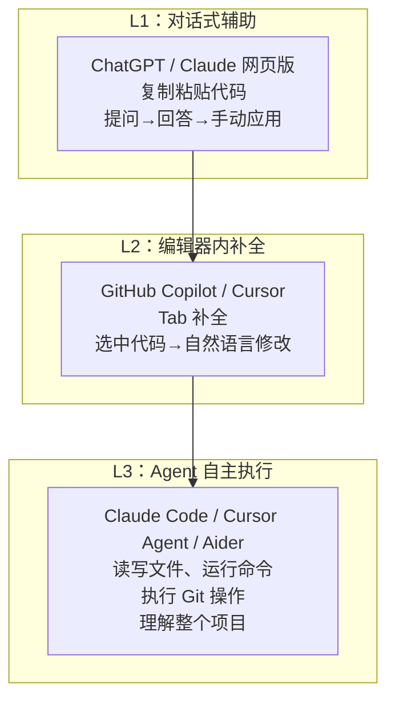

# $\rm Chapter \, 33$ AI Engineering：从 API 到 Agent

> 你已经会写代码、管版本、部署服务。现在你周围所有人都在用 AI 辅助编程——有人用 ChatGPT 网页版复制粘贴代码，有人用 GitHub Copilot 在编辑器里自动补全，有人用 Claude Code 在终端里直接让 AI 写整个功能。这些工具背后的原理是什么？怎么从“把 AI 当搜索引擎用”升级到“把 AI 当成编程系统的一部分”？这一章画出 AI Engineering 全景图。

> **开始前自检**：本章假设你已经会：
>
> - □ 会调用 HTTP API 并理解 JSON（第 23 章 §23.4 用 curl 收发 JSON；第 29 章 §29.3 的 REST 约定）
> - □ 写过 Python 脚本（第 17 章 §17.2 语法对照与 §17.9 动手实践）
> - □ 理解请求-响应与状态码（第 23 章 §23.3.3）

## $\rm \S \, 33.1$ 三个层次：你处于哪一层



你在哪个层次工作，决定了 AI 能在多大程度上减少你的机械劳动。L1——你问 ChatGPT 怎么写一个 Python 函数，复制粘贴到编辑器中——这已经比手动搜索快很多，但每次上下文都是零散的。L2——Copilot 看到你写的函数名和注释，自动建议实现——上下文是当前文件。L3——Claude Code 读完你的整个项目（CLAUDE.md、README、源码），在你描述需求后自主创建文件、修改代码、运行测试、提交 commit。

## $\rm \S \, 33.2$ 当前主流模型一览

你的论文管理器需要“输入一篇论文标题，自动生成 3—5 个标签”——不同模型在这个任务上的准确率、成本和延迟完全不同。用这个具体场景来对比模型。这个任务有两个约束：每月处理约 $10^4$ 篇论文，API 预算是 50 美元/月。

- 用 **Claude Opus 5**：准确率最高，但每篇约 0.015 美元，$10^4$ 篇 = 150 美元——超预算。
- 用 **Claude Haiku 4.5**：准确率稍低（对生僻领域论文可能标错），但每篇约 0.00025 美元，$10^4$ 篇 = 2.50 美元——在预算内。
- 用本地部署的 **Llama 4 8B**：零 API 费用，但需要一台有 GPU 的机器，且标签格式可能不够一致。

这个决策——在准确率、成本、延迟、隐私之间权衡——就是理解模型差异的实际意义。

### $\rm \S \, 33.2.1$ 闭源商业模型

| 模型 | 厂商 | 定位 | 特点 |
|---|---|---|---|
| **Claude 5 系列**（Opus/Sonnet/Fable/Haiku） | Anthropic | 安全、长上下文、深度推理 | Opus 4.8 和 Opus 5 最强推理；Haiku 4.5 最快最低成本；200K 上下文窗口 |
| **GPT-5 系列** | OpenAI | 最广生态 | ChatGPT 用户基数最大；API 生态成熟（Assistants、Function Calling） |
| **Gemini 2.5 系列** | Google | 多模态 + 搜索整合 | 原生多模态（图片/音频/视频）；与 Google 搜索深度集成 |
| **Grok** | xAI | 实时信息 | 与 X/Twitter 数据整合 |

### $\rm \S \, 33.2.2$ 开源/开放权重模型

| 模型 | 厂商 | 定位 | 特点 |
|---|---|---|---|
| **DeepSeek V4** | DeepSeek | 极高性价比 | 推理能力接近 Opus，成本极低；支持 Anthropic API 兼容接口 |
| **Llama 4** | Meta | 开源基石 | 社区生态最丰富（微调、量化版本最多） |
| **Qwen 3** | 阿里 | 多语言 + 长上下文 | 中文能力突出；1M 上下文 |
| **Mistral** | Mistral AI | 欧洲独立 | 中小模型性能优秀；注重透明度 |

### $\rm \S \, 33.2.3$ 怎么选——一个实用框架

| 场景 | 推荐选择 | 理由 |
|---|---|---|
| 写一个复杂功能的完整实现 | Claude Opus / GPT-5 | 推理深度最高，跨文件理解最好 |
| GitHub Copilot 自动补全 | Claude Sonnet / GPT-4o-mini | 低延迟、高频调用，不需要深度推理 |
| 审阅一大片代码的 bug | Claude Sonnet / DeepSeek V4 | 长上下文（200K/1M tokens），高性价比 |
| 几十个简单重复任务并发 | Claude Haiku / DeepSeek Flash | 极低成本，高频调用 |
| 分析图片/截图/PowerPoint | GPT-5 / Gemini | 原生视觉 |
| 中文项目、国内网络环境 | DeepSeek / Qwen | 中文理解好、API 延迟低 |
| 隐私敏感、不能传云端 | Llama 4（本地部署） | 数据不出本机 |

**关键认知**：你不是在“信仰”某一个模型——你是根据任务在延迟、成本、推理深度之间做 trade-off。一个典型的 Claude Code 配置（就是你正在读的这套教材的编写环境）会同时使用两个模型：主模型（Opus/Pro）做规划和综合写作，子任务模型（Haiku/Flash）做轻量搜索和检查。

---

## $\rm \S \, 33.3$ API 基础：不只是“调一个 URL”

### $\rm \S \, 33.3.1$ 三种交互模式

**对话模式**（Chat Completions）——你最熟悉的：发送一系列 user/assistant 消息，模型返回回复。每次请求是独立的（没有记忆——你需要把历史消息一并发送才能维持上下文连续性）。

**工具调用**（Tool Use / Function Calling）——模型不直接返回文本，而是返回“我想调用这个函数，参数是这些”。你的代码执行这个函数，把结果发回给模型，模型继续推理。这是 Agent 的基础。

**嵌入**（Embeddings）——把文本转换成固定长度的数字向量。语义相近的文本向量距离近。用于搜索（RAG——Retrieval Augmented Generation：“先从知识库中检索相关内容，再让模型基于检索结果回答”）。

### $\rm \S \, 33.3.2$ 兼容接口：不只是 OpenAI 的格式

Anthropic、OpenAI、Google 各有自己的 API 格式。但你可以通过兼容层统一调用：

- **Anthropic 兼容**：DeepSeek、一些开源模型托管平台支持 Anthropic Messages API 格式。
- **OpenAI 兼容**（最广泛）：几乎每个第三方模型提供者都支持 `/v1/chat/completions` 格式。工具如 **LiteLLM**（github.com/BerriAI/litellm）和 **OpenRouter**（openrouter.ai）让你用同一个 API key、同一段代码切换不同模型。

### $\rm \S \, 33.3.3$ Token 与计费

**Token** 是模型处理文本的最小单位——不是单词，也不是字符。粗略估算：英文 ~4 字符/1 token，中文 ~1.5 汉字/1 token。1000 tokens ≈ 750 英文单词 ≈ 1500 汉字。

模型计费按输入 token 数 + 输出 token 数。输出比输入贵（需要生成，不只是读取）。不同模型价差可达百倍——Claude Sonnet 每百万输入约 3 美元，DeepSeek V4 约 0.3 美元以内。

Claude Code 的 `/status` 命令可以查看当前会话的 token 用量（输入/输出/缓存命中），进而估算成本。了解这个数字不是为了省钱焦虑——是为了让你对“一个复杂任务到底消耗了多少计算”有直觉。

### $\rm \S \, 33.3.4$ 在设计阶段估算单次请求成本

```python
# estimate_cost.py：运行前估算，运行后核对——两者对不上说明模型没按预期工作
INPUT_PRICE = 3.00     # 每百万输入 token 的价格（美元），以模型定价页为准
OUTPUT_PRICE = 15.00   # 每百万输出 token

def estimate(input_tokens, output_tokens):
    return input_tokens / 1e6 * INPUT_PRICE + output_tokens / 1e6 * OUTPUT_PRICE

# 论文标签任务：system prompt 800 + 论文正文 1200，输出 60
print(f"单篇: {estimate(2000, 60):.5f} 美元")
print(f"每月 1 万篇: {estimate(2000, 60) * 10000:.2f} 美元")
```

预期输出与判据（Python 3.12 实测）：打印 `单篇: 0.00690 美元` 与 `每月 1 万篇: 69.00 美元`。把这个数与 §33.2 里给论文打标签的预算（50 美元/月）对照——同一个任务换一个输入价位的模型结论就完全不同，而这件事在设计阶段就能算出来，不必等账单。

估算里最容易低估的是**输入会随对话增长**：Agent 每轮都要把完整历史重发一次。第 10 轮请求的输入不是第 1 轮的 2000 token，而是 2000 加上前 9 轮的全部内容。一轮 8 次工具调用的任务，输入总量常是“单次输入 × 轮数”的好几倍。

### $\rm \S \, 33.3.5$ Prompt 缓存能省什么

每次请求都重复发送同一段 system prompt（几百到几千 token），这部分输入被反复计费。**Prompt 缓存（prompt caching）** 让 API 端把这段前缀的处理结果留存复用：同一前缀再次出现时按更低价格计费，命中时延迟也更低。

```python
# 同一段长前缀（system prompt + 项目文档）被多次调用时的两种写法
{
    "system": [
        {"type": "text", "text": LONG_RULES,
         "cache_control": {"type": "ephemeral"}}   # 打上缓存标记
    ],
    "messages": messages
}
```

缓存能省的条件很具体：**前缀必须逐字节相同**。前缀里插入一个变化的字符串（当前时间、随机 ID）就会让后面全部失效。所以把稳定内容放前面、变化内容放后面，不只是排版习惯——它决定了缓存命中率。

$10^4$ 篇论文的标签任务里，system prompt 那 800 token 每次都相同，缓存后这部分成本可降到约 $\frac{1}{10}$（具体折扣见各家定价页）。它省不掉的是每篇论文正文那 1200 token——那部分每次都不一样。缓存不是“把成本砍半”的通用手段，它只对重复前缀有效。

### $\rm \S \, 33.3.6$ 长上下文不等于更好的结果

上下文窗口标着 200K token，直觉上“塞得越多，模型知道得越多”。实际有两道折损：

**有效上下文**（effective context）指的是模型能稳定用上的那部分，通常明显小于标称窗口。把一份 15 万字的手册整个塞进去问一个细节问题，命中率会低于“先检索出相关三页再问”——这正是 RAG（§33.3.1）存在的理由，也是第 36 章 §36.2.3 展开的内容。

**中间遗忘**（lost in the middle）是有效上下文的一种具体形态：一段关键信息放在超长输入的**开头或结尾**时，被用到的概率高于放在**正中间**。同样的资料、同样的模型，只换了位置，答案质量就不同。可观察的验证方式是：把同一段关键说明分别放在 100 页输入的首页、第 50 页、末页，各问同一个问题，比较回答正确率——位置在中间时更容易被忽略。

这两条给工程上的直接结论：

- 检索优于堆砌。宁可用 3000 token 的高相关片段，不要 30000 token 的“以防万一全放上”。
- 关键约束放在开头或结尾。system prompt 和最后的追问是注意力更容易落脚的位置。
- 长输入同时意味着更高成本和更高延迟——上下文不是免费的。

---

## $\rm \S \, 33.4$ Claude CLI：AI 编程的终端入口

### $\rm \S \, 33.4.1$ 什么是 Claude Code

**Claude Code** 是 Anthropic 官方的命令行 AI 编程助手。它不是一个“更聪明的 ChatGPT 终端版”——它是一个能**读写文件、运行命令、理解项目结构、执行 Git 操作**的 Agent。本章以它为例，是因为它的行为容易观察；同类 CLI Agent（Aider、Cline 等，见 §33.4.4）遵循相同原理——读项目规则、调工具、把结果喂回模型循环——换工具不改变下面的机制。

启动方式：

```bash
# 在项目目录中直接启动
claude

# 带问题启动
claude "帮我重构 paper-parser 的 main 函数"

# 带选项
claude --model claude-sonnet-5      # 选择模型
claude --effort high                # 推理深度
claude -p "只回复：连接成功" --max-turns 1  # 单轮模式（不进入交互）
```

### $\rm \S \, 33.4.2$ CLAUDE.md：项目的 AI 说明书

Claude Code 启动时自动读取项目根目录的 **CLAUDE.md**。这个文件是你写给 AI 看的——不是写给人看的 README。它包含：

- 项目目标、技术栈、代码风格约定
- AI 应该遵循的工作流（如“写完代码后运行 pytest”）
- 项目特有的术语和领域知识
- 安全边界（“不要修改数据库 schema 文件”“不要直接 commit 到 main”）

你正在读的这本教材本身的 CLAUDE.md 就是一个 Harness 的完整实例——它定义了写作规则、读者画像、章节结构、审查标准，Claude Code 读取它后就能以一致的质量续写教材。

### $\rm \S \, 33.4.3$ 常用操作

```bash
# 代码审查
claude "review 当前分支的改动，找 bug 和安全问题"

# 重构
claude "把 src/parser.cpp 中的裸指针换成 unique_ptr"

# 写测试
claude "为 src/api.py 生成 pytest 测试"

# 解释代码
claude "解释 src/scheduler.cpp 的调度逻辑"

# 生成 commit message
claude "根据 git diff --staged 生成英文 commit message"
```

### $\rm \S \, 33.4.4$ 其他 AI 编程工具

| 工具 | 类型 | 定位 |
|---|---|---|
| **GitHub Copilot**（github.com/features/copilot） | 编辑器扩展 | Tab 补全、聊天侧栏；和 GitHub 生态深度集成 |
| **Cursor**（cursor.com） | AI-first 编辑器 | VS Code fork，AI 深度嵌入——选中代码用自然语言修改、Composer 模式生成多文件 |
| **Aider**（github.com/paul-gauthier/aider） | CLI | 纯命令行的 AI 结对编程，和 Git 深度集成——自动 commit |
| **Continue**（continue.dev） | IDE 扩展 | 开源，可接任何模型（本地 Ollama 或云端 API） |
| **Cline**（github.com/cline/cline） | VS Code 扩展 | 自主 Agent——能创建文件、运行终端命令、浏览器操作 |
| **Windsurf**（codeium.com/windsurf） | AI-first 编辑器 | Codeium 出品，和 Cursor 竞争 |
| **Amazon Q Developer** | AWS 集成 | 专为 AWS 生态设计，理解 CloudFormation/CDK |

---

## $\rm \S \, 33.5$ 动手实践

### $\rm \S \, 33.5.1$ 实践一：写你的项目的 CLAUDE.md

起始目录与前置条件：论文管理器项目根目录，已安装 Claude Code 并完成认证（§33.4.1）。本实践只新增一个文件。

1. 在项目根目录创建 `CLAUDE.md`。预期：`ls` 在根目录能看到它——Claude Code 只自动读取项目根目录的这一个文件。
2. 写入：项目目标、技术栈、目录结构、代码风格（如“Python 用 ruff 格式化”“C++ 用 clang-format”）。预期：每条都对应项目真实情况，而不是照抄一份通用模板。
3. 运行 `claude`，问它“这个项目的技术栈是什么？”。预期输出：回答能复述你写入的技术栈信息；若答不上来，先确认启动 `claude` 时的工作目录就是项目根目录。

结束与清理：`CLAUDE.md` 是项目资产，保留并用 `git add CLAUDE.md` 纳入版本控制；`git status` 确认没有其他文件被改动。

### $\rm \S \, 33.5.2$ 实践二：用 Claude Code 完成任务

起始目录与前置条件：论文管理器项目根目录，`src/` 目录存在，Claude Code 已认证。这些任务会读写项目文件，先 `git status` 确认工作区干净，便于随时恢复。

```bash
claude "列出 src/ 目录下所有文件的行数"
claude "为 src/parser.py 添加类型标注"
claude "review 当前 git diff，用中文给出建议"
```

预期输出与判据：第一句打印每个文件的行数，可与 `wc -l src/*` 对照；第二句只加类型标注、不改逻辑，`git diff` 里能看到 `def f(x: int) -> str:` 之类的变化，原有测试仍通过；第三句输出中文审查意见而不改代码（它 review 的是当前未提交的改动，先制造一点 diff 才看得到内容）。

每次观察 Claude 做了哪些操作——它执行了什么命令？读取了哪些文件？最终结果是否符合预期？

结束与清理：`git status` 查看它改了哪些文件；不需要的改动用 `git restore <文件>` 逐个撤销（这是可恢复操作，避免一条命令抹掉全部改动），并确认没有把 API Key 或临时文件写进仓库。

### $\rm \S \, 33.5.3$ 实践三：体验多模型切换

起始目录与前置条件：任意目录；已注册 OpenRouter 或某家 API 并拿到 key。key 只通过环境变量传入，不写进脚本、不提交仓库（第 34 章 §34.3.3 的“最小权限”原则）。会产生少量 API 费用。

如果条件允许（API key 可用），通过 OpenRouter 或直接 API 调用同一个 prompt，分别发给 Sonnet、GPT-4o、DeepSeek。对比：
- 输出风格差异
- 响应速度
- 对同一个中文问题的理解质量

预期输出与判据：三次调用都能拿到回答，并在各家控制台看到对应的 token 数与费用——这就是“选型靠度量而不是靠印象”的最小闭环。

结束与清理：在 API 控制台核对用量；删除临时脚本；关闭终端或清除本次会话的环境变量，确认 key 没有落进任何文件或 Git 历史。

---

## $\rm \S \, 33.6$ 评测：改了模型之后，你怎么知道变好了还是变坏了

你按 §33.2.3 的框架把论文打标签的模型从 A 换成 B，跑了自己手边的 5 篇论文，B 的标签看起来更准。这个判断有多可靠？样本是 5 篇、是你挑出来的、是你自己肉眼看的——换成另外 5 篇，结论可能反过来。没有评测体系的项目里，“新版本更好”通常只是这种印象。

### $\rm \S \, 33.6.1$ 离线评估与在线评估

**离线评估（offline evaluation）** 在你自己的固定数据集上跑，不接触真实用户。代价低、可重复、可以在上线前跑；代价是数据集和真实流量有差距，且无法度量“用户实际满意不满意”。

**在线评估（online evaluation）** 在真实流量上做，常见形态是 A/B 实验：一部分请求走旧版本、一部分走新版本，比较业务指标（点击、采纳率、投诉率、人工转接率）。它度量的是真实效果；代价是要用户参与、要等足够长的时间、出问题的代价直接落在用户身上，而且**同时只能验证有限几个变量**。

两者不是二选一。合理的顺序是：离线评估当作门禁（达不到阈值不允许上线）→ 在线做小流量验证（先 1% 流量）→ 再逐步放大。离线通过不等于线上有效，线上不通过则无论离线数字多好看都不该全量。

### $\rm \S \, 33.6.2$ 构造一个能用的评测集

一个能被反复使用的评测集由三部分组成，缺哪部分都会让结论失真：

| 部分 | 内容 | 为什么不能省 |
|---|---|---|
| 输入 | 真实的请求样本（论文标题、用户问题、文档片段） | 自己编的样本会系统性地偏简单 |
| 期望输出 | 可判定的正确答案，或判定它是否合格的规则 | 没有它就只能靠印象 |
| 标签 | 这道题考验哪个能力（抽取 / 格式 / 拒答 / 多语言……） | 分数掉了要能定位到哪一类题掉 |

构造时最容易犯的错是把“随机抽 100 条”当成有代表性。**代表性**要求样本覆盖你的真实流量分布——论文管理器里如果 30% 的论文是中文、10% 是预印本、5% 标题里有公式，评测集也该大致是这个比例。**覆盖失败模式**要求你主动把历史事故收进评测集：上周模型把“作者名”当“标题”返回、上个月它在某类中文标题上输出乱码，这些例子要变成固定题目。评测集的价值不在于平均分好看，而在于它能提前拦住你已经踩过的坑。

**版本化**指的是评测集和代码一样提交进 Git，每次修改都留下记录。这不是形式主义：如果评测集可以随手改，那么“分数掉了就把难题删掉”就成了一条无人察觉的捷径，指标会缓慢失去意义。新增题目要写清为什么加，删除题目同理。

### $\rm \S \, 33.6.3$ 平均值骗人：置信区间与样本量

先看一个具体问题：模型 A 通过率 $82\%$、模型 B 通过率 $80\%$，评测集有 50 条，能不能下结论说 A 更好？

```python
# eval_ci.py：小样本下比例指标的置信区间，用 Wilson 区间
from math import sqrt

def wilson(k, n, z=1.96):          # z=1.96 对应 95% 置信水平
    p = k / n
    d = 1 + z * z / n
    center = (p + z * z / (2 * n)) / d
    half = z * sqrt(p * (1 - p) / n + z * z / (4 * n * n)) / d
    return center - half, center + half

for n in (50, 500, 2000):
    lo_a, hi_a = wilson(round(0.82 * n), n)
    lo_b, hi_b = wilson(round(0.80 * n), n)
    overlap = not (hi_b < lo_a or hi_a < lo_b)
    print(f"n={n:>4}  A=82% [{lo_a:.1%}, {hi_a:.1%}]  "
          f"B=80% [{lo_b:.1%}, {hi_b:.1%}]  区间重叠={overlap}")
```

预期输出与判据（Python 3.12 实测）：

```text
n=  50  A=82% [69.2%, 90.2%]  B=80% [67.0%, 88.8%]  区间重叠=True
n= 500  A=82% [78.4%, 85.1%]  B=80% [76.3%, 83.3%]  区间重叠=True
n=2000  A=82% [80.3%, 83.6%]  B=80% [78.2%, 81.7%]  区间重叠=True
```

50 条样本时，A 的区间是 $[69.2\%, 90.2\%]$——真值可能落在 69% 到 90% 之间的任何位置。这个区间完全盖住了 B 的区间，两者的差异被样本量的不确定性吞掉了。结论：**不能下结论**。需要的样本量可以反过来算：

```python
# 每组 n 条、通过率约 80% 时，能可靠区分的差异下限
from math import sqrt
def min_gap(n, p=0.8, z=1.96):
    return z * sqrt(2 * p * (1 - p) / n) * 100      # 百分点
for n in (50, 500, 2000):
    print(f"每组 {n:>4} 条 → 最小可检测差异约 {min_gap(n):.1f} 个百分点")
```

输出：50 条约 15.7 个百分点、500 条约 5.0 个百分点、2000 条约 2.5 个百分点。也就是说，要判断 2 个百分点的差异，每组大约需要 2000 条——比多数团队手上的评测集大一个数量级。

处理这件事不需要额外的统计学：只需要记住三条操作性结论。评测集只有几十条时，不要相信小于 10 个百分点的差异。报告分数时同时报告样本量，否则读者无法判断可信度。差距落在噪声范围内时，改看**失败案例的分布**（新版本修好了哪些、弄坏了哪些），而不是继续争那个平均分。

### $\rm \S \, 33.6.4$ “指标涨了但用户不满意”

离线分数上升、用户仍然抱怨，常见原因有四类，每一类都指向评测集本身的缺陷：

- **代理指标偏离目标**。你优化“标签是否落在预设词表内”，评测集也只测这个，但用户在意的是“标签贴不贴切”——前者上升、后者可以同时下降。LLM 的输出很难用单一数字代表质量，指标测的是你能自动判定的那一小部分。
- **评测集泄漏**。用于调 prompt 的样本同时被当作评测集，模型（或你的 prompt）已经间接“背下”了这些题，分数虚高。
- **分布不匹配**。评测集里都是标准英文论文，真实流量里有三分之一是中文预印本，模型恰恰在这部分退化。
- **通过率掩盖了代价**。平均分涨了，但延迟翻倍、成本涨三倍、拒答率从 2% 升到 15%——这些都不是“准确率”能反映的。§33.6.2 要求的标签字段正是为了事后能拆开看。

因此判断一个改动的好坏，至少要同时看四组数：质量分（带样本量与置信区间）、失败案例的变化、延迟与成本、以及业务侧指标。只看一组数就是只看一个投影。

---

## $\rm \S \, 33.7$ 版本管理：改了 prompt 就等于改了系统行为

### $\rm \S \, 33.7.1$ prompt 是代码，不是配置文件里的注释

在 §33.4.2 里你写下了项目的 CLAUDE.md；在 §33.4.3 里你会反复调整它。这些文本和模型一起决定了系统输出——模型本身没变、代码没变，只把 prompt 里“输出 JSON”改成“输出 JSON，不要解释”，返回格式就从“带前言的一段话”变成了纯对象，下游解析从失败变成成功。**改 prompt 就是改行为**，它和改代码属于同一类变更：需要评审、需要记录、需要能回滚。

但 prompt 的变更比代码更隐蔽。代码改了有 diff、有测试用例；prompt 改了通常只在一个字符串里，评审时容易被当成“文案微调”放过。所以它需要显式的版本化。

### $\rm \S \, 33.7.2$ 一次请求的完整指纹

一次 LLM 调用的输出由五个输入共同决定，任何一个变了，输出就可能变：

```python
# run_record.py：每次调用落一条可追溯的记录
import hashlib, json, subprocess, datetime

def code_commit():
    return subprocess.run(["git", "rev-parse", "--short", "HEAD"],
                          capture_output=True, text=True).stdout.strip()

def record(prompt_path, model, params, eval_set_version, result):
    prompt_text = open(prompt_path, encoding="utf-8").read()
    return {
        "prompt_version": hashlib.sha256(prompt_text.encode()).hexdigest()[:12],
        "prompt_path": prompt_path,
        "model": model,                    # 完整模型名，不是"某家最新模型"
        "params": params,                  # temperature、max_tokens、top_p 等
        "code_commit": code_commit(),      # 调用方代码的版本
        "eval_set_version": eval_set_version,
        "timestamp": datetime.datetime.now().isoformat(timespec="seconds"),
        "output": result,
    }
```

预期输出与判据：把两次运行的记录并排打印，`prompt_version` 或 `model` 不同就说明“同样的评测为何分数不同”有了解释；五元组完全相同而分数不同，则说明还有未记录的变量（例如供应商侧模型更新、随机种子、并发数）。`prompt_version` 用内容哈希而不是 `v1`/`v2` 手写编号——手写编号一定会出现“改了内容忘了改编号”。

这五项合起来是**可追溯性（traceability）**：任意一次历史输出，都能回答“当时用的是哪个 prompt、哪个模型、哪版代码、哪版评测集”。没有这层记录，“上周效果好像更好”就永远无法验证。

### $\rm \S \, 33.7.3$ 供应商静默升级导致的行为漂移

模型名 `gpt-5` 或 `claude-sonnet-5` 通常指向一个会变的实现：供应商可以更新权重、调整后处理、修改安全策略，而 API 的模型名不变，也不会通知你。结果是**行为漂移（behavior drift）**：你的代码一行没改，线上输出分布变了。

可观察的信号：同一个评测集定期跑分，分数在没有部署的日期发生了跳变；或用户投诉“这几天回答变啰嗦了”。应对手段按成本从低到高：

1. **定期跑同一个评测集**（例如每天或每次发版），把分数画成时间序列。这是唯一能发现漂移的手段——不跑就永远不知道。
2. **锁定具体版本**。多数供应商提供带日期或版本后缀的模型标识；能用它就不要用浮动别名。代价是拿不到自动改进，需要自己定期评估是否升级。
3. **准备好回退路径**。把模型名放进配置而不是硬编码在代码里，漂移时能切回旧版本或切到另一家（§33.3.2 的兼容层正是为这一步准备的）。
4. **把评测集和 prompt 一起放进仓库**，让“回退模型”和“回退 prompt”成为同一种操作。

---

## $\rm \S \, 33.8$ 结构化输出：模型返回 JSON 不代表它符合你的 schema

§34.1.4 会讲怎么用 tool_use 让模型**被约束**到某个 JSON Schema。约束降低了出错率，但没有给出保证——模型仍可能返回带 Markdown 围栏的 JSON、缺字段、把数字写成中文、或干脆回一段解释。如果下游直接 `json.loads` 就用，失败会以最难看的方式暴露：半夜的批处理任务在第一条数据上崩掉。

正确做法是把校验当成调用流程的一部分。下面这个可运行的小实验把四类失败都演一遍：

```python
# validate_output.py：校验 + 重试，运行 python validate_output.py
import json

FENCE = chr(96) * 3      # 三个反引号：Markdown 代码围栏

def ask_model(prompt, attempt=0):
    """教学替身：真实实现里这里是 HTTP 调用。返回四种典型质量的输出。"""
    replies = [
        '{"title": "Attention Is All You Need", "year": 2017, "tags": ["Transformer"]}',
        # 带 Markdown 围栏，且缺 tags 字段——围栏用变量拼出来，避免嵌套三反引号
        FENCE + 'json\n{"title": "BERT", "year": 2018}\n' + FENCE,
        '{"title": "GPT", "year": "二〇一八"}',             # year 不是数字
        "抱歉，我不确定。",                                  # 根本不是 JSON
    ]
    return replies[min(attempt, len(replies) - 1)]         # 越界后一直返回最后一种

def validate(raw, schema):
    """返回 (数据, 错误列表)；错误为空才算通过。"""
    try:
        data = json.loads(raw)
    except json.JSONDecodeError as e:
        return None, [f"不是合法 JSON: {e.msg}"]
    if not isinstance(data, dict):
        return None, ["顶层不是对象"]
    errs = []
    for key, typ in schema.items():
        if key not in data:
            errs.append(f"缺字段 {key}")
        elif not isinstance(data[key], typ):
            errs.append(f"{key} 应为 {typ.__name__}，实际是 {type(data[key]).__name__}")
    return data, errs

SCHEMA = {"title": str, "year": int, "tags": list}
```

校验之后是重试策略，关键在于**重试必须有上限**：

```python
def ask_with_retry(prompt, schema, max_attempts=3, first_case=0):
    """first_case 模拟“第一次返回第几种格式”；之后每次都返回最差的那种——
    真实场景里连续失败往往也意味着再试也一样。"""
    last = []
    for attempt in range(max_attempts):
        raw = ask_model(prompt, first_case + attempt)
        data, errs = validate(raw, schema)
        if not errs:
            return data, attempt + 1
        last = errs
        print(f"  第 {attempt + 1} 次失败：{errs}")
    raise RuntimeError(f"{max_attempts} 次都没通过校验：{last}")   # 交给上层

for case in range(4):
    print(f"情形 {case + 1}（第一次返回第 {case + 1} 种格式）：")
    try:
        data, tries = ask_with_retry("给论文生成元数据", SCHEMA, first_case=case)
        print(f"  OK：第 {tries} 次尝试通过，{data}")
    except RuntimeError as e:
        print(f"  放弃（转人工或进死信队列）：{e}")
```

实测输出（Python 3.12）：

```text
情形 1（第一次返回第 1 种格式）：
  OK：第 1 次尝试通过，{'title': 'Attention Is All You Need', 'year': 2017, 'tags': ['Transformer']}
情形 2（第一次返回第 2 种格式）：
  第 1 次失败：['不是合法 JSON: Expecting value']
  第 2 次失败：['year 应为 int，实际是 str', '缺字段 tags']
  第 3 次失败：['不是合法 JSON: Expecting value']
  放弃（转人工或进死信队列）：3 次都没通过校验：['不是合法 JSON: Expecting value']
情形 3、4（第一次就返回第 3、4 种格式）：
  三次尝试全部失败，同样走“放弃”分支
```

三个设计要点从这个输出里能直接读出来。**每次重试都要把上一次的错误原因加进 prompt**（“你的上一次输出 year 不是数字”），否则模型只是再掷一次骰子；上面这个替身没有这一层，所以连续失败。**上限必须存在且必须处理超限**：上限存在的理由和 §33.3.4 的成本估算直接相关——每次重试都是一次完整计费请求，重试 10 次意味着成本上浮一个数量级。**超限后不能静默丢弃**：进死信队列、写日志、告警，让人能事后处理，而不是在批处理里丢数据。

对 §33.2 里每月 $10^4$ 篇的标签任务，这套校验还带来一个副产品：校验失败的记录本身就是一份“模型在哪类输入上不可靠”的数据集，可以直接喂回 §33.6.2 的评测集。

---

## $\rm \S \, 33.9$ 总结

- AI 编程分三层：对话式复制粘贴 → 编辑器内补全 → Agent 自主执行文件操作。层级越高，AI 越像一个队友而不是工具。
- 模型选择不是信仰，是 trade-off（推理深度 vs 延迟 vs 成本 vs 隐私）。
- API 不仅仅是“调一个 URL”——对话模式、Tool Use 和 Embeddings 分别解决不同类型的问题。
- 成本要在设计阶段估算，而不是等账单；prompt 缓存只对逐字节相同的重复前缀有效；更长的上下文有折损（有效上下文、中间遗忘），检索优于堆砌。
- 判断改动好坏要靠评测体系：离线做门禁、在线做验证；评测集要覆盖失败模式并版本化；几十条样本上小于 10 个百分点的差异不能当真；指标涨了不等于用户满意。
- 一次 LLM 调用的输出由 prompt 版本、模型、参数、代码 commit、数据版本共同决定，五项都要记录；供应商静默升级会造成行为漂移，靠定期跑评测集发现。
- 结构化输出要用 schema 校验，重试要有上限，超限要告警而不是丢弃。
- Claude Code 是 CLI 中的 AI Agent——能读写文件、运行命令、理解项目。CLAUDE.md 是项目级 AI 说明书。
- 多模型 API 兼容层（LiteLLM、OpenRouter）让你不锁定单一厂商。

---

## $\rm \S \, 33.10$ 关键概念回顾

1. AI 编程的 L1、L2、L3 分别是什么？

2. Tool Use / Function Calling 和普通 Chat Completions 有什么本质区别？

3. Token 是什么？为什么输出 token 比输入 token 贵？

4. 离线评估和在线评估各自的代价是什么？为什么两者不能互相替代？

5. Prompt 缓存能省什么、不能省什么？什么条件下它才生效？

## $\rm \S \, 33.11$ 应用与辨析

6. Claude Haiku 和 Claude Opus 的使用场景有什么不同？

7. GitHub Copilot、Cursor 和 Claude Code 的使用场景有什么不同？

8. 团队把标签模型的通过率从 81% 提到 83%（评测集 60 条），据此宣布升级成功。这个结论有什么问题？

## $\rm \S \, 33.12$ 本章自测答案

> 先闭卷作答本章“关键概念回顾”与“应用与辨析”，再核对以下答案。

### $\rm \S \, 33.12.1$ 自测答案 · 关键概念回顾
1. L1 对话式辅助（网页版复制粘贴）、L2 编辑器内补全（Copilot/Cursor 的 Tab 补全和自然语言修改）、L3 Agent 自主执行（读写文件、运行命令、执行 Git 操作）；层次越高，AI 越像队友而不是工具。
2. Chat 直接返回文本；Tool Use 让模型返回“想调用哪个函数、参数是什么”，你的代码执行后把结果发回模型继续推理——这是 Agent 自主执行的基础。
3. Token 是模型处理文本的最小单位（不是单词也不是字符，约 4 个英文字符或 1.5 个汉字）；输出需要逐 token 生成（不只是读取已有内容），计算成本更高。
4. 离线评估（固定数据集、可重复、零用户风险）代价是与真实流量有差距，且测不出用户是否满意；在线评估（A/B、真实流量、业务指标）代价是需要用户参与、要等足够长、出错直接砸在用户身上。离线当门禁、在线做小流量验证，两者是前后两关而不是替代关系。
5. 缓存只对逐字节相同的前缀生效：重复的 system prompt、固定的项目文档可以省，每次变化的正文省不掉。前缀里插进任何变化内容（时间戳、随机 ID）就会让后续全部失效——所以稳定内容放前、变化内容放后。

### $\rm \S \, 33.12.2$ 自测答案 · 应用与辨析
6. Opus 推理深度最高，用于复杂功能的完整实现和深度推理；Haiku 最快、成本最低，用于几十个简单重复任务和高频低延迟调用。
7. Copilot 是编辑器扩展，做 Tab 补全和聊天；Cursor 是 AI-first 编辑器，选中代码用自然语言修改、Composer 生成多文件；Claude Code 是终端 CLI Agent，能读写文件、运行命令、执行 Git 操作、理解整个项目。
8. 60 条样本上，约 80% 通过率的最小可检测差异在 10 个百分点以上（50 条约 15.7 个百分点），2 个百分点的差距完全落在噪声里，两个模型的置信区间会大面积重叠。此外还缺三项信息：指标的具体定义、失败案例分布有没有变化、以及延迟与成本是否同时恶化。正确做法是补样本量、按标签拆开看哪一类题在变，或改看失败案例的迁移情况。

---

把 AI 当作工具使用只是第一步。下一步是**写出你自己的 AI 工程系统**——从 Prompt 模板到 Agent 循环，从 Claude Code 的 Skills 机制到完整的教材编写 Harness。下一章展开。

> 你现在能：区分 API/SDK/Agent 三种使用 AI 的方式，会用 API 发起一次对话并处理结构化输出，说出 token、上下文窗口与成本的直觉，并解释用评测集判断一次模型改动是好是坏需要什么前提
