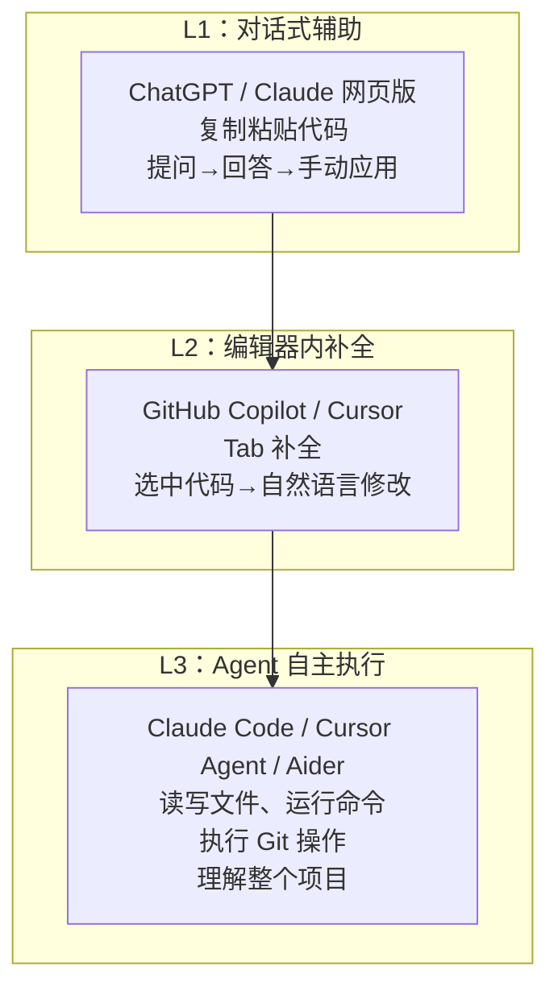

# $\rm Chapter \, 33$ AI Engineering：从 API 到 Agent

> 你已经会写代码、管版本、部署服务。现在你周围所有人都在用 AI 辅助编程——有人用 ChatGPT 网页版复制粘贴代码，有人用 GitHub Copilot 在编辑器里自动补全，有人用 Claude Code 在终端里直接让 AI 写整个功能。这些工具背后的原理是什么？怎么从"把 AI 当搜索引擎用"升级到"把 AI 当成编程系统的一部分"？这一章画出 AI Engineering 全景图。

## $\rm \S \, 33.1$ 三个层次：你处于哪一层



你在哪个层次工作，决定了 AI 能在多大程度上减少你的机械劳动。L1——你问 ChatGPT 怎么写一个 Python 函数，复制粘贴到编辑器中——这已经比手动搜索快很多，但每次上下文都是零散的。L2——Copilot 看到你写的函数名和注释，自动建议实现——上下文是当前文件。L3——Claude Code 读完你的整个项目（CLAUDE.md、README、源码），在你描述需求后自主创建文件、修改代码、运行测试、提交 commit。

## $\rm \S \, 33.2$ 当前主流模型一览

你的论文管理器需要"输入一篇论文标题，自动生成 3—5 个标签"——不同模型在这个任务上的准确率、成本和延迟完全不同。用这个具体场景来对比模型。这个任务有两个约束：每月处理约 $10^4$ 篇论文，API 预算是 50 美元/月。

- 用 **Claude Opus 5**：准确率最高，但每篇约 0.015 美元，$10^4$ 篇 = 150 美元——超预算。
- 用 **Claude Haiku 4.5**：准确率稍低（对生僻领域论文可能标错），但每篇约 0.00025 美元，$10^4$ 篇 = 2.50 美元——在预算内。
- 用本地部署的 **Llama 4 8B**：零 API 费用，但需要一台有 GPU 的机器，且标签格式可能不够一致。

这个决策——在准确率、成本、延迟、隐私之间权衡——就是理解模型差异的实际意义。

### $\rm \S \, 33.2.1$ 闭源商业模型

| 模型 | 厂商 | 定位 | 特点 |
|---|---|---|---|
| **Claude 5 系列**（Opus/Sonnet/Fable/Haiku） | Anthropic | 安全、长上下文、深度推理 | Opus 4.8 和 Opus 5 最强推理；Haiku 4.5 最快最低成本；200K 上下文窗口 |
| **GPT-5 系列** | OpenAI | 最广生态 | ChatGPT 用户基数最大；API 生态成熟（Assistants、Function Calling） |
| **Gemini 2.5 系列** | Google | 多模态 + 搜索整合 | 原生多模态（图片/音频/视频）；与 Google 搜索深度集成 |
| **Grok** | xAI | 实时信息 | 与 X/Twitter 数据整合 |

### $\rm \S \, 33.2.2$ 开源/开放权重模型

| 模型 | 厂商 | 定位 | 特点 |
|---|---|---|---|
| **DeepSeek V4** | DeepSeek | 极高性价比 | 推理能力接近 Opus，成本极低；支持 Anthropic API 兼容接口 |
| **Llama 4** | Meta | 开源基石 | 社区生态最丰富（微调、量化版本最多） |
| **Qwen 3** | 阿里 | 多语言 + 长上下文 | 中文能力突出；1M 上下文 |
| **Mistral** | Mistral AI | 欧洲独立 | 中小模型性能优秀；注重透明度 |

### $\rm \S \, 33.2.3$ 怎么选——一个实用框架

| 场景 | 推荐选择 | 理由 |
|---|---|---|
| 写一个复杂功能的完整实现 | Claude Opus / GPT-5 | 推理深度最高，跨文件理解最好 |
| GitHub Copilot 自动补全 | Claude Sonnet / GPT-4o-mini | 低延迟、高频调用，不需要深度推理 |
| 审阅一大片代码的 bug | Claude Sonnet / DeepSeek V4 | 长上下文（200K/1M tokens），高性价比 |
| 几十个简单重复任务并发 | Claude Haiku / DeepSeek Flash | 极低成本，高频调用 |
| 分析图片/截图/PowerPoint | GPT-5 / Gemini | 原生视觉 |
| 中文项目、国内网络环境 | DeepSeek / Qwen | 中文理解好、API 延迟低 |
| 隐私敏感、不能传云端 | Llama 4（本地部署） | 数据不出本机 |

**关键认知**：你不是在"信仰"某一个模型——你是根据任务在延迟、成本、推理深度之间做 trade-off。一个典型的 Claude Code 配置（就是你正在读的这套教材的编写环境）会同时使用两个模型：主模型（Opus/Pro）做规划和综合写作，子任务模型（Haiku/Flash）做轻量搜索和检查。

---

## $\rm \S \, 33.3$ API 基础：不只是"调一个 URL"

### $\rm \S \, 33.3.1$ 三种交互模式

**对话模式**（Chat Completions）——你最熟悉的：发送一系列 user/assistant 消息，模型返回回复。每次请求是独立的（没有记忆——你需要把历史消息一并发送才能维持上下文连续性）。

**工具调用**（Tool Use / Function Calling）——模型不直接返回文本，而是返回"我想调用这个函数，参数是这些"。你的代码执行这个函数，把结果发回给模型，模型继续推理。这是 Agent 的基础。

**嵌入**（Embeddings）——把文本转换成固定长度的数字向量。语义相近的文本向量距离近。用于搜索（RAG——Retrieval Augmented Generation："先从知识库中检索相关内容，再让模型基于检索结果回答"）。

### $\rm \S \, 33.3.2$ 兼容接口：不只是 OpenAI 的格式

Anthropic、OpenAI、Google 各有自己的 API 格式。但你可以通过兼容层统一调用：

- **Anthropic 兼容**：DeepSeek、一些开源模型托管平台支持 Anthropic Messages API 格式。
- **OpenAI 兼容**（最广泛）：几乎每个第三方模型提供者都支持 `/v1/chat/completions` 格式。工具如 **LiteLLM**（github.com/BerriAI/litellm）和 **OpenRouter**（openrouter.ai）让你用同一个 API key、同一段代码切换不同模型。

### $\rm \S \, 33.3.3$ Token 与计费

**Token** 是模型处理文本的最小单位——不是单词，也不是字符。粗略估算：英文 ~4 字符/1 token，中文 ~1.5 汉字/1 token。1000 tokens ≈ 750 英文单词 ≈ 1500 汉字。

模型计费按输入 token 数 + 输出 token 数。输出比输入贵（需要生成，不只是读取）。不同模型价差可达百倍——Claude Sonnet 每百万输入约 3 美元，DeepSeek V4 约 0.3 美元以内。

Claude Code 的 `/status` 命令可以查看当前会话的 token 用量（输入/输出/缓存命中），进而估算成本。了解这个数字不是为了省钱焦虑——是为了让你对"一个复杂任务到底消耗了多少计算"有直觉。

---

## $\rm \S \, 33.4$ Claude CLI：AI 编程的终端入口

### $\rm \S \, 33.4.1$ 什么是 Claude Code

**Claude Code** 是 Anthropic 官方的命令行 AI 编程助手。它不是一个"更聪明的 ChatGPT 终端版"——它是一个能**读写文件、运行命令、理解项目结构、执行 Git 操作**的 Agent。

启动方式：

```bash
# 在项目目录中直接启动
claude

# 带问题启动
claude "帮我重构 paper-parser 的 main 函数"

# 带选项
claude --model claude-sonnet-5      # 选择模型
claude --effort high                # 推理深度
claude -p "只回复：连接成功" --max-turns 1  # 单轮模式（不进入交互）
```

### $\rm \S \, 33.4.2$ CLAUDE.md：项目的 AI 说明书

Claude Code 启动时自动读取项目根目录的 **CLAUDE.md**。这个文件是你写给 AI 看的——不是写给人看的 README。它包含：

- 项目目标、技术栈、代码风格约定
- AI 应该遵循的工作流（如"写完代码后运行 pytest"）
- 项目特有的术语和领域知识
- 安全边界（"不要修改数据库 schema 文件""不要直接 commit 到 main"）

你正在读的这本教材本身的 CLAUDE.md 就是一个 Harness 的完整实例——它定义了写作规则、读者画像、章节结构、审查标准，Claude Code 读取它后就能以一致的质量续写教材。

### $\rm \S \, 33.4.3$ 常用操作

```bash
# 代码审查
claude "review 当前分支的改动，找 bug 和安全问题"

# 重构
claude "把 src/parser.cpp 中的裸指针换成 unique_ptr"

# 写测试
claude "为 src/api.py 生成 pytest 测试"

# 解释代码
claude "解释 src/scheduler.cpp 的调度逻辑"

# 生成 commit message
claude "根据 git diff --staged 生成英文 commit message"
```

### $\rm \S \, 33.4.4$ 其他 AI 编程工具

| 工具 | 类型 | 定位 |
|---|---|---|
| **GitHub Copilot**（github.com/features/copilot） | 编辑器扩展 | Tab 补全、聊天侧栏；和 GitHub 生态深度集成 |
| **Cursor**（cursor.com） | AI-first 编辑器 | VS Code fork，AI 深度嵌入——选中代码用自然语言修改、Composer 模式生成多文件 |
| **Aider**（github.com/paul-gauthier/aider） | CLI | 纯命令行的 AI 结对编程，和 Git 深度集成——自动 commit |
| **Continue**（continue.dev） | IDE 扩展 | 开源，可接任何模型（本地 Ollama 或云端 API） |
| **Cline**（github.com/cline/cline） | VS Code 扩展 | 自主 Agent——能创建文件、运行终端命令、浏览器操作 |
| **Windsurf**（codeium.com/windsurf） | AI-first 编辑器 | Codeium 出品，和 Cursor 竞争 |
| **Amazon Q Developer** | AWS 集成 | 专为 AWS 生态设计，理解 CloudFormation/CDK |

---

## $\rm \S \, 33.5$ 动手实践

### 实践一：写你的项目的 CLAUDE.md

1. 在你的论文管理器项目根目录创建 `CLAUDE.md`。
2. 写入：项目目标、技术栈、目录结构、代码风格（如"Python 用 ruff 格式化""C++ 用 clang-format"）。
3. 运行 `claude` 确认它读取了你的 CLAUDE.md——问它"这个项目的技术栈是什么？"

### 实践二：用 Claude Code 完成任务

```bash
claude "列出 src/ 目录下所有文件的行数"
claude "为 src/parser.py 添加类型标注"
claude "review 当前 git diff，用中文给出建议"
```

每次观察 Claude 做了哪些操作——它执行了什么命令？读取了哪些文件？最终结果是否符合预期？

### 实践三：体验多模型切换

如果条件允许（API key 可用），通过 OpenRouter 或直接 API 调用同一个 prompt，分别发给 Sonnet、GPT-4o、DeepSeek。对比：
- 输出风格差异
- 响应速度
- 对同一个中文问题的理解质量

---

## $\rm \S \, 33.6$ 总结

- AI 编程分三层：对话式复制粘贴 → 编辑器内补全 → Agent 自主执行文件操作。层级越高，AI 越像一个队友而不是工具。
- 模型选择不是信仰，是 trade-off（推理深度 vs 延迟 vs 成本 vs 隐私）。
- API 不仅仅是"调一个 URL"——对话模式、Tool Use 和 Embeddings 分别解决不同类型的问题。
- Claude Code 是 CLI 中的 AI Agent——能读写文件、运行命令、理解项目。CLAUDE.md 是项目级 AI 说明书。
- 多模型 API 兼容层（LiteLLM、OpenRouter）让你不锁定单一厂商。

---

## $\rm \S \, 33.7$ 关键概念回顾

1. AI 编程的 L1、L2、L3 分别是什么？
> L1 对话式辅助（网页版复制粘贴）、L2 编辑器内补全（Copilot/Cursor 的 Tab 补全和自然语言修改）、L3 Agent 自主执行（读写文件、运行命令、执行 Git 操作）；层次越高，AI 越像队友而不是工具。

2. Tool Use / Function Calling 和普通 Chat Completions 有什么本质区别？
> Chat 直接返回文本；Tool Use 让模型返回"想调用哪个函数、参数是什么"，你的代码执行后把结果发回模型继续推理——这是 Agent 自主执行的基础。

3. Token 是什么？为什么输出 token 比输入 token 贵？
> Token 是模型处理文本的最小单位（不是单词也不是字符，约 4 个英文字符或 1.5 个汉字）；输出需要逐 token 生成（不只是读取已有内容），计算成本更高。

4. CLAUDE.md 的作用是什么？它应该包含哪些内容？
> 它是项目的"AI 说明书"，Claude Code 启动时自动读取：包含项目目标、技术栈、代码风格约定、AI 应遵循的工作流和安全边界。

## $\rm \S \, 33.8$ 应用与辨析

5. Claude Haiku 和 Claude Opus 的使用场景有什么不同？
> Opus 推理深度最高，用于复杂功能的完整实现和深度推理；Haiku 最快、成本最低，用于几十个简单重复任务和高频低延迟调用。

6. GitHub Copilot、Cursor 和 Claude Code 的使用场景有什么不同？
> Copilot 是编辑器扩展，做 Tab 补全和聊天；Cursor 是 AI-first 编辑器，选中代码用自然语言修改、Composer 生成多文件；Claude Code 是终端 CLI Agent，能读写文件、运行命令、执行 Git 操作、理解整个项目。

---

把 AI 当作工具使用只是第一步。下一步是**写出你自己的 AI 工程系统**——从 Prompt 模板到 Agent 循环，从 Claude Code 的 Skills 机制到完整的教材编写 Harness。下一章展开。
