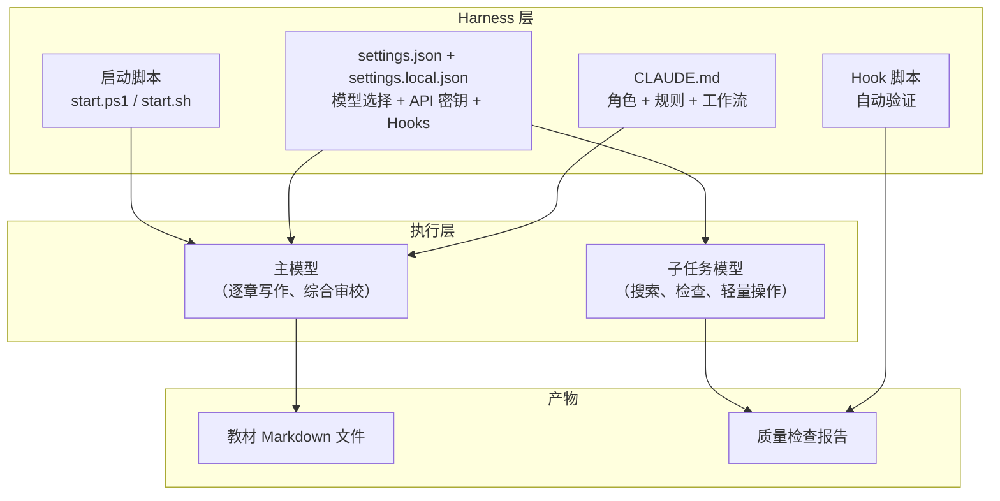

# $\rm Chapter \, 34$ Prompt 工程、Skills 编写与 Harness 设计

> 你在[上一章](33-AI工程概览.md)中学会了使用 AI 工具。但“使用”和“工程化”之间有质的区别：你发一句 prompt 得到一次回答，这叫使用；你设计了一套规则、模板和工作流，让 AI 持续稳定地产出高质量结果，这叫工程。本章教你从 prompt 到 skills 再到完整的 agent harness——用这套教材自身的编写系统作为贯穿案例。

> **开始前自检**：本章假设你已经会：
>
> - □ 调用过至少一次 LLM API（第 33 章）
> - □ 理解上下文窗口与 token
> - □ 会用本教材自身的 Harness（start-deepseek.ps1）或类似工具

## $\rm \S \, 34.1$ Prompt 工程：不是“怎么问”，而是“问什么信息”

### $\rm \S \, 34.1.1$ 坏 prompt 和好 prompt 的结构差异

**坏 prompt**（信息不足、没有约束）：

```text
帮我写一个 Python 脚本。
```

结果：一个不知道干什么的脚本，需要多轮追问才能落地。

**好 prompt**（有角色、有目标、有约束、有输出格式）：

```text
写一个 Python 脚本，从 papers.json 中读取论文数据（title, year, authors 字段），
筛选出 2020 年及之后的论文，按引用数降序排列，输出到 papers_recent.json。
- 使用标准库 json 模块，不依赖第三方库
- 处理 FileNotFoundError 和 JSONDecodeError
- 输出文件使用 indent=2, ensure_ascii=False
- 在脚本末尾用 if __name__ == "__main__" 包装
```

结果：可以直接运行的正确脚本。

### $\rm \S \, 34.1.2$ Prompt 的结构化框架

一个工程级的 prompt 至少包含这些要素，但不是机械套模板——根据任务类型选择合适的深度：

| 要素 | 问题 | 何时需要 |
|---|---|---|
| **角色** | AI 扮演什么专家？ | 当输出需要特定领域的风格或深度 |
| **上下文** | 项目是什么？已有代码是什么？ | 几乎总是需要——没有上下文 AI 在猜 |
| **任务** | 要完成什么？输入是什么？输出是什么？ | 总是需要——这是 prompt 的核心 |
| **约束** | 不能做什么？格式要求？代码风格？ | 当输出质量有明确标准 |
| **示例** | 期望的输入输出对（few-shot） | 当任务定义难以用语言精确描述 |
| **输出格式** | 返回 JSON？Markdown？代码？ | 当输出会被程序消费（结构化输出） |
| **验证** | 输出应该满足什么可检验的条件？ | 当需要程序化检查输出质量 |

### $\rm \S \, 34.1.3$ 这条教材本身用的 Prompt 结构

你正在读的教材由 Claude Code + CLAUDE.md 驱动。每一章的续写 prompt 包含：

1. **角色与写作规则**（CLAUDE.md 全文）——定义了读者画像、写作模型、论证链结构、禁止项
2. **上下文**——要求先读 README、前一章、目标文件提纲
3. **任务**——“将以下提纲扩写为完整章节”
4. **约束**——“400-600 行”“至少一个常见错误”“章末总结+检查表+桥接”
5. **验证**——写后运行 `validate-textbook.ps1` hook

这就是 prompt 工程在真实项目中的形态——**不是精心雕琢一句咒语，而是把“好的输出标准”编码为可重复执行的规则**。

### $\rm \S \, 34.1.4$ 结构化输出

当你的程序需要消费 AI 的输出（而不仅仅是展示给人看）时，必须约束模型返回特定格式的 JSON——这不是“在 prompt 里说请返回 JSON”，而是让模型的输出被约束到可编程验证的格式。

Anthropic API 支持 **tool_use 的结构化输出**——你给一个 JSON Schema，模型保证输出符合这个 schema。当输出用于代码消费（自动化流水线、API 响应生成），结构化输出是必须的。

---

## $\rm \S \, 34.2$ Claude Code Skills：可复用的自定义命令

### $\rm \S \, 34.2.1$ 什么是 Skill

**Skill** 是 Claude Code 中的自定义斜杠命令（如 `/review`、`/deploy`）。输入 `/skill-name` 后，Claude Code 加载预定义的规则和指令，按照规定的流程执行任务。

你不需要安装插件或修改源代码——Skill 只是一个 Markdown 文件，放在项目的 `.claude/skills/` 目录下。

### $\rm \S \, 34.2.2$ Skill 的最小结构

```markdown
---
name: review
description: 代码审查当前分支的改动
---

## 步骤

1. 运行 `git diff main...HEAD` 查看改动。
2. 按以下维度审查：
   - 正确性：逻辑有 bug 吗？边界条件对吗？
   - 安全：密码/Token 泄露？SQL 注入？路径穿越？
   - 可读性：变量名？函数长度？
3. 对每个发现，给出文件、行号、问题描述和修改建议。
4. 用中文输出审查报告。
```

### $\rm \S \, 34.2.3$ Skill 的触发方式

- **显式调用**：输入 `/review`
- **项目级自动触发**：在 `.claude/settings.json` 中配置 hooks——比如每次 `Write` 或 `Edit` 后自动运行某个验证脚本。**注意 Hook 和 Skill 是两个不同机制**：Hook 由事件触发（如每次写文件后跑检查脚本），Skill 由用户或模型主动调用（如 `/review`）
- **与子 agent 配合**：父 agent 收到用户请求后判断“这需要用到 X skill”，主动调用它

### $\rm \S \, 34.2.4$ 本教材项目的 Hook 实例

你在 `.claude/settings.json` 中看到的 PostToolUse Hook 就是一个自动触发机制（注意它和 Skill 的区别——Hook 是“每次 Write/Edit 后自动跑”，Skill 是“用户输入 `/review` 时按需加载指令”）：

```json
"PostToolUse": [
  {
    "matcher": "Write|Edit",
    "hooks": [{
      "type": "command",
      "command": ".claude/hooks/validate-textbook.ps1",
      "timeout": 20,
      "statusMessage": "检查教材 Markdown 与敏感信息"
    }]
  }
]
```

每次 Write 或 Edit 一个 Markdown 文件后，自动运行检查脚本——验证 Markdown 结构、检测 Token 泄露、检查标题层级。这不依赖 AI 记得运行它——Harness 机制保证它一定被执行。

---

## $\rm \S \, 34.3$ Harness 工程：把 Prompt 组合成生产系统

### $\rm \S \, 34.3.1$ 什么是 Harness

“Harness”（挽具、线束）在本教材中指一套完整的 AI Agent 运行环境，包含：



### $\rm \S \, 34.3.2$ 本教材的 Harness 设计（DeepSeek Harness）

`DEEPSEEK-HARNESS.md` 和 `start-deepseek.ps1` 定义了这套系统的运行方式：

```powershell
# start-deepseek.ps1 的核心逻辑
# 1. 从 settings.json / settings.local.json 读取环境变量（API Key、模型名、base URL）
# 2. 设置为当前进程的环境变量
# 3. 进入项目目录
# 4. 启动 Claude Code（由 settings.json / settings.local.json 中的 env 配置决定用哪个模型）
```

执行 `./start-deepseek.ps1` 就是在启动整个 Harness。参数全在 `settings.json` / `settings.local.json` 中，启动脚本只做环境注入。

模型分工：

- 主 Agent：`deepseek-v4-pro[1m]`——规划、写作、综合审校（类似 Claude Opus 的角色）
- 子任务模型：`deepseek-v4-flash`——轻量检查与搜索（类似 Claude Haiku 的角色）
- 推理强度：`max`——本教材的写作需要深度的逻辑连贯性检查

### $\rm \S \, 34.3.3$ Harness 设计的原则

1. **规则外置**：模型的行为规范写在 CLAUDE.md 和 Hook 脚本中——不在每次对话时口头重复。规则文件是 Harness 的唯一真相来源。
2. **自动验证**：每次输出后自动检查。人可能忘记，脚本不会。
3. **模型可替换**：修改 `settings.json` 中的一行，就可以从 DeepSeek 切换到 Claude 或任何兼容 Anthropic API 的模型。Harness 不绑定特定模型。
4. **最小权限**：启动脚本只设置当前进程的环境变量，不修改系统配置。真实 API Key 只放在被 `.gitignore` 排除的 `settings.local.json` 中——绝不提交到仓库；`settings.json` 是共享模板，不含密钥。
5. **可复现**：任何人拿到这个项目，配置自己的 API Key，运行 `./start-deepseek.ps1 "续写第 X 章"`，就能在同样的约束下产出同样质量的续写。

### $\rm \S \, 34.3.4$ 构建你自己的 Harness

把本章的知识应用到你的论文管理器项目或其他任何项目：

**第一步**：写 `CLAUDE.md`——告诉 AI：
- 项目目标、技术栈
- 代码风格约定
- 安全规则（“不要在代码中写 API key”“新功能先写测试”）
- 常用命令（构建、测试、部署）

**第二步**：配置 `settings.json`（含密钥的本地覆盖放 `settings.local.json`）：
```json
{
  "permissions": {
    "allow": ["Read", "Write", "Edit", "Bash(git:*)", "Bash(npm:*)", "Bash(pytest:*)"]
  },
  "hooks": {
    "PostToolUse": [{
      "matcher": "Write",
      "hooks": [{"type": "command", "command": "npm run lint", "timeout": 10}]
    }]
  }
}
```

**第三步**：写一个启动脚本（可选——手动 `claude` 也可以）：

```bash
#!/bin/bash
# 从环境变量或 .env 文件读取——绝不在脚本中硬编码 API Key
export ANTHROPIC_BASE_URL="${ANTHROPIC_BASE_URL:-https://api.anthropic.com}"
export ANTHROPIC_AUTH_TOKEN="${ANTHROPIC_AUTH_TOKEN}"  # 从外部传入
export ANTHROPIC_MODEL="${ANTHROPIC_MODEL:-claude-sonnet-5}"
claude "$@"
```


**第四步**：测试——问 AI 一个它不该做的事（如“把 API key 写进代码”），观察 Hook 是否阻止。

### $\rm \S \, 34.3.5$ Claude Code CLI 实战

下面直接走一遍日常使用 Claude Code 的完整流程。

**安装**

```bash
# npm 全局安装（需要 Node.js ≥ 18）
npm install -g @anthropic-ai/claude-code

# 验证
claude --version
```

**首次启动**

```bash
cd ~/projects/paper-manager
claude
# 首次运行会引导你完成 Anthropic 账号认证（浏览器 OAuth 或 API Key）
# 之后 Claude Code 会自动读取项目中的 CLAUDE.md（如果有）作为行为规则
```

**日常使用模式**

```text
# 模式一：交互式对话
claude                              # 进入 REPL，持续对话直到你满意

# 模式二：单次任务（-p = print，直接输出结果并退出）
claude -p "解释 main.cpp 中的编译错误"        # 问一个具体问题
claude -p "重构 parse_papers 函数，提取重复逻辑"  # 执行修改任务

# 模式三：管道组合
cat error.log | claude -p "分析这些错误日志，给出最可能的根因和修复步骤"
git diff HEAD~3 | claude -p "审查这三天的修改，找出可能导致性能回退的变更"

# 模式四：批量自动化
for file in src/*.cpp; do
    claude -p "给 $file 中的每个函数添加中文注释" --max-turns 3
done
```

**常用参数**

| 参数 | 作用 | 示例 |
|------|------|------|
| `-p "prompt"` | 直接执行 prompt 并退出 | `claude -p "修 bug"` |
| `--max-turns N` | 限制最大工具调用轮数 | `--max-turns 5` |
| `--model MODEL` | 指定模型 | `--model claude-sonnet-5` |
| `--effort LEVEL` | 推理强度 (low/medium/high/xhigh/max) | `--effort xhigh` |
| `-c` | 继续上一次对话 | `claude -c` |
| `--resume` | 列出可恢复的对话 | `claude --resume` |

**管道工作流——Claude Code 作为 Unix 工具**

Claude Code 不仅可以交互式使用，它还能像 `grep`、`sed` 一样进入 Unix 管道。这才是它在日常开发中最强大的形态：

```bash
# 代码审查流水线
git diff main | claude -p "审查修改：1) 是否有bug 2) 是否有安全隐患 3) 风格是否一致。用三句话回答。" 

# 日志分析
journalctl -u paper-api --since "1 hour ago" | claude -p "找出所有ERROR，按根因分组，给出每组的修复优先级" --max-turns 3

# 批量重构预览——只看不改
claude -p "扫描 src/ 下所有 .cpp 文件，找出可以用 std::optional 替代返回 -1 的函数，列出文件名和行号，不要修改任何文件"

# 生成提交消息
git diff --cached | claude -p "根据这次修改生成一条中文 git commit 消息（<50字符），格式：类型: 简述"
```

**关键约束**

在 `.claude/settings.json` 中可以精确控制 Claude Code 的权限范围，防止它越权操作：

```json
{
  "permissions": {
    "allow": [
      "Read",
      "Write(*.md)",
      "Edit(*.cpp)",
      "Bash(git:diff,git:log,grep:*)",
      "WebSearch"
    ],
    "deny": [
      "Bash(rm:*)",
      "Bash(sudo:*)",
      "Bash(curl:*)",
      "Write(**/.env)",
      "Write(**/*.key)"
    ]
  }
}
```

这是 Harness“最小权限”原则的具体落地——AI 只能执行你预先批准的操作。即使 prompt 中要求它“删除所有文件”，permission 配置也会阻止执行。

**`claude` 和 `claude -p` 的选择**

| 场景 | 用哪个 |
|------|--------|
| 探索性工作——不断追问、调整方向 | 交互式 `claude` |
| 明确的一次性任务——“修复这个 bug”“生成单元测试” | `claude -p` |
| 管道中的过滤/转换环节——类似 grep/sed/jq | `claude -p` + 管道 |
| CI/CD 中的自动步骤——代码审查、生成文档 | `claude -p --max-turns 3` |
| 继续昨天没完成的工作 | `claude -c` |

---

## $\rm \S \, 34.4$ Prompt 工程的反模式

### $\rm \S \, 34.4.1$ “魔法咒语”思维

```text
❌ "你是一个世界级的、顶尖的、超级聪明的程序员……"
```

这不会让模型变得“更聪明”。模型的能力在加载时就已确定——prompt 不改变模型本身，只改变模型接收到的问题描述质量。过度修饰词不会提升答案准确性，它们可能增加模型的自我参考偏差。

### $\rm \S \, 34.4.2$ 忽略上下文窗口管理

模型有上下文窗口上限（如 200K tokens）。你把整个项目目录树、所有源码、三篇文档全部塞进一个 prompt 中，模型会因为信息过载而遗漏关键细节。更聪明的做法是：**先让模型检索相关信息，再基于检索结果回答**。这就是你在 Claude Code 中看到的——它先 `Glob` 找到相关文件，再 `Read` 它们，然后才回答。

### $\rm \S \, 34.4.3$ “一次 prompt 解决一切”的错觉

一个复杂任务（如“重构整个项目的错误处理”）不能由一句 prompt 完成。它需要：

1. 搜索项目中所有 `throw` / `raise` / `catch` 位置
2. 分析每种错误处理的合适策略
3. 逐文件修改
4. 逐文件验证修改后测试仍然通过

这需要一个**Agent 循环**——模型→搜索→观察→修改→验证→修改→……直到完成。单次 prompt 只适合理解、解释和简单生成——复杂任务需要 Agent。

---

## $\rm \S \, 34.5$ 动手实践

### 实践一：写一个 Skill

在项目的 `.claude/skills/` 下创建一个 `hello.md`：

```markdown
---
name: hello
description: 打印当前项目的信息
---

运行 `git log --oneline -5` 并总结最近的工作，然后用 `ls -la` 展示项目根目录。
```

在 Claude Code 中输入 `/hello`，观察它是否执行了这两个命令。

### 实践二：设计你的项目的 CLAUDE.md

为你的论文管理器写 CLAUDE.md，至少包含：
- 项目一句话描述
- 技术栈
- 代码风格约定
- 禁止的操作（如“不要删 `data/` 目录”）
- 常用命令

### 实践三：对比不同 prompt 质量的输出

用第 33.1 节的结构化框架，对同一个任务用三种 prompt：
1. 一句话（“帮我写个函数”）
2. 有角色+任务+约束
3. 有角色+任务+约束+示例+输出格式

对比三个输出的质量、准确性和可运行性。感受“信息完备性”和“输出质量”的正相关关系。

---

## $\rm \S \, 34.6$ 总结

- Prompt 工程的核心不是雕琢咒语，而是**提供完备信息**——角色、上下文、任务、约束、示例、输出格式。
- Claude Code Skills 是项目级可复用斜杠命令——用 Markdown 定义流程，放在 `.claude/skills/` 下。
- Harness 把 prompt、规则、验证和模型选择组织成一个可复现的 AI 工程系统。关键原则：规则外置、自动验证、模型可替换、最小权限、可复现。
- Agent 循环（模型→观察→操作→验证→……）处理复杂多步骤任务——单次 prompt 只适合简单任务。

---

## $\rm \S \, 34.7$ 关键概念回顾

1. 一个好的 prompt 至少包含哪些要素？

2. 什么是结构化输出？它和“在 prompt 里说请返回 JSON”有什么不同？

3. Claude Code Skill 的最小结构是什么？frontmatter 里需要哪些字段？

4. Harness 的五个设计原则是什么？

5. 什么类型的任务适合单次 prompt？什么类型的任务需要 Agent 循环？

## $\rm \S \, 34.8$ 应用与辨析

6. 为什么“魔法咒语”在 prompt 工程中是无用的？

7. Skill 和 Hook 有什么区别？各自在什么场景下使用？

## $\rm \S \, 34.9$ 本章自测答案

> 先闭卷作答本章“关键概念回顾”与“应用与辨析”，再核对以下答案。

### 自测答案 · 关键概念回顾
1. 角色、上下文、任务、约束、示例（few-shot）、输出格式、验证——按任务选择深度，其中上下文和任务几乎总是需要。
2. 结构化输出用 JSON Schema 等机制（如 tool_use）约束模型必须按格式返回，可被程序直接验证和消费；prompt 里说“请返回 JSON”只是请求，模型不保证遵守。
3. 一个放在 .claude/skills/ 下的 Markdown 文件：frontmatter 的 name（命令名）和 description（用途描述），正文写执行步骤。
4. 规则外置、自动验证、模型可替换、最小权限、可复现。
5. 理解、解释和简单生成适合单次 prompt；需要“搜索→观察→修改→验证”反复迭代的复杂多步骤任务（如重构整个项目的错误处理）需要 Agent 循环。

### 自测答案 · 应用与辨析
6. prompt 不改变模型的能力本身，只改变问题描述的质量：堆砌“世界级、顶尖”等修饰词不能提升准确性，还可能增加自我参考偏差——信息完备性才是关键。
7. Skill 是用户或模型主动调用的预定义指令（如 `/review`），适合“按需执行”的任务；Hook 由事件自动触发（如每次 Write/Edit 后运行检查脚本），适合“必须保证执行”的任务——人可能忘记，脚本不会。

---

AI Engineering 的本质不是学会了某个工具，而是建立了一种**与 AI 协作的系统思维**——你知道怎样描述需求、怎样设计约束、怎样验证输出、怎样把单次交互扩展为可复用的工程流程。这套教材本身，就是用这种思维构建的产物。

到目前为止，输入和输出都还是文字。但 AI 能处理的远不止文本——你发给它一张截图问报错，它看得懂；你给它一句歌词，它谱成曲。下一章展开多模态 AI 与生成式模型：图像、音频、视频怎样进入模型，扩散模型怎样“画”出图片。

> 你现在能：写一个结构化 prompt，说明 Skill 与 Hook 的机制差别，复述 Harness 的五条设计原则，并能给一个小项目配上最小 Harness
