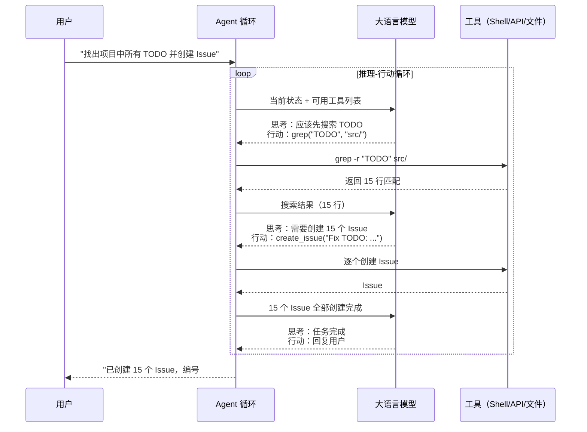

# $\rm Chapter \, 37$ AI Agent 深度解析

> [AI 前沿与 AI4Science](36-AI前沿与AI4Science.md) 勾勒了 Agent 的基本轮廓——LLM + 工具 + 记忆 + 规划。但知道这四个组件就像知道一辆车有"发动机 + 轮子 + 方向盘 + 刹车"——你知道了部件但不知道它们怎么配合。这一章把 Agent 拆到工作细节：LLM 怎么决定该调哪个工具？记忆怎么跨轮次保留？Agent 怎么发现自己的计划是错的然后修正？多个 Agent 怎么协作？

> **开始前自检**：本章假设你已经会：□ 理解模型推理与结构化输出（第 33、34 章）；
> □ 会调用工具/API 并处理返回；
> □ 理解最小权限与审计日志的价值。

## $\rm \S \, 37.1$ Agent 的"大脑"：推理-行动循环

### $\rm \S \, 37.1.1$ Token 进，Token 出，中间发生了什么

在[Prompt 工程与 Skills](34-Prompt工程与Skills.md)中你学过一个 prompt 进去、一个回答出来。Agent 和普通 Chat 的核心区别不在于模型本身——而在于模型被放进了**一个循环里**：



关键洞察：**LLM 的输出不是给用户看的文本——是给 Agent 循环看的"指令"**。LLM 输出"调用 grep 搜索 TODO"，Agent 循环解析这条指令、执行 grep、把结果喂回 LLM、LLM 决定下一步。这就是 Tool Use / Function Calling 的完整机制。

### $\rm \S \, 37.1.2$ 工具调用(Tool Use)的实际 API 格式

当 LLM 决定调用工具时，它不返回 `"grep -r TODO src/"` 这段自然语言——它返回的是**结构化 JSON**：

```json
{
  "role": "assistant",
  "content": [
    {
      "type": "tool_use",
      "id": "toolu_01ABC123",
      "name": "bash",
      "input": {
        "command": "grep -r 'TODO' src/"
      }
    }
  ]
}
```

你的代码（Agent 循环）解析这个 JSON，执行 `grep -r 'TODO' src/`，然后把结果以 `tool_result` 的形式送还给 LLM：

```json
{
  "role": "user",
  "content": [
    {
      "type": "tool_result",
      "tool_use_id": "toolu_01ABC123",
      "content": "src/main.cpp:42: // TODO: handle edge case\nsrc/parser.cpp:15: // TODO: validate input\n..."
    }
  ]
}
```

LLM 收到结果后继续推理——也许直接回复用户，也许决定还需要更多信息，也许调用下一个工具。这个循环持续到 LLM 输出一个最终文本回复（没有更多 tool_use）。

### $\rm \S \, 37.1.3$ 为什么不是"把所有工具描述塞进 prompt 就完事"

把工具描述放在 system prompt 里，LLM "看到"了工具，就可以决定调用。但实际执行中，一个 Agent 可能有几十个工具——每个工具的描述 + 参数 schema 可能几百 tokens。全部塞进上下文会占满上下文窗口。更聪明的做法是**动态工具选择**：先给 LLM 少量高层工具（搜索代码、读文件、写文件），根据任务上下文决定是否需要更多专用工具。

---

## $\rm \S \, 37.2$ 记忆系统：Agent 的"海马体"

### $\rm \S \, 37.2.1$ 三层记忆

人类的记忆不是一块存储区——心理学家区分了多种类型。Agent 的记忆系统沿用了类似的层次：

| 记忆类型 | 人类对应 | Agent 实现 | 生命周期 |
|---|---|---|---|
| **工作记忆** | 你正在想的事情（7±2 个组块） | 当前对话的上下文窗口 | 一次对话 |
| **情节记忆** | 你昨天做了什么 | 对话历史摘要 + 向量数据库 | 跨对话 |
| **语义记忆** | 你知道"巴黎是法国首都" | 向量数据库中的文档、知识库 | 持久 |

**工作记忆**就是 LLM 的上下文窗口——所有发送给 LLM 的 token（system prompt + 对话历史 + 工具调用结果）都在这里。上下文窗口有限（200K tokens 看起来很大，但 20 次工具调用 + 结果就能吃掉一大半）。

**情节记忆**让 Agent "记得上次和这个用户做了什么"。最简单的实现是**对话摘要**——上一轮对话结束后，LLM 生成一段摘要（"用户在开发论文管理器，上次帮他修了 parser 的 bug"），下一轮对话时把摘要放进 system prompt。更复杂的实现把每次对话的摘要存入向量数据库，新对话开始时检索最相关的历史。

**语义记忆**就是 RAG 中的"检索"层——把项目的文档、代码、知识库切块并向量化存入数据库。Agent 在回答之前先检索最相关的文档片段。

### $\rm \S \, 37.2.2$ 向量数据库的最小实现

在[AI 前沿与 AI4Science](36-AI前沿与AI4Science.md)中你见过 RAG 的最小代码。从 Agent 记忆的角度重新解释：

```python
import chromadb
client = chromadb.Client()
memory = client.create_collection("agent_memory")

# 每次对话结束后，存入"我做了什么"的摘要
memory.add(
    documents=["用户问了一个关于 parser 的问题，我帮他定位到了 parse_line 函数中缺少对空字符串的处理"],
    ids=["session_20260315_001"]
)

# 下次对话开始前，检索相关记忆
relevant = memory.query(query_texts=["parser 空字符串 bug"], n_results=3)
# 把检索到的记忆摘要放进 system prompt
```

这里的关键不是 chromadb 的 API——是**向量检索使得"语义相似"取代了"关键词匹配"**。"空字符串处理的 bug" 和 "修复了输入为空时的崩溃"这两句话在关键词层面完全不同，但向量相似度极高——Agent 能"想起"相关的事即使关键词不匹配。

---

## $\rm \S \, 37.3$ 规划与反思

### $\rm \S \, 37.3.1$ ReAct：推理和行动交替

**ReAct**（Reasoning + Acting）是最基础的 Agent 模式。LLM 在每次行动前先"思考"：

```text
Thought: 用户想知道项目中有多少个 TODO。我需要先搜索所有文件。
Action: grep -r "TODO" src/
Observation: 找到 15 个 TODO

Thought: 15 个 TODO 分布在 8 个文件中。我应该按文件分组统计。
Action: grep -r "TODO" src/ | awk -F: '{print $1}' | sort | uniq -c
Observation: src/main.cpp:5, src/parser.cpp:3, ...

Thought: 现在我有统计结果了。整理成表格回复用户。
Action: (回复用户)
```

Thought/Action/Observation 不是三个不同的 API——是 prompt 工程。system prompt 中写了"遇到问题时用 Thought: 表达你的思考，用 Action: 表达你要执行的操作"。LLM 遵守这个格式输出，Agent 循环解析它。这就是 [Prompt 工程与 Skills](34-Prompt工程与Skills.md) 中讲的"好的 prompt 不是雕琢咒语而是编码期望的输出格式"在 Agent 层面的体现。

### $\rm \S \, 37.3.2$ Plan-and-Execute：先规划再执行

对于复杂任务（"把论文管理器的后端从 Flask 迁移到 FastAPI"），ReAct 的问题在于 LLM 每次只看到"下一步"——它可能在迁移了一半路由后发现"前面的路由改法和后面的不一致"。

**Plan-and-Execute** 把任务拆成两步：先用一个 LLM 调用做**全局规划**（"1. 分析现有路由 2. 创建 FastAPI 骨架 3. 逐个迁移路由 4. 更新依赖 5. 运行测试"），再让执行 Agent 按计划一步步走。

规划和执行的分离带来额外好处：规划可以让人类审查（"这个迁移计划对吗？"），确认后再执行。

### $\rm \S \, 37.3.3$ Reflexion：从错误中学习

Agent 执行了一个操作（删除文件），然后观察到了失败（"文件不存在"）。一般的 Agent 可能就这么回复用户了——"文件不存在"。**Reflexion** Agent 多了一步：它在失败后生成一段**反思**（reflection）——"我应该先检查文件是否存在再删除"——并把这段反思存入长期记忆。下次遇到类似任务时，这段反思作为上下文的一部分，指导它避免同样的错误。

这和你在编程中"踩了一个坑后写注释提醒未来的自己"是同一个心理模型——只是 Agent 自动做了这个过程。

---

## $\rm \S \, 37.4$ 多 Agent 协作

### $\rm \S \, 37.4.1$ 为什么需要多个 Agent

单个 Agent 处理复杂任务时有两个瓶颈：上下文窗口（所有信息在同一个窗口里竞争注意力）和角色冲突（生成代码和审查代码需要不同的思维模式——同一个人审查自己刚写的代码会漏掉明显的 bug）。

多 Agent 系统把任务分配给**不同角色的 Agent**：

```text
用户："给论文管理器加 CSV 导出功能"
  → Planner Agent：拆任务 → "1. 改后端加路由 2. 改前端加按钮 3. 测试"
    → Coder Agent：执行 1（写 Python）
    → Coder Agent：执行 2（写 JS）
    → Reviewer Agent：审查 1+2 的代码
    → Tester Agent：执行 3（跑测试）
  → Planner Agent：检查结果 → 通知用户完成
```

这和你在 [GitHub：远程仓库与协作](../05-开发工作流/20-GitHub使用与协作.md) 中学过的 PR 审查流程是同一个模式——Coder = 开发者、Reviewer = 审查者、Planner = Tech Lead——只是这里的角色是 AI。

### $\rm \S \, 37.4.2$ Agent 间的通信方式

| 方式 | 机制 | 适用场景 |
|---|---|---|
| **消息传递** | Agent A 输出一段文本，Agent B 以这段文本作为输入 | CrewAI、AutoGen |
| **共享记忆** | 多个 Agent 读写同一个向量数据库 | 需要长期积累知识的场景 |
| **环境状态** | Agent 通过修改文件/数据库来传递信息 | 代码生成 Agent → 测试 Agent |
| **结构化交接** | Agent A 输出一个 JSON，Agent B 解析这个 JSON | 严格的多阶段流水线 |

---

## $\rm \S \, 37.5$ 动手实践

### 实践一：手写一个最简单的 Agent 循环

以下是一个完整可运行的 Agent 循环——它真的能接 LLM、调工具、看到结果后继续思考。需要先 `pip install requests` 并设置环境变量 `ANTHROPIC_API_KEY`（或任何兼容 Anthropic API 的 key 和 base URL）。

```python
import requests, subprocess, json, os, re

API_KEY = os.environ.get("ANTHROPIC_API_KEY", "your-key-here")
BASE_URL = os.environ.get("ANTHROPIC_BASE_URL", "https://api.anthropic.com")

def call_llm(messages):
    """发给 LLM，返回文本回复。"""
    r = requests.post(f"{BASE_URL}/v1/messages", headers={
        "x-api-key": API_KEY, "anthropic-version": "2023-06-01",
        "content-type": "application/json"
    }, json={
        "model": os.environ.get("ANTHROPIC_MODEL", "claude-haiku-4-5"),
        "max_tokens": 1024,
        "system": "你可以调用工具。用 Thought: 思考，Action: tool_name(args) 执行。收到 Observation 后继续，任务完成时直接回复用户。",
        "messages": messages
    })
    return r.json()["content"][0]["text"]

def parse_action(text):
    """从回复中提取 Action: tool_name(args)。"""
    m = re.search(r"Action:\s*(\w+)\(([^)]*)\)", text)
    return (m.group(1), m.group(2)) if m else (None, None)

tools = {
    "bash": lambda cmd: subprocess.run(cmd, shell=True, capture_output=True, text=True).stdout.strip(),
    "read": lambda path: open(path).read(),
}

def agent_loop(task):
    """ReAct 循环：思考 → 行动 → 观察 → 再思考，直到完成。"""
    messages = [{"role": "user", "content": task}]
    for _ in range(10):  # 最多 10 轮
        response = call_llm(messages)
        if "Action:" not in response:
            print(response)   # 最终回复
            return
        tool, arg = parse_action(response)
        if not tool:
            print(f"无法解析动作: {response}"); return
        result = tools.get(tool, lambda a: f"未知工具: {tool}")(arg)
        messages.append({"role": "assistant", "content": response})
        messages.append({"role": "user", "content": f"Observation: {result}"})

# 运行：问"我当前目录有哪些文件？列出最大的 3 个"
agent_loop("列出当前目录下最大的 3 个文件")
```

运行这个脚本，你会看到 LLM 自动决定调用 `bash(ls -la)`，看到 Observation（文件列表），然后决定是否需要进一步操作。这正是 Claude Code 在 `/workflows` 中做的事——只是它的工具更多、循环更稳健。

### 实践二：观察 Claude Code 的 Agent 循环

在 Claude Code 中提一个需要多步操作的任务：

```text
"找出 src/ 下最近修改的 3 个文件，告诉我它们各自的函数数量，然后生成一个 commit message 模板"
```

观察 `/workflows` 中的 agent 执行步骤——每一轮它做了什么、观察到了什么、怎么修正的。特别关注：
- 哪一步它判断需要更多信息（多调了一次 grep/ls）
- 哪一步它意识到之前的假设不对并修正

### 实践三：多 Agent 协作体验

用 CrewAI 或 AutoGen 构建两个 Agent 的协作：

```python
# 伪代码——展示概念而非可运行
researcher = Agent(role="研究员", goal="搜索相关论文")
writer = Agent(role="写作者", goal="基于研究结果写综述")

task = Task(description="写一篇关于 Transformer 架构演进的综述")
crew = Crew(agents=[researcher, writer])
result = crew.kickoff()
```

---

## $\rm \S \, 37.6$ 总结

- Agent = LLM 被放进推理-行动循环。LLM 输出结构化指令（tool_use JSON），Agent 循环执行指令并喂回结果。
- 三层记忆：工作记忆（上下文窗口）、情节记忆（跨对话摘要）、语义记忆（向量数据库）。RAG 是语义记忆的一种实现。
- ReAct（推理-行动交替）、Plan-and-Execute（规划-执行分离）、Reflexion（从错误中学习并记住教训）是三种递进的 Agent 策略。
- 多 Agent 用角色分工解决上下文冲突和注意力瓶颈。消息传递、共享记忆、环境状态是三种通信方式。

---

## $\rm \S \, 37.7$ 关键概念回顾

1. Agent 和普通 Chat 在系统层面（不是模型层面）的本质区别是什么？

2. 三层记忆分别存储什么？各自的生命周期是什么？

3. ReAct、Plan-and-Execute、Reflexion 三种 Agent 策略的核心差异是什么？

## $\rm \S \, 37.8$ 应用与辨析

4. 为什么多 Agent 比单 Agent 在某些任务上表现更好？举一个具体场景。

5. Agent 循环中，LLM 返回了一个 `tool_use` JSON 但工具执行失败了（文件不存在）。Agent 接下来应该做什么？

## $\rm \S \, 37.9$ 本章自测答案

> 先闭卷作答本章"关键概念回顾"与"应用与辨析"，再核对以下答案。

### 自测答案 · 关键概念回顾
1. Chat 是一次输入一次输出。Agent 把 LLM 放进循环——LLM 输出工具调用指令 → Agent 循环执行工具 → 结果喂回 LLM → 循环直到 LLM 输出最终文本回复。
2. 工作记忆（上下文窗口，当前对话）、情节记忆（对话摘要，跨对话）、语义记忆（向量数据库中的知识库，持久）。三者解决不同时间尺度的"记住"。
3. ReAct 是一步一想一走（推理行动交替），Plan-and-Execute 是先出全局计划再逐步执行，Reflexion 在 ReAct 上叠加了"从错误中生成反思并存入长期记忆"。

### 自测答案 · 应用与辨析
4. 写代码+审查代码的场景：生成代码需要"创造性"，审查代码需要"挑剔性"——同一个模型在两种模式间切换倾向于过于宽容自己的错误。两个 Agent（Coder + Reviewer）模拟了人类 PR 审查流程的制衡关系。
5. 把错误信息作为 `tool_result` 送回 LLM（不是丢弃）。LLM 看到"文件不存在"的反馈后会调整策略——也许找文件名拼写错了、也许检查路径、也许告诉用户"这个文件不存在，你是这个意思吗？"

---

Agent 深度到此。从下一章开始，教材展开"计算机的另一面"——GPU 与 AI 计算、图像与显示、声音、3D 渲染与游戏引擎、手机操作系统，这些是你天天使用但不一定理解的技术。

> 你现在能：画出 Agent 循环（任务→工具→结果→再决策），说清规划/记忆/工具边界，并指出 prompt injection 与权限失控的风险点
