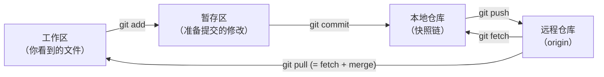
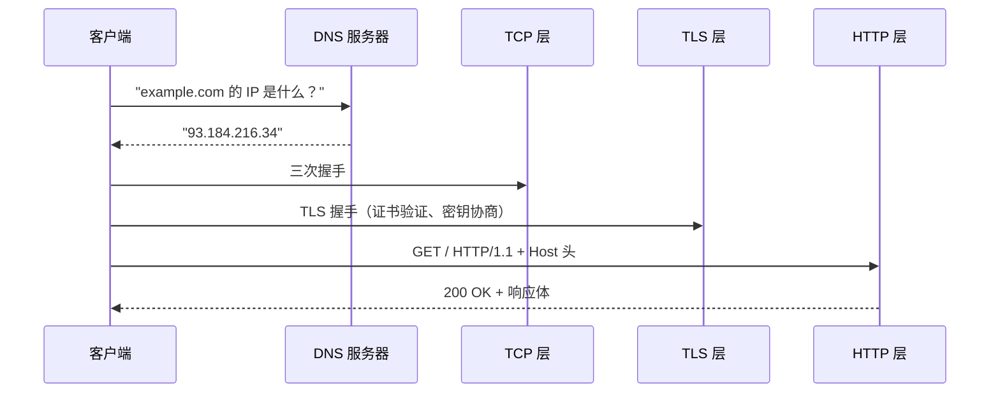
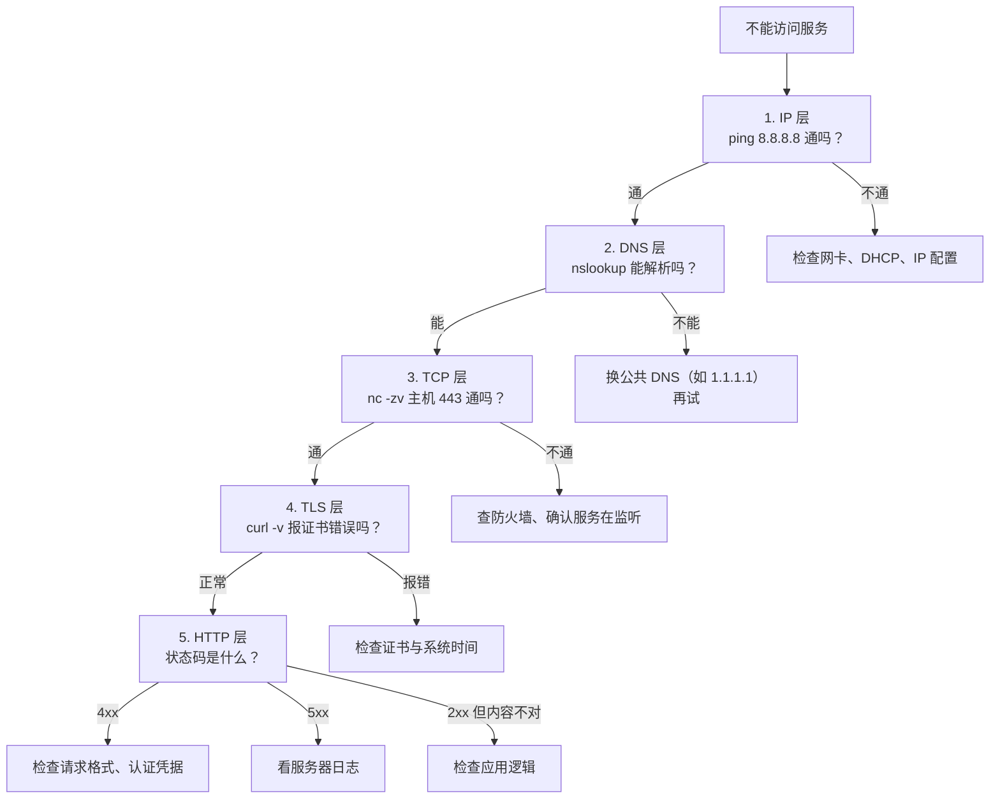
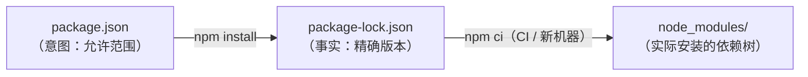

# $\rm Chapter \, R4$ 复习总结：第四阶段

> 第四阶段（第 19–24 章）是全书最“工具密集”的一段：你用 Git 把代码变成一条带父指针的快照链，用 GitHub 与人协作，用构建、测试与 CI 保证产物质量，用 Node.js/npm 撑起前端工具链，并从上到下打通了 IP、TCP、HTTP、DNS、HTTPS 与代理的网络世界。本章不引入任何新知识——它只做一件事：逼你把学过的东西重新取出来。

## $\rm \S \, R4.1$ 本章任务

本阶段学过的内容彼此咬合：Git 提交是“快照 + 父指针”，请求-响应是网络的“最小交互单元”，锁文件是依赖的“精确事实”。这些概念你看第二遍会觉得“都见过”，但“都见过”不等于“想得起来”——一次性线性阅读制造倒摄干扰，遗忘曲线在最初 24 小时内下降最快，而重读主要在当下制造熟悉感，真正加深记忆痕迹的是闭卷提取。

所以本章的用法是：**先合上前面六章**，依次完成 §R4.2 的闭卷回忆清单（写不出来的题目标记一下，最后统一到 §R4.6 对答案）、§R4.4 的交错练习（刻意打乱章节顺序，对抗“学了后面只会后面”）、§R4.5 的易混点对照（把你最可能混淆的命令和概念钉死）。全部做完再回去翻正文——那时你才知道自己真正缺哪一块。

回忆的时机也重要：今晚做完清单，**三天后不看书再重做一遍**，只重做上次标记和写错的题；一周后再来一次。每次提取都在加深记忆痕迹，间隔越拉越长是正常节奏。下面的六章一句话回放帮你先建立本阶段的地图，再进入提取：

| 章 | 一句话 |
|---|---|
| 19 Git | 本地快照链：工作区 → 暂存区 → 本地仓库，提交是带父指针的快照 |
| 20 GitHub | 远程仓库 + 协作层：clone/fork/PR/Issue/Actions |
| 21 依赖构建测试CI | 产物质量流水线：构建系统、SemVer、测试金字塔、干净机器复验 |
| 22 Node.js/npm | 前端工具链的运行时与包管理：package.json、Vite、TypeScript |
| 23 网络基础到 HTTP | 分层寄信：IP/端口 → TCP → HTTP，请求-响应模型 |
| 24 域名HTTPS代理 | DNS 电话簿、TLS 三项保障、正反向代理、从下往上排障 |

## $\rm \S \, R4.2$ 闭卷回忆清单

不看正文，写出或说出下列每一项。题目下没有答案；全部答案集中在 §R4.6.1，做完之前不要翻。判断标准：能写出**机制和命令**才算会，只记得“好像讲过”不算。

覆盖对照（方便你自查遗漏）：第 1–4 题对应第 19 章，第 5–7 题对应第 20–21 章，第 8–9 题对应第 21–22 章，第 10–12 题对应第 23–24 章。

1. 画出 Git 的四个区域（工作区、暂存区、本地仓库、远程仓库），并标出连接它们的命令：`git add`、`git commit`、`git push`、`git fetch`、`git pull` 各连接哪两个区域；再写出一个文件在 Git 中的四种状态。

2. 在一个新目录里从零建立仓库并完成第一次提交：写出所需命令（含忽略规则文件的创建），并逐条说明每条命令的用途。

3. 合并冲突时，Git 在文件中插入哪三个标记？各自代表哪一方的版本？手动解决后需要依次执行哪两条命令？

4. 分别用一句话说出 `git restore`、`git revert`、`git reset --hard`、`git stash` 的适用场景；其中哪些会删除历史或丢弃修改，属于不可恢复操作？

5. 说出 clone、fork、Pull Request 各自是什么；写出向开源项目贡献代码的完整流程（从 fork 开始到 PR 被合并）。

6. 写出 `git fetch`、`git pull`、`git push` 各自做了什么；当 `git push` 被拒绝（`! [rejected]`）时，标准解决步骤是什么？`git pull --rebase` 与默认 `git pull` 产生历史的方式有什么不同？

7. GitHub Actions 的工作流文件放在仓库的哪个目录？由什么事件触发？为什么“本地测试全绿”不能替代“CI 通过”？

8. 写出语义化版本 `MAJOR.MINOR.PATCH` 三个数字递增分别承诺什么；解释 `package.json` 中 `^4.18.2` 与 `~2.29.4` 各自允许的版本范围。

9. 说出 `dependencies` 与 `devDependencies` 的区别；`npm install` 与 `npm ci` 的区别；`npm run dev` 执行时 npm 实际做了什么（至少两点）。

10. 按顺序写出一次 HTTPS 请求从输入网址到收到响应经过的主要阶段；`curl -w` 的哪些计时项对应 DNS、TCP、TLS 和首字节？

11. 说出状态码 401 与 403 的区别；TCP 三次握手的目的是什么；`Connection refused` 与 `Connection timed out` 分别说明问题出在握手的哪一步？

12. 任选三种 DNS 记录类型（如 A、CNAME、MX），写出各自返回什么；`/etc/hosts` 的优先级为什么高于 DNS 查询？正向代理与反向代理分别位于哪一侧，各解决什么问题？

## $\rm \S \, R4.3$ 核心心智模型复读

本阶段有四个贯穿性的锚点概念，它们在前文中反复出现，这里重新组块——只复述，不新增。

### $\rm \S \, R4.3.1$ Git 提交：带父指针的快照

Git 的核心锚点来自[第 19 章](../05-开发工作流/19-Git与团队协作.md)：工作区是桌上散落的论文草稿，暂存区是你整理好准备装订的一叠，提交是装订完成、盖上日期章的定稿——一旦装订就不能偷偷换页，只能新装订一版。每个提交不是一个“保存”，而是一个**带父指针的快照**：记录全部文件的完整副本（相同内容只存一份）、作者、时间、提交消息，以及指向父提交的哈希。快照首尾相连成链，`git log` 展示的就是这条链。



从这个锚点可以直接推出本阶段所有 Git 行为：分支是链上的另一条平行线（§19.3）；合并是让两条线在某处汇合，冲突是两条线改了同一处，Git 说“这个决定该由人类来做”（§19.3.3）；`git revert` 生成一个新提交来撤销旧提交——历史仍在，因为链不允许被改写；`git reset --hard` 直接砍掉链尾——这是改写历史，不可恢复（§19.4.3）；`git bisect` 在这条链上做二分查找（§19.7）——你在 OJ 学过的算法，被 Git 用在提交历史上。

链的“最小可观察单元”是提交，而提交的质量由你自己控制：§19.6 的工作流要求每次提交只放一个逻辑改动、消息写清“做了什么、为什么这样做”——链是给别人（包括三个月后的你）读的。

```bash
git status                  # 现在是什么情况：哪些已暂存、哪些已修改、哪些未跟踪
git diff                    # 工作区 vs 暂存区：具体改了什么
git log --oneline --graph --all   # 整个仓库的鸟瞰图：快照链和所有分支
```

在项目根目录依次运行，观察每次输出里文件状态的变化——这三条命令是日常最常用的观察工具。

远程仓库是这个模型的外延（[第 20 章](../05-开发工作流/20-GitHub使用与协作.md)）：`git push` 把本地链复制到 origin，`git fetch` 把远程链下载到本地，`git pull` 是 fetch 加 merge。GitHub 不是 Git——它是托管仓库、加了一层协作（Issue、PR、Actions）的服务。

### $\rm \S \, R4.3.2$ 网络主链：请求-响应

网络部分的主锚点是[第 23 章](../04-网络/23-网络基础到HTTP.md)的请求-响应模型。一次访问是一层套一层的“寄信”过程，每一层解决一个问题：

- **IP 地址**标识网络中的主机——“寄到哪栋楼”；**端口**标识主机上的进程——“楼里哪个房间”。进程是某份程序的一次正在进行的演出（首次定义于[第 1 章](../01-基础观念/01-计算机程序与开发全景.md) §1.2.4），端口是它开向网络的房间门。你家路由器把几十台设备的私有 IP 翻译成一个公网 IP（NAT），所以对外只有一扇“楼门”（§23.1.3）。
- **TCP** 在不可靠的 IP 之上提供可靠管道：有序、无丢失、无重复，三次握手建立连接（§23.2.2）。同一层还有 UDP——不建立连接、不保证送达，用于时效性大于可靠性的场景（视频通话、DNS 查询）（§23.2.3）。
- **HTTP** 是应用层协议，严格一问一答：方法表达意图，状态码表达结果，头部携带元数据（§23.3）。
- **DNS** 是[第 24 章](../04-网络/24-域名HTTPS代理与排障.md)的电话簿——把人类可读的名字翻译成 IP；`/etc/hosts` 是手写的本地小电话簿，优先级更高（§24.1.5）。
- **HTTPS** 在 TCP 之上加 TLS：加密防窃听、完整性防篡改、证书链防冒充（§24.2）。

一次完整的 HTTPS 访问就是这条链的串联（§23.5）：



这套分层模型直接导出排障方法：**从下往上逐层收集证据**，每一层一条命令（§24.4）：

```bash
ping 8.8.8.8                # IP 层：网络连通性
nslookup example.com        # DNS 层：域名能否解析
nc -zv example.com 443      # TCP 层：端口是否开放（Windows 用 Test-NetConnection）
curl -v https://example.com # TLS 层 + HTTP 层：证书、状态码、响应体
```

按顺序执行，哪一层先给出异常结果，问题就大概率在哪一层。`curl -w` 的分段计时（DNS/TCP/TLS/首字节）让每一层的时间都能单独测量——API “慢”时先定位是哪一段慢，再决定优化方向（§23.5）。

把同一方法画成决策树，排障时照着走（§24.4.1）：



### $\rm \S \, R4.3.3$ 依赖、锁文件与“评测机”

开发工作流部分有三个互相咬合的锚点。

**PATH 是地址簿**（首次定义于[第 2 章](../02-终端与工具/02-终端Shell与命令行.md) §2.9）：Shell 按 PATH 列出的目录顺序寻找可执行文件。本阶段它再次出现——`npm run dev` 把 `node_modules/.bin` 临时追加到 PATH，让脚本里可以直接写 `vite`（[第 22 章](../05-开发工作流/22-Nodejs-npm与前端工具链.md) §22.2.4）。同一个机制，两处使用。

**manifest 是意图，lockfile 是事实**（首次定义于[第 9 章](../02-终端与工具/09-软件运行时SDK与包管理器.md)，第 21、22 章反复使用）：你在 `package.json` 里写 `^4.18.2` 表达“允许的版本范围”，`npm install` 把实际选中的精确版本写进 `package-lock.json`：



约束会过期，事实必须提交进 Git——否则队友和 CI 装出来的依赖树和你不一样。`npm ci` 严格按 lockfile 安装并先删 `node_modules`，是 CI 环境的标配（§22.2.3）。

**CI 是项目的评测机**（[第 20 章](../05-开发工作流/20-GitHub使用与协作.md) §20.6、[第 21 章](../05-开发工作流/21-依赖构建测试与CI.md) §21.4）：OJ 评测在评测机上跑，不依赖你本地的环境；CI 在干净虚拟机里重新安装依赖、构建、测试，排除你机器上的缓存和未提交文件。本地全绿只证明“在你机器上通过”，所以“本地通过”不能替代“CI 通过”。

### $\rm \S \, R4.3.4$ 构建产物：静态库、动态库、测试与可复现

构建部分（[第 21 章](../05-开发工作流/21-依赖构建测试与CI.md)）的锚点是两条类比。**静态库像把公式表复印进每个人的笔记本**——人手一份、互不干扰，但改版时每本都要重新复印（重新链接）；**动态库像教室墙上贴一张公共公式表**——所有人看同一张、省纸，但换新表时依赖旧记号的人会瞬间看不懂，这就是版本兼容问题，Windows 上叫 DLL Hell（§21.6.3）。选择规则：自己项目内部优先静态，多程序共享或需要热更新才用动态。观察证据在 `ldd ./paper-cli` 的输出里：静态链接的产物中看不到你写的 `parse_paper()`，因为它已经复制进二进制；动态链接则多出 `libpaper.so` 一行（§21.6.4）。

与构建并列的锚点是**测试金字塔**（§21.3.1）：大量快速、隔离的单元测试打底，适量的集成测试验证模块协作，少量端到端测试模拟真实用户流程。OJ 的评测本质上是一种单元测试——测试入口对输入的输出。测试金字塔与 CI 配合：越靠下的测试越便宜，本地和 CI 每次都要跑；越靠上越慢越脆弱，数量越少。

**可复现构建像菜谱的完整记录**（§21.9）：菜谱（源码）一样，食材批次（依赖）不同、灶具（环境）不同，成品就不会完全一样。lockfile 锁食材批次，Docker 锁灶具；验证工具是 `sha256sum`——同一环境构建两次，产物逐字节相同才算可复现。

## $\rm \S \, R4.4$ 交错练习

三组练习刻意打乱章节顺序，每题都要跨章调用多个概念，每题给自己 3–5 分钟，不翻书。做完后在 §R4.6.2 对答案。

### $\rm \S \, R4.4.1$ 第一组：Git 命令排障

1. 你在本地 `main` 上提交了三次，`git push` 却报 `! [rejected]`。按顺序写出：先执行什么命令查看远程到底多了什么？然后用什么命令把你的提交放到远程提交之后？最后再 push。如果这一步出现冲突，冲突发生在哪个命令里？

2. `git merge` 报 `CONFLICT`，`main.cpp` 里出现 `<<<<<<< HEAD`、`=======`、`>>>>>>> fix-branch`。三个标记各代表什么？解决后需要依次执行哪两条命令？如果同事在另一个分支也改了同一个文件但改的是不同行，合并会冲突吗？

3. 你不小心把含密钥的 `.env` 文件提交并推送到了公开仓库（只存活了一分钟）。第一步应该做什么？为什么“从 Git 历史中删除”不能保证安全？以后怎么防止这类文件进入 Git？

4. 你正在 `feature` 分支上改代码（未提交），线上突然报紧急 bug，需要立刻切到 `main` 修复。当前改动不想提交也不想丢失。写出处理步骤（涉及哪两个命令），并说明为什么不能直接 `git switch main`。

### $\rm \S \, R4.4.2$ 第二组：HTTP 调试

5. 用户报告“论文管理器网站一直转圈”。写出从下往上的排查顺序：每一层用什么命令、看什么结果，直到定位“服务器的 443 端口没有进程监听”这一层。

6. `curl -v https://api.example.com/papers` 返回 `401 Unauthorized`。这个状态码说明请求缺了什么？应该修改哪个请求头？如果把 `https://` 改成 `http://` 重试，会失去 TLS 提供的哪三项保障？

7. 前端开发服务器跑在 `localhost:5173`，后端在 `localhost:8000`。浏览器里的 JavaScript 直接 `fetch('http://localhost:8000/api/papers')` 被拦截。说出拦截的原因（涉及“源”的概念），以及 Vite 代理如何解决；Vite 的这个代理属于正向代理还是反向代理？

8. 你用 `curl -I` 访问一个地址，返回 `302 Found` 且带 `Location` 头。解释发生了什么；用 curl 的哪个选项让它自动跟随重定向？如果跟随之后落到 `404 Not Found`，说明什么问题？

### $\rm \S \, R4.4.3$ 第三组：构建、测试与依赖

9. 队友说“我本地测试全绿，但 CI 红了”。给出至少两个可能的原因（环境、依赖、提交内容各想一个）；为什么优先在 CI 上重现而不是在你机器上重现？

10. CI 里安装 Node 依赖应该用 `npm install` 还是 `npm ci`？理由是什么？`package-lock.json` 应不应该提交进 Git？

11. 你把后端 API 的一个函数名改了，所有调用方必须跟着改。按语义化版本，这次发布应该升 MAJOR、MINOR 还是 PATCH？为什么依赖 `0.x` 的包时每次升级都要读它的 changelog？

12. 你的项目同时有 C++（CMake 构建）和 Python（pytest 测试）两部分，每次都要手动跑三条命令。写出用 Makefile 把流程编成 `make build` 和 `make test` 两个目标的思路（各自依次做什么）；`Makefile` 里的 `.PHONY` 是干什么的？

## $\rm \S \, R4.5$ 易混点对照

本阶段最容易被混淆、或学了就忘的五组对象。表格里“记忆锚点”是刻意选的强提示——复习时遮住中间一列，先看锚点能否回忆起全部区别。

| 命令 | 作用（内容流向） | 记忆锚点 |
|---|---|---|
| `git add` | 工作区 → 暂存区：声明“这些修改进下一个提交” | 装订前挑纸 |
| `git commit` | 暂存区 → 本地仓库：生成带父指针的快照 | 装订盖章 |
| `git push` | 本地仓库 → 远程仓库（origin） | 把定稿寄出去 |
| `git fetch` | 远程仓库 → 本地仓库：只下载，不动工作区 | 先看新邮件，再决定 |
| `git pull` | fetch + merge：下载并合入当前分支 | 收件并直接拆封合入 |

| 对象 | 是什么 | 记忆锚点 |
|---|---|---|
| clone | 远程仓库的**本地副本** | 把书借回来读 |
| fork | 别人的仓库**完整复制到你的 GitHub 账户**，与原仓库互不影响 | 复印整本到自家书柜 |
| Pull Request | 从你的分支/仓库向目标分支发起**带审查的合并请求** | 交作业，等人批改再合 |

| 协议 | 在 TCP 之上加了什么 | 记忆锚点 |
|---|---|---|
| HTTP | 什么都不加——明文传输 | 明信片：路上谁都能看、能改 |
| HTTPS | TLS：加密 + 完整性校验 + 身份认证 | 密封挂号信：看不到、改不了、验明正身 |

| 概念 | 层级/位置 | 记忆锚点 |
|---|---|---|
| 域名 | 人类可读的名字（`github.com`） | 门牌上的名字 |
| DNS | 把名字翻译成 IP 的分层分布式数据库 | 互联网电话簿（`/etc/hosts` 是手写小电话簿，优先级更高） |
| 正向代理 | 客户端一侧，帮客户端访问外部（缓存/审计/访问控制） | 替你出门办事的中间人 |
| 反向代理 | 服务器一侧，帮服务器接收请求（TLS 终止/负载均衡/路由） | 公司的前台接待 |

| 命令/文件 | 行为 | 记忆锚点 |
|---|---|---|
| `npm install` | 按 manifest 更新依赖树，可能改动 lockfile | 大采购：清单可能变 |
| `npm ci` | 严格按 `package-lock.json` 装精确版本，先删 `node_modules` | 照单取货：结果完全一致 |
| `package-lock.json` | 记录实际选中的精确版本（含全部间接依赖） | 收据/事实；必须提交进 Git |

平台差异也容易忘：排障命令里 `tracert`（Windows）与 `traceroute`（Linux/macOS）对应同一功能；`nc -zv 主机 端口` 在 Windows 上可用 `Test-NetConnection 主机 -Port 端口`；`nslookup` 两平台通用。写进脚本或教程时，不要把 Bash 命令原样标成 PowerShell。

## $\rm \S \, R4.6$ 答案与提示

> 先独立完成 §R4.2 与 §R4.4 再读本节约一半价值。每条答案标注来源章节；写错或写不出的题，回到对应章节把相关段落重读一遍。对照时看机制是否一致：命令名对、流向对、关键前提说出来了，就算通过。

### $\rm \S \, R4.6.1$ 闭卷回忆清单答案

1. 四个区域与连接命令：工作区 `git add` → 暂存区 `git commit` → 本地仓库 `git push` → 远程仓库；远程仓库 `git fetch` → 本地仓库，`git pull`（= fetch + merge）→ 工作区。四种状态：Untracked（未跟踪）、Unmodified（未修改）、Modified（已修改）、Staged（已暂存）。（来源：[第 19 章](../05-开发工作流/19-Git与团队协作.md) §19.1.2、§19.2）

2. `git init`（创建 `.git/`，此后目录成为仓库）；用 `echo` 或编辑器创建 `.gitignore`（写入 `build/`、`*.exe`、`venv/` 等）；`git add .`（把当前目录所有文件加入暂存区）；`git status`（确认哪些被暂存）；`git commit -m "Initial commit"`（生成第一个快照）。（来源：[第 19 章](../05-开发工作流/19-Git与团队协作.md) §19.2.1）

3. `<<<<<<< HEAD` 之后是当前分支（你所在分支）的版本，`=======` 是分隔线，`>>>>>>> 分支名` 之后是另一分支的版本。解决后 `git add 冲突文件`（告诉 Git 冲突已解决），再 `git commit`（可不带 `-m`，Git 提供默认合并消息）。（来源：[第 19 章](../05-开发工作流/19-Git与团队协作.md) §19.3.3）

4. `git restore 文件`：丢弃工作区未暂存修改（不可恢复）；`git restore --staged 文件`：取消暂存、修改保留在工作区。`git revert HEAD`：新建一个提交撤销最近提交，历史保留、可恢复。`git reset --hard`：删除提交与修改，不可恢复。`git stash`：把未提交修改临时存入栈，`git stash pop` 恢复。不可恢复的是 `restore`（丢弃修改）与 `reset --hard`。（来源：[第 19 章](../05-开发工作流/19-Git与团队协作.md) §19.4）

5. clone 是远程仓库的本地副本；fork 是把别人仓库完整复制到你的 GitHub 账户；PR 是向目标分支发起带审查的合并请求。开源流程：fork 原仓库 → clone 你的 fork → 建分支、修改、提交 → push 到你的 fork → 在 GitHub 上从你的 fork 向原仓库发起 PR → 维护者审查并合并（或要求修改）。（来源：[第 20 章](../05-开发工作流/20-GitHub使用与协作.md) §20.5.2、§20.5.4）

6. fetch 从远程下载新提交但不改工作区；pull = fetch + merge；push 把本地提交推送到远程。被拒绝说明远程有你本地没有的提交：先 `git pull --rebase`（把本地提交放到远程提交之后），解决可能的冲突，再 `git push`。默认 pull 产生一个合并提交；`--rebase` 把本地提交“搬到”远程提交之后，历史呈直线、更干净。（来源：[第 20 章](../05-开发工作流/20-GitHub使用与协作.md) §20.3）

7. 工作流文件在 `.github/workflows/` 目录，YAML 格式；由 `on` 字段声明的事件触发（如 `push`、`pull_request`）。CI 在干净虚拟机里从零安装依赖、构建、测试，排除本地缓存、未提交文件、全局工具等环境差异；本地全绿只证明“在你的机器上通过”。（来源：[第 20 章](../05-开发工作流/20-GitHub使用与协作.md) §20.6、[第 21 章](../05-开发工作流/21-依赖构建测试与CI.md) §21.4.1）

8. MAJOR 递增 = 不兼容的 API 修改；MINOR = 向后兼容的新功能；PATCH = 向后兼容的 bug 修复。`^4.18.2` 允许 `>=4.18.2, <5.0.0`（同 MAJOR 内最新）；`~2.29.4` 允许 `>=2.29.4, <2.30.0`（同 MINOR 内最新）。（来源：[第 21 章](../05-开发工作流/21-依赖构建测试与CI.md) §21.2.2、§21.7.2）

9. `dependencies` 是运行时需要、用户浏览器会加载的（如 React）；`devDependencies` 只在开发/构建时需要（Vite、ESLint、Prettier），不进最终产物。`npm install` 按 manifest 更新依赖树；`npm ci` 严格按 lockfile 安装精确版本并在安装前删除 `node_modules`，结果可复现。`npm run dev` 在 `package.json` 的 `scripts` 中找 `"dev"` 的值并用 Shell 执行；它优先使用 `node_modules/.bin` 里的本地版本，并把 `.bin` 临时追加到 PATH。（来源：[第 22 章](../05-开发工作流/22-Nodejs-npm与前端工具链.md) §22.2.2、§22.2.3、§22.2.4）

10. 阶段顺序：DNS 解析（域名 → IP）→ TCP 三次握手 → TLS 握手（证书验证、密钥协商；HTTPS 才有）→ 发送 HTTP 请求 → 服务器处理 → 收到首个响应字节。`curl -w` 中 `time_namelookup` 对应 DNS、`time_connect` 对应 TCP、`time_appconnect` 对应 TLS、`time_starttransfer` 对应首字节。（来源：[第 23 章](../04-网络/23-网络基础到HTTP.md) §23.5、[第 24 章](../04-网络/24-域名HTTPS代理与排障.md) §24.2.2）

11. 401 = 没有提供认证凭据或凭据无效；403 = 身份已确认但无权访问该资源。三次握手同步双方的初始序号、建立可靠连接。`Connection refused` 表示 SYN 被 RST 拒绝——服务器端口没有进程监听；`Connection timed out` 表示 SYN 发出后没有收到任何回复——大概率是防火墙丢包或主机不可达。（来源：[第 23 章](../04-网络/23-网络基础到HTTP.md) §23.2.2、§23.3.3）

12. A 记录：域名 → IPv4 地址；AAAA：域名 → IPv6 地址；CNAME：别名 → 规范域名；MX：邮件服务器地址；TXT：任意文本（常用于域名验证）。`/etc/hosts` 是本地手工维护的映射，先查本地文件既快又能覆盖/测试域名，所以优先级高于 DNS。正向代理在客户端一侧，帮客户端访问外部资源（缓存、审计、访问控制）；反向代理在服务器一侧，帮服务器接收请求（TLS 终止、负载均衡、路径路由）。（来源：[第 24 章](../04-网络/24-域名HTTPS代理与排障.md) §24.1.3、§24.1.5、§24.3）

### $\rm \S \, R4.6.2$ 交错练习答案

1. 先 `git fetch origin` 再 `git log origin/main`（或 `git diff main..origin/main`）看远程多了什么；然后 `git pull --rebase` 把本地提交放到远程提交之后；最后 `git push`。冲突发生在 `pull --rebase` 这一步，解决方式与普通合并冲突相同：手动改文件、`git add`，然后按 Git 的提示继续 rebase 流程。（来源：[第 20 章](../05-开发工作流/20-GitHub使用与协作.md) §20.3、[第 19 章](../05-开发工作流/19-Git与团队协作.md) §19.3.3）

2. `<<<<<<< HEAD` 后是当前分支（main）的版本，`=======` 是分隔线，`>>>>>>> fix-branch` 后是待合并分支的版本。解决后 `git add main.cpp`，再 `git commit`。改同一个文件但改的是不同行时，Git 通常能自动合并（不产生冲突标记）；双方修改同一文件的同一处（如同一行）才会冲突。（来源：[第 19 章](../05-开发工作流/19-Git与团队协作.md) §19.3.2、§19.3.3）

3. 第一步是**立即轮换密钥**——在服务提供商处生成新密钥、旧密钥作废。从 Git 历史中删除只是补救，不能保证没有人已经 clone 了仓库（哪怕只存活一分钟）。以后把 `.env`、密钥文件写进 `.gitignore`，用仓库 Secrets 或本地环境变量保存密钥。（来源：[第 20 章](../05-开发工作流/20-GitHub使用与协作.md) §20.7）

4. 先 `git stash` 保存未提交的修改（工作区回到干净状态），`git switch main` 去修复并提交，再 `git switch feature`，最后 `git stash pop` 恢复。不能直接切换是因为未提交的修改会跟着分支走、可能冲突，`stash` 把它们暂时收进栈里，让切换干净利落。（来源：[第 19 章](../05-开发工作流/19-Git与团队协作.md) §19.4.4）

5. 分层排查：IP 层 `ping 8.8.8.8`（连通性）；DNS 层 `nslookup 域名`（能否解析）；TCP 层 `nc -zv 主机 443`（端口是否开放——若 `Connection refused`，说明 443 没有进程监听）；TLS 层 `curl -v https://…`（证书/握手是否报错）；HTTP 层看状态码与响应体。定位到“443 没监听”后，SSH 登录服务器查服务状态（如 `systemctl status nginx`）和日志（如 `journalctl -u nginx`），找到绑端口的报错。（来源：[第 24 章](../04-网络/24-域名HTTPS代理与排障.md) §24.4）

6. 401 说明请求没有提供认证凭据或凭据无效，应检查/添加 `Authorization` 请求头（值为 `Bearer <token>` 这类格式，token 用占位符表示，不要写真实密钥）。改成 `http://` 会明文传输，TLS 的加密（防窃听）、完整性（防篡改）、身份认证（防冒充）三项保障全部丢失。（来源：[第 23 章](../04-网络/23-网络基础到HTTP.md) §23.3.3、[第 24 章](../04-网络/24-域名HTTPS代理与排障.md) §24.2.1）

7. 浏览器禁止页面从 `localhost:5173` 向 `localhost:8000` 发请求——不同端口 = 不同源，触发跨域限制。Vite 代理让请求先到 `localhost:5173`，再由开发服务器转发到 `localhost:8000`，浏览器看到的始终是同一个地址，不触发跨域。Vite 的代理在服务器一侧替后端接收并转发请求，本质是一个简化的反向代理。（来源：[第 22 章](../05-开发工作流/22-Nodejs-npm与前端工具链.md) §22.3.1、[第 24 章](../04-网络/24-域名HTTPS代理与排障.md) §24.3.4）

8. `302 Found` 是重定向：服务器告诉客户端“资源在 `Location` 头指向的另一个地址”，浏览器/curl 需要再发一次请求。curl 用 `-L` 自动跟随重定向。跟随后 `404` 说明目标地址本身不存在——可能是重定向规则写错了路径，或目标资源已被删除。（来源：[第 23 章](../04-网络/23-网络基础到HTTP.md) §23.3.3、§23.3.4、§23.4）

9. 可能原因举例：本地有未提交的文件/依赖更新（没进 CI）；本地用了全局安装的包而项目里没声明（CI 从零装，缺依赖）；本地依赖版本与 lockfile 不一致（CI 装精确版本）；平台差异（本地 Windows、CI 是 Linux）。优先在 CI 上重现，因为 CI 环境干净、可复现——“在我机器上能跑”正是 CI 要排除的干扰。（来源：[第 21 章](../05-开发工作流/21-依赖构建测试与CI.md) §21.4）

10. 用 `npm ci`——它严格按 `package-lock.json` 安装精确版本并先删除 `node_modules`，保证每次安装结果一致；`npm install` 可能更新依赖树。`package-lock.json` 必须提交进 Git——它是“实际装了哪个版本”的事实，锁住全部间接依赖，保证团队和 CI 的依赖树一致。（来源：[第 22 章](../05-开发工作流/22-Nodejs-npm与前端工具链.md) §22.2.3、[第 21 章](../05-开发工作流/21-依赖构建测试与CI.md) §21.2、§21.9.3）

11. 改函数名属于不兼容的 API 修改，应升 MAJOR（如 1.x → 2.x）。依赖 0.x 的包要谨慎：0.x 表示“API 尚未承诺稳定”，MINOR 递增也可能包含破坏性变更——`0.2.0` 里能用的接口在 `0.3.0` 消失不算违约，所以每次升级前都要读它的 changelog。（来源：[第 21 章](../05-开发工作流/21-依赖构建测试与CI.md) §21.7.1、§21.7.3）

12. `Makefile` 里写两个目标：`build` 目标依次执行 C++ 的 CMake 构建和 Python 依赖安装；`test` 目标依次执行 C++ 测试和 `pytest`。`.PHONY` 声明这些目标是伪目标（不是文件名），即使目录里恰好有同名文件，make 也总是执行规则——build/test/clean 这类命令目标必须声明。（来源：[第 21 章](../05-开发工作流/21-依赖构建测试与CI.md) §21.1.2、§21.12 第 3 题）

## $\rm \S \, R4.7$ 衔接：第五阶段将用到什么

第五阶段（[第 26 章 SQL](../07-应用开发/26-SQL从零开始.md) 到[第 32 章 安全与排障](../08-部署运维/32-安全可观测性与故障排查.md)）把本阶段的“微观机制”组装成完整应用：SQL 与数据库（26–27）、前端页面（28）、后端 API（29）、Docker（30）、部署（31）、安全与故障排查（32）。它几乎每一章都在消费本阶段的能力：

- **Git 与 GitHub**：26–32 的所有代码都在仓库里按分支 + PR + CI 的流程管理；第 31 章部署时要用 `git clone`/`git pull` 在服务器上取代码。
- **HTTP 与请求-响应**：第 29 章的后端 API 就是一个 HTTP 服务——方法、状态码、请求头全部直接复用；第 28 章前端用 `fetch` 发请求；调试 API 时 `curl`、状态码、F12 Network 面板就是你的排障工具。
- **网络、域名、HTTPS 与代理**：第 31 章部署时要把域名解析到服务器（DNS）、配置 Nginx/Caddy 反向代理（TLS 终止）、处理证书；第 32 章的排障就是 §24.4 分层方法的正式版本。
- **构建、测试与 CI**：第 29 章的测试沿用第 21 章的测试金字塔；CI 检查会成为第 31 章部署流水线的前置闸门。
- **依赖与锁文件**：第 30 章 Docker 镜像里安装依赖仍靠 lockfile 保证可复现；`npm ci` 在容器构建中照常使用。
- **npm 与前端工具链**：第 28 章前端开发直接建立在 Vite、`npm run dev`、TypeScript 之上。
- **IP:端口 与进程/日志**：第 27 章连接数据库、第 30 章 Docker 端口映射、第 32 章查服务日志，都沿用本阶段反复出现的“IP:端口 指向某个进程、日志是它的发言”这一组块。
- **安全与密钥习惯**：第 20 章的密钥轮换、`.gitignore`、仓库 Secrets 规则，到第 32 章会变成部署时的默认动作——密钥不进 Git 这条纪律从现在开始就要内化。

本阶段的四个锚点——快照链、请求-响应、锁文件、评测机——就是第五阶段组装应用时的地基。把本章的回忆清单重做一遍再出发。

你现在能做什么：合上正文，你能独立写出 Git 四区域与四状态、一次 HTTPS 请求的完整时间线、以及“为什么本地通过不能替代 CI 通过”——这三件事是第四阶段的验收标准。
