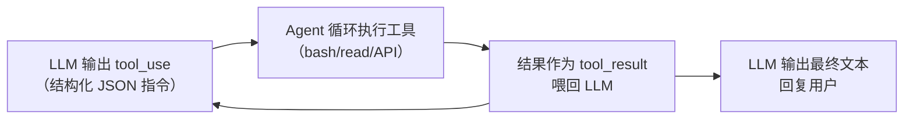

# $\rm Chapter \, R6$ 复习总结：第六阶段

> 第六阶段横跨两条线：AI 工程（第 33–37 章：API、Prompt、Skills、Harness、Agent）与计算机的另一面（第 38–42 章：GPU、图像、音频、3D、移动系统）。这两条线彼此独立、概念密度高，正是最容易“看了后面忘了前面”的阶段。这一章不教新东西，只帮你把已经学过的东西重新取出来——取出成功与否，决定这些概念是留在长期记忆里，还是只停留在“眼熟”。

## $\rm \S \, R6.1$ 本章任务

第六阶段学了两类相互独立的东西。一类是“怎么把 AI 变成工程系统”：API 的三种交互模式与 token 计费、工程级 prompt 的要素、Skill 与 Hook 两种机制、Harness 五原则、Agent 的推理-行动循环与三层记忆、RAG 与微调的分工。另一类是“天天在用但没拆开过的计算机”：GPU 的轻核与显存、图像的像素与色彩空间、音频的采样与奈奎斯特定理、3D 的光栅化与光线追踪、iOS 与 Android 的内核与沙盒。

这些章节之间没有强依赖，一次性线性读完后，倒摄干扰会把前面的概念挤出去。重读一遍只能增加“眼熟感”，不会加深记忆痕迹；只有闭卷提取——不看正文写出“上下文窗口是什么、Agent 循环怎么转、显存里放了什么”——才是在真正巩固。遗忘曲线在 24 小时内带走大部分内容，而提取练习正是对抗它的手段。

本章按固定结构展开：先闭卷回忆（R6.2），再复读心智模型（R6.3），再交错练习（R6.4），对照易混点（R6.5），最后到 R6.6 对答案。全程不引入任何新知识；如果你的答案与正文不一致，问题不在“记性差”，而在“当初没有把概念装进长期记忆”——回读来源章节再重做一次即可。

这一阶段与其他阶段还有一个不同：它的大部分内容不是“操作”而是“概念连接”。写一个 CLAUDE.md、跑一条 `nvidia-smi` 都很简单，难的是把请求-响应、上下文窗口、Agent 循环、显存、RAG 这些概念连成一张网。概念网一旦断裂，后面第 43–46 章的操作会变得不可理解；而这张网只能靠你自己提取练习来巩固，没有人能替你回忆。

## $\rm \S \, R6.2$ 闭卷回忆清单

先合上书本。每道题先在心里写出或说出答案，再跳到 R6.6 核对；写不出来的题，回读对应章节，不要直接看答案。答案与题目分离，题目下没有任何提示。

建议的用法：今天做一遍，把写不出的题目标记出来；隔一天再做一遍，重点做标记过的题——这就是间隔复习。全部能写出来时，你才算真正掌握了这一阶段。

> 节奏建议：做完 R6.2 后休息 10 分钟再对答案；三天后重做标记过的题；一周后只做全部 12 题。间隔越长、提取越费力，记忆越牢固——这正是遗忘曲线的正面用法。

### $\rm \S \, R6.2.1$ AI 工程：模型、API 与 Prompt（第 33、34 章）

1. 不看正文，写出 AI 编程的三个层次 L1/L2/L3。
   - 每一层：AI 能做什么？它的上下文范围是什么（零散／当前文件／整个项目）？
   - 你现在用 AI 的方式落在哪一层？L3 的 Agent 和 L1 的聊天有什么本质差异？
   - 举一个你实际用过的 AI 场景，判断它属于哪一层。

2. 写出三种 API 交互模式：对话模式、工具调用（Tool Use）、嵌入（Embeddings）。
   - 每种模式返回什么？解决什么问题？
   - 哪一种模式是 Agent 的基础？为什么？
   - 嵌入产生的向量用来做什么？RAG 和它有什么关系？

3. 写出一个工程级 prompt 至少应包含的要素（五个以上）。
   - 为每个要素配一个“它在问什么”的问题（例如“上下文”在问：项目是什么？已有代码是什么？）。
   - 解释：为什么“你是一个世界级的、顶尖的、超级聪明的程序员……”这类修饰词不能提升答案质量？
   - 哪些要素是“几乎总是需要”的？

4. Skill 和 Hook 都是 Claude Code 的机制。
   - 它们分别是什么？由谁触发（用户、模型还是事件）？
   - 各自配置或存放在哪里？Skill 文件的 frontmatter 需要哪两个字段？
   - 如果希望“每次写完文件自动跑测试”，应该用 Skill 还是 Hook？为什么？

5. 写出 Harness 的五个设计原则。
   - 各用一句话说明它防止了什么失败（例如“自动验证”防止了什么）。
   - 你正在读的这套教材里，哪几个文件是“规则外置”的实例？
   - 五原则里，哪一条直接要求密钥不进仓库？

### $\rm \S \, R6.2.2$ Agent 与检索增强（第 36、37 章）

6. 不看正文，写出 Agent 推理-行动循环的完整流程。
   - LLM 输出的内容是什么格式（写出关键字段）？循环执行工具后把什么喂回 LLM？
   - 循环什么时候结束？如果工具执行失败，错误信息应该去哪？
   - tool_use 和 tool_result 是靠哪个字段配对的？

7. 写出 Agent 的三层记忆。
   - 各自存储什么、生命周期多长、用什么实现（上下文窗口／摘要／向量数据库）？
   - 哪一层就是 RAG 的检索层？工作记忆的容量上限是什么？
   - 为什么说工作记忆的容量上限就是上下文窗口？

8. RAG（检索增强生成）解决什么问题？
   - 从用户提问到模型回答，写出完整的流程（至少四步）。
   - 为什么说它和数据库的“索引加速查询”是同一个思路？
   - RAG 需要微调模型吗？为什么？

### $\rm \S \, R6.2.3$ 多模态与计算硬件（第 35、38、39 章）

9. 扩散模型生成图片的两个过程分别是什么？
   - 当前多模态大语言模型的主流架构（不是从头训练的那种）是什么？
   - “拼接式”和“原生多模态”的主要区别是什么？LoRA 为什么“廉价”？
   - LoRA 和全参数微调在“修改对象”上有什么不同？

10. 为什么说显存是 AI 训练的第一瓶颈？
    - 训练一个 70 亿参数模型时，显存里至少需要放下哪几类数据？
    - 一张 12 GB 显存的消费卡能训练它吗？能只推理不训练吗？
    - 核心数很多但显存小，能训练大模型吗？为什么？

11. CUDA Driver 和 CUDA Toolkit 有什么区别？
    - 运行 `nvidia-smi` 时右上角显示的 CUDA 版本是什么含义？
    - 用 PyTorch 时需要单独安装 CUDA Toolkit 吗？为什么？
    - Driver 和 Toolkit 的版本关系是什么？

12. 刷新率和帧率分别是什么？
    - 两者相互独立意味着什么（帧率高于刷新率、低于刷新率各发生什么）？
    - G-Sync / FreeSync 解决了什么问题，和 VSync 有什么不同？
    - 60 Hz 的一帧是 16.7 ms——这和游戏引擎主循环的时间预算有什么关系？

## $\rm \S \, R6.3$ 核心心智模型复读

以下是第六阶段反复出现的锚点概念。复读它们的目的不是重新学习，而是把散在各章的用法挂回同一个心智模型上，让分散的知识组块。逐条复读时先在心里默写一遍再对正文：能复述出来才算过。每条锚点后面附了“边界”——这是读者最容易理解过头的地方，也是把概念用准的分界线。

### $\rm \S \, R6.3.1$ 请求-响应：API 交互的骨架（首次定义：第 23 章）

HTTP 遵循严格的请求-响应模式：客户端发送一个请求，服务器返回一个响应（[第 23 章](../04-网络/23-网络基础到HTTP.md) §23.3.1）。API 调用是同一个骨架——你把一组 user/assistant 消息打包成一次请求发给模型，模型返回一次响应（[第 33 章](../10-AI工程/33-AI工程概览.md) §33.3.1）。关键推论：每次请求是独立的，模型没有跨请求记忆；要维持对话连续性，必须把历史消息一并发送。

这个骨架贯穿整个阶段：RAG 是“请求里多塞一段检索结果”，Agent 循环是“请求里多塞一段工具结果”——它们都没有改变“一次请求一次响应”的基本形状，只是让每次请求携带的内容更丰富。请求-响应本身无状态，跨轮次的“记得”要靠把历史塞进下一次请求（工作记忆），或靠摘要和向量数据库（情节记忆、语义记忆，第 37 章 §37.2.1）。

**边界**：不要把“请求-响应无状态”误当成“模型不能处理长对话”——模型当然能处理很长的单次请求（200K 上下文），无状态指的是“下一次请求默认不记得上一次”。“记得”要靠把历史塞回请求，或交给记忆系统。

### $\rm \S \, R6.3.2$ token 与上下文窗口（首次定义：第 33 章）

token 是模型处理文本的最小单位——不是单词也不是字符，粗略估算英文约 4 字符/1 token、中文约 1.5 汉字/1 token；计费按输入 token 数 + 输出 token 数，输出更贵（[第 33 章](../10-AI工程/33-AI工程概览.md) §33.3.3）。上下文窗口是一次请求能容纳的 token 上限（如 200K）——窗口内的所有内容（system prompt、对话历史、工具结果）在同一轮“竞争注意力”。

窗口是有限资源，所以有两类管理手段：检索——不把整个项目塞进 prompt，先让模型 Glob 找到相关文件、Read 它们，再基于检索结果回答（[第 34 章](../10-AI工程/34-Prompt工程与Skills.md) §34.4.2）；动态工具选择——几十个工具的描述全塞进 system prompt 会占满窗口，先给少量高层工具（搜索代码、读文件、写文件），按需再加载专用工具（[第 37 章](../10-AI工程/37-AI-Agent深度解析.md) §37.1.3）。200K 看起来很大，但 20 次工具调用加结果就能吃掉一大半（§37.2.1）。

**边界**：200K 上下文窗口不是“读多少都不会溢出”，而是“塞多少都能装下但注意力会被稀释”——信息过载照样发生，所以“先检索再回答”不是可选项而是必要手段。窗口计量直接决定成本：输入和输出都按 token 计费，输出更贵。

### $\rm \S \, R6.3.3$ Agent 循环：LLM 的输出是指令不是答案（首次定义：第 37 章）

Agent 和普通 Chat 的核心区别不在模型，而在系统结构：模型被放进了一个循环里（[第 37 章](../10-AI工程/37-AI-Agent深度解析.md) §37.1.1）。LLM 的输出不是给用户看的文本，而是给循环看的指令——结构化 JSON（tool_use：工具名 + 参数）；循环执行工具后把结果以 tool_result 喂回，直到 LLM 输出没有 tool_use 的最终文本：



支撑这个循环的细节都在说同一件事——把“下一步做什么”的决策权交给循环，而不是交给一次性 prompt：tool_use/tool_result 的 JSON 往返（§37.1.2）；工具执行失败时，错误信息也要作为 tool_result 送回而不是丢弃（第 37 章 §37.8）；ReAct 的 Thought/Action/Observation 不是三个 API，只是 prompt 编码的输出格式（§37.3.1）。单次 prompt 只适合理解、解释和简单生成；需要“搜索→观察→修改→验证”反复迭代的复杂任务必须交给 Agent 循环（[第 34 章](../10-AI工程/34-Prompt工程与Skills.md) §34.4.3）。

**边界**：Agent 循环不是“让模型无限自由发挥”——真实工具用 `--max-turns N` 限制最大工具调用轮数，防止失控（[第 33 章](../10-AI工程/33-AI工程概览.md) §33.4.1）；权限配置（permissions 的 allow/deny 白名单）从外部限制它能执行的操作（第 34 章 §34.3.5）。循环本身不换模型——同一个模型放进循环和不放进循环，行为完全不同。

### $\rm \S \, R6.3.4$ 显存与带宽：AI 训练的第一瓶颈（首次定义：第 38 章）

比喻（[第 38 章](../03-计算机系统/38-GPU-CUDA与AI计算.md) §38.1.1）：CPU 像一个大厨——什么菜都会做、每道菜做得很快（低延迟）；GPU 像一万个厨房帮工——每个只会切洋葱，但同时切一万个洋葱比大厨快得多。AI 训练就是“同时切一万个洋葱”（大量相互独立的矩阵乘法），所以 GPU 碾压 CPU。显存是 GPU 自己的内存池：独立焊接的内存芯片，通过超高带宽总线连接 GPU 核心；CPU 不能直接访问显存，数据交换必须走 PCIe（§38.1.2）。

这个模型的落地推论：训练时显存要同时放下参数、梯度、优化器状态和激活值——70 亿参数模型 FP16 权重约 14 GB，训练实际需要 40–60 GB，这就是 12 GB 游戏卡训不了大模型的原因（§38.1.2）。选卡时显存是第一筛选条件：消费卡 8–24 GB、工作站卡 20–32 GB、数据中心卡 40–192 GB，价格与散热方式也随之分档（§38.5）。验证环境时，`torch.cuda.is_available()` 返回 True 才说明 PyTorch 真的在用 GPU（§38.4.2）。

**边界**：`nvidia-smi` 的 GPU-Util 高不等于高效——利用率只是“忙碌程度”，不代表算得巧（第 38 章 §38.6）；训练时显存不够的表现是报错（OOM），而不是“变慢”。显存不能与系统内存互换：即使系统 RAM 有 64 GB，模型放不进 12 GB 显存照样跑不了。

### $\rm \S \, R6.3.5$ 嵌入与 RAG：语义检索（首次定义：第 33 章，深化：第 36 章）

嵌入把文本转换成固定长度的数字向量，语义相近的文本向量距离近；RAG（检索增强生成）就是“先从知识库中检索相关内容，再让模型基于检索结果回答”（[第 33 章](../10-AI工程/33-AI工程概览.md) §33.3.1）。它解决的核心问题是：模型知识截止于训练日期，且无法访问你的私有数据（[第 36 章](../10-AI工程/36-AI前沿与AI4Science.md) §36.2.3）。

比喻（第 36 章）：这和数据库的“索引加速查询”是同一个思路——不遍历所有数据（不把所有文档塞进 LLM 的上下文），先检索出相关部分，只给 LLM 看这些。向量检索让“语义相似”取代了“关键词匹配”：两句话关键词完全不同，向量距离却可能很近，Agent 因此能“想起”相关的事（[第 37 章](../10-AI工程/37-AI-Agent深度解析.md) §37.2.2）。RAG 与微调的分工（第 36 章 §36.3.1）：基于私有文档回答事实问题、知识频繁更新用 RAG；要稳定学会新行为模式（如特定输出格式）、高度专业化领域才用微调；模型已具备的能力两者都不用。

**边界**：RAG 只给模型提供“读到的资料”，不改变模型能力本身——它解决“模型不知道你的私有数据”，不解决“模型推理弱”（后者靠更强的模型或微调，第 36 章 §36.3.1）。所以判断“该不该上 RAG”先问：模型缺的是资料还是能力？

### $\rm \S \, R6.3.6$ Harness 五原则（首次定义：第 34 章）

Harness（挽具、线束）是把 prompt、规则、验证和模型选择组织成一个可复现 AI 工程系统的整套环境（[第 34 章](../10-AI工程/34-Prompt工程与Skills.md) §34.3.1）。五个原则（§34.3.3）：**规则外置**——行为规范写在 CLAUDE.md 和 Hook 脚本里，不在每次对话时口头重复，规则文件是唯一真相来源；**自动验证**——每次输出后自动检查，人可能忘记，脚本不会；**模型可替换**——改一行配置就能换模型，Harness 不绑定特定厂商；**最小权限**——真实密钥只放在被 .gitignore 排除的本地配置里，权限白名单限制 AI 能执行的操作；**可复现**——任何人配置好自己的密钥、运行启动脚本，就能在同样的约束下产出同样质量的输出。

这套原则的落地形态（§34.3.1 的架构图）：CLAUDE.md 承载角色与规则，settings.json 与 settings.local.json 承载模型选择、密钥与 Hooks，Hook 脚本做自动验证，启动脚本做环境注入。你正在读的这套教材，本身就是这个 Harness 的产物——它的 CLAUDE.md、Hook 检查、章节结构约定，全部是“规则外置 + 自动验证”的现实例证。

**边界**：五原则不是口号而是可验证的配置——权限白名单（allow/deny）能真正阻止“删掉所有文件”这类越权指令（第 34 章 §34.3.5 的 settings.json 示例）；Hook 的“不依赖记忆”体现在每次 Write/Edit 后自动跑脚本——即使模型忘了检查，脚本也会跑。Harness 面向的是“持续产出”的工作流，一次性问答不需要它。

### $\rm \S \, R6.3.7$ 模型选择：四个维度的权衡（首次定义：第 33 章）

模型没有绝对的“最好”——选择是在推理深度、成本、延迟、隐私四个维度上的权衡（[第 33 章](../10-AI工程/33-AI工程概览.md) §33.2、§33.2.3）。一个典型的工程配置是主模型（Opus/Pro 级）做规划与综合写作，子任务模型（Haiku/Flash 级）做轻量搜索和检查（§33.2.3 的关键认知）。这套教材的 Harness 本身就是这个分工的实例：主 Agent 写作，子任务模型做检查。

**边界**：这个框架只解决“用哪个模型”，不解决“要不要本地部署”——隐私与预算约束下，本地开源模型（Llama 等）是第四种选择（§33.2 的对比表）。选型的结论必须用真实任务验证：把同一个 prompt 分别发给不同模型，对比质量、速度与成本，而不是凭印象下结论（§33.5 实践三）。

**把锚点串起来**：请求-响应是无状态骨架 → token 与上下文窗口决定每次请求能带多少东西 → 模型选择是在推理深度、成本、延迟、隐私之间的权衡 → Agent 循环把“下一步做什么”交给循环 → 显存决定模型能不能跑 → RAG 用检索给模型补资料 → Harness 用规则和验证把这一切变成可复现的系统。这七条锚点不是并列清单，而是一条从“一次调用”到“一个工程系统”的递进链。

## $\rm \S \, R6.4$ 交错练习

以下三组练习刻意打乱章节顺序、混合多章概念，对抗“学了后面只会后面”。每组题目都跨章：组一考“怎么把需求变成模型能稳定执行的输入”，组二考“模型自己干活时循环怎么转、出错怎么办”，组三考“数字媒体背后的量与比较”。每题先独立作答，答案统一在 R6.6，不要先翻答案。

做题纪律：每道题限时 5 分钟，写不出就跳过——空着比蒙对更有价值，它告诉你要回读哪里。

### $\rm \S \, R6.4.1$ 组一：Prompt 设计与模型选型（第 33、34、36 章）

**练习 1**（第 34 章）：给论文管理器写一个“批量打标签”的 prompt：输入是一批论文标题，输出是每篇的 3–5 个标签。要求包含角色、上下文、任务、约束、输出格式五个要素，并逐个说明每个要素在这个任务里分别起什么作用。最后说明：为什么这个 prompt 比“帮我给这些论文打标签”这种一句话版本更可能产出可直接使用的结果？

**练习 2**（第 36 章）：判断下面三个场景各该用 RAG、微调还是都不用，并说明理由：
- a) 让模型基于你的私有文档回答“后端用的什么数据库”；
- b) 让模型学会按公司内部 JSON Schema 输出（prompt 工程试过多次仍不稳定）；
- c) 让模型用 Python 标准库写一个解析 CSV 的脚本。

**练习 3**（第 33 章）：任务：每月给约 $10^4$ 篇论文打标签，API 预算 50 美元/月。先列出你会在“推理深度、成本、延迟、隐私”四个维度上做的权衡，再说明为什么“选择某个模型”在这里不是信仰问题。如果预算降到 5 美元/月，你的方案怎么变？

**练习 4**（第 34 章）：你的程序要消费模型的输出（自动化流水线）。为什么“在 prompt 里写'请返回 JSON'”不可靠？结构化输出（tool_use / JSON Schema）和它有什么本质区别？

### $\rm \S \, R6.4.2$ 组二：Agent 流程与排障（第 37 章为主，穿插第 33、34 章）

**练习 1**（第 37 章）：任务“统计项目中所有 TODO，按文件分组，输出 Markdown 表格”。写出 ReAct 循环的前四轮，每轮包含 Thought（思考）、Action（行动：工具名 + 参数）、Observation（观察到的结果）。至少用上 bash 和 read 两个工具。想一想：循环里每一步的 Action 结果，最终以什么身份回到 LLM？如果第一步 grep 返回空（项目里没有 TODO），循环会怎样发展？

**练习 2**（第 37 章）：LLM 返回了一个 tool_use，内容是读取 `src/main.cpp`，但工具执行时发现文件不存在。Agent 循环接下来应该把什么喂回 LLM？如果这是一个 Reflexion Agent，它还会额外做什么？这和“在代码里踩坑后写注释提醒未来的自己”有什么共同点？

**练习 3**（第 37 章）：“给论文管理器加 CSV 导出功能”由 Planner、Coder、Reviewer 三个 Agent 协作完成。写出每个 Agent 的职责，并选择一种 Agent 间通信方式说明数据怎么传递。为什么不让同一个 Agent 既写代码又审查自己刚写的代码？

**练习 4**（第 34、37 章）：为你的项目设计一个 `/release` Skill：写出 frontmatter（name、description）和正文步骤（至少三步：跑测试、构建、打 tag）。再说明：这个 Skill 和一个“每次修改后自动跑测试”的 Hook 各自解决什么问题、由谁触发？

### $\rm \S \, R6.4.3$ 组三：GPU 与多媒体：计算与比较（第 38、40 章计算，第 39、41、42 章比较）

**练习 1**（第 38 章）：在装有 NVIDIA 驱动的机器上运行下面命令，记录“总显存”：

```bash
nvidia-smi
```

运行方法：Windows 的 PowerShell 或 Linux 终端直接运行（两个平台通用，无需参数）。观察：右上角的 CUDA 版本、Memory-Usage 一行（显存占用/总量）、Processes 列表（谁在占用 GPU）。如果命令不存在，说明系统没有安装 NVIDIA 驱动。然后回答：一个 70 亿参数模型 FP16 权重约 14 GB，训练时还要放梯度、优化器状态和激活值——你的卡能训练它吗？能只推理不训练吗？为什么？

**练习 2**（第 40 章）：CD 音质是 44100 Hz 采样率、16-bit 位深度、双声道。不压缩的 WAV 一分钟大约多大（按字节估算，写出算式）？同一个文件转成 128 kbps 的 MP3 后大约多大？为什么能小这么多？为什么电话语音用 8000 Hz 就够了，而音乐必须用 44100 Hz？

**练习 3**（第 41、40、42 章）：分别用一句话区分三对概念，并各指出一个使用场景：光栅化 vs 光线追踪；ASR（语音识别）vs 说话人识别；Flutter vs React Native。

**练习 4**（第 39 章）：一个 1080p60 的视频，每帧约 6 MB，原始未压缩数据率是多少（写出算式）？为什么一部 2 小时电影压缩后只要 2 GB 左右？视频编码靠哪三类帧（I/P/B）解决这个问题？

## $\rm \S \, R6.5$ 易混点对照

本阶段最容易混淆或忘记的五组概念。对照完表格后，合上它，自己默写每组“区别”和“记忆锚点”，写不出来的回读对应章节：

| 易混对象 | 区别 | 记忆锚点 |
|---|---|---|
| 模型 / 权重 / 推理 | 模型是架构 + 训练得到的权重（一堆参数）；推理是用权重对输入计算输出的过程；prompt 不改变权重，只改变问题描述的质量 | “魔法咒语”无效，因为模型能力在加载时就已确定；想改能力要靠微调/LoRA（第 34 章 §34.4.1、第 36 章 §36.3.2） |
| token / 上下文窗口 | token 是模型处理文本的最小单位（英文约 4 字符/1 token，中文约 1.5 汉字/1 token）；上下文窗口是一次请求能容纳的 token 上限（如 200K） | token 是计量单位，窗口是容器：容器满了旧内容被挤出，所以要先检索再回答（第 33 章 §33.3.3、第 34 章 §34.4.2） |
| Skill / Hook | Skill 是用户或模型主动调用的预定义斜杠命令（`/review`），是按需加载的指令文件；Hook 由事件自动触发（每次 Write/Edit 后运行检查脚本），配置在 `.claude/settings.json` | Skill 你叫它才动；Hook 事件一来自动动——“人可能忘记，脚本不会”（第 34 章 §34.2.3、§34.2.4） |
| Agent / 普通 Chat | Chat 是一次输入一次输出的独立交互；Agent 把 LLM 放进推理-行动循环：输出 tool_use 指令→执行工具→喂回结果→直到输出最终文本 | LLM 的输出对 Agent 是“指令”不是“答案”；多步骤任务需要循环，单次 prompt 只够理解与简单生成（第 37 章 §37.1.1、第 34 章 §34.4.3） |
| 显存（VRAM）/ 系统内存（RAM） | 显存是焊接在显卡上的独立内存，通过超高带宽总线连 GPU 核心，CPU 不能直接访问；系统内存归 CPU 使用；两者交换必须走 PCIe | GPU 是一台“小电脑”，有自己的内存池；权重、梯度、优化器状态都必须在显存里（第 38 章 §38.1.2） |

特别注意第一行：“模型能力在加载时就已确定”是理解 prompt 工程、微调、RAG 三者关系的分水岭——prompt 只改变输入质量，微调/LoRA 才改权重，RAG 只加资料。三者各管一段，混在一起用反而会选错工具。

自检方法：合上表格，给自己出五道一分钟判断题——“prompt 能改变模型权重吗？”“token 和上下文窗口，谁是计量单位、谁是容器？”“Skill 和 Hook，谁由事件自动触发？”“Agent 和 Chat，谁把 LLM 放进循环？”“显存不够时，是变慢还是直接报错？”——全部答对再进入下一节，答错的回读对应章节。

## $\rm \S \, R6.6$ 答案与提示

答案与题目分离，先独立作答再看。每条答案标注来源章节；写错或写不出的题，先回读来源章节，再重做一次。判分方法：不要对自己手软——和正文不一致就算错，答案里的“来源”章节就是你的回读地图。

### $\rm \S \, R6.6.1$ 闭卷回忆清单答案

1. L1 对话式辅助：网页版提问→复制粘贴代码，上下文零散；L2 编辑器内补全：Copilot/Cursor 的 Tab 补全与自然语言修改，上下文是当前文件；L3 Agent 自主执行：读写文件、运行命令、执行 Git 操作、理解整个项目。层级越高，AI 越像队友而不是工具——它从“替你查资料”变成“替你干活”（来源：第 33 章 §33.1、§33.6）。

2. 对话模式：发送 user/assistant 消息，模型返回文本，每次请求独立、无记忆；工具调用（Tool Use）：模型返回“想调用哪个函数、参数是什么”，你的代码执行后把结果发回模型继续推理——这是 Agent 的基础；嵌入：把文本变成固定长度向量，语义相近的向量距离近，用于搜索和 RAG（来源：第 33 章 §33.3.1）。

3. 要素：角色、上下文、任务、约束、示例（few-shot）、输出格式、验证；其中上下文和任务几乎总是需要。修饰词无效：prompt 不改变模型的能力（权重已固定），只改变问题描述的质量，堆砌“世界级/顶尖”不能提升准确性，还可能增加自我参考偏差（来源：第 34 章 §34.1.2、§34.4.1）。

4. Skill 是自定义斜杠命令，由用户或模型主动调用（输入 `/review`），是放在 `.claude/skills/` 目录下的 Markdown 文件，frontmatter 含 name 和 description 两个字段，正文写执行步骤；Hook 由事件自动触发（如每次 Write/Edit 后运行检查脚本），配置在 `.claude/settings.json`。Skill 按需加载，Hook 保证执行（来源：第 34 章 §34.2）。

5. 规则外置——防止每次对话重新口头交代规则、规则漂移；自动验证——防止人忘记检查，脚本保证每次输出都被检查；模型可替换——防止被单一厂商锁定；最小权限——防止 AI 越权执行危险操作、密钥泄露进仓库；可复现——防止“换个人、换个环境就产出不同质量”。教材里的实例：CLAUDE.md（写作规则）、`.claude/settings.json` 与 `.claude/hooks/validate-textbook.ps1`（Hook 与检查脚本）（来源：第 34 章 §34.3.1、§34.3.3）。

6. LLM 返回 tool_use 结构化 JSON（name = 工具名，input = 参数）→ Agent 循环解析并执行工具 → 结果以 tool_result（含 tool_use_id）送回 LLM → LLM 继续推理（可能再调工具）→ 直到 LLM 输出没有 tool_use 的最终文本，循环结束并回复用户。工具执行失败时，错误信息同样作为 tool_result 送回，而不是丢弃（来源：第 37 章 §37.1.1、§37.1.2、§37.8）。

7. 工作记忆：当前对话的上下文窗口，生命周期是一次对话；情节记忆：对话历史摘要（简单实现是摘要文本，复杂实现存向量数据库），跨对话保留“上次做了什么”；语义记忆：向量数据库中的文档/知识库（RAG 的检索层），持久存在。语义记忆就是 RAG 的检索层；工作记忆的容量上限就是上下文窗口（来源：第 37 章 §37.2.1）。

8. 问题：LLM 知识截止于训练日期，且无法访问你的私有数据。流程：用户提问→把问题转成查询、从知识库检索最相关的片段→把片段和问题一起发给 LLM→LLM 基于资料回答而不是编造。和“索引加速查询”同思路：不遍历所有数据，先定位相关部分。RAG 不需要微调模型——它只改变输入给模型的内容，不改变权重（来源：第 36 章 §36.2.3、§36.3.1）。

9. 正向过程（加噪）：把清晰图片逐步加高斯噪声，足够多步后变成纯噪声；反向过程（去噪）：训练好的模型从纯噪声开始逐步去噪，每一步向文字描述的方向靠拢，最终生成清晰图片。多模态 LLM 的主流架构是“视觉编码器 + 预训练语言模型”的拼接：图片经编码器变成图片 token，与文本 token 混在一起输入语言模型。拼接式用现成编码器、工程上便宜；原生多模态（如 Gemini）从训练一开始就统一处理多种模态，整合更自然但训练成本高。LoRA 廉价是因为它不修改原模型权重，只在旁边附加小型可训练矩阵（来源：第 35 章 §35.2.1、§35.3.1、§35.7）。

10. 因为模型的参数、梯度、优化器状态（如 Adam 动量）和激活值（前向传播的中间结果）都必须放进显存——显存不够就无法运行该规模的模型，核心数和带宽只影响运行的快慢。70 亿参数模型 FP16 权重约 14 GB，训练实际需要 40–60 GB，12 GB 消费卡放不下——连只推理都不行，因为 14 GB 权重本身已超出 12 GB（来源：第 38 章 §38.1.2、§38.8）。

11. Driver 是随系统安装的硬件驱动，可独立升级；Toolkit 是开发包（编译器 + 库），Driver 版本 ≥ Toolkit 版本即可。`nvidia-smi` 右上角显示的是 Driver 支持的最高 CUDA 版本，不是已安装 Toolkit 的版本。PyTorch 自带一份 CUDA 运行时（`torch` 的 CUDA build），不需要单独装 CUDA Toolkit（来源：第 38 章 §38.4.1）。

12. 刷新率是显示器每秒重绘屏幕的次数（Hz），帧率是 GPU 每秒渲染新画面的次数（fps），两者独立：帧率高于刷新率时多余帧白耗 GPU，低于时显示器反复显示同一帧。G-Sync/FreeSync 让显示器刷新率动态匹配 GPU 帧率，既消除画面撕裂又没有 VSync（固定刷新率下强制同步）带来的额外延迟。60 Hz 的一帧是 16.7 ms，游戏引擎主循环（输入→物理→AI→渲染→音频）必须在这一预算内完成，否则掉帧、玩家感知为卡顿（来源：第 39 章 §39.3.1、第 38 章 §38.2.2、第 41 章 §41.2.1）。

### $\rm \S \, R6.6.2$ 交错练习答案

**组一（信息完备性与任务-手段匹配）**：

- 练习 1：参考结构——角色：“你是论文标签分类助手”；上下文：“论文管理器项目，输入为标题列表，领域是计算机科学”；任务：“对每篇论文输出 3–5 个标签”；约束：“标签用中文、每篇不超过 5 个、不编造标题里没有的领域”；输出格式：“返回 JSON 数组，形如 [{title, tags}]”。作用：角色定风格与深度，上下文消除猜测，任务定义输入输出，约束定质量标准，输出格式让结果可被程序消费。信息完备性决定输出质量——一句话版本缺上下文和约束，模型只能猜（来源：第 34 章 §34.1）。

- 练习 2：a) RAG——基于私有文档回答事实问题正是 RAG 的典型场景；b) 微调——需要稳定学会新行为模式（特定输出格式）且 prompt 工程不稳定；c) 都不用——写标准库 CSV 脚本是模型已具备的能力，一个约束清楚的 prompt 就够（来源：第 36 章 §36.3.1）。

- 练习 3：先用低成本模型（如 Haiku/Flash 一类）批量打标签：$10^4$ 篇 × 每篇约 0.00025 美元 ≈ 2.5 美元，远在预算内；若生僻领域准确率不足，再对失败样本升级到更强模型；隐私敏感（论文不能出本机）时评估本地开源模型。预算降到 5 美元/月时：要么缩小批量（只给重要论文打标签），要么换更便宜的模型或本地推理，不能继续用高成本模型硬扛。选择依据是任务在延迟、成本、推理深度、隐私上的要求，不是对某家厂商的偏好（来源：第 33 章 §33.2、§33.2.3）。

- 练习 4：prompt 里的“请返回 JSON”只是请求，模型不保证遵守（可能混入解释文字、格式漂移）；结构化输出用 JSON Schema 等机制（如 tool_use）约束模型必须按格式返回，可被程序直接验证和消费。当输出用于代码消费（自动化流水线、API 响应生成）时，结构化输出是必须的（来源：第 34 章 §34.1.4）。

回读路径：组一答错 2 题以上 → 回读第 34 章 §34.1、第 36 章 §36.3.1、第 33 章 §33.2。

**组二（循环里每一步的反馈都要回到 LLM）**：

- 练习 1：示例前两轮——Thought: 需要先找到所有 TODO；Action: bash(“grep -rn 'TODO' src/”)；Observation: 15 行匹配。Thought: 需要按文件分组统计；Action: bash(“grep -rn 'TODO' src/ | awk -F: '{print $1}' | sort | uniq -c”)；Observation: src/main.cpp:5, src/parser.cpp:3……第三、四轮可以读某个文件确认上下文（read 工具），最后生成 Markdown 表格回复。每一轮的 Action 结果都以 Observation 的形式回到 LLM——这正是“把结果喂回循环”的体现。如果 grep 返回空，循环会观察到空结果，LLM 会修正结论（报告“没有 TODO”或扩大搜索范围），而不是继续执行后续分组（来源：第 37 章 §37.3.1、§37.1.1）。

- 练习 2：把错误信息（“文件不存在”）作为 tool_result 喂回 LLM，而不是丢弃——LLM 看到反馈后会修正（检查路径拼写、换路径、或告诉用户“这个文件不存在，你是这个意思吗？”）。Reflexion 会额外生成一段反思（“应先确认文件存在再读取”）并存入长期记忆，下次遇到类似任务时作为上下文避免同样的错误。和“踩坑后写注释提醒未来的自己”是同一个心理模型，只是 Agent 自动完成了这个过程（来源：第 37 章 §37.1.2 的循环机制、§37.8、§37.3.3）。

- 练习 3：Planner 拆任务（改后端加路由、改前端加按钮、跑测试）；Coder 执行实现；Reviewer 审查 Coder 的产出。通信可选“结构化交接”（Coder 输出 JSON 给 Reviewer）或“环境状态”（Coder 写文件、Tester 读文件）。不让同一 Agent 既写又审：生成代码需要创造性、审查需要挑剔性，同一个模型在两种模式间切换会过于宽容自己的错误——这是对人类 PR 审查制衡机制的模拟（来源：第 37 章 §37.4）。

- 练习 4：frontmatter 示例——`name: release`、`description: 发布流程：测试→构建→打 tag`；正文步骤：1) 运行测试套件并确认全绿；2) 构建产物；3) 创建并推送 git tag。Skill 由用户主动调用（输入 `/release`），解决“按需执行固定流程”；Hook 由事件自动触发（每次 Write/Edit 后跑测试），解决“必须保证执行”——人可能忘记，脚本不会（来源：第 34 章 §34.2）。

回读路径：组二答错 2 题以上 → 回读第 37 章 §37.1–§37.4、第 34 章 §34.2。

**组三（量级感与同一维度比较）**：

- 练习 1：不能训练——12 GB 远小于训练一个 70B 模型所需的 40–60 GB；也不能只推理——14 GB 的权重本身就超过了 12 GB 显存，权重放不下连推理都做不了。这正说明显存是第一筛选条件：它决定“能不能跑”，核心数和带宽只决定“跑多快”（来源：第 38 章 §38.1.2）。

- 练习 2：WAV：44100 采样点/秒 × 2 字节/点 × 2 声道 × 60 秒 = 10,584,000 字节 ≈ 10 MB。MP3：128 kbps ÷ 8 = 16 KB/秒 × 60 秒 ≈ 960 KB，约为 WAV 的 1/11——因为 MP3 利用听觉掩蔽效应扔掉了“听不到的信息”（有损压缩）。电话语音只覆盖约 4 kHz 以下频段，按奈奎斯特定理 8000 Hz 采样率足够无失真还原；音乐要覆盖到人类听觉上限 20 kHz，采样率必须至少 40000 Hz，CD 的 44100 Hz 留了余量（来源：第 40 章 §40.1.2、§40.1.3）。

- 练习 3：光栅化把三角形网格投影到屏幕、逐像素着色，快，实时游戏用它；光线追踪从摄像机发射射线追踪其在场景中的弹跳，逼真但昂贵，影视渲染用它。ASR 关心“说了什么内容”（Whisper 转写，换谁的声音都能转）；说话人识别关心“是谁说的”（内容不重要，比较声纹向量相似度）。React Native 通过“桥”调用原生 UI 组件（iOS UIKit、Android Views）；Flutter 用 Skia 引擎完全自绘像素，不调用系统 UI 组件，UI 在所有平台像素一致（来源：第 41 章 §41.1.1、第 40 章 §40.2.1 与 §40.2.3、第 42 章 §42.4）。

- 练习 4：每帧 1920×1080×3 字节 ≈ 6 MB，60 帧/秒 = 360 MB/秒，2 小时 ≈ 2.5 TB——不现实。压缩靠三类手段：帧内压缩（每帧内部用类似 JPEG 的算法）、帧间压缩（相邻帧只存变化的像素和运动矢量）、关键帧（每隔一定帧数存完整 I 帧，中间只存 P/B 差异帧；拖动进度条时解码器跳到最近的 I 帧开始解码）。一部 2 小时电影压缩后约 2 GB 就是这个机制的结果（来源：第 39 章 §39.4.1、§39.4.2）。

回读路径：组三答错 2 题以上 → 回读第 38 章 §38.1、第 40 章 §40.1、第 39 章 §39.4。

## $\rm \S \, R6.7$ 衔接

第六阶段建立的能力会被接下来的选读分支和最终实践反复调用：

- **第 43 章 PyTorch 与模型训练**：直接用到第 38 章的显存模型——权重、梯度、优化器状态怎么放进显存，以及用 `nvidia-smi` 和 `torch.cuda.is_available()` 验证环境是否真的在用 GPU。
- **第 44 章多 GPU 与分布式训练**：第 38 章讲过的“数据交换必须走 PCIe/NVLink”在这里变成多卡通信的带宽瓶颈；显存计算的量级感帮你判断一个任务该分到几张卡。
- **第 45 章训练服务器运维**：第 38 章的驱动/CUDA 版本排查、第 14 章的 SSH、第 13 章的服务与日志、第 32 章的可观测性，凑成一套完整的 AI 服务器排障流程——先收集证据，再动手。
- **第 46 章贯穿项目**：把第 33–37 章的 AI 工程能力装进论文管理器——写 CLAUDE.md、设计工程级 prompt、观察 Agent 循环替你完成批量任务，这些正是 Harness 五原则的日常应用。
- **附录**：常用命令速查（附录 A）里的 `nvidia-smi`、`ffprobe`、`sox` 现在不再是无意义的黑话；术语表（附录 B）里的 token、显存、RAG、上下文窗口这些词，你已经能用一句话向别人解释清楚。

复习深度提示：第六阶段在课程清单里多数标记为“建议掌握/选读”——第 35、36、37、38–42 章按你的阅读路线决定深浅即可；但第 33、34 章的 API、Prompt 与 Harness 概念是 AI 路线（第 43–45 章）的直接前置，建议按必学对待。

最后提醒：第六阶段是全书“概念连接密度”最高的一个阶段——请求-响应→token 与上下文窗口→模型选择→Agent 循环→显存→RAG→Harness，这条链是后面所有选读章节的地基。带着这张概念网进入第 43 章，你会比直接读 PyTorch 代码时多看懂一层：每一步训练代码背后，都是“数据放进显存、通过请求-响应调用、由 Harness 保证可复现”。

*现在你能做什么：合上书本，向别人讲清楚 Agent 循环怎么转、显存里放了什么、为什么“先检索再回答”优于“全塞进 prompt”。*
